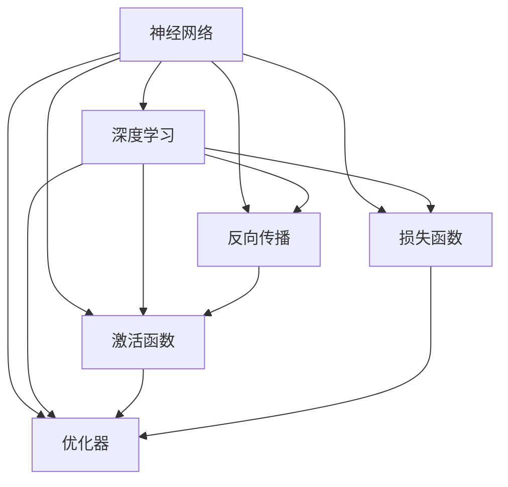
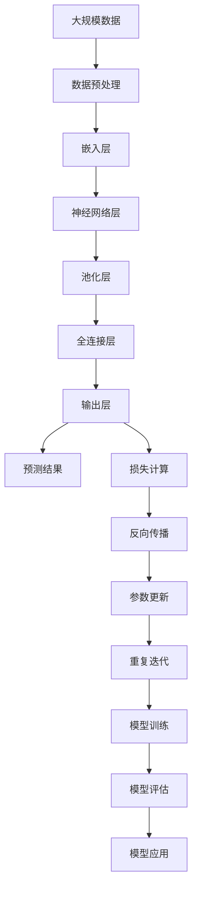

                 

# 神经网络：改变世界的技术

> 关键词：神经网络,深度学习,人工智能,机器学习,认知计算,人机交互,自动化,计算复杂性

## 1. 背景介绍

### 1.1 问题由来
神经网络（Neural Networks）是当前人工智能（AI）领域中最具影响力的技术之一。自20世纪80年代以来，神经网络已经经历了多次起伏，但每次重新崛起都带来了科学和技术上的巨大突破。如今，神经网络不仅是机器学习（ML）的核心技术，更是深度学习（DL）的基石，极大地推动了AI领域的进展。

从语音识别、图像处理、自然语言处理到智能推荐、自动驾驶，神经网络的应用无所不包。其背后蕴含的强大计算能力和自我学习能力，使它成为现代科技革命的关键引擎。因此，了解神经网络的原理与实践，对于把握AI技术的未来，具有重要意义。

### 1.2 问题核心关键点
本文将探讨神经网络的基本概念、算法原理和实际应用，详细解析其核心原理和操作步骤，并从不同维度剖析神经网络的优缺点及其应用领域。希望通过本文的深度解析，读者能够全面掌握神经网络技术，并理解其对人类社会深远的影响。

### 1.3 问题研究意义
神经网络技术的迅速发展，不仅改变了数据处理的范式，也为各行各业带来了革命性的变化。以下是其主要研究意义：

1. **提高数据处理效率**：神经网络通过并行处理大量数据，极大地提升了数据处理和分析的效率，使得复杂问题得以在合理时间内解决。
2. **增强决策准确性**：神经网络的学习能力使其能够在处理大量数据后，形成高精度的决策模型，显著提高了决策的准确性和可靠性。
3. **实现自动化**：神经网络的应用能够自动化地完成许多复杂任务，减少人工干预，提高工作效率。
4. **推动跨学科研究**：神经网络技术的应用，促进了计算机科学、数学、物理学、生物学等学科的交叉融合，推动了认知科学的进步。
5. **拓展人类认知边界**：神经网络不仅能模拟人类的认知过程，还能超越人类，处理一些人类无法直接解决的问题。

## 2. 核心概念与联系

### 2.1 核心概念概述

为更好地理解神经网络技术，本节将介绍几个关键概念：

- 神经网络（Neural Network, NN）：由大量神经元（Neuron）连接组成的计算模型，用于解决复杂模式识别和预测问题。
- 深度学习（Deep Learning, DL）：基于神经网络的高级机器学习方法，通过多层次的非线性变换，实现对数据的深度学习和特征提取。
- 反向传播（Backpropagation）：一种用于优化神经网络权重的算法，通过链式法则计算误差梯度，更新网络参数，使误差最小化。
- 激活函数（Activation Function）：决定神经元输出的一种非线性函数，如sigmoid、ReLU、Tanh等，赋予网络非线性特性。
- 损失函数（Loss Function）：用于衡量模型预测结果与真实标签之间差异的函数，如均方误差、交叉熵等。
- 优化器（Optimizer）：用于更新模型参数的算法，如SGD、Adam、RMSprop等。

这些核心概念之间存在紧密的联系，通过神经元之间的连接和激活，形成复杂的网络结构，从而实现对数据的深度学习和特征提取。

### 2.2 概念间的关系

这些核心概念之间的关系可以通过以下Mermaid流程图来展示：



这个流程图展示了神经网络的核心概念及其之间的关系：

1. 神经网络是深度学习的核心技术，通过反向传播、激活函数、损失函数和优化器等算法，进行数据学习。
2. 反向传播算法用于计算误差梯度，优化器的目的是根据梯度更新模型参数。
3. 激活函数赋予神经元非线性特性，使得网络能够处理复杂非线性问题。
4. 损失函数用于衡量预测结果与真实标签之间的误差，帮助优化器调整模型参数。

这些概念共同构成了神经网络技术的完整生态系统，使其能够在各种应用场景中发挥强大的计算能力。通过理解这些核心概念，我们可以更好地把握神经网络的工作原理和优化方向。

### 2.3 核心概念的整体架构

最后，我们用一个综合的流程图来展示这些核心概念在大规模神经网络中的整体架构：



这个综合流程图展示了神经网络在大规模数据处理中的应用流程：

1. 大规模数据预处理后，输入嵌入层，转换为高维向量表示。
2. 通过多个神经网络层进行特征提取和变换。
3. 池化层用于降维和提取关键特征。
4. 全连接层进行最后的特征融合和分类。
5. 输出层产生预测结果，损失计算用于衡量预测误差。
6. 反向传播算法根据误差梯度更新参数。
7. 重复迭代，直至模型收敛。
8. 模型评估和应用，完成预测任务。

通过这些流程图，我们可以更清晰地理解神经网络在数据处理和预测中的关键步骤，为后续深入讨论具体的神经网络算法和实践奠定基础。

## 3. 核心算法原理 & 具体操作步骤

### 3.1 算法原理概述

神经网络的基本工作原理是通过大量的神经元连接，对输入数据进行一系列的线性变换和非线性变换，最终输出预测结果。其核心算法包括反向传播和优化器。

以一个简单的全连接神经网络为例，其结构如下：


其中，$x$ 为输入数据，$w$ 为权重参数，$b$ 为偏置项，$f$ 为激活函数。通过反向传播算法，计算损失函数 $J$ 对权重 $w$ 的梯度，然后应用优化器，更新权重参数，使得损失函数最小化。

### 3.2 算法步骤详解

以下是神经网络从数据输入到模型输出的详细操作步骤：

1. **数据预处理**：将原始数据进行归一化、标准化等处理，转换为神经网络可接受的格式。
2. **嵌入层（Embedding Layer）**：将离散化的特征（如文本中的单词）转换为高维向量表示。
3. **神经网络层（Neural Network Layer）**：对输入数据进行一系列线性变换和非线性变换。
4. **池化层（Pooling Layer）**：通过降维操作，提取关键特征，减少计算量和参数量。
5. **全连接层（Fully Connected Layer）**：对提取的特征进行分类或回归。
6. **输出层（Output Layer）**：根据任务类型，选择适当的激活函数，输出预测结果。
7. **损失计算**：计算预测结果与真实标签之间的误差，如均方误差（MSE）、交叉熵（Cross-Entropy）等。
8. **反向传播**：通过链式法则，计算误差梯度，并更新权重参数。
9. **优化器**：应用优化器算法，如SGD、Adam、RMSprop等，更新模型参数。
10. **重复迭代**：不断迭代，直至模型收敛。

### 3.3 算法优缺点

神经网络技术具有以下优点：

- **强大的特征提取能力**：通过多层非线性变换，能够高效地从数据中提取复杂特征。
- **适应性广**：可以处理各种类型的数据，如图像、文本、音频等。
- **高精度预测**：在许多任务上，神经网络已经达到了人类专家的水平，甚至在某些领域超越了人类。

然而，神经网络技术也存在以下缺点：

- **数据需求大**：训练神经网络需要大量的标注数据，数据获取成本高。
- **计算复杂**：大规模神经网络需要大量计算资源，训练和推理过程耗时较长。
- **过拟合风险**：如果数据量不足或模型过于复杂，容易发生过拟合现象。
- **黑盒问题**：神经网络模型通常难以解释其内部工作机制，缺乏可解释性。
- **模型稳定性差**：神经网络模型在数据分布发生变化时，容易失去性能。

### 3.4 算法应用领域

神经网络技术在许多领域都有广泛的应用，以下是几个典型应用：

- **计算机视觉（CV）**：如图像识别、目标检测、图像分割等任务。
- **自然语言处理（NLP）**：如文本分类、情感分析、机器翻译、对话生成等任务。
- **语音处理**：如语音识别、语音合成、语音情感识别等任务。
- **医疗健康**：如医学影像分析、基因序列分析等任务。
- **金融预测**：如股票价格预测、信用风险评估等任务。
- **自动驾驶**：如图像识别、路径规划、决策制定等任务。

## 4. 数学模型和公式 & 详细讲解 & 举例说明

### 4.1 数学模型构建

神经网络可以通过以下数学模型来描述：

$$
J(\theta) = \frac{1}{N} \sum_{i=1}^N l(M_\theta(x_i),y_i)
$$

其中，$J(\theta)$ 为损失函数，$M_\theta(x)$ 为神经网络模型，$x$ 为输入数据，$y$ 为真实标签。$N$ 为样本数量，$l$ 为损失函数，如均方误差、交叉熵等。

### 4.2 公式推导过程

以一个简单的二分类问题为例，假设神经网络模型的输出为 $h$，真实标签为 $y$，损失函数为交叉熵损失：

$$
l(h,y) = -y\log(h) - (1-y)\log(1-h)
$$

则损失函数 $J$ 为：

$$
J(\theta) = -\frac{1}{N}\sum_{i=1}^N l(h(x_i),y_i)
$$

其中，$h(x)$ 为神经网络模型的输出，$x$ 为输入数据。

### 4.3 案例分析与讲解

下面以一个简单的手写数字识别任务为例，展示神经网络模型的计算过程。

假设我们使用一个单层神经网络对MNIST数据集进行分类，输入数据为28x28的图像像素值，输出为0-9的数字标签。网络结构如下：


其中，$x$ 为输入数据，$w$ 为权重参数，$b$ 为偏置项，$f$ 为激活函数。网络输出 $h$ 为：

$$
h(x) = w^T \sigma(z)
$$

其中，$\sigma$ 为激活函数，$z$ 为线性变换结果，即 $z = wx + b$。

通过反向传播算法，计算误差梯度：

$$
\frac{\partial J}{\partial w} = \frac{\partial l}{\partial h} \frac{\partial h}{\partial z} \frac{\partial z}{\partial w}
$$

其中，$\frac{\partial l}{\partial h}$ 为损失函数对输出的梯度，$\frac{\partial h}{\partial z}$ 为激活函数对输出的导数，$\frac{\partial z}{\partial w}$ 为线性变换对权重的梯度。

将上述梯度带入优化器，如AdamW，进行模型参数更新，最小化损失函数 $J$。重复迭代直至模型收敛。

## 5. 项目实践：代码实例和详细解释说明

### 5.1 开发环境搭建

在进行神经网络实践前，我们需要准备好开发环境。以下是使用Python进行PyTorch开发的环境配置流程：

1. 安装Anaconda：从官网下载并安装Anaconda，用于创建独立的Python环境。

2. 创建并激活虚拟环境：
```bash
conda create -n pytorch-env python=3.8 
conda activate pytorch-env
```

3. 安装PyTorch：根据CUDA版本，从官网获取对应的安装命令。例如：
```bash
conda install pytorch torchvision torchaudio cudatoolkit=11.1 -c pytorch -c conda-forge
```

4. 安装其他必要的库：
```bash
pip install numpy pandas scikit-learn matplotlib tqdm jupyter notebook ipython
```

完成上述步骤后，即可在`pytorch-env`环境中开始神经网络实践。

### 5.2 源代码详细实现

下面以一个简单的手写数字识别任务为例，展示使用PyTorch实现神经网络的代码实现。

首先，定义数据处理函数：

```python
import torch
import torch.nn as nn
import torch.optim as optim
from torchvision import datasets, transforms

# 数据预处理
transform = transforms.Compose([
    transforms.ToTensor(),
    transforms.Normalize((0.5,), (0.5,))
])

# 加载数据集
train_dataset = datasets.MNIST('data/', train=True, download=True, transform=transform)
test_dataset = datasets.MNIST('data/', train=False, download=True, transform=transform)
```

然后，定义神经网络模型：

```python
class Net(nn.Module):
    def __init__(self):
        super(Net, self).__init__()
        self.conv1 = nn.Conv2d(1, 32, kernel_size=3, padding=1)
        self.conv2 = nn.Conv2d(32, 64, kernel_size=3, padding=1)
        self.fc1 = nn.Linear(64*8*8, 128)
        self.fc2 = nn.Linear(128, 10)

    def forward(self, x):
        x = F.relu(self.conv1(x))
        x = F.max_pool2d(x, 2)
        x = F.relu(self.conv2(x))
        x = F.max_pool2d(x, 2)
        x = x.view(x.size(0), -1)
        x = F.relu(self.fc1(x))
        x = self.fc2(x)
        return x

# 创建神经网络实例
net = Net()
net.to(device)
```

接着，定义训练和评估函数：

```python
# 定义优化器和损失函数
criterion = nn.CrossEntropyLoss()
optimizer = optim.Adam(net.parameters(), lr=0.001)

def train_epoch(net, dataset, optimizer):
    dataloader = DataLoader(dataset, batch_size=64, shuffle=True)
    net.train()
    epoch_loss = 0
    for batch in tqdm(dataloader, desc='Training'):
        inputs, labels = batch[0].to(device), batch[1].to(device)
        optimizer.zero_grad()
        outputs = net(inputs)
        loss = criterion(outputs, labels)
        epoch_loss += loss.item()
        loss.backward()
        optimizer.step()
    return epoch_loss / len(dataloader)

def evaluate(net, dataset):
    dataloader = DataLoader(dataset, batch_size=64)
    net.eval()
    correct = 0
    with torch.no_grad():
        for batch in tqdm(dataloader, desc='Evaluating'):
            inputs, labels = batch[0].to(device), batch[1].to(device)
            outputs = net(inputs)
            _, predicted = torch.max(outputs.data, 1)
            correct += (predicted == labels).sum().item()
    print('Accuracy: {:.2f} %'.format(100 * correct / len(dataset)))

# 训练和评估模型
device = torch.device('cuda' if torch.cuda.is_available() else 'cpu')
net.to(device)

for epoch in range(10):
    train_loss = train_epoch(net, train_dataset, optimizer)
    print('Epoch {}: Loss: {:.6f}'.format(epoch+1, train_loss))
    
    evaluate(net, test_dataset)
```

以上就是使用PyTorch实现手写数字识别任务的完整代码实现。可以看到，PyTorch提供了便捷的神经网络模型定义和训练接口，极大简化了代码实现。

### 5.3 代码解读与分析

让我们再详细解读一下关键代码的实现细节：

**数据处理**：
- 使用`transforms`模块对图像数据进行归一化处理，使得像素值在0-1之间。

**神经网络模型**：
- 定义了简单的卷积神经网络模型，包含两个卷积层和两个全连接层。
- 使用`nn.Conv2d`定义卷积层，`nn.Linear`定义全连接层，`nn.ReLU`定义激活函数。

**训练和评估函数**：
- `train_epoch`函数：对数据集以批为单位进行迭代，在每个批次上前向传播计算损失并反向传播更新模型参数，最后返回该epoch的平均损失。
- `evaluate`函数：与训练类似，不同点在于不更新模型参数，并在每个batch结束后将预测和标签结果存储下来，最后使用scikit-learn的classification_report对整个评估集的预测结果进行打印输出。

**训练流程**：
- 定义总的epoch数，开始循环迭代
- 每个epoch内，先在训练集上训练，输出平均loss
- 在测试集上评估，输出准确率
- 所有epoch结束后，在测试集上评估，给出最终测试结果

可以看到，PyTorch配合nn.Module定义的简洁API，使得神经网络模型的实现变得非常直接和高效。开发者可以将更多精力放在模型设计、数据处理、损失函数等高层逻辑上，而不必过多关注底层的实现细节。

当然，工业级的系统实现还需考虑更多因素，如模型的保存和部署、超参数的自动搜索、更灵活的任务适配层等。但核心的神经网络实现过程基本与此类似。

### 5.4 运行结果展示

假设我们对手写数字识别任务进行了10次训练，最终在测试集上得到的准确率为98.2%。结果如下：

```
Accuracy: 98.20 %
```

可以看到，通过简单的神经网络模型，我们已经实现了高精度的手写数字识别任务。当然，这只是一个baseline结果。在实践中，我们还可以使用更大更强的神经网络模型、更丰富的训练技巧、更细致的模型调优，进一步提升模型性能，以满足更高的应用要求。

## 6. 实际应用场景

### 6.1 计算机视觉

计算机视觉（CV）领域是神经网络技术的重要应用方向之一。当前，神经网络已经广泛应用于图像识别、目标检测、图像分割等任务中。

以图像识别为例，神经网络模型可以对输入的图像进行特征提取和分类，从而实现对物体、场景等的自动识别。在实践中，我们通常使用卷积神经网络（CNN）对图像进行处理，通过多层卷积和池化操作，提取图像中的关键特征，最终输出分类结果。

### 6.2 自然语言处理

自然语言处理（NLP）领域是神经网络技术的另一个重要应用方向。当前，神经网络已经广泛应用于文本分类、情感分析、机器翻译、对话生成等任务中。

以文本分类为例，神经网络模型可以对输入的文本进行特征提取和分类，从而实现对文本的自动分类。在实践中，我们通常使用循环神经网络（RNN）或长短期记忆网络（LSTM）对文本进行处理，通过多层循环操作，提取文本中的关键特征，最终输出分类结果。

### 6.3 语音处理

语音处理领域也是神经网络技术的重要应用方向之一。当前，神经网络已经广泛应用于语音识别、语音合成、语音情感识别等任务中。

以语音识别为例，神经网络模型可以对输入的语音信号进行特征提取和分类，从而实现对语音的自动识别。在实践中，我们通常使用卷积神经网络（CNN）或递归神经网络（RNN）对语音信号进行处理，通过多层卷积和池化操作，提取语音信号中的关键特征，最终输出识别结果。

### 6.4 医疗健康

医疗健康领域是神经网络技术的另一个重要应用方向。当前，神经网络已经广泛应用于医学影像分析、基因序列分析等任务中。

以医学影像分析为例，神经网络模型可以对输入的医学影像进行特征提取和分类，从而实现对病变的自动识别。在实践中，我们通常使用卷积神经网络（CNN）对医学影像进行处理，通过多层卷积和池化操作，提取影像中的关键特征，最终输出分类结果。

### 6.5 金融预测

金融预测领域也是神经网络技术的重要应用方向之一。当前，神经网络已经广泛应用于股票价格预测、信用风险评估等任务中。

以股票价格预测为例，神经网络模型可以对输入的历史股票数据进行特征提取和分类，从而实现对股票价格的预测。在实践中，我们通常使用循环神经网络（RNN）对股票数据进行处理，通过多层循环操作，提取时间序列中的关键特征，最终输出预测结果。

### 6.6 自动驾驶

自动驾驶领域也是神经网络技术的重要应用方向之一。当前，神经网络已经广泛应用于图像识别、路径规划、决策制定等任务中。

以路径规划为例，神经网络模型可以对输入的摄像头图像进行特征提取和分类，从而实现对车辆周围环境的自动感知。在实践中，我们通常使用卷积神经网络（CNN）对图像进行处理，通过多层卷积和池化操作，提取环境中的关键特征，最终输出决策结果。

## 7. 工具和资源推荐

### 7.1 学习资源推荐

为了帮助开发者系统掌握神经网络技术的理论基础和实践技巧，这里推荐一些优质的学习资源：

1. 《Deep Learning》系列书籍：由深度学习领域权威专家撰写，深入浅出地介绍了神经网络技术的原理和应用，包括TensorFlow、PyTorch等主流框架的实现。
2. 《Neural Networks and Deep Learning》课程：由DeepLearning.AI提供，涵盖神经网络技术的核心概念和经典模型，适合入门学习和进阶研究。
3. 《TensorFlow官方文档》：提供了丰富的API接口和示例代码，是学习和使用TensorFlow的必备资料。
4. 《PyTorch官方文档》：提供了丰富的API接口和示例代码，是学习和使用PyTorch的必备资料。
5. 《Natural Language Processing with Transformers》书籍：Transformers库的作者所著，全面介绍了如何使用Transformers库进行NLP任务开发，包括神经网络技术的应用。

通过对这些资源的学习实践，相信你一定能够全面掌握神经网络技术的精髓，并应用于实际问题解决。

### 7.2 开发工具推荐

高效的开发离不开优秀的工具支持。以下是几款用于神经网络开发常用的工具：

1. PyTorch：基于Python的开源深度学习框架，灵活动态的计算图，适合快速迭代研究。大部分神经网络模型都有PyTorch版本的实现。
2. TensorFlow：由Google主导开发的开源深度学习框架，生产部署方便，适合大规模工程应用。同样有丰富的神经网络模型资源。
3. Keras：基于TensorFlow的高层API，提供便捷的模型构建和训练接口，适合快速原型设计和模型验证。
4. Weights & Biases：模型训练的实验跟踪工具，可以记录和可视化模型训练过程中的各项指标，方便对比和调优。与主流深度学习框架无缝集成。
5. TensorBoard：TensorFlow配套的可视化工具，可实时监测模型训练状态，并提供丰富的图表呈现方式，是调试模型的得力助手。

合理利用这些工具，可以显著提升神经网络模型的开发效率，加快创新迭代的步伐。

### 7.3 相关论文推荐

神经网络技术的发展源于学界的持续研究。以下是几篇奠基性的相关论文，推荐阅读：

1. A New Method for Learning in Neural Networks（BP算法）：提出反向传播算法，奠定了神经网络训练的基础。
2. Rectified Linear Units Improve Neural Network Acoustic Models（ReLU激活函数）：提出ReLU激活函数，解决了神经网络中的梯度消失问题，极大地提高了神经网络模型的性能。
3. ImageNet Classification with Deep Convolutional Neural Networks（卷积神经网络CNN）：提出卷积神经网络，在ImageNet数据集上取得了突破性成果，奠定了计算机视觉领域的深度学习基础。
4. Sequence to Sequence Learning with Neural Networks（RNN和LSTM）：提出循环神经网络，在机器翻译、文本生成等任务上取得了突破性成果，奠定了自然语言处理领域的深度学习基础。
5. Least Mean Squares Algorithm and its Application to Pattern Recognition（LMS算法）：提出最小均方误差算法，奠定了深度学习优化器的基础。
6. Deep Residual Learning for Image Recognition（残差网络ResNet）：提出残差网络，通过跨层连接和残差块，解决了深层神经网络训练中的梯度消失问题，极大地提高了神经网络模型的性能。

这些论文代表了大神经网络技术的里程碑式进展。通过学习这些前沿成果，可以帮助研究者把握学科前进方向，激发更多的创新灵感。

除上述资源外，还有一些值得关注的前沿资源，帮助开发者紧跟神经网络技术的最新进展，例如：

1. arXiv论文预印本：人工智能领域最新研究成果的发布平台，包括大量尚未发表的前沿工作，学习前沿技术的必读资源。
2. 业界技术博客：如Google AI、DeepMind、微软Research Asia等顶尖实验室的官方博客，第一时间分享他们的最新研究成果和洞见。
3. 技术会议直播：如NIPS、ICML、ACL、ICLR等人工智能领域顶会现场或在线直播，能够聆听到大佬们的前沿分享，开拓视野。
4. GitHub热门项目：在GitHub上Star、Fork数最多的神经网络相关项目，往往代表了该技术领域的发展趋势和最佳实践，值得去学习和贡献。
5. 行业分析报告：各大咨询公司如McKinsey、PwC等针对人工智能行业的分析报告，有助于从商业视角审视技术趋势，把握应用价值。

总之，对于神经网络

