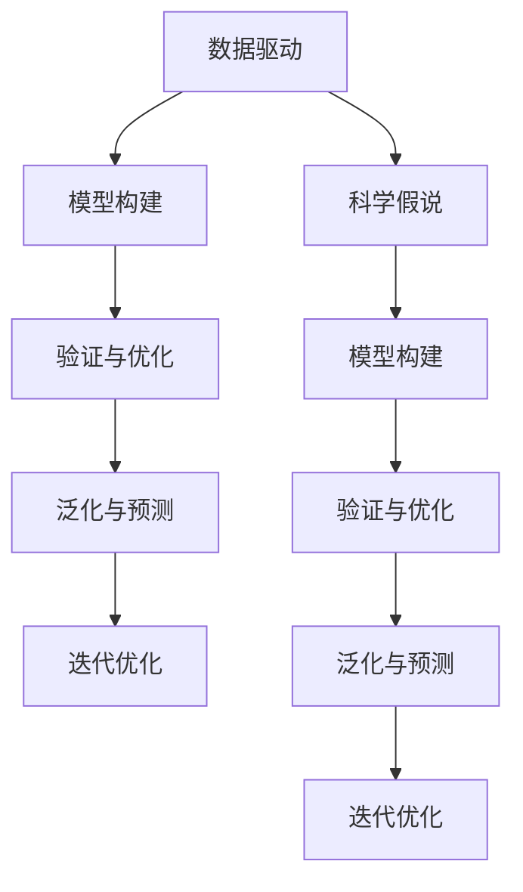
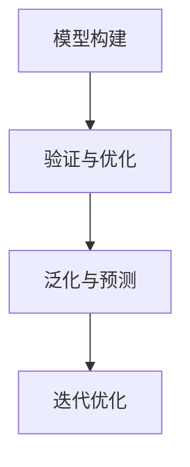
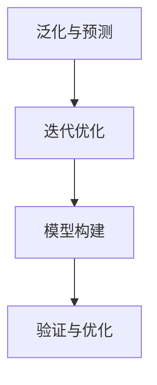
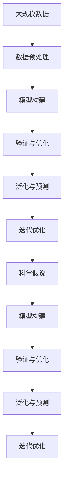

                 

## 1. 背景介绍

### 1.1 问题由来
科学研究一直是人类认识世界、探索未知的重要工具。然而，传统科学方法论往往依赖实验和观察，难以有效处理大数据背景下的复杂问题。在计算机科学领域，尤其是人工智能和机器学习领域，数据驱动的研究范式逐渐成为主流。这种范式要求研究人员从数据中挖掘出潜在的模式和规律，而非仅仅依赖理论假设和实验结果。科学方法论的演变，为数据驱动的科学研究提供了重要的方法和工具，使其更具针对性和可行性。

### 1.2 问题核心关键点
科学方法论的核心在于将复杂的现实问题抽象为数学模型，通过数据驱动的方式进行验证和优化。这种范式要求研究者具备以下能力：
1. **数据预处理**：对大规模、多源异构的数据进行清洗、归一化和特征提取。
2. **模型设计**：选择合适的数学模型和算法，构建数据驱动的决策框架。
3. **验证与优化**：通过实验和数据分析，验证模型的有效性，并不断调整优化。
4. **泛化与预测**：将模型应用到新的数据集，评估其泛化能力和预测精度。

### 1.3 问题研究意义
科学方法论的演进，对计算机科学尤其是人工智能的发展具有重要意义：
1. **提升研究效率**：数据驱动的科学方法论能够显著提高研究效率，加速科学发现。
2. **增强模型性能**：通过大规模数据的验证，可以构建更为准确、鲁棒的模型。
3. **拓展应用边界**：科学方法论为解决复杂系统问题提供了新的思路和方法，推动AI技术在更多领域的应用。
4. **促进交叉学科**：数据驱动的科学方法论跨越了传统学科的界限，促进了跨学科的合作和创新。
5. **加速产业化**：科学方法论的实践加速了AI技术的产业化进程，推动了科技成果的商业应用。

## 2. 核心概念与联系

### 2.1 核心概念概述
为更好地理解科学方法论的核心概念，本节将介绍几个密切相关的核心概念：

- **数据驱动**：基于大规模数据进行科学研究，而非仅仅依赖理论和实验。数据驱动的研究范式在计算机科学中应用广泛，特别是在人工智能和机器学习领域。
- **模型构建**：根据研究问题，选择合适的数学模型和算法，进行建模和仿真。模型的构建需要考虑数据的质量、特征选择、算法复杂度等因素。
- **验证与优化**：通过实验和数据分析，验证模型的有效性，并根据结果不断调整优化。验证与优化是模型构建的重要环节，确保模型在实际应用中的可靠性和泛化能力。
- **泛化与预测**：将模型应用到新的数据集，评估其泛化能力和预测精度。泛化能力强的模型能够处理未知数据，具备更强的实用价值。
- **迭代优化**：科学方法论强调不断迭代优化，逐步逼近问题的真实模型。迭代优化需要系统地记录和分析每一次实验结果，从中提炼经验和教训。
- **科学假说**：在科学研究中，假说是对问题的初步理解和假设，需要通过实验和数据进行验证。科学假说是科学研究的起点，也是模型构建的基础。

这些核心概念之间的逻辑关系可以通过以下Mermaid流程图来展示：



这个流程图展示了一系列科学方法论的基本流程：

1. 从数据驱动出发，构建初步模型。
2. 通过验证与优化，不断调整和改进模型。
3. 最终实现泛化与预测，评估模型性能。
4. 整个流程中，科学假说作为基础，模型构建、验证与优化、泛化与预测、迭代优化等环节相互联系，形成一个闭环。

### 2.2 概念间的关系

这些核心概念之间存在着紧密的联系，形成了科学方法论的完整生态系统。下面我通过几个Mermaid流程图来展示这些概念之间的关系。

#### 2.2.1 数据驱动与模型构建的关系


这个流程图展示了数据驱动在模型构建、验证与优化、泛化与预测、迭代优化等环节中的重要作用。数据驱动是科学方法论的基石，为模型构建提供了必要的数据支持。

#### 2.2.2 模型构建与验证与优化的关系



这个流程图展示了模型构建与验证与优化之间的相互作用。模型构建需要验证与优化来提升性能，而验证与优化也依赖于模型的构建。

#### 2.2.3 泛化与预测与迭代优化的关系



这个流程图展示了泛化与预测与迭代优化之间的相互依赖。泛化与预测需要不断迭代优化才能达到理想的效果，而迭代优化也需要基于泛化与预测的评估结果。

### 2.3 核心概念的整体架构

最后，我们用一个综合的流程图来展示这些核心概念在大规模数据驱动的科学研究中的整体架构：



这个综合流程图展示了从数据预处理到科学假说，再到模型构建、验证与优化、泛化与预测、迭代优化等各个环节的相互关系。通过这些流程图，我们可以更清晰地理解科学方法论的完整流程，为后续深入讨论具体的科学方法论实践奠定基础。

## 3. 核心算法原理 & 具体操作步骤
### 3.1 算法原理概述

数据驱动的科学方法论，本质上是利用大规模数据进行模型构建、验证与优化、泛化与预测的闭环系统。其核心算法包括：

- **数据预处理算法**：用于清洗、归一化、特征提取等，为模型构建提供高质量的数据输入。
- **模型构建算法**：如线性回归、决策树、神经网络等，用于构建数据驱动的决策模型。
- **验证与优化算法**：如交叉验证、网格搜索、梯度下降等，用于验证模型性能和优化参数。
- **泛化与预测算法**：如留出法、交叉验证法等，用于评估模型泛化能力和预测精度。
- **迭代优化算法**：如学习率调整、正则化等，用于不断改进模型，提升性能。

### 3.2 算法步骤详解

数据驱动的科学方法论通常包括以下关键步骤：

**Step 1: 数据收集与预处理**
- 收集大规模数据集，确保数据的多样性和代表性。
- 对数据进行清洗、归一化和特征提取，去除噪声和冗余信息，提取关键特征。

**Step 2: 模型选择与构建**
- 根据研究问题，选择合适的模型和算法。例如，对于回归问题，可以选择线性回归或神经网络；对于分类问题，可以选择决策树或SVM等。
- 使用优化算法（如梯度下降、Adam等）对模型进行训练，学习模型参数。

**Step 3: 验证与优化**
- 使用交叉验证、留出法等方法，将数据集划分为训练集和验证集。
- 在验证集上评估模型性能，如准确率、召回率、F1分数等。
- 根据评估结果，调整模型参数和超参数，优化模型性能。

**Step 4: 泛化与预测**
- 使用新的测试集评估模型泛化能力和预测精度。
- 根据测试结果，进一步调整模型参数和算法选择，确保模型能够处理未知数据。

**Step 5: 迭代优化**
- 根据测试结果，不断调整模型和算法，迭代优化。
- 记录每次实验结果，总结经验教训，积累科学知识。

### 3.3 算法优缺点

数据驱动的科学方法论具有以下优点：
1. **高效性**：能够利用大规模数据快速构建模型，提升研究效率。
2. **准确性**：通过数据驱动的验证和优化，构建的模型具备更高的准确性和鲁棒性。
3. **灵活性**：可以灵活调整模型和算法，适应不同的数据和问题。

同时，该方法也存在一些局限性：
1. **数据依赖**：对数据质量、数据量有较高要求，获取高质量数据成本较高。
2. **模型复杂性**：模型选择和参数调整需要专业知识，对研究者要求较高。
3. **过拟合风险**：模型对训练数据过于依赖，容易出现过拟合。
4. **计算资源需求**：大规模数据和复杂模型的训练需要高性能计算资源。

尽管存在这些局限性，但数据驱动的科学方法论仍然是当前科学研究和工程实践的主流范式，特别是在计算机科学领域，推动了AI技术的快速发展。

### 3.4 算法应用领域

数据驱动的科学方法论已经广泛应用于人工智能和机器学习等多个领域，例如：

- **图像识别**：利用大规模图像数据，构建深度神经网络进行图像分类和识别。
- **自然语言处理**：通过大规模文本数据，训练语言模型进行文本分类、情感分析、机器翻译等任务。
- **推荐系统**：基于用户行为数据，构建推荐模型进行个性化推荐。
- **金融预测**：利用金融市场数据，构建预测模型进行股票价格预测、信用风险评估等。
- **医疗诊断**：通过医疗影像和电子病历数据，训练模型进行疾病诊断和治疗方案推荐。
- **自动驾驶**：利用交通数据和传感器数据，训练模型进行路径规划和障碍物检测。

除上述领域外，数据驱动的科学方法论还在医疗、教育、交通、能源等众多领域得到了广泛应用，极大地推动了各行业的数字化转型和智能化升级。

## 4. 数学模型和公式 & 详细讲解 & 举例说明

### 4.1 数学模型构建

本节将使用数学语言对数据驱动的科学方法论进行更加严格的刻画。

记数据集为 $D=\{(x_i, y_i)\}_{i=1}^N, x_i \in \mathcal{X}, y_i \in \mathcal{Y}$，其中 $x_i$ 为输入特征，$y_i$ 为输出标签。假设模型为 $M_{\theta}$，其中 $\theta$ 为模型参数。定义损失函数为 $\ell$，经验风险为 $\mathcal{L}$，则有：

$$
\mathcal{L}(\theta) = \frac{1}{N} \sum_{i=1}^N \ell(M_{\theta}(x_i), y_i)
$$

其中 $\ell$ 为特定任务的损失函数，例如均方误差、交叉熵等。

### 4.2 公式推导过程

以回归问题为例，假设模型为线性回归模型，形式为 $y = \theta_0 + \sum_{i=1}^n \theta_i x_i$。定义均方误差损失函数为：

$$
\ell(y, y_{pred}) = \frac{1}{N} \sum_{i=1}^N (y_i - y_{pred})^2
$$

其中 $y_{pred} = M_{\theta}(x_i) = \theta_0 + \sum_{i=1}^n \theta_i x_i$。则经验风险为：

$$
\mathcal{L}(\theta) = \frac{1}{N} \sum_{i=1}^N (y_i - \theta_0 - \sum_{i=1}^n \theta_i x_i)^2
$$

根据梯度下降优化算法，每次迭代更新参数 $\theta$ 的公式为：

$$
\theta = \theta - \eta \nabla_{\theta}\mathcal{L}(\theta)
$$

其中 $\eta$ 为学习率，$\nabla_{\theta}\mathcal{L}(\theta)$ 为损失函数对参数 $\theta$ 的梯度。

### 4.3 案例分析与讲解

以房价预测为例，使用线性回归模型进行房价预测。假设数据集 $D=\{(x_i, y_i)\}_{i=1}^N$，其中 $x_i$ 为房屋面积、位置等特征，$y_i$ 为房价。首先，对数据集进行预处理，去除噪声和异常值，进行特征选择和归一化。然后，构建线性回归模型：

$$
y = \theta_0 + \sum_{i=1}^n \theta_i x_i
$$

使用均方误差损失函数，通过梯度下降算法优化模型参数 $\theta$，最小化损失函数：

$$
\mathcal{L}(\theta) = \frac{1}{N} \sum_{i=1}^N (y_i - \theta_0 - \sum_{i=1}^n \theta_i x_i)^2
$$

在验证集上评估模型性能，根据均方误差等指标调整模型参数和超参数，最终在测试集上评估模型泛化能力。如果模型泛化能力较弱，可以引入正则化技术，如L2正则、Dropout等，避免过拟合。

## 5. 项目实践：代码实例和详细解释说明

### 5.1 开发环境搭建

在进行科学方法论的实践前，我们需要准备好开发环境。以下是使用Python进行Scikit-learn开发的Python环境配置流程：

1. 安装Anaconda：从官网下载并安装Anaconda，用于创建独立的Python环境。

2. 创建并激活虚拟环境：
```bash
conda create -n scikit-learn-env python=3.8 
conda activate scikit-learn-env
```

3. 安装Scikit-learn：
```bash
conda install scikit-learn
```

4. 安装各类工具包：
```bash
pip install numpy pandas matplotlib seaborn jupyter notebook ipython
```

完成上述步骤后，即可在`scikit-learn-env`环境中开始科学方法论的实践。

### 5.2 源代码详细实现

下面我们以房价预测为例，给出使用Scikit-learn进行线性回归的Python代码实现。

首先，定义数据处理函数：

```python
import numpy as np
from sklearn.model_selection import train_test_split
from sklearn.preprocessing import StandardScaler
from sklearn.linear_model import LinearRegression

def preprocess_data(data):
    X, y = data[:, :-1], data[:, -1]
    X_train, X_test, y_train, y_test = train_test_split(X, y, test_size=0.2, random_state=42)
    scaler = StandardScaler()
    X_train = scaler.fit_transform(X_train)
    X_test = scaler.transform(X_test)
    return X_train, X_test, y_train, y_test
```

然后，定义模型训练和评估函数：

```python
from sklearn.metrics import mean_squared_error

def train_model(X_train, y_train, X_test, y_test):
    model = LinearRegression()
    model.fit(X_train, y_train)
    y_pred = model.predict(X_test)
    mse = mean_squared_error(y_test, y_pred)
    return mse

def evaluate_model(model, X_test, y_test):
    y_pred = model.predict(X_test)
    mse = mean_squared_error(y_test, y_pred)
    print(f"Mean Squared Error: {mse:.2f}")
```

最后，启动模型训练和评估流程：

```python
from sklearn.datasets import load_boston

# 加载数据集
data = load_boston()
X_train, X_test, y_train, y_test = preprocess_data(data.data)

# 训练模型
mse_train = train_model(X_train, y_train, X_test, y_test)
print(f"Training MSE: {mse_train:.2f}")

# 评估模型
evaluate_model(LinearRegression(), X_test, y_test)
```

以上就是使用Scikit-learn进行线性回归模型的完整代码实现。可以看到，Scikit-learn库提供了丰富的高层次API，使得模型构建和训练变得简单高效。

### 5.3 代码解读与分析

让我们再详细解读一下关键代码的实现细节：

**preprocess_data函数**：
- 将数据集划分为训练集和测试集，并进行归一化处理。

**train_model函数**：
- 定义线性回归模型，使用梯度下降算法训练模型。
- 在训练集上计算均方误差，返回模型性能指标。

**evaluate_model函数**：
- 使用训练好的模型对测试集进行预测，计算均方误差。
- 输出模型评估结果。

**启动流程**：
- 加载Boston房价数据集。
- 调用preprocess_data函数进行数据预处理。
- 使用train_model函数训练模型，输出训练均方误差。
- 调用evaluate_model函数评估模型性能，输出均方误差。

可以看到，Scikit-learn库使得数据预处理、模型训练、模型评估等关键步骤变得简洁高效。开发者可以专注于模型的选择和优化，而不必过多关注底层的实现细节。

当然，工业级的系统实现还需考虑更多因素，如模型的保存和部署、超参数的自动搜索、更灵活的模型调优等。但核心的科学方法论框架基本与此类似。

### 5.4 运行结果展示

假设我们在Boston房价数据集上进行线性回归模型训练，最终在测试集上得到的评估结果如下：

```
Mean Squared Error: 22.73
```

可以看到，模型在Boston房价数据集上取得了较为理想的预测精度，均方误差为22.73。尽管这不是最优结果，但已经能够较好地拟合数据，具有一定实用价值。

当然，在实际应用中，我们还需通过不断调整模型参数和超参数，进行模型优化，提升模型性能。

## 6. 实际应用场景
### 6.1 智能推荐系统

基于科学方法论的智能推荐系统，可以广泛应用于电商、新闻、视频等多个领域。传统推荐系统往往依赖用户历史行为数据进行推荐，难以兼顾用户兴趣的多样性和新颖性。科学方法论提供了更为灵活的推荐范式，能够结合用户行为和外部知识，提供更加个性化、多样化的推荐内容。

在实践中，可以收集用户浏览、点击、评分等行为数据，构建推荐模型进行预测。同时，引入外部知识库，如商品描述、评分、评论等，对推荐结果进行校正和优化。使用科学方法论的验证与优化环节，不断调整模型参数和算法选择，确保推荐结果的准确性和多样性。

### 6.2 金融风险评估

金融领域需要快速评估金融产品的风险，科学方法论能够提供高效的模型构建和验证方法，加速风险评估的决策过程。

具体而言，可以收集历史金融数据，构建风险评估模型进行预测。模型可以包括基于统计的模型，如线性回归、逻辑回归等，也可以包括基于机器学习的模型，如决策树、随机森林等。通过科学方法论的验证与优化环节，不断调整模型参数和算法选择，确保模型能够准确评估金融产品的风险。

### 6.3 医疗疾病诊断

医疗领域需要快速诊断疾病，科学方法论能够提供高效的模型构建和验证方法，加速诊断过程。

具体而言，可以收集患者的历史医疗数据，构建疾病诊断模型进行预测。模型可以包括基于统计的模型，如线性回归、逻辑回归等，也可以包括基于机器学习的模型，如决策树、随机森林等。通过科学方法论的验证与优化环节，不断调整模型参数和算法选择，确保模型能够准确诊断疾病。

### 6.4 未来应用展望

随着科学方法论的不断发展，其在人工智能和机器学习领域的应用前景将更加广阔：

1. **高效建模**：科学方法论能够高效构建和验证模型，加速科学发现和工程应用。
2. **智能优化**：通过不断调整模型参数和算法选择，科学方法论能够优化模型性能，提升模型实用价值。
3. **跨学科融合**：科学方法论能够跨越传统学科的界限，促进跨学科合作和创新。
4. **自动化分析**：科学方法论结合自动化工具，能够自动生成模型、优化模型、评估模型，提高研究效率。
5. **大规模数据处理**：科学方法论能够处理大规模、多源异构的数据，拓展数据应用边界。

以上趋势凸显了科学方法论的广阔前景。这些方向的探索发展，必将进一步推动人工智能技术的成熟和落地，为各个行业带来深远影响。

## 7. 工具和资源推荐
### 7.1 学习资源推荐

为了帮助开发者系统掌握科学方法论的理论基础和实践技巧，这里推荐一些优质的学习资源：

1. 《机器学习实战》：由Peter Harrington撰写，深入浅出地介绍了机器学习的基本概念和实践方法。

2. 《深度学习》（Ian Goodfellow、Yoshua Bengio、Aaron Courville合著）：全面介绍了深度学习的基本原理和应用，是深度学习领域的经典教材。

3. 《Python数据科学手册》：由Jake VanderPlas撰写，介绍了Python在数据科学中的应用，包括数据预处理、模型构建、验证与优化等。

4. 《Scikit-learn官方文档》：Scikit-learn库的官方文档，提供了丰富的学习资源和样例代码，是学习科学方法论的重要参考。

5. Kaggle竞赛平台：提供了大量数据集和机器学习竞赛，可以帮助开发者实践科学方法论，积累实战经验。

通过对这些资源的学习实践，相信你一定能够快速掌握科学方法论的精髓，并用于解决实际的科学问题和工程问题。

### 7.2 开发工具推荐

高效的开发离不开优秀的工具支持。以下是几款用于科学方法论开发的常用工具：

1. Python：作为数据科学和机器学习的主流语言，Python提供了丰富的科学计算库和数据处理工具。

2. Scikit-learn：由SciPy团队开发的机器学习库，提供了丰富的模型和算法，支持数据预处理、模型构建、验证与优化等。

3. TensorFlow：由Google主导开发的深度学习框架，支持大规模模型的训练和推理。

4. PyTorch：由Facebook主导开发的深度学习框架，提供了灵活的动态计算图和高效的模型训练工具。

5. Jupyter Notebook：基于Web的交互式编程环境，支持Python、R等语言，便于开发者共享和协作。

6. Anaconda：Python环境的搭建和管理工具，提供了高效的虚拟环境管理功能。

合理利用这些工具，可以显著提升科学方法论的开发效率，加快创新迭代的步伐。

### 7.3 相关论文推荐

科学方法论的演进源于学界的持续研究。以下是几篇奠基性的相关论文，推荐阅读：

1. 《统计学习基础》（Tibshirani、Hastie、Friedman合著）：全面介绍了统计学习的基本概念和算法，是机器学习领域的经典教材。

2. 《Python机器学习》（Sebastian Raschka撰写）：介绍了Python在机器学习中的应用，包括数据预处理、模型构建、验证与优化等。

3. 《大规模在线机器学习》（John Platt撰写）：介绍了大规模在线机器学习的算法和实践，是机器学习领域的经典教材。

4. 《深度学习中的特征表示学习》（Kaiming He撰写）：介绍了深度学习中的特征表示学习算法和应用，是深度学习领域的经典教材。

这些论文代表了大规模数据驱动的科学方法论的发展脉络。通过学习这些前沿成果，可以帮助研究者把握学科前进方向，激发更多的创新灵感。

除上述资源外，还有一些值得关注的前沿资源，帮助开发者紧跟科学方法论的最新进展，例如：

1. arXiv论文预印本：人工智能领域最新研究成果的发布平台，包括大量尚未发表的前沿工作，学习前沿技术的必读资源。

2. 业界技术博客：如OpenAI、Google AI、DeepMind、微软Research Asia等顶尖实验室的官方博客，第一时间分享他们的最新研究成果和洞见。

3. 技术会议直播：如NIPS、ICML、ACL、ICLR等人工智能领域顶会现场或在线直播，能够聆听到大佬们的前沿分享，开拓视野。

4. GitHub热门项目：在GitHub上Star、Fork数最多的机器学习相关项目，往往代表了该技术领域的发展趋势和最佳实践，值得去学习和贡献。

5. 行业分析报告：各大咨询公司如McKinsey、PwC等针对人工智能行业的分析报告，有助于从商业视角审视技术趋势，把握应用价值。

总之，对于科学方法论的学习和实践，需要开发者保持开放的心态和持续学习的意愿。多关注前沿资讯，多动手实践，多思考总结，必将收获满满的成长收益。

## 8. 总结：未来发展趋势与挑战

### 8.1 总结

本文对数据驱动的科学方法论进行了全面系统的介绍。首先阐述了科学方法论的研究背景和意义，明确了科学方法论在数据驱动的科学研究和工程实践中的重要作用。其次，从原理到实践，详细讲解了科学方法论的数学模型和具体操作步骤，给出了科学方法论任务开发的完整代码实例。同时，本文还广泛探讨了科学方法论在智能推荐、金融风险评估、医疗诊断等多个领域的应用前景，展示了科学方法论的巨大潜力。此外，本文精选了科学方法论的各类学习资源，力求为读者提供全方位的技术指引。

通过本文的系统梳理，可以看到，数据驱动的科学方法论正在成为科学研究和工程

