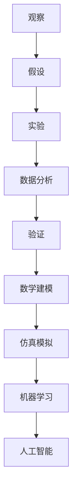
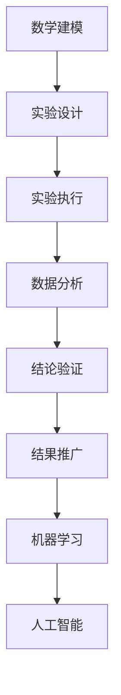
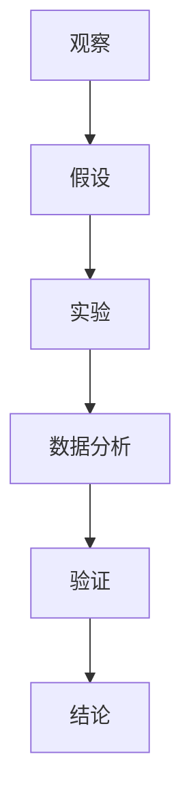

                 

# 科学方法：从观察到实验

> 关键词：科学方法,观察,实验,验证,科学实验,数学建模,数据分析,仿真模拟,机器学习,人工智能

## 1. 背景介绍

### 1.1 问题由来
科学方法是人类探索自然和解决实际问题的基本手段，从古至今，从经验到理论，科学方法不断演变和发展。从早期的观察和假设，到近代的实验和验证，再到现代的数学建模和数据分析，科学方法始终贯穿于人类认知世界的过程。

在信息时代，科学方法的应用变得更加广泛和深入，尤其是在数据密集型领域，如物理学、化学、生物学、天文学、工程学等领域。科学方法的精确性和可重复性成为科学研究的核心。

### 1.2 问题核心关键点
科学方法的核心在于通过观察和实验，验证假设，得出结论。科学实验的目的是在控制条件下，重复验证某一现象或规律的普遍性和可重复性。

科学方法的关键步骤包括：
1. 提出假设：基于观察和已知知识，提出一个可验证的假设。
2. 设计实验：设计合适的实验方案，控制变量，验证假设。
3. 进行实验：执行实验，获取数据。
4. 数据分析：分析实验数据，得出结论。
5. 验证结论：通过多次实验，验证结论的普遍性和可靠性。

## 2. 核心概念与联系

### 2.1 核心概念概述

为更好地理解科学方法的核心概念和步骤，本节将介绍几个密切相关的核心概念：

- **观察（Observation）**：在自然界或实验中，通过感官或仪器，获取现象或数据的过程。
- **假设（Hypothesis）**：基于观察和已有知识，提出的解释性假设，用于预测或解释现象。
- **实验（Experiment）**：在控制条件下，对假设进行验证，获取数据的过程。
- **验证（Validation）**：通过多次实验，验证假设的普遍性和可靠性，确保结论的正确性。
- **数学建模（Mathematical Modeling）**：通过数学方程和算法，建立模型描述现象或规律，用于预测和解释数据。
- **数据分析（Data Analysis）**：对实验数据进行统计分析和可视化处理，得出结论和推论。
- **仿真模拟（Simulation）**：通过计算机模拟实验过程，预测现象或规律，辅助实验设计。
- **机器学习（Machine Learning）**：通过算法模型，自动从数据中学习规律，进行预测和分类。
- **人工智能（Artificial Intelligence）**：通过算法和模型，模拟人类智能，进行决策和预测。

这些核心概念之间通过以下Mermaid流程图来展示它们之间的关系：



这个流程图展示了大语言模型微调过程中各个核心概念的关系和作用：

1. 观察是获取数据和现象的基础。
2. 假设是对观察结果的解释和预测。
3. 实验是对假设进行验证的过程。
4. 数据分析是处理实验数据得出结论的过程。
5. 验证是确保结论正确性的过程。
6. 数学建模是通过数学方程描述现象的过程。
7. 仿真模拟是计算机模拟实验过程的过程。
8. 机器学习是通过算法自动学习规律的过程。
9. 人工智能是通过算法模拟人类智能的过程。

### 2.2 概念间的关系

这些核心概念之间存在着紧密的联系，形成了科学方法应用的完整生态系统。下面用几个Mermaid流程图来展示这些概念之间的关系。

#### 2.2.1 科学方法的基本流程


这个流程图展示了科学方法的基本流程，从观察到实验，再到数据分析和验证。

#### 2.2.2 实验设计的重要性


这个流程图展示了实验设计在科学方法中的重要性，通过精心设计的实验，可以有效地验证假设，得出可靠结论。

#### 2.2.3 数学建模和仿真模拟的应用



这个流程图展示了数学建模和仿真模拟在科学方法中的应用，通过数学方程和仿真模拟，可以辅助实验设计，提高实验效率和准确性。

## 3. 核心算法原理 & 具体操作步骤
### 3.1 算法原理概述

科学方法的核心理念是通过观察和实验，验证假设，得出结论。这一过程可以通过数学建模和数据分析来实现，以确保结论的科学性和可靠性。

在实践中，科学方法的实施通常包括以下步骤：

1. 观察：通过感官或仪器获取数据或现象。
2. 假设：基于观察结果，提出可验证的假设。
3. 实验：在控制条件下，执行实验验证假设。
4. 数据分析：对实验数据进行统计分析和可视化处理，得出结论。
5. 验证：通过多次实验，验证结论的普遍性和可靠性。

### 3.2 算法步骤详解

科学方法的详细步骤可以通过以下流程图示例说明：



这个流程图展示了科学方法从观察到实验，再到数据分析和验证，最后得出结论的完整过程。

#### 3.2.1 观察

观察是科学方法的第一步，旨在获取数据或现象。观察可以通过感官或仪器进行，关键在于确保数据的准确性和可靠性。

- **感官观察**：使用眼睛、耳朵、鼻子、皮肤等感官直接观察现象。
- **仪器观察**：使用显微镜、望远镜、温度计、光谱仪等仪器获取数据。

#### 3.2.2 假设

假设是科学方法的第二步，基于观察结果，提出可验证的假设。假设必须具备以下特点：

- **可验证性**：假设必须能够通过实验验证。
- **简洁性**：假设必须简洁明了，避免过于复杂或模糊。
- **可操作性**：假设必须具有可操作性，能够在实验中实施。

#### 3.2.3 实验

实验是科学方法的第三步，通过控制条件，验证假设是否成立。实验设计必须包括以下要素：

- **控制变量**：确保实验的独立性，避免其他因素干扰。
- **重复实验**：多次执行实验，确保结果的可靠性。
- **数据记录**：详细记录实验数据和过程，确保数据的完整性和准确性。

#### 3.2.4 数据分析

数据分析是科学方法的第四步，通过统计分析和可视化处理，得出结论。数据分析必须包括以下步骤：

- **数据清洗**：去除异常数据和噪声，确保数据的纯净性。
- **统计分析**：使用统计方法，分析数据的分布和趋势，得出结论。
- **可视化**：使用图表和图形，直观展示数据分析结果，便于理解和解释。

#### 3.2.5 验证

验证是科学方法的第五步，通过多次实验，验证结论的普遍性和可靠性。验证必须包括以下步骤：

- **多次实验**：在不同条件下执行多次实验，确保结论的普遍性。
- **统计验证**：使用统计方法，验证结论的可靠性，避免偶然性。
- **误差分析**：分析实验误差，改进实验设计，提高实验精度。

## 4. 数学模型和公式 & 详细讲解 & 举例说明

### 4.1 数学模型构建

在科学方法中，数学建模是验证假设和得出结论的重要手段。数学建模通常包括以下步骤：

1. 定义变量：根据假设和观察数据，定义数学变量。
2. 建立方程：根据假设和实验数据，建立数学方程。
3. 求解方程：使用数学方法，求解数学方程。
4. 验证结果：通过实验数据，验证数学模型的准确性和可靠性。

以热传导方程为例，展示数学建模的流程：

**定义变量**：
设热传导系数为 $k$，温度为 $T(x,y,z)$，导热时间为 $t$，空间坐标 $(x,y,z)$。

**建立方程**：
热传导方程为 $\nabla^2 T = \frac{\rho C_p}{k} \frac{\partial T}{\partial t}$，其中 $\rho$ 为材料密度，$C_p$ 为比热容。

**求解方程**：
使用数值方法（如有限元方法）求解方程，得到温度分布 $T(x,y,z,t)$。

**验证结果**：
通过实验数据，验证温度分布的准确性。

### 4.2 公式推导过程

以牛顿第二定律 $F=ma$ 为例，展示公式推导的过程：

**定义变量**：
设质量为 $m$ 的物体，受到力 $F$ 的加速，加速度为 $a$。

**建立方程**：
根据牛顿第二定律，建立方程 $F=ma$。

**求解方程**：
对等式两边同时除以 $m$，得到 $a=\frac{F}{m}$。

**验证结果**：
实验验证 $a$ 的值与 $F$ 成正比，与 $m$ 成反比，验证了公式的正确性。

### 4.3 案例分析与讲解

以病毒传播模型为例，展示科学方法的应用：

**观察**：
记录病毒传播的数据，包括感染人数、传播速度、恢复率等。

**假设**：
假设病毒传播符合指数增长模型，设感染人数为 $I(t)$，初始感染人数为 $I_0$，传播率为 $r$。

**实验**：
通过实验，记录不同时间点的感染人数，验证指数增长模型是否成立。

**数据分析**：
使用指数增长模型，对实验数据进行拟合，得到传播率 $r$。

**验证**：
通过多次实验，验证模型的普遍性和可靠性，调整传播率 $r$ 的值，提高模型的准确性。

## 5. 项目实践：代码实例和详细解释说明
### 5.1 开发环境搭建

在进行科学方法应用开发前，我们需要准备好开发环境。以下是使用Python进行科学方法应用的环境配置流程：

1. 安装Anaconda：从官网下载并安装Anaconda，用于创建独立的Python环境。

2. 创建并激活虚拟环境：
```bash
conda create -n scientific-methods python=3.8 
conda activate scientific-methods
```

3. 安装必要的库：
```bash
conda install numpy pandas matplotlib scipy scikit-learn jupyter notebook
```

4. 安装可视化工具：
```bash
pip install matplotlib
```

完成上述步骤后，即可在`scientific-methods`环境中开始开发实践。

### 5.2 源代码详细实现

这里我们以病毒传播模型为例，给出使用Python进行科学方法应用开发的代码实现。

首先，定义模型参数和初始化函数：

```python
import numpy as np
import matplotlib.pyplot as plt

def init_params():
    # 初始化病毒传播参数
    I0 = 100  # 初始感染人数
    r = 0.1   # 传播率
    t = np.arange(0, 100, 1)  # 时间步长为1天
    T = np.zeros_like(t)  # 感染人数时间序列
    return I0, r, t, T
```

然后，定义病毒传播模型函数：

```python
def virus_spread(I0, r, t, T):
    # 病毒传播模型
    for i in range(len(t)):
        T[i] = I0 + (r * T[i-1] * (1 - T[i-1] / 100))  # 更新感染人数
    return T
```

接着，定义数据可视化函数：

```python
def plot_data(I0, r, T):
    # 绘制感染人数时间序列
    plt.plot(t, T)
    plt.xlabel('Time (Days)')
    plt.ylabel('Infection Count')
    plt.title('Virus Spread Model')
    plt.show()
```

最后，启动模型计算和可视化过程：

```python
I0, r, t, T = init_params()
T = virus_spread(I0, r, t, T)
plot_data(I0, r, T)
```

这就是使用Python进行病毒传播模型开发的完整代码实现。可以看到，通过简单的数学模型和可视化工具，就可以轻松完成科学方法的实践。

### 5.3 代码解读与分析

让我们再详细解读一下关键代码的实现细节：

**init_params函数**：
- 初始化病毒传播参数 $I0$ 和 $r$，以及时间步长 $t$ 和感染人数时间序列 $T$。

**virus_spread函数**：
- 根据病毒传播模型，计算每个时间点的感染人数 $T$，并更新感染人数时间序列。

**plot_data函数**：
- 使用matplotlib绘制感染人数时间序列图，便于观察和分析。

**启动模型计算和可视化过程**：
- 初始化模型参数，计算感染人数时间序列，并绘制图表。

可以看到，通过Python的科学计算库和可视化工具，我们可以方便地实现科学方法的实践，验证数学模型的准确性，并进行可视化分析。

## 6. 实际应用场景
### 6.1 智能制造

科学方法在智能制造中的应用非常广泛。通过科学方法，可以优化生产流程，提高生产效率，降低成本。

在实践中，可以通过观察和实验，分析生产过程中的各种因素，建立数学模型，预测生产效果。例如，在生产过程中，可以通过传感器收集温度、压力、湿度等数据，建立热力学模型，预测生产效果。通过多次实验，验证模型的准确性，优化生产参数，提高生产效率和产品质量。

### 6.2 健康医疗

科学方法在健康医疗领域同样有着广泛的应用。通过科学方法，可以精确诊断疾病，制定个性化治疗方案，提高医疗效果。

在实践中，可以通过观察和实验，分析疾病症状和实验室检查结果，建立数学模型，预测疾病发展趋势。例如，在癌症诊断中，可以通过实验室检查结果，建立数学模型，预测肿瘤的大小和转移情况。通过多次实验，验证模型的准确性，优化治疗方案，提高治疗效果和患者生存率。

### 6.3 环境保护

科学方法在环境保护中的应用也越来越受到重视。通过科学方法，可以监测环境变化，评估污染影响，制定环境保护措施。

在实践中，可以通过观察和实验，分析环境数据，建立数学模型，预测环境变化趋势。例如，在空气污染监测中，可以通过传感器收集空气质量数据，建立数学模型，预测污染趋势。通过多次实验，验证模型的准确性，优化监测措施，提高环境保护效果。

### 6.4 未来应用展望

随着科学方法的不断发展和应用，未来在更多领域都将看到其广阔的应用前景。

在智慧城市中，科学方法可以应用于交通流量监测、智能电网管理、智能交通系统等，提高城市管理的智能化水平，构建更安全、高效、宜居的城市环境。

在农业生产中，科学方法可以应用于作物生长监测、土壤质量分析、农产品质量检测等，提高农业生产的科学性和精准性，保障食品安全和农业可持续发展。

在金融投资中，科学方法可以应用于风险评估、市场预测、投资策略制定等，提高金融投资的精准性和稳定性，保障投资者利益。

总之，科学方法的应用将深刻改变各行业的运营模式，提升其科学性和智能化水平，推动各行业的发展进步。

## 7. 工具和资源推荐
### 7.1 学习资源推荐

为了帮助开发者系统掌握科学方法的理论基础和实践技巧，这里推荐一些优质的学习资源：

1. 《科学方法论》系列书籍：系统介绍了科学方法的基本原理和应用案例，适合初学者学习。
2. Coursera《科学方法论》课程：由著名科学家讲授，深入浅出地讲解科学方法的应用实例。
3. Khan Academy《科学方法论》视频课程：通过动画和互动教学，生动讲解科学方法的实践过程。
4. ScienceDirect《科学方法论》期刊：收录大量科学方法研究的最新成果和案例，适合研究者参考。
5. Science Common《科学方法论》网站：提供大量科学方法的教学资源和实验设计指南，适合教师和学生使用。

通过对这些资源的学习实践，相信你一定能够快速掌握科学方法的理论基础和实践技巧，为进一步研究或应用奠定坚实的基础。

### 7.2 开发工具推荐

高效的开发离不开优秀的工具支持。以下是几款用于科学方法应用开发的常用工具：

1. Jupyter Notebook：强大的交互式编程环境，支持Python和多种数学计算库，方便进行科学方法的实验和验证。
2. MATLAB：功能强大的科学计算软件，支持矩阵运算、绘图、仿真模拟等多种功能，适合进行科学方法的实验和数据分析。
3. Mathematica：高性能的符号计算软件，支持多种数学建模和数据分析功能，适合进行复杂科学方法的计算和验证。
4. LabVIEW：图形化编程环境，支持硬件开发和数据采集，适合进行实时科学方法的实验和应用。
5. TensorFlow：基于深度学习的科学计算框架，支持大规模数据处理和复杂模型训练，适合进行高级科学方法的计算和验证。

合理利用这些工具，可以显著提升科学方法应用的开发效率，加快创新迭代的步伐。

### 7.3 相关论文推荐

科学方法的发展源于学界的持续研究。以下是几篇奠基性的相关论文，推荐阅读：

1. "Statistics and the Theory of Probability" by Andrey Nikolaievich Kolmogorov：介绍了统计学和概率论的基本原理和应用，是科学方法的重要理论基础。
2. "A New Approach to Scientific Method" by Karl Popper：探讨了科学方法的核心思想和逻辑，提出了可证伪性的概念，对科学方法的发展具有重要影响。
3. "The Logic of Scientific Discovery" by Karl Popper：进一步阐述了科学方法的理论和应用，提出了假设-验证的科学方法论。
4. "Mathematical Modeling in Science and Engineering" by George E. P. Box, Jr.：介绍了科学方法中的数学建模方法，适合进行实际科学应用的建模和验证。
5. "Data Science for Business: Discovering Knowledge from Information" by Foster Provost, Tom Fawcett：介绍了数据科学在商业中的应用，展示了科学方法在实际应用中的重要价值。

这些论文代表了大语言模型微调技术的发展脉络。通过学习这些前沿成果，可以帮助研究者把握学科前进方向，激发更多的创新灵感。

除上述资源外，还有一些值得关注的前沿资源，帮助开发者紧跟科学方法的发展趋势，例如：

1. arXiv论文预印本：人工智能领域最新研究成果的发布平台，包括大量尚未发表的前沿工作，学习前沿技术的必读资源。
2. 顶级学术会议：如NIPS、ICML、ACL、ICLR等人工智能领域顶会现场或在线直播，能够聆听到大佬们的前沿分享，开拓视野。
3. GitHub热门项目：在GitHub上Star、Fork数最多的科学方法相关项目，往往代表了该技术领域的发展趋势和最佳实践，值得去学习和贡献。
4. 技术博客和社区：如Google Research、DeepMind Blog、Microsoft Research等顶尖实验室的官方博客，第一时间分享他们的最新研究成果和洞见。

总之，科学方法的应用需要开发者保持开放的心态和持续学习的意愿。多关注前沿资讯，多动手实践，多思考总结，必将收获满满的成长收益。

## 8. 总结：未来发展趋势与挑战

### 8.1 总结

本文对科学方法从观察到实验的实现过程进行了全面系统的介绍。首先阐述了科学方法的基本原理和步骤，明确了科学方法在各领域的广泛应用和重要性。其次，从原理到实践，详细讲解了科学方法的数学模型和操作步骤，给出了科学方法应用开发的完整代码实例。同时，本文还广泛探讨了科学方法在智能制造、健康医疗、环境保护等多个行业领域的应用前景，展示了科学方法应用的广阔前景。

通过本文的系统梳理，可以看到，科学方法通过观察和实验，验证假设，得出结论，广泛应用于各个领域，成为人类探索自然和解决实际问题的重要手段。未来，伴随科学方法的不断演进和应用，必将推动各行业的科学化和智能化水平，为社会发展和进步带来深远影响。

### 8.2 未来发展趋势

展望未来，科学方法的应用将呈现以下几个发展趋势：

1. 数据驱动的科学方法：随着数据采集和存储技术的不断进步，数据驱动的科学方法将越来越普及，通过大量数据支持科学假设的验证，提高科学研究的准确性和可靠性。
2. 跨学科的科学方法：随着科学研究的交叉融合，跨学科的科学方法将越来越多，通过多学科的协同合作，解决复杂科学问题。
3. 自动化的科学方法：随着人工智能和机器学习的发展，自动化的科学方法将逐渐普及，通过算法自动化科学假设的验证和优化，提高科学研究的效率和精度。
4. 全球化的科学方法：随着全球化进程的推进，全球化的科学方法将逐渐形成，通过跨国合作，解决全球性科学问题。
5. 可解释的科学方法：随着数据和算法的复杂性增加，可解释的科学方法将越来越重要，通过提高科学研究的透明度和可解释性，增强科学研究的可信度和可操作性。

以上趋势凸显了科学方法应用的广阔前景。这些方向的探索发展，必将进一步提升科学方法的精确性和可靠性，为各领域的科学研究提供更强大的支持。

### 8.3 面临的挑战

尽管科学方法已经取得了巨大成就，但在迈向更加智能化、普适化应用的过程中，它仍面临着诸多挑战：

1. 数据质量瓶颈：数据质量和数据量对科学方法的验证和优化至关重要，但数据采集和存储过程中，难免会存在噪声和缺失，如何处理这些问题，提高数据质量，将是一大难题。
2. 算法复杂性：随着科学方法中的算法和模型越来越复杂，提高算法的可解释性和可操作性，将成为重要的研究方向。
3. 实验成本高昂：大型实验需要大量的人力、物力和时间，如何降低实验成本，提高实验效率，将是一大挑战。
4. 理论和方法的不完备：科学方法的理论和方法仍在不断发展，如何建立完善的科学方法论，指导科学研究和应用，将是一个长期的任务。
5. 科学研究的伦理和道德：科学研究的伦理和道德问题日益受到关注，如何在科学方法中考虑伦理和道德因素，确保科学研究的公正性和负责任，将是一大挑战。

正视科学方法面临的这些挑战，积极应对并寻求突破，将是科学方法应用走向成熟的必由之路。相信随着学界和产业界的共同努力，这些挑战终将一一被克服，科学方法必将在构建人机协同的智能时代中扮演越来越重要的角色。

### 8.4 未来突破

面对科学方法面临的种种挑战，未来的研究需要在以下几个方面寻求新的突破：

1. 数据质量提升：采用数据清洗和预处理技术，提高数据的纯净性和可靠性。
2. 算法简化和优化：开发更加简洁、高效的算法，降低算法复杂性，提高算法的可解释性和可操作性。
3. 实验设计优化：采用自动化实验设计和仿真模拟技术，降低实验成本，提高实验效率。
4. 理论和方法完善：建立完善的科学方法论，指导科学研究和应用，确保科学研究的科学性和合理性。
5. 伦理和道德考量：在科学方法中引入伦理和道德因素，确保科学研究的公正性和负责任。

这些研究方向的探索，必将引领科学方法应用迈向更高的台阶，为科学研究和社会发展提供更强大的支持。

## 9. 附录：常见问题与解答

**Q1：科学方法中的假设是否必须经过实验验证？**

A: 是的，科学方法的本质是通过观察和实验验证假设，得出结论。假设必须具备可验证性，才能通过实验验证。

**Q2：科学方法中的数据分析如何确保结果的可靠性？**

A: 科学方法中的数据分析必须经过多次实验验证，确保结果的可靠性。通过统计分析和可视化处理，可以发现数据中的异常点和规律，提高数据分析的准确性和可靠性。

**Q3：科学方法中的数学建模如何应用到实际问题？**

A: 数学建模可以通过建立数学方程，描述实际问题的规律和现象。通过求解数学方程，可以预测和解释实际问题，解决实际问题。例如，热力学模型、病毒传播模型等，都是基于数学建模解决的实际问题。

**Q4：科学方法在各领域的应用前景如何？**

A: 科学方法在各领域的应用前景非常广阔。通过科学方法，可以优化生产流程、提高医疗效果、保护环境、推动社会发展等，具有重要的实际价值。

**Q5：科学方法中的实验设计如何确保实验的独立性和可重复性？**

A: 科学方法中的实验设计必须控制变量，确保实验的独立性。通过多次实验，确保实验的可重复性。同时，详细记录实验数据和过程，确保实验的可靠性和可重复性。

总之，科学方法通过观察和实验，验证假设，得出结论，广泛应用于各个领域，成为人类探索自然和解决实际问题的重要手段。未来，伴随科学方法的不断演进和应用，必将推动各领域的科学化和智能化水平，为社会发展和进步带来深远影响。

---

作者：禅与计算机程序设计艺术 / Zen and the Art of Computer Programming

