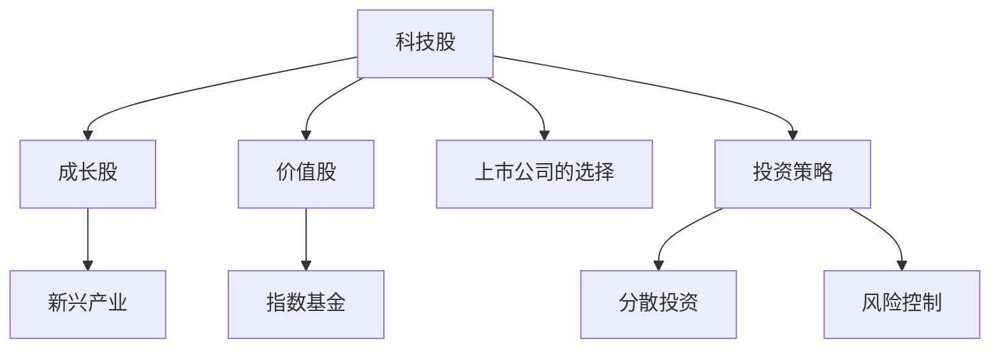
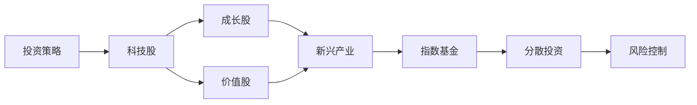

                 

# 程序员的投资策略：科技股与新兴产业

## 1. 背景介绍

### 1.1 问题由来
随着科技行业的迅猛发展，越来越多的程序员和技术人员投身于创业或投资之中。他们在积累技术和经验的同时，也意识到资本对于项目成功的重要性。然而，科技领域的投资不仅需要技术洞见，更需要对市场的深度理解。本文旨在为程序员和技术人员提供一份实用的投资策略，帮助他们识别有潜力的科技股和新兴产业，合理配置投资组合。

### 1.2 问题核心关键点
科技股投资的核心在于识别和判断哪些科技公司的股票具备持续增长潜力。这种潜力通常来源于以下几个方面：
- **技术创新**：公司是否在核心技术领域有突破，能否保持领先优势。
- **市场规模**：目标市场是否足够大，能否支撑公司的持续成长。
- **商业模型**：公司的盈利模式是否合理，能否实现规模化和盈利。
- **管理团队**：团队是否稳定且具有丰富的行业经验。
- **融资能力**：公司是否能够有效利用融资，支持长期发展。

### 1.3 问题研究意义
掌握科技股和新兴产业的投资策略，对于程序员和技术人员具有重要意义：
1. **资金增值**：在保证日常工作不受影响的前提下，通过投资实现财务增值。
2. **风险分散**：利用投资组合分散风险，降低单一投资失败带来的损失。
3. **增强自信**：深入了解投资逻辑，提升对市场和公司的理解，增强自信心。
4. **职业发展**：投资知识能够丰富个人技能，增强职业竞争力。
5. **创业支持**：投资积累的资本和经验可以为创业项目提供资金和资源支持。

## 2. 核心概念与联系

### 2.1 核心概念概述

在进行科技股和新兴产业投资时，需要掌握以下几个核心概念：

- **科技股**：指在科技领域（如硬件、软件、互联网、人工智能等）上市的公司股票。这些公司的业务与科技创新密切相关。
- **新兴产业**：指正在快速发展、未来潜力巨大的行业，如云计算、大数据、物联网、人工智能等。
- **成长股**：指具有较高成长性的股票，通常处于成长期，公司业绩和股价有望持续增长。
- **价值股**：指市盈率较低，即股价相对其盈利水平有较明显折扣的股票。
- **指数基金**：以特定市场指数（如科技指数）为标的，通过持有指数成分股实现市场平均收益的投资工具。

### 2.2 核心概念间的关系

这些核心概念之间的逻辑关系可以通过以下Mermaid流程图来展示：



这个流程图展示了一些关键概念间的关系：

1. 科技股可以分为成长股和价值股。
2. 成长股往往与新兴产业相关联。
3. 新兴产业可以通过投资于成长股和指数基金来获得收益。
4. 科技股的投资策略包括了上市公司的选择和风险控制。
5. 风险控制和分散投资是确保投资成功的关键。

### 2.3 核心概念的整体架构

最后，我们用一个综合的流程图来展示这些核心概念在投资策略中的应用：



这个综合流程图展示了从投资策略到具体投资标的的整体流程。

## 3. 核心算法原理 & 具体操作步骤
### 3.1 算法原理概述

科技股和新兴产业投资的核心在于识别具有长期增长潜力的公司，并根据市场表现进行动态调整。常用的投资策略包括基本面分析、技术分析和组合投资等。

### 3.2 算法步骤详解

科技股和新兴产业投资的具体步骤包括：

1. **市场调研**：关注行业动态，了解市场需求和趋势。
2. **基本面分析**：评估公司财务状况、成长性、竞争力等。
3. **技术分析**：分析股票价格走势、成交量、均线等技术指标。
4. **组合管理**：构建多样化投资组合，分散风险。
5. **动态调整**：根据市场变化，定期调整投资组合。

### 3.3 算法优缺点

**优点**：
- 长期收益潜力大，尤其是新兴产业。
- 可通过技术分析快速识别市场机会。
- 分散投资策略可以降低风险。

**缺点**：
- 科技股波动大，短期内可能出现较大波动。
- 需要持续关注市场和公司动态，工作量较大。
- 对非金融背景的投资者可能较为复杂。

### 3.4 算法应用领域

科技股和新兴产业投资策略广泛应用于以下几个领域：
1. **创业投资**：风险投资和种子投资常用于具有高成长潜力的新兴产业。
2. **个人投资**：有技术和市场理解能力的专业投资者。
3. **机构投资**：大型投资基金和公司，通过研究和专业管理实现高收益。

## 4. 数学模型和公式 & 详细讲解  
### 4.1 数学模型构建

在进行科技股投资时，可以使用以下数学模型进行分析和决策：

- **财务比率模型**：通过分析公司的财务报表，计算和比较财务比率，如市盈率（P/E）、市净率（P/B）、股息收益率（D/Y）等。
- **股息折现模型（Dividend Discount Model, DDM）**：通过预测未来股息现金流，并使用适当的折现率（如无风险利率和风险溢价）进行折现，计算公司的内在价值。
- **价格-盈利比率模型（Price-Earnings Ratio, P/E）**：通过比较公司市盈率与行业平均水平，评估公司的估值水平。

### 4.2 公式推导过程

以市盈率（P/E）为例，其计算公式如下：

$$ P/E = \frac{Market\_Cap}{Net\_Income} $$

其中，`Market_Cap`表示公司的市值，`Net_Income`表示公司的净利润。

在进行财务比率计算时，还需要考虑公司的债务水平、现金流状况等因素。例如，市净率（P/B）的计算公式为：

$$ P/B = \frac{Market\_Cap}{Book\_Value} $$

其中，`Book_Value`表示公司的账面价值。

### 4.3 案例分析与讲解

假设某科技公司市值100亿美元，净利润5亿美元，市盈率计算如下：

$$ P/E = \frac{100\text{亿美元}}{5\text{亿美元}} = 20 $$

如果同行业平均市盈率为25，则该公司的估值相对较低，具备投资价值。

## 5. 项目实践：代码实例和详细解释说明
### 5.1 开发环境搭建

要进行科技股和新兴产业的投资策略分析，需要以下工具和环境：

1. **编程语言**：Python是常用的数据处理和分析工具，易于实现各种数学模型。
2. **数据分析库**：Pandas和NumPy库用于数据处理和数学计算。
3. **可视化工具**：Matplotlib和Seaborn用于绘制图表。
4. **金融数据源**：如Yahoo Finance、Bloomberg等，用于获取股票价格和财务数据。

### 5.2 源代码详细实现

以下是一个简单的Python代码示例，用于计算和比较不同公司的市盈率：

```python
import pandas as pd
import numpy as np
from yfinance import Ticker
import matplotlib.pyplot as plt

# 获取股票数据
ticker1 = Ticker("AAPL")
ticker2 = Ticker("GOOGL")
ticker3 = Ticker("AMZN")

data1 = ticker1.history(period="1d", start="2020-01-01")
data2 = ticker2.history(period="1d", start="2020-01-01")
data3 = ticker3.history(period="1d", start="2020-01-01")

# 计算市盈率
P_E1 = data1['Close'] / data1['EPS']
P_E2 = data2['Close'] / data2['EPS']
P_E3 = data3['Close'] / data3['EPS']

# 绘制图表
plt.figure(figsize=(12, 6))
plt.plot(P_E1, label="AAPL P/E")
plt.plot(P_E2, label="GOOGL P/E")
plt.plot(P_E3, label="AMZN P/E")
plt.title("Company P/E Ratios")
plt.xlabel("Year")
plt.ylabel("P/E")
plt.legend()
plt.show()
```

### 5.3 代码解读与分析

这个示例代码使用Yahoo Finance API获取了苹果、谷歌和亚马逊的股票数据，并计算了它们的市盈率。通过可视化工具，可以直观地比较这些公司的市盈率水平。

### 5.4 运行结果展示

运行上述代码，可以得到一个图表，显示三家公司的市盈率随时间的变化。通常情况下，低市盈率的公司被认为有较好的投资价值。

## 6. 实际应用场景
### 6.1 科技创业投资

在科技创业投资中，投资者通常关注初创公司的成长潜力。他们会通过市场调研和基本面分析，评估公司的商业模式、市场规模和竞争力。此外，投资者还会密切关注公司的融资进展和团队稳定性。

### 6.2 个人科技投资

个人科技投资者通常通过技术分析和组合投资，构建多样化的投资组合。他们可以使用财务比率模型和价格-盈利比率模型，评估公司的估值水平。同时，他们还会通过持续的市场跟踪和调整，确保投资组合的稳定性和收益。

### 6.3 机构投资

大型投资基金和公司通常有专业的投资团队，通过全面的市场调研和详细的基本面分析，选择具有高增长潜力的科技股和新兴产业。他们还会使用技术分析和量化模型，优化投资组合，降低风险。

### 6.4 未来应用展望

未来，科技股和新兴产业投资将更加依赖数据驱动和智能算法。随着人工智能和大数据技术的发展，投资者将能够更准确地预测市场趋势和公司表现，优化投资决策。同时，区块链和加密货币等新兴投资领域也将逐步被纳入科技投资体系。

## 7. 工具和资源推荐
### 7.1 学习资源推荐

1. **《投资学原理》**：本书详细介绍了投资的基本原理和策略，是投资领域的经典教材。
2. **《金融计量经济学》**：该书讲解了金融数据的统计分析和建模方法，适合进阶学习。
3. **Coursera金融课程**：Coursera提供的金融和投资课程，涵盖了从入门到高级的各种主题。
4. **Khan Academy金融教育**：Khan Academy提供免费的金融教育资源，适合自学的投资者。
5. **《Python金融编程》**：该书介绍了使用Python进行金融数据分析和投资策略建模的方法。

### 7.2 开发工具推荐

1. **Python**：Python是数据处理和金融分析的主要工具。
2. **R语言**：R语言在统计分析和数据可视化方面有很强的优势。
3. **Excel**：Excel简单易用，适合基础的数据分析和财务计算。
4. **Tableau**：Tableau是一个强大的数据可视化工具，帮助投资者进行图表展示和分析。
5. **Alpha Vantage API**：提供股票和加密货币的实时数据，支持多种编程语言。

### 7.3 相关论文推荐

1. **《金融数据分析》**：该书介绍了金融数据的各种分析方法和技术，适合深入研究。
2. **《机器学习在金融工程中的应用》**：该书讲解了机器学习在金融预测和风险管理中的应用。
3. **《投资组合优化与组合风险管理》**：该书介绍了组合优化和风险管理的理论和实践。
4. **《科技创业投资》**：该书讲解了科技创业投资的策略和方法，适合创业者参考。

## 8. 总结：未来发展趋势与挑战
### 8.1 研究成果总结

科技股和新兴产业投资是一个复杂的领域，需要投资者具备丰富的技术和市场知识。通过学习和实践，投资者可以掌握基本面分析和组合投资的方法，构建稳定的投资组合。

### 8.2 未来发展趋势

未来科技股和新兴产业投资将更加依赖数据驱动和智能算法。区块链和加密货币等新兴投资领域也将逐渐被纳入投资体系。投资者需要持续学习和更新知识，适应市场变化和技术进步。

### 8.3 面临的挑战

尽管科技股和新兴产业投资有巨大的收益潜力，但也面临许多挑战：
1. **市场波动大**：科技股通常波动较大，投资者需要具备良好的心理素质。
2. **信息不对称**：市场信息复杂，获取准确的信息需要投入大量时间和精力。
3. **技术复杂**：技术分析和量化模型需要一定的数学和技术基础。
4. **法律法规**：投资活动需要遵守相关法律法规，需要具备相应的法律知识。
5. **道德风险**：投资决策需要考虑道德和社会责任，避免不当行为。

### 8.4 研究展望

未来，科技股和新兴产业投资的研究将更加深入和广泛。投资者需要关注新兴技术趋势，探索新的投资策略和方法。同时，投资活动的伦理和社会责任也将成为研究的重要方向。

## 9. 附录：常见问题与解答

**Q1：如何选择有潜力的科技公司？**

A: 选择有潜力的科技公司需要综合考虑技术创新、市场规模、商业模型、管理团队和融资能力等因素。可以通过行业调研、公司财报和市场分析来评估公司的成长性和投资价值。

**Q2：如何进行科技股组合投资？**

A: 组合投资可以通过分散投资风险，选择不同行业和公司的股票。投资者可以通过基本面分析和财务比率计算，选择有潜力的股票，并根据市场表现进行动态调整。

**Q3：如何避免科技股投资的风险？**

A: 避免科技股投资的风险需要多关注市场动态，合理配置投资组合，定期进行风险评估和调整。同时，投资者需要具备一定的技术和市场知识，避免盲目跟风。

**Q4：如何进行科技创业投资？**

A: 科技创业投资需要投入大量时间和资源进行市场调研和项目评估。投资者可以通过技术分析、市场调研和团队评估，选择有潜力的创业公司，并进行后续的融资和项目管理。

**Q5：如何进行科技投资的伦理和道德考量？**

A: 科技投资需要考虑伦理和道德问题，避免投资有害社会和环境的项目。投资者应该关注公司的社会责任和可持续发展，选择符合社会价值观的投资标的。

作者：禅与计算机程序设计艺术 / Zen and the Art of Computer Programming

