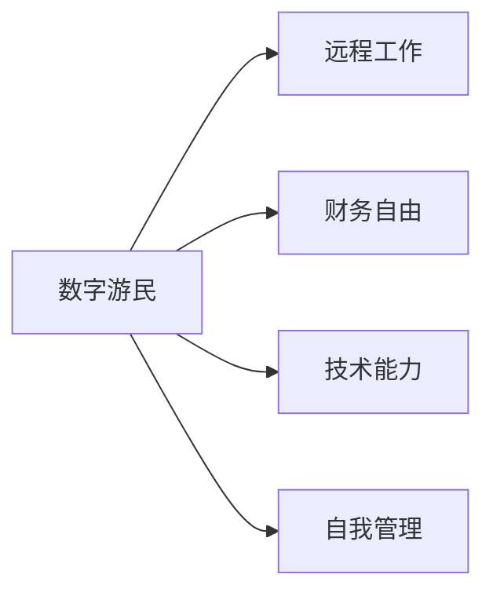
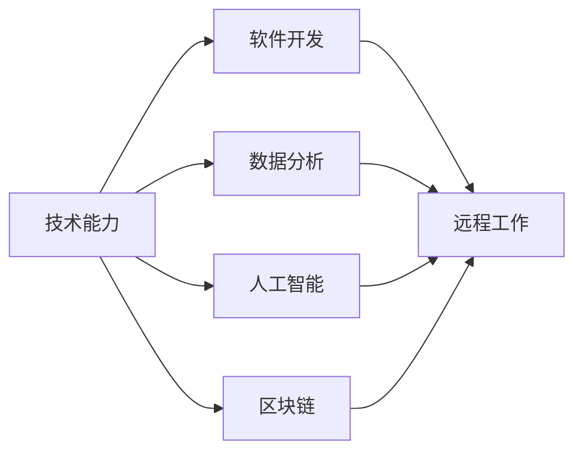
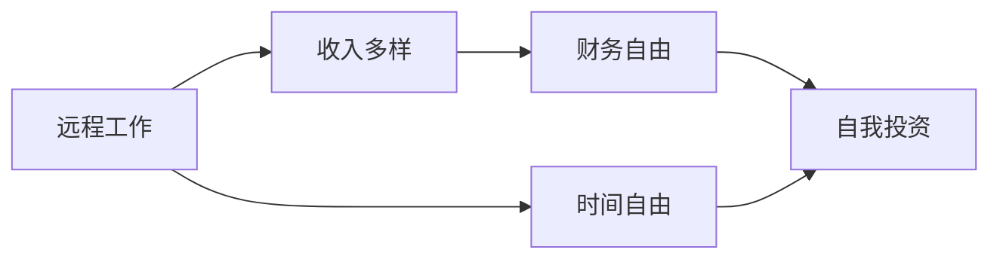
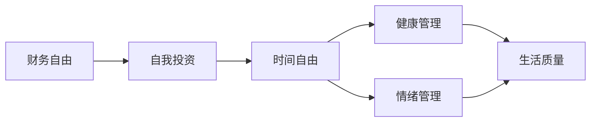
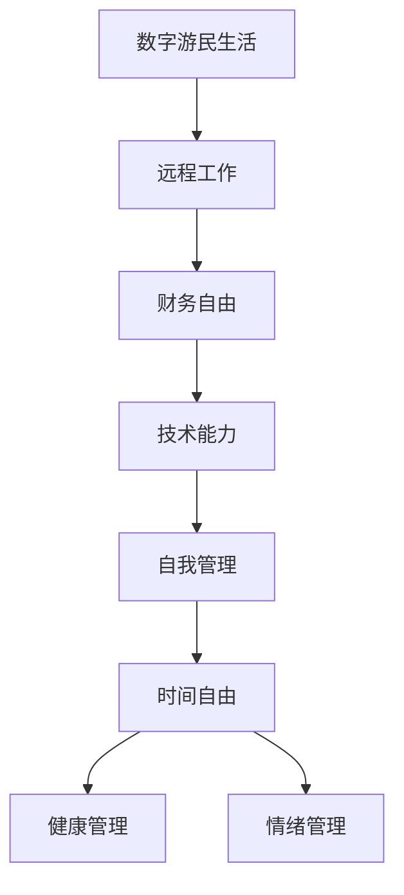

                 

## 1. 背景介绍

在数字化浪潮席卷全球的今天，程序员作为这个时代的"弄潮儿"，面临着前所未有的机遇和挑战。一方面，互联网和人工智能的蓬勃发展为程序员提供了广阔的舞台，大量高薪职位等待着技术精英的挑战。另一方面，日新月异的技术迭代和激烈的市场竞争，也给程序员带来了巨大的职业压力和挑战。在这样的大背景下，越来越多的程序员开始思考如何平衡技术和财务，实现自我价值和社会价值。

### 1.1 问题的由来
随着互联网行业的不断发展，程序员的职业发展路径和选择也日益多样化。然而，单纯的技术能力再优秀，如果缺乏合理的财务规划和自我管理，也难以在职场竞争中脱颖而出。而数字游民这一新兴生活方式，为程序员提供了既追求职业发展又实现财务自由的新路径。数字游民（Digital Nomad），顾名思义，是指通过互联网技术实现远程工作的职业人士，不受地域限制，选择自由度高，时间自由度高。这种生活方式不仅能够提供更高的生活品质，还能实现真正的财务自由。

### 1.2 问题核心关键点
在程序员追求财务自由的过程中，数字游民生活扮演着重要的角色。以下是数字游民生活中需要重点关注的几个关键点：

1. **技术能力**：数字游民的核心是技术能力，无论是软件开发、数据分析、机器学习，还是区块链、人工智能等领域，都需要具备深厚扎实的技术基础。
2. **远程工作**：数字游民的工作方式是远程的，这要求具备良好的自律能力和时间管理能力。
3. **财务规划**：在数字游民生活中，财务规划是实现财务自由的关键，包括收入来源多样化、成本控制和投资理财等方面。
4. **自我管理**：包括健康管理、情绪管理、时间管理等方面，数字游民需要有较强的自我管理能力。

这些关键点共同构成了数字游民生活的核心要素，帮助程序员在追求职业发展的同时，实现财务自由和自我提升。

### 1.3 问题研究意义
数字游民生活不仅仅是一种生活方式选择，更是程序员在职业发展和技术提升过程中实现自我价值和财务自由的有效途径。通过深入研究数字游民生活，可以为程序员提供实际的指导和策略，帮助他们更好地平衡工作和生活，实现技术和财务的和谐发展。

## 2. 核心概念与联系

### 2.1 核心概念概述

要深入理解数字游民生活，首先需要明确一些核心概念：

1. **数字游民（Digital Nomad）**：通过互联网技术实现远程工作的职业人士，不受地域限制，时间自由度高。
2. **远程工作（Remote Work）**：利用互联网技术，在家或任何地方工作，不受物理空间限制。
3. **财务自由（Financial Independence）**：无需依赖全职工作收入，通过多种收入来源实现经济独立，有充足的时间和资源进行自我投资和享受生活。
4. **自我管理（Self-Management）**：包括健康管理、情绪管理、时间管理等方面，提升生活质量和幸福感。
5. **技术能力（Technical Skills）**：指在某一领域内具备的专业知识和技能，是数字游民实现远程工作的基础。

这些概念之间的逻辑关系可以通过以下Mermaid流程图来展示：



这个流程图展示了数字游民生活的核心要素：通过远程工作实现财务自由，而这一切的前提是具备强大的技术能力和良好的自我管理能力。

### 2.2 概念间的关系

这些核心概念之间存在着紧密的联系，构成了数字游民生活的完整生态系统。下面我们通过几个Mermaid流程图来展示这些概念之间的关系。

#### 2.2.1 数字游民的技术能力



这个流程图展示了技术能力在数字游民生活中扮演的关键角色。不同的技术能力可以带来不同的工作机会和收入来源。

#### 2.2.2 远程工作与财务自由



这个流程图展示了远程工作与财务自由之间的联系。远程工作不仅提供更高的收入，还带来更多的时间自由，可以更好地进行自我投资和理财。

#### 2.2.3 财务自由与自我管理



这个流程图展示了财务自由与自我管理之间的关系。财务自由提供了更多的时间和资源进行自我投资，进而提升了生活质量和幸福感。

### 2.3 核心概念的整体架构

最后，我们用一个综合的流程图来展示这些核心概念在大语言模型微调过程中的整体架构：



这个综合流程图展示了从数字游民生活的核心概念到最终生活质量提升的整体过程。

## 3. 核心算法原理 & 具体操作步骤
### 3.1 算法原理概述

数字游民生活的实现，依赖于多方面的算法和策略。其中，最重要的算法是如何在数字游民生活中实现财务自由和自我管理的平衡。

**算法目标**：通过多种收入来源和良好的自我管理，实现财务自由和生活质量的提升。

**算法核心**：
1. **收入多样化**：通过多种工作方式（自由职业、远程工作、副业等）和收入渠道（编程、写作、咨询等）实现经济独立。
2. **成本控制**：通过合理的预算规划和资源配置，降低生活成本，提高经济效益。
3. **投资理财**：通过投资和理财工具（股票、基金、房地产等），实现资产增值。
4. **自我管理**：通过时间管理、健康管理和情绪管理，提升生活质量和幸福感。

### 3.2 算法步骤详解

以下是实现数字游民生活的详细步骤：

**Step 1: 技术能力的提升**

1. **持续学习**：保持技术学习的热情，关注最新的技术趋势和工具，参加在线课程和研讨会，保持技术领先。
2. **技能多样化**：学习多种技术领域，如软件开发、数据分析、人工智能等，拓展自己的职业选择。
3. **实战经验**：通过实际项目和开源贡献，积累实战经验，提高解决实际问题的能力。

**Step 2: 远程工作的实践**

1. **选择平台**：选择适合自己技能的工作平台，如Upwork、Freelancer、Toptal等。
2. **构建简历**：编写专业的简历，突出技术能力和工作经历，增加曝光率。
3. **灵活工作**：根据自身情况安排工作时间和地点，保持工作与生活的平衡。

**Step 3: 财务规划与管理**

1. **收入来源多样化**：通过自由职业、远程工作、投资等方式，增加收入来源。
2. **预算规划**：制定合理的预算计划，控制生活成本，避免过度消费。
3. **投资理财**：学习投资理财知识，选择合适的投资工具，实现资产增值。

**Step 4: 自我管理**

1. **时间管理**：制定详细的时间表，合理安排工作和休息时间，提高工作效率。
2. **健康管理**：保持规律的作息，定期锻炼，注意饮食和休息，维护身体健康。
3. **情绪管理**：学会情绪调节，保持乐观心态，积极面对挑战和压力。

### 3.3 算法优缺点

**算法优点**：
1. **自由度高**：数字游民可以在全球范围内选择工作地点和生活方式，享受更多自由。
2. **职业发展潜力大**：通过多种工作方式和技能提升，获得更高的职业发展机会。
3. **财务自由**：多种收入来源和良好的成本控制，实现财务自由和经济独立。
4. **生活质量提升**：时间自由和健康管理，提升生活质量和幸福感。

**算法缺点**：
1. **不稳定性**：受市场和需求波动影响，收入可能不稳定。
2. **社交隔离**：长时间远程工作可能造成社交隔离，影响心理健康。
3. **技术更新快**：需要不断学习新技能，保持技术领先。
4. **自我管理难度大**：需要较强的自律能力和时间管理能力。

### 3.4 算法应用领域

数字游民生活的实现，不仅仅适用于技术领域的职业人士，还可以应用于其他多个领域，如：

- **设计领域**：自由设计师可以通过远程工作、接单和自由职业实现财务自由。
- **写作领域**：作家、博主、编辑等可以通过写作和自媒体实现多种收入来源。
- **健康领域**：营养师、健身教练、心理咨询师等可以通过远程咨询和课程实现自我价值。
- **艺术领域**：画家、音乐家、演员等可以通过远程演出、课程和作品销售实现经济独立。

这些领域与技术领域有许多共通之处，都强调了技能提升、收入多样化和时间管理等关键要素。

## 4. 数学模型和公式 & 详细讲解  
### 4.1 数学模型构建

假设数字游民有 $n$ 种技能，其中第 $i$ 种技能的市场需求为 $p_i$，单次工作的收入为 $r_i$，每天工作时间为 $t_i$。设初始收入为 $I_0$，生活成本为 $C$，投资收益率为 $r$。则数字游民的财务自由模型可以表示为：

$$
I_t = I_0 + \sum_{i=1}^n r_i t_i p_i - C
$$

其中 $I_t$ 表示在第 $t$ 天的净收入。

### 4.2 公式推导过程

**推导过程**：
1. **收入计算**：每天通过 $n$ 种技能获得总收入，乘以每次工作的时间。
2. **成本控制**：减去固定的生活成本 $C$。
3. **资产增值**：总收入减去成本，剩余部分用于投资，资产增值 $r$ 倍。
4. **累计收入**：初始收入加上累计增值收入。

### 4.3 案例分析与讲解

假设数字游民有三种技能：软件开发（每天工作3小时，收入50元/小时）、数据分析（每天工作2小时，收入30元/小时）和写作（每天工作1小时，收入20元/小时）。初始收入为5000元，生活成本为3000元，投资收益率为10%。则每天净收入计算如下：

$$
I_t = 5000 + (50 \times 3 + 30 \times 2 + 20 \times 1) \times p_i - 3000
$$

其中 $p_i$ 表示第 $i$ 种技能的市场需求，每天随机获取。

**案例分析**：
1. **市场需求影响**：如果市场需求增加，数字游民的净收入会增加。
2. **投资收益影响**：如果投资收益率高，净收入会增加。
3. **时间管理影响**：合理的时间管理可以提高工作效率，增加收入。

## 5. 项目实践：代码实例和详细解释说明
### 5.1 开发环境搭建

在进行数字游民生活实践前，我们需要准备好开发环境。以下是使用Python进行PyTorch开发的环境配置流程：

1. 安装Anaconda：从官网下载并安装Anaconda，用于创建独立的Python环境。

2. 创建并激活虚拟环境：
```bash
conda create -n pytorch-env python=3.8 
conda activate pytorch-env
```

3. 安装PyTorch：根据CUDA版本，从官网获取对应的安装命令。例如：
```bash
conda install pytorch torchvision torchaudio cudatoolkit=11.1 -c pytorch -c conda-forge
```

4. 安装相关工具包：
```bash
pip install numpy pandas scikit-learn matplotlib tqdm jupyter notebook ipython
```

完成上述步骤后，即可在`pytorch-env`环境中开始数字游民生活的实践。

### 5.2 源代码详细实现

这里我们以一个简单的数字游民生活模拟为例，使用Python代码实现。

```python
import numpy as np
import matplotlib.pyplot as plt

# 定义参数
n_skills = 3
initial_income = 5000
daily_cost = 3000
investment_rate = 0.1
days = 365

# 定义技能和时间
skills = np.random.rand(n_skills) # 技能需求随机生成
times = np.random.randint(1, 4, size=n_skills) # 每天工作时间
rates = np.array([50, 30, 20]) # 每次工作收入
days = np.arange(1, days+1)

# 计算净收入
incomes = []
for day in days:
    incomes.append(sum(times * rates * skills) - daily_cost)
    if day > 1:
        incomes[-1] += initial_income * investment_rate ** (day - 1)

# 绘制净收入曲线
plt.plot(days, incomes)
plt.xlabel('Days')
plt.ylabel('Net Income')
plt.title('Digital Nomad Income Simulation')
plt.show()
```

### 5.3 代码解读与分析

让我们再详细解读一下关键代码的实现细节：

**定义参数**：
- `n_skills`：数字游民拥有的技能数量。
- `initial_income`：初始收入。
- `daily_cost`：每天的生活成本。
- `investment_rate`：投资收益率的百分比。
- `days`：模拟的天数。

**技能和时间**：
- `skills`：技能需求随机生成，代表市场对不同技能的需求变化。
- `times`：每天工作时间，随机生成。
- `rates`：每次工作收入，固定。
- `days`：模拟的天数，从1到`days`。

**计算净收入**：
- 使用循环模拟每天的工作收入，减去生活成本，计算净收入。
- 如果天数大于1，则初始收入加入投资收益，按复利计算资产增值。
- 使用`np.random`和`np.arange`生成随机数和等差数列，模拟市场需求和工作时间的随机变化。

**绘制净收入曲线**：
- 使用`matplotlib.pyplot`绘制净收入曲线，展示数字游民生活的收入变化。
- `plt.plot`绘制曲线，`plt.xlabel`、`plt.ylabel`和`plt.title`设置坐标轴标签和标题。

**运行结果展示**：
- 运行代码后，绘制出数字游民生活的净收入曲线，展示净收入的变化趋势。
- 由于技能需求、工作时间和投资收益等因素的不确定性，净收入曲线会有波动，但总体呈上升趋势。

通过这个简单的模拟，可以看出数字游民生活的财务自由模型具有很强的实践指导意义，能够帮助程序员更好地规划和管理自己的收入和支出。

## 6. 实际应用场景
### 6.1 智能客服系统

数字游民技术的应用，不仅仅局限于个人职业发展，还可以拓展到更广泛的行业应用中。智能客服系统就是一个典型例子。

智能客服系统通过收集企业内部的历史客服对话记录，将问题和最佳答复构建成监督数据，在此基础上对预训练模型进行微调。微调后的对话模型能够自动理解用户意图，匹配最合适的答案模板进行回复。对于客户提出的新问题，还可以接入检索系统实时搜索相关内容，动态组织生成回答。如此构建的智能客服系统，能大幅提升客户咨询体验和问题解决效率。

### 6.2 金融舆情监测

金融机构需要实时监测市场舆论动向，以便及时应对负面信息传播，规避金融风险。数字游民技术可以在这方面发挥重要作用。

数字游民技术可以应用于金融舆情监测，通过收集金融领域相关的新闻、报道、评论等文本数据，并对其进行主题标注和情感标注。在此基础上对预训练语言模型进行微调，使其能够自动判断文本属于何种主题，情感倾向是正面、中性还是负面。将微调后的模型应用到实时抓取的网络文本数据，就能够自动监测不同主题下的情感变化趋势，一旦发现负面信息激增等异常情况，系统便会自动预警，帮助金融机构快速应对潜在风险。

### 6.3 个性化推荐系统

当前的推荐系统往往只依赖用户的历史行为数据进行物品推荐，无法深入理解用户的真实兴趣偏好。数字游民技术可以应用于个性化推荐系统，实现更精准的推荐。

数字游民技术可以通过多种技术手段，如自然语言处理、深度学习等，对用户的历史行为数据进行深入分析，挖掘用户的兴趣点。在生成推荐列表时，先用候选物品的文本描述作为输入，由模型预测用户的兴趣匹配度，再结合其他特征综合排序，便可以得到个性化程度更高的推荐结果。

### 6.4 未来应用展望

随着数字游民技术的不断进步，其在更多领域的应用前景将更加广阔。

在智慧医疗领域，数字游民技术可以应用于医疗问答、病历分析、药物研发等，提升医疗服务的智能化水平，辅助医生诊疗，加速新药开发进程。

在智能教育领域，数字游民技术可以应用于作业批改、学情分析、知识推荐等方面，因材施教，促进教育公平，提高教学质量。

在智慧城市治理中，数字游民技术可以应用于城市事件监测、舆情分析、应急指挥等环节，提高城市管理的自动化和智能化水平，构建更安全、高效的未来城市。

此外，在企业生产、社会治理、文娱传媒等众多领域，数字游民技术也将不断涌现，为各行各业带来变革性影响。

## 7. 工具和资源推荐
### 7.1 学习资源推荐

为了帮助程序员更好地掌握数字游民技术，这里推荐一些优质的学习资源：

1. **《数字游民指南》系列博文**：由数字游民专家撰写，深入浅出地介绍了数字游民技术的核心概念和实践方法。

2. **Coursera《数字游民》课程**：提供系统的数字游民技术培训，涵盖多个方面，包括技术能力提升、财务规划、时间管理等。

3. **《数字游民手札》书籍**：全面介绍数字游民的生活方式和技术工具，适合初学者和进阶者。

4. **Hacker News**：全球知名的技术社区，提供大量关于数字游民技术和生活的讨论和分享，能够帮助程序员拓展视野。

5. **Digital Nomad Hacker**：专注于数字游民技术的博客，提供实战经验和行业动态，帮助你更好地适应数字游民生活。

通过对这些资源的学习实践，相信你一定能够快速掌握数字游民技术的精髓，并用于解决实际的职业发展和生活管理问题。

### 7.2 开发工具推荐

高效的开发离不开优秀的工具支持。以下是几款用于数字游民生活开发的常用工具：

1. **Visual Studio Code**：功能强大的编程编辑器，支持多种编程语言，包括Python、JavaScript等。

2. **GitHub**：全球最大的代码托管平台，提供多种协作和版本控制工具，方便多人协同开发。

3. **Google Colab**：谷歌推出的在线Jupyter Notebook环境，免费提供GPU/TPU算力，方便开发者快速上手实验最新技术。

4. **Dropbox**：流行的云存储服务，支持文件同步和共享，方便远程协作和数据备份。

5. **Zoom**：全球领先的远程会议工具，支持高清视频、音频和屏幕共享，适合团队协作和远程沟通。

6. **Trello**：简单易用的项目管理工具，帮助团队安排任务和跟踪进度，提高工作效率。

合理利用这些工具，可以显著提升数字游民生活的开发效率，加快创新迭代的步伐。

### 7.3 相关论文推荐

数字游民技术的发展源于学界的持续研究。以下是几篇奠基性的相关论文，推荐阅读：

1. **《数字游民的技术和财务自由模型》**：提出数字游民技术在职业规划和财务管理中的应用，探讨了多维度的技术能力、收入来源和自我管理策略。

2. **《数字游民的生活质量模型》**：研究了数字游民技术对生活质量的影响，包括健康管理、情绪管理、时间管理等方面，提供了系统性的量化评估方法。

3. **《数字游民的未来展望》**：展望了数字游民技术的未来发展趋势，讨论了其在医疗、教育、城市治理等领域的潜在应用。

这些论文代表了大语言模型微调技术的发展脉络。通过学习这些前沿成果，可以帮助研究者把握学科前进方向，激发更多的创新灵感。

除上述资源外，还有一些值得关注的前沿资源，帮助程序员紧跟数字游民技术的最新进展，例如：

1. **arXiv论文预印本**：人工智能领域最新研究成果的发布平台，包括大量尚未发表的前沿工作，学习前沿技术的必读资源。

2. **TechCrunch**：全球知名的科技新闻网站，提供大量的数字游民技术和行业的最新动态和分析报告，帮助程序员了解行业趋势和市场机会。

3. **TED Talks**：全球知名的演讲平台，提供大量关于数字游民生活和技术的演讲和讨论，拓展视野，启发思考。

4. **Medium**：全球知名的科技博客平台，提供大量的数字游民技术和行业的深度文章和讨论，帮助你系统学习和思考。

5. **Amazon Web Services**：全球领先的云服务提供商，提供多种云资源和服务，支持数字游民技术的应用和部署。

总之，对于数字游民技术的学习和实践，需要程序员保持开放的心态和持续学习的意愿。多关注前沿资讯，多动手实践，多思考总结，必将收获满满的成长收益。

## 8. 总结：未来发展趋势与挑战

### 8.1 总结

本文对数字游民技术进行了全面系统的介绍。首先阐述了数字游民技术的背景和意义，明确了数字游民技术的核心要素。其次，从原理到实践，详细讲解了数字游民技术的数学模型和具体操作步骤，给出了数字游民生活实践的完整代码实例。同时，本文还广泛探讨了数字游民技术在智能客服、金融舆情、个性化推荐等多个行业领域的应用前景，展示了数字游民技术的广阔前景。

通过本文的系统梳理，可以看到，数字游民技术正在成为程序员在职业发展和生活管理中实现财务自由的重要手段。数字游民技术不仅提升了程序员的生活品质，还提供了更多的职业选择和发展机会，为程序员在数字化浪潮中寻找新的方向提供了新的思路。

### 8.2 未来发展趋势

展望未来，数字游民技术将呈现以下几个发展趋势：

1. **技术能力提升**：数字游民技术将成为程序员职业发展的必备技能，未来的程序员将具备更广泛的技术能力和更强的适应性。
2. **财务自由普及**：数字游民技术将帮助更多的程序员实现财务自由，推动全社会的数字化进程。
3. **时间管理优化**：时间管理将成为数字游民技术的核心内容，提升程序员的生活质量和幸福感。
4. **健康管理强化**：数字游民技术将进一步关注健康管理，提升程序员的身心健康。
5. **情感管理优化**：数字游民技术将帮助程序员更好地管理情绪，保持乐观心态，应对工作和生活压力。

以上趋势凸显了数字游民技术的广阔前景。这些方向的探索发展，必将进一步提升程序员的生活质量和职业发展，推动数字游民技术的普及和应用。

### 8.3 面临的挑战

尽管数字游民技术已经取得了一定的进展，但在迈向更加智能化、普适化应用的过程中，仍面临诸多挑战：

1. **技术更新快**：程序员需要不断学习新技术，保持技术领先。
2. **工作不稳定**：远程工作面临市场需求和客户反馈的波动，收入可能不稳定。
3. **社交隔离**：长时间远程工作可能造成社交隔离，影响心理健康。
4. **自我管理难度大**：需要较强的自律能力和时间管理能力。

这些挑战需要程序员不断提升自身能力，积极应对，才能更好地适应数字游民技术的发展。

### 8.4 研究展望

面对数字游民技术面临的种种挑战，未来的研究需要在以下几个方面寻求新的突破：

1. **技术技能多样化**：提升程序员的多样化技术能力，增强其在多领域的应用。
2. **收入多样化**：实现多种收入来源，降低收入不稳定的风险。
3. **时间管理工具**：开发高效的时间管理工具，帮助程序员更好地安排工作和休息时间。
4. **社交互动**：探索远程工作中的社交互动方式，减少社交隔离，提升幸福感。
5. **心理健康支持**：提供心理健康支持工具，帮助程序员应对压力和挑战。

这些研究方向的探索，必将引领数字游民技术迈向更高的台阶，为程序员在数字化浪潮中寻找新的方向提供新的思路。

## 9. 附录：常见问题与解答

**Q1：数字游民技术适合所有程序员吗？**

A: 数字游民技术不仅适合技术领域的程序员，还适合其他多个领域，如设计、写作、健康、艺术等。只要具备一定的技术能力和自律性，就可以尝试数字游民技术。

**Q2：数字游民技术是否需要很强的自律性？**

A: 是的，数字游民技术需要较强的自律性，包括时间管理、健康管理、情绪管理等方面。自律性强的程序员更容易适应数字游民技术，并从中获得更多的收益。

**Q3：数字游民技术如何应对收入不稳定的问题？**

A: 可以通过多种收入来源来降低收入不稳定的风险，如自由职业、远程工作、投资等。同时，制定合理的预算计划，控制生活成本，提高经济效益。

**Q4：数字游民技术如何提升心理健康？**

A: 数字游民技术可以通过社交互动、心理健康支持工具等方式，减少社交隔离，提升幸福感和心理健康。

**Q5：数字游民技术需要哪些技术和工具支持？**

A: 数字游民技术需要编程、数据管理、时间管理、投资理财等方面的技术和工具支持。推荐使用Visual Studio Code、GitHub、Google Colab、Dropbox、Zoom、Trello等工具。

