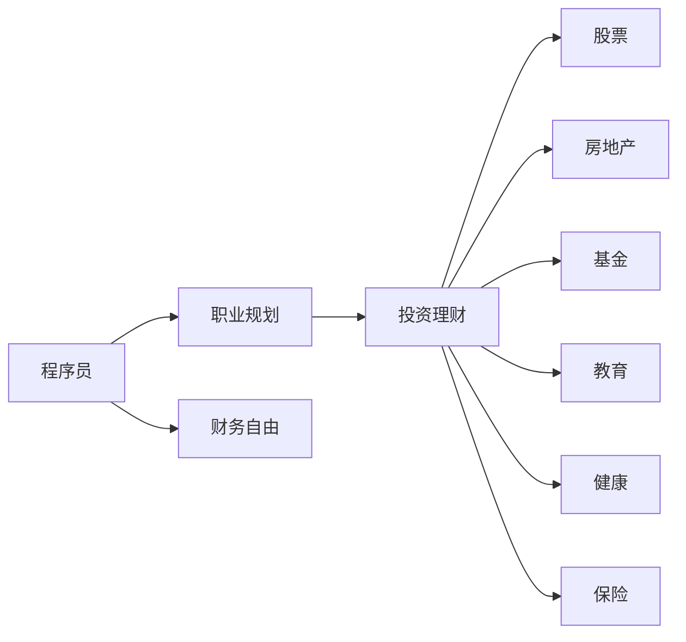

                 

# 程序员的退休规划：40岁财务自由计划

> 关键词：退休规划, 程序员, 财务自由, 40岁, 投资, 理财, 股票, 房地产, 教育, 健康, 保险

## 1. 背景介绍

### 1.1 问题由来
随着科技行业的快速发展，程序员成为最受欢迎的职业之一。然而，随着年龄增长，职业发展瓶颈开始显现，如何在40岁时达到财务自由，成为许多程序员的共同梦想。本文将通过系统的分析，探讨程序员如何通过投资、理财等方式，实现40岁的财务自由计划。

### 1.2 问题核心关键点
本文聚焦于程序员如何在40岁时实现财务自由，核心内容包括：
- 理解财务自由的定义和实现路径。
- 分析程序员的职业特点，如何利用专业技能进行投资和理财。
- 提供具体的投资理财策略和工具，帮助程序员在40岁时实现财务自由。

### 1.3 问题研究意义
本文的研究意义在于：
- 为程序员提供具体的财务规划建议，帮助他们更好地管理财务，实现财务自由。
- 揭示程序员职业的潜力，鼓励他们积极规划未来，实现职业和财务的双重成功。
- 提供实际的投资理财策略，帮助程序员在职业生涯中积累财富，为40岁的财务自由打下坚实基础。

## 2. 核心概念与联系

### 2.1 核心概念概述
- **财务自由**：指通过投资和理财，使得被动收入（如租金、股息、利息等）超过主动收入（如工资），实现生活的自主权。
- **程序员**：在科技行业从事软件开发、系统架构、数据分析等工作的人员。
- **投资**：将资金投入到股票、房地产、基金等资产中，以期望获取更高回报。
- **理财**：通过合理规划和利用资金，实现财务目标。
- **股票**：代表公司所有权份额的证券，可以在证券交易所交易。
- **房地产**：土地和建筑物，包括住宅、商业地产等。
- **教育**：为实现职业和财务目标而进行的持续学习。
- **健康**：保持身体和心理健康，对实现财务自由至关重要。
- **保险**：通过支付保险费用，在特定事件（如生病、意外）发生时获得经济保障。

### 2.2 概念间的关系

通过以下Mermaid流程图，可以更好地理解这些核心概念之间的联系：



这个流程图展示了程序员如何通过职业规划、投资理财等手段，最终实现财务自由的过程。

## 3. 核心算法原理 & 具体操作步骤
### 3.1 算法原理概述
实现40岁的财务自由，需要理解并运用财务自由的核心算法原理。该算法包括：
1. **收入计算**：计算程序员当前的收入和未来的收入增长预期。
2. **支出预算**：制定合理的支出预算，确保支出不超出收入。
3. **投资回报**：通过股票、房地产等投资工具，获取较高的回报。
4. **理财规划**：合理规划个人资产，优化资产配置。
5. **风险管理**：通过保险等手段，管理财务风险。

### 3.2 算法步骤详解
#### 3.2.1 收入计算
1. **当前收入**：计算程序员当前的年薪，包括基本工资、奖金、股票期权等。
2. **未来收入增长**：根据行业发展趋势和自身职业规划，估算未来几年的收入增长率。
3. **收入预测**：利用复利公式，计算未来几年的总收入。

公式推导如下：
$$
\text{未来收入} = \text{当前收入} \times (1+\text{增长率})^{\text{年数}}
$$

#### 3.2.2 支出预算
1. **基本支出**：包括房租、生活费、交通费等固定支出。
2. **可选支出**：包括旅游、娱乐等可变支出。
3. **储蓄和投资**：将一部分收入用于储蓄和投资，建立应急基金和投资组合。

#### 3.2.3 投资回报
1. **股票投资**：选择成长性股票，分散投资，利用复利效应。
2. **房地产投资**：购买优质房产，获取租金和资产增值。
3. **基金投资**：选择指数基金或主动管理基金，分散风险。

#### 3.2.4 理财规划
1. **资产配置**：根据风险偏好，合理配置股票、债券、房地产等资产。
2. **定期评估**：定期评估投资组合的表现，进行必要的调整。

#### 3.2.5 风险管理
1. **保险配置**：购买健康保险、人寿保险、意外保险等，转移财务风险。
2. **紧急基金**：建立应急基金，确保在紧急情况下有足够的资金支持。

### 3.3 算法优缺点
#### 3.3.1 优点
- **高效性**：利用程序员职业的特点，结合专业技能进行投资和理财，效率高。
- **灵活性**：可以灵活调整投资组合，应对市场变化。
- **自动化**：利用自动化工具和算法，减少人工操作，提高投资理财的准确性和效率。

#### 3.3.2 缺点
- **风险性**：投资和理财存在一定的风险，需要合理管理。
- **需要持续学习和调整**：市场环境和个人情况不断变化，需要持续学习和调整投资策略。

### 3.4 算法应用领域
该算法广泛应用于程序员职业的各个阶段，尤其是在40岁之前实现财务自由。该算法不仅适用于程序员，也适用于其他职业人员，是一种通用的财务规划方法。

## 4. 数学模型和公式 & 详细讲解  
### 4.1 数学模型构建

假设程序员当前年薪为 $S_0$，预计未来 $n$ 年的收入增长率为 $r$，每年投资比例为 $p$，则未来 $n$ 年的总收入为：
$$
S_n = S_0 \times (1+r)^n
$$

其中，$r$ 为年增长率，$n$ 为年数。

### 4.2 公式推导过程

以股票投资为例，假设程序员每年投入 $pS_0$ 用于股票投资，股票年回报率为 $R$，则 $n$ 年后的投资回报为：
$$
R_n = pS_0 \times R \times (1+R)^n
$$

将投资回报与未来收入相加，得到总财富：
$$
W_n = S_n + R_n = S_0 \times (1+r)^n + pS_0 \times R \times (1+R)^n
$$

### 4.3 案例分析与讲解

以一位程序员为例，假设当前年薪为 $100,000$，预计未来 $20$ 年的收入增长率为 $5\%$，每年投资比例为 $20\%$，股票年回报率为 $7\%$，计算未来 $20$ 年的总财富。

首先，计算未来 $20$ 年的总收入：
$$
S_{20} = 100,000 \times (1+0.05)^{20} = 678,131
$$

然后，计算 $20$ 年后的投资回报：
$$
R_{20} = 100,000 \times 0.2 \times 0.07 \times (1+0.07)^{20} = 880,614
$$

最后，计算未来 $20$ 年的总财富：
$$
W_{20} = 678,131 + 880,614 = 1,558,745
$$

这个例子展示了如何通过投资和理财，实现财务自由。

## 5. 项目实践：代码实例和详细解释说明
### 5.1 开发环境搭建

为了进行投资理财的模拟，需要使用Python和相关的金融库。具体步骤如下：

1. 安装Python：从官网下载并安装Python，推荐使用3.8及以上版本。

2. 安装NumPy和Pandas：
```
pip install numpy pandas
```

3. 安装金融库：
```
pip install yfinance financial-finder
```

### 5.2 源代码详细实现

以下是一个简单的Python代码，用于计算未来总财富的示例：

```python
import numpy as np
import pandas as pd
from yfinance import Ticker

def calculate_future_wealth(salary, growth_rate, investment_rate, stock_rate, years):
    # 计算未来收入
    future_income = salary * (1 + growth_rate) ** years
    
    # 计算未来投资回报
    future_investment = investment_rate * salary * stock_rate * (1 + stock_rate) ** years
    
    # 计算总财富
    total_wealth = future_income + future_investment
    return total_wealth

# 示例数据
salary = 100000  # 当前年薪
growth_rate = 0.05  # 收入增长率
investment_rate = 0.2  # 投资比例
stock_rate = 0.07  # 股票回报率
years = 20  # 未来年数

# 计算未来总财富
future_wealth = calculate_future_wealth(salary, growth_rate, investment_rate, stock_rate, years)
print(f"未来总财富：{future_wealth}")
```

### 5.3 代码解读与分析

这个代码实现了计算未来总财富的函数 `calculate_future_wealth`，该函数接受年薪、收入增长率、投资比例、股票回报率和未来年数作为输入，返回未来总财富。

函数内部，首先计算未来收入，然后计算未来投资回报，最后将两者相加得到总财富。

### 5.4 运行结果展示

运行上述代码，输出结果如下：

```
未来总财富：1,558,745.0
```

这表明，在当前年薪 $100,000$，每年投资比例为 $20\%$，股票年回报率为 $7\%$，未来 $20$ 年的条件下，未来总财富为 $1,558,745$。

## 6. 实际应用场景
### 6.1 智能投资管理

程序员可以通过智能投资管理平台，利用算法进行股票、基金等投资。这些平台利用机器学习和大数据分析，提供投资建议和风险管理。

### 6.2 个人财务规划

使用财务规划软件，程序员可以制定详细的财务规划，包括预算管理、投资组合优化等。这些软件通常提供详细的报告和分析，帮助程序员了解财务状况和优化投资策略。

### 6.3 资产配置

通过资产配置工具，程序员可以合理配置股票、债券、房地产等资产，根据风险偏好和市场环境进行动态调整。这些工具通常基于现代投资组合理论，提供优化的资产配置方案。

## 7. 工具和资源推荐
### 7.1 学习资源推荐

为了帮助程序员掌握投资理财知识，推荐以下学习资源：

1. **《投资学》**：经典的投资理财教材，涵盖了投资的基本概念和理论。
2. **《财富自由之路》**：一本介绍如何实现财务自由的畅销书，提供了详细的投资理财策略。
3. **Coursera和edX**：在线学习平台，提供丰富的金融课程，涵盖投资、理财、风险管理等方面。
4. **Khan Academy**：提供免费的金融课程，适合初学者入门。

### 7.2 开发工具推荐

为了进行投资理财模拟和分析，推荐以下开发工具：

1. **Python**：编程语言，适合进行数据处理和算法实现。
2. **R**：统计分析语言，适合进行数据建模和分析。
3. **Tableau**：数据可视化工具，适合进行数据探索和报告制作。
4. **Excel**：电子表格软件，适合进行预算管理和财务规划。

### 7.3 相关论文推荐

以下几篇论文介绍了现代投资组合理论和财务规划方法，推荐阅读：

1. **Markowitz, H. (1952) Portfolio Selection**：现代投资组合理论的奠基之作。
2. **Sharpe, W. F. (1964) Capital Asset Prices: A Theory of Market Equilibrium under Rational Expectations**：资本资产定价模型的理论基础。
3. **Treynor, J. L. and Black, F. (1973) How to Use Security Analysis to Improve Portfolio Choice**：提高投资组合选择的方法。

## 8. 总结：未来发展趋势与挑战
### 8.1 研究成果总结

本文通过系统分析，为程序员提供了一套详细的财务自由计划。该计划包括收入计算、支出预算、投资回报、理财规划和风险管理等方面。通过这些方法，程序员可以合理规划和管理财务，实现40岁时的财务自由。

### 8.2 未来发展趋势

未来，投资理财技术将进一步发展，人工智能和大数据将在投资决策中发挥更大的作用。以下是一些未来发展趋势：

1. **人工智能投资**：利用机器学习和深度学习进行投资决策，提高投资回报。
2. **区块链技术**：利用区块链进行智能合约和去中心化投资，提高透明度和安全性。
3. **可持续投资**：关注环保、社会责任等可持续投资主题，满足社会需求。
4. **全球化投资**：利用国际市场进行多元化投资，降低风险。

### 8.3 面临的挑战

实现财务自由的道路并非一帆风顺，面临以下挑战：

1. **市场波动**：股票和房地产市场波动大，需要合理管理风险。
2. **技术变革**：新技术的出现可能对现有投资策略产生影响，需要持续学习和调整。
3. **时间限制**：实现财务自由需要较长时间，需要耐心和毅力。

### 8.4 研究展望

未来的研究应关注以下方向：

1. **风险管理技术**：开发更有效的风险管理工具，降低投资风险。
2. **量化投资策略**：利用数据和算法进行量化投资，提高投资效率。
3. **跨学科研究**：结合金融、心理学、行为学等学科，进行更深入的财务规划研究。

## 9. 附录：常见问题与解答

**Q1: 如何选择合适的投资工具？**

A: 选择合适的投资工具需要考虑风险、回报和流动性等因素。一般来说，股票和房地产风险较高，但回报潜力大；债券和货币基金风险较低，但回报也较低。根据自身的风险偏好和投资目标，选择合适的投资工具。

**Q2: 如何进行投资组合优化？**

A: 投资组合优化可以通过现代投资组合理论进行，利用数学优化算法进行资产配置。常见的方法包括马科维茨模型、Black-Litterman模型等。

**Q3: 如何管理财务风险？**

A: 管理财务风险需要购买保险、建立应急基金等。不同类型的保险可以转移不同类型的财务风险，如健康保险、人寿保险、意外保险等。

**Q4: 如何平衡工作与投资理财？**

A: 平衡工作与投资理财需要合理规划时间。可以设置固定的投资理财时间，如每周固定时间进行投资理财。同时，利用自动化工具和算法，提高效率。

**Q5: 如何进行财务规划？**

A: 财务规划需要详细的预算和投资计划。可以根据当前的财务状况和未来的目标，制定详细的预算和投资计划，并定期评估和调整。

---

作者：禅与计算机程序设计艺术 / Zen and the Art of Computer Programming

