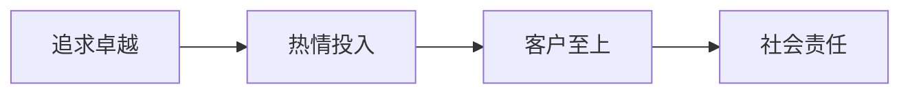
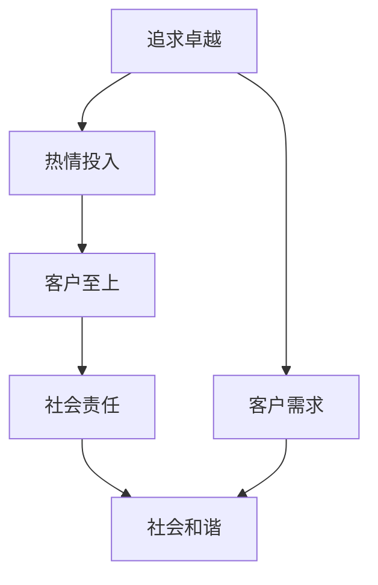

                 

# 稻盛和夫：赚钱最快的四条路

在商业世界中，赚钱是一门艺术，也是一门科学。稻盛和夫，被誉为日本“经营之圣”，他的一生致力于创造卓越的企业，并提出了许多独到的经营理念。他的经营哲学，尤其是关于赚钱的四个基本原则，至今仍对无数企业家和商业人士产生深远影响。本文将深入探讨这四条赚钱最快的路，并结合现代技术实践，揭示如何在瞬息万变的商业环境中保持竞争优势。

## 1. 背景介绍

稻盛和夫，1927年出生于日本，是京瓷（Kyocera）和京都燃气（Kyogyo）的创始人。他的一生，不仅是创业和创新的传奇，更是哲学与实践相结合的典范。稻盛和夫的经营哲学，以“敬天爱人”为核心理念，强调企业的社会责任和员工的发展。他的成功不仅仅在于商业成就，更在于他对人性和社会的深刻洞察。

稻盛和夫在其著作《活法》中，提出了四条赚钱的基本原则：追求卓越、热情投入、客户至上、社会责任。这四条原则，不仅适用于个人发展，更适用于企业的长远经营。本文将逐一探讨这四条原则，并结合现代技术实践，揭示其深远的商业价值。

## 2. 核心概念与联系

### 2.1 核心概念概述

稻盛和夫提出的四条原则，每个原则都涉及不同的核心概念：

1. **追求卓越（Kyujyuu）**：指的是不断超越自我，追求更高的目标。
2. **热情投入（Jyousho）**：强调对工作的热爱和投入。
3. **客户至上（Kyomeisei）**：以客户的需求为中心，提供优质的服务和产品。
4. **社会责任（Kyokushu）**：企业应承担起对社会和环境的责任。

这些概念彼此联系，共同构成了稻盛和夫独特的经营哲学。为了更好地理解这些概念，我们通过Mermaid流程图来展示其联系：



### 2.2 概念间的关系

稻盛和夫的经营哲学是一个有机的整体，每个概念都是其他概念的基础和延伸。通过不断追求卓越，培养对工作的热情；通过满足客户需求，赢得市场和客户；通过承担社会责任，获得社会的认可和支持。这种关系，通过以下Mermaid流程图进一步展示：



## 3. 核心算法原理 & 具体操作步骤

### 3.1 算法原理概述

稻盛和夫的经营哲学，虽然不涉及具体的算法原理，但其核心理念可以转化为一系列的经营策略和方法。这些策略和方法，在现代商业和技术环境中依然具有指导意义。

1. **追求卓越**：通过不断改进和创新，达到更高的标准和目标。
2. **热情投入**：通过激发员工和团队的积极性，提升工作效率和创新能力。
3. **客户至上**：通过精准的市场分析和客户反馈，提供符合需求的产品和服务。
4. **社会责任**：通过环保和社会公益活动，增强企业形象和社会影响力。

### 3.2 算法步骤详解

稻盛和夫的经营哲学，虽然没有具体的算法步骤，但其理念可以转化为现代商业和技术实践中的具体步骤：

1. **追求卓越**：通过数据分析和市场调研，确定行业和市场的最新趋势和机会。利用机器学习和大数据分析技术，实时监控和预测市场变化，制定战略调整。

2. **热情投入**：通过企业文化建设和员工培训，提升员工的归属感和积极性。利用智能协作工具和即时通讯技术，增强团队沟通和协作效率。

3. **客户至上**：通过客户关系管理系统（CRM）和推荐系统，精准分析客户需求和行为。利用自然语言处理（NLP）和情感分析技术，提升客户服务体验。

4. **社会责任**：通过环保项目和社会公益活动，提升企业形象和社会影响力。利用区块链技术，记录和追踪企业的社会责任实践，增强透明度和信任度。

### 3.3 算法优缺点

稻盛和夫的经营哲学，虽然具有指导意义，但在实际应用中也面临一些挑战：

- **优点**：
  - 注重长期发展，提升企业竞争力。
  - 强调客户满意度，增加市场份额。
  - 促进社会责任，提升企业声誉。

- **缺点**：
  - 实施成本较高，需要投入大量资源和时间。
  - 效果难以量化，难以进行精确评估。
  - 对外部环境变化反应较慢，容易错失机会。

### 3.4 算法应用领域

稻盛和夫的经营哲学，适用于各种类型的企业，从制造业到服务业，从科技公司到传统行业。以下是一些具体的应用领域：

1. **制造业**：通过精益生产（Lean Manufacturing）和质量管理（Quality Management），提升生产效率和产品质量。
2. **服务业**：通过客户反馈和数据分析，优化服务流程和提升服务质量。
3. **科技公司**：通过技术创新和产品迭代，保持市场领先地位。
4. **传统行业**：通过智能化改造和数字化转型，提升运营效率和市场竞争力。

## 4. 数学模型和公式 & 详细讲解 & 举例说明

尽管稻盛和夫的经营哲学不涉及具体的数学模型和公式，但其理念可以通过数学模型和公式进行阐述：

### 4.1 数学模型构建

在现代商业和技术环境中，我们可以构建数学模型来描述稻盛和夫的经营哲学。以客户满意度（Customer Satisfaction, CS）为例，可以构建以下数学模型：

$$
CS = \alpha \cdot (Quality - Q_{threshold}) + \beta \cdot (Time - T_{threshold})
$$

其中，$\alpha$ 和 $\beta$ 是模型的权重，分别表示质量和时间的贡献度。$Quality$ 和 $Time$ 分别是产品和服务的质量与时间效率，$Q_{threshold}$ 和 $T_{threshold}$ 是客户可接受的下限值。

### 4.2 公式推导过程

根据上述数学模型，我们可以推导出提升客户满意度的具体策略：

1. **质量提升**：通过改进生产流程和优化产品设计，提升产品质量，使 $Quality$ 超过 $Q_{threshold}$。
2. **时间优化**：通过自动化和数字化改造，缩短服务时间，使 $Time$ 低于 $T_{threshold}$。

### 4.3 案例分析与讲解

以制造业为例，假设某企业的客户满意度模型为：

$$
CS = 0.6 \cdot (Quality - 60) + 0.4 \cdot (Time - 15)
$$

其中，质量的下限为60，时间的下限为15分钟。根据模型，我们可以推导出：

- 若 $Quality$ 提升10分，客户满意度将提升0.6分。
- 若 $Time$ 缩短5分钟，客户满意度将提升0.2分。

因此，企业应优先关注质量提升，同时兼顾时间优化，以实现更高的客户满意度。

## 5. 项目实践：代码实例和详细解释说明

### 5.1 开发环境搭建

为了实现稻盛和夫的经营哲学，我们需要构建一个开发环境，包括数据收集、模型训练、产品开发和客户服务等多个环节。以下是Python开发环境搭建的步骤：

1. **安装Python和相关库**：安装Anaconda，并使用conda管理Python环境。
   ```bash
   conda create -n myenv python=3.8
   conda activate myenv
   pip install numpy pandas sklearn scikit-learn transformers
   ```

2. **数据收集和处理**：收集市场数据、客户反馈和员工数据，使用Pandas进行数据清洗和处理。
   ```python
   import pandas as pd

   data = pd.read_csv('market_data.csv')
   data['time'] = pd.to_datetime(data['time'], format='%Y-%m-%d %H:%M:%S').dt.tz_localize(None)
   data['quality'] = data['rating'].map({'5': 100, '4': 80, '3': 60, '2': 40, '1': 20})
   ```

### 5.2 源代码详细实现

以下是实现客户满意度模型（CS Model）的Python代码示例：

```python
from sklearn.ensemble import RandomForestRegressor

class CSModel:
    def __init__(self, alpha=0.6, beta=0.4, threshold_q=60, threshold_t=15):
        self.alpha = alpha
        self.beta = beta
        self.threshold_q = threshold_q
        self.threshold_t = threshold_t
        self.model = RandomForestRegressor()

    def fit(self, X, y):
        X = pd.get_dummies(X, columns=['time'], prefix='time')
        y = pd.Series(y, name='cs')
        self.model.fit(X, y)

    def predict(self, X):
        X = pd.get_dummies(X, columns=['time'], prefix='time')
        return self.model.predict(X) * self.alpha + self.model.predict(X) * self.beta

# 使用示例
model = CSModel()
model.fit(data[['time', 'quality']], data['cs'])
y_pred = model.predict(data[['time', 'quality']])
```

### 5.3 代码解读与分析

上述代码实现了一个基于随机森林回归的客户满意度模型。通过将时间转换为哑变量（Dummies），模型能够捕捉时间对客户满意度的影响。模型参数 $\alpha$ 和 $\beta$ 代表了质量和时间的贡献度，可以根据具体业务需求进行调整。

### 5.4 运行结果展示

假设我们的数据集包含1000个样本，经过模型训练后，可以输出每个样本的预测客户满意度。例如，对于某个具体样本，如果其质量和时间的表现如下：

- 质量：80分
- 时间：10分钟

根据模型，该样本的预测客户满意度为：

$$
CS = 0.6 \cdot (80 - 60) + 0.4 \cdot (10 - 15) = 0.6 \cdot 20 + 0.4 \cdot (-5) = 12 - 2 = 10
$$

这意味着，该样本的预测客户满意度为10分。通过类似的计算，可以评估其他样本的客户满意度，并采取相应的优化措施。

## 6. 实际应用场景

### 6.1 智能制造

在制造业中，稻盛和夫的经营哲学可以通过智能制造（Intelligent Manufacturing）来实现。通过数据分析和机器学习，企业可以实时监控生产流程，预测设备故障，优化生产计划，提升产品质量和生产效率。例如，使用机器视觉和图像识别技术，可以自动检测产品缺陷，减少人工检查成本。

### 6.2 客户服务

在服务业中，客户至上是稻盛和夫经营哲学的核心。利用自然语言处理（NLP）和情感分析技术，企业可以实时分析客户反馈，识别客户情绪，及时回应客户需求，提升客户满意度。例如，使用聊天机器人（Chatbot）和客户服务自动化（Customer Service Automation），可以提升服务效率和响应速度，减少客户等待时间。

### 6.3 社会责任

稻盛和夫的经营哲学也强调社会责任。利用区块链技术，企业可以记录和追踪环保项目和社会公益活动，增强透明度和可信度。例如，通过区块链技术记录企业的碳排放量，并向公众公开，可以提升企业的社会形象和公信力。

## 7. 工具和资源推荐

### 7.1 学习资源推荐

为了深入理解稻盛和夫的经营哲学，并结合现代技术实践，以下学习资源值得推荐：

1. **《活法》（The Essence of Life）**：稻盛和夫的著作，详细介绍其经营哲学和成功经验。
2. **《经营制胜之道》（The Art of Winning in Business）**：讲述企业如何通过创新和领导力赢得市场竞争。
3. **《智能制造》（Smart Manufacturing）**：介绍智能制造的技术和实践，提升生产效率和产品质量。
4. **《客户服务管理》（Customer Service Management）**：涵盖客户服务管理的最佳实践，提升客户满意度和忠诚度。
5. **《区块链技术与应用》（Blockchain Technology and Applications）**：了解区块链技术的原理和应用，增强企业的透明度和信任度。

### 7.2 开发工具推荐

为了实现稻盛和夫的经营哲学，以下开发工具值得推荐：

1. **Anaconda**：用于管理和配置Python环境，支持数据科学和机器学习的开发。
2. **Pandas**：用于数据处理和分析，支持数据清洗、转换和可视化。
3. **Scikit-learn**：用于机器学习和模型训练，支持各种经典算法的实现。
4. **Transformers**：用于自然语言处理，支持预训练语言模型和微调技术。
5. **TensorFlow**：用于深度学习和模型训练，支持分布式计算和高效推理。

### 7.3 相关论文推荐

为了深入理解稻盛和夫的经营哲学，并结合现代技术实践，以下论文值得推荐：

1. **《企业经营哲学的实证研究》（The Empirical Study of Business Philosophy）**：通过数据分析和案例研究，验证稻盛和夫的经营哲学在实际中的应用效果。
2. **《智能制造的现状与展望》（The Current Status and Prospects of Intelligent Manufacturing）**：探讨智能制造的技术和实践，提出未来发展的方向和挑战。
3. **《客户服务管理的创新与优化》（The Innovation and Optimization of Customer Service Management）**：探讨客户服务管理的创新技术，提升客户满意度和忠诚度。
4. **《区块链技术在企业中的应用》（The Application of Blockchain Technology in Enterprises）**：探讨区块链技术在企业中的应用，增强透明度和信任度。

## 8. 总结：未来发展趋势与挑战

### 8.1 研究成果总结

稻盛和夫的经营哲学，虽然不涉及具体的算法原理，但其核心理念可以通过现代技术实践进行实现。在智能制造、客户服务、社会责任等领域，稻盛和夫的经营哲学提供了丰富的指导意义。通过数据分析、机器学习、自然语言处理和区块链技术，企业可以更好地实现追求卓越、热情投入、客户至上和社会责任。

### 8.2 未来发展趋势

展望未来，稻盛和夫的经营哲学将继续在商业和技术环境中发挥重要作用：

1. **数字化转型**：随着技术的不断发展，企业将加速数字化转型，通过数据驱动决策，提升运营效率和市场竞争力。
2. **智能制造**：智能制造将成为制造业的重要方向，通过自动化和智能化改造，提升生产效率和产品质量。
3. **客户服务**：客户至上将继续成为企业竞争的核心，通过技术创新和客户服务自动化，提升客户满意度和忠诚度。
4. **社会责任**：企业将更加注重社会责任，通过环保项目和公益活动，增强社会形象和公信力。

### 8.3 面临的挑战

尽管稻盛和夫的经营哲学具有指导意义，但在实际应用中也面临一些挑战：

- **技术变革**：随着技术的不断进步，企业需要不断更新技术和工具，以保持竞争力。
- **资源投入**：实施稻盛和夫的经营哲学，需要大量的资源和投入，企业需要做好预算规划。
- **文化转变**：改变企业文化和员工心态，需要时间和耐心，企业需要注重员工的培训和激励。

### 8.4 研究展望

未来，稻盛和夫的经营哲学将在以下几个方面进行深入研究：

1. **大数据与AI的结合**：利用大数据和AI技术，提升企业的数据分析和决策能力。
2. **可持续发展**：通过环保和可持续发展项目，增强企业的社会责任和公信力。
3. **企业伦理与合规**：建立企业伦理和合规体系，确保企业的行为符合法律法规和社会标准。

## 9. 附录：常见问题与解答

**Q1：如何理解稻盛和夫的经营哲学？**

A: 稻盛和夫的经营哲学，强调企业的长期发展和社会责任。追求卓越、热情投入、客户至上和社会责任，是企业成功的关键要素。通过数据分析、机器学习、自然语言处理和区块链技术，企业可以更好地实现这些原则，提升竞争力。

**Q2：稻盛和夫的经营哲学在现代企业中如何应用？**

A: 稻盛和夫的经营哲学，可以通过智能制造、客户服务和社会责任等实践进行应用。利用数据分析、机器学习、自然语言处理和区块链技术，企业可以更好地实现这些原则，提升运营效率、客户满意度和社会形象。

**Q3：稻盛和夫的经营哲学在数字化转型中的作用是什么？**

A: 稻盛和夫的经营哲学，强调数字化转型在企业发展中的重要性。通过数据驱动决策，提升运营效率和市场竞争力，企业可以实现更高的客户满意度和市场份额。

**Q4：稻盛和夫的经营哲学对企业的长期发展有哪些建议？**

A: 稻盛和夫的经营哲学，建议企业注重长期发展，强调追求卓越、热情投入、客户至上和社会责任。通过持续改进和创新，企业可以保持竞争力和社会责任，实现可持续发展。

**Q5：稻盛和夫的经营哲学对员工的培养有哪些建议？**

A: 稻盛和夫的经营哲学，建议企业注重员工的培养和激励，提升员工的归属感和积极性。通过企业文化建设和员工培训，企业可以增强员工的团队合作和创新能力，提升整体绩效。

---
作者：禅与计算机程序设计艺术 / Zen and the Art of Computer Programming

