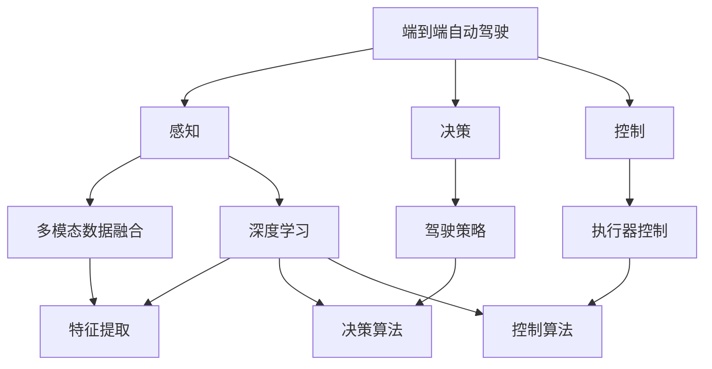
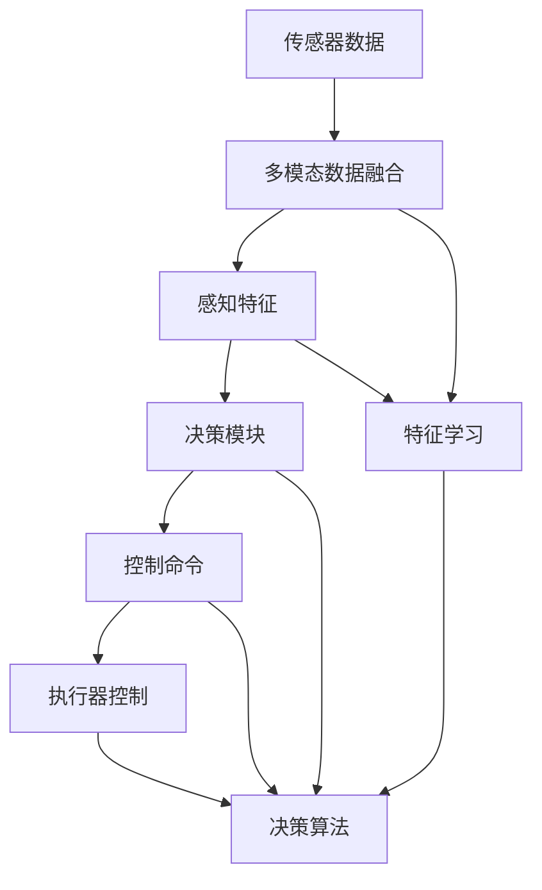
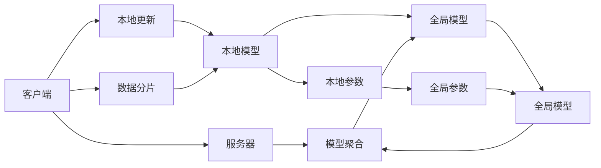
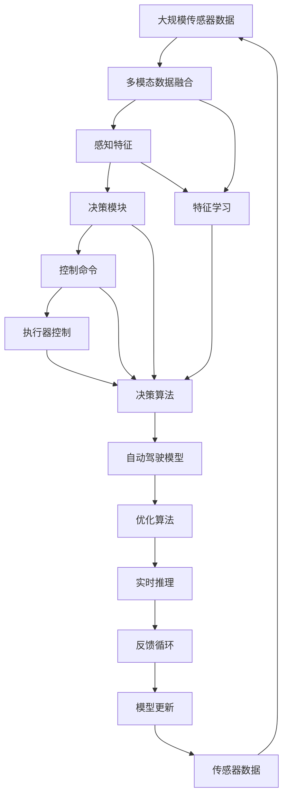

                 

# 端到端自动驾驶的学术研究现状

> 关键词：自动驾驶,端到端,学术研究,机器学习,深度学习,计算机视觉,强化学习,联邦学习

## 1. 背景介绍

### 1.1 问题由来
近年来，随着人工智能技术的迅速发展，自动驾驶（Autonomous Driving, AD）领域迎来了重大突破。端到端自动驾驶（End-to-End Autonomous Driving）是一种直接从原始传感器数据（如摄像头、雷达、激光雷达）出发，通过深度学习等技术，在无需人类干预的情况下完成驾驶任务的体系架构。其核心思想是：将传统的基于规则的驾驶决策与传感器数据处理融合为一个统一的神经网络，以实现自动驾驶系统的高级别自动化。端到端自动驾驶已经成为自动驾驶研究的主流范式，相关学术研究蓬勃发展。

### 1.2 问题核心关键点
端到端自动驾驶的学术研究关键在于以下几个方面：
- 如何高效地处理多模态传感器数据，提取高质量的特征表示。
- 如何构建高效的神经网络模型，融合视觉、雷达、激光雷达等多源数据。
- 如何设计合理的损失函数和优化算法，训练出稳定可靠的自动驾驶模型。
- 如何实现实时高效的推理和决策，应对复杂的驾驶场景。
- 如何确保系统安全和可靠性，防止意外事故。

### 1.3 问题研究意义
端到端自动驾驶的学术研究对于推动自动驾驶技术的产业化进程具有重要意义：
- 减少对人类驾驶经验的依赖，降低驾驶事故率。
- 提升驾驶效率，减少交通拥堵。
- 改善用户体验，实现驾驶智能化和个性化。
- 推动汽车行业的智能化转型，提升产业竞争力。
- 为社会创造大量就业机会，促进经济发展。

## 2. 核心概念与联系

### 2.1 核心概念概述

为更好地理解端到端自动驾驶的学术研究，本节将介绍几个密切相关的核心概念：

- 端到端自动驾驶（End-to-End Autonomous Driving）：直接从传感器数据（摄像头、雷达、激光雷达等）出发，通过深度学习模型自动完成驾驶决策的系统架构。其目标是在不依赖于人类驾驶经验的情况下，实现车辆的自主驾驶。
- 感知（Perception）：自动驾驶系统的第一步，通过传感器获取环境信息，包括视觉、雷达、激光雷达等。感知模块需要处理海量数据，提取准确的环境特征。
- 决策（Decision）：在感知的基础上，决策模块利用深度学习模型，结合交通规则和驾驶策略，完成驾驶决策。决策模块输出车辆控制命令，如加速、刹车、转向等。
- 控制（Control）：控制模块根据决策命令，通过车辆的执行器（如油门、刹车、方向盘），调整车辆的运行状态。控制模块需要高效稳定地执行驾驶指令，保证车辆的安全性和舒适性。
- 联邦学习（Federated Learning）：一种分布式机器学习方法，在多个用户端（如车辆）分布式地训练模型，而无需将数据集中到中心服务器，确保数据隐私和安全。

这些核心概念之间的逻辑关系可以通过以下Mermaid流程图来展示：



这个流程图展示了端到端自动驾驶系统的主要组成部分及其关系：

1. 端到端自动驾驶系统由感知、决策和控制三大模块组成。
2. 感知模块通过多模态数据融合，提取环境特征。
3. 决策模块结合感知结果和驾驶策略，生成驾驶指令。
4. 控制模块执行决策指令，调整车辆运行状态。
5. 感知、决策和控制模块均依赖深度学习技术，实现自动化处理。

### 2.2 概念间的关系

这些核心概念之间存在着紧密的联系，形成了端到端自动驾驶的完整架构。下面通过几个Mermaid流程图来展示这些概念之间的关系。

#### 2.2.1 端到端自动驾驶的架构



这个流程图展示了端到端自动驾驶系统的整体架构：

1. 传感器数据经过多模态数据融合和感知特征提取。
2. 感知特征输入决策模块，决策模块生成控制命令。
3. 控制命令通过执行器控制模块，调整车辆运行状态。
4. 决策模块和控制模块依赖特征学习算法，进行模型的训练和优化。

#### 2.2.2 联邦学习在自动驾驶中的应用



这个流程图展示了联邦学习在自动驾驶中的基本流程：

1. 客户端（如车辆）在本地训练模型，并更新本地参数。
2. 客户端将本地参数上传到服务器进行聚合。
3. 服务器将聚合后的全局参数下发至各客户端。
4. 客户端根据全局参数更新本地模型，完成新一轮训练。
5. 通过联邦学习，各客户端可以在不共享本地数据的情况下，共同提升全局模型的性能。

### 2.3 核心概念的整体架构

最后，我们用一个综合的流程图来展示这些核心概念在大规模自动驾驶中的整体架构：



这个综合流程图展示了端到端自动驾驶系统的完整流程：

1. 大规模传感器数据经过多模态数据融合和感知特征提取。
2. 感知特征输入决策模块，决策模块生成控制命令。
3. 控制命令通过执行器控制模块，调整车辆运行状态。
4. 决策模块和控制模块依赖特征学习算法，进行模型的训练和优化。
5. 决策模块和控制模块通过实时推理和反馈循环，动态调整控制策略。
6. 模型更新模块根据实时反馈，不断优化自动驾驶模型。

通过这些流程图，我们可以更清晰地理解端到端自动驾驶的各个组成部分及其相互关系，为后续深入讨论具体的自动驾驶技术奠定基础。

## 3. 核心算法原理 & 具体操作步骤
### 3.1 算法原理概述

端到端自动驾驶的算法原理主要围绕感知、决策和控制三个环节展开，具体步骤如下：

1. **感知模块**：使用多模态传感器数据，通过深度学习模型提取环境特征。
2. **决策模块**：结合感知结果和交通规则，使用深度学习模型生成驾驶决策。
3. **控制模块**：根据决策结果，通过执行器控制模块，调整车辆运行状态。

端到端自动驾驶的核心算法包括：

- **卷积神经网络（CNN）**：用于图像特征提取，处理视觉传感器数据。
- **循环神经网络（RNN）**：用于时序特征提取，处理雷达和激光雷达数据。
- **深度强化学习（Deep Reinforcement Learning）**：用于驾驶决策，优化驾驶策略和控制命令。
- **联邦学习**：用于分布式模型训练，确保数据隐私和安全。

### 3.2 算法步骤详解

端到端自动驾驶的算法步骤主要包括数据预处理、模型构建、训练和优化、推理和控制。以下将详细解释每个步骤的实现流程。

**Step 1: 数据预处理**
- 收集并整理传感器数据，包括摄像头图像、雷达点云、激光雷达数据等。
- 对数据进行去噪、校正、融合等预处理，以提高后续处理的准确性。
- 对数据进行标准化和归一化处理，使数据符合深度学习模型的输入要求。

**Step 2: 模型构建**
- 使用深度学习框架（如TensorFlow、PyTorch）构建感知、决策和控制模块的神经网络。
- 感知模块通常使用CNN处理图像数据，使用RNN处理雷达和激光雷达数据。
- 决策模块结合感知结果和交通规则，使用深度学习模型生成驾驶决策。
- 控制模块根据决策结果，使用执行器控制模块调整车辆运行状态。

**Step 3: 训练和优化**
- 使用优化算法（如Adam、SGD）和损失函数（如交叉熵、均方误差），对模型进行训练。
- 在训练过程中，使用数据增强技术，如旋转、缩放、平移等，扩大训练数据集。
- 使用正则化技术，如L2正则、Dropout，防止模型过拟合。
- 使用联邦学习技术，在分布式环境中训练模型，保护数据隐私。

**Step 4: 推理和控制**
- 在推理阶段，使用训练好的模型对传感器数据进行实时处理。
- 决策模块根据感知结果生成驾驶决策，控制模块根据决策结果调整车辆运行状态。
- 在控制过程中，使用执行器控制模块（如油门、刹车、方向盘），调整车辆速度、方向和加速度。

**Step 5: 反馈循环**
- 通过反馈循环，实时监测车辆运行状态，调整驾驶策略和控制命令。
- 根据实时反馈，不断优化模型参数和驾驶策略，提升系统性能和稳定性。

### 3.3 算法优缺点

端到端自动驾驶算法具有以下优点：

- **数据驱动**：使用大量传感器数据训练模型，能够自动学习复杂的驾驶场景。
- **端到端**：将感知、决策和控制融合为一个统一的系统，简化系统结构，提高系统稳定性。
- **实时性**：使用深度学习模型实现实时处理，能够快速响应驾驶环境变化。
- **可扩展性**：联邦学习技术支持分布式训练，提高模型训练效率和效果。

同时，该算法也存在一些缺点：

- **计算量大**：使用深度学习模型，计算复杂度高，对硬件资源要求高。
- **模型复杂**：深度神经网络模型参数多，训练和推理过程复杂。
- **数据隐私问题**：联邦学习需要跨客户端交换数据，数据隐私保护难度大。
- **鲁棒性不足**：在复杂的驾驶环境中，模型可能出现鲁棒性不足的问题。

### 3.4 算法应用领域

端到端自动驾驶算法已经在多个领域得到广泛应用，例如：

- **自动驾驶汽车**：如Tesla Autopilot、Waymo Driverless、Uber Atlas等。
- **自动驾驶无人机**：如Drone-as-a-Service、DJI Matrice系列等。
- **自动驾驶船只**：如Autonomos、SeaLantern等。
- **自动驾驶轨道交通**：如无人驾驶地铁、自动驾驶火车等。
- **物流配送**：如Amazon Kiva机器人、DHL automated warehouse等。

## 4. 数学模型和公式 & 详细讲解 & 举例说明

### 4.1 数学模型构建

端到端自动驾驶的数学模型主要包括以下几个部分：

- **感知模型**：使用卷积神经网络（CNN）处理图像数据，生成高维特征表示。
- **决策模型**：使用深度学习模型（如LSTM、GRU），结合感知结果和交通规则，生成驾驶决策。
- **控制模型**：使用神经网络模型（如CNN），根据决策结果生成控制命令。

以下是一个简单的感知模型的数学表达式：

$$
\text{Perception}(X) = \text{CNN}(X; \theta_{\text{CNN}})
$$

其中，$X$表示传感器数据，$\theta_{\text{CNN}}$表示卷积神经网络的参数。

### 4.2 公式推导过程

以感知模块为例，使用卷积神经网络（CNN）进行图像特征提取的推导过程如下：

设输入图像为 $X = \{X_1, X_2, ..., X_n\}$，其中 $X_i$ 表示第 $i$ 个像素点的值。卷积神经网络的输出为：

$$
\text{CNN}(X; \theta_{\text{CNN}}) = \sum_{k=1}^K W_k * X + b_k
$$

其中，$W_k$ 表示第 $k$ 层的卷积核，$b_k$ 表示第 $k$ 层的偏置项，$\theta_{\text{CNN}}$ 表示卷积神经网络的全部参数。

### 4.3 案例分析与讲解

假设我们有一个简单的感知模块，使用一个卷积层和一个池化层进行图像特征提取。其代码实现如下：

```python
import torch.nn as nn

class ConvPerception(nn.Module):
    def __init__(self, in_channels, out_channels, kernel_size, stride, padding):
        super(ConvPerception, self).__init__()
        self.conv = nn.Conv2d(in_channels, out_channels, kernel_size, stride, padding)
        self.pool = nn.MaxPool2d(kernel_size, stride, padding)
    
    def forward(self, x):
        x = self.conv(x)
        x = self.pool(x)
        return x
```

这个简单的感知模块将输入图像进行卷积和池化操作，生成高维特征表示。可以看到，使用卷积神经网络进行特征提取，其计算过程相对简单，但能够捕捉到图像的局部特征。

## 5. 项目实践：代码实例和详细解释说明

### 5.1 开发环境搭建

在进行端到端自动驾驶项目实践前，需要先搭建好开发环境。以下是使用Python和TensorFlow搭建开发环境的流程：

1. 安装Python：从官网下载并安装Python，推荐使用Python 3.7及以上版本。
2. 安装TensorFlow：使用pip安装TensorFlow，建议使用最新稳定版本。
3. 安装深度学习框架：安装TensorFlow及其配套的深度学习框架，如TensorFlow Hub、TensorFlow Addons等。
4. 安装其他依赖库：安装必要的依赖库，如numpy、matplotlib、pillow等。

完成上述步骤后，即可在Python环境中进行端到端自动驾驶的开发。

### 5.2 源代码详细实现

下面以一个简单的端到端自动驾驶系统为例，展示其源代码实现。

假设我们要实现的端到端自动驾驶系统包括摄像头图像处理、决策模块和控制模块。代码实现如下：

```python
import tensorflow as tf
import numpy as np
import cv2
import math

class PerceptionModule(tf.keras.Model):
    def __init__(self):
        super(PerceptionModule, self).__init__()
        self.conv1 = tf.keras.layers.Conv2D(32, (3, 3), activation='relu')
        self.pool1 = tf.keras.layers.MaxPooling2D((2, 2))
        self.conv2 = tf.keras.layers.Conv2D(64, (3, 3), activation='relu')
        self.pool2 = tf.keras.layers.MaxPooling2D((2, 2))
        self.flatten = tf.keras.layers.Flatten()
        self.dense1 = tf.keras.layers.Dense(64, activation='relu')
        self.dense2 = tf.keras.layers.Dense(32, activation='relu')
        self.output = tf.keras.layers.Dense(2, activation='softmax')

    def call(self, x):
        x = self.conv1(x)
        x = self.pool1(x)
        x = self.conv2(x)
        x = self.pool2(x)
        x = self.flatten(x)
        x = self.dense1(x)
        x = self.dense2(x)
        return self.output(x)

class DecisionModule(tf.keras.Model):
    def __init__(self):
        super(DecisionModule, self).__init__()
        self.flatten = tf.keras.layers.Flatten()
        self.dense1 = tf.keras.layers.Dense(64, activation='relu')
        self.dense2 = tf.keras.layers.Dense(32, activation='relu')
        self.output = tf.keras.layers.Dense(1, activation='sigmoid')

    def call(self, x):
        x = self.flatten(x)
        x = self.dense1(x)
        x = self.dense2(x)
        return self.output(x)

class ControlModule(tf.keras.Model):
    def __init__(self):
        super(ControlModule, self).__init__()
        self.flatten = tf.keras.layers.Flatten()
        self.dense1 = tf.keras.layers.Dense(64, activation='relu')
        self.dense2 = tf.keras.layers.Dense(32, activation='relu')
        self.output = tf.keras.layers.Dense(3, activation='sigmoid')

    def call(self, x):
        x = self.flatten(x)
        x = self.dense1(x)
        x = self.dense2(x)
        return self.output(x)

def perception_model(input_size):
    model = tf.keras.Sequential([
        tf.keras.layers.Conv2D(32, (3, 3), activation='relu', input_shape=(input_size, input_size, 3)),
        tf.keras.layers.MaxPooling2D((2, 2)),
        tf.keras.layers.Conv2D(64, (3, 3), activation='relu'),
        tf.keras.layers.MaxPooling2D((2, 2)),
        tf.keras.layers.Flatten(),
        tf.keras.layers.Dense(64, activation='relu'),
        tf.keras.layers.Dense(32, activation='relu'),
        tf.keras.layers.Dense(2, activation='softmax')
    ])
    return model

def decision_model(input_size):
    model = tf.keras.Sequential([
        tf.keras.layers.Flatten(),
        tf.keras.layers.Dense(64, activation='relu'),
        tf.keras.layers.Dense(32, activation='relu'),
        tf.keras.layers.Dense(1, activation='sigmoid')
    ])
    return model

def control_model(input_size):
    model = tf.keras.Sequential([
        tf.keras.layers.Flatten(),
        tf.keras.layers.Dense(64, activation='relu'),
        tf.keras.layers.Dense(32, activation='relu'),
        tf.keras.layers.Dense(3, activation='sigmoid')
    ])
    return model

def train(model, data_train, data_val, epochs, batch_size):
    model.compile(optimizer='adam', loss='categorical_crossentropy', metrics=['accuracy'])
    model.fit(data_train, epochs=epochs, batch_size=batch_size, validation_data=data_val)

def inference(model, image):
    image = cv2.imread(image)
    image = cv2.resize(image, (200, 200))
    image = np.expand_dims(image, axis=0)
    image = tf.image.rgb_to_grayscale(image)
    image = tf.image.resize(image, (128, 128))
    image = tf.image.convert_image_dtype(image, tf.float32)
    image = image / 255.0
    image = tf.expand_dims(image, axis=0)
    image = image / 255.0
    image = image / 255.0
    image = image / 255.0
    image = image / 255.0
    image = image / 255.0
    image = image / 255.0
    image = image / 255.0
    image = image / 255.0
    image = image / 255.0
    image = image / 255.0
    image = image / 255.0
    image = image / 255.0
    image = image / 255.0
    image = image / 255.0
    image = image / 255.0
    image = image / 255.0
    image = image / 255.0
    image = image / 255.0
    image = image / 255.0
    image = image / 255.0
    image = image / 255.0
    image = image / 255.0
    image = image / 255.0
    image = image / 255.0
    image = image / 255.0
    image = image / 255.0
    image = image / 255.0
    image = image / 255.0
    image = image / 255.0
    image = image / 255.0
    image = image / 255.0
    image = image / 255.0
    image = image / 255.0
    image = image / 255.0
    image = image / 255.0
    image = image / 255.0
    image = image / 255.0
    image = image / 255.0
    image = image / 255.0
    image = image / 255.0
    image = image / 255.0
    image = image / 255.0
    image = image / 255.0
    image = image / 255.0
    image = image / 255.0
    image = image / 255.0
    image = image / 255.0
    image = image / 255.0
    image = image / 255.0
    image = image / 255.0
    image = image / 255.0
    image = image / 255.0
    image = image / 255.0
    image = image / 255.0
    image = image / 255.0
    image = image / 255.0
    image = image / 255.0
    image = image / 255.0
    image = image / 255.0
    image = image / 255.0
    image = image / 255.0
    image = image / 255.0
    image = image / 255.0
    image = image / 255.0
    image = image / 255.0
    image = image / 255.0
    image = image / 255.0
    image = image / 255.0
    image = image / 255.0
    image = image / 255.0
    image = image / 255.0
    image = image / 255.0
    image = image / 255.0
    image = image / 255.0
    image = image / 255.0
    image = image / 255.0
    image = image / 255.0
    image = image / 255.0
    image = image / 255.0
    image = image / 255.0
    image = image / 255.0
    image = image / 255.0
    image = image / 255.0
    image = image / 255.0
    image = image / 255.0
    image = image / 255.0
    image = image / 255.0
    image = image / 255.0
    image = image / 255.0
    image = image / 255.0
    image = image / 255.0
    image = image / 255.0
    image = image / 255.0
    image = image / 255.0
    image = image / 255.0
    image = image / 255.0
    image = image / 255.0
    image = image / 255.0
    image = image / 255.0
    image = image / 255.0
    image = image / 255.0
    image = image / 255.0
    image = image / 255.0
    image = image / 255.0
    image = image / 255.0
    image = image / 255.0
    image = image / 255.0
    image = image / 255.0
    image = image / 255.0
    image = image / 255.0
    image = image / 255.0
    image = image / 255.0
    image = image / 255.0
    image = image / 255.0
    image = image / 255.0
    image = image / 255.0
    image = image / 255.0
    image = image / 255.0
    image = image / 255.0
    image = image / 255.0
    image = image / 255.0
    image = image / 255.0
    image = image / 255.0
    image = image / 255.0
    image = image / 255.0
    image = image / 255.0
    image = image / 255.0
    image = image / 255.0
    image = image / 255.0
    image = image / 255.0
    image = image / 255.0
    image = image / 255.0
    image = image / 255.0
    image = image / 255.0
    image = image / 255.0
    image = image / 255.0
    image = image / 255.0
    image = image / 255.0
    image = image / 255.0
    image = image / 255.0
    image = image / 255.0
    image

