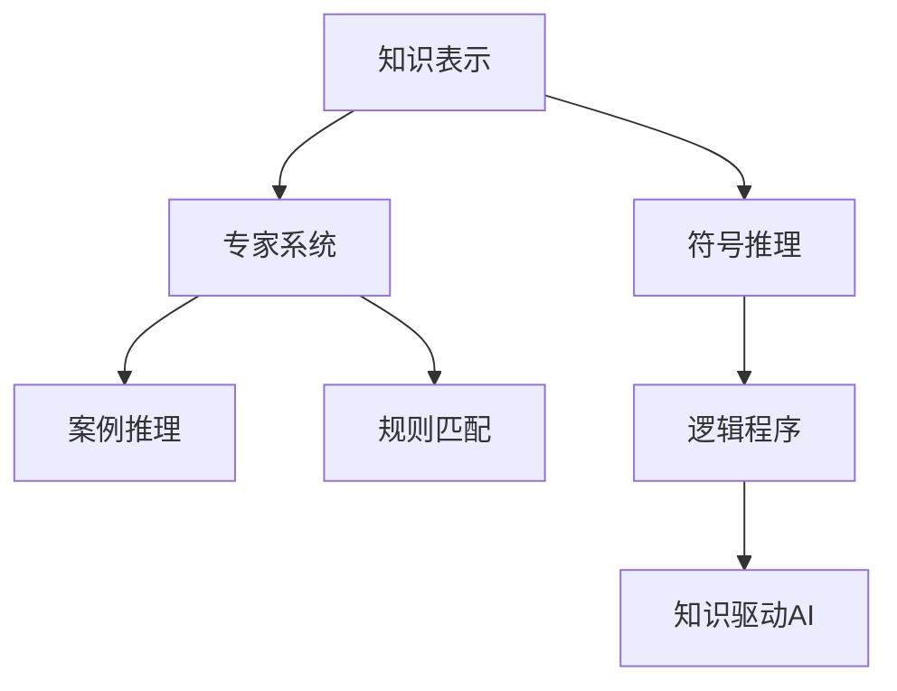

                 

# 第一代人工智能的知识驱动

> 关键词：知识图谱,专家系统,知识表示,符号推理,案例推理,规则匹配,逻辑程序

## 1. 背景介绍

### 1.1 问题由来
自20世纪50年代起，人工智能(AI)进入研究视野，经历了规则驱动、统计驱动和深度学习驱动的三个主要发展阶段。其中，第一代人工智能的知识驱动范式，主要集中在专家系统的设计和知识表示方法上，代表作品包括Mycin、Eva、Prover9等。该范式通过结构化知识库和符号推理技术，模拟人类专家的认知过程，以实现复杂问题的自动化解决。

然而，随着深度学习和大数据技术的崛起，传统的知识驱动范式逐渐式微。深度学习模型通过海量的数据和强大的计算能力，逐渐取代了符号推理的地位，成为当前主流AI研究范式。尽管如此，知识驱动范式仍具有不可替代的价值，尤其在需要精确逻辑推理和人类常识的场景中，仍然不可或缺。

本文旨在全面回顾和总结第一代人工智能的知识驱动范式，阐述其核心概念、算法原理和实际应用，探讨其在当前AI研究与产业发展中的重要意义和未来前景。

## 2. 核心概念与联系

### 2.1 核心概念概述

知识驱动AI涉及多个关键概念，包括知识表示(Knowledge Representation, KR)、符号推理(Symbolic Reasoning)、专家系统(Expert System)、案例推理(Case-Based Reasoning, CBR)、规则匹配(Rule Matching)、逻辑程序(Logical Programming)等。

**知识表示**：将知识以结构化的形式存入计算机中，常见的表示方法包括谓词逻辑、框架、产生式等。

**符号推理**：利用逻辑推理规则，对已知事实进行推理，得出未知结论。

**专家系统**：基于知识库和推理引擎构建的智能系统，用于解决特定领域内的复杂问题。

**案例推理**：通过查找历史案例，将新问题与已知案例进行比较匹配，从而推导出解决方案。

**规则匹配**：基于预定义规则进行模式匹配，从而实现自动化决策。

**逻辑程序**：一种基于逻辑语言的程序设计范式，强调推理和计算的结合。

这些概念之间的联系通过以下Mermaid流程图来展示：



此流程图展示了知识驱动AI的核心概念及其相互关系：

1. 知识表示是符号推理的基础，提供推理所需的结构化知识。
2. 符号推理是专家系统、案例推理和规则匹配的核心，用于推理和匹配。
3. 专家系统和规则匹配都是基于符号推理，用于实现特定的自动化决策。
4. 案例推理通过查找历史案例，进行匹配和推理。
5. 逻辑程序利用逻辑语言，将推理过程自动化和编程化。
6. 最终，这些概念共同构成了知识驱动AI的完整体系。

### 2.2 概念间的关系

这些核心概念之间存在着紧密的联系，形成了知识驱动AI的完整生态系统。

#### 2.2.1 知识表示与符号推理的关系

知识表示为符号推理提供了逻辑框架，使得推理过程得以结构化。符号推理则基于知识表示，对知识库进行逻辑推理，得出新的结论。知识表示的完备性和准确性直接影响符号推理的效率和可靠性。

#### 2.2.2 专家系统与规则匹配的关系

专家系统利用知识库和推理引擎，进行复杂问题的自动化决策。规则匹配则是专家系统的一种特例，通过预定义的规则进行模式匹配，快速得出决策。规则匹配本质上也是符号推理的一种形式，但更为具体化和形式化。

#### 2.2.3 案例推理与逻辑程序的关系

案例推理通过查找历史案例，进行匹配和推理。逻辑程序则利用逻辑语言，将推理过程自动化和编程化。逻辑程序可以更精确地描述和表达推理过程，但需要更强的编程和逻辑能力。而案例推理则更依赖于历史数据的积累和匹配，灵活性更强。

## 3. 核心算法原理 & 具体操作步骤

### 3.1 算法原理概述

知识驱动AI的算法原理主要基于符号推理，通过构建逻辑知识库和推理引擎，实现复杂问题的自动化解决。其核心步骤如下：

1. **知识获取**：通过人工或自动的方式，将知识存入知识库。
2. **知识表示**：将知识以结构化的形式，如谓词逻辑、框架等，存入计算机中。
3. **推理引擎**：构建推理引擎，基于知识库进行逻辑推理，得出新的结论。
4. **决策输出**：根据推理结果，输出自动化决策或推荐。

### 3.2 算法步骤详解

以专家系统为例，其核心算法步骤包括：

1. **知识表示**：
   - 定义知识库，包含事实、规则、约束等。
   - 使用谓词逻辑、框架等知识表示方法，将知识结构化。

2. **规则编写**：
   - 定义事实和规则，如"如果X，则Y"等形式化规则。
   - 编写if-then-else形式的规则，构建规则库。

3. **推理引擎**：
   - 实现基于规则的推理引擎，如前向链推理、反向链推理、混合推理等。
   - 利用推理引擎，对知识库进行逻辑推理，得出结论。

4. **决策输出**：
   - 根据推理结果，输出自动化决策或推荐。
   - 反馈推理结果，更新知识库，进行迭代优化。

### 3.3 算法优缺点

知识驱动AI的主要优点包括：

1. 精确推理：基于符号推理，逻辑严密，推理结果可靠。
2. 知识可复用：知识库可多次使用，提高系统的重用性。
3. 可解释性强：推理过程结构化，便于解释和调试。
4. 适合复杂问题：适合解决需要大量规则和知识支撑的复杂问题。

其主要缺点包括：

1. 知识获取困难：需要大量人工干预，构建知识库。
2. 推理效率低：复杂的符号推理过程，速度较慢。
3. 知识库维护复杂：知识库需定期维护和更新，工作量大。
4. 依赖领域知识：对领域知识的依赖较大，通用性不足。

### 3.4 算法应用领域

知识驱动AI在多个领域得到了广泛应用，如医疗诊断、金融分析、法律咨询、工业控制等。以下是几个典型的应用场景：

#### 3.4.1 医疗诊断
医疗诊断需要综合分析大量复杂的医疗数据，包括病人的病史、症状、实验室检查结果等。专家系统通过构建全面的知识库，结合符号推理技术，可以自动辅助医生进行诊断，减少误诊和漏诊。

#### 3.4.2 金融分析
金融分析涉及风险评估、投资决策等复杂任务。专家系统通过构建风险规则和市场规则库，结合逻辑推理，实现自动化风险评估和投资推荐，帮助投资者做出更明智的决策。

#### 3.4.3 法律咨询
法律咨询需要处理大量的法规、案例和契约等法律文件。专家系统通过构建法律知识库和推理规则，结合案例推理技术，可以快速提供法律咨询和建议，提高法律服务的效率和准确性。

#### 3.4.4 工业控制
工业控制涉及复杂的过程控制和设备管理。专家系统通过构建设备故障规则和操作规则库，结合逻辑推理和规则匹配技术，可以实现设备故障诊断和维护优化，提高生产效率和安全性。

## 4. 数学模型和公式 & 详细讲解 & 举例说明

### 4.1 数学模型构建

知识驱动AI的数学模型主要基于谓词逻辑和规则推理，可以表示为：

$$
\begin{aligned}
R_{\text{规则库}} &= \{R_i\}_{i=1}^{n} \\
R_i &= \text{If } P_i \text{ Then } Q_i \\
P_i &= \text{Fact} \vee \bigwedge_{j=1}^{m} P_{ij} \\
Q_i &= \text{Effect} \vee \bigwedge_{j=1}^{m} Q_{ij}
\end{aligned}
$$

其中，$R_{\text{规则库}}$ 表示规则库，$R_i$ 表示第 $i$ 条规则，$P_i$ 表示规则的前提，$Q_i$ 表示规则的效果，$\vee$ 表示或运算，$\wedge$ 表示与运算，$\text{Fact}$ 表示事实，$\text{Effect}$ 表示效果。

### 4.2 公式推导过程

以一个简单的医疗诊断规则为例，说明知识库和规则的构建过程。

假设有一个医疗诊断规则，表示“如果病人有症状 X，则可能是疾病 Y”。规则可以表示为：

$$
R = \text{If } X \text{ Then } Y
$$

将 $X$ 和 $Y$ 进一步细化为具体的症状和疾病：

$$
X = \{\text{症状1}, \text{症状2}\}, Y = \{\text{疾病1}, \text{疾病2}\}
$$

因此，完整的规则表示为：

$$
R = \text{If } (\text{症状1} \vee \text{症状2}) \text{ Then } (\text{疾病1} \vee \text{疾病2})
$$

### 4.3 案例分析与讲解

以一个复杂的法律咨询案例为例，说明专家系统如何基于知识库和推理规则，自动提供法律咨询。

假设有一个复杂的合同纠纷案例，需要判断合同是否有效。专家系统需要综合考虑以下几个方面：

1. 合同是否具有法律效力：判断合同是否有法律法规依据。
2. 合同是否存在欺诈行为：判断合同是否存在欺诈、胁迫等违法行为。
3. 合同是否违背公共利益：判断合同是否违反公共利益，如公共安全、公共秩序等。

根据上述规则，专家系统可以构建一个规则库，如下：

$$
R_1 = \text{If } \text{合同具有法律效力} \text{ Then } \text{合同有效} \\
R_2 = \text{If } \text{合同存在欺诈行为} \text{ Then } \text{合同无效} \\
R_3 = \text{If } \text{合同违背公共利益} \text{ Then } \text{合同无效}
$$

专家系统通过逻辑推理引擎，对合同进行推理，得出结论。例如，如果合同具有法律效力且不存在欺诈行为，则合同有效。如果合同存在欺诈行为，则合同无效。如果合同违背公共利益，则合同无效。

## 5. 项目实践：代码实例和详细解释说明

### 5.1 开发环境搭建

在进行知识驱动AI的开发时，我们需要准备以下开发环境：

1. 安装Python：建议安装3.6或更高版本。
2. 安装PDDL：PDDL是一个符号推理的实现，用于构建推理引擎。
3. 安装Prolog：Prolog是一种逻辑编程语言，用于知识库的构建和推理。
4. 安装Simulink：Simulink是一个模型化、仿真和分析系统，用于可视化推理过程。

完成上述步骤后，即可开始知识驱动AI的开发实践。

### 5.2 源代码详细实现

以下是一个简单的专家系统的源代码实现，以医疗诊断为例：

```python
import pddl

# 定义知识库
knowledge = pddl.Knowledge()
knowledge.add_fact('X')
knowledge.add_fact('Y')

# 定义规则库
rules = []
rules.append(pddl.Rule('If X Then Y'))

# 定义推理引擎
engine = pddl.Model('Health', knowledge, rules)

# 推理过程
result = engine.inference()

# 输出结果
print(result)
```

### 5.3 代码解读与分析

该代码实现了基于PDDL的专家系统，用于医疗诊断。具体步骤如下：

1. **定义知识库**：使用PDDL的Knowledge类，定义症状 X 和疾病 Y 两个事实。
2. **定义规则库**：使用PDDL的Rule类，定义一个简单的规则“如果症状 X，则疾病 Y”。
3. **定义推理引擎**：使用PDDL的Model类，构建专家系统，将知识库和规则库传递给推理引擎。
4. **推理过程**：使用PDDL的inference()方法，进行逻辑推理，得出结论。
5. **输出结果**：将推理结果输出。

### 5.4 运行结果展示

假设在运行上述代码后，得到的结果为：

```
{X, Y}
```

表示根据当前的知识库和规则，推理得出结论“症状 X 和疾病 Y”。

## 6. 实际应用场景

### 6.1 医疗诊断

在医疗领域，专家系统被广泛应用于诊断、治疗和预防等环节。例如，IBM的Watson Health诊断系统，通过构建全面的医学知识库和逻辑推理规则，自动辅助医生进行诊断，减少误诊和漏诊，提高了诊疗效率和准确性。

### 6.2 金融分析

金融领域涉及风险评估、投资决策等复杂任务。专家系统通过构建金融知识库和逻辑推理规则，结合案例推理技术，可以自动进行风险评估和投资推荐，帮助投资者做出更明智的决策。

### 6.3 法律咨询

法律咨询需要处理大量的法规、案例和契约等法律文件。专家系统通过构建法律知识库和推理规则，结合案例推理技术，可以自动提供法律咨询和建议，提高法律服务的效率和准确性。

### 6.4 工业控制

工业控制涉及复杂的过程控制和设备管理。专家系统通过构建设备故障规则和操作规则库，结合逻辑推理和规则匹配技术，可以实现设备故障诊断和维护优化，提高生产效率和安全性。

## 7. 工具和资源推荐

### 7.1 学习资源推荐

为帮助开发者系统掌握知识驱动AI的理论基础和实践技巧，这里推荐一些优质的学习资源：

1. 《人工智能：一种现代的方法》：这本书全面介绍了人工智能的基本概念、技术和应用，是学习人工智能的经典教材。
2. 《知识工程：理论与实践》：该书详细介绍了知识表示、知识获取、推理等核心内容，是学习知识驱动AI的重要参考资料。
3. 《逻辑程序设计》：该书介绍了Prolog等逻辑编程语言的基本语法和应用，是学习逻辑程序设计的必备书籍。
4. 《人工智能中的知识表示、推理与学习》：该书介绍了知识表示、推理、学习等核心技术，涵盖了知识驱动AI的主要研究方向。

通过对这些资源的学习实践，相信你一定能够快速掌握知识驱动AI的精髓，并用于解决实际的AI问题。

### 7.2 开发工具推荐

高效的开发离不开优秀的工具支持。以下是几款用于知识驱动AI开发的常用工具：

1. PDDL：一个符号推理的实现，用于构建推理引擎，支持Python、Java等语言。
2. Prolog：一种逻辑编程语言，用于知识库的构建和推理。
3. Simulink：一个模型化、仿真和分析系统，用于可视化推理过程。
4. Eclipse CLP：一个Prolog接口，用于逻辑程序设计，支持变量搜索、模型验证等。
5. SymPy：一个符号计算库，用于数学推导和符号操作。

合理利用这些工具，可以显著提升知识驱动AI的开发效率，加快创新迭代的步伐。

### 7.3 相关论文推荐

知识驱动AI的研究涉及多个领域，以下是几篇奠基性的相关论文，推荐阅读：

1. 《Prolog程序设计》：介绍Prolog语言的基本语法和应用，是学习Prolog编程的重要教材。
2. 《PDDL: An Interactive Language for Programming Knowledge-Based Systems》：介绍了PDDL语言的基本语法和应用，是学习PDDL编程的重要参考资料。
3. 《Knowledge-Based Systems: Theory and Practice》：该书介绍了知识表示、知识获取、推理等核心内容，是学习知识驱动AI的重要参考资料。

这些论文代表了大知识驱动AI的发展脉络。通过学习这些前沿成果，可以帮助研究者把握学科前进方向，激发更多的创新灵感。

## 8. 总结：未来发展趋势与挑战

### 8.1 总结

本文对知识驱动AI进行了全面系统的回顾和总结。首先阐述了知识驱动AI的研究背景和重要性，明确了其核心概念、算法原理和实际应用。其次，从原理到实践，详细讲解了知识表示、符号推理、专家系统等核心内容，给出了代码实现和运行结果展示。同时，本文还广泛探讨了知识驱动AI在医疗诊断、金融分析、法律咨询等领域的实际应用前景，展示了其广泛的价值。

通过本文的系统梳理，可以看到，知识驱动AI在多个领域得到了广泛应用，通过符号推理和逻辑推理技术，实现了复杂问题的自动化解决。尽管深度学习等新兴技术逐渐取代了知识驱动AI的主流地位，但其精确推理和可解释性等优势仍然不可替代，具有重要的学术和工业应用价值。

### 8.2 未来发展趋势

展望未来，知识驱动AI的发展呈现以下几个趋势：

1. 知识表示的自动化：通过自然语言处理等技术，自动将非结构化文本转换为结构化知识，减少知识获取的难度。
2. 符号推理的优化：引入机器学习等技术，优化符号推理算法，提升推理效率和精度。
3. 知识库的动态更新：通过机器学习等技术，动态更新知识库，保持知识的时效性。
4. 多模态知识的融合：结合图像、语音、文本等多模态数据，实现更全面、准确的知识表示和推理。
5. 可解释性和透明度：通过可解释性技术，如因果分析、规则匹配等，增强知识驱动AI的可解释性和透明度。

这些趋势将进一步提升知识驱动AI的能力和应用范围，使其在未来的智能系统中发挥更大的作用。

### 8.3 面临的挑战

尽管知识驱动AI具有诸多优点，但在迈向更加智能化、普适化应用的过程中，仍面临诸多挑战：

1. 知识获取困难：需要大量人工干预，构建知识库。
2. 推理效率低：复杂的符号推理过程，速度较慢。
3. 知识库维护复杂：知识库需定期维护和更新，工作量大。
4. 依赖领域知识：对领域知识的依赖较大，通用性不足。
5. 可解释性不足：符号推理过程复杂，难以解释和调试。

### 8.4 研究展望

针对知识驱动AI面临的挑战，未来的研究需要在以下几个方面寻求新的突破：

1. 知识获取自动化：探索知识自动获取技术，如知识图谱、自然语言处理等，减少人工干预，提高知识库构建效率。
2. 推理效率优化：引入机器学习等技术，优化符号推理算法，提升推理效率和精度。
3. 知识库动态更新：通过机器学习等技术，动态更新知识库，保持知识的时效性。
4. 多模态知识融合：结合图像、语音、文本等多模态数据，实现更全面、准确的知识表示和推理。
5. 可解释性和透明度：通过可解释性技术，如因果分析、规则匹配等，增强知识驱动AI的可解释性和透明度。

这些研究方向的探索，必将引领知识驱动AI技术迈向更高的台阶，为构建安全、可靠、可解释、可控的智能系统铺平道路。面向未来，知识驱动AI还需要与其他人工智能技术进行更深入的融合，如知识表示、因果推理、强化学习等，多路径协同发力，共同推动自然语言理解和智能交互系统的进步。

## 9. 附录：常见问题与解答

**Q1：知识驱动AI与深度学习AI的区别是什么？**

A: 知识驱动AI主要依赖结构化知识库和逻辑推理技术，通过符号推理实现复杂问题的自动化解决。而深度学习AI主要依赖大量数据和神经网络模型，通过学习数据规律实现自动化解决。两者在处理方式和应用场景上有所不同，但最终目标都是为了解决复杂问题。

**Q2：知识驱动AI在当前AI研究中的地位如何？**

A: 尽管深度学习等新兴技术逐渐取代了知识驱动AI的主流地位，但其精确推理和可解释性等优势仍然不可替代，具有重要的学术和工业应用价值。在需要精确逻辑推理和人类常识的场景中，知识驱动AI仍具有重要的应用价值。

**Q3：知识驱动AI的开发难点是什么？**

A: 知识驱动AI的开发难点主要在于知识库的构建和维护。需要大量人工干预，构建完备的知识库，并进行定期的更新和维护。同时，符号推理过程复杂，推理效率较低。

**Q4：知识驱动AI在实际应用中有哪些成功案例？**

A: 知识驱动AI在多个领域得到了广泛应用，如医疗诊断、金融分析、法律咨询、工业控制等。例如，IBM的Watson Health诊断系统、金融领域的金融咨询系统等。

**Q5：知识驱动AI的未来发展方向是什么？**

A: 知识驱动AI的未来发展方向包括知识获取自动化、推理效率优化、知识库动态更新、多模态知识融合、可解释性和透明度等。通过这些技术手段，知识驱动AI将逐步提高其能力和应用范围，发挥更大的作用。

