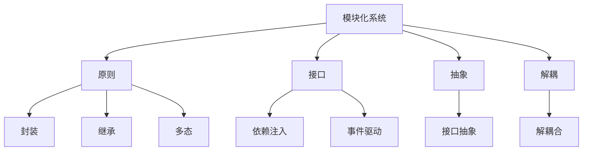
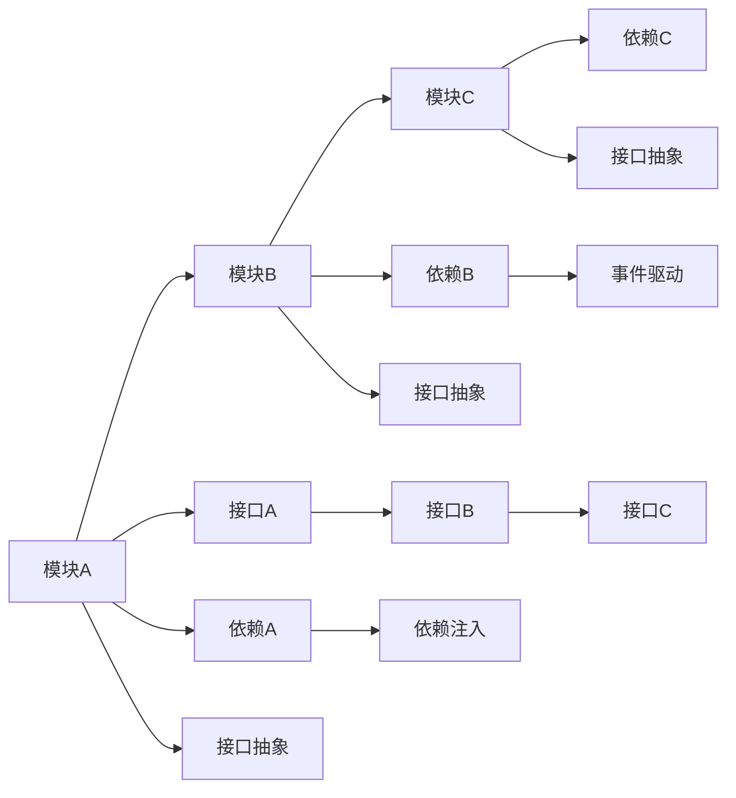
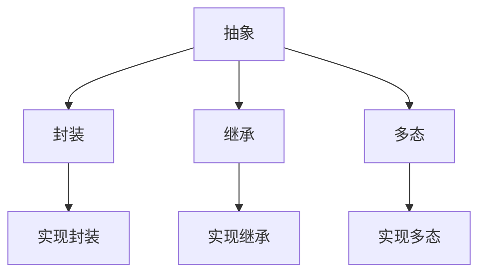
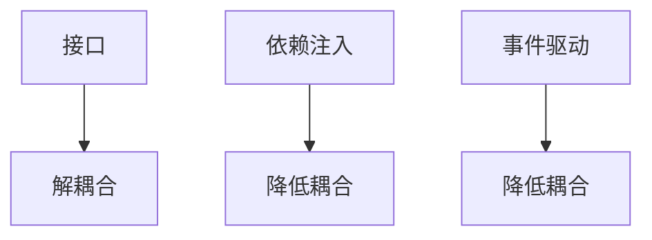

                 

# 第一性原理：找到基本元素、构建概念框架

## 1. 背景介绍

第一性原理是哲学中常用的一个概念，它指的是一个理论体系中最基础、最原始的原理或公理，这些原理或公理不需要依赖其他理论来解释，而是直接从基本观察和逻辑推导而来。在科学和工程领域，第一性原理也被用来指导创新和设计。从原理出发，可以避免陷入现有知识体系的框架束缚，直接从基础构建全新的理论和技术。

## 2. 核心概念与联系

### 2.1 核心概念概述

在软件工程和计算机科学中，第一性原理也可以被理解为一种设计思想，即从基本原理出发，直接推导出构建系统的模块和框架。这个过程不需要依赖现有技术，而是从问题本质出发，构建一个基本的模块化系统，然后再在其基础上进行迭代和扩展。

以下列举几个关键概念，并展示其核心思想：

- **模块化系统(Modular System)**：将系统拆分成多个独立模块，每个模块实现一个单一功能，通过接口进行通信。模块化系统有助于提高代码的可重用性和可扩展性。

- **原则(Principle)**：指导系统设计的根本性原理，例如面向对象设计中的封装、继承、多态等原则。原则是模块化系统的基本规则，确保系统的稳定性和可维护性。

- **接口(Interface)**：模块之间的通信接口，用于传递数据和调用函数。良好的接口设计可以降低模块之间的耦合，提高系统的灵活性。

- **抽象(Abstraction)**：将具体细节隐藏起来，只保留关键特征和行为，从而简化复杂系统的设计。抽象是模块化系统中必不可少的技术手段。

- **解耦(Coupling)**：将模块之间的依赖关系降到最低，提高系统的稳定性和可扩展性。解耦可以采用许多技术手段，如依赖注入、事件驱动等。

这些概念之间有着紧密的联系，共同构成了模块化系统设计的核心框架。以下是这些概念之间的联系和逻辑关系，通过Mermaid流程图展示：



### 2.2 概念间的关系

这些核心概念之间存在着紧密的联系，共同构成了模块化系统设计的完整框架。以下是这些概念之间的联系和逻辑关系，通过Mermaid流程图展示：

#### 2.2.1 模块化系统的基本结构



这个流程图展示了模块化系统的基本结构，每个模块之间通过接口进行通信，依赖关系通过接口注入和事件驱动等方式进行管理，从而实现系统的解耦和可扩展性。

#### 2.2.2 抽象与原则的联系



这个流程图展示了抽象与封装、继承、多态等原则之间的联系。抽象通过隐藏具体实现，提供了封装的接口，使得模块之间的关系更加稳定。同时，抽象也通过继承和多态等机制，增强了系统的灵活性和可扩展性。

#### 2.2.3 接口与解耦的关系



这个流程图展示了接口、依赖注入、事件驱动等技术手段如何帮助实现系统的解耦。接口通过定义模块之间的通信协议，降低了模块之间的耦合。依赖注入和事件驱动等技术进一步减少了依赖关系，使得系统更加灵活和可扩展。

## 3. 核心算法原理 & 具体操作步骤

### 3.1 算法原理概述

基于第一性原理构建模块化系统，其核心思想是从基本原理出发，设计出系统的基本模块和接口，然后通过迭代和扩展，构建出完整的功能系统。以下是构建模块化系统的基本算法原理：

1. **识别问题核心要素**：从问题本质出发，识别出构成系统的主要核心要素，包括功能、数据、交互等。
2. **设计基本模块**：根据核心要素设计出系统的基本模块，每个模块实现一个单一功能。
3. **定义接口和依赖**：为模块之间设计接口和依赖关系，确保模块之间通信和数据传递的安全性。
4. **实现抽象和原则**：在模块设计和接口定义过程中，实现封装、继承、多态等原则，增强系统的稳定性和可扩展性。
5. **迭代扩展**：根据实际需求，不断迭代和扩展系统的模块和接口，构建出完整的系统功能。

### 3.2 算法步骤详解

以下是基于第一性原理构建模块化系统的详细步骤：

**Step 1: 识别问题核心要素**
- 确定系统的主要功能需求。
- 分析系统中的数据流和交互关系。
- 确定系统中必须实现的基本功能模块。

**Step 2: 设计基本模块**
- 根据核心要素设计出系统的基本模块。
- 每个模块实现一个单一功能，确保模块之间功能独立。
- 使用接口定义模块之间的通信协议。

**Step 3: 定义接口和依赖**
- 为模块之间设计接口，定义模块之间的通信方式。
- 使用依赖注入、事件驱动等技术降低模块之间的耦合关系。
- 确保模块之间的依赖关系安全可靠。

**Step 4: 实现抽象和原则**
- 实现封装、继承、多态等原则，增强系统的稳定性和可扩展性。
- 使用接口抽象技术，将具体实现细节隐藏起来，简化系统设计。

**Step 5: 迭代扩展**
- 根据实际需求，不断迭代和扩展系统的模块和接口。
- 引入新的模块和接口，扩展系统功能。
- 优化系统性能，提高系统的稳定性和可扩展性。

### 3.3 算法优缺点

基于第一性原理构建模块化系统有以下优点：

- **模块化设计**：通过模块化设计，系统可以更加灵活和可扩展，降低了开发和维护成本。
- **稳定性和可维护性**：封装、继承、多态等原则增强了系统的稳定性和可维护性。
- **可重用性**：模块化设计提高了代码的可重用性，减少了开发时间和成本。

同时，这种方法也存在一些缺点：

- **设计复杂性**：模块化设计需要仔细设计和规划，可能增加设计复杂度。
- **初期开发成本高**：由于模块化设计需要重新设计系统架构，初期开发成本可能较高。

### 3.4 算法应用领域

基于第一性原理构建模块化系统的方法，适用于各种软件工程和计算机科学领域。以下是几个主要应用领域：

- **企业级应用系统**：如ERP系统、CRM系统、供应链管理系统等。
- **Web应用系统**：如电商平台、社交网络、内容管理系统等。
- **移动应用系统**：如手机应用、移动端管理系统等。
- **物联网系统**：如智能家居、智能城市、车联网等。
- **人工智能系统**：如自然语言处理、计算机视觉、语音识别等。

这些领域都需要构建复杂的功能系统，通过模块化设计和第一性原理，可以显著提升系统设计的质量和效率。

## 4. 数学模型和公式 & 详细讲解 & 举例说明

### 4.1 数学模型构建

为了更好地理解模块化系统的数学模型，我们将构建一个简单的模块化系统，并使用数学语言进行描述。

假设我们正在设计一个模块化系统，用于处理简单的数学运算任务。系统包含两个基本模块：加法和乘法。每个模块实现一个单一功能，通过接口进行通信。

设$x$和$y$为两个输入参数，模块$A$实现加法功能，模块$B$实现乘法功能。模块$C$作为用户界面，接收用户输入并调用模块$A$和$B$进行计算。

### 4.2 公式推导过程

假设模块$A$和$B$的输出分别为$a$和$b$，模块$C$的输出为$c$。则系统的数学模型可以表示为：

$$
c = A(x, y) + B(x, y)
$$

其中，$A(x, y)$和$B(x, y)$分别为模块$A$和$B$的输出，$+$表示接口通信，即模块$C$调用模块$A$和$B$的结果进行加法计算。

假设模块$A$和$B$的实现分别为：

$$
A(x, y) = x + y
$$

$$
B(x, y) = x \times y
$$

则系统的数学模型可以进一步表示为：

$$
c = (x + y) + (x \times y)
$$

### 4.3 案例分析与讲解

通过上述数学模型，我们可以理解模块化系统设计的核心思想。系统通过将加法和乘法模块解耦，实现了模块之间通过接口进行通信，确保了系统的稳定性和可扩展性。

例如，如果我们要扩展系统，增加除法模块$D$，则只需要在模块$C$中增加一个调用模块$D$的接口，不需要修改模块$A$和$B$的实现，实现了系统的灵活扩展。

## 5. 项目实践：代码实例和详细解释说明

### 5.1 开发环境搭建

在进行模块化系统开发前，我们需要准备好开发环境。以下是使用Python进行PyTorch开发的环境配置流程：

1. 安装Anaconda：从官网下载并安装Anaconda，用于创建独立的Python环境。

2. 创建并激活虚拟环境：
```bash
conda create -n pytorch-env python=3.8 
conda activate pytorch-env
```

3. 安装PyTorch：根据CUDA版本，从官网获取对应的安装命令。例如：
```bash
conda install pytorch torchvision torchaudio cudatoolkit=11.1 -c pytorch -c conda-forge
```

4. 安装Transformers库：
```bash
pip install transformers
```

5. 安装各类工具包：
```bash
pip install numpy pandas scikit-learn matplotlib tqdm jupyter notebook ipython
```

完成上述步骤后，即可在`pytorch-env`环境中开始模块化系统开发。

### 5.2 源代码详细实现

这里以简单的数学运算模块化系统为例，展示如何使用Python进行模块化系统的开发。

首先，定义模块$A$和$B$的实现函数：

```python
def add(x, y):
    return x + y

def multiply(x, y):
    return x * y
```

然后，定义模块$C$作为用户界面，接收用户输入并调用模块$A$和$B$进行计算：

```python
def calculate(operation, x, y):
    if operation == 'add':
        return add(x, y)
    elif operation == 'multiply':
        return multiply(x, y)
    else:
        raise ValueError('Invalid operation')
```

最后，启动模块化系统的计算流程：

```python
while True:
    operation = input('Enter operation (+ or *): ')
    x = float(input('Enter x: '))
    y = float(input('Enter y: '))
    result = calculate(operation, x, y)
    print(f'Result: {result}')
```

以上就是使用Python实现一个简单的数学运算模块化系统的完整代码实现。可以看到，通过定义模块$A$和$B$的实现函数，以及模块$C$的用户界面，我们构建了一个模块化系统，能够实现基本的加法和乘法计算。

### 5.3 代码解读与分析

让我们再详细解读一下关键代码的实现细节：

**add和multiply函数**：
- 定义了两个简单的数学运算函数，实现了加法和乘法。

**calculate函数**：
- 根据用户输入的操作符，调用模块$A$或$B$的实现函数进行计算。

**while循环**：
- 循环接收用户输入，并调用calculate函数进行计算，输出结果。

通过这个简单的代码实例，可以看到模块化系统设计的核心思想：将系统拆分成多个独立模块，每个模块实现一个单一功能，通过接口进行通信。模块化设计使得系统更加灵活和可扩展，降低了开发和维护成本。

## 6. 实际应用场景

### 6.1 企业级应用系统

在企业级应用系统中，模块化设计可以显著提升系统的稳定性和可扩展性。例如，ERP系统包含多个功能模块，如采购、库存、财务等。每个模块独立设计，通过接口进行通信，实现了系统的模块化和灵活性。

### 6.2 Web应用系统

在Web应用系统中，模块化设计也具有重要应用价值。例如，电商平台包含多个模块，如商品展示、购物车、订单处理等。通过模块化设计，可以降低系统耦合，提高系统性能和稳定性。

### 6.3 移动应用系统

在移动应用系统中，模块化设计同样具有重要应用价值。例如，手机应用包含多个模块，如用户登录、消息推送、好友列表等。通过模块化设计，可以提升应用的响应速度和用户体验。

### 6.4 物联网系统

在物联网系统中，模块化设计也有广泛应用。例如，智能家居系统包含多个模块，如照明控制、温度调节、安全监控等。通过模块化设计，可以实现系统的灵活扩展和快速部署。

### 6.5 人工智能系统

在人工智能系统中，模块化设计同样具有重要应用价值。例如，自然语言处理系统包含多个模块，如分词、词性标注、命名实体识别等。通过模块化设计，可以提高系统的准确性和稳定性。

## 7. 工具和资源推荐

### 7.1 学习资源推荐

为了帮助开发者系统掌握模块化系统的理论基础和实践技巧，这里推荐一些优质的学习资源：

1. 《软件架构模式：构建可扩展和可维护的软件系统》书籍：详细介绍了模块化系统设计的基本原理和经典模式，是学习模块化设计的必备书籍。

2. 《Clean Architecture: A Craftsman's Guide to Software Structure and Design》书籍：介绍了清架构设计理念，强调模块化设计的重要性，是学习模块化设计的经典书籍。

3. UML（统一建模语言）课程：UML是常用的系统建模语言，通过UML可以清晰地描述系统架构和模块关系。

4. SOLID原则课程：SOLID是面向对象设计的基本原则，通过学习SOLID原则，可以更好地理解模块化设计的核心思想。

5. 《Head First Design Patterns》书籍：介绍了多种设计模式，包括模块化设计相关的模式，是学习设计模式的经典书籍。

通过对这些资源的学习实践，相信你一定能够快速掌握模块化系统的精髓，并用于解决实际的系统问题。

### 7.2 开发工具推荐

高效的开发离不开优秀的工具支持。以下是几款用于模块化系统开发的常用工具：

1. PyTorch：基于Python的开源深度学习框架，灵活动态的计算图，适合快速迭代研究。

2. TensorFlow：由Google主导开发的开源深度学习框架，生产部署方便，适合大规模工程应用。

3. GraphQL：一种用于API设计的语言，通过接口定义，可以更好地管理模块之间的通信。

4. Swagger：一种API设计工具，通过Swagger可以清晰地描述API接口和数据结构。

5. Docker：一种容器化技术，通过Docker可以快速构建和部署模块化系统。

6. GitHub：代码托管平台，可以通过GitHub进行版本控制和团队协作。

合理利用这些工具，可以显著提升模块化系统开发的效率，加快创新迭代的步伐。

### 7.3 相关论文推荐

模块化系统设计是计算机科学中的经典话题，以下是几篇奠基性的相关论文，推荐阅读：

1. A Pattern Language of Programs：计算机科学家Paul E. Nystrom和Ted Johnson的经典著作，详细介绍了模块化系统设计的基本原理和经典模式。

2. Refactoring: Improving the Design of Existing Code：Martin Fowler的经典著作，介绍了模块化系统设计中的重构技术，是学习模块化设计的必读书籍。

3. Head First Design Patterns：Eric Freeman的经典著作，介绍了多种设计模式，包括模块化设计相关的模式，是学习设计模式的经典书籍。

4. Clean Architecture: A Craftsman's Guide to Software Structure and Design：Robert C. Martin的经典著作，介绍了清架构设计理念，强调模块化设计的重要性，是学习模块化设计的经典书籍。

这些论文代表了大规模软件设计和模块化系统设计的演变，通过学习这些前沿成果，可以帮助研究者把握学科前进方向，激发更多的创新灵感。

除上述资源外，还有一些值得关注的前沿资源，帮助开发者紧跟模块化系统设计的新进展，例如：

1. 开源项目：如Spring Boot、Django等，通过学习开源项目可以了解模块化系统设计的最佳实践。

2. 社区论坛：如Stack Overflow、GitHub等，通过社区论坛可以学习到其他开发者的经验和技术。

3. 会议和讲座：如OOPSLA、EuroSys等，通过会议和讲座可以了解最新的研究进展和应用案例。

总之，模块化系统设计是软件工程中的重要方法，可以帮助开发者构建稳定、可扩展、可维护的软件系统。通过掌握模块化系统设计的核心思想，结合合适的工具和技术，可以显著提升开发效率和系统质量。

## 8. 总结：未来发展趋势与挑战

### 8.1 总结

本文对基于第一性原理构建模块化系统的方法进行了全面系统的介绍。首先阐述了模块化系统设计的核心思想和基本原理，明确了模块化系统设计在软件工程和计算机科学中的重要价值。其次，从原理到实践，详细讲解了模块化系统的数学模型和构建方法，给出了模块化系统开发的完整代码实例。同时，本文还广泛探讨了模块化系统在企业级应用、Web应用、移动应用、物联网、人工智能等多个领域的应用前景，展示了模块化系统设计的广阔应用空间。此外，本文精选了模块化系统的各类学习资源，力求为读者提供全方位的技术指引。

通过本文的系统梳理，可以看到，基于第一性原理构建模块化系统的方法，为软件开发提供了一种全新的设计思想，能够显著提升系统的稳定性和可扩展性。未来，伴随模块化系统设计的不断演进，模块化系统必将在更多的应用场景中发挥重要作用，推动软件开发技术的进步。

### 8.2 未来发展趋势

展望未来，模块化系统设计将呈现以下几个发展趋势：

1. **智能化和自动化**：模块化系统将更多地引入人工智能技术，如机器学习和自然语言处理，实现系统的智能化和自动化。例如，在电商平台中，可以引入推荐系统、情感分析等模块，提升用户体验。

2. **微服务架构**：模块化系统将更多地采用微服务架构，提高系统的灵活性和可扩展性。通过微服务架构，可以将系统拆分为多个小型服务，每个服务独立部署，提高系统的可靠性和可维护性。

3. **DevOps文化和持续集成**：模块化系统将更多地采用DevOps文化和持续集成方法，提高系统的开发效率和质量。通过持续集成和持续部署，可以快速迭代和优化系统功能。

4. **云原生技术**：模块化系统将更多地采用云原生技术，提高系统的可扩展性和可靠性。通过容器化、Kubernetes等云原生技术，可以实现系统的弹性伸缩和自动扩缩容。

5. **多模态数据融合**：模块化系统将更多地融合多模态数据，提升系统的综合应用能力。例如，在智能家居系统中，可以融合声音、图像、温度等多种数据，实现全面的环境感知和智能控制。

6. **分布式计算**：模块化系统将更多地采用分布式计算技术，提高系统的性能和可靠性。通过分布式计算，可以实现系统的高并发和低延迟。

这些趋势凸显了模块化系统设计的广阔前景。这些方向的探索发展，必将进一步提升模块化系统设计的质量和技术水平，为软件开发带来新的革命性变化。

### 8.3 面临的挑战

尽管模块化系统设计已经取得了显著成果，但在迈向更加智能化、普适化应用的过程中，它仍面临诸多挑战：

1. **设计复杂性**：模块化系统设计需要仔细设计和规划，可能增加设计复杂度。例如，在设计大型系统时，需要平衡模块划分和系统性能。

2. **初期开发成本高**：由于模块化设计需要重新设计系统架构，初期开发成本可能较高。例如，在构建复杂系统时，需要进行详细的架构设计和模块划分。

3. **系统维护难度大**：模块化系统设计增加了系统的复杂度，导致系统维护难度增加。例如，在修改系统功能时，需要考虑模块之间的依赖关系。

4. **模块之间的耦合关系**：模块化系统设计需要减少模块之间的耦合关系，但模块之间的依赖关系不可避免。例如，在实现跨模块功能时，需要进行复杂的接口设计和依赖注入。

5. **性能优化难度大**：模块化系统设计增加了系统的复杂度，导致性能优化难度增加。例如，在实现高性能计算时，需要考虑模块之间的通信和数据传输效率。

6. **扩展性问题**：模块化系统设计需要提高系统的扩展性，但模块之间的耦合关系和通信成本可能影响扩展性。例如，在实现大规模分布式系统时，需要进行复杂的网络设计和通信优化。

正视模块化系统设计面临的这些挑战，积极应对并寻求突破，将是大规模软件设计和模块化系统设计走向成熟的必由之路。相信随着学界和产业界的共同努力，这些挑战终将一一被克服，模块化系统设计必将在构建稳定、可扩展、可维护的软件系统中发挥重要作用。

### 8.4 研究展望

未来的研究需要在以下几个方面寻求新的突破：

1. **智能化模块设计**：将人工智能技术引入模块设计，增强模块的智能性和自适应能力。例如，在推荐系统中，可以引入机器学习算法，提升推荐精度和个性化程度。

2. **微服务架构优化**：优化微服务架构，提高系统的性能和可靠性。例如，通过服务网格技术，可以实现服务的自动化管理和调度。

3. **持续集成和DevOps**：引入持续集成和DevOps方法，提高系统的开发效率和质量。例如，通过持续集成和持续部署，可以快速迭代和优化系统功能。

4. **多模态数据融合**：融合多模态数据，提升系统的综合应用能力。例如，在智能家居系统中，可以融合声音、图像、温度等多种数据，实现全面的环境感知和智能控制。

5. **分布式计算优化**：优化分布式计算技术，提高系统的性能和可靠性。例如，通过分布式计算和负载均衡，实现系统的高并发和低延迟。

6. **模块之间的依赖管理**：引入依赖注入和事件驱动等技术，降低模块之间的耦合关系，提高系统的可扩展性和可靠性。例如，通过依赖注入，可以实现模块之间的松耦合设计。

这些研究方向将进一步推动模块化系统设计的演进，为大规模软件开发和系统构建提供新的方法和思路。通过不断探索和创新，模块化系统设计必将进入更加智能化、普适化的新阶段。

## 9. 附录：常见问题与解答

**Q1：模块化系统和面向对象设计的区别是什么？**

A: 模块化系统和面向对象设计都是软件工程中的重要方法，但它们的设计思想有所不同。面向对象设计强调封装、继承和多态等原则，将系统设计成对象之间的交互。而模块化系统设计强调模块之间的独立性和接口通信，将系统设计成多个独立模块之间的通信。

**Q2：模块化系统设计中如何进行重构？**

A: 重构是模块化系统设计中常见的优化方法，可以通过以下步骤进行：
1. 确定需要重构的模块。
2. 设计新的模块架构。
3. 实现新的模块功能。
4. 替换原有模块。
5. 测试新模块的功能和性能。
6. 进行系统集成测试。

通过重构，可以优化模块化系统设计，提高系统的稳定性和可扩展性。

**Q3：模块化系统设计中如何进行性能优化？**

A: 模块化系统设计的性能优化可以从多个方面入手：
1. 优化模块之间的通信。通过减少模块之间的通信量，提高系统的性能。
2. 优化模块的内部实现。通过优化模块内部的算法和数据结构，提高模块的性能。
3. 采用分布式计算技术。通过分布式计算，实现系统的弹性伸缩和负载均衡。
4. 采用缓存技术。通过缓存模块的计算结果，减少重复计算，提高系统的性能。
5. 采用异步编程技术。通过异步编程，提高系统的响应速度和并发处理能力。

通过以上方法，可以显著提升模块化系统的性能。

**Q4：模块化系统设计中如何进行安全性设计？**

A: 模块化系统设计中的安全性设计可以从以下几个方面入手：
1. 数据加密。通过加密模块之间的数据传输，确保数据的安全性。
2. 访问控制。通过访问控制技术，限制模块之间的访问权限。
3. 安全审计。通过日志记录和审计，发现和修复系统中的安全漏洞。
4. 安全协议。通过安全协议，保护系统的通信安全。
5. 安全测试。通过安全测试，发现和修复系统中的安全问题。

通过以上方法，可以确保模块化系统的安全性，保障系统的可靠性和稳定性。

**Q5：模块化系统设计中如何进行可维护性设计？**

A: 模块化系统设计的可维护性

