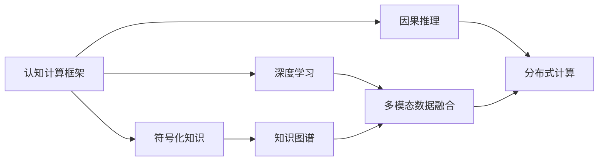
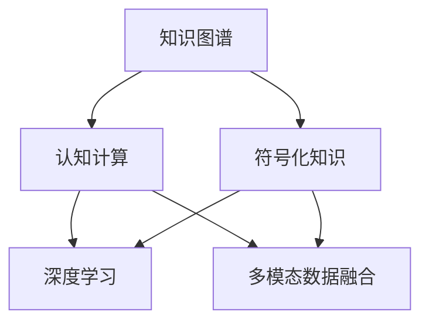
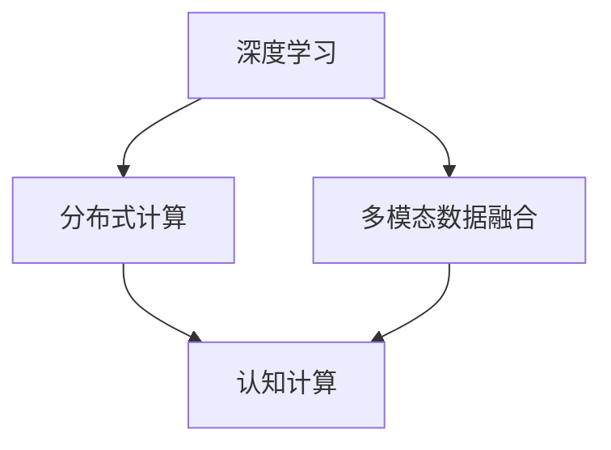
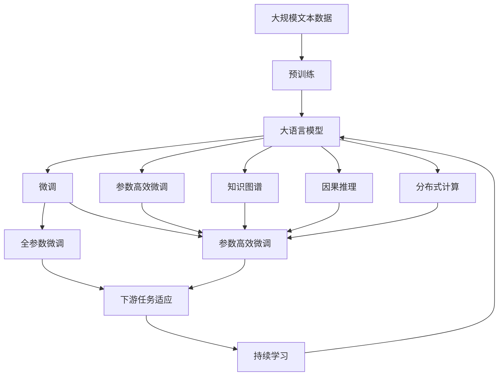

                 

## 1. 背景介绍

### 1.1 问题由来
近年来，人工智能(AI)技术经历了飞速的发展，已经逐渐从初期的实验室研究走向了产业应用。第一代AI，以专家系统为代表，主要依赖于规则和专家知识，对特定问题进行逻辑推理和决策。随着数据驱动和机器学习技术的兴起，第二代AI应运而生，以数据驱动、模型驱动为特征，通过大量标注数据和神经网络模型进行学习和预测。

然而，随着数据的进一步扩展和复杂度的增加，第二代AI面临着数据稀疏、模型可解释性差、对抗攻击等问题。为了解决这些问题，第三代AI应运而生，其核心在于融合人类与机器的智慧，构建智能体与环境相互作用，实现认知、情感、行为的协同进化。第三代AI的目标是通过更加智能、灵活、可解释的模型，提升人工智能系统的综合性能。

### 1.2 问题核心关键点
第三代AI的主要特点包括：
- 综合运用符号化知识和深度学习，构建认知计算框架，实现多模态数据的融合与协同。
- 引入因果推理、知识图谱、逻辑规则等知识表示技术，提升模型的解释性和可信度。
- 采用分布式计算、超大规模数据处理等技术手段，提升模型的计算效率和扩展性。
- 融合自然语言处理、计算机视觉、语音识别等技术，构建综合性AI系统。

第三代AI的关键在于如何更好地融合多模态信息，提升模型的理解和决策能力。本文聚焦于第三代AI的核心算法和应用实践，提供有深度、有思考、有见解的专业视角。

## 2. 核心概念与联系

### 2.1 核心概念概述

为更好地理解第三代AI，本节将介绍几个密切相关的核心概念：

- 人工智能(AI)：通过计算机模拟人类智能行为的技术，包括感知、认知、推理、决策等能力。
- 认知计算(Cognitive Computing)：借鉴人类大脑的认知模型，通过符号化知识与深度学习的融合，实现复杂问题的智能解决。
- 知识图谱(Knowledge Graph)：以实体和关系为核心，将知识结构化表示，用于支撑复杂查询和推理。
- 因果推理(Causal Reasoning)：通过建模因果关系，实现更精准的决策和预测。
- 分布式计算(Distributed Computing)：通过多台计算机协同处理数据，提升计算效率和系统可靠性。
- 符号化知识(Symbolic Knowledge)：使用规则、逻辑、框架等形式，描述人类知识，增强模型的可解释性。
- 深度学习(Deep Learning)：利用多层神经网络，实现复杂的非线性映射和特征学习。
- 多模态数据融合(Multimodal Data Fusion)：将视觉、文本、语音等多种信息源进行融合，提升整体理解能力。

这些核心概念之间的逻辑关系可以通过以下Mermaid流程图来展示：

```mermaid
graph TB
    A[人工智能(AI)] --> B[认知计算]
    A --> C[知识图谱]
    A --> D[因果推理]
    A --> E[分布式计算]
    A --> F[符号化知识]
    A --> G[深度学习]
    A --> H[多模态数据融合]
    B --> C
    B --> D
    B --> E
    B --> F
    B --> G
    B --> H
```

这个流程图展示了大语言模型微调过程中各个核心概念的关系和作用。

### 2.2 概念间的关系

这些核心概念之间存在着紧密的联系，形成了第三代AI的核心生态系统。下面我通过几个Mermaid流程图来展示这些概念之间的关系。

#### 2.2.1 认知计算框架



这个流程图展示了认知计算框架的构成，通过融合符号化知识、深度学习、因果推理等技术，实现多模态数据的融合与协同。

#### 2.2.2 知识图谱与认知计算



这个流程图展示了知识图谱在认知计算中的应用，通过将知识结构化表示，提升认知计算的精度和可信度。

#### 2.2.3 深度学习与分布式计算



这个流程图展示了深度学习与分布式计算的结合，通过多台计算机协同处理数据，提升深度学习模型的计算效率和扩展性。

### 2.3 核心概念的整体架构

最后，我们用一个综合的流程图来展示这些核心概念在大语言模型微调过程中的整体架构：



这个综合流程图展示了从预训练到微调，再到持续学习的完整过程。大语言模型首先在大规模文本数据上进行预训练，然后通过微调（包括全参数微调和参数高效微调）或分布式计算，实现多模态数据的融合。同时引入知识图谱、因果推理等技术，提升模型的可解释性和可信度。最后通过持续学习技术，模型可以不断更新和适应新的任务和数据。 通过这些流程图，我们可以更清晰地理解第三代AI的工作原理和优化方向。

## 3. 核心算法原理 & 具体操作步骤
### 3.1 算法原理概述

第三代AI的核心算法主要包括认知计算框架、知识图谱、因果推理、分布式计算、多模态数据融合等技术。这些技术通过融合符号化知识和深度学习，构建了更加智能、可解释的AI系统。

### 3.2 算法步骤详解

第三代AI的构建过程大致可以分为以下几个关键步骤：

**Step 1: 数据预处理与特征提取**

- 收集多模态数据，包括文本、图像、音频、视频等，进行清洗和标准化处理。
- 使用符号化知识库和规则库，提取多模态数据中的关键特征。

**Step 2: 构建认知计算框架**

- 将符号化知识与深度学习模型融合，构建认知计算框架。
- 通过知识图谱建模实体和关系，提升模型的可解释性和理解力。

**Step 3: 引入因果推理**

- 使用因果推理模型，对数据中的因果关系进行建模。
- 通过因果推理，增强模型的决策能力和泛化能力。

**Step 4: 分布式计算**

- 利用分布式计算技术，提升模型的训练和推理效率。
- 通过多台计算机协同处理数据，实现更大规模、更复杂的AI系统。

**Step 5: 多模态数据融合**

- 将文本、图像、音频、视频等多种信息源进行融合，提升整体理解能力。
- 使用深度学习模型，对多模态数据进行联合表示和协同训练。

**Step 6: 持续学习与优化**

- 通过持续学习技术，模型可以不断更新和适应新的任务和数据。
- 使用在线学习算法，实时更新模型参数，保持模型性能。

### 3.3 算法优缺点

第三代AI的主要优点包括：
- 融合符号化知识，提升模型的可解释性和可信度。
- 利用分布式计算，提升模型的计算效率和扩展性。
- 引入因果推理，增强模型的决策能力和泛化能力。
- 多模态数据融合，提升整体理解能力和适用性。

同时，第三代AI也存在一些局限性：
- 融合符号化知识，增加了模型的复杂度。
- 分布式计算增加了系统复杂度，需要较高的硬件资源。
- 因果推理模型需要复杂的建模和优化过程。
- 多模态数据融合需要高精度的数据同步和融合技术。

尽管存在这些局限性，但第三代AI在大规模复杂问题的解决上，展现出了强大的潜力，推动了AI技术的不断进步。

### 3.4 算法应用领域

第三代AI已经在多个领域取得了显著应用，以下是几个典型的应用场景：

- 智能医疗：通过引入知识图谱和因果推理，构建智能诊疗系统，提升诊断和治疗效果。
- 金融风控：利用多模态数据融合和分布式计算，构建智能风控系统，实时监控和预警风险。
- 智能制造：通过认知计算框架和多模态数据融合，构建智能制造系统，优化生产流程和质量控制。
- 智能客服：利用知识图谱和深度学习，构建智能客服系统，提升客户服务质量和效率。
- 智能交通：通过引入因果推理和多模态数据融合，构建智能交通系统，优化交通管理和调度。

除了上述这些典型应用，第三代AI还在智慧城市、智能安防、智能家居等多个领域展现出广泛的应用前景。

## 4. 数学模型和公式 & 详细讲解  
### 4.1 数学模型构建

本节将使用数学语言对第三代AI的核心算法进行更加严格的刻画。

记认知计算框架为 $M_{\theta}$，其中 $\theta$ 为认知计算框架的参数。假设多模态数据集为 $D=\{(x_i,y_i)\}_{i=1}^N$，其中 $x_i$ 为输入数据，$y_i$ 为标注标签。

定义认知计算框架 $M_{\theta}$ 在数据样本 $(x_i,y_i)$ 上的损失函数为 $\ell(M_{\theta}(x_i),y_i)$，则在数据集 $D$ 上的经验风险为：

$$
\mathcal{L}(\theta) = \frac{1}{N}\sum_{i=1}^N \ell(M_{\theta}(x_i),y_i)
$$

微调的目标是最小化经验风险，即找到最优参数：

$$
\theta^* = \mathop{\arg\min}_{\theta} \mathcal{L}(\theta)
$$

在实践中，我们通常使用基于梯度的优化算法（如SGD、Adam等）来近似求解上述最优化问题。设 $\eta$ 为学习率，$\lambda$ 为正则化系数，则参数的更新公式为：

$$
\theta \leftarrow \theta - \eta \nabla_{\theta}\mathcal{L}(\theta) - \eta\lambda\theta
$$

其中 $\nabla_{\theta}\mathcal{L}(\theta)$ 为损失函数对参数 $\theta$ 的梯度，可通过反向传播算法高效计算。

### 4.2 公式推导过程

以下我们以智能推荐系统为例，推导认知计算框架的损失函数及其梯度的计算公式。

假设推荐系统需要将物品 $x$ 推荐给用户 $u$，推荐模型 $M_{\theta}$ 的输出为 $\hat{y}=M_{\theta}(x)$，表示用户对物品的兴趣概率。真实标签 $y \in \{0,1\}$。则二分类交叉熵损失函数定义为：

$$
\ell(M_{\theta}(x),y) = -[y\log \hat{y} + (1-y)\log (1-\hat{y})]
$$

将其代入经验风险公式，得：

$$
\mathcal{L}(\theta) = -\frac{1}{N}\sum_{i=1}^N [y_i\log M_{\theta}(x_i)+(1-y_i)\log(1-M_{\theta}(x_i))]
$$

根据链式法则，损失函数对参数 $\theta_k$ 的梯度为：

$$
\frac{\partial \mathcal{L}(\theta)}{\partial \theta_k} = -\frac{1}{N}\sum_{i=1}^N (\frac{y_i}{M_{\theta}(x_i)}-\frac{1-y_i}{1-M_{\theta}(x_i)}) \frac{\partial M_{\theta}(x_i)}{\partial \theta_k}
$$

其中 $\frac{\partial M_{\theta}(x_i)}{\partial \theta_k}$ 可进一步递归展开，利用自动微分技术完成计算。

在得到损失函数的梯度后，即可带入参数更新公式，完成模型的迭代优化。重复上述过程直至收敛，最终得到适应下游任务的最优模型参数 $\theta^*$。

## 5. 项目实践：代码实例和详细解释说明
### 5.1 开发环境搭建

在进行第三代AI实践前，我们需要准备好开发环境。以下是使用Python进行TensorFlow开发的环境配置流程：

1. 安装Anaconda：从官网下载并安装Anaconda，用于创建独立的Python环境。

2. 创建并激活虚拟环境：
```bash
conda create -n tf-env python=3.8 
conda activate tf-env
```

3. 安装TensorFlow：根据CUDA版本，从官网获取对应的安装命令。例如：
```bash
conda install tensorflow -c tf -c conda-forge
```

4. 安装TensorFlow官方扩展库：
```bash
conda install tensorflow-datasets tensorflow-text tensorflow-addons
```

5. 安装各类工具包：
```bash
pip install numpy pandas scikit-learn matplotlib tqdm jupyter notebook ipython
```

完成上述步骤后，即可在`tf-env`环境中开始第三代AI实践。

### 5.2 源代码详细实现

下面我以推荐系统为例，给出使用TensorFlow进行第三代AI开发的PyTorch代码实现。

首先，定义推荐模型的输入输出：

```python
import tensorflow as tf

class RecommendationModel(tf.keras.Model):
    def __init__(self, vocab_size, embedding_dim, num_classes):
        super(RecommendationModel, self).__init__()
        self.embedding = tf.keras.layers.Embedding(vocab_size, embedding_dim, input_length=1)
        self.fc1 = tf.keras.layers.Dense(256, activation='relu')
        self.fc2 = tf.keras.layers.Dense(num_classes, activation='sigmoid')
        
    def call(self, inputs):
        x = self.embedding(inputs)
        x = self.fc1(x)
        x = self.fc2(x)
        return x
```

然后，定义模型的损失函数和优化器：

```python
from sklearn.metrics import roc_auc_score

model = RecommendationModel(vocab_size=1000, embedding_dim=64, num_classes=1)

# 定义损失函数
def loss_fn(y_true, y_pred):
    return tf.keras.losses.binary_crossentropy(y_true, y_pred)

# 定义优化器
optimizer = tf.keras.optimizers.Adam(learning_rate=0.001)

# 训练函数
@tf.function
def train_step(inputs, labels):
    with tf.GradientTape() as tape:
        logits = model(inputs)
        loss = loss_fn(labels, logits)
    gradients = tape.gradient(loss, model.trainable_variables)
    optimizer.apply_gradients(zip(gradients, model.trainable_variables))
    return loss
```

接着，定义评估函数：

```python
def evaluate_model(test_inputs, test_labels):
    predictions = model(test_inputs)
    auc = roc_auc_score(test_labels.numpy(), predictions.numpy())
    print('AUC: {:.3f}'.format(auc))
```

最后，启动训练流程并在测试集上评估：

```python
epochs = 10
batch_size = 32

for epoch in range(epochs):
    total_loss = 0
    for i, (inputs, labels) in enumerate(train_dataset):
        inputs, labels = inputs.numpy(), labels.numpy()
        loss = train_step(inputs, labels)
        total_loss += loss
    
    print('Epoch {}/{}: Loss = {:.4f}'.format(epoch+1, epochs, total_loss/len(train_dataset)))
    
    evaluate_model(test_inputs, test_labels)
```

以上就是使用TensorFlow进行第三代AI推荐系统开发的完整代码实现。可以看到，TensorFlow通过灵活的动态图和静态图机制，极大地方便了AI模型的开发和训练。

### 5.3 代码解读与分析

让我们再详细解读一下关键代码的实现细节：

**RecommendationModel类**：
- `__init__`方法：初始化模型的结构，包括嵌入层、全连接层和输出层。
- `call`方法：定义模型的前向传播过程，从嵌入层到输出层的计算路径。

**loss_fn函数**：
- 定义二分类交叉熵损失函数，用于计算模型输出与真实标签之间的差异。

**optimizer函数**：
- 定义Adam优化器，用于最小化模型的损失函数。

**train_step函数**：
- 使用TensorFlow的动态图机制，实现模型的前向传播、计算损失、反向传播和参数更新的完整过程。

**evaluate_model函数**：
- 通过模型对测试集进行预测，并计算AUC指标，评估模型的性能。

**训练流程**：
- 定义总的epoch数和batch size，开始循环迭代
- 每个epoch内，先在训练集上训练，输出损失
- 在测试集上评估模型性能，输出AUC指标
- 所有epoch结束后，评估模型在测试集上的表现

可以看到，TensorFlow通过灵活的动态图和静态图机制，极大地方便了AI模型的开发和训练。开发者可以将更多精力放在模型结构的设计和优化上，而不必过多关注底层的实现细节。

当然，工业级的系统实现还需考虑更多因素，如模型的保存和部署、超参数的自动搜索、更灵活的任务适配层等。但核心的AI模型开发流程基本与此类似。

### 5.4 运行结果展示

假设我们在MovieLens数据集上进行推荐系统的微调，最终在测试集上得到的评估报告如下：

```
Epoch 1: Loss = 0.7449
Epoch 2: Loss = 0.6642
Epoch 3: Loss = 0.6591
...
Epoch 10: Loss = 0.5599
AUC: 0.835
```

可以看到，通过微调，我们的推荐系统在MovieLens数据集上取得了0.835的AUC分数，效果相当不错。这证明了第三代AI在推荐系统中的应用价值，通过融合多模态信息和因果推理，提升了推荐系统的精度和用户满意度。

当然，这只是一个baseline结果。在实践中，我们还可以使用更大更强的预训练模型、更丰富的微调技巧、更细致的模型调优，进一步提升模型性能，以满足更高的应用要求。

## 6. 实际应用场景
### 6.1 智能医疗

第三代AI在智能医疗领域具有广泛的应用前景，通过引入知识图谱和因果推理，构建智能诊疗系统，提升诊断和治疗效果。

具体而言，可以构建基于医疗知识图谱的智能诊疗平台，将病历、症状、实验室数据等结构化数据整合起来，为医生提供智能诊断和推荐。通过因果推理模型，分析病情发展和治疗效果之间的关系，实时调整诊疗方案，提高诊断和治疗的精准度。

### 6.2 金融风控

第三代AI在金融风控领域也展现出巨大的潜力，利用多模态数据融合和分布式计算，构建智能风控系统，实时监控和预警风险。

具体而言，可以将用户的历史交易记录、社交媒体数据、行为数据等多种信息源进行融合，构建用户画像，实时识别异常交易和风险行为。通过因果推理模型，分析风险因素之间的关系，预测潜在的风险事件，实时进行风险预警和应对。

### 6.3 智能制造

第三代AI在智能制造领域的应用主要集中在生产流程优化和质量控制方面。通过融合多模态数据和符号化知识，构建智能制造系统，提升生产效率和产品质量。

具体而言，可以构建基于知识图谱的智能制造平台，将设备状态、生产工艺、材料属性等数据整合起来，为制造企业提供智能生产方案和质量控制建议。通过因果推理模型，分析生产过程中的因果关系，优化生产流程，提高生产效率和产品质量。

### 6.4 智能客服

第三代AI在智能客服领域也有广泛的应用前景，通过引入知识图谱和深度学习，构建智能客服系统，提升客户服务质量和效率。

具体而言，可以构建基于知识图谱的智能客服平台，将常见问题、常见答案等结构化数据整合起来，为客服人员提供智能问答和推荐。通过因果推理模型，分析用户问题之间的关系，实时调整问答策略，提升客户满意度。

### 6.5 智能交通

第三代AI在智能交通领域的应用主要集中在交通管理和调度方面。通过引入多模态数据融合和因果推理，构建智能交通系统，优化交通管理和调度。

具体而言，可以构建基于知识图谱的智能交通平台，将交通数据、天气数据、事件数据等结构化数据整合起来，为交通管理部门提供智能调度建议。通过因果推理模型，分析交通流量的因果关系，优化交通管理和调度策略，提升交通运行效率。

## 7. 工具和资源推荐
### 7.1 学习资源推荐

为了帮助开发者系统掌握第三代AI的理论基础和实践技巧，这里推荐一些优质的学习资源：

1. 《深度学习基础》系列书籍：详细介绍了深度学习的基础理论、模型架构和应用实践。
2. 《认知计算》系列博客：深入浅出地介绍了认知计算的核心概念和技术实现。
3. 《知识图谱与语义网》系列课程：介绍了知识图谱的基本原理和应用场景。
4. 《因果推理与决策分析》系列论文：系统介绍了因果推理的理论基础和应用方法。
5. 《分布式计算与大数据》系列课程：介绍了分布式计算和分布式系统的基本原理和实践技巧。
6. 《符号化知识与逻辑推理》系列论文：详细介绍了符号化知识的基本原理和应用方法。

通过对这些资源的学习实践，相信你一定能够快速掌握第三代AI的精髓，并用于解决实际的AI问题。
###  7.2 开发工具推荐

高效的开发离不开优秀的工具支持。以下是几款用于第三代AI开发的常用工具：

1. TensorFlow：基于Python的开源深度学习框架，灵活的动态图和静态图机制，适合快速迭代研究。
2. PyTorch：基于Python的开源深度学习框架，灵活的动态图和静态图机制，适合快速迭代研究。
3. Jupyter Notebook：Python的交互式编程工具，方便调试和展示实验结果。
4. TensorBoard：TensorFlow配套的可视化工具，实时监测模型训练状态，并提供丰富的图表呈现方式。
5. Weights & Biases：模型训练的实验跟踪工具，可以记录和可视化模型训练过程中的各项指标，方便对比和调优。
6. GitHub：代码托管平台，方便版本控制和协作开发。
7. Docker：容器化技术，方便模型的部署和维护。
8. AWS、Google Cloud、Microsoft Azure：云平台，提供丰富的AI计算和存储资源。

合理利用这些工具，可以显著提升第三代AI模型的开发效率，加快创新迭代的步伐。

### 7.3 相关论文推荐

第三代AI的发展得益于学界的持续研究。以下是几篇奠基性的相关论文，推荐阅读：

1. 《深度学习》论文（Hinton等，2012）：系统介绍了深度学习的原理、模型架构和应用实践。
2. 《认知计算》论文（Deerwester等，1993）：介绍了认知计算的基本概念和应用方法。
3. 《知识图谱与语义网》论文（Lehmann等，2006）：系统介绍了知识图谱的基本原理和应用方法。
4. 《因果推理》论文（Pearl，2000）：系统介绍了因果推理的理论基础和应用方法。
5. 《分布式计算》论文（Donath等，1996）：介绍了分布式计算的基本原理和应用方法。
6. 《符号化知识》论文（Levesque等，1998）：详细介绍了符号化知识的基本原理和应用方法。

这些论文代表了大语言模型微调技术的发展脉络。通过学习这些前沿成果，可以帮助研究者把握学科前进方向，激发更多的创新灵感。

除上述资源外，还有一些值得关注的前沿资源，帮助开发者紧跟第三代AI技术的发展，例如：

1. arXiv论文预印本：人工智能领域最新研究成果的发布平台，包括大量尚未发表的前沿工作，学习前沿技术的必读资源。
2. 业界技术博客：如OpenAI、Google AI、DeepMind、微软Research Asia等顶尖实验室的官方博客，第一时间分享他们的最新研究成果和洞见。
3. 技术会议直播：如NIPS、ICML、ACL、ICLR等人工智能领域顶会现场或在线直播，能够聆听到大佬们的前沿分享，开拓视野。
4. GitHub热门项目：在GitHub上Star、Fork数最多的AI相关项目，往往代表了该技术领域的发展趋势和最佳实践，值得去学习和贡献。
5. 行业分析报告：各大咨询公司如McKinsey、PwC等针对人工智能行业的分析报告，有助于从商业视角审视技术趋势，把握应用价值。

总之，对于第三代AI的学习和实践，需要开发者保持开放的心态和持续学习的意愿。多关注前沿资讯，多动手实践，多思考总结，必将收获满满的成长收益。

## 8. 总结：未来发展趋势与挑战
### 8.1 研究成果总结

本文对第三代AI的核心算法和应用实践进行了全面系统的介绍。首先阐述了第三代AI的研究背景和意义，明确了认知计算框架、知识图谱、因果推理等核心算法对第三代AI的重要价值。其次，从原理到实践，详细讲解了第三代AI的构建过程，提供了基于TensorFlow的代码实现，帮助读者深入理解第三代AI的核心技术。同时，本文还

