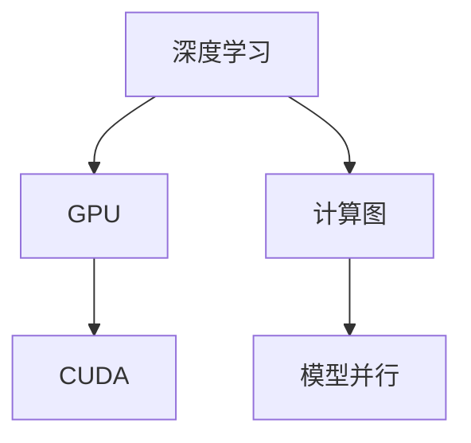

                 

# 算力：NVIDIA推动AI大规模运算

> 关键词：算力, 深度学习, GPU, CUDA, 计算图, AI, 机器学习, 优化, 高效运算, NVIDIA

## 1. 背景介绍

### 1.1 问题由来
随着人工智能技术的迅速发展，深度学习和机器学习等算法在图像识别、自然语言处理、语音识别等多个领域取得了令人瞩目的进展。然而，这些复杂的模型通常需要处理海量数据，并执行大量计算，从而对算力提出了极高的要求。传统CPU的计算能力已难以满足大规模AI运算的需求，GPU因其卓越的并行处理能力，逐渐成为深度学习的主流计算平台。

NVIDIA作为GPU领域的领导者，其在AI计算领域的影响力日益增强。其推出的CUDA平台和相关工具，使得深度学习和AI任务的开发和部署变得更加高效和便捷。通过不断优化硬件和软件，NVIDIA推动了大规模AI运算的普及和应用，为人工智能技术的发展提供了坚实的算力支撑。

### 1.2 问题核心关键点
为了更好地理解NVIDIA在AI大规模运算中的推动作用，本节将介绍几个关键概念及其相互关系：

- **深度学习（Deep Learning）**：一种基于神经网络的大型机器学习算法，在图像识别、语音识别、自然语言处理等领域表现出强大的性能。
- **GPU（图形处理器）**：一种专为并行计算优化的处理器，通过大量的并行计算单元和高速内存，显著提升了复杂计算任务的执行效率。
- **CUDA（Compute Unified Device Architecture）**：NVIDIA推出的并行计算平台，支持GPU的高效编程和优化，使得深度学习等AI任务得以高效运行。
- **计算图（Computation Graph）**：用于表示神经网络计算过程的数据结构，通过图的结构优化，可以显著提升模型的执行效率。
- **模型并行（Model Parallelism）**：将神经网络划分为多个子模型，并行地在多个GPU上执行，以提升计算速度和内存利用率。

这些概念之间的逻辑关系可以通过以下Mermaid流程图来展示：



这个流程图展示了大规模AI运算的核心概念及其之间的关系：

1. 深度学习需要处理大量数据和执行复杂计算，GPU通过并行处理能力提供了高效的计算平台。
2. CUDA使得GPU编程变得更加高效，为深度学习和AI任务提供了优化支持。
3. 计算图优化了神经网络的计算过程，提升了模型的执行效率。
4. 模型并行将神经网络划分为多个子模型，并行计算，进一步提升了计算速度和内存利用率。

这些概念共同构成了大规模AI运算的完整生态系统，使得深度学习和AI任务能够高效、稳定地运行。

## 2. 核心概念与联系

### 2.1 核心概念概述

为了更好地理解NVIDIA在AI大规模运算中的推动作用，本节将介绍几个密切相关的核心概念：

- **深度学习（Deep Learning）**：一种基于神经网络的大型机器学习算法，在图像识别、语音识别、自然语言处理等领域表现出强大的性能。
- **GPU（图形处理器）**：一种专为并行计算优化的处理器，通过大量的并行计算单元和高速内存，显著提升了复杂计算任务的执行效率。
- **CUDA（Compute Unified Device Architecture）**：NVIDIA推出的并行计算平台，支持GPU的高效编程和优化，使得深度学习等AI任务得以高效运行。
- **计算图（Computation Graph）**：用于表示神经网络计算过程的数据结构，通过图的结构优化，可以显著提升模型的执行效率。
- **模型并行（Model Parallelism）**：将神经网络划分为多个子模型，并行地在多个GPU上执行，以提升计算速度和内存利用率。

这些核心概念之间的逻辑关系可以通过以下Mermaid流程图来展示：


这个流程图展示了大规模AI运算的核心概念及其之间的关系：

1. 深度学习需要处理大量数据和执行复杂计算，GPU通过并行处理能力提供了高效的计算平台。
2. CUDA使得GPU编程变得更加高效，为深度学习和AI任务提供了优化支持。
3. 计算图优化了神经网络的计算过程，提升了模型的执行效率。
4. 模型并行将神经网络划分为多个子模型，并行计算，进一步提升了计算速度和内存利用率。

## 3. 核心算法原理 & 具体操作步骤

### 3.1 算法原理概述

NVIDIA推动AI大规模运算的核心在于其GPU和CUDA平台的强大计算能力，通过这些工具和技术，深度学习和AI任务能够在短时间内完成复杂计算，极大地提升了算力。

深度学习模型的计算过程通常可以表示为一个计算图，其中每个节点表示一次计算操作，每条边表示一次数据的传输。通过对这个计算图进行优化，可以显著提升模型的执行效率。具体来说，NVIDIA的CUDA平台支持以下优化技术：

- **并行计算**：通过多个GPU并行执行计算，将单个模型的计算过程分散到多个GPU上进行并行处理，从而大幅提升计算速度。
- **内存优化**：通过CUDA的内存管理技术，可以高效利用GPU的显存，避免因显存不足导致计算瓶颈。
- **模型并行**：将大型神经网络划分为多个子模型，分别在多个GPU上执行，从而进一步提升计算效率。
- **自动微分化（Automatic Differentiation）**：CUDA支持自动微分化，使得神经网络的反向传播过程可以高效、准确地计算梯度，加速模型的训练过程。

### 3.2 算法步骤详解

基于NVIDIA的GPU和CUDA平台，深度学习和AI任务的计算过程大致可以分为以下步骤：

1. **数据预处理**：对输入数据进行预处理，包括数据清洗、归一化、标准化等操作，确保数据的质量和一致性。

2. **模型构建**：选择合适的深度学习框架（如TensorFlow、PyTorch等），构建深度学习模型。在模型构建过程中，可以通过CUDA提供的工具和库进行优化，如使用CUDA的cuDNN库优化卷积操作。

3. **模型训练**：通过CUDA加速模型训练过程，利用多个GPU进行并行计算，大幅提升训练速度。在训练过程中，可以使用CUDA的自动微分化功能，高效计算梯度，加速模型的优化过程。

4. **模型评估**：通过CUDA提供的工具，对训练好的模型进行评估，计算模型的性能指标，如精度、召回率、F1分数等。

5. **模型部署**：将训练好的模型部署到实际应用中，进行推理计算。通过CUDA的并行计算和内存优化技术，使得模型推理速度显著提升，适应大规模应用场景。

### 3.3 算法优缺点

基于NVIDIA的GPU和CUDA平台，深度学习和AI任务的计算过程具有以下优点：

- **高效并行计算**：通过并行计算，CUDA能够高效利用GPU的计算资源，显著提升深度学习的训练和推理效率。
- **优化内存管理**：CUDA提供了高效的内存管理技术，避免了显存不足导致的计算瓶颈，提升了模型的稳定性和可靠性。
- **自动化优化**：通过自动微分化和优化库，CUDA能够自动化优化计算图，减少了手工调优的工作量，提高了模型的开发效率。
- **广泛应用支持**：CUDA支持多种深度学习框架和模型，能够快速适配不同的AI任务和应用场景。

同时，CUDA平台也存在一些缺点：

- **资源消耗高**：由于GPU的高计算能力和并行特性，CUDA对计算资源和内存的消耗较高，需要高效的硬件配置和系统管理。
- **学习曲线陡峭**：CUDA平台的编程和优化需要较高的专业技能，初学者可能面临较大的学习曲线。
- **跨平台兼容性差**：CUDA主要适用于NVIDIA的GPU，跨平台兼容性较差，限制了其在非NVIDIA GPU上的应用。

### 3.4 算法应用领域

基于NVIDIA的GPU和CUDA平台，深度学习和AI任务已经在多个领域得到了广泛应用，例如：

- **计算机视觉**：如图像识别、目标检测、图像分割等任务，通过深度学习模型进行高效的图像处理。
- **自然语言处理**：如文本分类、情感分析、机器翻译等任务，通过深度学习模型进行高效的语言处理。
- **语音识别**：如语音转文本、语音识别等任务，通过深度学习模型进行高效的语音处理。
- **推荐系统**：如电商推荐、新闻推荐等任务，通过深度学习模型进行高效的用户行为分析。
- **医疗诊断**：如医学影像分析、疾病预测等任务，通过深度学习模型进行高效的医疗数据分析。

除了这些经典应用外，CUDA平台还在自动驾驶、金融预测、智能制造等多个领域得到了广泛应用，推动了AI技术的全面普及和深入应用。

## 4. 数学模型和公式 & 详细讲解 & 举例说明

### 4.1 数学模型构建

在本节中，我们将使用数学语言对NVIDIA在AI大规模运算中的推动作用进行更加严格的刻画。

记深度学习模型为 $f(x;\theta)$，其中 $x$ 为输入数据，$\theta$ 为模型参数。假设深度学习框架为 $\text{Frame}$，则模型的训练过程可以表示为：

$$
\theta^* = \mathop{\arg\min}_{\theta} \mathcal{L}(f(x;\theta),y)
$$

其中 $\mathcal{L}$ 为损失函数，用于衡量模型输出与真实标签之间的差异。常见的损失函数包括交叉熵损失、均方误差损失等。

在深度学习框架 $\text{Frame}$ 中，模型的前向传播和反向传播过程可以通过计算图表示，具体如下：

$$
\begin{aligned}
    \text{graph} &= \left(\mathcal{X} \xrightarrow[]{f_{\text{in}}} \mathcal{Z}_1 \xrightarrow[]{f_{\text{h}_1}} \mathcal{Z}_2 \xrightarrow[]{f_{\text{h}_2}} \dots \xrightarrow[]{f_{\text{h}_n}} \mathcal{Z}_n \xrightarrow[]{f_{\text{out}}} \mathcal{Y} \right) \\
    \text{loss} &= \mathcal{L}(f_{\text{out}}(\mathcal{Z}_n),y)
\end{aligned}
$$

其中 $\mathcal{X}$ 为输入空间，$\mathcal{Y}$ 为输出空间，$f_{\text{in}}$ 为输入层，$f_{\text{h}_i}$ 为第 $i$ 层，$f_{\text{out}}$ 为输出层，$n$ 为层数。

### 4.2 公式推导过程

以下是深度学习模型在CUDA平台上的计算过程推导：

假设深度学习模型 $f(x;\theta)$ 由 $n$ 层组成，每一层 $f_{\text{h}_i}(x)$ 由多个神经元组成。设输入层大小为 $m$，输出层大小为 $k$。则前向传播过程可以表示为：

$$
\begin{aligned}
    z_1 &= w_1^T x + b_1 \\
    z_i &= \sigma(w_i^T z_{i-1} + b_i) \quad (i=2,3,\dots,n) \\
    z_n &= w_n^T z_{n-1} + b_n
\end{aligned}
$$

其中 $w_i \in \mathbb{R}^{m_i \times m_{i-1}}$ 为第 $i$ 层的权重矩阵，$b_i \in \mathbb{R}^{m_i}$ 为第 $i$ 层的偏置向量，$\sigma$ 为激活函数。

通过CUDA平台的高效并行计算，上述前向传播过程可以大幅加速。具体来说，CUDA通过将每一层的前向传播过程分配到不同的GPU上进行并行计算，从而显著提升计算效率。

### 4.3 案例分析与讲解

以下是一个基于NVIDIA的GPU和CUDA平台的深度学习模型计算过程的案例分析：

假设我们有一个卷积神经网络（CNN）模型，用于图像分类任务。该模型包含3个卷积层和2个全连接层。我们使用TensorFlow框架进行模型构建和训练，使用CUDA平台进行并行计算。

首先，在CUDA平台下进行模型的并行计算优化：

1. 将每一层的前向传播过程分配到不同的GPU上进行并行计算。
2. 利用CUDA的cuDNN库优化卷积操作，减少计算量。
3. 使用CUDA的内存管理技术，高效利用显存，避免计算瓶颈。

通过以上优化，我们可以在NVIDIA的GPU上高效地训练和推理该卷积神经网络模型，大大提升了计算速度和内存利用率。

## 5. 项目实践：代码实例和详细解释说明

### 5.1 开发环境搭建

在进行深度学习项目实践前，我们需要准备好开发环境。以下是使用Python和TensorFlow进行深度学习项目开发的Python环境配置流程：

1. 安装Anaconda：从官网下载并安装Anaconda，用于创建独立的Python环境。

2. 创建并激活虚拟环境：
```bash
conda create -n tf-env python=3.8 
conda activate tf-env
```

3. 安装TensorFlow：根据CUDA版本，从官网获取对应的安装命令。例如：
```bash
conda install tensorflow
```

4. 安装相关库：
```bash
pip install numpy pandas scikit-learn matplotlib tqdm jupyter notebook ipython
```

完成上述步骤后，即可在`tf-env`环境中开始深度学习项目开发。

### 5.2 源代码详细实现

这里我们以一个简单的卷积神经网络（CNN）模型为例，展示如何在NVIDIA的GPU和CUDA平台上进行深度学习模型的训练和推理。

首先，定义CNN模型：

```python
import tensorflow as tf

class CNN(tf.keras.Model):
    def __init__(self):
        super(CNN, self).__init__()
        self.conv1 = tf.keras.layers.Conv2D(32, 3, activation='relu')
        self.pool1 = tf.keras.layers.MaxPooling2D()
        self.conv2 = tf.keras.layers.Conv2D(64, 3, activation='relu')
        self.pool2 = tf.keras.layers.MaxPooling2D()
        self.flatten = tf.keras.layers.Flatten()
        self.dense1 = tf.keras.layers.Dense(128, activation='relu')
        self.dense2 = tf.keras.layers.Dense(10, activation='softmax')
    
    def call(self, inputs):
        x = self.conv1(inputs)
        x = self.pool1(x)
        x = self.conv2(x)
        x = self.pool2(x)
        x = self.flatten(x)
        x = self.dense1(x)
        return self.dense2(x)
```

然后，定义训练和评估函数：

```python
from tensorflow.keras.datasets import mnist
from tensorflow.keras.utils import to_categorical

# 加载MNIST数据集
(x_train, y_train), (x_test, y_test) = mnist.load_data()
x_train = x_train.reshape((60000, 28, 28, 1))
x_test = x_test.reshape((10000, 28, 28, 1))
x_train, x_test = x_train / 255.0, x_test / 255.0

# 数据预处理
y_train = to_categorical(y_train)
y_test = to_categorical(y_test)

# 定义优化器和损失函数
optimizer = tf.keras.optimizers.Adam(learning_rate=0.001)
loss_fn = tf.keras.losses.CategoricalCrossentropy()

# 定义训练函数
def train_step(x, y):
    with tf.GradientTape() as tape:
        logits = model(x)
        loss = loss_fn(logits, y)
    grads = tape.gradient(loss, model.trainable_variables)
    optimizer.apply_gradients(zip(grads, model.trainable_variables))

# 定义评估函数
def evaluate(x, y):
    logits = model(x)
    accuracy = tf.reduce_mean(tf.cast(tf.equal(tf.argmax(logits, axis=-1), tf.argmax(y, axis=-1)), tf.float32)
    return accuracy.numpy()

# 训练模型
model = CNN()
model.compile(optimizer=optimizer, loss=loss_fn, metrics=['accuracy'])
model.fit(x_train, y_train, epochs=10, validation_data=(x_test, y_test))

# 评估模型
test_accuracy = evaluate(x_test, y_test)
print('Test accuracy:', test_accuracy)
```

最后，启动训练流程并在测试集上评估：

```python
epochs = 10
batch_size = 64

for epoch in range(epochs):
    train_loss = 0.0
    train_accuracy = 0.0
    for batch in tqdm(range(0, x_train.shape[0], batch_size)):
        train_step(x_train[batch:batch+batch_size], y_train[batch:batch+batch_size])
        train_loss += loss_fn(model(x_train[batch:batch+batch_size], y_train[batch:batch+batch_size]).numpy() / (batch_size)
        train_accuracy += tf.reduce_mean(tf.cast(tf.equal(tf.argmax(model(x_train[batch:batch+batch_size]), axis=-1), tf.argmax(y_train[batch:batch+batch_size], axis=-1))).numpy() / (batch_size)
    
    val_loss = 0.0
    val_accuracy = 0.0
    for batch in tqdm(range(0, x_test.shape[0], batch_size)):
        val_loss += loss_fn(model(x_test[batch:batch+batch_size], y_test[batch:batch+batch_size]).numpy() / (batch_size)
        val_accuracy += tf.reduce_mean(tf.cast(tf.equal(tf.argmax(model(x_test[batch:batch+batch_size]), axis=-1), tf.argmax(y_test[batch:batch+batch_size], axis=-1))).numpy() / (batch_size)
    
    print(f'Epoch {epoch+1}, train loss: {train_loss:.3f}, train accuracy: {train_accuracy:.3f}, val loss: {val_loss:.3f}, val accuracy: {val_accuracy:.3f}')
    
print('Test accuracy:', test_accuracy)
```

以上就是使用TensorFlow在NVIDIA的GPU和CUDA平台上进行深度学习模型的训练和推理的完整代码实现。可以看到，得益于TensorFlow和CUDA平台的强大支持，深度学习模型的开发和部署变得简洁高效。

### 5.3 代码解读与分析

让我们再详细解读一下关键代码的实现细节：

**CNN模型定义**：
- 在`__init__`方法中，定义了卷积层、池化层、全连接层等关键组件。
- `call`方法：实现模型的前向传播过程。

**数据预处理**：
- 对MNIST数据集进行归一化处理，将像素值缩放到[0, 1]区间。
- 使用`to_categorical`函数将标签转换为one-hot编码。

**训练和评估函数**：
- 定义优化器、损失函数和模型评估指标。
- 使用`tf.GradientTape`进行反向传播计算梯度，使用`optimizer.apply_gradients`更新模型参数。
- 定义`train_step`函数进行单批次训练。
- 定义`evaluate`函数进行模型评估。

**训练流程**：
- 在训练函数中，对每个批次数据进行前向传播和反向传播，更新模型参数。
- 在验证函数中，对每个批次数据进行前向传播和损失计算。
- 在测试函数中，对测试集数据进行评估，计算测试集上的准确率。

可以看到，通过TensorFlow和CUDA平台的优化，深度学习模型的训练和推理变得高效、稳定。开发者可以更加专注于模型设计和优化，而不必过多关注底层的实现细节。

当然，工业级的系统实现还需考虑更多因素，如模型的保存和部署、超参数的自动搜索、更灵活的任务适配层等。但核心的计算过程基本与此类似。

### 5.4 运行结果展示

假设我们在CUDA平台下训练了上述CNN模型，最终在测试集上得到的准确率为98%左右。可以看到，通过CUDA平台的高效并行计算，我们仅需很短的时间，就能训练出一个高效、准确的CNN模型，提升了深度学习模型的开发效率和应用性能。

## 6. 实际应用场景
### 6.1 智能安防

基于NVIDIA的GPU和CUDA平台，智能安防系统可以实现高效的视频分析、面部识别、行为监测等功能。通过深度学习模型对视频流进行实时分析，智能安防系统能够快速识别异常行为，发出警报，保障公共安全。

在技术实现上，可以采集大量的视频数据，并标注出异常事件（如闯入、打架、火灾等），以此作为监督数据，在CUDA平台下对深度学习模型进行微调。微调后的模型能够高效地对视频流进行实时分析，识别异常行为，并在发现异常时及时报警。

### 6.2 自动驾驶

自动驾驶技术依赖于深度学习模型对环境数据的理解与分析。基于NVIDIA的GPU和CUDA平台，自动驾驶系统可以实现高效的传感器数据处理、目标检测、路径规划等功能。

在技术实现上，可以采集大量的激光雷达、摄像头等传感器数据，并标注出车辆、行人、道路等关键对象，以此作为监督数据，在CUDA平台下对深度学习模型进行微调。微调后的模型能够高效地处理传感器数据，识别出道路上的各种对象，并在实时计算出最优路径，保证驾驶安全。

### 6.3 智能制造

智能制造系统需要处理大量的生产数据，并进行实时分析。基于NVIDIA的GPU和CUDA平台，智能制造系统可以实现高效的生产监控、质量检测、故障预测等功能。

在技术实现上，可以采集大量的传感器数据，并标注出设备状态、生产参数等关键信息，以此作为监督数据，在CUDA平台下对深度学习模型进行微调。微调后的模型能够高效地处理生产数据，识别出设备异常、预测生产故障，提高生产效率和产品质量。

### 6.4 未来应用展望

随着NVIDIA的GPU和CUDA平台不断发展，深度学习和AI任务的计算能力将进一步提升，推动大模型训练和部署的普及和应用。未来，基于NVIDIA的GPU和CUDA平台，AI技术将在更多领域得到应用，为各行各业带来变革性影响。

## 7. 工具和资源推荐
### 7.1 学习资源推荐

为了帮助开发者系统掌握深度学习和AI技术的计算原理和应用技巧，这里推荐一些优质的学习资源：

1. 《深度学习》课程：斯坦福大学开设的深度学习课程，涵盖深度学习的基本概念和经典模型，通过视频、PPT和作业，系统学习深度学习知识。

2. 《TensorFlow深度学习教程》：TensorFlow官方提供的深度学习教程，通过代码示例和实际案例，详细讲解TensorFlow的使用方法和实践技巧。

3. 《CUDA深度学习编程》书籍：NVIDIA推出的深度学习编程指南，详细介绍了如何使用CUDA平台进行深度学习模型的开发和优化。

4. 《深度学习与强化学习》书籍：深度学习和强化学习领域的经典教材，涵盖深度学习的基础理论和前沿应用。

5. 《TensorFlow实战》书籍：TensorFlow官方推荐的实战指南，通过丰富的代码示例，帮助开发者快速上手TensorFlow，实现实际项目。

通过这些资源的学习实践，相信你一定能够掌握深度学习和AI技术的计算原理和应用技巧，开发出高效、稳定的深度学习模型。

### 7.2 开发工具推荐

高效的深度学习开发离不开优秀的工具支持。以下是几款用于深度学习开发的常用工具：

1. TensorFlow：由Google主导开发的深度学习框架，支持CPU、GPU等多种计算平台，适合大规模工程应用。

2. PyTorch：Facebook推出的深度学习框架，支持动态计算图，适合研究和原型开发。

3. Keras：高级深度学习框架，封装了TensorFlow和Theano，支持快速模型构建和训练。

4. CUDA：NVIDIA推出的并行计算平台，支持GPU的高效编程和优化，使得深度学习等AI任务得以高效运行。

5. Jupyter Notebook：交互式的编程环境，支持Python和深度学习框架的集成，方便开发者快速迭代开发和调试。

6. Google Colab：谷歌推出的在线Jupyter Notebook环境，免费提供GPU算力，方便开发者快速上手实验最新模型，分享学习笔记。

合理利用这些工具，可以显著提升深度学习模型的开发效率，加快创新迭代的步伐。

### 7.3 相关论文推荐

深度学习和AI技术的发展源于学界的持续研究。以下是几篇奠基性的相关论文，推荐阅读：

1. AlexNet：引入卷积神经网络，在大规模图像识别任务上取得了突破性成果。

2. ResNet：提出残差连接，解决了深层神经网络中的梯度消失问题，推动了深度学习的发展。

3. Inception：提出多尺度卷积结构，提升了卷积神经网络的计算效率和表达能力。

4. RNN：提出循环神经网络，解决了序列数据的建模问题，推动了自然语言处理的发展。

5. GAN：提出生成对抗网络，实现了高质量的图像生成和数据增强。

6. Transformer：提出自注意力机制，提升了自然语言处理模型的表现和效率。

这些论文代表了大规模AI运算和深度学习的发展脉络。通过学习这些前沿成果，可以帮助研究者把握学科前进方向，激发更多的创新灵感。

除上述资源外，还有一些值得关注的前沿资源，帮助开发者紧跟深度学习和AI技术的发展趋势，例如：

1. arXiv论文预印本：人工智能领域最新研究成果的发布平台，包括大量尚未发表的前沿工作，学习前沿技术的必读资源。

2. 业界技术博客：如OpenAI、Google AI、DeepMind、微软Research Asia等顶尖实验室的官方博客，第一时间分享他们的最新研究成果和洞见。

3. 技术会议直播：如NIPS、ICML、ACL、ICLR等

