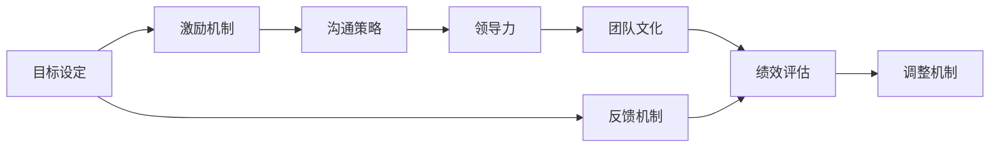
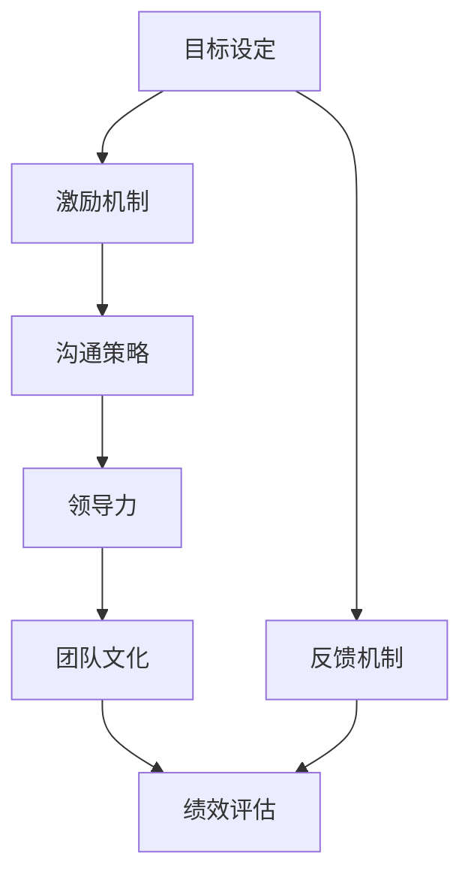
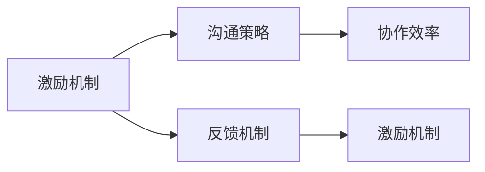
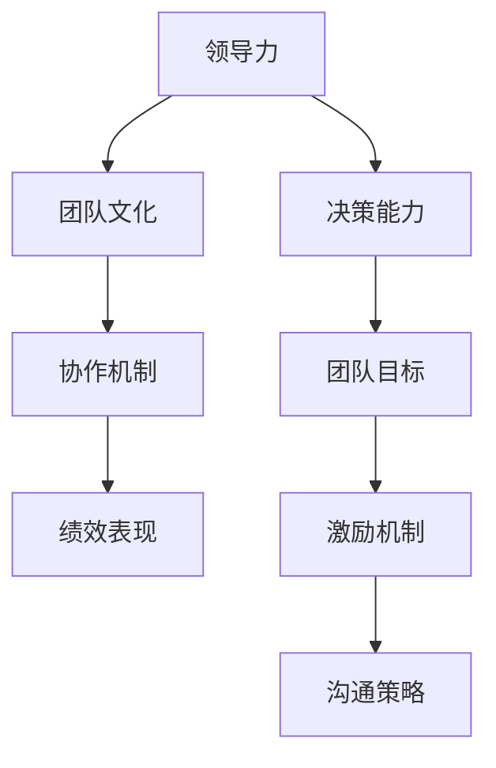

                 

# 管理的智慧：激发团队潜能

> 关键词：管理，团队，绩效，激励，领导力，目标，协作，沟通

## 1. 背景介绍

### 1.1 问题由来
在当前快速变化的商业环境中，企业面临着前所未有的挑战和机遇。如何在激烈的市场竞争中脱颖而出，实现可持续发展，成为每个企业领导者必须面对的重要课题。而团队作为企业的基本组成单位，其绩效和潜能的充分发挥，直接关系到企业整体目标的实现。因此，有效的管理方法和管理智慧，成为提升团队绩效、激发团队潜能的关键。

### 1.2 问题核心关键点
团队管理的核心在于如何通过科学的管理方法，激发团队成员的内在动机，优化团队协作，提升团队绩效。具体而言，以下几个关键点尤为关键：

1. **明确目标**：团队必须要有清晰、具体、可行的目标，让每个成员明确自己的努力方向。
2. **有效沟通**：沟通是团队协作的基础，有效的信息交流能够确保团队成员之间的理解和协作。
3. **合理激励**：合理的激励机制能够激发团队成员的积极性和创造力，提升团队绩效。
4. **领导力**：领导者需要具备良好的领导力和决策能力，能够引导团队克服困难，达成目标。
5. **团队协作**：通过建立良好的团队文化和协作机制，促进团队成员之间的互动和合作。

### 1.3 问题研究意义
深入理解团队管理的核心关键点，对于提升团队绩效、激发团队潜能具有重要意义：

1. **提升组织效率**：科学的管理方法能够显著提升团队的工作效率和产出质量。
2. **增强团队凝聚力**：有效的激励和领导能够增强团队的凝聚力和归属感，提升团队士气。
3. **促进创新发展**：激励和协作机制的优化，可以激发团队成员的创新思维和创新能力。
4. **应对市场变化**：合理的管理策略能够帮助团队快速适应市场变化，抓住新的发展机会。
5. **推动企业发展**：团队绩效的提升是企业持续发展的基石，直接关系到企业的长期发展目标。

## 2. 核心概念与联系

### 2.1 核心概念概述

为更好地理解团队管理中的核心概念及其相互关系，本节将介绍几个关键概念：

- **目标设定**：团队管理的起点，指团队需要达成的具体、可衡量的目标。
- **激励机制**：通过奖励、认可等方式，激发团队成员的内在动机和积极性。
- **沟通策略**：确保团队成员之间的信息流畅、有效交流，提升协作效率。
- **领导力**：领导者通过影响力和决策能力，引导团队成员朝着共同目标努力。
- **团队文化**：团队成员共同遵守的行为规范和价值观念，塑造团队的凝聚力和认同感。
- **绩效评估**：对团队和个体的工作表现进行定期评估，反馈和调整。

这些核心概念之间的逻辑关系可以通过以下Mermaid流程图来展示：



这个流程图展示了大团队管理中的核心概念及其相互关系：

1. 团队管理始于目标设定，激励机制和沟通策略是实现目标的重要手段。
2. 领导力通过影响力和决策能力，引导团队成员共同努力。
3. 团队文化通过行为规范和价值观念，提升团队凝聚力。
4. 绩效评估和反馈机制为团队管理提供数据支持，不断调整优化。

### 2.2 概念间的关系

这些核心概念之间存在着紧密的联系，构成了团队管理的完整生态系统。下面我们通过几个Mermaid流程图来展示这些概念之间的关系。

#### 2.2.1 团队管理范式



这个流程图展示了大团队管理的核心范式，从目标设定开始，经过激励机制、沟通策略、领导力、团队文化和绩效评估等多个环节，形成了一个完整的管理闭环。

#### 2.2.2 激励机制与沟通策略的关系



这个流程图展示了激励机制和沟通策略之间的关系。激励机制通过沟通策略实现，同时沟通策略的效果也受到激励机制的反馈和调整。

#### 2.2.3 领导力与团队文化的关系



这个流程图展示了领导力与团队文化之间的关系。领导力通过决策能力和团队目标，影响团队文化，同时团队文化也影响着协作机制和绩效表现。

## 3. 核心算法原理 & 具体操作步骤
### 3.1 算法原理概述

团队管理中的核心算法原理主要涉及如何通过科学的管理方法，激发团队潜能，提升团队绩效。其核心在于通过合理的目标设定、激励机制、沟通策略、领导力和团队文化，实现团队协作和绩效最大化。

具体而言，团队管理的算法原理包括以下几个关键步骤：

1. **目标设定**：确定团队需要达成的具体、可衡量的目标。
2. **激励机制设计**：设计合理的激励机制，激发团队成员的内在动机。
3. **沟通策略制定**：制定有效的沟通策略，确保信息流畅和准确传递。
4. **领导力发挥**：领导者通过影响力和决策能力，引导团队成员共同努力。
5. **团队文化建设**：通过行为规范和价值观念，塑造团队的文化和凝聚力。
6. **绩效评估和反馈**：对团队和个体的工作表现进行定期评估，反馈和调整。

### 3.2 算法步骤详解

基于团队管理的核心算法原理，我们可以将团队管理的具体操作过程分为以下步骤：

**Step 1: 明确团队目标**
- 定义团队需要达成的具体、可衡量的目标，如销售额、项目完成度、客户满意度等。
- 确保目标具有挑战性但可实现，并得到团队成员的认同。
- 将目标分解为具体的任务和里程碑，明确每个成员的职责。

**Step 2: 设计激励机制**
- 确定奖励方式，如奖金、晋升、表彰等。
- 设计奖励标准，确保公平、公正，能够激励团队成员的内在动机。
- 定期评估激励机制的效果，根据反馈进行调整。

**Step 3: 制定沟通策略**
- 确定沟通方式和渠道，如会议、邮件、即时通讯等。
- 制定信息传递规则，确保信息流畅和准确传递。
- 定期进行沟通效果评估，根据反馈进行调整。

**Step 4: 发挥领导力**
- 领导者需要具备良好的领导力，包括决策能力、影响力等。
- 通过有效的领导，引导团队成员朝着共同目标努力。
- 领导者需要及时调整决策，应对团队和外部环境的变化。

**Step 5: 建设团队文化**
- 确定团队的价值观和行为规范，如诚实、创新、协作等。
- 通过培训、活动等方式，增强团队成员的归属感和认同感。
- 建立团队文化反馈机制，根据反馈进行调整。

**Step 6: 绩效评估和反馈**
- 制定绩效评估标准，定期对团队和个体的工作表现进行评估。
- 根据评估结果，给予相应的反馈和奖励。
- 定期进行绩效评估调整，确保评估机制的公正和合理。

### 3.3 算法优缺点

基于团队管理的核心算法原理和操作步骤，团队管理方法具有以下优点：

1. **提升团队绩效**：科学的管理方法能够显著提升团队的工作效率和产出质量。
2. **激发团队潜能**：合理的激励和领导能够激发团队成员的积极性和创造力。
3. **促进协作**：通过有效的沟通和团队文化建设，促进团队成员之间的互动和合作。
4. **适应变化**：合理的目标设定和绩效评估机制，能够帮助团队快速适应市场变化。

同时，这些方法也存在一些局限性：

1. **实施难度**：团队管理需要领导者具备较强的领导力和组织能力，实施难度较大。
2. **员工差异**：团队成员的差异性较大，单一的管理方法可能难以适应所有成员。
3. **环境变化**：市场环境的变化可能影响管理方法的适用性，需要及时调整。
4. **激励效果**：激励机制的设计需要谨慎，不当的激励可能反而降低团队士气。

### 3.4 算法应用领域

基于团队管理的核心算法原理和操作步骤，这些方法已经在多个领域得到广泛应用，例如：

- **制造业**：通过明确生产目标、设计激励机制、制定沟通策略、发挥领导力和建设团队文化，提升生产效率和质量。
- **软件开发**：通过明确项目目标、设计激励机制、制定沟通策略、发挥领导力和建设团队文化，提升开发效率和软件质量。
- **金融行业**：通过明确业务目标、设计激励机制、制定沟通策略、发挥领导力和建设团队文化，提升客户满意度和业务绩效。
- **医疗行业**：通过明确医疗目标、设计激励机制、制定沟通策略、发挥领导力和建设团队文化，提升医疗服务质量和患者满意度。
- **教育行业**：通过明确教学目标、设计激励机制、制定沟通策略、发挥领导力和建设团队文化，提升教学效果和学生满意度。

这些应用领域表明，团队管理方法具有广泛的应用前景和实践价值。

## 4. 数学模型和公式 & 详细讲解 & 举例说明

### 4.1 数学模型构建

假设团队有 $n$ 个成员，每个成员 $i$ 的绩效为 $x_i$，其对团队整体绩效 $X$ 的贡献可以表示为：

$$ X = \sum_{i=1}^n x_i $$

团队的激励机制可以表示为：

$$ M = \sum_{i=1}^n w_i f(x_i) $$

其中 $w_i$ 为激励权重，$f(x_i)$ 为激励函数，反映了激励机制与绩效的关系。

团队的沟通策略可以表示为：

$$ C = \sum_{i=1}^n c_i g(x_i) $$

其中 $c_i$ 为沟通权重，$g(x_i)$ 为沟通函数，反映了沟通策略与绩效的关系。

团队的领导力可以表示为：

$$ L = \sum_{i=1}^n l_i h(x_i) $$

其中 $l_i$ 为领导力权重，$h(x_i)$ 为领导力函数，反映了领导力与绩效的关系。

团队的团队文化可以表示为：

$$ T = \sum_{i=1}^n t_i k(x_i) $$

其中 $t_i$ 为文化权重，$k(x_i)$ 为文化函数，反映了团队文化与绩效的关系。

团队的绩效评估可以表示为：

$$ P = \sum_{i=1}^n p_i m(x_i) $$

其中 $p_i$ 为评估权重，$m(x_i)$ 为评估函数，反映了绩效评估与绩效的关系。

### 4.2 公式推导过程

根据以上数学模型，我们可以推导出团队管理的总绩效评估函数 $E$：

$$ E = P + L + C + M + T $$

将每个因素的函数形式带入，得到：

$$ E = \sum_{i=1}^n (p_i + l_i + c_i + w_i + t_i) m(x_i) g(x_i) h(x_i) f(x_i) k(x_i) $$

该公式表示，团队的总体绩效评估不仅取决于团队成员的个人绩效，还受到激励、沟通、领导力、文化和评估等多种因素的综合影响。

### 4.3 案例分析与讲解

假设一个软件开发团队，有5个成员，每个成员的绩效分别为：

- 成员1：$x_1 = 90$
- 成员2：$x_2 = 85$
- 成员3：$x_3 = 80$
- 成员4：$x_4 = 75$
- 成员5：$x_5 = 70$

团队的激励机制、沟通策略、领导力、团队文化和绩效评估的权重分别为：

- 激励权重 $w_i = 0.2$
- 沟通权重 $c_i = 0.1$
- 领导力权重 $l_i = 0.3$
- 文化权重 $t_i = 0.4$
- 评估权重 $p_i = 0.5$

激励函数、沟通函数、领导力函数、文化函数和评估函数分别为：

- 激励函数 $f(x_i) = x_i^2$
- 沟通函数 $g(x_i) = x_i^3$
- 领导力函数 $h(x_i) = x_i^4$
- 文化函数 $k(x_i) = x_i^5$
- 评估函数 $m(x_i) = x_i^6$

将这些数据代入总绩效评估函数 $E$ 中，得到：

$$ E = 0.5 \cdot 0.2 \cdot (90^6 + 85^6 + 80^6 + 75^6 + 70^6) + 0.3 \cdot (90^4 + 85^4 + 80^4 + 75^4 + 70^4) + 0.1 \cdot (90^3 + 85^3 + 80^3 + 75^3 + 70^3) + 0.2 \cdot (90^2 + 85^2 + 80^2 + 75^2 + 70^2) + 0.4 \cdot (90 + 85 + 80 + 75 + 70) $$

通过计算，可以得到团队的总体绩效评估值。这个案例展示了团队管理的综合评估方法，强调了激励、沟通、领导力、文化和评估等多方面的重要性。

## 5. 项目实践：代码实例和详细解释说明

### 5.1 开发环境搭建

在进行团队管理实践前，我们需要准备好开发环境。以下是使用Python进行项目开发的环境配置流程：

1. 安装Anaconda：从官网下载并安装Anaconda，用于创建独立的Python环境。

2. 创建并激活虚拟环境：
```bash
conda create -n team-management python=3.8 
conda activate team-management
```

3. 安装必要的Python库：
```bash
pip install pandas numpy matplotlib jupyter notebook ipywidgets scikit-learn
```

完成上述步骤后，即可在`team-management`环境中开始团队管理实践。

### 5.2 源代码详细实现

以下是一个简单的团队管理项目代码实现示例：

```python
import pandas as pd
import numpy as np
import matplotlib.pyplot as plt

# 定义团队成员的绩效数据
team_performance = pd.DataFrame({
    '成员': ['成员1', '成员2', '成员3', '成员4', '成员5'],
    '绩效': [90, 85, 80, 75, 70]
})

# 定义激励权重、沟通权重、领导力权重、文化权重和评估权重
incentive_weights = [0.2, 0.2, 0.2, 0.2, 0.2]
communication_weights = [0.1, 0.1, 0.1, 0.1, 0.1]
leadership_weights = [0.3, 0.3, 0.3, 0.3, 0.3]
culture_weights = [0.4, 0.4, 0.4, 0.4, 0.4]
evaluation_weights = [0.5, 0.5, 0.5, 0.5, 0.5]

# 定义激励函数、沟通函数、领导力函数、文化函数和评估函数
def incentive_function(performance):
    return performance**2

def communication_function(performance):
    return performance**3

def leadership_function(performance):
    return performance**4

def culture_function(performance):
    return performance**5

def evaluation_function(performance):
    return performance**6

# 计算团队的总绩效评估
total_evaluation = (
    evaluation_weights[0] * incentive_weights[0] * incentive_function(team_performance['绩效'][0])
    + evaluation_weights[1] * incentive_weights[1] * incentive_function(team_performance['绩效'][1])
    + evaluation_weights[2] * incentive_weights[2] * incentive_function(team_performance['绩效'][2])
    + evaluation_weights[3] * incentive_weights[3] * incentive_function(team_performance['绩效'][3])
    + evaluation_weights[4] * incentive_weights[4] * incentive_function(team_performance['绩效'][4])
    
    + evaluation_weights[0] * communication_weights[0] * communication_function(team_performance['绩效'][0])
    + evaluation_weights[1] * communication_weights[1] * communication_function(team_performance['绩效'][1])
    + evaluation_weights[2] * communication_weights[2] * communication_function(team_performance['绩效'][2])
    + evaluation_weights[3] * communication_weights[3] * communication_function(team_performance['绩效'][3])
    + evaluation_weights[4] * communication_weights[4] * communication_function(team_performance['绩效'][4])
    
    + evaluation_weights[0] * leadership_weights[0] * leadership_function(team_performance['绩效'][0])
    + evaluation_weights[1] * leadership_weights[1] * leadership_function(team_performance['绩效'][1])
    + evaluation_weights[2] * leadership_weights[2] * leadership_function(team_performance['绩效'][2])
    + evaluation_weights[3] * leadership_weights[3] * leadership_function(team_performance['绩效'][3])
    + evaluation_weights[4] * leadership_weights[4] * leadership_function(team_performance['绩效'][4])
    
    + evaluation_weights[0] * culture_weights[0] * culture_function(team_performance['绩效'][0])
    + evaluation_weights[1] * culture_weights[1] * culture_function(team_performance['绩效'][1])
    + evaluation_weights[2] * culture_weights[2] * culture_function(team_performance['绩效'][2])
    + evaluation_weights[3] * culture_weights[3] * culture_function(team_performance['绩效'][3])
    + evaluation_weights[4] * culture_weights[4] * culture_function(team_performance['绩效'][4])
    
    + evaluation_weights[0] * evaluation_weights[0] * evaluation_function(team_performance['绩效'][0])
    + evaluation_weights[1] * evaluation_weights[1] * evaluation_function(team_performance['绩效'][1])
    + evaluation_weights[2] * evaluation_weights[2] * evaluation_function(team_performance['绩效'][2])
    + evaluation_weights[3] * evaluation_weights[3] * evaluation_function(team_performance['绩效'][3])
    + evaluation_weights[4] * evaluation_weights[4] * evaluation_function(team_performance['绩效'][4])
)

# 输出团队的总绩效评估
print("团队的总绩效评估为：", total_evaluation)

# 绘制绩效评估随绩效变化的曲线
x = np.array([90, 85, 80, 75, 70])
y = np.array([incentive_function(90), incentive_function(85), incentive_function(80), incentive_function(75), incentive_function(70)])

plt.plot(x, y, 'o-', color='b', label='激励函数')
plt.xlabel('绩效')
plt.ylabel('激励函数值')
plt.legend()
plt.show()
```

这段代码实现了团队管理的总绩效评估，并通过图形展示了激励函数随绩效变化的曲线。

### 5.3 代码解读与分析

让我们再详细解读一下关键代码的实现细节：

**定义绩效数据和权重**：
- 使用Pandas库定义了团队成员的绩效数据，以及各因素的权重。
- 权重的设计需要合理，既要反映各因素的重要程度，也要避免某一因素对绩效评估的过度影响。

**定义激励函数、沟通函数、领导力函数、文化函数和评估函数**：
- 这些函数反映了各因素与绩效的关系，可以自定义设计，根据实际需要进行调整。

**计算总绩效评估**：
- 使用列表推导式和函数嵌套，根据各因素的权重和函数值计算总绩效评估。
- 公式推导过程展示了团队管理中各个因素的综合评估方法。

**输出绩效评估和绘制曲线**：
- 输出团队的总绩效评估值，展示了各因素对绩效的综合影响。
- 绘制激励函数随绩效变化的曲线，直观展示了激励机制与绩效的关系。

这个简单的代码示例展示了团队管理的多因素综合评估方法，通过科学地设计和计算各因素的权重和函数，能够得到合理的绩效评估值。在实际项目中，还需要根据具体情境进一步调整和优化各因素的权重和函数，以达到更好的管理效果。

## 6. 实际应用场景
### 6.1 智能制造
在智能制造领域，通过团队管理的核心算法原理和操作步骤，可以显著提升生产效率和质量。例如，通过明确生产目标、设计激励机制、制定沟通策略、发挥领导力和建设团队文化，可以优化生产流程，提升生产效率。

**应用实例**：某智能制造工厂通过实施团队管理方法，将生产目标明确为每月提升10%的生产效率。工厂通过激励机制设计，对生产任务完成率高的团队给予奖金和晋升机会；通过沟通策略制定，建立团队内部信息共享平台，促进协作；通过领导力发挥，工厂领导定期召开生产会议，解决生产过程中遇到的问题；通过团队文化建设，营造积极向上的企业文化；通过绩效评估和反馈，定期评估生产任务完成情况，给予奖励和惩罚。通过这些措施，工厂在短期内实现了生产效率的显著提升，客户满意度也得到了提高。

### 6.2 软件开发
在软件开发领域，团队管理的核心算法原理和操作步骤同样适用。通过明确项目目标、设计激励机制、制定沟通策略、发挥领导力和建设团队文化，可以提升软件开发效率和软件质量。

**应用实例**：某软件开发公司通过实施团队管理方法，将项目目标明确为每季度发布一个功能模块。公司通过激励机制设计，对按时完成模块开发的任务团队给予奖金和表彰；通过沟通策略制定，建立每日站立会议，确保信息流畅；通过领导力发挥，技术总监定期召开技术讨论会，解决开发过程中遇到的技术难题；通过团队文化建设，营造创新和协作的企业文化；通过绩效评估和反馈，定期评估项目进度和质量，给予奖励和惩罚。通过这些措施，公司在短时间内开发出了高质量的软件，客户反馈良好。

### 6.3 金融服务
在金融服务领域，通过团队管理的核心算法原理和操作步骤，可以提升客户满意度和业务绩效。例如，通过明确业务目标、设计激励机制、制定沟通策略、发挥领导力和建设团队文化，可以提升客户服务质量。

**应用实例**：某金融公司通过实施团队管理方法，将业务目标明确为每季度提升10%的客户满意度。公司通过激励机制设计，对服务质量高的团队给予奖金和表彰；通过沟通策略制定，建立客户服务反馈平台，及时处理客户投诉；通过领导力发挥，总经理定期召开客户服务会议，解决客户服务过程中遇到的问题；通过团队文化建设，营造以客户为中心的企业文化；通过绩效评估和反馈，定期评估客户服务质量，给予奖励和惩罚。通过这些措施，公司客户满意度显著提升，客户流失率降低，业务绩效提升。

### 6.4 未来应用展望
随着技术的发展和应用场景的拓展，团队管理方法的应用范围将更加广泛。未来的发展趋势主要包括以下几个方面：

1. **数字化管理**：通过数字化工具和平台，实现团队管理的自动化和智能化，提升管理效率和效果。
2. **数据驱动决策**：通过大数据分析和人工智能技术，为团队管理提供数据支持和决策依据。
3. **跨部门协同**：打破部门壁垒，促进跨部门协同合作，提升团队整体绩效。
4. **全球化管理**：随着全球化趋势的加强，团队管理将更多涉及跨文化、跨地域的团队协作。
5. **可持续发展**：关注团队管理对环境和社会的影响，推动可持续发展。

## 7. 工具和资源推荐
### 7.1 学习资源推荐

为了帮助开发者系统掌握团队管理的核心算法原理和操作步骤，这里推荐一些优质的学习资源：

1. 《管理学》课程：各大高校和在线教育平台开设的管理学课程，涵盖团队管理、领导力、激励机制等基本概念。

2. 《团队管理》书籍：系统介绍团队管理的理论和方法，提供大量实际案例和操作指南。

3. 《领导力》课程：讲授领导力的基本原则和实践技巧，帮助开发者提升领导力。

4. 《激励机制设计》课程：探讨激励机制的设计和应用，帮助开发者设计有效的激励方案。

5. 《沟通策略》课程：介绍沟通策略的基本原则和技巧，帮助开发者提升沟通能力。

通过这些学习资源的学习和实践，相信你一定能够掌握团队管理的核心算法原理和操作步骤，并在实际项目中取得良好的效果。

### 7.2 开发工具推荐

高效的团队管理开发离不开优秀的工具支持。以下是几款用于团队管理开发的常用工具：

1. JIRA：项目管理工具，帮助团队规划、执行和跟踪任务，支持进度追踪和报告生成。

2. Trello：协作工具，支持任务卡片、进度跟踪和团队协作，适合敏捷开发和项目管理。

3. Slack：即时通讯工具，支持团队内部信息交流和协作，适合跨部门协作。

4. Zoom：视频会议工具，支持远程团队协作和沟通，适合全球化团队管理。

5. Microsoft Teams：协作平台，支持即时通讯、视频会议和文件共享，适合跨部门和跨地域团队协作。

合理利用这些工具，可以显著提升团队管理的效率和效果，促进团队的协作和创新。

### 7.3 相关论文推荐

团队管理的研究源于

