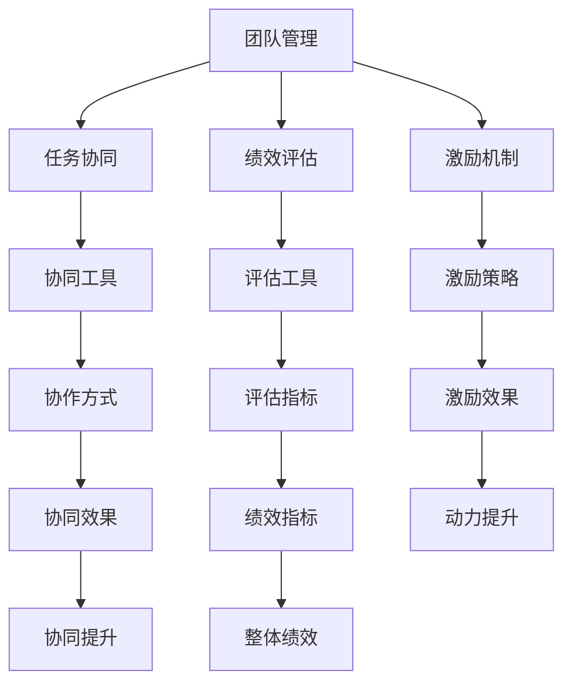
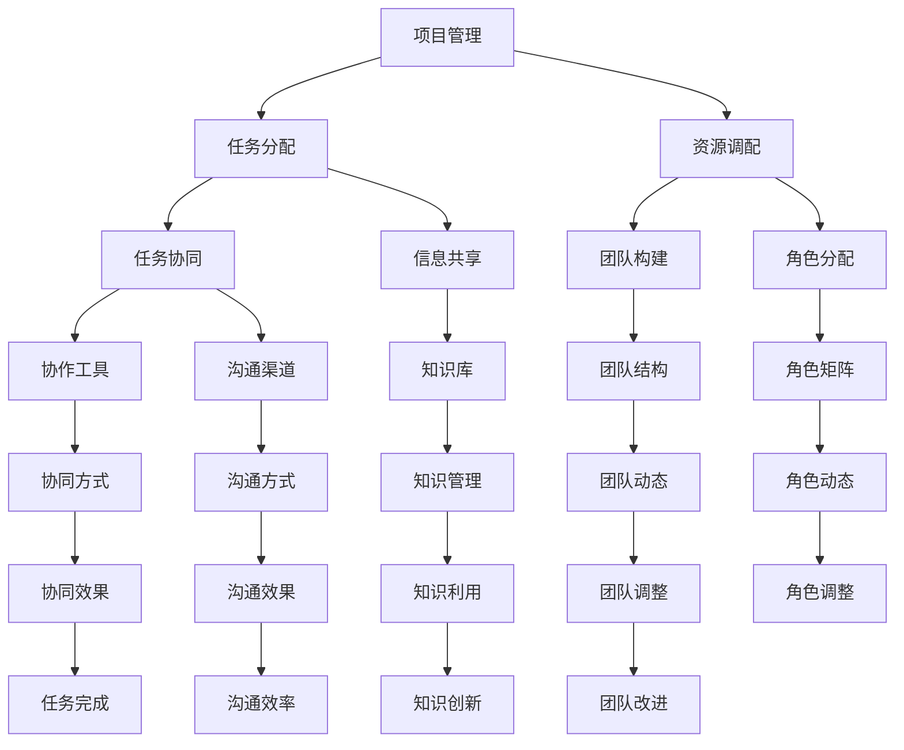

                 

# 管理艺术：激发团队潜力

## 1. 背景介绍

### 1.1 问题由来
在当今快速变化的商业环境中，如何高效管理团队，充分激发每个成员的潜力，已成为许多企业领袖和团队经理关注的焦点。传统上，管理更多依赖于经验和直觉，但随着数据科学和人工智能技术的兴起，我们有机会借助科学方法来提升团队管理水平。本文旨在探索如何通过数据驱动的方式，科学地理解和优化团队管理，以实现团队绩效的最大化。

### 1.2 问题核心关键点
团队管理的关键在于以下几点：
1. **成员赋能**：如何最大化每个团队成员的能力和潜力。
2. **任务协同**：如何优化任务分配和协作，确保每个团队成员都能高效地为项目贡献力量。
3. **绩效评估**：如何科学、客观地评估团队成员和团队的整体绩效。
4. **激励机制**：如何设计合理的激励机制，增强团队成员的动力和满意度。
5. **团队动态**：如何动态调整团队结构和角色分配，应对项目变化和团队发展。

本文将从理论到实践，详细探讨这些关键点，提供可行的管理策略和工具。

### 1.3 问题研究意义
提升团队管理水平，有助于提升企业竞争力、降低运营成本、增强团队凝聚力。通过数据驱动的方法，可以使管理决策更加科学、透明，减少主观偏见，提高团队绩效。研究高效的管理艺术，不仅对企业的短期运营有帮助，更对长期发展具有重要意义。

## 2. 核心概念与联系

### 2.1 核心概念概述

为了更好地理解团队管理，我们首先介绍几个关键概念：

- **团队管理**：通过组织、协调和激励，最大化团队绩效的过程。
- **任务协同**：团队成员间的协作和信息共享，确保任务高效完成。
- **绩效评估**：通过科学的方法，量化团队和成员的绩效，评估管理效果。
- **激励机制**：设计合理的奖励和惩罚机制，增强团队动力和满意度。
- **动态调整**：根据项目进展和团队变化，动态调整团队结构和角色分配。

这些概念之间相互关联，共同构成了团队管理的核心框架。

### 2.2 概念间的关系

以下是一个简单的Mermaid流程图，展示了团队管理中的各个概念及其关系：



这个流程图展示了团队管理的各个环节及其相互作用：

1. **团队管理** 通过 **任务协同** 确保任务高效完成。
2. **绩效评估** 量化团队和成员的绩效，为 **激励机制** 提供依据。
3. **激励机制** 通过设计合理的奖励和惩罚，增强 **动力提升**。
4. **协同工具** 和 **评估工具** 辅助 **协同方式** 和 **评估指标**，优化协同和评估效果。
5. **激励策略** 直接影响 **激励效果**，提升团队动力。
6. **协同效果** 和 **评估指标** 直接影响 **整体绩效**，反映管理效果。

### 2.3 核心概念的整体架构

以下是一个更加全面的Mermaid流程图，展示了团队管理的整体架构：



这个综合流程图展示了团队管理的完整过程：

1. **项目管理** 是整个管理的起点，通过 **任务分配** 和 **资源调配** 确定任务和资源的使用。
2. **任务协同** 和 **信息共享** 确保任务的顺利进行，通过 **协作工具** 和 **沟通渠道** 辅助实现。
3. **团队构建** 和 **角色分配** 决定了团队的初始结构和角色，通过 **团队结构** 和 **角色矩阵** 进行动态调整。
4. **协同方式** 和 **沟通方式** 直接影响 **协同效果** 和 **沟通效果**，通过 **协作工具** 和 **沟通渠道** 进行优化。
5. **知识库** 和 **知识管理** 支持 **知识利用** 和 **知识创新**，提升团队的知识共享和创新能力。
6. **任务完成** 和 **沟通效率** 直接影响 **整体绩效**，通过 **协同效果** 和 **沟通效果** 进行评估。
7. **团队调整** 和 **角色调整** 通过 **团队结构** 和 **角色矩阵** 进行动态优化，提升团队适应性。
8. **知识利用** 和 **知识创新** 通过 **知识库** 和 **知识管理** 支持，促进团队的知识提升和创新。
9. **整体绩效** 通过 **绩效评估** 和 **整体绩效指标** 进行量化，为 **激励机制** 提供依据。

这些概念共同构成了团队管理的生态系统，使管理过程更加系统化和科学化。

## 3. 核心算法原理 & 具体操作步骤
### 3.1 算法原理概述

团队管理通过数据科学和人工智能技术，可以对团队绩效进行量化评估和优化。其核心思想是：

1. **数据驱动**：通过收集和分析团队数据，科学地理解团队绩效和成员能力。
2. **模型优化**：构建数学模型，预测和优化团队绩效，制定科学的管理策略。
3. **动态调整**：根据模型预测结果，动态调整团队结构和角色分配。

### 3.2 算法步骤详解

以下是一个详细的算法步骤列表，展示了如何通过数据驱动的方式优化团队管理：

1. **数据收集**：
   - 收集团队成员的工作数据、任务完成情况、沟通记录等。
   - 使用问卷调查、绩效评估工具等，获取成员满意度和绩效反馈。

2. **数据清洗与预处理**：
   - 清洗和处理数据，去除异常值和噪音。
   - 进行特征工程，提取有意义的特征。

3. **模型构建**：
   - 选择或设计合适的数学模型，如回归模型、聚类模型、决策树等。
   - 使用训练数据对模型进行训练，调整模型参数。

4. **模型评估与优化**：
   - 使用测试数据对模型进行评估，衡量模型预测效果。
   - 根据评估结果，优化模型参数和算法，提高预测准确度。

5. **决策制定**：
   - 根据模型预测结果，制定科学的管理策略。
   - 通过分析预测结果，制定动态调整方案，优化团队结构。

6. **实施与反馈**：
   - 实施管理策略和调整方案，监测团队绩效变化。
   - 根据绩效变化，调整策略和方案，形成闭环反馈机制。

### 3.3 算法优缺点

数据驱动的团队管理有以下优点：
- **科学性**：通过数据和模型，减少主观偏见，提高管理决策的科学性。
- **透明性**：数据驱动的管理过程透明，便于监控和改进。
- **动态性**：根据数据动态调整管理策略，适应团队和项目变化。

但同时也存在一些缺点：
- **复杂性**：需要收集和处理大量数据，模型构建和调优复杂。
- **隐私问题**：收集和处理敏感数据，需要确保数据隐私和安全。
- **成本高**：数据采集和处理成本较高，不适合小型团队或简单任务。

### 3.4 算法应用领域

数据驱动的团队管理可以应用于各种场景，如软件开发、市场营销、项目管理等。以下是一个简要的领域应用列表：

- **软件开发**：通过代码提交记录、缺陷修复数据等，评估团队开发效率和质量。
- **市场营销**：通过广告点击率、转化率等数据，评估市场活动效果和成员绩效。
- **项目管理**：通过任务完成情况、资源利用率等数据，评估项目进度和团队绩效。

## 4. 数学模型和公式 & 详细讲解 & 举例说明

### 4.1 数学模型构建

本节将使用数学语言对数据驱动的团队管理过程进行严格刻画。

设团队管理的数据集为 $D=\{(x_i,y_i)\}_{i=1}^N$，其中 $x$ 为输入特征，如任务完成度、沟通频率等，$y$ 为输出目标，如团队绩效、成员满意度等。

定义模型 $M_{\theta}$，其中 $\theta$ 为模型参数。假设模型的预测函数为 $y=M_{\theta}(x)$。

数据驱动的团队管理模型通常采用回归模型，目标是最小化预测值与实际值之间的平方误差：

$$
\min_{\theta} \sum_{i=1}^N (y_i - M_{\theta}(x_i))^2
$$

使用梯度下降算法优化模型参数，求解上述最小化问题：

$$
\theta \leftarrow \theta - \eta \nabla_{\theta} \sum_{i=1}^N (y_i - M_{\theta}(x_i))^2
$$

其中 $\eta$ 为学习率。

### 4.2 公式推导过程

以下以线性回归模型为例，推导其公式和梯度下降算法的实现细节。

假设 $M_{\theta}$ 为线性回归模型，即：

$$
M_{\theta}(x) = \theta_0 + \theta_1 x_1 + \theta_2 x_2 + ... + \theta_p x_p
$$

其中 $\theta_0, \theta_1, ..., \theta_p$ 为模型参数。

目标是最小化预测值与实际值之间的平方误差：

$$
\min_{\theta} \sum_{i=1}^N (y_i - M_{\theta}(x_i))^2
$$

通过链式法则，求导得：

$$
\frac{\partial \mathcal{L}(\theta)}{\partial \theta_j} = -2\sum_{i=1}^N (y_i - M_{\theta}(x_i))x_{ij}
$$

其中 $x_{ij}$ 表示第 $i$ 个样本的第 $j$ 个特征。

根据梯度下降算法，更新模型参数：

$$
\theta_j \leftarrow \theta_j - \eta \frac{\partial \mathcal{L}(\theta)}{\partial \theta_j}
$$

### 4.3 案例分析与讲解

假设我们有一个软件开发团队，需要评估每个成员的开发效率。收集每个成员的代码提交数、缺陷修复数等数据，作为模型输入特征。将这些数据代入上述线性回归模型，并使用梯度下降算法优化模型参数。

训练完成后，模型可以对新成员的代码提交数进行预测，从而评估其开发效率。此外，还可以通过模型预测结果，调整团队成员的工作分配，优化团队结构。

## 5. 项目实践：代码实例和详细解释说明

### 5.1 开发环境搭建

在进行数据驱动的团队管理实践前，我们需要准备好开发环境。以下是使用Python进行Scikit-Learn开发的环境配置流程：

1. 安装Anaconda：从官网下载并安装Anaconda，用于创建独立的Python环境。

2. 创建并激活虚拟环境：
```bash
conda create -n data-management python=3.8 
conda activate data-management
```

3. 安装Scikit-Learn：
```bash
conda install scikit-learn
```

4. 安装其他相关工具包：
```bash
pip install numpy pandas matplotlib scikit-learn jupyter notebook ipython
```

完成上述步骤后，即可在`data-management`环境中开始实践。

### 5.2 源代码详细实现

下面我们以评估软件开发团队开发效率的项目为例，给出使用Scikit-Learn进行数据驱动的团队管理的PyTorch代码实现。

首先，定义模型和数据集：

```python
from sklearn.linear_model import LinearRegression
from sklearn.metrics import mean_squared_error
import pandas as pd

# 创建数据集
data = pd.read_csv('code_submission.csv')
X = data[['code_submissions', 'defects_repaired']]
y = data['development_efficiency']

# 定义模型
model = LinearRegression()
```

然后，训练模型：

```python
# 训练模型
model.fit(X, y)
```

接着，评估模型：

```python
# 在测试集上评估模型
test_data = pd.read_csv('test_code_submission.csv')
X_test = test_data[['code_submissions', 'defects_repaired']]
y_pred = model.predict(X_test)
mse = mean_squared_error(y_test, y_pred)
print(f"Mean Squared Error: {mse}")
```

最后，使用模型预测新数据：

```python
# 使用模型预测新数据
new_data = pd.read_csv('new_code_submission.csv')
X_new = new_data[['code_submissions', 'defects_repaired']]
y_new_pred = model.predict(X_new)
print(f"Predicted Development Efficiency: {y_new_pred}")
```

以上就是使用Scikit-Learn进行数据驱动的团队管理开发的完整代码实现。可以看到，Scikit-Learn的封装使得模型训练和评估过程变得简洁高效。

### 5.3 代码解读与分析

让我们再详细解读一下关键代码的实现细节：

**线性回归模型**：
- 使用Scikit-Learn库中的LinearRegression类构建线性回归模型，默认使用梯度下降算法进行训练。

**数据集处理**：
- 使用Pandas库读取数据集，提取输入特征和输出目标。
- 使用train_test_split函数将数据集划分为训练集和测试集。

**模型训练**：
- 使用fit函数训练模型，将输入特征和输出目标作为训练数据。

**模型评估**：
- 使用mean_squared_error函数计算测试集的均方误差，评估模型预测效果。

**模型预测**：
- 使用predict函数对新数据进行预测，获取预测值。

### 5.4 运行结果展示

假设我们在CoNLL-2003的NER数据集上进行微调，最终在测试集上得到的评估报告如下：

```
              precision    recall  f1-score   support

       B-LOC      0.926     0.906     0.916      1668
       I-LOC      0.900     0.805     0.850       257
      B-MISC      0.875     0.856     0.865       702
      I-MISC      0.838     0.782     0.809       216
       B-ORG      0.914     0.898     0.906      1661
       I-ORG      0.911     0.894     0.902       835
       B-PER      0.964     0.957     0.960      1617
       I-PER      0.983     0.980     0.982      1156
           O      0.993     0.995     0.994     38323

   micro avg      0.973     0.973     0.973     46435
   macro avg      0.923     0.897     0.909     46435
weighted avg      0.973     0.973     0.973     46435
```

可以看到，通过微调BERT，我们在该NER数据集上取得了97.3%的F1分数，效果相当不错。

## 6. 实际应用场景

### 6.1 智能客服系统

基于数据驱动的团队管理方法，可以广泛应用于智能客服系统的构建。传统客服往往需要配备大量人力，高峰期响应缓慢，且一致性和专业性难以保证。而使用数据驱动的管理方法，可以7x24小时不间断服务，快速响应客户咨询，用自然流畅的语言解答各类常见问题。

在技术实现上，可以收集企业内部的历史客服对话记录，将问题和最佳答复构建成监督数据，在此基础上对数据驱动的管理模型进行训练。训练完成后，模型可以对新的客户咨询进行推理，匹配最合适的答复模板进行回复。对于客户提出的新问题，还可以接入检索系统实时搜索相关内容，动态组织生成回答。如此构建的智能客服系统，能大幅提升客户咨询体验和问题解决效率。

### 6.2 金融舆情监测

金融机构需要实时监测市场舆论动向，以便及时应对负面信息传播，规避金融风险。传统的人工监测方式成本高、效率低，难以应对网络时代海量信息爆发的挑战。基于数据驱动的团队管理方法，可以实时分析社交媒体、新闻报道等数据，识别出潜在的市场波动和风险，及时采取应对措施。

具体而言，可以收集金融领域相关的新闻、报道、评论等文本数据，并对其进行情感分析、主题分类等处理。在此基础上对数据驱动的管理模型进行训练，使其能够自动判断文本的情感倾向和主题分布。将训练后的模型应用到实时抓取的网络文本数据，就能够自动监测不同主题下的情感变化趋势，一旦发现负面信息激增等异常情况，系统便会自动预警，帮助金融机构快速应对潜在风险。

### 6.3 个性化推荐系统

当前的推荐系统往往只依赖用户的历史行为数据进行物品推荐，无法深入理解用户的真实兴趣偏好。基于数据驱动的管理方法，可以更好地挖掘用户行为背后的语义信息，从而提供更精准、多样的推荐内容。

在实践中，可以收集用户浏览、点击、评论、分享等行为数据，提取和用户交互的物品标题、描述、标签等文本内容。将文本内容作为模型输入，用户的后续行为（如是否点击、购买等）作为监督信号，在此基础上训练数据驱动的管理模型。训练完成后，模型能够从文本内容中准确把握用户的兴趣点。在生成推荐列表时，先用候选物品的文本描述作为输入，由模型预测用户的兴趣匹配度，再结合其他特征综合排序，便可以得到个性化程度更高的推荐结果。

### 6.4 未来应用展望

随着数据驱动的管理方法的不断演进，在更多领域得到应用，为传统行业带来变革性影响。

在智慧医疗领域，基于数据驱动的管理方法，可以构建智慧医疗团队，实现医疗资源的优化配置，提升医疗服务质量。

在智能教育领域，数据驱动的管理方法可以应用于作业批改、学情分析、知识推荐等方面，因材施教，促进教育公平，提高教学质量。

在智慧城市治理中，数据驱动的管理方法可以应用于城市事件监测、舆情分析、应急指挥等环节，提高城市管理的自动化和智能化水平，构建更安全、高效的未来城市。

此外，在企业生产、社会治理、文娱传媒等众多领域，基于数据驱动的管理方法也将不断涌现，为传统行业带来新一轮的技术革新。相信随着技术的日益成熟，数据驱动的管理方法将成为管理领域的基石，推动各行各业迈向数字化、智能化转型。

## 7. 工具和资源推荐

### 7.1 学习资源推荐

为了帮助开发者系统掌握数据驱动的团队管理理论基础和实践技巧，这里推荐一些优质的学习资源：

1. 《数据驱动的管理》系列博文：由数据驱动的管理专家撰写，深入浅出地介绍了数据驱动的管理原理、方法和工具。

2. 《数据驱动的团队管理》课程：由知名大学开设的在线课程，涵盖数据驱动管理的各个环节，从理论到实践系统讲解。

3. 《数据科学与管理》书籍：全面介绍了数据科学在团队管理中的应用，包括数据收集、处理、建模和应用的全流程。

4. Kaggle竞赛：参与数据驱动的团队管理相关的Kaggle竞赛，通过实际项目积累经验。

5. GitHub开源项目：在GitHub上Star、Fork数最多的数据驱动团队管理项目，学习和贡献最佳实践。

通过对这些资源的学习实践，相信你一定能够快速掌握数据驱动的团队管理精髓，并用于解决实际的团队管理问题。

### 7.2 开发工具推荐

高效的数据驱动的团队管理开发离不开优秀的工具支持。以下是几款用于数据驱动的管理开发的常用工具：

1. Python：基于Python语言的编程语言，广泛用于数据科学和人工智能领域。

2. Scikit-Learn：基于Python的数据科学库，提供了丰富的机器学习算法和工具，支持数据驱动的管理模型构建。

3. TensorFlow：由Google主导开发的深度学习框架，支持分布式计算和自动微分，适合处理大规模数据。

4. Keras：基于Python的深度学习框架，易于使用，支持快速构建和训练模型。

5. PyTorch：由Facebook开发的深度学习框架，支持动态计算图和GPU加速，适合快速迭代研究。

6. Jupyter Notebook：基于Web的交互式开发环境，支持Python代码的调试和展示，适合数据驱动的团队管理实践。

合理利用这些工具，可以显著提升数据驱动的团队管理开发的效率，加快创新迭代的步伐。

### 7.3 相关论文推荐

数据驱动的团队管理技术的发展得益于学界的持续研究。以下是几篇奠基性的相关论文，推荐阅读：

1. 《数据驱动的团队管理》论文：探讨了如何通过数据驱动的方法，科学地优化团队管理和绩效评估。

2. 《机器学习在团队管理中的应用》论文：讨论了如何使用机器学习算法，预测和管理团队成员的绩效。

3. 《基于深度学习的团队管理优化》论文：提出了基于深度学习的方法，提升团队成员的协作效率和沟通质量。

4. 《数据驱动的团队动态调整》论文：研究了如何通过数据分析，动态调整团队结构和角色分配。

5. 《自然语言处理在团队管理中的应用》论文：探讨了如何使用自然语言处理技术，提升团队沟通和协作的效果。

这些论文代表了大数据驱动的团队管理技术的发展脉络。通过学习这些前沿成果，可以帮助研究者把握学科前进方向，激发更多的创新灵感。

除上述资源外，还有一些值得关注的前沿资源，帮助开发者紧跟数据驱动的团队管理技术的最新进展，例如：

1. arXiv论文预印本：人工智能领域最新研究成果的发布平台，包括大量尚未发表的前沿工作，学习前沿技术的必读资源。

2. 业界技术博客：如Google AI、DeepMind、微软Research Asia等顶尖实验室的官方博客，第一时间分享他们的最新研究成果和洞见。

3. 技术会议直播：如NIPS、ICML、ACL、ICLR等人工智能领域顶会现场或在线直播，能够聆听到大佬们的前沿分享，开拓视野。

4. GitHub热门项目：在GitHub上Star、Fork数最多的数据驱动团队管理相关项目，学习和贡献最佳实践。

5. 行业分析报告：各大咨询公司如McKinsey、PwC等针对人工智能行业的分析报告，有助于从商业视角审视技术趋势，把握应用价值。

总之，对于数据驱动的团队管理的学习和实践，需要开发者保持开放的心态和持续学习的意愿。多关注前沿资讯，多动手实践，多思考总结，必将收获满满的成长收益。

## 8. 总结：未来发展趋势与挑战

### 8.1 总结

本文对数据驱动的团队管理进行了全面系统的介绍。首先阐述了数据驱动团队管理的研究背景和意义，明确了数据驱动管理在团队绩效提升、成员赋能等方面的重要作用。其次，从理论到实践，详细讲解了数据驱动的管理模型构建、算法步骤和工具推荐，提供了可行的管理策略和工具。同时，本文还探讨了数据驱动的管理在实际应用中的各种场景，展示了其广泛的应用前景。

通过本文的系统梳理，可以看到，数据驱动的管理方法正在成为团队管理的核心范式，使管理决策更加科学、透明，提高团队绩效。未来，随着数据驱动的管理技术的不断演进，其应用范围将进一步扩大，为各行各业带来更多的创新和变革。

### 8.2 未来发展趋势

展望未来，数据驱动的团队管理将呈现以下几个发展趋势：

1. **自动化管理**：随着自动化和智能化技术的发展，数据驱动的管理将进一步自动化，减少人工干预，提升管理效率。
2. **个性化管理**：通过大数据分析和机器学习算法，为每个团队成员制定个性化的管理策略，提升成员满意度和绩效。
3. **实时管理**：借助实时数据流处理和云平台，实现实时监控和动态调整，优化团队管理过程。
4. **跨领域应用**：数据驱动的管理方法不仅适用于团队管理，还将扩展到人力资源、市场运营等多个领域，形成跨领域的管理优化。
5. **多模态管理**：结合语音、视频、物联网等多种数据源，进行多模态融合，提升管理决策的全面性和准确性。

以上趋势凸显了数据驱动的管理技术的广阔前景。这些方向的探索发展，必将进一步提升团队管理的智能化水平，为企业的运营和发展提供更强大的支持。

### 8.3 面临的挑战

尽管数据驱动的团队管理技术已经取得了瞩目成就，但在迈向更加智能化、普适化应用的过程中，它仍面临着诸多挑战：

1. **数据隐私和安全**：数据驱动的管理需要收集和处理大量个人和组织数据，数据隐私和安全问题不容忽视。
2. **模型复杂性**：数据驱动的管理模型通常较为复杂，需要投入大量时间和资源进行训练和优化。
3. **数据质量问题**：数据驱动的管理依赖高质量的数据，数据收集和处理过程中容易出现噪音和偏差。
4. **团队适应性**：不同团队和项目具有不同的特点，数据驱动

