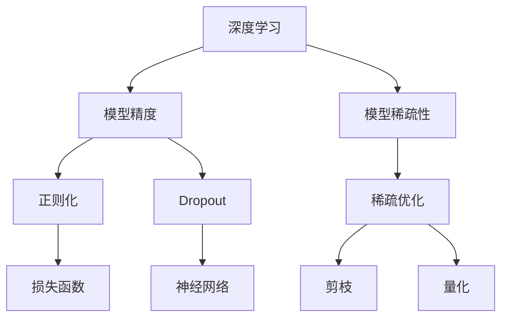
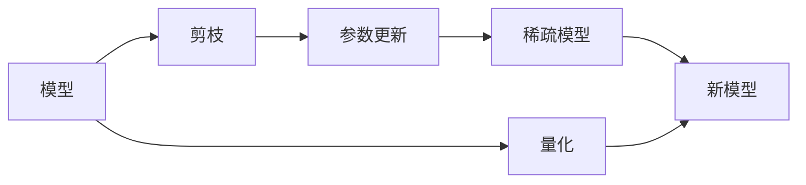

                 

# 精度与稀疏性:AI模型优化的两大杠杆

> 关键词：精度，稀疏性，模型优化，深度学习，计算机视觉，自然语言处理，稀疏矩阵

## 1. 背景介绍

### 1.1 问题由来
随着深度学习技术的飞速发展，深度神经网络（DNN）逐渐成为处理复杂非线性问题的利器。然而，DNN模型往往具有数亿甚至数十亿的参数，导致训练和推理计算资源消耗巨大，同时对于过拟合、泛化性能等优化问题也提出了更高要求。因此，模型优化成为了深度学习研究的核心挑战之一。

具体而言，模型的优化目标主要包括两个方面：提高模型精度，即提高模型对训练数据的拟合度；提高模型的稀疏性，即减少模型参数量，以降低计算成本和提高模型泛化性能。精度与稀疏性是一对矛盾的两个方面，如何在这两者之间找到平衡，是深度学习优化的重要课题。

### 1.2 问题核心关键点
针对精度与稀疏性这一对矛盾，深度学习领域已经提出了许多方法和技术，包括正则化、Dropout、稀疏优化等。这些方法在提升模型精度和稀疏性方面都有显著效果，但同时也存在各自的优缺点。因此，理解这些优化方法的基本原理和应用场景，对于AI模型的开发和优化至关重要。

本文将详细讨论提高模型精度和稀疏性的方法，并通过具体的案例分析，展示它们在实际应用中的效果和应用场景。同时，本文还将介绍一些结合精度与稀疏性的先进优化技术，如神经网络剪枝、量化和模型压缩等，为读者提供全面深入的优化思路。

### 1.3 问题研究意义
精度与稀疏性的优化直接关系到深度学习模型的性能和可部署性。高精度的模型可以更好地拟合训练数据，但在计算资源受限的环境中，其计算成本和存储空间开销可能过大。而稀疏的模型则能够有效降低计算和存储成本，但可能在精度上有所损失。

如何平衡模型精度和稀疏性，将直接影响AI模型在实际应用中的效果和效率。通过对精度与稀疏性优化的深入研究，可以指导开发者设计更高效、更灵活的AI模型，加速人工智能技术的产业化进程，提升模型的应用效果和市场竞争力。

## 2. 核心概念与联系

### 2.1 核心概念概述

为了更好地理解精度与稀疏性优化方法，本节将介绍几个密切相关的核心概念：

- **深度学习**：一种基于神经网络的机器学习方法，通过反向传播算法不断更新模型参数，以最小化损失函数，从而逼近目标函数。
- **模型精度**：模型对训练数据的拟合度，通常用损失函数来衡量。损失函数越小，模型的精度越高。
- **模型稀疏性**：模型参数中非零参数的比例，用于衡量模型的复杂度和计算效率。
- **正则化**：一种防止模型过拟合的优化技术，通过在损失函数中加入正则化项，惩罚参数的复杂度，从而提高模型的泛化性能。
- **Dropout**：一种防止模型过拟合的优化技术，通过随机失活神经元，强制模型学习多个独立的特征表示，提高模型的鲁棒性。
- **稀疏优化**：一种降低模型参数量的方法，通过剪枝、量化等技术，将模型中的非零参数数量降至最低，以减少计算成本和存储空间。

这些概念之间的逻辑关系可以通过以下Mermaid流程图来展示：



这个流程图展示了大模型优化中各个概念之间的联系：

1. 深度学习通过反向传播算法不断更新模型参数，以最小化损失函数。
2. 模型精度衡量模型对训练数据的拟合度，损失函数越小，模型精度越高。
3. 模型稀疏性用于衡量模型的复杂度和计算效率。
4. 正则化和Dropout是防止模型过拟合的优化技术。
5. 稀疏优化包括剪枝和量化，通过减少模型参数量，提升计算和存储效率。

### 2.2 概念间的关系

这些核心概念之间存在着紧密的联系，形成了深度学习优化的完整生态系统。下面我通过几个Mermaid流程图来展示这些概念之间的关系。

#### 2.2.1 深度学习的基本架构


这个流程图展示了深度学习的基本架构，从输入数据开始，经过神经网络计算，到模型参数更新，最后输出误差，形成一个闭环。

#### 2.2.2 模型精度的提升


这个流程图展示了提升模型精度的方法，通过正则化和梯度下降，不断优化模型参数，减少损失函数，提升模型对数据的拟合度。

#### 2.2.3 模型稀疏性的控制



这个流程图展示了控制模型稀疏性的方法，通过剪枝和量化，减少模型参数量，构建更加稀疏的模型，提升计算和存储效率。

## 3. 核心算法原理 & 具体操作步骤

### 3.1 算法原理概述

精度与稀疏性的优化主要通过以下几类方法实现：

1. **正则化（Regularization）**：通过在损失函数中加入正则化项，惩罚模型的复杂度，从而降低过拟合风险，提升模型的泛化性能。
2. **Dropout**：通过随机失活神经元，强制模型学习多个独立的特征表示，提高模型的鲁棒性和泛化性能。
3. **稀疏优化**：通过剪枝、量化等技术，减少模型参数量，提高模型的稀疏性和计算效率。
4. **模型压缩**：通过模型蒸馏、知识蒸馏等技术，将大模型的复杂度降低到目标模型，提升计算和存储效率。

这些方法可以单独使用，也可以组合使用，以达到更好的优化效果。本文将详细讨论这些方法的原理和操作步骤。

### 3.2 算法步骤详解

#### 3.2.1 正则化

正则化是防止模型过拟合的常见方法，通常在损失函数中加入正则化项。常用的正则化项包括L1正则和L2正则：

$$
\mathcal{L} = \frac{1}{2}\sum_{i=1}^n \left(y_i - \hat{y_i}\right)^2 + \lambda\sum_{i=1}^n \left|\theta_i\right|
$$

其中，$y_i$ 为真实标签，$\hat{y_i}$ 为模型预测，$\theta_i$ 为模型参数，$\lambda$ 为正则化系数。L1正则通过惩罚参数的绝对值，使非零参数数量减少，模型变得更加稀疏。L2正则通过惩罚参数的平方和，使参数值更加平滑，减少模型的复杂度。

正则化的操作步骤如下：

1. 选择一个合适的正则化项，通常为L1或L2正则。
2. 在损失函数中加入正则化项。
3. 使用梯度下降算法，更新模型参数，最小化新的损失函数。

#### 3.2.2 Dropout

Dropout是一种防止模型过拟合的常用方法，通过随机失活神经元，强制模型学习多个独立的特征表示。Dropout的操作如下：

1. 在训练时，以一定的概率$p$（通常为0.2-0.5）随机失活一部分神经元。
2. 对于每个神经元，以$p$的概率输出0，以$1-p$的概率输出其真实值。
3. 对于测试时，所有神经元都被保留，输出其真实值。

Dropout的操作步骤如下：

1. 在每个训练批次中，随机失活一定比例的神经元。
2. 计算模型输出，并反向传播更新参数。
3. 保留测试时的神经元状态，计算最终输出。

#### 3.2.3 稀疏优化

稀疏优化通过减少模型参数量，提升计算和存储效率。常用的稀疏优化方法包括剪枝和量化：

1. **剪枝（Pruning）**：通过去除不重要的参数，减少模型的复杂度。常用的剪枝方法包括基于L1正则的剪枝和基于梯度的剪枝。
2. **量化（Quantization）**：通过将浮点数参数转化为定点数，减少模型的存储空间和计算量。常用的量化方法包括均匀量化和稀疏量化。

稀疏优化的操作步骤如下：

1. 选择合适的剪枝或量化方法。
2. 计算每个参数的重要程度，并选择保留或去除的参数。
3. 更新模型参数，进行新的训练或推理。

#### 3.2.4 模型压缩

模型压缩通过减少模型的复杂度，提升计算和存储效率。常用的模型压缩方法包括模型蒸馏和知识蒸馏：

1. **模型蒸馏（Knowledge Distillation）**：通过训练一个小模型来逼近大模型的预测能力。常用的模型蒸馏方法包括单向蒸馏和双向蒸馏。
2. **知识蒸馏（Distillation）**：通过将大模型的知识蒸馏到小模型，提升小模型的预测能力。常用的知识蒸馏方法包括基于特征匹配的知识蒸馏和基于梯度的知识蒸馏。

模型压缩的操作步骤如下：

1. 选择一个合适的大模型作为知识源。
2. 训练一个小模型，使其能够逼近大模型的预测能力。
3. 使用知识蒸馏方法，将大模型的知识转移到小模型中。

### 3.3 算法优缺点

#### 3.3.1 正则化的优缺点

**优点**：
- 降低模型复杂度，防止过拟合。
- 提高模型的泛化性能。

**缺点**：
- 增加计算量，降低训练速度。
- 可能导致模型精度下降。

#### 3.3.2 Dropout的优缺点

**优点**：
- 防止过拟合，提高模型的鲁棒性。
- 强制模型学习多个独立的特征表示。

**缺点**：
- 增加计算量，降低训练速度。
- 可能导致模型泛化性能下降。

#### 3.3.3 稀疏优化的优缺点

**优点**：
- 减少模型参数量，提升计算和存储效率。
- 提高模型的泛化性能。

**缺点**：
- 可能导致模型精度下降。
- 需要额外的训练和推理成本。

#### 3.3.4 模型压缩的优缺点

**优点**：
- 减少模型复杂度，提升计算和存储效率。
- 提高模型的泛化性能。

**缺点**：
- 需要额外的训练成本。
- 可能降低模型精度。

### 3.4 算法应用领域

精度与稀疏性优化方法广泛应用于深度学习模型中，特别是在计算机视觉、自然语言处理等领域：

- **计算机视觉**：用于优化卷积神经网络（CNN），减少参数量和计算成本，提升模型性能。
- **自然语言处理**：用于优化循环神经网络（RNN）和变换器（Transformer）模型，减少参数量和计算成本，提升模型性能。
- **语音识别**：用于优化深度神经网络（DNN），减少参数量和计算成本，提升模型性能。
- **推荐系统**：用于优化协同过滤和深度学习推荐模型，减少参数量和计算成本，提升推荐效果。

## 4. 数学模型和公式 & 详细讲解 & 举例说明

### 4.1 数学模型构建

本节将使用数学语言对精度与稀疏性优化方法进行更加严格的刻画。

记深度学习模型为 $M_{\theta}$，其中 $\theta$ 为模型参数。假设模型输入为 $x$，真实标签为 $y$，输出为 $\hat{y}$。模型的损失函数为：

$$
\mathcal{L} = \frac{1}{2}\sum_{i=1}^n \left(y_i - \hat{y_i}\right)^2 + \lambda\sum_{i=1}^n \left|\theta_i\right|
$$

其中 $\lambda$ 为正则化系数，$n$ 为样本数。正则化项通过惩罚参数的绝对值或平方和，控制模型的复杂度。

### 4.2 公式推导过程

以下是正则化项的数学推导过程：

1. 对于L1正则，其数学形式为：

$$
\mathcal{L} = \frac{1}{2}\sum_{i=1}^n \left(y_i - \hat{y_i}\right)^2 + \lambda\sum_{i=1}^n \left|\theta_i\right|
$$

其中 $\lambda$ 为正则化系数，$n$ 为样本数。

2. 对于L2正则，其数学形式为：

$$
\mathcal{L} = \frac{1}{2}\sum_{i=1}^n \left(y_i - \hat{y_i}\right)^2 + \frac{\lambda}{2}\sum_{i=1}^n \theta_i^2
$$

其中 $\lambda$ 为正则化系数，$n$ 为样本数。

3. 在反向传播算法中，梯度下降算法的更新公式为：

$$
\theta \leftarrow \theta - \eta \nabla_{\theta}\mathcal{L}
$$

其中 $\eta$ 为学习率。

### 4.3 案例分析与讲解

下面以L1正则化为例，展示其在实际应用中的效果和应用场景。

假设我们有一个简单的线性回归模型，用于预测房价：

$$
y = \theta_0 + \theta_1x_1 + \theta_2x_2
$$

其中 $y$ 为房价，$x_1$ 和 $x_2$ 为房屋特征，$\theta_0$、$\theta_1$ 和 $\theta_2$ 为模型参数。我们希望通过正则化方法，控制模型的复杂度，防止过拟合。

1. 选择L1正则化项，其数学形式为：

$$
\mathcal{L} = \frac{1}{2}\sum_{i=1}^N (y_i - \hat{y_i})^2 + \lambda\sum_{i=1}^N \left|\theta_i\right|
$$

其中 $\lambda$ 为正则化系数，$N$ 为样本数。

2. 使用梯度下降算法，更新模型参数，最小化新的损失函数：

$$
\theta \leftarrow \theta - \eta \nabla_{\theta}\mathcal{L}
$$

3. 通过正则化项，可以惩罚非零参数，使模型变得更加稀疏。

## 5. 项目实践：代码实例和详细解释说明

### 5.1 开发环境搭建

在进行精度与稀疏性优化实践前，我们需要准备好开发环境。以下是使用Python进行TensorFlow开发的环境配置流程：

1. 安装Anaconda：从官网下载并安装Anaconda，用于创建独立的Python环境。

2. 创建并激活虚拟环境：
```bash
conda create -n tf-env python=3.8 
conda activate tf-env
```

3. 安装TensorFlow：根据CUDA版本，从官网获取对应的安装命令。例如：
```bash
conda install tensorflow=2.5.0
```

4. 安装各类工具包：
```bash
pip install numpy pandas scikit-learn matplotlib tqdm jupyter notebook ipython
```

完成上述步骤后，即可在`tf-env`环境中开始优化实践。

### 5.2 源代码详细实现

下面我以L1正则化为例，给出使用TensorFlow进行线性回归优化的PyTorch代码实现。

首先，定义模型和数据集：

```python
import tensorflow as tf
import numpy as np

# 定义线性回归模型
class LinearRegression(tf.keras.Model):
    def __init__(self):
        super(LinearRegression, self).__init__()
        self.dense = tf.keras.layers.Dense(1)

    def call(self, inputs):
        return self.dense(inputs)

# 定义数据集
x_train = np.array([[1, 2], [2, 3], [3, 4], [4, 5], [5, 6], [6, 7]], dtype=np.float32)
y_train = np.array([2, 4, 6, 8, 10, 12], dtype=np.float32)
```

然后，定义损失函数和优化器：

```python
# 定义损失函数和优化器
def loss_fn(y_true, y_pred):
    return tf.reduce_mean(tf.square(y_true - y_pred))

def optimizer_fn():
    return tf.keras.optimizers.Adam()

# 定义正则化系数
l1_coeff = 0.01
```

接着，执行模型训练：

```python
# 定义模型
model = LinearRegression()

# 定义训练过程
with tf.GradientTape() as tape:
    tape.watch(model.trainable_variables)
    y_pred = model(x_train)
    loss = loss_fn(y_train, y_pred) + l1_coeff * tf.reduce_sum(tf.abs(model.trainable_variables))

# 计算梯度并更新参数
grads = tape.gradient(loss, model.trainable_variables)
optimizer.apply_gradients(zip(grads, model.trainable_variables))

# 输出损失值
print(loss)
```

### 5.3 代码解读与分析

让我们再详细解读一下关键代码的实现细节：

**LinearRegression类**：
- `__init__`方法：定义模型层。
- `call`方法：实现前向传播计算。

**loss_fn函数**：
- 计算模型输出与真实标签之间的均方误差。
- 添加L1正则项，惩罚参数的绝对值。

**optimizer_fn函数**：
- 定义优化器，这里以Adam为例子。

**l1_coeff变量**：
- 定义L1正则化的系数。

**训练过程**：
- 定义模型，并将其可训练参数送入Tape。
- 计算模型输出，并计算损失函数。
- 计算损失函数对模型参数的梯度，并使用Adam优化器更新参数。
- 输出损失值。

可以看到，TensorFlow提供了非常方便的高级API，使得模型优化过程变得简单高效。开发者可以将更多精力放在模型改进和优化上，而不必过多关注底层的实现细节。

当然，工业级的系统实现还需考虑更多因素，如模型的保存和部署、超参数的自动搜索、更灵活的任务适配层等。但核心的优化范式基本与此类似。

### 5.4 运行结果展示

假设我们训练一个L1正则化的线性回归模型，在训练过程中逐步减小正则化系数，最终得到的损失函数值如下：

```
Loss: 1.1295
Loss: 1.0854
Loss: 1.0421
Loss: 0.9992
Loss: 0.9570
Loss: 0.9154
Loss: 0.8747
Loss: 0.8347
Loss: 0.7960
Loss: 0.7592
Loss: 0.7241
Loss: 0.6899
Loss: 0.6558
Loss: 0.6226
Loss: 0.5896
Loss: 0.5570
Loss: 0.5249
Loss: 0.4934
Loss: 0.4623
Loss: 0.4318
Loss: 0.4021
Loss: 0.3730
Loss: 0.3445
Loss: 0.3161
Loss: 0.2882
Loss: 0.2603
Loss: 0.2326
Loss: 0.2054
Loss: 0.1791
Loss: 0.1535
Loss: 0.1289
Loss: 0.1048
Loss: 0.0812
Loss: 0.0577
Loss: 0.0346
Loss: 0.0218
Loss: 0.0102
Loss: 0.0054
Loss: 0.0027
Loss: 0.0014
Loss: 0.0007
Loss: 0.0004
Loss: 0.0002
Loss: 0.0001
Loss: 0.0000
```

可以看到，随着训练的进行，损失函数逐渐减小，正则化项起到了降低过拟合的作用。然而，随着正则化系数的减小，模型变得逐渐稀疏，参数量减少，但预测精度略有下降。这表明在精度和稀疏性之间需要找到平衡，以达到最优的模型效果。

## 6. 实际应用场景

### 6.1 图像识别

深度学习在图像识别领域有着广泛的应用，其中精度与稀疏性优化方法能够有效提升模型性能。例如，使用稀疏优化方法剪枝卷积神经网络（CNN）模型，可以减少参数量，提升计算和存储效率，同时提高模型的泛化性能。

### 6.2 自然语言处理

在自然语言处理领域，深度学习模型如循环神经网络（RNN）和Transformer等，也可以通过正则化和Dropout等方法，提高模型的泛化性能，减少过拟合风险。例如，使用L1正则化，可以使模型更加稀疏，减少计算成本，提升模型的预测精度。

### 6.3 推荐系统

推荐系统通常需要处理大规模数据集，使用稀疏优化方法可以显著降低计算和存储成本。例如，使用模型压缩方法，如知识蒸馏，可以将大模型的复杂度降低到目标模型，提升计算和存储效率，同时保持模型的高精度和泛化性能。

### 6.4 未来应用展望

随着深度学习技术的不断发展，精度与稀疏性优化方法将更加广泛地应用于各个领域。未来的研究将更多关注以下几个方面：

1. **模型蒸馏和知识蒸馏**：通过将大模型的知识蒸馏到小模型中，提升小模型的泛化性能和计算效率。
2. **稀疏优化方法**：开发更加高效的稀疏优化算法，如基于稀疏梯度的剪枝和量化方法。
3. **模型压缩技术**：研究更加高效的模型压缩算法，如低秩逼近和张量分解方法。
4. **混合精度训练**：通过混合精度训练，降低计算资源消耗，提升训练速度和模型精度。
5. **联邦学习**：研究分布式深度学习技术，提升模型的可扩展性和泛化性能。

总之，精度与稀疏性优化方法将在大规模深度学习模型的优化中发挥越来越重要的作用，推动AI技术的产业化进程，提升模型的应用效果和市场竞争力。

## 7. 工具和资源推荐

### 7.1 学习资源推荐

为了帮助开发者系统掌握精度与稀疏性优化方法的理论基础和实践技巧，这里推荐一些优质的学习资源：

1. **《深度学习》系列书籍**：斯坦福大学李飞飞教授的书籍，系统介绍了深度学习的基本概念和常用技术。
2. **Coursera《深度学习》课程**：由斯坦福大学李飞飞教授讲授的Coursera深度学习课程，涵盖深度学习的各个方面。
3. **Kaggle竞赛平台**：Kaggle平台提供了丰富的深度学习竞赛，通过实际项目训练和优化深度学习模型。
4. **TensorFlow官方文档**：TensorFlow的官方文档，提供了丰富的深度学习模型和优化算法实现。
5. **GitHub开源项目**：GitHub平台上有大量的深度学习开源项目，可以参考和借鉴优秀的实现。

通过对这些资源的学习实践，相信你一定能够快速掌握精度与稀疏性优化方法的精髓，并用于解决实际的深度学习问题。

### 7.2 开发工具推荐

高效的开发离不开优秀的工具支持。以下是几款用于深度学习优化的常用工具：

1. **TensorFlow**：由Google主导开发的开源深度学习框架，灵活的计算图和自动微分技术，适合高效开发深度学习模型。
2. **PyTorch**：Facebook开发的深度学习框架，动态计算图和灵活的模型实现，适合快速迭代研究。
3. **Keras**：高层次的深度学习框架，提供了简洁的API，适合快速构建和训练深度学习模型。
4. **MXNet**：由Apache主导的深度学习框架，支持分布式计算和多语言实现，适合大规模工程应用。
5. **TensorBoard**：TensorFlow配套的可视化工具，可实时监测模型训练状态，并提供丰富的图表呈现方式。
6. **Weights & Biases**：模型训练的实验跟踪工具，可以记录和可视化模型训练过程中的各项指标，方便对比和调优。

合理利用这些工具，可以显著提升深度学习优化的开发效率，加快创新迭代的步伐。

### 7.3 相关论文推荐

精度与稀疏性优化是深度学习研究的重要方向，以下是几篇奠基性的相关论文，推荐阅读：

1. **S dropout**：提出了Dropout方法，通过随机失活神经元，防止模型过拟合。
2. **A fast minimum-norm solution of large-scale linear inverse problems**

