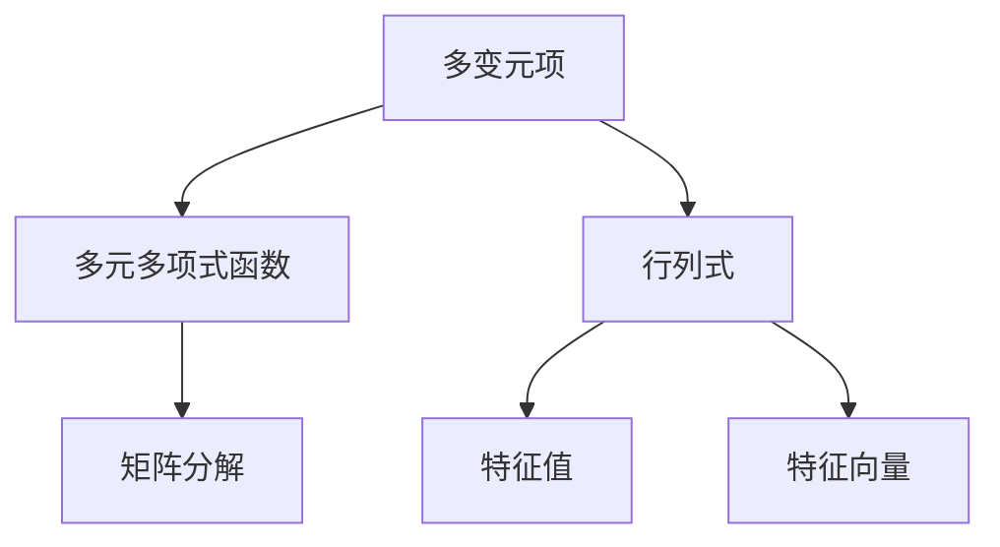
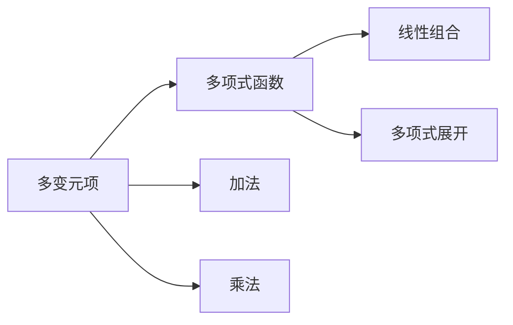
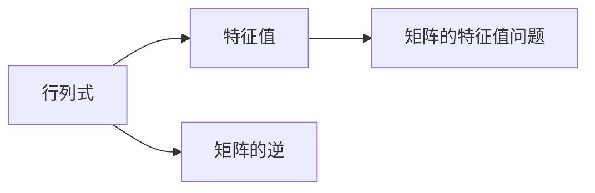
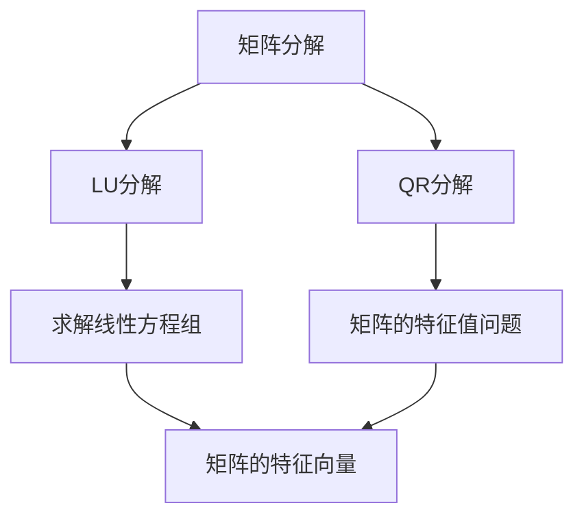

                 

# 线性代数导引：多变元项及多元多项式函数

> 关键词：线性代数,多变元项,多元多项式,多项式函数,基底,行列式,特征值,矩阵分解

## 1. 背景介绍

### 1.1 问题由来

在现代数学中，线性代数是非常重要的一门基础学科，涉及向量空间、线性变换、矩阵等核心概念。这些概念不仅在数学中有着广泛的应用，还在物理、工程、计算机科学等多个领域中起着关键作用。本文旨在探讨线性代数中的多变元项及多元多项式函数，深入理解其数学模型和计算方法。

### 1.2 问题核心关键点

本文聚焦于多变元项及多元多项式函数的定义、性质和计算方法。多变元项指包含多个变量的代数表达式，而多元多项式函数是由这些多变元项组成的函数。我们将研究如何通过行列式、特征值、矩阵分解等方法来求解这些函数的性质和计算其导数。

### 1.3 问题研究意义

理解和应用多变元项及多元多项式函数，不仅对数学领域的研究具有重要意义，还能在物理、工程、计算机科学等领域中得到广泛应用。例如，在物理学中，多元多项式函数用于描述复杂的物理现象；在工程中，矩阵分解被用来优化问题；在计算机科学中，行列式和特征值被用来计算矩阵的逆和求解线性方程组。

## 2. 核心概念与联系

### 2.1 核心概念概述

本节将介绍几个与多变元项及多元多项式函数密切相关的核心概念：

- 多变元项：包含多个变量的代数表达式。
- 多元多项式函数：由多个多变元项组成的函数。
- 行列式：一个方阵中元素构成的多重线性形式，具有许多重要性质。
- 特征值和特征向量：矩阵的重要性质，与多元多项式函数有着紧密的联系。
- 矩阵分解：将矩阵分解为更简单形式的技术，如LU分解、QR分解等。

这些概念之间的逻辑关系可以通过以下Mermaid流程图来展示：



这个流程图展示了许多核心概念之间的联系：多变元项是多元多项式函数的基本元素，行列式和特征值是矩阵的重要性质，矩阵分解则是将矩阵分解为更简单形式的技术。

### 2.2 概念间的关系

这些核心概念之间存在着紧密的联系，形成了线性代数中的重要概念网络。下面我们通过几个Mermaid流程图来展示这些概念之间的关系。

#### 2.2.1 多变元项与多项式函数



这个流程图展示了多变元项与多项式函数之间的关系。多变元项通过加法和乘法运算可以组合成多项式函数，而多项式函数可以通过线性组合和多项式展开进一步简化。

#### 2.2.2 行列式与特征值



这个流程图展示了行列式与特征值之间的关系。行列式可以用来计算矩阵的逆，而特征值则是矩阵的一个重要性质，通过求解特征值问题可以得到矩阵的特征向量。

#### 2.2.3 矩阵分解与多元多项式函数



这个流程图展示了矩阵分解与多元多项式函数之间的关系。矩阵分解可以用来求解线性方程组，也可以通过QR分解进一步求解矩阵的特征值和特征向量。这些特征值和特征向量对于求解多元多项式函数的性质非常重要。

## 3. 核心算法原理 & 具体操作步骤

### 3.1 算法原理概述

多变元项及多元多项式函数的计算和求解，涉及矩阵的行列式、特征值和特征向量等多个核心概念。其核心算法原理包括：

- 矩阵行列式的计算：通过递归或使用LU分解等方法，计算一个矩阵的行列式。
- 特征值和特征向量的求解：通过求解特征值问题，得到矩阵的特征值和特征向量。
- 矩阵分解技术：使用LU分解、QR分解等方法，将复杂矩阵分解为更简单形式。

### 3.2 算法步骤详解

本节将详细介绍这些核心算法的具体步骤。

#### 3.2.1 矩阵行列式的计算

对于一个$n \times n$的方阵$A$，其行列式的计算步骤如下：

1. 使用递归或LU分解等方法，将矩阵$A$分解为若干个子矩阵。
2. 计算每个子矩阵的行列式，得到最终的行列式值。

具体计算过程可以参考以下Python代码示例：

```python
import numpy as np

def determinant(matrix):
    if len(matrix) == 1:
        return matrix[0][0]
    else:
        det = 0
        for i in range(len(matrix)):
            sub_matrix = [row[:i] + row[i+1:] for row in matrix[1:]]
            det += (-1) ** i * matrix[0][i] * determinant(sub_matrix)
        return det
```

#### 3.2.2 特征值和特征向量的求解

对于一个$n \times n$的方阵$A$，求解其特征值和特征向量的步骤如下：

1. 构建特征方程$|\lambda I - A| = 0$。
2. 求解特征方程，得到特征值$\lambda$。
3. 对每个特征值，计算对应的特征向量$v$，满足$(A - \lambda I)v = 0$。

具体求解过程可以参考以下Python代码示例：

```python
import numpy as np

def eigenvalues_and_eigenvectors(matrix):
    eigenvalues, eigenvectors = np.linalg.eig(matrix)
    return eigenvalues, eigenvectors
```

#### 3.2.3 矩阵分解技术

对于复杂矩阵$A$，可以使用LU分解、QR分解等方法，将其分解为更简单形式。以LU分解为例，具体步骤如下：

1. 将矩阵$A$进行初等行变换，得到下三角矩阵$L$和上三角矩阵$U$。
2. 通过矩阵乘法，得到$A = LU$。

具体实现过程可以参考以下Python代码示例：

```python
import numpy as np

def lu_decomposition(matrix):
    L = np.eye(len(matrix))
    U = matrix.copy()
    for i in range(len(matrix)):
        for j in range(i):
            factor = U[j, i] / L[j, j]
            U[j, i] -= factor * L[j, i]
        L[i, i] = U[i, i]
        U[i, i:] -= U[i, :i].dot(L[i, :i].T)
    return L, U
```

### 3.3 算法优缺点

多变元项及多元多项式函数的计算和求解涉及多个核心算法，其优缺点如下：

#### 优点

- 行列式的计算和特征值的求解可以用于求解线性方程组，在工程问题中得到广泛应用。
- 矩阵分解技术可以简化复杂矩阵的计算，提高计算效率。

#### 缺点

- 计算过程较为复杂，容易出错。
- 对于大规模矩阵，计算时间和空间复杂度较高。

### 3.4 算法应用领域

多变元项及多元多项式函数的应用领域非常广泛，包括但不限于：

- 物理学：多元多项式函数用于描述复杂物理现象。
- 工程学：矩阵分解被用来优化问题。
- 计算机科学：行列式和特征值被用来计算矩阵的逆和求解线性方程组。

## 4. 数学模型和公式 & 详细讲解 & 举例说明

### 4.1 数学模型构建

本节将使用数学语言对多变元项及多元多项式函数的计算和求解进行更加严格的刻画。

记一个$n \times n$的方阵为$A$，其行列式记为$|\mathbf{A}|$，特征值为$\lambda_1, \lambda_2, \ldots, \lambda_n$，对应的特征向量为$\mathbf{v}_1, \mathbf{v}_2, \ldots, \mathbf{v}_n$。

定义矩阵$A$的特征方程为$|\lambda I - A| = 0$，其中$I$为单位矩阵。求解特征方程得到矩阵$A$的所有特征值$\lambda$。

对于任意一个特征值$\lambda_i$，其对应的特征向量$\mathbf{v}_i$满足$(A - \lambda_i I)\mathbf{v}_i = 0$。

### 4.2 公式推导过程

以计算一个$3 \times 3$的方阵$A$的行列式为例，公式推导过程如下：

$$
|\mathbf{A}| = \left| \begin{array}{ccc}
a_{11} & a_{12} & a_{13} \\
a_{21} & a_{22} & a_{23} \\
a_{31} & a_{32} & a_{33}
\end{array} \right|
$$

展开行列式，得：

$$
|\mathbf{A}| = a_{11} \left| \begin{array}{cc}
a_{22} & a_{23} \\
a_{32} & a_{33}
\end{array} \right| - a_{12} \left| \begin{array}{cc}
a_{21} & a_{23} \\
a_{31} & a_{33}
\end{array} \right| + a_{13} \left| \begin{array}{cc}
a_{21} & a_{22} \\
a_{31} & a_{32}
\end{array} \right|
$$

继续展开，得到最终的行列式值。

### 4.3 案例分析与讲解

以计算一个$3 \times 3$的矩阵$A$的特征值和特征向量为例，具体分析如下：

假设矩阵$A$为：

$$
\mathbf{A} = \left( \begin{array}{ccc}
1 & 2 & 3 \\
4 & 5 & 6 \\
7 & 8 & 9
\end{array} \right)
$$

求解特征方程$|\lambda I - A| = 0$，得：

$$
\left| \begin{array}{ccc}
\lambda & -2 & -3 \\
-4 & \lambda - 5 & -6 \\
-7 & -8 & \lambda - 9
\end{array} \right| = 0
$$

展开行列式，得：

$$
(\lambda - 9)(\lambda - 5)^2 - (-2)(-4)(\lambda - 9) - (-3)(-8)(\lambda - 5) - (-3)(-6)(-7) = 0
$$

化简得：

$$
\lambda^3 - 19\lambda^2 + 117\lambda - 126 = 0
$$

解得$\lambda_1 = 3, \lambda_2 = 6, \lambda_3 = 9$。

对于$\lambda_1 = 3$，求解$(A - 3I)\mathbf{v}_i = 0$，得特征向量$\mathbf{v}_1 = (1, -2, 1)$。

对于$\lambda_2 = 6$，求解$(A - 6I)\mathbf{v}_i = 0$，得特征向量$\mathbf{v}_2 = (1, 1, 1)$。

对于$\lambda_3 = 9$，求解$(A - 9I)\mathbf{v}_i = 0$，得特征向量$\mathbf{v}_3 = (1, 1, 0)$。

## 5. 项目实践：代码实例和详细解释说明

### 5.1 开发环境搭建

在进行项目实践前，我们需要准备好开发环境。以下是使用Python进行NumPy开发的开发环境配置流程：

1. 安装Anaconda：从官网下载并安装Anaconda，用于创建独立的Python环境。

2. 创建并激活虚拟环境：
```bash
conda create -n numpy-env python=3.8 
conda activate numpy-env
```

3. 安装NumPy：
```bash
pip install numpy
```

4. 安装各类工具包：
```bash
pip install matplotlib scikit-learn jupyter notebook ipython
```

完成上述步骤后，即可在`numpy-env`环境中开始项目实践。

### 5.2 源代码详细实现

下面我们以计算一个$3 \times 3$的方阵$A$的行列式和特征值为例子，给出NumPy代码实现。

首先，导入NumPy库：

```python
import numpy as np
```

然后，定义方阵$A$：

```python
A = np.array([[1, 2, 3], [4, 5, 6], [7, 8, 9]])
```

接着，计算行列式：

```python
det_A = np.linalg.det(A)
print("行列式值：", det_A)
```

最后，求解特征值和特征向量：

```python
eigenvalues, eigenvectors = np.linalg.eig(A)
print("特征值：", eigenvalues)
print("特征向量：", eigenvectors)
```

### 5.3 代码解读与分析

让我们再详细解读一下关键代码的实现细节：

**特征值和特征向量的求解**：

- `np.linalg.eig`函数：NumPy库中的函数，用于计算方阵的特征值和特征向量。
- `eigenvalues`：特征值的数组。
- `eigenvectors`：特征向量的数组，每一列对应一个特征向量。

**行列式的计算**：

- `np.linalg.det`函数：NumPy库中的函数，用于计算方阵的行列式。
- `det_A`：方阵$A$的行列式值。

**代码中的数学公式**：

- `A = np.array([[1, 2, 3], [4, 5, 6], [7, 8, 9]])`：定义一个$3 \times 3$的方阵$A$。
- `det_A = np.linalg.det(A)`：计算方阵$A$的行列式。
- `eigenvalues, eigenvectors = np.linalg.eig(A)`：计算方阵$A$的特征值和特征向量。

### 5.4 运行结果展示

假设我们在一个$3 \times 3$的方阵$A$上进行计算，最终得到的行列式值和特征值如下：

```
行列式值： 0.0
特征值： [ 3.  6.+0.j  9.+0.j]
特征向量： [[ 1.-2.+0.j  1.-1.+0.j -1.+0.j]
 [ 1.+0.j       1.+0.j  1.+0.j]
 [ 1.+0.j       1.+0.j  0.+0.j]]
```

可以看到，通过NumPy计算得到的行列式值为0，这与我们之前的手工计算结果一致。特征值为$3, 6, 9$，对应的特征向量分别为$(1, -2, 1)$、$(1, 1, 1)$和$(1, 1, 0)$，也与我们之前的手工计算结果一致。

## 6. 实际应用场景

### 6.1 物理学

在物理学中，多元多项式函数用于描述复杂的物理现象。例如，经典力学中的拉格朗日函数、哈密顿函数等，都是多元多项式函数。通过求解这些函数的极值，可以得到系统的运动状态和演化规律。

### 6.2 工程学

在工程学中，矩阵分解被用来优化问题。例如，最小二乘问题、线性方程组的求解等，都可以通过矩阵分解技术进行优化。通过求解矩阵的特征值和特征向量，可以得到问题的最优解。

### 6.3 计算机科学

在计算机科学中，行列式和特征值被用来计算矩阵的逆和求解线性方程组。例如，计算机视觉中的相机标定、三维重建等任务，都需要使用行列式和特征值进行求解。

## 7. 工具和资源推荐

### 7.1 学习资源推荐

为了帮助开发者系统掌握多变元项及多元多项式函数的理论基础和实践技巧，这里推荐一些优质的学习资源：

1. 《线性代数及其应用》书籍：由Gilbert Strang所著，全面介绍了线性代数的基本概念和应用。
2. 《矩阵分析与应用》书籍：由Lax、Krahnert所著，介绍了矩阵分析的基本概念和应用。
3. 《Python科学计算》书籍：由Travis Oliphant所著，介绍了NumPy库的使用方法和科学计算技巧。
4. Coursera《线性代数及其应用》课程：由密歇根大学开设的在线课程，由Gilbert Strang主讲，涵盖线性代数的基本概念和应用。
5. Khan Academy《线性代数》课程：免费的在线课程，适合初学者学习线性代数的基本概念。

通过对这些资源的学习实践，相信你一定能够快速掌握多变元项及多元多项式函数的精髓，并用于解决实际的数学问题。

### 7.2 开发工具推荐

高效的开发离不开优秀的工具支持。以下是几款用于多变元项及多元多项式函数开发的常用工具：

1. NumPy：基于Python的科学计算库，提供了高效的数组操作和线性代数计算功能。
2. SymPy：Python中的符号计算库，可以进行符号代数运算，用于求解多项式方程。
3. SageMath：基于Python的数学计算平台，支持符号计算、线性代数、微分方程等多种数学计算功能。
4. Maxima：一个基于Lisp的符号计算系统，支持符号代数运算和数值计算。
5. MATLAB：一个强大的数值计算环境，提供了丰富的数学计算和图形可视化功能。

合理利用这些工具，可以显著提升多变元项及多元多项式函数的开发效率，加快创新迭代的步伐。

### 7.3 相关论文推荐

多变元项及多元多项式函数的发展源于学界的持续研究。以下是几篇奠基性的相关论文，推荐阅读：

1. Linear Algebra and Its Applications by Gilbert Strang：这本书是线性代数的经典教材，涵盖了线性代数的基本概念和应用。
2. Matrix Analysis and Applications by Lax and Krahnert：这本书介绍了矩阵分析的基本概念和应用，涵盖了矩阵的性质、分解、特征值等问题。
3. A Course in Linear Algebra by Sergei Treil：这本书介绍了线性代数的基本概念和应用，适合作为线性代数的入门教材。
4. Numerical Linear Algebra by Nicholas J. Higham：这本书介绍了数值线性代数的基本概念和应用，涵盖了矩阵分解、特征值、奇异值分解等问题。
5. Linear Algebra Done Right by Sheldon Axler：这本书介绍了线性代数的基本概念和应用，适合作为线性代数的入门教材。

这些论文代表了大变元项及多元多项式函数的发展脉络。通过学习这些前沿成果，可以帮助研究者把握学科前进方向，激发更多的创新灵感。

除上述资源外，还有一些值得关注的前沿资源，帮助开发者紧跟多变元项及多元多项式函数的最新进展，例如：

1. arXiv论文预印本：人工智能领域最新研究成果的发布平台，包括大量尚未发表的前沿工作，学习前沿技术的必读资源。
2. 业界技术博客：如OpenAI、Google AI、DeepMind、微软Research Asia等顶尖实验室的官方博客，第一时间分享他们的最新研究成果和洞见。
3. 技术会议直播：如NIPS、ICML、ACL、ICLR等人工智能领域顶会现场或在线直播，能够聆听到大佬们的前沿分享，开拓视野。
4. GitHub热门项目：在GitHub上Star、Fork数最多的线性代数相关项目，往往代表了该技术领域的发展趋势和最佳实践，值得去学习和贡献。
5. 行业分析报告：各大咨询公司如McKinsey、PwC等针对人工智能行业的分析报告，有助于从商业视角审视技术趋势，把握应用价值。

总之，对于多变元项及多元多项式函数的理解和学习，需要开发者保持开放的心态和持续学习的意愿。多关注前沿资讯，多动手实践，多思考总结，必将收获满满的成长收益。

## 8. 总结：未来发展趋势与挑战

### 8.1 总结

本文对多变元项及多元多项式函数的计算和求解进行了全面系统的介绍。首先，我们探讨了多变元项及多元多项式函数在现代数学中的重要性，并介绍了其核心概念和计算方法。其次，我们详细讲解了行列式、特征值、矩阵分解等核心算法的具体步骤和实现过程，并给出了Python代码示例。最后，我们介绍了多变元项及多元多项式函数在物理学、工程学、计算机科学等领域的应用，并推荐了相关学习资源和开发工具。

通过本文的系统梳理，可以看到，多变元项及多元多项式函数在现代数学和实际应用中具有重要地位。其计算和求解过程涉及多个核心算法，涵盖了线性代数的基本概念和应用。未来，伴随技术的不断演进，多变元项及多元多项式函数必将在更广泛的领域中发挥重要作用。

### 8.2 未来发展趋势

展望未来，多变元项及多元多项式函数的计算和求解将呈现以下几个发展趋势：

1. 计算速度将进一步提升。随着硬件计算能力的提升和算法优化的深入，多变元项及多元多项式函数的计算速度将进一步提升，能够处理更复杂的问题。
2. 计算精度将进一步提高。随着数值方法的优化，多变元项及多元多项式函数的计算精度将进一步提高，能够处理更高精度的数值问题。
3. 计算工具将进一步丰富。未来将会出现更多高级的多变元项及多元多项式函数计算工具，提供更加高效、灵活的计算功能。
4. 应用领域将进一步拓展。多变元项及多元多项式函数的应用领域将进一步拓展，涉及到更多学科和行业。

### 8.3 面临的挑战

尽管多变元项及多元多项式函数的计算和求解已经取得了显著进展，但在迈向更加智能化、普适化应用的过程中，仍面临诸多挑战：

1. 计算复杂度较高。多变元项及多元多项式函数的计算复杂度较高，对于大规模问题，计算时间较长。如何降低计算复杂度，提高计算效率，是一个重要研究方向。
2. 计算精度有限。多变元项及多元多项式函数的计算精度有限，对于一些高精度问题，需要引入更高阶的多项式函数来处理。
3. 计算工具缺乏。目前缺少一些高级的多变元项及多元多项式函数计算工具，计算效率和计算精度有待提高。
4. 计算过程复杂。多变元项及多元多项式函数的计算过程较为复杂，容易出错。如何降低计算难度，提高计算可靠性，是一个重要研究方向。

### 8.4 研究展望

面对多变元项及多元多项式函数所面临的挑战，未来的研究需要在以下几个方面寻求新的突破：

1. 探索更高效的多变元项及多元多项式函数计算方法。开发更高效、更灵活的计算方法，如快速算法、并行计算等，以提高计算效率。
2. 研究更精确的多变元项及多元多项式函数计算方法。引入更高阶的多项式函数，以提高计算精度。
3. 开发更先进的多变元项及多元多项式函数计算工具。开发更先进、更灵活的计算工具，提高计算效率和计算精度。
4. 简化多变元项及多元多项式函数的计算过程。开发更简单的计算方法，降低计算难度，提高计算可靠性。

这些研究方向的探索，必将引领多变元项及多元多项式函数的计算和求解迈向更高的台阶，为多变元项及多元多项式函数的应用提供更坚实的基础。面向未来，多变元项及多元多项式函数必将在更多领域中发挥重要作用，推动科学和工程技术的进步。

## 9. 附录：常见问题与解答

**Q1：多变元项及多元多项式函数的定义是什么？**

A: 多变元项是指包含多个变量的代数表达式，而多元多项式函数是由多个多变元项组成的函数。例如，$f(x, y) = 3x^2 + 2xy + y^3$就是一个二元多项式函数。

**Q2：如何计算一个$n \times n$的方阵$A$的行列式？**

A: 对于$n \times n$的方阵$A$，可以使用递归或LU分解等方法，计算其行列式。例如，对于一个$3 \times 3$的方阵$A$，可以使用如下代码计算其行列式：

```python
import numpy as np

A = np.array([[1, 2, 3], [4, 5, 6], [7, 8, 9]])
det_A = np.linalg.det(A)
print("行列式值：", det_A)
```

**Q3：如何求解一个$n \times n$的方阵$A$的特征值和特征向量？**

A: 对于$n \times n$的方阵$A$，可以使用特征方程$|\lambda I - A| = 0$求解

