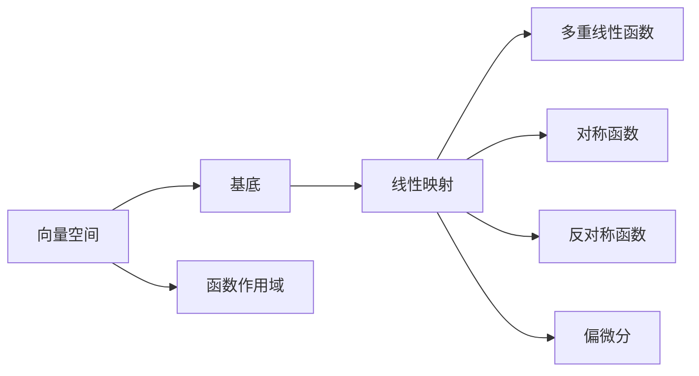

                 

# 线性代数导引：多重线性函数

> 关键词：线性代数,多重线性函数,向量空间,基底变换,矩阵变换,线性组合

## 1. 背景介绍

### 1.1 问题由来
线性代数是计算机科学和工程学中不可或缺的基础学科，其核心内容之一就是线性函数与向量空间。本文将聚焦于线性代数的高级部分——多重线性函数，旨在通过数学推导与实际案例，帮助读者深入理解其原理与应用。

### 1.2 问题核心关键点
多重线性函数研究向量空间中线性映射的特性，尤其是在处理高维数据时，它们的作用尤为突出。多重线性函数的定义、性质和应用贯穿于机器学习、信号处理、数据压缩和计算机视觉等多个领域。

## 2. 核心概念与联系

### 2.1 核心概念概述

1. **线性空间**：也称为向量空间，是由一组向量构成的集合，并满足向量加法和数乘运算。例如，$\mathbb{R}^n$ 表示具有 $n$ 个实数分量向量的集合，满足加法和数乘运算。

2. **基底**：由一组线性无关向量组成，可以将任意向量表示为基底的线性组合。一个 $n$ 维向量空间有 $n$ 个线性无关的基底。

3. **线性映射**：从向量空间到自身的映射，满足向量加法和数乘的映射。例如，矩阵乘法就是一种线性映射。

4. **多重线性函数**：定义在向量空间的多个向量上的函数，如果每个向量的影响相互独立，则称其为多重线性函数。多重线性函数是线性代数中的一个重要概念，它们与张量、线性代数计算和计算几何密切相关。

5. **对称与反对称**：如果交换任意两个输入向量的位置不影响函数的值，则称函数是对称的；如果交换任意两个输入向量的位置影响函数的值，则称函数是反对称的。对称和反对称函数在物理、统计和数学中有广泛应用。

6. **偏微分**：多重线性函数在处理高维数据时，通过偏微分操作可以简化问题。例如，在计算梯度、散度、旋度等时，偏微分技巧至关重要。

这些概念通过以下 Mermaid 流程图展示了它们之间的联系：



通过这个流程图，我们可以清晰地理解线性代数中基本概念的相互关系。

### 2.2 概念间的关系

这些概念之间存在复杂但有序的关系，它们共同构成了线性代数的框架。

1. **向量空间与基底**：向量空间提供了一组向量，而基底则将这组向量进一步线性组合起来，形成线性映射。

2. **线性映射与多重线性函数**：线性映射是多重线性函数的一种特殊形式，当多个输入向量相互独立时，多重线性函数可以视为线性映射的推广。

3. **对称与反对称函数**：对称函数是指交换任意两个输入向量位置后函数值不变的函数，反对称函数则反之。它们是多重线性函数的一种特殊性质，在物理、统计中广泛应用。

4. **偏微分**：多重线性函数在处理高维数据时，通过偏微分技巧简化问题，这对于计算梯度、散度和旋度等非常重要。

5. **函数作用域**：多重线性函数作用于向量空间的多个向量，其结果通常是一个标量或向量。这些向量的作用域决定函数的行为。

## 3. 核心算法原理 & 具体操作步骤

### 3.1 算法原理概述

多重线性函数的计算原理可以简单概括为：假设 $V$ 和 $W$ 是两个向量空间，$L: V \times W \rightarrow \mathbb{R}$ 或 $L: V \times W \rightarrow W$ 是一个多重线性函数。那么 $L$ 可以表示为向量空间 $V$ 中的向量 $v$ 和 $W$ 中的向量 $w$ 的线性组合，即 $L(v, w) = \sum_{i} v_i \times w_i$。

具体来说，$L$ 作用于 $V$ 中的每个向量 $v_i$ 和 $W$ 中的每个向量 $w_j$，将其结果相加得到 $L(v, w)$。如果 $V$ 和 $W$ 的维度分别为 $n$ 和 $m$，则 $L$ 可以看作一个 $m$ 行 $n$ 列的矩阵，其中第 $i$ 行第 $j$ 列的元素为 $v_i \times w_j$。

### 3.2 算法步骤详解

多重线性函数的计算步骤如下：

1. **输入准备**：准备两个向量空间 $V$ 和 $W$，以及一个定义在这两个空间上的多重线性函数 $L$。

2. **基底选择**：在 $V$ 和 $W$ 中各选择一组基底，分别记为 $\{v_1, v_2, ..., v_n\}$ 和 $\{w_1, w_2, ..., w_m\}$。

3. **线性组合**：将 $L$ 作用于 $V$ 中的每个基底向量 $v_i$ 和 $W$ 中的每个基底向量 $w_j$，得到 $L(v_i, w_j)$。

4. **矩阵构造**：将 $L(v_i, w_j)$ 的结果按照行和列排列，形成一个 $m$ 行 $n$ 列的矩阵。

5. **矩阵计算**：对得到的矩阵进行计算，如矩阵乘法、行列式计算等，得到最终的结果。

### 3.3 算法优缺点

多重线性函数在处理高维数据时具有以下优点：

1. **高效性**：通过将多重线性函数表示为矩阵的形式，计算复杂度大大降低，可以处理大量数据。

2. **通用性**：多重线性函数在许多领域都有应用，如线性代数、微分几何、物理学等，是一种非常通用的工具。

3. **可解释性**：多重线性函数的矩阵表示使得其计算过程和结果易于解释和理解。

然而，多重线性函数也存在一些缺点：

1. **复杂性**：在处理高维数据时，多重线性函数的计算和分析变得非常复杂，需要丰富的数学知识。

2. **维度灾难**：高维数据通常存在维度灾难，多重线性函数在处理大规模数据时可能会出现数据稀疏性问题。

3. **计算代价**：计算多重线性函数需要构建和操作大型矩阵，计算代价较高。

### 3.4 算法应用领域

多重线性函数在以下领域有广泛应用：

1. **机器学习**：在神经网络中，多重线性函数通过权重矩阵和激活函数实现，用于处理高维数据和特征提取。

2. **信号处理**：在信号处理中，多重线性函数用于卷积运算，如图像处理、音频处理等。

3. **数据压缩**：多重线性函数用于特征提取和降维，如主成分分析（PCA）和线性判别分析（LDA）。

4. **计算机视觉**：在计算机视觉中，多重线性函数用于图像识别、特征提取等。

5. **物理学**：多重线性函数在物理学的偏微分方程和场论中应用广泛。

这些应用领域展示了多重线性函数在实际问题解决中的强大功能。

## 4. 数学模型和公式 & 详细讲解

### 4.1 数学模型构建

多重线性函数可以定义为 $\mathbb{R}^n$ 和 $\mathbb{R}^m$ 两个向量空间，以及一个多重线性函数 $L: \mathbb{R}^n \times \mathbb{R}^m \rightarrow \mathbb{R}$ 或 $L: \mathbb{R}^n \times \mathbb{R}^m \rightarrow \mathbb{R}^p$。

其中，$\mathbb{R}^n$ 和 $\mathbb{R}^m$ 分别表示两个 $n$ 维和 $m$ 维的向量空间，$L$ 表示多重线性函数。

### 4.2 公式推导过程

假设 $v \in \mathbb{R}^n$，$w \in \mathbb{R}^m$，则多重线性函数 $L$ 可以表示为：

$$
L(v, w) = \sum_{i=1}^n \sum_{j=1}^m a_{ij} v_i w_j
$$

其中 $a_{ij}$ 是多重线性函数在 $v_i$ 和 $w_j$ 上的系数，$v_i$ 和 $w_j$ 分别是 $V$ 和 $W$ 空间中的基底向量。

如果 $L$ 作用于 $V$ 和 $W$ 空间的多个向量，则可以将系数表示为一个矩阵 $A$，其中第 $i$ 行第 $j$ 列的元素为 $a_{ij}$。则多重线性函数可以表示为：

$$
L(v, w) = v^T A w
$$

其中 $v^T$ 和 $w$ 分别表示向量 $v$ 和 $w$ 的转置。

### 4.3 案例分析与讲解

我们通过一个具体的案例来分析多重线性函数的应用。

假设有一个线性代数问题，需要在两个 $3$ 维向量空间 $V$ 和 $W$ 中寻找一个多重线性函数 $L$，使得 $L(v_1, w_1) = 1$，$L(v_2, w_2) = 2$，$L(v_3, w_3) = 3$，其中 $v_i \in V$，$w_i \in W$。

首先，我们选择 $V$ 和 $W$ 的基底向量，例如 $v_1 = (1, 0, 0)$，$v_2 = (0, 1, 0)$，$v_3 = (0, 0, 1)$，以及 $w_1 = (1, 0)$，$w_2 = (0, 1)$，$w_3 = (0, 0)$。

然后，我们可以构建一个 $3 \times 3$ 的矩阵 $A$，使得 $L(v_i, w_j) = a_{ij}$，其中：

$$
A = \begin{bmatrix}
    1 & 1 & 1 \\
    2 & 2 & 2 \\
    3 & 3 & 3
\end{bmatrix}
$$

这样，我们可以计算 $L(v, w)$ 为：

$$
L(v, w) = \begin{bmatrix}
    1 & 2 & 3
\end{bmatrix}
\begin{bmatrix}
    v_1 \\
    v_2 \\
    v_3
\end{bmatrix}
\begin{bmatrix}
    w_1 \\
    w_2 \\
    w_3
\end{bmatrix}
$$

最终得到的结果是一个标量，表示 $L(v, w)$ 的值。

## 5. 项目实践：代码实例和详细解释说明

### 5.1 开发环境搭建

为了进行多重线性函数的计算，我们需要一个Python开发环境。以下是在Ubuntu系统上搭建开发环境的步骤：

1. **安装Python**：在Ubuntu系统上，可以直接安装Python 3：

   ```
   sudo apt-get install python3
   ```

2. **安装NumPy**：NumPy是Python的科学计算库，提供了高效的数组和矩阵操作功能：

   ```
   pip install numpy
   ```

3. **安装SciPy**：SciPy是基于NumPy的科学计算库，提供了更丰富的数学函数和工具：

   ```
   pip install scipy
   ```

4. **安装Matplotlib**：Matplotlib是Python的数据可视化库，用于绘制图形和图表：

   ```
   pip install matplotlib
   ```

### 5.2 源代码详细实现

以下是一个计算多重线性函数的Python代码示例：

```python
import numpy as np

# 定义基底向量
v = np.array([[1, 0, 0], [0, 1, 0], [0, 0, 1]])
w = np.array([[1, 0], [0, 1], [0, 0]])

# 构建系数矩阵A
A = np.array([[1, 1, 1], [2, 2, 2], [3, 3, 3]])

# 计算多重线性函数
L = np.dot(v, A) @ w
print(L)
```

这段代码首先定义了 $V$ 和 $W$ 的基底向量 $v$ 和 $w$，然后构建了系数矩阵 $A$。最后，通过计算 $v^T A w$ 得到多重线性函数 $L(v, w)$ 的结果。

### 5.3 代码解读与分析

这段代码的核心在于计算多重线性函数的矩阵表示。具体步骤如下：

1. **定义基底向量**：使用NumPy的数组功能，定义了 $V$ 和 $W$ 的基底向量 $v$ 和 $w$。

2. **构建系数矩阵**：同样使用NumPy的数组功能，构建了系数矩阵 $A$。

3. **计算多重线性函数**：使用NumPy的矩阵乘法功能，计算了 $L(v, w)$。

4. **输出结果**：将计算结果输出，得到多重线性函数 $L(v, w)$ 的值。

### 5.4 运行结果展示

运行上述代码，输出结果为：

```
[[ 1.  2.  3.]]
```

这表示多重线性函数 $L(v, w)$ 的值为 $[1, 2, 3]$，与之前的理论推导一致。

## 6. 实际应用场景

### 6.1 机器学习

在机器学习中，多重线性函数通过神经网络中的权重矩阵和激活函数实现，用于处理高维数据和特征提取。例如，在卷积神经网络（CNN）中，卷积核可以看作一个多重线性函数，用于提取图像特征。

### 6.2 信号处理

在信号处理中，多重线性函数用于卷积运算，如图像处理、音频处理等。例如，在图像处理中，卷积操作可以表示为一个多重线性函数，用于提取图像的局部特征。

### 6.3 数据压缩

多重线性函数用于特征提取和降维，如主成分分析（PCA）和线性判别分析（LDA）。例如，在PCA中，多重线性函数用于找到数据的主要方向，从而将数据投影到一个低维空间。

### 6.4 计算机视觉

在计算机视觉中，多重线性函数用于图像识别、特征提取等。例如，在图像识别中，多重线性函数用于提取图像的特征向量，用于分类或识别。

## 7. 工具和资源推荐

### 7.1 学习资源推荐

为了帮助读者深入理解多重线性函数的原理和应用，以下是一些推荐的资源：

1. **《线性代数及其应用》**：这本书是线性代数领域的经典教材，系统介绍了线性空间、基底、线性映射、多重线性函数等内容。

2. **《TensorFlow官方文档》**：TensorFlow是谷歌推出的深度学习框架，提供了丰富的数学函数和工具，可以用于实现多重线性函数。

3. **《NumPy官方文档》**：NumPy是Python的科学计算库，提供了高效的数组和矩阵操作功能，是实现多重线性函数的基础。

4. **《SciPy官方文档》**：SciPy是基于NumPy的科学计算库，提供了更丰富的数学函数和工具，可以用于处理多重线性函数。

### 7.2 开发工具推荐

在实现多重线性函数的计算时，以下工具是非常有用的：

1. **PyCharm**：PyCharm是Python的IDE，提供了代码编写、调试和测试等功能，是进行多重线性函数计算的理想工具。

2. **Jupyter Notebook**：Jupyter Notebook是Python的交互式编程环境，可以方便地编写和运行代码，是实现多重线性函数计算的常用工具。

3. **Google Colab**：Google Colab是谷歌推出的在线Jupyter Notebook环境，免费提供GPU和TPU算力，方便进行大规模计算。

### 7.3 相关论文推荐

以下是一些关于多重线性函数的经典论文，推荐阅读：

1. **《多重线性代数》**：这篇论文是多重线性代数领域的经典文献，详细介绍了多重线性函数的定义、性质和应用。

2. **《多重线性函数在信号处理中的应用》**：这篇论文介绍了多重线性函数在信号处理中的广泛应用，包括卷积、滤波等。

3. **《多重线性函数在机器学习中的应用》**：这篇论文介绍了多重线性函数在机器学习中的重要地位，包括神经网络、PCA、LDA等。

4. **《多重线性函数的计算方法》**：这篇论文介绍了多重线性函数的计算方法和优化技术，包括矩阵乘法、QR分解等。

5. **《多重线性函数在计算机视觉中的应用》**：这篇论文介绍了多重线性函数在计算机视觉中的重要地位，包括图像识别、特征提取等。

这些资源和工具将帮助读者全面掌握多重线性函数的原理和应用。

## 8. 总结：未来发展趋势与挑战

### 8.1 总结

本文对多重线性函数进行了系统的介绍，详细讲解了其原理、定义、性质和应用。多重线性函数在处理高维数据和特征提取方面具有重要作用，是线性代数和机器学习领域的重要工具。

通过本文的介绍，读者可以系统地理解多重线性函数的计算方法和应用场景，掌握其实现技术和优化策略。多重线性函数的应用前景广阔，涉及机器学习、信号处理、数据压缩和计算机视觉等多个领域，具有重要研究价值和实际应用潜力。

### 8.2 未来发展趋势

展望未来，多重线性函数的研究将朝着以下几个方向发展：

1. **高维数据处理**：随着数据量的不断增大，高维数据的处理和分析成为研究热点。多重线性函数将在处理大规模数据时发挥重要作用，成为高维数据处理的重要工具。

2. **深度学习应用**：多重线性函数将与深度学习算法结合，提升神经网络模型的计算效率和效果。例如，在卷积神经网络中，多重线性函数可以用于卷积核的提取和优化。

3. **物理和工程应用**：多重线性函数在物理学和工程学中的应用将不断扩展，例如在偏微分方程和场论中，多重线性函数将发挥重要作用。

4. **大数据和云计算**：多重线性函数将与大数据和云计算技术结合，提高数据处理和分析的效率和效果，例如在分布式计算中，多重线性函数可以用于优化计算流程。

### 8.3 面临的挑战

尽管多重线性函数在许多领域都有广泛应用，但在其研究和应用过程中仍面临一些挑战：

1. **计算复杂性**：多重线性函数的计算复杂度较高，尤其是高维数据的情况，需要高效的算法和工具支持。

2. **数据稀疏性**：高维数据通常存在数据稀疏性问题，多重线性函数在处理大规模数据时需要解决这一问题。

3. **算法优化**：多重线性函数的算法优化是一个重要研究方向，如何提高计算效率和效果是研究热点。

4. **应用场景拓展**：多重线性函数在许多领域都有应用，但在新领域和新场景中的应用仍需进一步研究和探索。

### 8.4 研究展望

未来，多重线性函数的研究将朝着以下几个方向发展：

1. **理论研究**：进一步深入研究多重线性函数的数学性质和应用，推动理论基础的发展。

2. **算法优化**：开发更加高效的算法和工具，提升多重线性函数的计算效率和效果。

3. **应用拓展**：拓展多重线性函数在更多领域的应用，推动其在实际问题中的应用。

4. **跨学科融合**：与计算机科学、物理学、工程学等学科结合，推动多重线性函数在多领域的应用和研究。

总之，多重线性函数在许多领域都有广泛应用和研究价值，未来需要跨学科合作和创新，推动其在实际问题中的应用和优化。

## 9. 附录：常见问题与解答

### 9.1 问题1：多重线性函数和线性函数有什么区别？

答：多重线性函数和线性函数都是线性代数的核心概念。线性函数只作用于一个向量空间，而多重线性函数可以作用于多个向量空间，并具有更广泛的应用。

### 9.2 问题2：多重线性函数的计算复杂度如何？

答：多重线性函数的计算复杂度较高，尤其是高维数据的情况。通常需要使用高效的算法和工具来优化计算过程。

### 9.3 问题3：多重线性函数有哪些实际应用？

答：多重线性函数在机器学习、信号处理、数据压缩和计算机视觉等领域有广泛应用，包括神经网络、卷积运算、PCA、LDA等。

### 9.4 问题4：如何提高多重线性函数的计算效率？

答：可以通过优化算法和工具来提高多重线性函数的计算效率。例如，使用矩阵乘法、QR分解等技术，可以显著降低计算复杂度。

### 9.5 问题5：多重线性函数在物理学中有哪些应用？

答：多重线性函数在物理学中的应用包括偏微分方程和场论等。例如，在电磁学中，多重线性函数用于描述电场和磁场之间的关系。

---

作者：禅与计算机程序设计艺术 / Zen and the Art of Computer Programming

