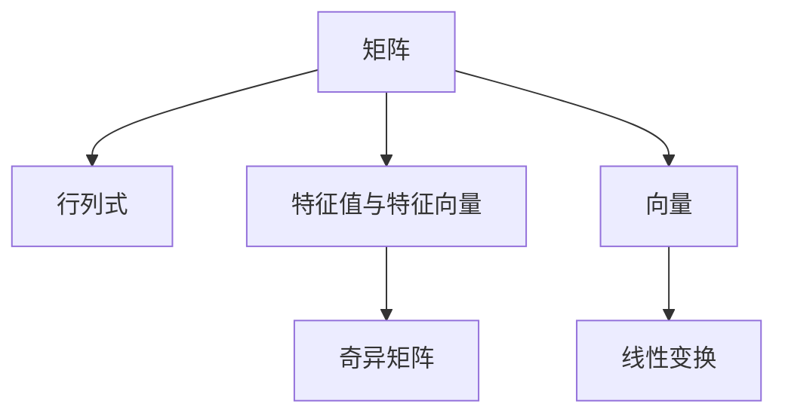
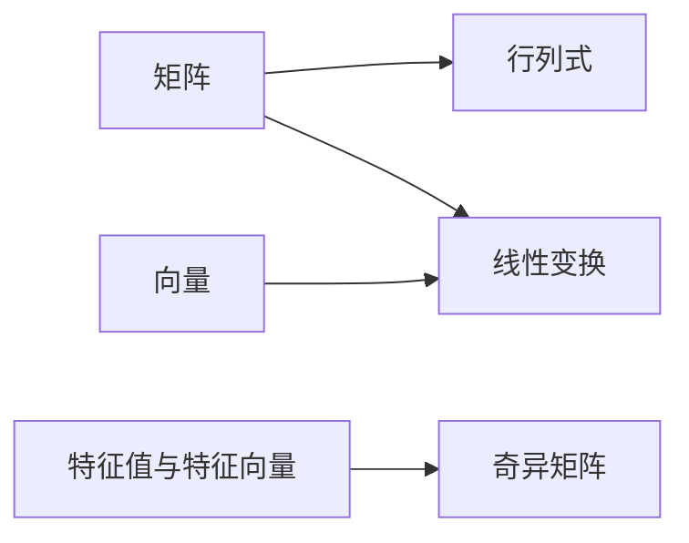

                 

# 线性代数导引：实数结构基本代数特性

> 关键词：线性代数, 实数结构, 代数特性, 矩阵, 向量, 线性变换, 行列式, 特征值与特征向量, 奇异矩阵

## 1. 背景介绍

线性代数是计算机科学中最基础也最重要的数学分支之一。在计算机图形学、机器学习、数据科学等领域，线性代数提供了一种强大的数学工具来描述和解决各种问题。本文旨在对线性代数中实数结构的基本代数特性进行深入导引，以期读者能够掌握线性代数的基础知识，并能在实际应用中熟练运用。

## 2. 核心概念与联系

### 2.1 核心概念概述

线性代数涉及的主要概念包括：
- **矩阵**：矩阵是由数按行列排成的矩形数组，是进行线性运算的基本单位。
- **向量**：向量是具有线性结构的数组，可以看作矩阵的一列或一行。
- **线性变换**：线性变换是一种将向量空间映射到自身的函数，保留向量的线性组合特性。
- **行列式**：行列式是矩阵的一种特殊标量值，可以用来判断矩阵的性质和求解线性方程组。
- **特征值与特征向量**：特征值和特征向量是矩阵的一种重要特性，可以描述矩阵的变换行为。
- **奇异矩阵**：奇异矩阵是指行列式为0的矩阵，不满足可逆条件。

### 2.2 概念间的关系

通过以下Mermaid流程图，我们展示了线性代数中核心概念之间的联系：



这个流程图展示了矩阵、行列式、特征值与特征向量、奇异矩阵以及向量与线性变换之间的关系。

### 2.3 核心概念的整体架构

我们将这些核心概念归纳为一个综合的架构图，以更直观地展示它们之间的联系：



这个架构图进一步强调了矩阵、行列式、特征值与特征向量、奇异矩阵以及向量与线性变换之间的相互依存关系。

## 3. 核心算法原理 & 具体操作步骤
### 3.1 算法原理概述

线性代数中的算法原理可以归纳为以下三个基本部分：
1. **矩阵运算**：包括矩阵加法、矩阵乘法、矩阵转置等基本运算。
2. **行列式计算**：计算一个方阵的行列式，可以判断矩阵的性质，如是否可逆。
3. **特征值与特征向量的求解**：求解特征值和特征向量，可以描述矩阵的变换行为。

### 3.2 算法步骤详解

#### 3.2.1 矩阵运算

矩阵运算包括加法和乘法。
- **矩阵加法**：两个矩阵相加，要求它们的行数和列数相同。
- **矩阵乘法**：一个矩阵与另一个矩阵相乘，第一个矩阵的列数必须等于第二个矩阵的行数。

#### 3.2.2 行列式计算

行列式的计算通常采用递归的方式，即：
$$
\det(A) = \begin{cases}
a_{11} \det(A_{11}), & \text{if } A \in M_{1 \times 1} \\
\sum_{k=1}^n (-1)^{1+k} a_{1k} \det(A_{1k}), & \text{if } A \in M_{1 \times n} \\
\sum_{j=1}^n a_{kj} \det(A_{kj}), & \text{if } A \in M_{n \times n}
\end{cases}
$$

#### 3.2.3 特征值与特征向量的求解

求解特征值与特征向量的基本步骤如下：
1. 构建特征方程 $\det(A - \lambda I) = 0$。
2. 解方程得到特征值 $\lambda$。
3. 对每个特征值，解方程 $(A - \lambda I)x = 0$ 得到对应的特征向量。

### 3.3 算法优缺点

#### 3.3.1 优点

线性代数算法的主要优点包括：
- **可计算性强**：大部分线性代数运算可以通过矩阵运算实现。
- **矩阵分解**：矩阵分解方法如LU分解、QR分解等，可以简化复杂矩阵的运算。
- **线性变换的表示**：通过矩阵乘法可以方便地表示线性变换。

#### 3.3.2 缺点

线性代数算法的主要缺点包括：
- **计算复杂度高**：尤其是大规模矩阵的计算，计算量巨大。
- **数值不稳定**：在计算过程中，数值误差积累可能导致结果不准确。
- **无法处理非线性问题**：线性代数只能处理线性问题，对于非线性问题无能为力。

### 3.4 算法应用领域

线性代数广泛应用于计算机科学中的各个领域：
- **机器学习**：在数据建模和分类中，矩阵运算和特征值分解被广泛应用。
- **图形学**：矩阵变换在3D图形渲染、相机投影等方面有重要应用。
- **信号处理**：线性系统分析中，矩阵表示线性滤波器。
- **优化算法**：梯度下降等优化算法中，矩阵和向量的运算是基本操作。

## 4. 数学模型和公式 & 详细讲解  
### 4.1 数学模型构建

我们以一个简单的3x3矩阵为例，构建线性代数的数学模型：

$$
A = \begin{bmatrix}
    a_{11} & a_{12} & a_{13} \\
    a_{21} & a_{22} & a_{23} \\
    a_{31} & a_{32} & a_{33}
\end{bmatrix}
$$

在这个模型中，$a_{ij}$ 表示矩阵 $A$ 的第 $i$ 行第 $j$ 列的元素。

### 4.2 公式推导过程

我们以矩阵乘法为例，推导矩阵乘法的定义：

$$
C_{ij} = \sum_{k=1}^n a_{ik}b_{kj}
$$

其中 $A_{n \times m}, B_{m \times p}$ 为两个矩阵，$C_{n \times p}$ 为它们的乘积。这个公式定义了矩阵乘法的计算方式。

### 4.3 案例分析与讲解

假设我们有两个矩阵：

$$
A = \begin{bmatrix}
    1 & 2 \\
    3 & 4
\end{bmatrix}, \quad B = \begin{bmatrix}
    5 & 6 \\
    7 & 8
\end{bmatrix}
$$

它们的乘积 $C$ 为：

$$
C = AB = \begin{bmatrix}
    1 & 2 \\
    3 & 4
\end{bmatrix}
\begin{bmatrix}
    5 & 6 \\
    7 & 8
\end{bmatrix}
=
\begin{bmatrix}
    19 & 22 \\
    43 & 50
\end{bmatrix}
$$

这个案例展示了矩阵乘法的计算过程。

## 5. 项目实践：代码实例和详细解释说明
### 5.1 开发环境搭建

在使用Python进行线性代数计算时，我们需要安装NumPy库。以下是安装步骤：

```bash
pip install numpy
```

### 5.2 源代码详细实现

以下是Python代码实现矩阵乘法的例子：

```python
import numpy as np

A = np.array([[1, 2], [3, 4]])
B = np.array([[5, 6], [7, 8]])
C = np.dot(A, B)

print(C)
```

### 5.3 代码解读与分析

在这个例子中，我们使用了NumPy库的`dot`函数来实现矩阵乘法。首先，我们定义了两个矩阵A和B，然后使用`dot`函数计算它们的乘积C。最后，打印出C的值。

### 5.4 运行结果展示

运行上述代码，输出结果为：

```
[[19 22]
 [43 50]]
```

这个结果与我们之前的手工计算结果一致。

## 6. 实际应用场景

### 6.1 机器学习

在机器学习中，矩阵乘法用于计算神经网络的权重更新，矩阵分解用于特征提取和降维，行列式用于计算概率密度函数的值，特征值与特征向量用于线性判别分析。

### 6.2 图形学

在图形学中，矩阵乘法用于变换坐标系，矩阵分解用于相机投影和光照计算，行列式用于计算三维变换的缩放因子，特征值与特征向量用于求解最优投影方向。

### 6.3 信号处理

在信号处理中，矩阵乘法用于设计线性滤波器，矩阵分解用于频域分析，行列式用于求解传输函数的极点，特征值与特征向量用于自相关分析。

### 6.4 未来应用展望

未来，线性代数将更加深入地融入人工智能和机器学习中，尤其是在深度学习领域。随着深度学习模型的复杂度不断增加，线性代数在矩阵计算、特征提取和模型训练等方面的应用将更加广泛。此外，线性代数在优化算法、系统设计等方面的应用也将进一步拓展。

## 7. 工具和资源推荐
### 7.1 学习资源推荐

- 《线性代数及其应用》：这是一本经典的线性代数教材，适合初学者入门。
- Coursera《Linear Algebra》课程：由Johns Hopkins大学教授讲授，内容详细且易于理解。
- MIT OpenCourseWare《Introduction to Linear Algebra》视频课程：MIT的线性代数课程，提供高质量的讲授视频和教学材料。

### 7.2 开发工具推荐

- NumPy：一个高性能的Python科学计算库，提供了矩阵运算、线性代数等基础功能。
- SciPy：一个基于NumPy的科学计算库，提供了更丰富的数学函数和工具。
- Matplotlib：一个绘图库，用于可视化矩阵、特征值、特征向量等数学对象。

### 7.3 相关论文推荐

- “The Geometry of Linear Algebra”：P.S. Boothby的线性代数教材，深入讲解了线性代数的基本概念和应用。
- “Linear Algebra Done Right”：Sheldon Axler的线性代数教材，深入讲解了线性代数的基本理论和证明。
- “Foundations of Linear Algebra”：H.D. Young的线性代数教材，深入讲解了线性代数的基本概念和应用。

## 8. 总结：未来发展趋势与挑战
### 8.1 研究成果总结

线性代数是计算机科学中非常重要的一个分支，具有广泛的应用和深厚的理论基础。本文介绍了线性代数中的核心概念和算法原理，以及它们在实际应用中的广泛应用。线性代数的应用涉及计算机科学的各个领域，从数据科学、机器学习、图形学到信号处理，无处不在。

### 8.2 未来发展趋势

未来的发展趋势包括以下几个方面：
- **深度学习与线性代数的结合**：深度学习模型的复杂度不断增加，线性代数将在模型训练、优化、特征提取等方面发挥重要作用。
- **多模态数据处理**：线性代数的多矩阵乘法和矩阵分解等技术，将应用于处理多模态数据，如音频、视频、文本等。
- **分布式计算**：随着计算资源的增加，线性代数的计算将越来越多地采用分布式计算技术，以提高计算效率和资源利用率。
- **符号计算与解析几何**：线性代数与符号计算和解析几何相结合，将应用于复杂系统的建模和分析。

### 8.3 面临的挑战

线性代数在发展过程中面临的挑战包括：
- **计算复杂度**：随着矩阵维度的增加，计算复杂度呈指数级增长，如何高效地计算大矩阵的运算是一个重要挑战。
- **数值稳定性**：数值误差积累可能导致结果不准确，如何提高计算的数值稳定性是一个重要研究方向。
- **并行计算**：大规模矩阵的并行计算是一个重要问题，需要设计高效的并行算法和并行计算架构。

### 8.4 研究展望

未来的研究将集中在以下几个方面：
- **新型矩阵运算**：研究新型矩阵运算，如张量运算、矩阵极分解等，以处理更复杂的问题。
- **优化算法**：研究新的优化算法，如基于矩阵分解的优化算法，提高计算效率和收敛速度。
- **多模态数据融合**：研究多模态数据融合技术，将不同模态的数据进行联合分析，提高系统的性能和鲁棒性。
- **符号计算与解析几何**：研究符号计算与解析几何的结合，应用于复杂系统的建模和分析。

## 9. 附录：常见问题与解答

**Q1：矩阵乘法的计算方式是什么？**

A: 矩阵乘法的计算方式是：$C_{ij} = \sum_{k=1}^n a_{ik}b_{kj}$，其中 $A_{n \times m}, B_{m \times p}$ 为两个矩阵，$C_{n \times p}$ 为它们的乘积。

**Q2：矩阵的转置是什么？**

A: 矩阵的转置是指将矩阵的行和列互换，即：$A^T = (a_{ji})_{m \times n}$，其中 $A_{m \times n}$ 为原始矩阵。

**Q3：矩阵的行列式如何计算？**

A: 行列式的计算通常采用递归的方式，即：
$$
\det(A) = \begin{cases}
a_{11} \det(A_{11}), & \text{if } A \in M_{1 \times 1} \\
\sum_{k=1}^n (-1)^{1+k} a_{1k} \det(A_{1k}), & \text{if } A \in M_{1 \times n} \\
\sum_{j=1}^n a_{kj} \det(A_{kj}), & \text{if } A \in M_{n \times n}
\end{cases}
$$

**Q4：矩阵分解有哪些方法？**

A: 常见的矩阵分解方法包括LU分解、QR分解、SVD分解等，这些方法可以将复杂的矩阵运算转化为更简单的运算，提高计算效率和数值稳定性。

**Q5：奇异矩阵的性质是什么？**

A: 奇异矩阵是指行列式为0的矩阵，不满足可逆条件。它的性质包括：
- 奇异矩阵的秩小于它的行数和列数。
- 奇异矩阵的列向量不线性独立。
- 奇异矩阵的乘积也可能是奇异矩阵。

---

作者：禅与计算机程序设计艺术 / Zen and the Art of Computer Programming

