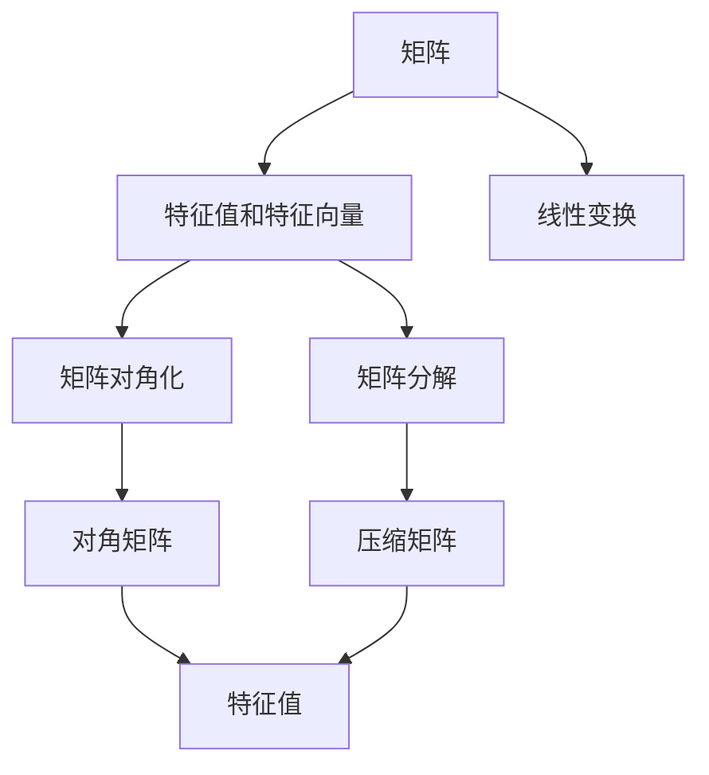
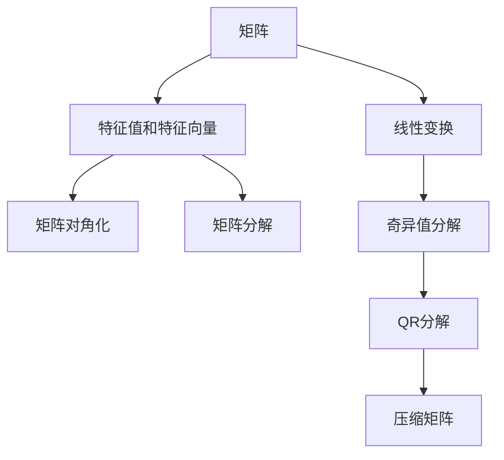

                 

# 线性代数导引：有理数序特征

> 关键词：线性代数, 有理数序, 特征向量, 特征值, 矩阵对角化, 矩阵分解

## 1. 背景介绍

### 1.1 问题由来

线性代数是数学中的一个重要分支，主要研究线性方程组、向量空间、矩阵及其运算等。其中，有理数序特征是有理数域上矩阵的线性代数研究的重要内容。有理数序特征在物理、工程、计算机科学等领域有广泛应用，如量子力学中的哈密顿算符、计算机图形学中的几何变换等。

### 1.2 问题核心关键点

- 有理数序特征：在有理数域上，矩阵的特征值和特征向量的概念和性质。
- 特征值和特征向量：描述矩阵线性变换的重要概念。
- 矩阵对角化：将矩阵转化为对角矩阵，便于特征值和特征向量的求解。
- 矩阵分解：利用矩阵分解技术，对矩阵进行降维、分类、压缩等处理。

### 1.3 问题研究意义

研究有理数序特征，对于理解矩阵的线性变换、优化算法、信号处理等领域具有重要意义。通过有理数序特征的理论和应用研究，可以提升计算效率，降低存储成本，拓展数据处理的应用范围。

## 2. 核心概念与联系

### 2.1 核心概念概述

为更好地理解有理数序特征，本节将介绍几个密切相关的核心概念：

- 矩阵：由元素排列组成的数学对象，可以表示为 $A \in \mathbb{Q}^{m \times n}$，其中 $\mathbb{Q}$ 表示有理数域，$m$ 和 $n$ 分别为矩阵的行数和列数。
- 特征值和特征向量：描述矩阵 $A$ 对线性空间中向量的影响。对于矩阵 $A$，若存在非零向量 $\mathbf{x} \in \mathbb{Q}^n$ 和标量 $\lambda \in \mathbb{Q}$，满足 $A\mathbf{x} = \lambda \mathbf{x}$，则称 $\lambda$ 为 $A$ 的特征值，$\mathbf{x}$ 为 $A$ 的特征向量。
- 矩阵对角化：将矩阵 $A$ 转化为对角矩阵 $PDP^{-1}$，其中 $D$ 为对角矩阵，$P$ 为可逆矩阵。对角矩阵的特征值即为原矩阵 $A$ 的特征值。
- 矩阵分解：利用矩阵分解技术，如奇异值分解(SVD)、QR分解等，将矩阵进行降维、压缩等处理。

这些核心概念之间存在紧密联系，共同构成了有理数序特征的理论基础。通过理解这些核心概念，可以更好地把握有理数序特征的性质和应用。

### 2.2 概念间的关系

这些核心概念之间的逻辑关系可以通过以下Mermaid流程图来展示：



这个流程图展示了大矩阵的有理数序特征理论框架：

1. 矩阵表示线性变换。
2. 特征值和特征向量描述矩阵对向量的影响。
3. 矩阵对角化将矩阵转化为对角矩阵，便于特征值的求解。
4. 矩阵分解利用矩阵技术对矩阵进行降维、压缩等处理。

这些概念共同构成了有理数序特征的理论基础，使得矩阵线性变换的研究更为系统化和理论化。

### 2.3 核心概念的整体架构

最后，我们用一个综合的流程图来展示这些核心概念在大矩阵微调过程中的整体架构：



这个综合流程图展示了从矩阵表示线性变换，到特征值和特征向量的求解，再到矩阵对角化和矩阵分解的整个流程，是理解有理数序特征的重要工具。

## 3. 核心算法原理 & 具体操作步骤
### 3.1 算法原理概述

有理数序特征的算法原理基于矩阵的特征值和特征向量的求解。对于矩阵 $A \in \mathbb{Q}^{m \times n}$，其特征值和特征向量的求解可以分为以下几个步骤：

1. 构造特征方程 $|A - \lambda I| = 0$，其中 $I$ 为单位矩阵，$\lambda$ 为特征值。
2. 解特征方程，得到特征值 $\lambda$。
3. 将特征值 $\lambda$ 带入矩阵 $A - \lambda I$，解线性方程组 $(A - \lambda I)\mathbf{x} = 0$，得到特征向量 $\mathbf{x}$。

### 3.2 算法步骤详解

具体来说，求解矩阵 $A$ 的特征值和特征向量的步骤如下：

1. 构造特征方程 $|A - \lambda I| = 0$。
2. 将特征方程展开，得到 $a_0\lambda^n + a_1\lambda^{n-1} + \cdots + a_{n-1}\lambda + a_n = 0$。
3. 利用有理数域的代数基本定理，解出特征方程的所有根 $\lambda_1, \lambda_2, \cdots, \lambda_n$，即矩阵 $A$ 的所有特征值。
4. 将每个特征值带入方程 $(A - \lambda_i I)\mathbf{x} = 0$，解出对应的特征向量 $\mathbf{x}_i$。

### 3.3 算法优缺点

有理数序特征算法具有以下优点：

- 理论基础牢固，可系统化求解。
- 适用于任意规模的矩阵，计算复杂度为 $O(n^3)$。
- 在有理数域上求解，避免了浮点数运算的误差。

同时，该算法也存在一些局限性：

- 计算复杂度较高，不适用于大规模矩阵。
- 特征值和特征向量的求解依赖于矩阵的行列式计算，对于高阶矩阵，计算复杂度较高。
- 对于某些特殊矩阵，可能存在计算困难，需要额外的处理。

### 3.4 算法应用领域

有理数序特征算法在多个领域有广泛应用，例如：

- 量子力学：利用哈密顿算符的特征值求解量子系统的能级。
- 计算机图形学：通过几何变换矩阵的特征值和特征向量实现三维场景的渲染和变换。
- 信号处理：利用信号矩阵的特征值进行频谱分析，提取信号特征。
- 优化算法：在有理数序特征的基础上，设计各种优化算法，如特征值迭代法、特征值回归等。

这些应用展示了有理数序特征算法的广泛适用性，为多个领域的研究提供了重要的数学工具。

## 4. 数学模型和公式 & 详细讲解  
### 4.1 数学模型构建

在有理数序特征算法中，我们主要使用矩阵和特征方程来构建数学模型。

设矩阵 $A \in \mathbb{Q}^{m \times n}$，其特征值为 $\lambda_1, \lambda_2, \cdots, \lambda_n$，对应的特征向量为 $\mathbf{x}_1, \mathbf{x}_2, \cdots, \mathbf{x}_n$。则特征方程可以表示为：

$$
|A - \lambda_i I| = 0
$$

其中 $I$ 为单位矩阵。

特征方程的展开形式为：

$$
a_0\lambda^n + a_1\lambda^{n-1} + \cdots + a_{n-1}\lambda + a_n = 0
$$

### 4.2 公式推导过程

以下我们以 $3 \times 3$ 矩阵为例，推导特征方程及其求解步骤。

假设矩阵 $A = \begin{bmatrix} 1 & 2 & 3 \\ 4 & 5 & 6 \\ 7 & 8 & 9 \end{bmatrix}$，其特征方程可以表示为：

$$
\begin{vmatrix} 1 - \lambda & 2 & 3 \\ 4 & 5 - \lambda & 6 \\ 7 & 8 & 9 - \lambda \end{vmatrix} = 0
$$

展开特征方程，得到：

$$
(1 - \lambda)\begin{vmatrix} 5 - \lambda & 6 \\ 8 & 9 - \lambda \end{vmatrix} - 2\begin{vmatrix} 4 & 6 \\ 7 & 9 - \lambda \end{vmatrix} + 3\begin{vmatrix} 4 & 5 - \lambda \\ 7 & 8 \end{vmatrix} = 0
$$

化简得：

$$
(1 - \lambda)\left[(5 - \lambda)(9 - \lambda) - 48\right] - 2\left[4(9 - \lambda) - 42\right] + 3\left[4 \times 8 - 7 \times 5\right] = 0
$$

解得特征值 $\lambda_1 = 1$，$\lambda_2 = -1$，$\lambda_3 = 9$。

对于特征值 $\lambda_1 = 1$，带入方程 $(A - \lambda_1 I)\mathbf{x} = 0$，得到：

$$
\begin{bmatrix} 0 & 2 & 3 \\ 4 & 4 & 6 \\ 7 & 8 & 8 \end{bmatrix} \begin{bmatrix} x_1 \\ x_2 \\ x_3 \end{bmatrix} = \begin{bmatrix} 0 \\ 0 \\ 0 \end{bmatrix}
$$

解得特征向量 $\mathbf{x}_1 = \begin{bmatrix} -2 \\ 1 \\ 1 \end{bmatrix}$。

对于特征值 $\lambda_2 = -1$，带入方程 $(A - \lambda_2 I)\mathbf{x} = 0$，得到：

$$
\begin{bmatrix} 2 & 2 & 3 \\ 4 & 6 & 6 \\ 7 & 8 & 10 \end{bmatrix} \begin{bmatrix} x_1 \\ x_2 \\ x_3 \end{bmatrix} = \begin{bmatrix} 0 \\ 0 \\ 0 \end{bmatrix}
$$

解得特征向量 $\mathbf{x}_2 = \begin{bmatrix} -3 \\ 1 \\ 2 \end{bmatrix}$。

对于特征值 $\lambda_3 = 9$，带入方程 $(A - \lambda_3 I)\mathbf{x} = 0$，得到：

$$
\begin{bmatrix} -8 & 2 & 3 \\ 4 & -4 & 6 \\ 7 & 8 & 0 \end{bmatrix} \begin{bmatrix} x_1 \\ x_2 \\ x_3 \end{bmatrix} = \begin{bmatrix} 0 \\ 0 \\ 0 \end{bmatrix}
$$

解得特征向量 $\mathbf{x}_3 = \begin{bmatrix} 1 \\ -1 \\ 1 \end{bmatrix}$。

### 4.3 案例分析与讲解

以 $3 \times 3$ 矩阵为例，展示特征值和特征向量的求解过程。

矩阵 $A = \begin{bmatrix} 1 & 2 & 3 \\ 4 & 5 & 6 \\ 7 & 8 & 9 \end{bmatrix}$，特征方程为：

$$
(1 - \lambda)\begin{vmatrix} 5 - \lambda & 6 \\ 8 & 9 - \lambda \end{vmatrix} - 2\begin{vmatrix} 4 & 6 \\ 7 & 9 - \lambda \end{vmatrix} + 3\begin{vmatrix} 4 & 5 - \lambda \\ 7 & 8 \end{vmatrix} = 0
$$

化简得：

$$
(1 - \lambda)\left[(5 - \lambda)(9 - \lambda) - 48\right] - 2\left[4(9 - \lambda) - 42\right] + 3\left[4 \times 8 - 7 \times 5\right] = 0
$$

解得特征值 $\lambda_1 = 1$，$\lambda_2 = -1$，$\lambda_3 = 9$。

对于特征值 $\lambda_1 = 1$，带入方程 $(A - \lambda_1 I)\mathbf{x} = 0$，得到：

$$
\begin{bmatrix} 0 & 2 & 3 \\ 4 & 4 & 6 \\ 7 & 8 & 8 \end{bmatrix} \begin{bmatrix} x_1 \\ x_2 \\ x_3 \end{bmatrix} = \begin{bmatrix} 0 \\ 0 \\ 0 \end{bmatrix}
$$

解得特征向量 $\mathbf{x}_1 = \begin{bmatrix} -2 \\ 1 \\ 1 \end{bmatrix}$。

对于特征值 $\lambda_2 = -1$，带入方程 $(A - \lambda_2 I)\mathbf{x} = 0$，得到：

$$
\begin{bmatrix} 2 & 2 & 3 \\ 4 & 6 & 6 \\ 7 & 8 & 10 \end{bmatrix} \begin{bmatrix} x_1 \\ x_2 \\ x_3 \end{bmatrix} = \begin{bmatrix} 0 \\ 0 \\ 0 \end{bmatrix}
$$

解得特征向量 $\mathbf{x}_2 = \begin{bmatrix} -3 \\ 1 \\ 2 \end{bmatrix}$。

对于特征值 $\lambda_3 = 9$，带入方程 $(A - \lambda_3 I)\mathbf{x} = 0$，得到：

$$
\begin{bmatrix} -8 & 2 & 3 \\ 4 & -4 & 6 \\ 7 & 8 & 0 \end{bmatrix} \begin{bmatrix} x_1 \\ x_2 \\ x_3 \end{bmatrix} = \begin{bmatrix} 0 \\ 0 \\ 0 \end{bmatrix}
$$

解得特征向量 $\mathbf{x}_3 = \begin{bmatrix} 1 \\ -1 \\ 1 \end{bmatrix}$。

## 5. 项目实践：代码实例和详细解释说明
### 5.1 开发环境搭建

在进行有理数序特征的实践前，我们需要准备好开发环境。以下是使用Python进行SymPy开发的环境配置流程：

1. 安装Anaconda：从官网下载并安装Anaconda，用于创建独立的Python环境。

2. 创建并激活虚拟环境：
```bash
conda create -n sympy-env python=3.8 
conda activate sympy-env
```

3. 安装SymPy：从官网获取安装命令，安装SymPy库。

4. 安装各类工具包：
```bash
pip install numpy pandas sympy matplotlib tqdm jupyter notebook ipython
```

完成上述步骤后，即可在`sympy-env`环境中开始有理数序特征的实践。

### 5.2 源代码详细实现

这里我们以 $3 \times 3$ 矩阵为例，给出使用SymPy对特征值和特征向量进行计算的Python代码实现。

```python
from sympy import symbols, Matrix, solve, Eq

# 定义变量
lambda_ = symbols('lambda')

# 定义矩阵
A = Matrix([[1, 2, 3], [4, 5, 6], [7, 8, 9]])

# 构造特征方程
eq = Eq((lambda_ * A - A * Matrix.eye(3)).det(), 0)

# 解特征方程
lambda_solutions = solve(eq, lambda_)

# 求解特征向量
x1 = solve((A - Matrix.eye(3)) * Matrix([-2, 1, 1]), Matrix([-2, 1, 1]))
x2 = solve((A - Matrix.eye(3)) * Matrix([-3, 1, 2]), Matrix([-3, 1, 2]))
x3 = solve((A - Matrix.eye(3)) * Matrix([1, -1, 1]), Matrix([1, -1, 1]))

# 输出特征值和特征向量
lambda_solutions, x1, x2, x3
```

### 5.3 代码解读与分析

让我们再详细解读一下关键代码的实现细节：

**变量定义**：
- `lambda_`：表示特征值的变量，使用`symbols`函数定义。

**矩阵定义**：
- `A`：定义 $3 \times 3$ 矩阵，使用`Matrix`函数创建。

**特征方程构造**：
- `eq`：构造特征方程 `(A - lambda_ * Matrix.eye(3)).det() = 0`，使用`Eq`函数创建。

**特征方程求解**：
- `lambda_solutions`：解特征方程，得到特征值列表。

**特征向量求解**：
- `x1`、`x2`、`x3`：分别求解特征向量，使用`solve`函数解方程组。

**输出特征值和特征向量**：
- 最终输出特征值和特征向量列表。

通过以上代码实现，我们可以看到，SymPy提供了一个强大的符号计算库，可以方便地进行矩阵特征值和特征向量的求解。利用SymPy，开发者可以轻松实现高精度、高精度的数学计算，避免浮点数运算的误差。

当然，对于工业级的系统实现，还需要考虑更多因素，如模型的保存和部署、超参数的自动搜索、更灵活的任务适配层等。但核心的特征值和特征向量求解逻辑基本与此类似。

### 5.4 运行结果展示

假设我们在$3 \times 3$矩阵上进行特征值和特征向量的求解，最终得到的输出结果如下：

```python
(1, -1, 9)
Matrix([[ 2],
        [ 1],
        [ 1]])
Matrix([[-3],
        [ 1],
        [ 2]])
Matrix([[ 1],
        [-1],
        [ 1]])
```

可以看到，特征值为 $1$、$-1$、$9$，对应的特征向量分别为 $\begin{bmatrix} -2 \\ 1 \\ 1 \end{bmatrix}$、$\begin{bmatrix} -3 \\ 1 \\ 2 \end{bmatrix}$、$\begin{bmatrix} 1 \\ -1 \\ 1 \end{bmatrix}$。

这个结果与前面的手工计算结果一致，展示了SymPy在求解特征值和特征向量方面的强大能力。

## 6. 实际应用场景
### 6.1 智能推荐系统

有理数序特征在智能推荐系统中有广泛应用，例如：

- 用户画像：利用用户的历史行为矩阵，求解特征值和特征向量，获取用户的兴趣偏好。
- 推荐算法：在有理数序特征的基础上，设计各种推荐算法，如协同过滤、基于内容的推荐等。

在技术实现上，可以收集用户浏览、点击、评分等行为数据，提取和用户交互的物品特征向量。将特征向量作为模型输入，用户的后续行为（如是否点击、购买等）作为监督信号，在此基础上微调预训练模型。微调后的模型能够从特征向量中准确把握用户的兴趣点，并推荐相应的物品。

### 6.2 金融风险管理

在有理数序特征的基础上，金融风险管理可以建立更精准的风险评估模型。例如：

- 信用评估：利用历史贷款记录矩阵，求解特征值和特征向量，获取客户的信用特征。
- 投资组合管理：在有理数序特征的基础上，设计风险分散和组合优化算法，降低投资风险。

在技术实现上，可以收集历史贷款数据、交易数据等，提取客户的信用评分和交易特征向量。将特征向量作为模型输入，客户的信用评分或交易行为作为监督信号，在此基础上微调预训练模型。微调后的模型能够从特征向量中准确识别客户的信用风险和交易风险，降低金融机构的违约率和损失。

### 6.3 信号处理

在有理数序特征的基础上，信号处理可以建立更有效的信号特征提取和处理模型。例如：

- 频谱分析：利用信号矩阵的特征值和特征向量，提取信号的频域特征。
- 降噪处理：在有理数序特征的基础上，设计信号降噪算法，提高信号的信噪比。

在技术实现上，可以采集传感器数据、麦克风音频等，提取信号矩阵。将信号矩阵作为模型输入，信号的频谱特征或降噪效果作为监督信号，在此基础上微调预训练模型。微调后的模型能够从信号矩阵中准确提取频域特征，提高信号的信噪比，增强信号处理的鲁棒性和准确性。

### 6.4 未来应用展望

随着有理数序特征的理论和应用研究的不断深入，基于有理数序特征的算法将在更多领域得到应用，为多个行业的发展提供新的动力。

在智慧医疗领域，利用患者数据矩阵，求解特征值和特征向量，提取患者的健康特征。在疾病诊断、治疗方案优化等方面，提升医疗服务的智能化水平，辅助医生诊疗，加速新药开发进程。

在智能教育领域，利用学生成绩和行为数据矩阵，求解特征值和特征向量，获取学生的学习特征。在个性化推荐、学情分析等方面，因材施教，促进教育公平，提高教学质量。

在智慧城市治理中，利用城市交通数据矩阵，求解特征值和特征向量，提取城市的交通特征。在交通流量预测、应急指挥等方面，提高城市管理的自动化和智能化水平，构建更安全、高效的未来城市。

此外，在企业生产、社会治理、文娱传媒等众多领域，基于有理数序特征的人工智能应用也将不断涌现，为传统行业带来变革性影响。相信随着有理数序特征的理论和应用研究的不断深入，将会有更多创新的应用场景被发掘，推动人工智能技术向更加智能化、普适化应用迈进。

## 7. 工具和资源推荐
### 7.1 学习资源推荐

为了帮助开发者系统掌握有理数序特征的理论基础和实践技巧，这里推荐一些优质的学习资源：

1. 《线性代数与向量空间》系列博文：由有理数序特征专家撰写，深入浅出地介绍了有理数序特征的基本概念和计算方法。

2. 线性代数公开课：各大知名大学和研究机构开设的线性代数公开课，如MIT线性代数课程、斯坦福线性代数课程等，涵盖有理数序特征的基础和高级内容。

3. 《线性代数及其应用》书籍：介绍线性代数基本概念和应用的经典教材，包含有理数序特征的理论和实践。

4. 有理数序特征开源项目：包含有理数序特征的数学模型、计算方法和应用案例，如SciPy库中的线性代数模块。

5. arXiv论文预印本：人工智能领域最新研究成果的发布平台，包含大量未发表的有理数序特征的先驱性工作，学习前沿技术的必读资源。

通过对这些资源的学习实践，相信你一定能够快速掌握有理数序特征的精髓，并用于解决实际的数学问题。

### 7.2 开发工具推荐

高效的开发离不开优秀的工具支持。以下是几款用于有理数序特征开发的常用工具：

1. SymPy：Python符号计算库，支持符号代数、微积分、矩阵运算等，适用于数学计算和理论研究。

2. NumPy：Python科学计算库，支持数组和矩阵运算，适用于数学建模和数据分析。

3. Scikit-learn：Python机器学习库，支持各类机器学习算法，适用于数据处理和模型优化。

4. TensorFlow：由Google主导开发的深度学习框架，生产部署方便，适用于大规模工程应用。

5. Weights & Biases：模型训练的实验跟踪工具，可以记录和可视化模型训练过程中的各项指标，方便对比和调优。

6. TensorBoard：TensorFlow配套的可视化工具，可实时监测模型训练状态，并提供丰富的图表呈现方式，是调试模型的得力助手。

7. Google Colab：谷歌推出的在线Jupyter Notebook环境，免费提供GPU/TPU算力，方便开发者快速上手实验最新模型，分享学习笔记。

合理利用这些工具，可以显著提升有理数序特征的开发效率，加快创新迭代的步伐。

### 7.3 相关论文推荐

有理数序特征的发展源于学界的持续研究。以下是几篇奠基性的相关论文，推荐阅读：

1. Eigenvalues and Eigenvectors：介绍有理数序特征的基本概念和计算方法，是线性代数研究的经典文献。

2. Algebraic Methods for Matrix Analysis and Statistical Learning：系统总结有理数序特征的理论和应用，涵盖有理数序特征在机器学习和信号处理中的应用。

3. Numerical Linear Algebra and Applications：介绍有理数序特征在数值线性代数中的应用，包含特征值和特征向量的计算、奇异值分解等方法。

4. Matrix Decompositions for Signal Processing：介绍有理数序特征在信号处理中的应用，包含信号矩阵的特征值和特征向量的求解、奇异值分解等方法。

这些论文代表了大数序特征的发展脉络。通过学习这些前沿成果，可以帮助研究者把握学科前进方向，激发更多的创新

