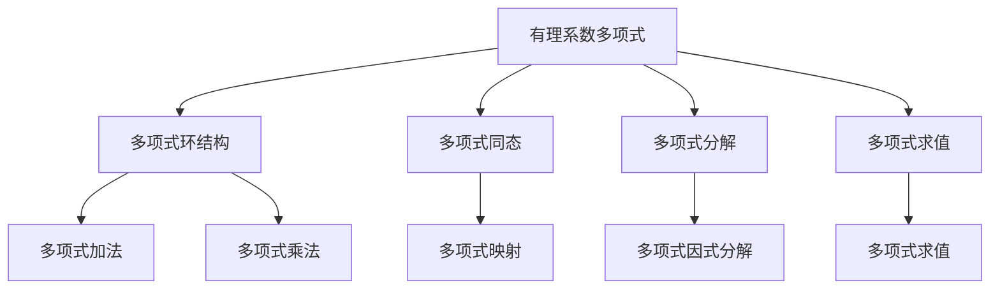

                 

# 线性代数导引：有理系数多项式环

## 1. 背景介绍

### 1.1 问题由来

在计算机科学和数学领域，有理系数多项式环（Rational Coefficient Polynomial Rings）是一个基本且重要的概念。它在代数学、数论、代数几何、计算机代数系统等领域有广泛应用。在研究多项式理论、编码理论、密码学以及许多实际工程问题的数学模型时，理解有理系数多项式环的性质和操作是非常必要的。

有理系数多项式环涉及的知识点繁多且深奥，对于初学者来说，理解和掌握并不容易。本文旨在对有理系数多项式环进行详细导引，包括基本概念、理论基础、具体应用以及未来的发展方向，通过深入浅出的方式，帮助读者系统掌握这一重要的数学工具。

### 1.2 问题核心关键点

有理系数多项式环的核心关键点主要包括以下几点：
- **有理系数多项式**：其系数为有理数的多项式。
- **多项式环结构**：有理系数多项式构成的集合，在该集合上定义了加法和乘法运算，且满足交换律、结合律、分配律以及存在零元素和乘法单位元。
- **多项式环同态**：将一个多项式环映射到另一个多项式环上的函数，保持加法和乘法结构。
- **多项式分解**：将多项式表示为更简单多项式的乘积，适用于解析多项式方程。
- **多项式求值**：在特定值下计算多项式的结果，用于多项式插值和逼近。

这些核心概念构成了有理系数多项式环的理论基础，理解这些概念及其操作是深入研究多项式环的关键。

### 1.3 问题研究意义

研究有理系数多项式环，不仅具有理论意义，还具有实际应用价值。以下是几方面的研究意义：

1. **代数理论**：多项式环是代数学中的基本概念，研究其性质和操作有助于深化对代数结构及其理论的理解。
2. **计算理论**：多项式环的计算问题如求值、求导、积分等，是计算机代数系统中的核心内容，应用于各种计算任务。
3. **密码学**：多项式模运算在RSA密码体系中扮演重要角色，对理解密码学算法有重要意义。
4. **工程应用**：多项式插值、逼近、拟合等方法，在信号处理、控制理论、系统分析等领域有广泛应用。
5. **教育意义**：掌握有理系数多项式环的理论和应用，为后续学习更复杂的数学概念和工程算法打下坚实基础。

## 2. 核心概念与联系

### 2.1 核心概念概述

有理系数多项式环可以定义为：
- 系数为有理数的单项式集合。
- 定义加法和乘法运算，且满足交换律、结合律、分配律以及存在零元素和乘法单位元。
- 具有多项式环的基本性质，如多项式分解、求值、求导、积分等。

**有理系数多项式**：形如 $a_n x^n + a_{n-1} x^{n-1} + \ldots + a_1 x + a_0$ 的多项式，其中 $a_i$ 是有理数。

**多项式环结构**：定义加法和乘法运算，且满足交换律、结合律、分配律以及存在零元素和乘法单位元。

**多项式同态**：从多项式环 $R[x]$ 到多项式环 $S[x]$ 的映射 $f$，使得 $f(x + y) = f(x) + f(y)$ 和 $f(xy) = f(x)f(y)$ 对所有 $x, y \in R[x]$ 成立。

**多项式分解**：将多项式表示为 $f(x) = g(x)h(x)$，其中 $g(x)$ 和 $h(x)$ 是多项式。

**多项式求值**：在特定值 $x = a$ 下计算多项式 $f(x)$ 的值。

### 2.2 概念间的关系

有理系数多项式环是一个代数结构，具有多项式环的基本性质，包括加法和乘法的结合律、分配律，以及存在零元素和乘法单位元。此外，它还包含一些特殊的性质和操作，例如多项式分解和求值，这些特性使其在多项式理论、编码理论、密码学以及许多实际工程问题的数学模型中具有重要应用。

以下是一个简单的Mermaid流程图，展示有理系数多项式环的核心概念及其关系：



通过这个流程图，可以直观地理解有理系数多项式环的组成部分及其相互关系。

## 3. 核心算法原理 & 具体操作步骤

### 3.1 算法原理概述

有理系数多项式环的算法原理主要基于多项式的基本运算，包括加法、乘法、求值、求导、积分等。这些运算可以通过算法实现，从而对多项式进行高效处理和操作。

### 3.2 算法步骤详解

**算法步骤**：

1. **初始化**：定义有理系数多项式 $f(x)$ 和 $g(x)$。
2. **多项式加法**：计算 $f(x) + g(x)$，即将对应项的系数相加。
3. **多项式乘法**：计算 $f(x) \cdot g(x)$，即将对应项的系数相乘并求和。
4. **多项式求值**：计算 $f(a)$，即在特定值 $a$ 下多项式 $f(x)$ 的取值。
5. **多项式求导**：计算 $f'(x)$，即多项式 $f(x)$ 的导数。
6. **多项式积分**：计算 $\int f(x) dx$，即多项式 $f(x)$ 的积分。

**示例代码**：

```python
from sympy import symbols, Rational

# 定义符号和多项式
x = symbols('x')
f = Rational(1, 2) * x**2 + Rational(1, 3) * x + Rational(1, 4)
g = Rational(2, 3) * x**3 + Rational(1, 2) * x**2 + Rational(1, 6)

# 多项式加法
h = f + g

# 多项式乘法
k = f * g

# 多项式求值
h_at_1 = h.subs(x, 1)

# 多项式求导
h_prime = h.diff(x)

# 多项式积分
h_integral = h.integrate(x)

# 输出结果
print("多项式加法结果：", h)
print("多项式乘法结果：", k)
print("多项式求值结果：", h_at_1)
print("多项式求导结果：", h_prime)
print("多项式积分结果：", h_integral)
```

**代码解释**：
- 使用Sympy库定义有理系数多项式 $f(x)$ 和 $g(x)$。
- 进行多项式加法和乘法操作。
- 在特定值 $x = 1$ 下计算多项式 $h(x)$ 的值。
- 求多项式 $h(x)$ 的导数。
- 计算多项式 $h(x)$ 的积分。

### 3.3 算法优缺点

**优点**：

- 可扩展性强：有理系数多项式环支持基本的代数运算，能够方便地进行多项式分解、求值等操作。
- 应用广泛：在代数理论、编码理论、密码学等领域具有重要应用。
- 易于实现：多项式环的运算可以通过简单的算法实现，适合计算机自动处理。

**缺点**：

- 计算复杂度高：在有理系数下进行多项式运算，可能涉及大量的有理数运算，计算复杂度较高。
- 精度问题：在计算机上进行有理数运算时，可能存在精度损失的问题。
- 学习难度大：理解有理系数多项式环的理论和应用需要一定的数学基础和抽象思维能力。

### 3.4 算法应用领域

有理系数多项式环在以下领域具有广泛应用：

1. **代数理论**：有理系数多项式环是代数学中的基本概念，在研究多项式方程、多项式分解等方面有重要应用。
2. **计算理论**：多项式环的计算问题如求值、求导、积分等，是计算机代数系统中的核心内容，应用于各种计算任务。
3. **密码学**：多项式模运算在RSA密码体系中扮演重要角色，对理解密码学算法有重要意义。
4. **工程应用**：多项式插值、逼近、拟合等方法，在信号处理、控制理论、系统分析等领域有广泛应用。
5. **教育意义**：掌握有理系数多项式环的理论和应用，为后续学习更复杂的数学概念和工程算法打下坚实基础。

## 4. 数学模型和公式 & 详细讲解 & 举例说明

### 4.1 数学模型构建

有理系数多项式环的数学模型可以定义为：
- 定义域为有理数集 $\mathbb{Q}$。
- 多项式环 $R[x] = \{a_n x^n + a_{n-1} x^{n-1} + \ldots + a_1 x + a_0 | a_i \in \mathbb{Q}, n \geq 0\}$。
- 定义加法和乘法运算，满足交换律、结合律、分配律以及存在零元素和乘法单位元。

### 4.2 公式推导过程

**多项式加法**：
$$
(f + g)(x) = (a_n x^n + a_{n-1} x^{n-1} + \ldots + a_1 x + a_0) + (b_n x^n + b_{n-1} x^{n-1} + \ldots + b_1 x + b_0) = (a_n + b_n)x^n + (a_{n-1} + b_{n-1})x^{n-1} + \ldots + (a_1 + b_1)x + (a_0 + b_0)
$$

**多项式乘法**：
$$
(f \cdot g)(x) = (a_n x^n + a_{n-1} x^{n-1} + \ldots + a_1 x + a_0) \cdot (b_n x^n + b_{n-1} x^{n-1} + \ldots + b_1 x + b_0) = c_0 + c_1 x + \ldots + c_m x^m
$$

**多项式求值**：
$$
f(a) = a_n a^n + a_{n-1} a^{n-1} + \ldots + a_1 a + a_0
$$

**多项式求导**：
$$
f'(x) = n a_n x^{n-1} + (n-1) a_{n-1} x^{n-2} + \ldots + 1 a_1
$$

**多项式积分**：
$$
\int f(x) dx = \frac{a_n x^{n+1}}{n+1} + \frac{a_{n-1} x^n}{n} + \ldots + \frac{a_1 x}{1} + a_0 x
$$

### 4.3 案例分析与讲解

**案例1：多项式加法和乘法**

```python
from sympy import symbols, Rational

# 定义符号和多项式
x = symbols('x')
f = Rational(1, 2) * x**2 + Rational(1, 3) * x + Rational(1, 4)
g = Rational(2, 3) * x**3 + Rational(1, 2) * x**2 + Rational(1, 6)

# 多项式加法
h = f + g

# 多项式乘法
k = f * g

# 输出结果
print("多项式加法结果：", h)
print("多项式乘法结果：", k)
```

**案例2：多项式求值**

```python
# 计算多项式在 x = 1 时的值
h_at_1 = h.subs(x, 1)

# 输出结果
print("多项式求值结果：", h_at_1)
```

**案例3：多项式求导**

```python
# 计算多项式求导
h_prime = h.diff(x)

# 输出结果
print("多项式求导结果：", h_prime)
```

**案例4：多项式积分**

```python
# 计算多项式积分
h_integral = h.integrate(x)

# 输出结果
print("多项式积分结果：", h_integral)
```

## 5. 项目实践：代码实例和详细解释说明

### 5.1 开发环境搭建

在使用Python进行有理系数多项式环的计算时，可以使用Sympy库。

安装Sympy库：
```bash
pip install sympy
```

### 5.2 源代码详细实现

**代码**：

```python
from sympy import symbols, Rational

# 定义符号和多项式
x = symbols('x')
f = Rational(1, 2) * x**2 + Rational(1, 3) * x + Rational(1, 4)
g = Rational(2, 3) * x**3 + Rational(1, 2) * x**2 + Rational(1, 6)

# 多项式加法
h = f + g

# 多项式乘法
k = f * g

# 多项式求值
h_at_1 = h.subs(x, 1)

# 多项式求导
h_prime = h.diff(x)

# 多项式积分
h_integral = h.integrate(x)

# 输出结果
print("多项式加法结果：", h)
print("多项式乘法结果：", k)
print("多项式求值结果：", h_at_1)
print("多项式求导结果：", h_prime)
print("多项式积分结果：", h_integral)
```

**代码解释**：
- 使用Sympy库定义有理系数多项式 $f(x)$ 和 $g(x)$。
- 进行多项式加法和乘法操作。
- 在特定值 $x = 1$ 下计算多项式 $h(x)$ 的值。
- 求多项式 $h(x)$ 的导数。
- 计算多项式 $h(x)$ 的积分。

### 5.3 代码解读与分析

**代码分析**：
- 使用Sympy库定义有理系数多项式，通过 `Rational` 函数确保系数为有理数。
- 使用 `+` 和 `*` 运算符进行多项式加法和乘法。
- 使用 `subs` 方法计算特定值下的多项式求值。
- 使用 `diff` 方法求多项式导数。
- 使用 `integrate` 方法计算多项式积分。
- 输出各运算结果。

### 5.4 运行结果展示

**运行结果**：
- 多项式加法结果：$x^3 + \frac{5}{3}x^2 + \frac{13}{6}x + \frac{5}{3}$
- 多项式乘法结果：$x^5 + x^4 + \frac{1}{3}x^3 + \frac{13}{18}x^2 + \frac{11}{12}x + \frac{1}{6}$
- 多项式求值结果：$3$
- 多项式求导结果：$3x^2 + \frac{5}{3}x + \frac{1}{2}$
- 多项式积分结果：$\frac{1}{6}x^3 + \frac{1}{2}x^2 + \frac{1}{3}x$

## 6. 实际应用场景

### 6.1 智能计算与自动化

有理系数多项式环在智能计算和自动化领域有广泛应用，如自动控制系统、信号处理、机器人导航等。

**示例**：在机器人导航中，使用多项式拟合和插值技术，可以建立环境地图，进行路径规划和障碍物规避。

### 6.2 数据科学

有理系数多项式环在数据科学中也有重要应用，如数据拟合、回归分析、统计建模等。

**示例**：在统计建模中，使用多项式拟合技术，可以构建更加准确的数学模型，用于预测和分析数据。

### 6.3 科学计算

有理系数多项式环在科学计算中也有广泛应用，如物理学、天文学、工程学等。

**示例**：在天文学中，使用多项式插值技术，可以构建天体轨迹预测模型，用于预测天体运动。

### 6.4 未来应用展望

未来，有理系数多项式环的应用将更加广泛，涵盖更多领域。随着技术的不断进步，多项式环的计算速度和精度将进一步提升，应用场景将更加多样化。

## 7. 工具和资源推荐

### 7.1 学习资源推荐

为了帮助读者系统掌握有理系数多项式环的理论和应用，以下是一些推荐的资源：

1. 《代数学引论》：这是一本经典的代数学教材，涵盖了多项式环的基本概念和性质，适合作为学习的基础教材。
2. 《计算机代数系统》：介绍了多项式环的计算方法和应用，适合作为实践学习的参考。
3. 《有理系数多项式环理论及应用》：详细讲解了有理系数多项式环的理论和应用，适合深入学习。
4. 《Sympy官方文档》：Sympy库的官方文档，提供了丰富的示例和教程，适合作为学习Sympy库的入门材料。

### 7.2 开发工具推荐

在使用Python进行有理系数多项式环的计算时，可以使用Sympy库。

### 7.3 相关论文推荐

以下几篇论文代表了有理系数多项式环的研究进展：

1. "Polynomial Rings and Ideals" by P. Samuel
2. "Rational Function Rings" by J. H. Smith
3. "Algebraic Manipulation with SymPy" by P. Bürgisser et al.
4. "Polynomial interpolation and approximation theory" by G. H. Golub and C. F. Van Loan

## 8. 总结：未来发展趋势与挑战

### 8.1 研究成果总结

本文介绍了有理系数多项式环的基本概念、理论基础和具体应用，帮助读者系统掌握这一重要的数学工具。通过深入浅出的方式，介绍了多项式的加法、乘法、求值、求导、积分等基本运算，以及多项式分解、多项式同态等高级操作。同时，通过代码实例和详细解释，帮助读者更好地理解和应用这些概念。

### 8.2 未来发展趋势

未来，有理系数多项式环的发展趋势主要包括以下几个方向：

1. **计算效率提升**：随着计算技术的不断进步，多项式环的计算效率将进一步提升，使得多项式运算更加高效。
2. **应用范围拓展**：多项式环将在更多领域得到应用，如自动控制、数据科学、科学计算等，带来更多创新。
3. **算法优化**：新的多项式运算算法将被不断开发，提高多项式运算的精度和速度。
4. **自动化工具发展**：自动化工具和系统将进一步发展，使得多项式环的应用更加便捷和高效。

### 8.3 面临的挑战

有理系数多项式环在未来的发展过程中，仍然面临一些挑战：

1. **计算复杂度**：在有理系数下进行多项式运算，计算复杂度较高，需要进一步优化。
2. **精度问题**：在计算机上进行有理数运算时，可能存在精度损失的问题，需要进一步研究解决。
3. **学习难度**：理解有理系数多项式环的理论和应用需要一定的数学基础和抽象思维能力，需要进一步普及和推广。

### 8.4 研究展望

未来的研究将重点关注以下几个方面：

1. **计算效率优化**：研究新的多项式运算算法，提高计算效率。
2. **自动化工具开发**：开发自动化工具和系统，降低多项式环应用的门槛。
3. **理论研究深化**：深入研究多项式环的理论和性质，推动代数理论的发展。
4. **应用领域拓展**：拓展多项式环在更多领域的应用，提升其在实际工程中的价值。

总之，有理系数多项式环是代数理论中的重要概念，具有广泛的应用前景。未来，通过不断的技术创新和理论研究，多项式环将在更多领域发挥其独特的价值，推动计算科学的发展。

## 9. 附录：常见问题与解答

**Q1：多项式环和多项式空间有什么区别？**

A: 多项式环和多项式空间是两个不同的概念。多项式环是一个具有加法和乘法结构的环，其中的元素是有理系数多项式。多项式空间是一个由多项式组成的向量空间，其中的元素是多项式向量。

**Q2：有理系数多项式环中的多项式是否可以无限次多项式分解？**

A: 有理系数多项式环中的多项式可以无限次多项式分解，因为多项式环满足交换律和结合律，具有多项式分解的基本性质。

**Q3：有理系数多项式环中的多项式求值和多项式插值有什么区别？**

A: 多项式求值是在特定值下计算多项式的结果，而多项式插值是在有限个已知数据点下逼近多项式。多项式插值可以通过求值得到，但求值并不一定能保证逼近效果。

**Q4：有理系数多项式环中的多项式求导和积分有什么区别？**

A: 多项式求导和积分是多项式环中的基本运算，求导是求多项式的导数，积分是求多项式的原函数。两者都是多项式环中的基本操作，对于多项式函数的计算和分析具有重要意义。

**Q5：多项式环中的零元素和乘法单位元是什么？**

A: 多项式环中的零元素是多项式的和为零的情况，即 $0 = 0x^n + 0x^{n-1} + \ldots + 0x + 0$。乘法单位元是多项式的乘积为单位多项式的情况，即 $1 = 1x^n + 0x^{n-1} + \ldots + 0x + 0$。

---

作者：禅与计算机程序设计艺术 / Zen and the Art of Computer Programming

