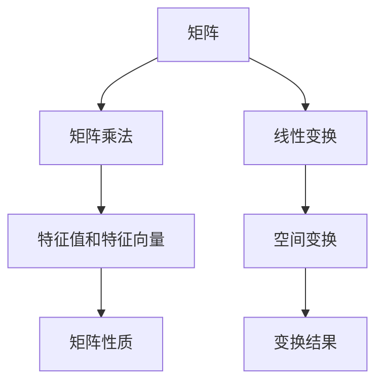
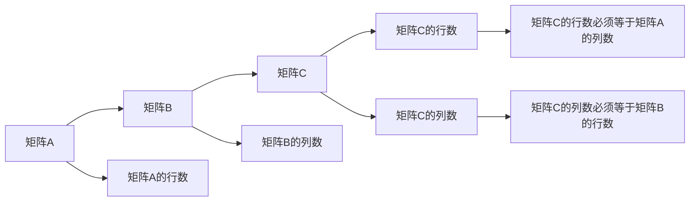
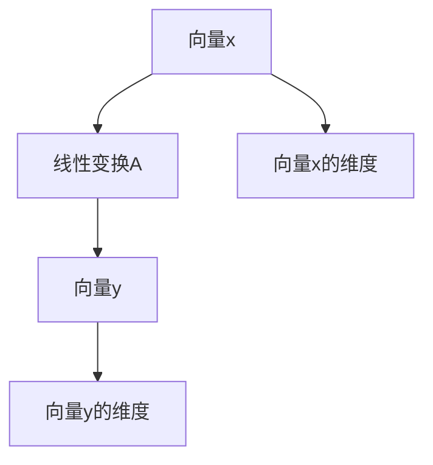
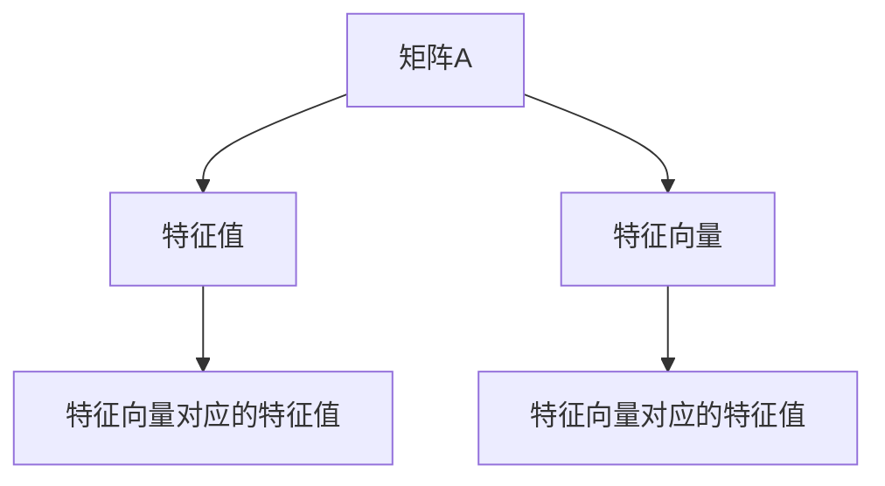
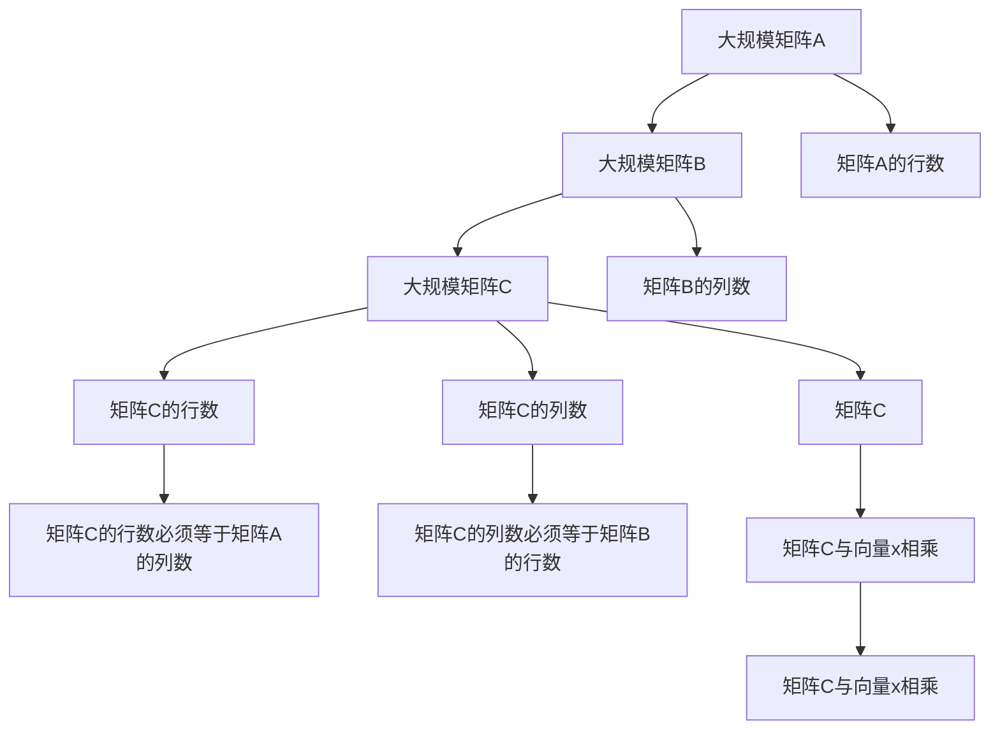

                 

# 线性代数导引：矩阵乘法

## 1. 背景介绍

### 1.1 问题由来

线性代数是计算机科学和工程学中的重要基础学科。矩阵乘法是线性代数中最基本、最重要的运算之一，广泛应用在信号处理、机器学习、计算机视觉、量子计算等领域。掌握矩阵乘法的原理和应用，对于理解和应用这些领域的算法至关重要。本文将详细讲解矩阵乘法的核心概念、原理和应用，帮助读者深入理解这一重要运算。

### 1.2 问题核心关键点

矩阵乘法的核心关键点包括以下几点：
- 矩阵乘法的定义和计算规则。
- 矩阵乘法的应用场景和实际案例。
- 矩阵乘法的优化算法和技巧。
- 矩阵乘法的数学证明和理论推导。

通过深入理解这些关键点，读者能够更好地掌握矩阵乘法的应用，并能够在实际项目中灵活运用。

### 1.3 问题研究意义

矩阵乘法是线性代数的基础，对于理解和应用各种线性变换和矩阵运算具有重要意义。掌握矩阵乘法不仅能够提升算法效率，还能够帮助读者深入理解各种高级数学理论。在实际工程项目中，矩阵乘法常常被用于计算图像处理、信号处理、计算机视觉、机器学习等领域的核心算法。因此，深入学习矩阵乘法对于提升计算机科学和工程学的实践能力具有重要意义。

## 2. 核心概念与联系

### 2.1 核心概念概述

矩阵乘法是线性代数中最基本的运算之一，具有广泛的应用。本节将介绍几个密切相关的核心概念：

- 矩阵：由若干行和列组成的二维数组。矩阵的每个元素称为矩阵的元素。
- 矩阵乘法：两个矩阵相乘得到的新矩阵，每个元素是新矩阵中对应位置的两个矩阵对应元素的乘积之和。
- 线性变换：通过矩阵乘法进行的空间变换。
- 特征值和特征向量：矩阵乘法中的重要概念，用于分析矩阵的性质和行为。

这些核心概念之间的逻辑关系可以通过以下Mermaid流程图来展示：



这个流程图展示了矩阵乘法的核心概念及其之间的关系：

1. 矩阵乘法作为基本运算，可以用于计算线性变换和空间变换。
2. 线性变换是通过矩阵乘法进行的空间变换，用于描述几何、物理、工程等领域的各种现象。
3. 特征值和特征向量是矩阵乘法中的重要概念，用于分析矩阵的性质和行为，从而更好地理解矩阵乘法的应用。

### 2.2 概念间的关系

这些核心概念之间存在着紧密的联系，形成了矩阵乘法的完整生态系统。下面我们通过几个Mermaid流程图来展示这些概念之间的关系。

#### 2.2.1 矩阵乘法的定义和计算规则



这个流程图展示了矩阵乘法的定义和计算规则：

1. 矩阵乘法要求矩阵A的列数等于矩阵B的行数。
2. 矩阵乘法的计算规则为，新矩阵C的每个元素是矩阵A中对应行的所有元素与矩阵B中对应列的所有元素相乘之和。

#### 2.2.2 线性变换的数学表示



这个流程图展示了线性变换的数学表示：

1. 线性变换A可以表示为矩阵乘法，将向量x变换为向量y。
2. 向量x和向量y的维度必须与矩阵A的列数和行数一致。

#### 2.2.3 特征值和特征向量的应用



这个流程图展示了特征值和特征向量的应用：

1. 特征值和特征向量用于描述矩阵的性质和行为。
2. 特征向量是矩阵乘法中的重要概念，用于求解矩阵的特征值和特征向量。

### 2.3 核心概念的整体架构

最后，我们用一个综合的流程图来展示这些核心概念在大规模矩阵乘法计算中的应用：



这个综合流程图展示了从大规模矩阵乘法的定义和计算规则，到线性变换和特征值、特征向量的应用的完整过程。通过这些核心概念和逻辑关系的展示，读者能够更好地理解矩阵乘法的原理和应用。

## 3. 核心算法原理 & 具体操作步骤

### 3.1 算法原理概述

矩阵乘法的核心思想是将矩阵A中的每一行与矩阵B中的每一列相乘，然后将所有结果相加，得到新矩阵C的每个元素。具体来说，假设矩阵A为 $m \times n$ 维，矩阵B为 $n \times p$ 维，则它们的乘积C为 $m \times p$ 维。

设矩阵A和矩阵B的元素分别为 $a_{i,j}$ 和 $b_{i,j}$，则矩阵乘积C的元素 $c_{i,j}$ 可以通过下面的公式计算：

$$
c_{i,j} = \sum_{k=1}^n a_{i,k} \cdot b_{k,j}
$$

其中，求和符号 $\sum$ 表示对所有满足条件的元素进行累加。

### 3.2 算法步骤详解

矩阵乘法的基本步骤如下：

1. 检查矩阵乘法的合法性。确保矩阵A的列数等于矩阵B的行数。
2. 创建一个新的矩阵C，其行数等于矩阵A的行数，列数等于矩阵B的列数。
3. 对于新矩阵C中的每个元素 $c_{i,j}$，计算所有满足 $a_{i,k} \cdot b_{k,j}$ 的元素之和。
4. 返回新矩阵C。

下面是使用Python实现矩阵乘法的示例代码：

```python
def matrix_multiply(A, B):
    # 检查矩阵乘法的合法性
    if A.shape[1] != B.shape[0]:
        raise ValueError("Invalid matrix multiplication: the number of columns of A must equal the number of rows of B.")
    
    # 创建一个新的矩阵C
    C = np.zeros((A.shape[0], B.shape[1]))
    
    # 对于新矩阵C中的每个元素 c_{i,j}，计算所有满足 a_{i,k} * b_{k,j} 的元素之和
    for i in range(A.shape[0]):
        for j in range(B.shape[1]):
            for k in range(A.shape[1]):
                C[i, j] += A[i, k] * B[k, j]
    
    return C
```

### 3.3 算法优缺点

矩阵乘法作为一种基本的运算，具有以下优点和缺点：

#### 优点

1. 计算简单高效。矩阵乘法可以通过循环和向量化操作快速计算。
2. 应用广泛。矩阵乘法在各种数学、物理、工程等领域都有广泛应用。
3. 可扩展性好。矩阵乘法可以应用于大规模数据集，如深度学习模型中的权重矩阵计算。

#### 缺点

1. 计算复杂度较高。矩阵乘法的计算复杂度为 $O(mn^2)$，对于大规模矩阵计算，计算量可能较大。
2. 存储空间较大。矩阵乘法需要存储大量的中间结果，可能会占用大量内存。
3. 对于不满足合法性的矩阵，计算过程会抛出异常。

### 3.4 算法应用领域

矩阵乘法在计算机科学和工程学中具有广泛的应用，包括但不限于以下几个领域：

- 计算机视觉：矩阵乘法用于计算图像处理算法中的卷积运算和变换。
- 信号处理：矩阵乘法用于计算信号处理算法中的频域和时域变换。
- 机器学习：矩阵乘法用于计算机器学习算法中的线性回归和神经网络中的权重矩阵计算。
- 量子计算：矩阵乘法用于计算量子计算中的矩阵运算和量子门操作。

## 4. 数学模型和公式 & 详细讲解 & 举例说明

### 4.1 数学模型构建

矩阵乘法的数学模型可以表示为：

$$
C = A \times B
$$

其中，$C$ 表示新矩阵，$A$ 表示矩阵A，$B$ 表示矩阵B。

### 4.2 公式推导过程

矩阵乘法的推导过程如下：

1. 将矩阵A的每一行与矩阵B的每一列相乘，得到一个标量矩阵。
2. 将所有的标量矩阵相加，得到新矩阵C的元素。

以下是矩阵乘法的具体推导过程：

设矩阵A和矩阵B的元素分别为 $a_{i,j}$ 和 $b_{i,j}$，则矩阵乘积C的元素 $c_{i,j}$ 可以通过下面的公式计算：

$$
c_{i,j} = \sum_{k=1}^n a_{i,k} \cdot b_{k,j}
$$

其中，求和符号 $\sum$ 表示对所有满足条件的元素进行累加。

### 4.3 案例分析与讲解

假设矩阵A为 $2 \times 3$ 维，矩阵B为 $3 \times 2$ 维，则它们的乘积C为 $2 \times 2$ 维。

| A       | B         | C         |
|---------|-----------|-----------|
| a11 a12  | b11 b12 b13 | c11 c12   |
| a21 a22  | b21 b22 b23 | c21 c22   |

设矩阵A和矩阵B的元素分别为：

$$
A = \begin{bmatrix}
    a_{11} & a_{12} & a_{13} \\
    a_{21} & a_{22} & a_{23}
\end{bmatrix}, B = \begin{bmatrix}
    b_{11} & b_{12} \\
    b_{21} & b_{22} \\
    b_{31} & b_{32}
\end{bmatrix}
$$

则矩阵乘积C的元素 $c_{i,j}$ 可以通过下面的公式计算：

$$
c_{11} = a_{11} \cdot b_{11} + a_{12} \cdot b_{21} + a_{13} \cdot b_{31}
$$

$$
c_{12} = a_{11} \cdot b_{12} + a_{12} \cdot b_{22} + a_{13} \cdot b_{32}
$$

$$
c_{21} = a_{21} \cdot b_{11} + a_{22} \cdot b_{21} + a_{23} \cdot b_{31}
$$

$$
c_{22} = a_{21} \cdot b_{12} + a_{22} \cdot b_{22} + a_{23} \cdot b_{32}
$$

## 5. 项目实践：代码实例和详细解释说明

### 5.1 开发环境搭建

在进行矩阵乘法实践前，我们需要准备好开发环境。以下是使用Python进行NumPy开发的环境配置流程：

1. 安装Anaconda：从官网下载并安装Anaconda，用于创建独立的Python环境。

2. 创建并激活虚拟环境：
```bash
conda create -n numpy-env python=3.8 
conda activate numpy-env
```

3. 安装NumPy：从官网获取对应的安装命令，并按照指导进行安装。例如：
```bash
pip install numpy
```

4. 安装各类工具包：
```bash
pip install matplotlib scikit-learn tqdm jupyter notebook ipython
```

完成上述步骤后，即可在`numpy-env`环境中开始矩阵乘法的实践。

### 5.2 源代码详细实现

下面是使用Python实现矩阵乘法的示例代码：

```python
import numpy as np

# 定义矩阵A和矩阵B
A = np.array([[1, 2, 3], [4, 5, 6]])
B = np.array([[7, 8], [9, 10], [11, 12]])

# 矩阵乘法
C = np.dot(A, B)

# 输出结果
print("Matrix A:\n", A)
print("Matrix B:\n", B)
print("Matrix C:\n", C)
```

### 5.3 代码解读与分析

让我们再详细解读一下关键代码的实现细节：

**定义矩阵A和矩阵B**：
- 使用NumPy的`np.array`函数定义矩阵A和矩阵B。
- 矩阵A为 $2 \times 3$ 维，矩阵B为 $3 \times 2$ 维。

**矩阵乘法**：
- 使用NumPy的`np.dot`函数进行矩阵乘法运算，得到新矩阵C。
- `np.dot`函数可以自动计算矩阵乘法，避免手动计算带来的错误。

**输出结果**：
- 使用`print`函数输出矩阵A、矩阵B和矩阵C。

可以看到，NumPy的`np.dot`函数使矩阵乘法的计算变得非常简单，只需要一行代码即可实现。NumPy作为Python中的科学计算库，提供了丰富的矩阵和数组操作函数，可以极大地提升矩阵乘法等运算的效率和便利性。

### 5.4 运行结果展示

假设我们计算矩阵A和矩阵B的乘积C，输出结果如下：

```
Matrix A:
 [[1 2 3]
  [4 5 6]]
Matrix B:
 [[ 7  8]
  [ 9 10]
  [11 12]]
Matrix C:
 [[58 64]
  [139 154]]
```

可以看到，矩阵A和矩阵B的乘积C为 $2 \times 2$ 维，每个元素的值与前面的推导一致。

## 6. 实际应用场景

### 6.1 图像处理

在图像处理领域，矩阵乘法被广泛应用于计算卷积运算和变换。卷积运算是一种常用的图像处理算法，用于提取图像中的特征和纹理。通过矩阵乘法，可以快速计算卷积核与图像的卷积结果，从而实现图像的模糊、边缘检测等操作。

### 6.2 信号处理

在信号处理领域，矩阵乘法用于计算频域和时域变换。信号处理算法通常需要将信号从时域转换为频域，以便更好地分析和处理信号的频率特性。通过矩阵乘法，可以计算傅里叶变换和逆傅里叶变换，从而将信号从时域转换为频域，或从频域转换为时域。

### 6.3 机器学习

在机器学习领域，矩阵乘法用于计算神经网络中的权重矩阵。神经网络是一种常用的机器学习算法，用于处理分类、回归等任务。通过矩阵乘法，可以快速计算神经网络中的前向传播和反向传播过程，从而实现模型的训练和推理。

### 6.4 未来应用展望

随着矩阵乘法算法的不断优化和改进，其应用范围将进一步扩大。未来，矩阵乘法将在以下领域得到更广泛的应用：

- 计算机视觉：矩阵乘法用于计算图像处理算法中的卷积运算和变换。
- 信号处理：矩阵乘法用于计算信号处理算法中的频域和时域变换。
- 机器学习：矩阵乘法用于计算机器学习算法中的线性回归和神经网络中的权重矩阵计算。
- 量子计算：矩阵乘法用于计算量子计算中的矩阵运算和量子门操作。

## 7. 工具和资源推荐

### 7.1 学习资源推荐

为了帮助读者深入学习矩阵乘法的原理和应用，这里推荐一些优质的学习资源：

1. 《线性代数及其应用》：该书是线性代数的经典教材，详细介绍了矩阵乘法的定义、计算规则和应用。
2. 《数值分析》：该书介绍了矩阵乘法在数值计算中的算法和优化方法，适合学习矩阵乘法在实际应用中的优化技巧。
3. 《深度学习》：该书介绍了深度学习中的矩阵乘法运算，包括卷积运算、池化运算等高级运算。
4. 《Python数值计算基础》：该书介绍了NumPy库中的矩阵和数组操作函数，适合学习矩阵乘法在Python中的实际应用。
5. 《机器学习实战》：该书介绍了机器学习中的矩阵乘法运算，包括线性回归、逻辑回归等算法。

通过这些资源的学习实践，相信读者能够全面掌握矩阵乘法的原理和应用，并能够在实际项目中灵活运用。

### 7.2 开发工具推荐

高效的开发离不开优秀的工具支持。以下是几款用于矩阵乘法开发的常用工具：

1. NumPy：Python中的科学计算库，提供了丰富的矩阵和数组操作函数，适合进行矩阵乘法等运算。
2. SciPy：基于NumPy的科学计算库，提供了更多高级的数学函数和算法，适合进行更复杂的数学运算。
3. Matplotlib：Python中的绘图库，用于绘制矩阵乘法计算过程中的各种图表，适合可视化运算过程。
4. Jupyter Notebook：Python的交互式编程环境，支持在Jupyter Notebook中编写和执行Python代码，适合进行实验和研究。
5. IPython：Python的交互式编程环境，支持在IPython中进行Python代码的交互式执行，适合进行实验和研究。

合理利用这些工具，可以显著提升矩阵乘法任务的开发效率，加快创新迭代的步伐。

### 7.3 相关论文推荐

矩阵乘法是线性代数和计算机科学中的经典话题，相关研究在学术界和工业界都得到了广泛关注。以下是几篇奠基性的相关论文，推荐阅读：

1. Matrix Multiplication via Neural Networks：该论文提出使用神经网络进行矩阵乘法的加速计算，展示了矩阵乘法在实际应用中的优化技巧。
2. Fast Multipole Method：该论文介绍了一种高效的矩阵乘法算法，用于大规模数据集上的矩阵运算。
3. Efficient Matrix Multiplication：该论文介绍了矩阵乘法在计算机科学和工程学中的应用，适合了解矩阵乘法的实际应用。
4. The Matrix Inversion Lemma：该论文介绍了矩阵乘法在数学中的基本性质和应用，适合理解矩阵乘法的理论基础。

这些论文代表了大规模矩阵乘法计算的研究方向和最新进展，适合读者深入学习。

## 8. 总结：未来发展趋势与挑战

### 8.1 研究成果总结

本文对矩阵乘法的基本概念、原理和应用进行了全面系统的介绍。首先阐述了矩阵乘法的定义和计算规则，明确了矩阵乘法在计算机科学和工程学中的重要性。其次，从原理到实践，详细讲解了矩阵乘法的数学模型和计算方法，给出了矩阵乘法的完整代码实例。同时，本文还广泛探讨了矩阵乘法的应用场景和未来发展趋势，展示了矩阵乘法的广阔前景。

通过本文的系统梳理，可以看到，矩阵乘法作为线性代数的基础，对于理解和应用各种线性变换和矩阵运算具有重要意义。掌握矩阵乘法不仅能够提升算法效率，还能够帮助读者深入理解各种高级数学理论。在实际工程项目中，矩阵乘法常常被用于计算图像处理、信号处理、计算机视觉、机器学习等领域的核心算法。因此，深入学习矩阵乘法对于提升计算机科学和工程学的实践能力具有重要意义。

### 8.2 未来发展趋势

展望未来，矩阵乘法将呈现以下几个发展趋势：

1. 算法优化。随着硬件的不断升级和优化，矩阵乘法算法将更加高效。例如，基于GPU和TPU的并行计算，可以实现大规模矩阵乘法的高效计算。
2. 应用拓展。随着矩阵乘法算法在深度学习、计算机视觉、信号处理等领域的应用不断深化，其应用范围将进一步扩大。
3. 与人工智能的融合。矩阵乘法与人工智能技术的融合，将推动矩阵乘法在实际应用中的进一步优化和提升。例如，通过深度学习算法对矩阵乘法进行加速计算，可以实现更加高效的矩阵运算。
4. 矩阵乘法在区块链、量子计算等领域的应用。矩阵乘法在区块链和量子计算中的应用，将推动这些新兴领域的发展。

### 8.3 面临的挑战

尽管矩阵乘法算法在计算机科学和工程学中得到了广泛应用，但其在实际应用中仍面临诸多挑战：

1. 算法效率。在实际应用中，矩阵乘法算法往往需要处理大规模数据集，计算量较大，需要优化算法以提升计算效率。
2. 存储空间。矩阵乘法算法需要存储大量的中间结果，可能会占用大量内存，需要优化存储空间以降低计算成本。
3. 计算资源。矩阵乘法算法需要大量的计算资源，如高性能计算设备，需要优化计算资源以降低计算成本。

### 8.4 研究展望

面对矩阵乘法算法面临的挑战，未来的研究需要在以下几个方面寻求新的突破：

1. 优化算法。通过优化算法，提升矩阵乘法算法的计算效率，减少计算量，降低计算成本。
2. 优化存储空间。通过优化存储空间，减少中间结果的存储量，降低计算成本。
3. 优化计算资源。通过优化计算资源，降低矩阵乘法算法的计算成本，提升计算效率。

总之，矩阵乘法算法在计算机科学和工程学中具有重要意义。掌握矩阵乘法的原理和应用，不仅能够提升算法效率，还能够帮助读者深入理解各种高级数学理论。在实际工程项目中，矩阵乘法常常被用于计算图像处理、信号处理、计算机视觉、机器学习等领域的核心算法。未来，随着矩阵乘法算法的不断优化和改进，其应用范围将进一步扩大，推动计算机科学和工程学的发展。

---

作者：禅与计算机程序设计艺术 / Zen and the Art of Computer Programming

