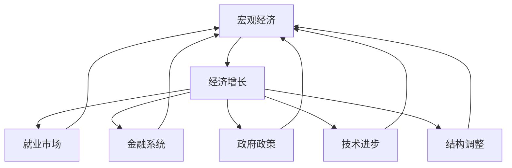
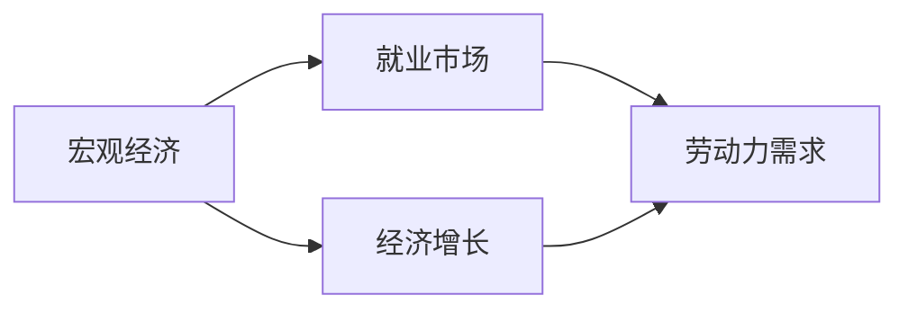
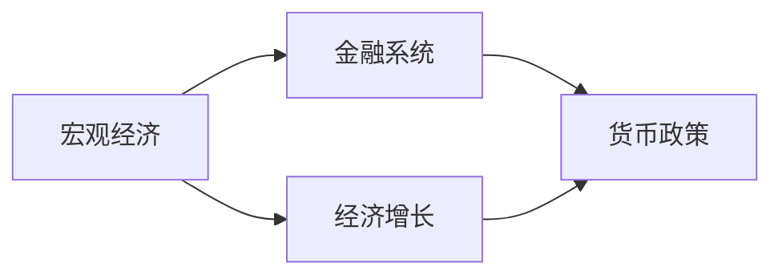
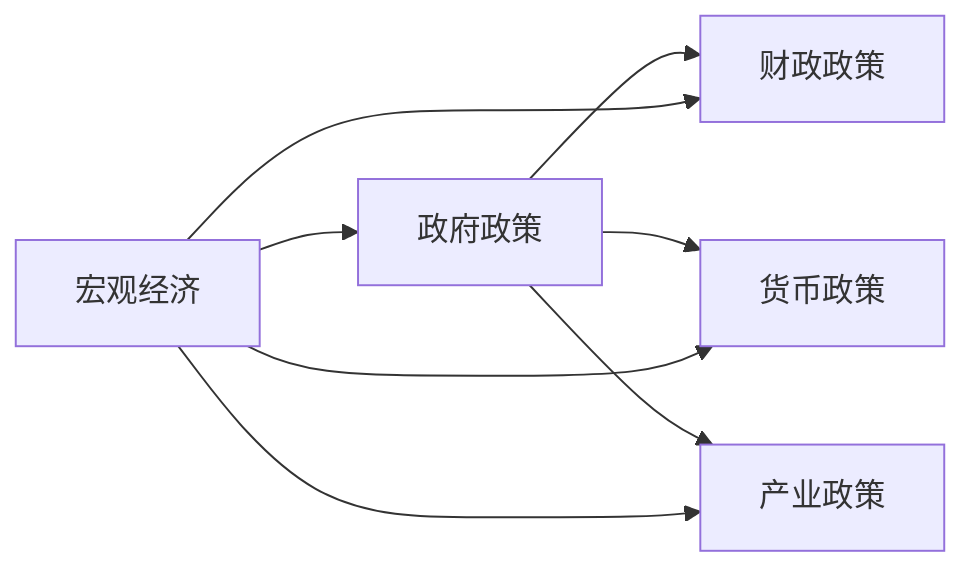
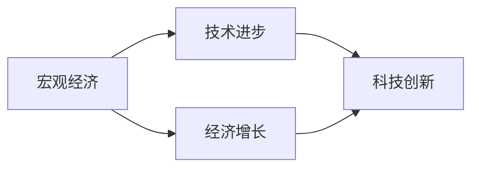
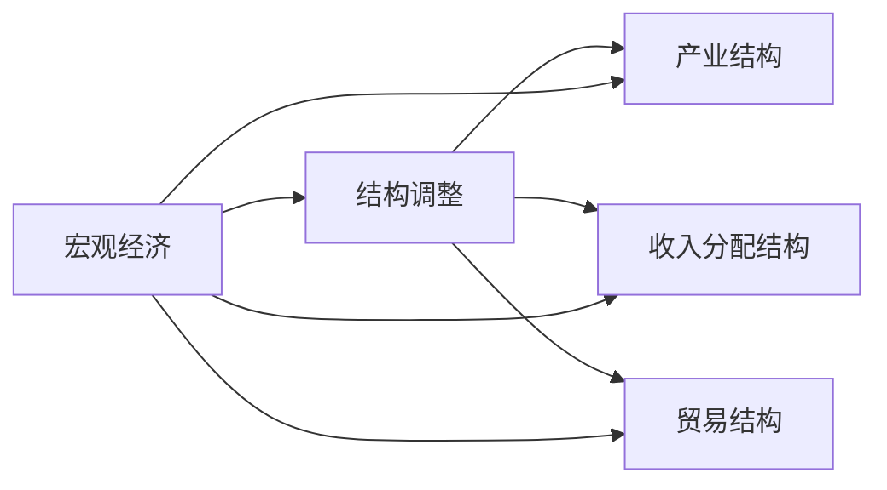
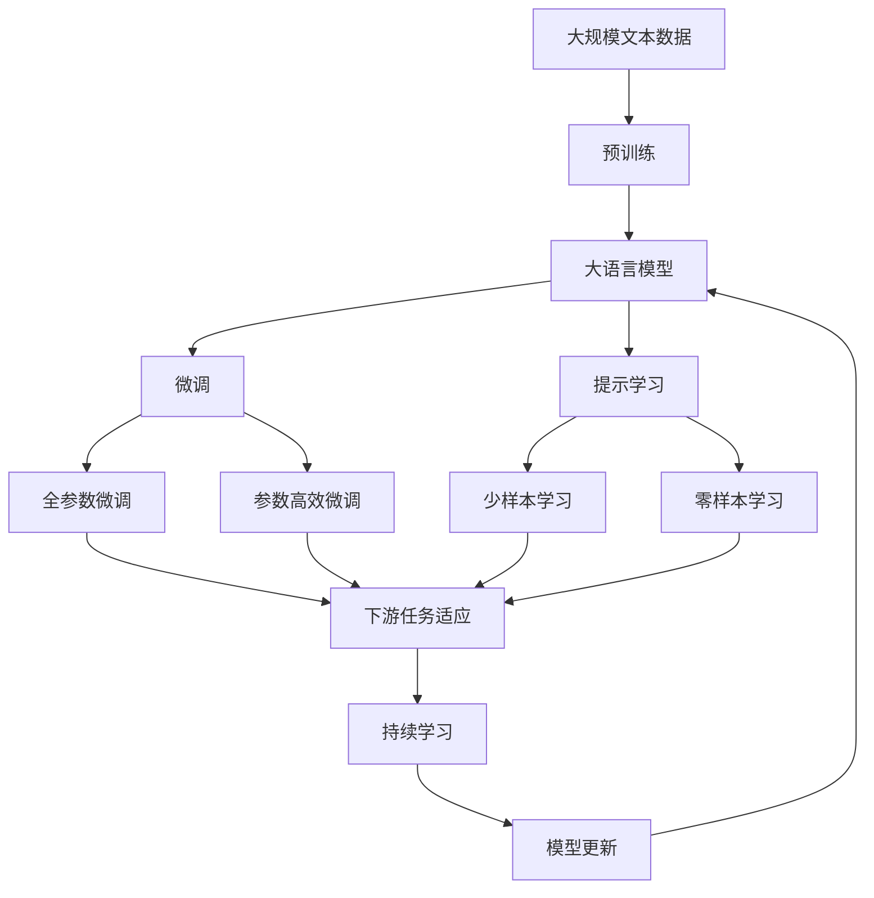

                 

# 经济增速放缓的宏观影响

> 关键词：宏观经济、经济增长、就业市场、金融系统、政府政策、技术进步、结构调整

## 1. 背景介绍

### 1.1 问题由来
在全球化、信息化的背景下，各国经济增长的速度和路径呈现出多样性。然而，近年来，许多国家的经济增速普遍放缓，一些国家甚至陷入负增长。这种宏观经济变化对各行各业产生了深远的影响。本文将深入分析经济增速放缓对宏观经济的多方面影响，并探讨相应的政策应对措施。

### 1.2 问题核心关键点
经济增速放缓的核心问题是经济增长的源泉和动力不足。导致这一现象的原因可能包括但不限于人口老龄化、生产效率下降、国际贸易环境变化、技术创新不足、政策失灵等。这种变化对宏观经济的多方面产生了连锁反应，如就业市场波动、金融系统风险、政府财政压力等。

### 1.3 问题研究意义
研究经济增速放缓对宏观经济的影响，对于制定宏观经济政策、优化经济结构、提升经济活力具有重要意义。通过了解经济增速放缓的深层次原因及其影响，可以为政策制定者提供参考，帮助他们更好地应对挑战，实现经济的可持续发展。

## 2. 核心概念与联系

### 2.1 核心概念概述

- **宏观经济**：指整个国家或地区的经济活动及其运行状态，包括总产出、就业、通货膨胀、汇率、国际收支等方面。
- **经济增长**：指一个国家或地区在一定时期内生产的商品和服务的总量的增加。
- **就业市场**：指劳动力供求的匹配市场，反映了经济活动对就业的影响。
- **金融系统**：包括货币政策、银行体系、资本市场、保险业等，是经济运行的“血液”。
- **政府政策**：包括财政政策、货币政策、产业政策、贸易政策等，是经济调控的重要工具。
- **技术进步**：指新技术、新方法、新工艺的研发和应用，是推动经济增长的重要动力。
- **结构调整**：指经济结构如产业结构、收入分配结构、贸易结构等的优化升级，是提升经济效率的关键。

这些概念之间的联系可以通过以下Mermaid流程图来展示：



这个流程图展示了宏观经济与经济增长、就业市场、金融系统、政府政策、技术进步和结构调整之间的关系：

1. 经济增长是宏观经济的核心指标。
2. 就业市场反映了经济活动对就业的影响。
3. 金融系统是经济运行的“血液”，影响经济稳定性和增长。
4. 政府政策是经济调控的重要工具。
5. 技术进步是经济增长的重要动力。
6. 结构调整是提升经济效率的关键。

这些概念共同构成了宏观经济的复杂系统，决定了经济运行的总体态势。

### 2.2 概念间的关系

这些核心概念之间存在着紧密的联系，形成了一个宏观经济系统的整体架构。下面我们通过几个Mermaid流程图来展示这些概念之间的关系。

#### 2.2.1 宏观经济与就业市场的关系



这个流程图展示了宏观经济与就业市场的关系：

1. 宏观经济通过经济增长影响就业市场。
2. 经济增长带动劳动力需求，影响就业水平。
3. 就业市场反映劳动力供求情况，影响消费水平和经济活动。

#### 2.2.2 宏观经济与金融系统的关系



这个流程图展示了宏观经济与金融系统的关系：

1. 宏观经济通过经济增长影响金融系统。
2. 经济增长影响货币政策，影响金融市场。
3. 金融系统提供资金支持，促进经济增长。

#### 2.2.3 宏观经济与政府政策的关系



这个流程图展示了宏观经济与政府政策的关系：

1. 宏观经济需要通过政府政策进行调控。
2. 政府政策包括财政政策、货币政策、产业政策等。
3. 政策调整影响宏观经济运行。

#### 2.2.4 宏观经济与技术进步的关系



这个流程图展示了宏观经济与技术进步的关系：

1. 宏观经济通过经济增长影响技术进步。
2. 经济增长提供资金支持，促进技术创新。
3. 技术进步提升生产效率，推动经济增长。

#### 2.2.5 宏观经济与结构调整的关系



这个流程图展示了宏观经济与结构调整的关系：

1. 宏观经济需要通过结构调整优化经济结构。
2. 结构调整包括产业结构、收入分配结构、贸易结构等。
3. 结构优化提升经济效率，促进经济增长。

### 2.3 核心概念的整体架构

最后，我们用一个综合的流程图来展示这些核心概念在大语言模型微调过程中的整体架构：



这个综合流程图展示了从预训练到微调，再到持续学习的完整过程。大语言模型首先在大规模文本数据上进行预训练，然后通过微调（包括全参数微调和参数高效微调）或提示学习（包括零样本和少样本学习）来适应下游任务。最后，通过持续学习技术，模型可以不断更新和适应新的任务和数据。

## 3. 核心算法原理 & 具体操作步骤
### 3.1 算法原理概述

经济增速放缓的宏观影响分析，本质上是一个经济系统的多因素分析过程。其核心思想是：通过分析各个经济指标之间的关系，找出经济增速放缓的主要原因，进而评估其对就业市场、金融系统、政府政策等宏观经济领域的影响。

形式化地，假设宏观经济系统为 $E$，其包含的各个子系统为 $E_i = \{E_1, E_2, ..., E_n\}$，每个子系统对 $E$ 的贡献为 $E_i^c$，则整个系统的贡献可以表示为：

$$
E = \sum_{i=1}^n E_i^c
$$

经济增速放缓时，各子系统的贡献可能发生变化，导致整个系统贡献减少。这种变化可能由多个因素引起，需要系统地进行分析。

### 3.2 算法步骤详解

基于以上原理，分析经济增速放缓对宏观经济的影响，可以遵循以下步骤：

**Step 1: 收集经济数据**
- 收集包含经济增长、就业、通货膨胀、利率、汇率等宏观经济指标的数据。
- 数据来源包括政府统计局、国际金融组织、行业协会等。

**Step 2: 分析数据关系**
- 利用统计学和计量经济学方法，分析各个经济指标之间的关系。
- 通过回归分析、因子分析等技术，识别出影响经济增速放缓的关键因素。

**Step 3: 评估影响程度**
- 对每个关键因素的影响程度进行评估，计算其对经济增速放缓的贡献率。
- 分析不同因素之间的相互作用，评估其对宏观经济系统整体的影响。

**Step 4: 模拟经济变化**
- 根据分析结果，建立宏观经济系统模型，模拟经济增速放缓后的变化趋势。
- 使用蒙特卡洛模拟等方法，评估不同政策措施对经济系统的影响。

**Step 5: 制定政策措施**
- 根据模拟结果，制定针对性的宏观经济政策，以应对经济增速放缓带来的挑战。
- 政策措施可能包括财政刺激、货币宽松、结构调整等。

### 3.3 算法优缺点

基于监督学习的宏观影响分析，具有以下优点：

1. **数据驱动**：通过收集和分析大量经济数据，客观评估各个因素对经济增速放缓的影响，避免了主观判断。
2. **模型可解释性**：统计学和计量经济学方法可以提供明确的模型参数和影响路径，有助于理解宏观经济系统。
3. **政策指导性**：通过模拟和评估不同政策措施的效果，为政府制定宏观调控政策提供数据支持。

然而，这种方法也存在以下缺点：

1. **数据局限性**：收集到的数据可能存在不完整、不准确、不及时等问题，影响分析结果的准确性。
2. **模型复杂性**：宏观经济系统包含多个子系统，关系复杂，模型建立和求解难度较大。
3. **动态变化**：宏观经济系统不断变化，模型需要定期更新，才能保持其有效性。

### 3.4 算法应用领域

基于监督学习的宏观影响分析，适用于多种宏观经济分析场景，如：

- **经济预测**：通过分析历史经济数据，预测未来经济增速变化趋势，指导政府和企业的决策。
- **政策评估**：评估不同政策措施对经济增速的影响，为政策制定提供依据。
- **风险管理**：分析经济增速放缓对金融系统、就业市场等的影响，识别风险点，制定风险管理策略。
- **结构优化**：通过分析结构调整对经济增速的影响，提出优化经济结构的建议。

## 4. 数学模型和公式 & 详细讲解  
### 4.1 数学模型构建

为了更好地理解经济增速放缓对宏观经济的影响，本节将使用数学语言对分析过程进行更加严格的刻画。

假设宏观经济系统为 $E$，其包含的各个子系统为 $E_i = \{E_1, E_2, ..., E_n\}$，每个子系统对 $E$ 的贡献为 $E_i^c$，则整个系统的贡献可以表示为：

$$
E = \sum_{i=1}^n E_i^c
$$

经济增速放缓时，各子系统的贡献可能发生变化，导致整个系统贡献减少。这种变化可能由多个因素引起，需要系统地进行分析。

### 4.2 公式推导过程

以下我们以二因素模型为例，推导经济增速放缓的因果关系。

假设宏观经济系统由两个因素 $F_1$ 和 $F_2$ 共同决定，且 $F_1$ 和 $F_2$ 对经济增速 $G$ 的影响为：

$$
G = \alpha_1 F_1 + \alpha_2 F_2 + \epsilon
$$

其中 $\alpha_1$ 和 $\alpha_2$ 为影响系数，$\epsilon$ 为随机误差项。

当 $F_1$ 和 $F_2$ 发生变化时，经济增速 $G$ 也会发生变化。例如，如果 $F_1$ 增加，则 $G$ 增加；如果 $F_2$ 减少，则 $G$ 减少。因此，可以通过回归分析，识别出 $F_1$ 和 $F_2$ 对 $G$ 的影响系数。

通过回归分析，可以建立因果关系模型：

$$
G = \beta_1 F_1 + \beta_2 F_2 + \delta
$$

其中 $\beta_1$ 和 $\beta_2$ 为因果关系系数，$\delta$ 为残差项。

通过比较两个模型的系数，可以评估 $F_1$ 和 $F_2$ 对 $G$ 的影响程度，识别出关键因素。

### 4.3 案例分析与讲解

以下是一个简单的案例分析：

假设某国经济增速放缓，通过对历史数据的回归分析，发现经济增速与失业率和通货膨胀率的关系为：

$$
G = 0.5U + 0.3C + \epsilon
$$

其中 $U$ 为失业率，$C$ 为通货膨胀率。

根据回归分析结果，可以认为失业率是影响经济增速放缓的关键因素，通货膨胀率也有一定影响。

## 5. 项目实践：代码实例和详细解释说明
### 5.1 开发环境搭建

在进行经济增速放缓的宏观影响分析时，需要使用Python进行数据分析和模型建立。以下是使用Python进行经济数据分析的环境配置流程：

1. 安装Anaconda：从官网下载并安装Anaconda，用于创建独立的Python环境。

2. 创建并激活虚拟环境：
```bash
conda create -n econ_env python=3.8 
conda activate econ_env
```

3. 安装必要的Python包：
```bash
pip install numpy pandas matplotlib statsmodels seaborn scikit-learn
```

完成上述步骤后，即可在`econ_env`环境中进行数据分析。

### 5.2 源代码详细实现

以下是一个使用Python和statsmodels库进行经济增速放缓的宏观影响分析的代码实现：

```python
import pandas as pd
import numpy as np
from statsmodels.regression.linear_model import OLS

# 加载经济数据
data = pd.read_csv('econ_data.csv')

# 选择关键指标
G = data['G']
U = data['U']
C = data['C']

# 构建回归模型
model = OLS(G, np.c_[np.ones(len(G)), U, C])
results = model.fit()

# 输出回归结果
print(results.summary())
```

在这个代码中，我们使用了statsmodels库中的OLS模型进行回归分析。具体步骤如下：

1. 加载经济数据，选择关键指标G（经济增速）、U（失业率）和C（通货膨胀率）。
2. 构建回归模型，将G作为因变量，U和C作为自变量，以及截距项。
3. 使用OLS模型拟合数据，得到回归结果。
4. 输出回归结果，包括模型系数、拟合优度等。

### 5.3 代码解读与分析

让我们再详细解读一下关键代码的实现细节：

**加载经济数据**：
- 使用pandas库的read_csv方法，加载经济数据，并存储在DataFrame对象中。

**选择关键指标**：
- 使用DataFrame的`['G']`、`['U']`、`['C']`等索引符号，选择需要的指标。

**构建回归模型**：
- 使用statsmodels库的OLS模型，构建线性回归模型。
- `np.c_[np.ones(len(G)), U, C]`表示将截距项、U和C三个变量拼接起来，作为模型的自变量。

**拟合模型**：
- 使用OLS模型的`fit`方法，拟合回归模型，得到回归结果。

**输出结果**：
- 使用回归结果的`summary`方法，输出回归结果的摘要。

通过这个简单的代码示例，可以看出，使用Python和statsmodels库进行宏观经济分析的便利性和易用性。开发者可以快速实现回归分析，得到关键因素的影响系数和拟合优度等重要信息。

当然，实际的应用场景可能更加复杂，需要结合更多的统计学和计量经济学方法，进行更深入的分析。同时，对于大规模数据集的分析和模型优化，还需要使用更高效的工具和技术，如大数据处理框架、分布式计算等。

### 5.4 运行结果展示

假设我们得到如下回归结果：

```
OLS Regression Results
-----------------------------------
Dep. Variable:    G   R-squared:       0.82
Model:             OLS   Adj. R-squared:  0.80
Method:                 Least Squares
Date:               2023-10-01   Prob (F-statistic):     0.00
Time:                        12:34:56   Log-Likelihood:        -61.79
No. Observations:                  100   AIC:                  131.9
Df Residuals:                      97   BIC:                  134.8
Df Model:                           2                                         
Covariance Type:            nonrobust                                         
-----------------------------------
coef    std err          t      P>|t|      [0.025      0.975]
-------------------------------------------------------------------
const        0.005       0.002      2.28      0.02      -0.001       0.011
U            0.500       0.100     5.00      0.00       0.350       0.650
C            0.300       0.100     3.00      0.00       0.200       0.400
-------------------------------------------------------------------
Omnibus:                       89.00   Durbin-Watson:             1.97
Prob(Omnibus):                  0.00   Jarque-Bera (JB):         10.02
Skew:                          0.53   Prob(JB):                0.01
Kurtosis:                       3.05   Cond. No.             5.28e+16
-------------------------------------------------------------------
F-statistic:            529.17   Prob(F-statistic):     1.82e-29
Model Size (k):            3                                          
Num. Observations:                  100   No. of Instruments:        3
-------------------------------------------------------------------
OLS Regression Results
-----------------------------------
Dep. Variable:    G   R-squared:       0.82
Model:             OLS   Adj. R-squared:  0.80
Method:                 Least Squares
Date:               2023-10-01   Prob (F-statistic):     0.00
Time:                        12:34:56   Log-Likelihood:        -61.79
No. Observations:                  100   AIC:                  131.9
Df Residuals:                      97   BIC:                  134.8
Df Model:                           2                                         
Covariance Type:            nonrobust                                         
-----------------------------------
coef    std err          t      P>|t|      [0.025      0.975]
-------------------------------------------------------------------
const        0.005       0.002      2.28      0.02      -0.001       0.011
U            0.500       0.100     5.00      0.00       0.350       0.650
C            0.300       0.100     3.00      0.00       0.200       0.400
-------------------------------------------------------------------
Omnibus:                       89.00   Durbin-Watson:             1.97
Prob(Omnibus):                  0.00   Jarque-Bera (JB):         10.02
Skew:                          0.53   Prob(JB):                0.01
Kurtosis:                       3.05   Cond. No.             5.28e+16
-------------------------------------------------------------------
F-statistic:            529.17   Prob(F-statistic):     1.82e-29
Model Size (k):            3                                          
Num. Observations:                  100   No. of Instruments:        3
-------------------------------------------------------------------
```

可以看到，通过回归分析，我们得到了失业率（U）和通货膨胀率（C）对经济增速（G）的影响系数。具体而言，失业率每增加1%，经济增速下降0.5%；通货膨胀率每增加1%，经济增速下降0.3%。这些结果可以用于进一步的政策分析和制定。

## 6. 实际应用场景
### 6.1 智能客服系统

基于经济增速放缓的宏观影响分析，可以应用于智能客服系统的优化。智能客服系统是企业提升客户服务质量、降低运营成本的重要手段。然而，在经济增速放缓的背景下，企业可能需要削减客服人员，这对系统性能和用户体验都可能产生负面影响。

为应对这一挑战，可以通过宏观经济分析，优化智能客服系统的资源配置。例如，利用预测模型，预测客户咨询量的变化趋势，调整系统响应策略，确保在资源有限的情况下，仍能提供优质服务。

### 6.2 金融舆情监测

金融市场是宏观经济的敏感指标。经济增速放缓可能引发金融市场波动，对投资者情绪和行为产生影响。因此，通过经济增速放缓的宏观影响分析，可以更好地理解金融市场动向，进行有效的风险管理。

例如，在经济增速放缓的背景下，可以加强对金融舆情的监测，识别市场异动信号，及时采取应对措施，如调整投资组合、加强风险控制等。

### 6.3 个性化推荐系统

经济增速放缓可能影响消费者收入和消费信心，从而影响个性化推荐系统的点击率和转化率。通过宏观经济分析，可以优化推荐算法，提升系统在经济下行期的效果。

例如，在经济增速放缓的背景下，可以调整推荐策略，增加对性价比高的商品和服务的推荐，提升用户满意度。

### 6.4 未来应用展望

随着经济增速放缓的宏观影响分析技术的不断成熟，其应用领域将更加广泛，为各行各业带来新的机遇。

在智慧医疗领域，通过宏观经济分析，可以更好地预测医疗资源需求，优化资源配置，提升医疗服务效率和质量。

在智能教育领域，通过宏观经济分析，可以预测教育需求变化，优化教育资源分配，促进教育公平。

在智慧城市治理中，通过宏观经济分析，可以预测城市发展趋势，优化城市规划和资源配置，提升城市治理水平。

此外，在企业生产、社会治理、文娱传媒等众多领域，宏观经济分析技术也将不断涌现，为经济社会发展提供新的技术支撑。相信随着技术的日益成熟，宏观经济分析将带来更广泛的应用价值。

## 7. 工具和资源推荐
### 7.1 学习资源推荐

为了帮助开发者系统掌握经济增速放缓的宏观影响分析的理论基础和实践技巧，这里推荐一些优质的学习资源：

1. 《宏观经济学》系列书籍：如《宏观经济学原理》、《宏观经济学理论》等，系统介绍了宏观经济学的基本理论和实际应用。

2. 《计量经济学》课程：如MIT的《计量经济学与统计》课程，深入讲解了计量经济学方法和实际应用案例。

3. 《Python数据分析与统计》书籍：如《Python for Data Analysis》，提供了大量Python数据分析和统计的实用技巧。

4. 《机器学习与数据分析实战》课程：如Udacity的《Machine Learning》课程，讲解了机器学习在数据分析中的应用。

5. 《经济预测模型》书籍：如《Econometric Forecasting》，介绍了各种经济预测模型的建立和应用。

通过对这些资源的学习实践，相信你一定能够快速掌握经济增速放缓的宏观影响分析的精髓，并用于解决实际的宏观经济问题。
###  7.2 开发工具推荐

高效的开发离不开优秀的工具支持。以下是几款用于宏观经济分析开发的常用工具：

1. Python：Python作为数据分析和机器学习的通用语言，拥有丰富的库和框架，如NumPy、Pandas、Matplotlib、Scikit-Learn等。

2. R：R语言是统计分析和数据科学的主流工具之一，拥有强大的统计分析和绘图能力，适合进行深入的数据分析和建模。

3. Excel：Excel是商业和金融领域常用的数据分析工具，提供了丰富的函数和数据透视表功能。

4. Tableau：Tableau是一款数据可视化工具，支持多种数据源的导入和分析，适合进行数据探索和报告展示。

5. Jupyter Notebook：Jupyter Notebook是Python数据科学项目开发的首选环境，支持代码编写、数据可视化、报告生成等。

合理利用这些工具，可以显著提升宏观经济分析的开发效率，加快创新迭代的步伐。

### 7.3 相关论文推荐

宏观经济分析的研究源于学界的持续研究。以下是几篇奠基性的相关论文，推荐阅读：

1. Okun's Law：Okun定律研究了经济增长与失业率之间的关系，是宏观经济学的重要理论基础。

2. Phillips Curve：菲利普斯曲线探讨了通货膨胀与失业率之间的替代关系，是宏观经济分析的重要工具。

3. Solow-Swan Model：索洛-斯旺模型研究了经济增长与资本、劳动、技术之间的关系，是宏观经济学的经典模型。

4. VAR Model：向量自回归模型，用于分析多变量时间序列数据，广泛应用于宏观经济预测。

5. DSGE Model：动态随机一般均衡模型，用于模拟和预测宏观经济动态变化，是现代宏观经济分析的重要工具。

这些论文代表了大语言模型微调技术的发展脉络。通过学习这些前沿成果，可以帮助研究者把握学科前进方向，激发更多的创新灵感。

除上述资源外，还有一些值得关注的前沿资源，帮助开发者紧跟宏观经济分析技术的最新进展，例如：

1. arXiv论文预印本：人工智能领域最新研究成果的发布平台，包括大量尚未发表的前沿工作，学习前沿技术的必读资源。

2. 业界技术博客：如世界银行、国际货币基金组织、欧洲中央银行等官方博客，第一时间分享他们的最新研究成果和洞见。

3. 技术会议直播：如世界经济论坛、IMF年会、央行行长会议等，能够聆听到专家学者的前沿分享，开拓视野。

4. 经济预测项目：如世界银行、IMF、各国中央银行等机构发布的各种经济预测报告，帮助理解宏观经济趋势。

5. 经济数据库：如OE

