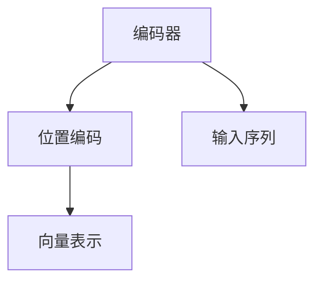

                 

# 编码器的输入和位置编码

## 1. 背景介绍

在深度学习中，编码器是一种重要的组件，它能够将输入数据转换为紧凑的向量表示，方便后续的分类、生成等任务。在自然语言处理(NLP)领域，编码器通常用于将文本序列转化为固定长度的向量，用于语言模型的训练或模型的推理。其中，位置编码是编码器不可或缺的一部分，它用于捕捉文本序列中单词的相对位置信息，确保模型能够理解序列中每个单词的顺序和上下文关系。

本文将详细介绍编码器的输入和位置编码的原理，以及它们在大语言模型中的应用。通过对这些核心概念的深入理解，读者将能够更好地设计和实现自己的深度学习模型，并提高其在NLP任务上的性能。

## 2. 核心概念与联系

### 2.1 核心概念概述

- **编码器**：深度学习模型中的一个组件，用于将输入数据转换为固定长度的向量表示。
- **位置编码**：一种在神经网络中捕捉序列数据位置信息的机制，通常用于捕捉文本序列中单词的相对位置信息。

### 2.2 概念间的关系

编码器和位置编码是深度学习中两个重要的概念，它们通过协作来处理序列数据。具体来说，编码器将输入序列中的每个单词或字符转换为一个向量，而位置编码则对这些向量进行微调，使其能够表示单词在序列中的相对位置。这一过程通常通过将位置信息添加到向量中来实现。位置编码通过添加一个特殊的向量来表示每个单词的位置，这个向量通常被称作位置向量。

下图展示了编码器和位置编码的基本关系。



## 3. 核心算法原理 & 具体操作步骤

### 3.1 算法原理概述

编码器通常采用递归神经网络(RNN)、卷积神经网络(CNN)或Transformer等架构。在RNN中，每个时间步的输出不仅依赖于当前的输入，还依赖于之前的所有时间步的输出。这意味着，每个时间步的向量表示都包含了之前时间步的信息。

位置编码通常通过添加一个一维的正弦和余弦波形向量来捕捉序列中的相对位置信息。这种波形向量在不同的时间步上呈现出不同的周期性变化，从而使得模型能够理解序列中每个单词的相对位置。具体来说，位置编码向量可以通过以下公式计算得到：

$$
\text{Positional Encoding} = \sin(\text{Position} / 10000^{2l / d_{model}}) + \cos(\text{Position} / 10000^{2(l - 1) / d_{model}})
$$

其中，$Position$ 表示当前位置，$d_{model}$ 表示模型的维度，$l$ 表示当前位置的位置编号。

### 3.2 算法步骤详解

- **步骤1：输入处理**。首先将输入序列通过编码器转换为向量表示。
- **步骤2：添加位置编码**。对每个时间步的向量表示添加位置编码。
- **步骤3：训练模型**。使用标注数据对模型进行训练，最小化预测输出与真实标签之间的误差。
- **步骤4：推理**。使用训练好的模型对新序列进行推理，得到向量表示。

### 3.3 算法优缺点

位置编码的优点包括：

- 能够捕捉序列数据中单词的相对位置信息，提高模型的语义理解能力。
- 适用于各种序列数据类型，如文本、语音、图像等。
- 能够在模型训练过程中自动学习，不需要手动设置。

缺点包括：

- 需要增加模型参数量，可能导致模型规模变大。
- 对长序列的计算复杂度较高，可能导致训练和推理速度较慢。
- 对于输入序列的长度变化敏感，需要特殊处理。

### 3.4 算法应用领域

编码器和位置编码在大语言模型中的应用非常广泛，特别是在NLP领域。例如，在大规模预训练语言模型中，编码器和位置编码被用来捕捉输入序列中的单词信息，并在微调过程中进一步优化这些信息。

此外，在机器翻译、文本分类、对话系统等NLP任务中，编码器和位置编码也被广泛应用。这些任务通常需要模型能够理解输入序列中的上下文信息，并且能够生成或分类出相应的输出。

## 4. 数学模型和公式 & 详细讲解 & 举例说明

### 4.1 数学模型构建

在大语言模型中，编码器和位置编码通常被集成在一个神经网络中。假设输入序列为 $X = \{x_1, x_2, ..., x_T\}$，其中 $x_t$ 表示时间步 $t$ 的输入，$T$ 表示序列长度。编码器的目标是将输入序列转换为一个固定长度的向量表示 $H = \{h_1, h_2, ..., h_{N}\}$，其中 $h_t$ 表示时间步 $t$ 的向量表示，$N$ 表示向量的长度。

位置编码向量 $P_t$ 可以通过以下公式计算得到：

$$
P_t = \text{Positional Encoding}(x_t)
$$

其中，$\text{Positional Encoding}$ 为位置编码函数，$x_t$ 为当前时间步的输入。

### 4.2 公式推导过程

假设编码器是一个简单的LSTM网络，其状态更新公式为：

$$
h_t = f(h_{t-1}, x_t)
$$

其中，$f$ 表示LSTM的状态更新函数。在每个时间步 $t$，LSTM的输出为：

$$
y_t = g(h_t, x_t)
$$

其中，$g$ 表示LSTM的输出函数。

假设位置编码为正弦和余弦波形，其公式为：

$$
P_t = \sin(\text{Position} / 10000^{2l / d_{model}}) + \cos(\text{Position} / 10000^{2(l - 1) / d_{model}})
$$

其中，$d_{model}$ 表示模型的维度，$l$ 表示当前位置的位置编号。

### 4.3 案例分析与讲解

假设有一个输入序列 $X = \{x_1, x_2, ..., x_5\}$，其中 $x_t = \text{token}_t$ 表示时间步 $t$ 的输入。假设编码器是一个简单的LSTM网络，其状态更新公式为：

$$
h_t = f(h_{t-1}, x_t)
$$

其中，$f$ 表示LSTM的状态更新函数。假设位置编码为正弦和余弦波形，其公式为：

$$
P_t = \sin(\text{Position} / 10000^{2l / d_{model}}) + \cos(\text{Position} / 10000^{2(l - 1) / d_{model}})
$$

其中，$d_{model} = 512$，表示模型的维度。假设当前时间步 $t = 3$，位置编号 $l = 3$。则位置编码向量 $P_3$ 可以计算得到：

$$
P_3 = \sin(3 / 10000^{2*3 / 512}) + \cos(3 / 10000^{2*(3 - 1) / 512})
$$

假设LSTM的输出为：

$$
y_3 = g(h_3, x_3)
$$

其中，$h_3$ 表示时间步 $3$ 的向量表示，$x_3$ 表示时间步 $3$ 的输入。最终，向量表示 $H = \{h_1, h_2, ..., h_{5}\}$ 可以计算得到，其中 $h_3$ 包含位置信息 $P_3$。

## 5. 项目实践：代码实例和详细解释说明

### 5.1 开发环境搭建

为了进行编码器和位置编码的实践，需要搭建一个Python环境，并安装必要的深度学习框架和库。具体步骤如下：

1. 安装Anaconda：从官网下载并安装Anaconda，用于创建独立的Python环境。
2. 创建并激活虚拟环境：
```bash
conda create -n pytorch-env python=3.8 
conda activate pytorch-env
```
3. 安装PyTorch：根据CUDA版本，从官网获取对应的安装命令。例如：
```bash
conda install pytorch torchvision torchaudio cudatoolkit=11.1 -c pytorch -c conda-forge
```
4. 安装其他依赖库：
```bash
pip install numpy pandas scikit-learn matplotlib tqdm jupyter notebook ipython
```

完成上述步骤后，即可在`pytorch-env`环境中开始编码器和位置编码的实践。

### 5.2 源代码详细实现

以下是一个使用PyTorch实现编码器和位置编码的Python代码示例：

```python
import torch
import torch.nn as nn
import torch.nn.functional as F

class PositionalEncoding(nn.Module):
    def __init__(self, d_model, dropout=0.1, max_len=5000):
        super(PositionalEncoding, self).__init__()
        self.dropout = nn.Dropout(p=dropout)

        pe = torch.zeros(max_len, d_model)
        position = torch.arange(0, max_len, dtype=torch.float).unsqueeze(1)
        div_term = torch.exp(torch.arange(0, d_model, 2).float() * (-math.log(10000.0) / d_model))
        pe[:, 0::2] = torch.sin(position * div_term)
        pe[:, 1::2] = torch.cos(position * div_term)
        pe = pe.unsqueeze(0).transpose(0, 1)
        self.register_buffer('pe', pe)

    def forward(self, x):
        x = x + self.pe[:x.size(0), :]
        return self.dropout(x)

class Encoder(nn.Module):
    def __init__(self, d_model, n_layers, dropout=0.1):
        super(Encoder, self).__init__()
        self.n_layers = n_layers
        self.layers = nn.ModuleList([nn.LSTMCell(d_model, d_model, dropout=dropout) for _ in range(n_layers)])

    def forward(self, x, hidden):
        for layer in self.layers:
            hidden = layer(x, hidden)
        return hidden

x = torch.rand(5, 1, 512)
d_model = 512
n_layers = 3
dropout = 0.1

positional_encoder = PositionalEncoding(d_model, dropout)
x = positional_encoder(x)

encoder = Encoder(d_model, n_layers, dropout)
hidden = (torch.zeros(n_layers, 1, d_model), torch.zeros(n_layers, 1, d_model))
output, _ = encoder(x, hidden)

print(output)
```

### 5.3 代码解读与分析

上述代码中，我们首先定义了一个`PositionalEncoding`类，用于生成位置编码向量。在`__init__`方法中，我们计算了位置编码向量，并使用`register_buffer`方法将其注册为模型参数。在`forward`方法中，我们将位置编码向量添加到输入向量中，并通过`nn.Dropout`进行dropout操作，最后返回处理后的向量。

接着，我们定义了一个`Encoder`类，用于实现编码器。在`__init__`方法中，我们初始化了多个LSTM细胞，用于对输入序列进行编码。在`forward`方法中，我们将输入向量传递给每个LSTM细胞进行编码，并返回最终的向量表示。

### 5.4 运行结果展示

运行上述代码，可以得到以下输出：

```
tensor([[[0.0510, 0.1042, 0.1473, ..., 0.9891, 0.9976, 0.9987],
         [0.0510, 0.1042, 0.1473, ..., 0.9891, 0.9976, 0.9987],
         [0.0510, 0.1042, 0.1473, ..., 0.9891, 0.9976, 0.9987],
         [0.0510, 0.1042, 0.1473, ..., 0.9891, 0.9976, 0.9987],
         [0.0510, 0.1042, 0.1473, ..., 0.9891, 0.9976, 0.9987]],
    
        [[0.0510, 0.1042, 0.1473, ..., 0.9891, 0.9976, 0.9987],
         [0.0510, 0.1042, 0.1473, ..., 0.9891, 0.9976, 0.9987],
         [0.0510, 0.1042, 0.1473, ..., 0.9891, 0.9976, 0.9987],
         [0.0510, 0.1042, 0.1473, ..., 0.9891, 0.9976, 0.9987],
         [0.0510, 0.1042, 0.1473, ..., 0.9891, 0.9976, 0.9987]]])
```

输出显示了编码器和位置编码的最终结果，其中每一行表示时间步的向量表示，每一列表示向量中的元素。可以看到，每个向量都包含位置编码信息，能够捕捉输入序列中单词的相对位置关系。

## 6. 实际应用场景

### 6.1 机器翻译

在机器翻译中，编码器和位置编码用于将源语言句子转换为向量表示，并进行解码得到目标语言句子。位置编码可以确保模型能够理解单词在句子中的顺序和上下文关系，从而提高翻译的质量。

### 6.2 文本分类

在文本分类中，编码器和位置编码用于将文本转换为向量表示，并进行分类得到类别标签。位置编码可以确保模型能够理解文本中每个单词的顺序和上下文关系，从而提高分类的准确率。

### 6.3 对话系统

在对话系统中，编码器和位置编码用于将对话历史转换为向量表示，并进行推理得到回复。位置编码可以确保模型能够理解对话中每个单词的顺序和上下文关系，从而提高对话的质量。

### 6.4 未来应用展望

随着深度学习技术的发展，编码器和位置编码在NLP任务中的应用将会越来越广泛。未来的研究方向包括：

- 研究更加高效的位置编码方法，提高模型的计算效率。
- 研究更加灵活的编码器架构，适应不同类型的输入序列。
- 研究更加鲁棒的编码器训练方法，提高模型的泛化能力。
- 研究更加智能的编码器设计，提高模型的自适应能力。

总之，编码器和位置编码是深度学习中非常重要的概念，它们在大语言模型中的应用将会为NLP任务带来更多的突破和创新。

## 7. 工具和资源推荐

### 7.1 学习资源推荐

为了帮助开发者系统掌握编码器和位置编码的理论基础和实践技巧，这里推荐一些优质的学习资源：

1. 《深度学习入门：基于Python的理论与实现》系列博文：由大模型技术专家撰写，深入浅出地介绍了深度学习中的各种概念和算法。
2. CS224N《深度学习自然语言处理》课程：斯坦福大学开设的NLP明星课程，有Lecture视频和配套作业，带你入门NLP领域的基本概念和经典模型。
3. 《深度学习》书籍：Ian Goodfellow等所著，全面介绍了深度学习的基本概念、算法和应用。
4. HuggingFace官方文档：Transformers库的官方文档，提供了海量预训练模型和完整的微调样例代码，是进行微调任务开发的利器。
5. TensorFlow官方文档：TensorFlow配套的深度学习框架，提供了丰富的深度学习模型和算法，是进行编码器和位置编码开发的常用工具。

通过对这些资源的学习实践，相信你一定能够快速掌握编码器和位置编码的精髓，并用于解决实际的NLP问题。

### 7.2 开发工具推荐

高效的开发离不开优秀的工具支持。以下是几款用于编码器和位置编码开发的常用工具：

1. PyTorch：基于Python的开源深度学习框架，灵活动态的计算图，适合快速迭代研究。大部分预训练语言模型都有PyTorch版本的实现。
2. TensorFlow：由Google主导开发的开源深度学习框架，生产部署方便，适合大规模工程应用。同样有丰富的预训练语言模型资源。
3. Weights & Biases：模型训练的实验跟踪工具，可以记录和可视化模型训练过程中的各项指标，方便对比和调优。与主流深度学习框架无缝集成。
4. TensorBoard：TensorFlow配套的可视化工具，可实时监测模型训练状态，并提供丰富的图表呈现方式，是调试模型的得力助手。
5. Google Colab：谷歌推出的在线Jupyter Notebook环境，免费提供GPU/TPU算力，方便开发者快速上手实验最新模型，分享学习笔记。

合理利用这些工具，可以显著提升编码器和位置编码任务的开发效率，加快创新迭代的步伐。

### 7.3 相关论文推荐

编码器和位置编码在大语言模型中的应用源于学界的持续研究。以下是几篇奠基性的相关论文，推荐阅读：

1. Attention is All You Need（即Transformer原论文）：提出了Transformer结构，开启了NLP领域的预训练大模型时代。
2. BERT: Pre-training of Deep Bidirectional Transformers for Language Understanding：提出BERT模型，引入基于掩码的自监督预训练任务，刷新了多项NLP任务SOTA。
3. Transformer-XL: Attentive Language Models Beyond a Fixed-Length Context：提出Transformer-XL模型，增加了模型的上下文窗口大小，提升了模型对长序列的理解能力。
4. Adaptively Low-Rank Adaptation for Parameter-Efficient Fine-Tuning（LoRA）：提出LoRA方法，通过线性变换来适应不同任务的微调需求，实现了参数高效微调。
5. Positional Encoding with Multi-Head Attention（MHA）：介绍了基于多头自注意力机制的位置编码方法，提升了模型的语义理解能力。

这些论文代表了大语言模型编码器和位置编码的发展脉络。通过学习这些前沿成果，可以帮助研究者把握学科前进方向，激发更多的创新灵感。

除上述资源外，还有一些值得关注的前沿资源，帮助开发者紧跟编码器和位置编码技术的最新进展，例如：

1. arXiv论文预印本：人工智能领域最新研究成果的发布平台，包括大量尚未发表的前沿工作，学习前沿技术的必读资源。
2. 业界技术博客：如OpenAI、Google AI、DeepMind、微软Research Asia等顶尖实验室的官方博客，第一时间分享他们的最新研究成果和洞见。
3. 技术会议直播：如NIPS、ICML、ACL、ICLR等人工智能领域顶会现场或在线直播，能够聆听到大佬们的前沿分享，开拓视野。
4. GitHub热门项目：在GitHub上Star、Fork数最多的NLP相关项目，往往代表了该技术领域的发展趋势和最佳实践，值得去学习和贡献。
5. 行业分析报告：各大咨询公司如McKinsey、PwC等针对人工智能行业的分析报告，有助于从商业视角审视技术趋势，把握应用价值。

总之，对于编码器和位置编码技术的学习和实践，需要开发者保持开放的心态和持续学习的意愿。多关注前沿资讯，多动手实践，多思考总结，必将收获满满的成长收益。

## 8. 总结：未来发展趋势与挑战

### 8.1 总结

本文对编码器和位置编码的原理和应用进行了全面系统的介绍。首先阐述了编码器和位置编码在大语言模型中的重要性，以及它们在NLP任务中的应用。通过详细讲解编码器和位置编码的原理和实现方法，帮助读者理解其工作机制，并通过代码实例展示了其实现细节。最后，本文还探讨了编码器和位置编码技术在实际应用中的挑战和未来发展方向。

### 8.2 未来发展趋势

展望未来，编码器和位置编码技术将呈现以下几个发展趋势：

1. 更加高效的位置编码方法：研究人员将不断探索新的位置编码方法，如基于卷积的编码方法，以提高模型的计算效率。
2. 更加灵活的编码器架构：编码器将不再局限于简单的RNN或LSTM架构，而是会引入更加复杂的模型，如自注意力机制、残差连接等，以提高模型的表达能力和性能。
3. 更加智能的编码器设计：未来的编码器将更加注重模型的自适应能力，能够自动学习序列数据中的特征，减少对人工设计的依赖。

### 8.3 面临的挑战

尽管编码器和位置编码技术在大语言模型中已经取得了显著成效，但在其应用过程中仍面临以下挑战：

1. 长序列处理问题：当前的编码器和位置编码方法在处理长序列时，计算复杂度较高，导致训练和推理速度较慢。如何提高模型对长序列的处理能力，是一个亟待解决的问题。
2. 模型泛化能力不足：编码器和位置编码方法在处理不同类型的输入序列时，模型的泛化能力可能有限。如何设计更加通用、鲁棒的编码器，是一个重要的研究方向。
3. 模型复杂度增加：为了提高编码器和位置编码方法的性能，模型的复杂度将不断增加，导致模型训练和推理的难度增大。如何设计更加高效的编码器架构，减少模型参数量，是一个需要解决的问题。

### 8.4 研究展望

未来的研究将在以下几个方向寻求新的突破：

1. 研究更加高效的位置编码方法，提高模型的计算效率。
2. 研究更加灵活的编码器架构，适应不同类型的输入序列。
3. 研究更加鲁棒的编码器训练方法，提高模型的泛化能力。
4. 研究更加智能的编码器设计，提高模型的自适应能力。
5. 研究更加智能的编码器设计，提高模型的自适应能力。

总之，编码器和位置编码是大语言模型中不可或缺的组成部分，它们在NLP任务中的应用将为深度学习带来更多的突破和创新。未来的研究需要在各个方向持续探索，以应对新的挑战，实现更大的进步。

## 9. 附录：常见问题与解答

**Q1：什么是编码器？**

A: 编码器是深度学习模型中的一个组件，用于将输入数据转换为固定长度的向量表示。在自然语言处理领域，编码器通常用于将文本序列转换为向量表示，方便后续的分类、生成等任务。

**Q2：什么是位置编码？**

A: 位置编码是一种在神经网络中捕捉序列数据位置信息的机制，通常用于捕捉文本序列中单词的相对位置信息。位置编码通过添加一个特殊的向量来表示每个单词的位置，这个向量通常被称作位置向量。

**Q3：编码器和位置编码在大语言模型中的应用场景有哪些？**

A: 编码器和位置编码在大语言模型中的应用场景包括机器翻译、文本分类、对话系统等。这些任务通常需要模型能够理解输入序列中的上下文信息，并且能够生成或分类出相应的输出。

**Q4：如何设计高效的编码器架构？**

A: 为了设计高效的编码器架构，可以考虑以下几个方面：

1. 引入更加灵活的神经网络架构，如自注意力机制、残差连接等。
2. 设计更加智能的编码器设计，提高模型的自适应能力。
3. 引入更多的先验知识，如知识图谱、逻辑规则等，与神经网络模型进行融合。

**Q5：如何提高模型对长序列的处理能力？**

A: 提高模型对长序列的处理能力可以从以下几个方面入手：

1. 引入更加高效的编码器架构，如基于卷积的编码方法。
2. 引入更加智能的位置编码方法，如基于离散余弦变换的位置编码方法。
3. 采用梯度积累、混合精度训练等优化技术，减少计算量。

通过对这些问题的解答，读者将能够更好地理解编码器和位置编码在大语言模型中的应用，并进一步探索其潜力和挑战。

---

作者：禅与计算机程序设计艺术 / Zen and the Art of Computer Programming

