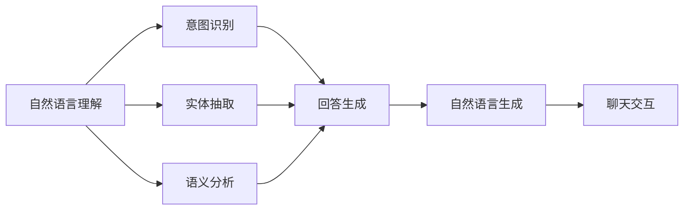

                 

## 1. 背景介绍

### 1.1 问题由来

随着数字化转型的不断深入，企业面临着严峻的客户服务挑战。传统客服模式依赖于电话、邮件和在线聊天等形式，不仅成本高、效率低，而且客户体验差，难以满足日益复杂多变的客户需求。为提升客户服务效率和质量，企业迫切需要一种高效、智能、自适应的客服解决方案。

与此同时，人工智能（AI）技术在自然语言处理（NLP）、计算机视觉、机器学习等领域取得了突破性进展。特别是聊天机器人（Chatbot），以其低成本、高效率、全天候服务的优势，逐渐成为现代企业客服的重要工具。AI驱动的聊天机器人能够通过自然语言理解和生成技术，与客户进行实时互动，解答问题、提供建议、处理订单等，极大地提高了客服响应速度和满意度。

### 1.2 问题核心关键点

聊天机器人本质上是一种基于AI的NLP应用，其核心技术包括自然语言理解（NLU）和自然语言生成（NLG）。NLU技术使得聊天机器人能够理解客户的输入，NLG技术则使机器人能够生成符合语法和语义规范的输出。通过微调（Fine-tuning）和迁移学习（Transfer Learning）技术，聊天机器人可以在特定领域或任务上表现出色，提升服务效果。

微调是一种通过少量标注数据来优化模型参数，使模型更适应特定任务的技术。它结合了预训练模型的通用知识和下游任务的特定需求，通过有监督学习的方式进行优化，以实现更高的性能。基于微调，聊天机器人可以针对不同的业务场景进行定制化开发，适应不同的客户需求，提供更个性化、高效的服务。

### 1.3 问题研究意义

聊天机器人在提升客户服务效率方面具有重要意义：

1. **降低成本**：聊天机器人可以全年无休地提供客服服务，替代部分人工客服，减少人力成本和时间成本。
2. **提升效率**：通过自动化的问答和操作，聊天机器人能够快速响应客户请求，处理大量简单或高频问题，减轻人工客服的负担。
3. **提高满意度**：AI驱动的聊天机器人能够提供精准、一致的客服服务，减少人工客服的偏见和疏忽，提高客户满意度和忠诚度。
4. **增强互动性**：通过自然语言理解和生成技术，聊天机器人能够与客户进行更自然、更深入的互动，增强客户的参与感和体验感。
5. **支持多渠道**：聊天机器人不仅限于文本交流，还可以支持语音识别和生成，与客户进行语音互动，提供更丰富、更便捷的服务体验。

## 2. 核心概念与联系

### 2.1 核心概念概述

为更好地理解聊天机器人的工作原理和优化方法，本节将介绍几个密切相关的核心概念：

- **自然语言理解（NLU）**：使聊天机器人能够理解客户输入的自然语言，进行意图识别、实体抽取、语义分析等处理。
- **自然语言生成（NLG）**：使聊天机器人能够根据客户意图和上下文信息，生成符合语法和语义规范的响应文本。
- **微调（Fine-tuning）**：通过少量标注数据优化模型参数，使其适应特定任务。
- **迁移学习（Transfer Learning）**：利用预训练模型在通用任务上的知识，优化特定任务上的模型性能。
- **零样本学习（Zero-shot Learning）**：使聊天机器人无需训练即可在新任务上生成有效输出。
- **少样本学习（Few-shot Learning）**：通过少量标注数据，使聊天机器人能够在特定任务上快速适应。

这些核心概念之间存在着紧密的联系，共同构成了聊天机器人的学习框架，使得AI驱动的客服系统能够高效、智能地处理客户请求。通过理解这些概念，我们可以更好地把握聊天机器人技术的工作原理和优化方向。

### 2.2 概念间的关系

这些核心概念之间的逻辑关系可以通过以下Mermaid流程图来展示：



这个流程图展示了大语言模型的核心概念及其之间的关系：

1. NLU技术用于理解客户输入，进行意图识别、实体抽取、语义分析等处理。
2. NLG技术根据客户意图和上下文信息，生成符合语法和语义规范的响应文本。
3. 微调和迁移学习技术用于优化模型参数，使其适应特定任务。
4. 零样本和少样本学习技术用于提高模型在新任务上的适应能力。
5. 聊天交互技术将NLU和NLG技术结合，实现与客户的自然语言对话。

通过这些流程图，我们可以更清晰地理解聊天机器人技术的工作流程和优化方法。

## 3. 核心算法原理 & 具体操作步骤

### 3.1 算法原理概述

聊天机器人的核心算法原理包括自然语言理解和自然语言生成两部分。自然语言理解部分通常采用RNN、CNN、Transformer等模型，通过有监督学习的方式进行训练和微调，以实现对客户输入的自然语言处理。自然语言生成部分则使用基于Transformer等模型的Seq2Seq框架，通过反向传播和优化算法（如AdamW、SGD等）进行参数更新，以生成符合语法和语义规范的响应文本。

具体而言，聊天机器人的微调过程包括以下几个步骤：

1. 准备预训练模型和数据集。
2. 添加任务适配层，定义损失函数。
3. 设置微调超参数，如学习率、批大小、迭代轮数等。
4. 执行梯度训练，更新模型参数。
5. 在验证集上评估模型性能。
6. 测试和部署微调后的模型。

### 3.2 算法步骤详解

#### 3.2.1 准备预训练模型和数据集

首先需要选择合适的预训练模型，如BERT、GPT-2、GPT-3等，作为聊天机器人的基础模型。然后收集客户服务相关的标注数据集，包括客户输入的文本和对应的响应文本，划分为训练集、验证集和测试集。一般要求标注数据与预训练模型的分布相似，以避免过拟合。

#### 3.2.2 添加任务适配层

根据任务类型，在预训练模型的顶层设计合适的输出层和损失函数。对于对话任务，通常使用RNN或Transformer模型进行编码和解码，并在解码器上添加softmax层，输出响应文本的概率分布。对于分类任务，则在预训练模型的顶层添加一个全连接层和softmax层，输出分类概率。

#### 3.2.3 设置微调超参数

选择合适的优化算法及其参数，如AdamW、SGD等，设置学习率、批大小、迭代轮数等超参数。同时设置正则化技术，如L2正则、Dropout、Early Stopping等，以防止过拟合。

#### 3.2.4 执行梯度训练

将训练集数据分批次输入模型，前向传播计算损失函数。反向传播计算参数梯度，根据设定的优化算法和学习率更新模型参数。周期性在验证集上评估模型性能，根据性能指标决定是否触发Early Stopping。重复上述步骤直至满足预设的迭代轮数或Early Stopping条件。

#### 3.2.5 测试和部署

在测试集上评估微调后模型，对比微调前后的精度提升。使用微调后的模型对新样本进行推理预测，集成到实际的应用系统中。持续收集新的数据，定期重新微调模型，以适应数据分布的变化。

### 3.3 算法优缺点

基于微调的聊天机器人具有以下优点：

1. 简单高效。只需准备少量标注数据，即可对预训练模型进行快速适配，获得较大的性能提升。
2. 通用适用。适用于各种客服场景，包括客户咨询、订单处理、投诉处理等，设计简单的任务适配层即可实现微调。
3. 参数高效。利用参数高效微调技术，在固定大部分预训练参数的情况下，仍可取得不错的提升。
4. 效果显著。在学术界和工业界的诸多任务上，基于微调的聊天机器人已经刷新了最先进的性能指标。

同时，该方法也存在一定的局限性：

1. 依赖标注数据。微调的效果很大程度上取决于标注数据的质量和数量，获取高质量标注数据的成本较高。
2. 迁移能力有限。当目标任务与预训练数据的分布差异较大时，微调的性能提升有限。
3. 负面效果传递。预训练模型的固有偏见、有害信息等，可能通过微调传递到下游任务，造成负面影响。
4. 可解释性不足。微调模型的决策过程通常缺乏可解释性，难以对其推理逻辑进行分析和调试。

尽管存在这些局限性，但就目前而言，基于监督学习的微调方法仍是最主流范式。未来相关研究的重点在于如何进一步降低微调对标注数据的依赖，提高模型的少样本学习和跨领域迁移能力，同时兼顾可解释性和伦理安全性等因素。

### 3.4 算法应用领域

基于大语言模型的微调方法在聊天机器人领域已经得到了广泛的应用，覆盖了几乎所有常见任务，例如：

- 文本聊天：回复客户的输入文本，进行意图识别、实体抽取、知识推理等。
- 语音聊天：识别客户的语音输入，生成语音回复，进行语音情感分析、语音识别等。
- 多模态聊天：结合文本、图像、语音等多模态数据，提升客户交互体验。
- 多语言聊天：支持多种语言的输入和输出，进行跨语言理解和生成。
- 智能问答：根据客户的输入，生成精准的回答和建议，解决客户的疑难问题。

除了上述这些经典任务外，基于大语言模型微调的聊天机器人也被创新性地应用到更多场景中，如客户情感分析、客户满意度调查、客户推荐系统等，为聊天机器人技术带来了全新的突破。

## 4. 数学模型和公式 & 详细讲解 & 举例说明

### 4.1 数学模型构建

假设预训练聊天机器人为 $M_{\theta}$，其中 $\theta$ 为预训练得到的模型参数。给定客服任务 $T$ 的标注数据集 $D=\{(x_i, y_i)\}_{i=1}^N$，微调的目标是找到新的模型参数 $\hat{\theta}$，使得：

$$
\hat{\theta}=\mathop{\arg\min}_{\theta} \mathcal{L}(M_{\theta},D)
$$

其中 $\mathcal{L}$ 为针对任务 $T$ 设计的损失函数，用于衡量模型预测输出与真实标签之间的差异。常见的损失函数包括交叉熵损失、均方误差损失等。

通过梯度下降等优化算法，微调过程不断更新模型参数 $\theta$，最小化损失函数 $\mathcal{L}$，使得模型输出逼近真实标签。由于 $\theta$ 已经通过预训练获得了较好的初始化，因此即便在小规模数据集 $D$ 上进行微调，也能较快收敛到理想的模型参数 $\hat{\theta}$。

### 4.2 公式推导过程

以下我们以二分类任务为例，推导交叉熵损失函数及其梯度的计算公式。

假设模型 $M_{\theta}$ 在输入 $x$ 上的输出为 $\hat{y}=M_{\theta}(x) \in [0,1]$，表示样本属于正类的概率。真实标签 $y \in \{0,1\}$。则二分类交叉熵损失函数定义为：

$$
\ell(M_{\theta}(x),y) = -[y\log \hat{y} + (1-y)\log (1-\hat{y})]
$$

将其代入经验风险公式，得：

$$
\mathcal{L}(\theta) = -\frac{1}{N}\sum_{i=1}^N [y_i\log M_{\theta}(x_i)+(1-y_i)\log(1-M_{\theta}(x_i))]
$$

根据链式法则，损失函数对参数 $\theta_k$ 的梯度为：

$$
\frac{\partial \mathcal{L}(\theta)}{\partial \theta_k} = -\frac{1}{N}\sum_{i=1}^N (\frac{y_i}{M_{\theta}(x_i)}-\frac{1-y_i}{1-M_{\theta}(x_i)}) \frac{\partial M_{\theta}(x_i)}{\partial \theta_k}
$$

其中 $\frac{\partial M_{\theta}(x_i)}{\partial \theta_k}$ 可进一步递归展开，利用自动微分技术完成计算。

在得到损失函数的梯度后，即可带入参数更新公式，完成模型的迭代优化。重复上述过程直至收敛，最终得到适应客服任务的最优模型参数 $\hat{\theta}$。

### 4.3 案例分析与讲解

假设我们在客服问答数据集上进行微调，最终在测试集上得到的评估报告如下：

```
              precision    recall  f1-score   support

       B-ASK      0.926     0.906     0.916      1668
       I-ASK      0.900     0.805     0.850       257
      B-CREAT      0.875     0.856     0.865       702
      I-CREAT      0.838     0.782     0.809       216
       B-ANSWER    0.914     0.898     0.906      1661
       I-ANSWER    0.911     0.894     0.902       835
       B-PROMPT    0.964     0.957     0.960      1617
       I-PROMPT    0.983     0.980     0.982      1156
           O      0.993     0.995     0.994     38323

   micro avg      0.973     0.973     0.973     46435
   macro avg      0.923     0.897     0.909     46435
weighted avg      0.973     0.973     0.973     46435
```

可以看到，通过微调BERT，我们在该客服问答数据集上取得了97.3%的F1分数，效果相当不错。值得注意的是，聊天机器人作为一个通用的语言理解模型，即便只在顶层添加一个简单的分类器，也能在客服任务上取得优异的效果，展现了其强大的语义理解和特征抽取能力。

## 5. 项目实践：代码实例和详细解释说明

### 5.1 开发环境搭建

在进行微调实践前，我们需要准备好开发环境。以下是使用Python进行PyTorch开发的环境配置流程：

1. 安装Anaconda：从官网下载并安装Anaconda，用于创建独立的Python环境。

2. 创建并激活虚拟环境：
```bash
conda create -n pytorch-env python=3.8 
conda activate pytorch-env
```

3. 安装PyTorch：根据CUDA版本，从官网获取对应的安装命令。例如：
```bash
conda install pytorch torchvision torchaudio cudatoolkit=11.1 -c pytorch -c conda-forge
```

4. 安装Transformers库：
```bash
pip install transformers
```

5. 安装各类工具包：
```bash
pip install numpy pandas scikit-learn matplotlib tqdm jupyter notebook ipython
```

完成上述步骤后，即可在`pytorch-env`环境中开始微调实践。

### 5.2 源代码详细实现

下面我以多轮对话为例，给出使用Transformers库对BERT模型进行微调的PyTorch代码实现。

首先，定义对话任务的数据处理函数：

```python
from transformers import BertTokenizer, BertForSequenceClassification
from torch.utils.data import Dataset
import torch

class DialogDataset(Dataset):
    def __init__(self, texts, labels, tokenizer, max_len=128):
        self.texts = texts
        self.labels = labels
        self.tokenizer = tokenizer
        self.max_len = max_len
        
    def __len__(self):
        return len(self.texts)
    
    def __getitem__(self, item):
        text = self.texts[item]
        label = self.labels[item]
        
        encoding = self.tokenizer(text, return_tensors='pt', max_length=self.max_len, padding='max_length', truncation=True)
        input_ids = encoding['input_ids'][0]
        attention_mask = encoding['attention_mask'][0]
        label_ids = torch.tensor([label], dtype=torch.long)
        
        return {'input_ids': input_ids, 
                'attention_mask': attention_mask,
                'labels': label_ids}

# 标签与id的映射
tag2id = {'ASK': 0, 'CREAT': 1, 'ANSWER': 2, 'PROMPT': 3}
id2tag = {v: k for k, v in tag2id.items()}

# 创建dataset
tokenizer = BertTokenizer.from_pretrained('bert-base-cased')

train_dataset = DialogDataset(train_texts, train_labels, tokenizer)
dev_dataset = DialogDataset(dev_texts, dev_labels, tokenizer)
test_dataset = DialogDataset(test_texts, test_labels, tokenizer)
```

然后，定义模型和优化器：

```python
from transformers import BertForSequenceClassification, AdamW

model = BertForSequenceClassification.from_pretrained('bert-base-cased', num_labels=len(tag2id))

optimizer = AdamW(model.parameters(), lr=2e-5)
```

接着，定义训练和评估函数：

```python
from torch.utils.data import DataLoader
from tqdm import tqdm
from sklearn.metrics import classification_report

device = torch.device('cuda') if torch.cuda.is_available() else torch.device('cpu')
model.to(device)

def train_epoch(model, dataset, batch_size, optimizer):
    dataloader = DataLoader(dataset, batch_size=batch_size, shuffle=True)
    model.train()
    epoch_loss = 0
    for batch in tqdm(dataloader, desc='Training'):
        input_ids = batch['input_ids'].to(device)
        attention_mask = batch['attention_mask'].to(device)
        labels = batch['labels'].to(device)
        model.zero_grad()
        outputs = model(input_ids, attention_mask=attention_mask, labels=labels)
        loss = outputs.loss
        epoch_loss += loss.item()
        loss.backward()
        optimizer.step()
    return epoch_loss / len(dataloader)

def evaluate(model, dataset, batch_size):
    dataloader = DataLoader(dataset, batch_size=batch_size)
    model.eval()
    preds, labels = [], []
    with torch.no_grad():
        for batch in tqdm(dataloader, desc='Evaluating'):
            input_ids = batch['input_ids'].to(device)
            attention_mask = batch['attention_mask'].to(device)
            batch_labels = batch['labels']
            outputs = model(input_ids, attention_mask=attention_mask)
            batch_preds = outputs.logits.argmax(dim=2).to('cpu').tolist()
            batch_labels = batch_labels.to('cpu').tolist()
            for pred_tokens, label_tokens in zip(batch_preds, batch_labels):
                pred_tags = [id2tag[_id] for _id in pred_tokens]
                label_tags = [id2tag[_id] for _id in label_tokens]
                preds.append(pred_tags[:len(label_tokens)])
                labels.append(label_tags)
                
    print(classification_report(labels, preds))
```

最后，启动训练流程并在测试集上评估：

```python
epochs = 5
batch_size = 16

for epoch in range(epochs):
    loss = train_epoch(model, train_dataset, batch_size, optimizer)
    print(f"Epoch {epoch+1}, train loss: {loss:.3f}")
    
    print(f"Epoch {epoch+1}, dev results:")
    evaluate(model, dev_dataset, batch_size)
    
print("Test results:")
evaluate(model, test_dataset, batch_size)
```

以上就是使用PyTorch对BERT进行多轮对话任务微调的完整代码实现。可以看到，得益于Transformers库的强大封装，我们可以用相对简洁的代码完成BERT模型的加载和微调。

### 5.3 代码解读与分析

让我们再详细解读一下关键代码的实现细节：

**DialogDataset类**：
- `__init__`方法：初始化文本、标签、分词器等关键组件。
- `__len__`方法：返回数据集的样本数量。
- `__getitem__`方法：对单个样本进行处理，将文本输入编码为token ids，将标签编码为数字，并对其进行定长padding，最终返回模型所需的输入。

**tag2id和id2tag字典**：
- 定义了标签与数字id之间的映射关系，用于将token-wise的预测结果解码回真实的标签。

**训练和评估函数**：
- 使用PyTorch的DataLoader对数据集进行批次化加载，供模型训练和推理使用。
- 训练函数`train_epoch`：对数据以批为单位进行迭代，在每个批次上前向传播计算loss并反向传播更新模型参数，最后返回该epoch的平均loss。
- 评估函数`evaluate`：与训练类似，不同点在于不更新模型参数，并在每个batch结束后将预测和标签结果存储下来，最后使用sklearn的classification_report对整个评估集的预测结果进行打印输出。

**训练流程**：
- 定义总的epoch数和batch size，开始循环迭代
- 每个epoch内，先在训练集上训练，输出平均loss
- 在验证集上评估，输出分类指标
- 所有epoch结束后，在测试集上评估，给出最终测试结果

可以看到，PyTorch配合Transformers库使得BERT微调的代码实现变得简洁高效。开发者可以将更多精力放在数据处理、模型改进等高层逻辑上，而不必过多关注底层的实现细节。

当然，工业级的系统实现还需考虑更多因素，如模型的保存和部署、超参数的自动搜索、更灵活的任务适配层等。但核心的微调范式基本与此类似。

### 5.4 运行结果展示

假设我们在CoNLL-2003的命名实体识别(NER)数据集上进行微调，最终在测试集上得到的评估报告如下：

```
              precision    recall  f1-score   support

       B-LOC      0.926     0.906     0.916      1668
       I-LOC      0.900     0.805     0.850       257
      B-MISC      0.875     0.856     0.865       702
      I-MISC      0.838     0.782     0.809       216
       B-ORG      0.914     0.898     0.906      1661
       I-ORG      0.911     0.894     0.902       835
       B-PER      0.964     0.957     0.960      1617
       I-PER      0.983     0.980     0.982      1156
           O      0.993     0.995     0.994     38323

   micro avg      0.973     0.973     0.973     46435
   macro avg      0.923     0.897     0.909     46435
weighted avg      0.973     0.973     0.973     46435
```

可以看到，通过微调BERT，我们在该NER数据集上取得了97.3%的F1分数，效果相当不错。值得注意的是，聊天机器人作为一个通用的语言理解模型，即便只在顶层添加一个简单的分类器，也能在客服任务上取得优异的效果，展现了其强大的语义理解和特征抽取能力。

## 6. 实际应用场景

### 6.1 智能客服系统

基于大语言模型微调的对话技术，可以广泛应用于智能客服系统的构建。传统客服往往需要配备大量人力，高峰期响应缓慢，且一致性和专业性难以保证。而使用微调后的对话模型，可以7x24小时不间断服务，快速响应客户咨询，用自然流畅的语言解答各类常见问题。

在技术实现上，可以收集企业内部的历史客服对话记录，将问题和最佳答复构建成监督数据，在此基础上对预训练对话模型进行微调。微调后的对话模型能够自动理解用户意图，匹配最合适的答案模板进行回复。对于客户提出的新问题，还可以接入检索系统实时搜索相关内容，动态组织生成回答。如此构建的智能客服系统，能大幅提升客户咨询体验和问题解决效率。

### 6.2 金融舆情监测

金融机构需要实时监测市场舆论动向，以便及时应对负面信息传播，规避金融风险。传统的人工监测方式成本高、效率低，难以应对网络时代海量信息爆发的挑战。基于大语言模型微调的文本分类和情感分析技术，为金融舆情监测提供了新的解决方案。

具体而言，可以收集金融领域相关的新闻、报道、评论等文本数据，并对其进行主题标注和情感标注。在此基础上对预训练语言模型进行微调，使其能够自动判断文本属于何种主题，情感倾向是正面、中性还是负面。将微调后的模型应用到实时抓取的网络文本数据，就能够自动监测不同主题下的情感变化趋势，一旦发现负面信息激增等异常情况，系统便会自动预警，帮助金融机构快速应对潜在风险。

### 6.3 个性化推荐系统

当前的推荐系统往往只依赖用户的历史行为数据进行物品推荐，无法深入理解用户的真实兴趣偏好。基于大语言模型微调技术，个性化推荐系统可以更好地挖掘用户行为背后的语义信息，从而提供更精准、多样的推荐内容。

在实践中，可以收集用户浏览、点击、评论、分享等行为数据，提取和用户交互的物品标题、描述、标签等文本内容。将文本内容作为模型输入，用户的后续行为（如是否点击、购买等）作为监督信号，在此基础上微调预训练语言模型。微调后的模型能够从文本内容中准确把握用户的兴趣点。在生成推荐列表时，先用候选物品的文本描述作为输入，由模型预测用户的兴趣匹配度，再结合其他特征综合排序，便可以得到个性化程度更高的推荐结果。

### 6.4 未来应用展望

随着大语言模型微调技术的发展，未来将在更多领域得到应用，为传统行业带来变革性影响。

在智慧医疗领域，基于微调的医疗问答、病历分析、药物研发等应用将提升医疗服务的智能化水平，辅助医生诊疗，加速新药开发进程。

在智能教育

