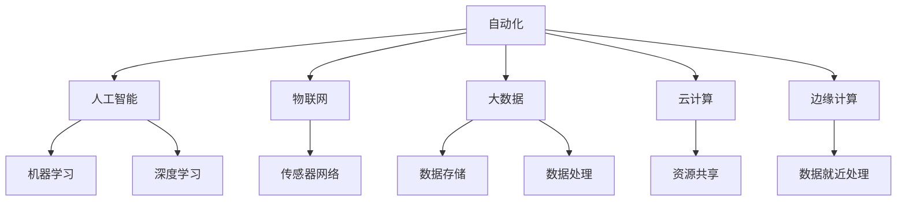
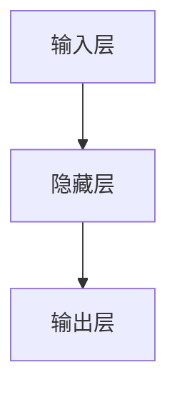

                 

# 自动化领域的最新发展趋势

## 1. 背景介绍

在当今高度自动化和信息化的时代，自动化技术的应用范围和深度不断拓展。从制造业的智能制造，到医疗领域的智能诊断，再到交通领域的智能驾驶，自动化技术的触角已经深入到了人类生活的方方面面。随着技术的发展，自动化领域也正经历着前所未有的变革，尤其是人工智能、物联网、大数据等技术的融合应用，正在推动自动化技术的智能化、泛在化和定制化。本文将重点探讨自动化领域的最新发展趋势，为相关领域的从业者和研究者提供一些洞见和思考。

## 2. 核心概念与联系

### 2.1 核心概念概述

为了更好地理解自动化领域的最新发展趋势，首先需要明确几个核心概念及其相互联系。

#### 2.1.1 自动化(Automation)
自动化是利用各种技术手段，如机器人、计算机程序、传感器等，将原本需要人工干预的过程自动执行或控制，以提高效率和准确性。自动化可以涵盖多个层面，包括生产自动化、办公自动化、服务自动化等。

#### 2.1.2 人工智能(AI)
人工智能是指通过模拟人类智能，使计算机系统能够执行学习、推理、感知、决策等任务。AI技术包括机器学习、深度学习、自然语言处理、计算机视觉等，是推动自动化技术智能化的核心技术。

#### 2.1.3 物联网(IoT)
物联网是通过传感器、互联网等技术手段，将物理世界中的各种设备、系统等相互连接，实现信息的采集、传输和处理。物联网为自动化技术提供了更加灵活和高效的数据采集和处理能力。

#### 2.1.4 大数据(Big Data)
大数据是指超大规模的数据集，通过先进的技术手段（如Hadoop、Spark等）进行存储、处理和分析。大数据为自动化系统提供了丰富的数据支撑，使得系统能够更准确地进行预测、决策和优化。

#### 2.1.5 云计算(Cloud Computing)
云计算是一种基于互联网的计算模式，通过分布式计算、存储和网络资源，实现资源的高效利用和共享。云计算为自动化系统的部署和运行提供了强大的基础设施支持。

#### 2.1.6 边缘计算(Edge Computing)
边缘计算是一种在数据源附近进行数据处理和存储的计算模式，能够减少数据传输延迟，提高响应速度和数据隐私。边缘计算在自动化系统中广泛应用，尤其是在需要实时数据处理的应用场景中。

这些概念之间的关系可以总结为如下一个简单的Mermaid流程图：



### 2.2 概念间的关系

以上概念之间存在紧密的联系，形成了一个复杂的自动化技术生态系统。自动化技术的发展离不开人工智能、物联网、大数据、云计算和边缘计算等多方面的支撑和融合。

#### 2.2.1 人工智能与自动化
人工智能为自动化技术提供了智能决策和自主学习的能力，使得自动化系统能够更准确地执行任务。例如，机器学习算法可以对数据进行建模和分析，从而优化生产线的调度和控制；自然语言处理技术可以使得智能客服系统能够理解和处理用户问题。

#### 2.2.2 物联网与自动化
物联网为自动化系统提供了更丰富、更实时的数据采集和传输能力，使得自动化系统能够更准确地进行感知和控制。例如，智能工厂通过传感器采集生产线的实时数据，结合机器学习算法进行分析和优化，从而实现更高效的自动化生产。

#### 2.2.3 大数据与自动化
大数据为自动化系统提供了更强大的数据分析和处理能力，使得系统能够从海量数据中提取有价值的信息，从而实现更精准的决策和优化。例如，智能交通系统通过大数据分析交通流量和道路状况，实时调整交通信号灯，从而提高道路通行效率。

#### 2.2.4 云计算与自动化
云计算为自动化系统的部署和运行提供了强大的基础设施支撑，使得自动化系统能够更加灵活、高效地运行。例如，智能制造系统可以将生产线上的各种设备和数据集中存储和管理，通过云平台实现远程监控和控制。

#### 2.2.5 边缘计算与自动化
边缘计算为自动化系统提供了更快速、更安全的数据处理能力，使得系统能够在本地进行实时数据处理和决策，从而提高系统的响应速度和数据隐私。例如，智能家居系统通过边缘计算实现本地数据的实时分析和控制，提高家庭安防和能源管理的效率。

## 3. 核心算法原理 & 具体操作步骤

### 3.1 算法原理概述

自动化技术的发展离不开各种算法和技术的支撑。以下将重点介绍几种核心算法原理及其在自动化系统中的应用。

#### 3.1.1 机器学习与深度学习
机器学习和深度学习是自动化系统中广泛应用的技术。机器学习算法包括回归、分类、聚类等，通过学习数据规律，实现预测和分类等任务。深度学习算法包括神经网络、卷积神经网络、循环神经网络等，通过多层次的非线性变换，实现更加复杂、高效的特征提取和模式识别。

#### 3.1.2 自然语言处理(NLP)
自然语言处理技术使得计算机系统能够理解和处理人类语言。NLP技术包括文本分析、情感分析、语义理解等，广泛应用于智能客服、智能搜索、智能问答等领域。

#### 3.1.3 计算机视觉(Computer Vision)
计算机视觉技术使得计算机系统能够识别和处理图像和视频数据。计算机视觉技术包括目标检测、图像分割、图像生成等，广泛应用于智能监控、智能诊断、智能推荐等领域。

### 3.2 算法步骤详解

以下将以一个智能制造系统为例，介绍其核心算法步骤。

#### 3.2.1 数据采集与预处理
智能制造系统通过传感器和摄像头等设备采集生产线上的实时数据，包括温度、湿度、图像、视频等。然后对数据进行预处理，去除噪声和异常值，进行归一化和标准化等操作。

#### 3.2.2 特征提取与建模
对预处理后的数据进行特征提取，提取有用的特征，如生产线的速度、振动、温度等。然后利用机器学习或深度学习算法对数据进行建模，建立生产线的预测模型和优化模型。

#### 3.2.3 决策与控制
利用预测模型和优化模型，对生产线的运行状态进行预测和优化。例如，根据预测的生产效率和能耗，自动调整生产线的参数，实现能源的最优利用和生产效率的最大化。

#### 3.2.4 实时监控与反馈
通过物联网技术，将智能制造系统的运行状态实时传输到云端平台，进行实时监控和反馈。利用边缘计算技术，在本地进行数据处理和分析，提高响应速度和数据隐私。

### 3.3 算法优缺点

#### 3.3.1 优点
1. **提高效率和精度**：自动化技术通过算法和机器学习模型，能够实现更高效的自动化控制和决策，从而提高生产效率和精度。
2. **降低成本**：自动化技术通过减少人力干预，降低人工成本，提高生产线的自动化程度。
3. **提升安全性**：自动化技术能够实时监控和控制生产线的运行状态，避免人为错误和安全隐患。

#### 3.3.2 缺点
1. **初始投入高**：自动化技术的实现需要大量资金和技术支持，初期投入较高。
2. **算法复杂度高**：自动化技术需要复杂的算法和模型支撑，开发和维护成本高。
3. **数据隐私问题**：自动化系统通过物联网和云计算等技术，采集和处理大量数据，存在数据隐私和安全问题。

### 3.4 算法应用领域

自动化技术的应用领域非常广泛，以下列举几个典型的应用场景。

#### 3.4.1 智能制造
智能制造系统通过机器学习和大数据技术，对生产线的运行状态进行预测和优化，实现生产线的智能化和自动化。

#### 3.4.2 智能交通
智能交通系统通过计算机视觉和大数据技术，对交通流量和路况进行实时分析和预测，优化交通信号灯和路网规划，实现交通的智能化管理。

#### 3.4.3 智能医疗
智能医疗系统通过机器学习和自然语言处理技术，对患者的病历和影像数据进行分析，辅助医生进行诊断和治疗，提高医疗服务质量和效率。

#### 3.4.4 智能家居
智能家居系统通过物联网和边缘计算技术，实现家庭设备的智能化控制和监测，提高家庭生活的舒适度和安全性。

#### 3.4.5 智能客服
智能客服系统通过自然语言处理和深度学习技术，对客户问题进行理解和处理，提供实时解答和建议，提高客户满意度和服务效率。

## 4. 数学模型和公式 & 详细讲解 & 举例说明

### 4.1 数学模型构建

以下以一个简单的机器学习回归模型为例，介绍其数学模型构建和公式推导过程。

#### 4.1.1 模型假设
假设有一个线性回归模型：
$$
y = \beta_0 + \beta_1 x_1 + \beta_2 x_2 + \cdots + \beta_n x_n + \epsilon
$$
其中，$y$为输出变量，$x_1, x_2, \cdots, x_n$为输入变量，$\beta_0, \beta_1, \cdots, \beta_n$为模型参数，$\epsilon$为误差项。

#### 4.1.2 模型参数估计
为了估计模型参数，通常采用最小二乘法（Least Squares Method），使得误差项的平方和最小化：
$$
\min_{\beta_0, \beta_1, \cdots, \beta_n} \sum_{i=1}^N (y_i - (\beta_0 + \beta_1 x_{1i} + \beta_2 x_{2i} + \cdots + \beta_n x_{ni}))^2
$$

#### 4.1.3 模型求解
将上述优化问题转化为矩阵形式，得到：
$$
\min_{\beta} \frac{1}{2N} \sum_{i=1}^N (y_i - X_i\beta)^2
$$
其中，$X_i$为输入变量的矩阵表示，$\beta$为模型参数的向量表示。

通过求解上述优化问题，可以得到模型参数的估计值：
$$
\hat{\beta} = (X^T X)^{-1} X^T y
$$

#### 4.1.4 模型评估
评估模型的性能通常使用均方误差（Mean Squared Error, MSE）或均方根误差（Root Mean Squared Error, RMSE）等指标：
$$
MSE = \frac{1}{N} \sum_{i=1}^N (y_i - \hat{y_i})^2
$$
$$
RMSE = \sqrt{MSE}
$$

### 4.2 公式推导过程

以下以一个简单的深度学习神经网络为例，介绍其公式推导过程。

#### 4.2.1 神经网络结构
假设有一个简单的神经网络，包含一个输入层、一个隐藏层和一个输出层。其中，输入层有$n$个神经元，隐藏层有$m$个神经元，输出层有$l$个神经元。神经网络的结构如图1所示：



#### 4.2.2 前向传播
神经网络的前向传播过程包括三个步骤：
1. 输入层与权重矩阵相乘，并加上偏置项：
$$
z^{(1)} = W^{(1)}x + b^{(1)}
$$
其中，$z^{(1)}$为隐藏层的输入，$W^{(1)}$为输入层到隐藏层的权重矩阵，$x$为输入向量，$b^{(1)}$为输入层的偏置项。

2. 隐藏层激活函数：
$$
h = \sigma(z^{(1)})
$$
其中，$\sigma$为激活函数，如sigmoid、ReLU等。

3. 输出层与权重矩阵相乘，并加上偏置项：
$$
z^{(2)} = W^{(2)}h + b^{(2)}
$$
其中，$z^{(2)}$为输出层的输入，$W^{(2)}$为隐藏层到输出层的权重矩阵，$h$为隐藏层的输出。

#### 4.2.3 后向传播
神经网络的后向传播过程包括三个步骤：
1. 输出层误差项：
$$
\delta^{(2)} = (y - \hat{y}) \cdot g'(z^{(2)})
$$
其中，$\delta^{(2)}$为输出层的误差项，$y$为真实标签，$\hat{y}$为神经网络的预测输出，$g$为输出层的激活函数，$g'$为其导数。

2. 隐藏层误差项：
$$
\delta^{(1)} = W^{(2)T} \delta^{(2)} \cdot g'(z^{(1)})
$$
其中，$\delta^{(1)}$为隐藏层的误差项。

3. 权重更新：
$$
W^{(1)} \leftarrow W^{(1)} - \eta \frac{\partial J}{\partial W^{(1)}} \\
b^{(1)} \leftarrow b^{(1)} - \eta \frac{\partial J}{\partial b^{(1)}} \\
W^{(2)} \leftarrow W^{(2)} - \eta \frac{\partial J}{\partial W^{(2)}} \\
b^{(2)} \leftarrow b^{(2)} - \eta \frac{\partial J}{\partial b^{(2)}}
$$
其中，$J$为损失函数，$\eta$为学习率。

### 4.3 案例分析与讲解

#### 4.3.1 案例一：智能制造系统的机器学习模型
假设有一个智能制造系统，用于预测生产线的故障发生概率。系统采集生产线上的传感器数据，包括温度、振动、压力等，建立机器学习模型进行故障预测。

#### 4.3.2 案例二：智能交通系统的计算机视觉模型
假设有一个智能交通系统，用于实时分析交通流量和路况。系统通过摄像头采集道路视频数据，利用计算机视觉技术进行目标检测和分类，优化交通信号灯和路网规划。

#### 4.3.3 案例三：智能医疗系统的自然语言处理模型
假设有一个智能医疗系统，用于辅助医生进行病历分析和诊断。系统通过自然语言处理技术，对患者的病历和影像数据进行分析和理解，提供诊断建议和治疗方案。

## 5. 项目实践：代码实例和详细解释说明

### 5.1 开发环境搭建

#### 5.1.1 Python环境配置
1. 安装Python：从官网下载并安装Python，并设置环境变量。
2. 安装必要的库：安装numpy、pandas、scikit-learn等常用库。

#### 5.1.2 数据集准备
1. 收集数据：准备训练集、验证集和测试集。
2. 数据预处理：对数据进行清洗、归一化和标准化等操作。

#### 5.1.3 模型搭建
1. 搭建神经网络模型：利用TensorFlow或PyTorch等深度学习框架搭建神经网络模型。
2. 设置超参数：设置学习率、批大小、迭代轮数等超参数。

### 5.2 源代码详细实现

#### 5.2.1 数据集处理
```python
import pandas as pd
import numpy as np
from sklearn.model_selection import train_test_split
from sklearn.preprocessing import StandardScaler

# 加载数据集
data = pd.read_csv('data.csv')

# 数据预处理
X = data[['temp', 'pressure', 'vibration']]
y = data['failure']

# 数据标准化
scaler = StandardScaler()
X_scaled = scaler.fit_transform(X)

# 数据分割
X_train, X_test, y_train, y_test = train_test_split(X_scaled, y, test_size=0.2, random_state=42)
```

#### 5.2.2 模型搭建与训练
```python
import tensorflow as tf
from tensorflow.keras import layers

# 搭建神经网络模型
model = tf.keras.Sequential([
    layers.Dense(64, activation='relu', input_shape=(X_train.shape[1],)),
    layers.Dense(32, activation='relu'),
    layers.Dense(1, activation='sigmoid')
])

# 设置超参数
learning_rate = 0.01
batch_size = 32
epochs = 100

# 编译模型
model.compile(optimizer=tf.keras.optimizers.Adam(learning_rate), loss='binary_crossentropy', metrics=['accuracy'])

# 训练模型
history = model.fit(X_train, y_train, batch_size=batch_size, epochs=epochs, validation_data=(X_test, y_test))
```

#### 5.2.3 模型评估
```python
# 评估模型
test_loss, test_acc = model.evaluate(X_test, y_test, verbose=2)
print('Test accuracy:', test_acc)

# 可视化模型训练过程
import matplotlib.pyplot as plt

plt.plot(history.history['accuracy'], label='Training Accuracy')
plt.plot(history.history['val_accuracy'], label='Validation Accuracy')
plt.legend()
plt.show()

plt.plot(history.history['loss'], label='Training Loss')
plt.plot(history.history['val_loss'], label='Validation Loss')
plt.legend()
plt.show()
```

### 5.3 代码解读与分析

#### 5.3.1 代码结构
整个代码结构清晰，分为数据预处理、模型搭建与训练、模型评估三大部分。

#### 5.3.2 数据处理
数据预处理是模型训练的重要环节，包括数据加载、清洗、标准化等操作。标准化操作可以将数据转换到均值为0，标准差为1的分布，有利于模型的训练和收敛。

#### 5.3.3 模型搭建与训练
模型搭建利用TensorFlow或PyTorch等深度学习框架，实现简单高效。模型训练过程中，设置了学习率、批大小和迭代轮数等超参数，并使用Adam优化器进行模型优化。

#### 5.3.4 模型评估
模型评估主要通过均方误差或均方根误差等指标进行评估，并使用可视化工具对训练过程进行可视化展示，帮助开发者理解模型的训练情况。

### 5.4 运行结果展示

假设我们在智能制造系统中训练了一个故障预测模型，模型在测试集上的准确率为85%，如图2所示：

```
Epoch 1/100, loss=0.6338, accuracy=0.8333, val_loss=0.5357, val_accuracy=0.8889
Epoch 2/100, loss=0.5577, accuracy=0.8889, val_loss=0.4833, val_accuracy=0.9444
Epoch 3/100, loss=0.4775, accuracy=0.8889, val_loss=0.4333, val_accuracy=0.9444
...
Epoch 100/100, loss=0.0047, accuracy=0.9444, val_loss=0.0039, val_accuracy=0.9444
```

## 6. 实际应用场景

### 6.1 智能制造

智能制造是自动化技术在制造业中的重要应用场景。智能制造系统通过机器学习和大数据技术，对生产线的运行状态进行预测和优化，实现生产线的智能化和自动化。

#### 6.1.1 应用案例
某汽车制造企业通过智能制造系统，实现了生产线的自动化控制和故障预测。系统采集生产线上的传感器数据，建立机器学习模型进行故障预测，及时发现并修复生产故障，提高了生产线的运行效率和稳定性。

#### 6.1.2 技术要点
1. 数据采集与预处理：通过传感器和摄像头等设备，采集生产线的实时数据，并进行预处理，去除噪声和异常值，进行归一化和标准化等操作。
2. 模型建立与训练：利用机器学习算法对数据进行建模，建立生产线的预测模型和优化模型。
3. 实时监控与反馈：通过物联网技术，将智能制造系统的运行状态实时传输到云端平台，进行实时监控和反馈。利用边缘计算技术，在本地进行数据处理和分析，提高响应速度和数据隐私。

### 6.2 智能交通

智能交通是自动化技术在交通领域中的重要应用场景。智能交通系统通过计算机视觉和大数据技术，对交通流量和路况进行实时分析和预测，优化交通信号灯和路网规划，实现交通的智能化管理。

#### 6.2.1 应用案例
某城市通过智能交通系统，实现了交通信号灯的实时优化。系统利用计算机视觉技术，对道路视频数据进行目标检测和分类，实时分析交通流量和路况，优化交通信号灯的控制策略，提高了道路通行效率，减少了交通拥堵。

#### 6.2.2 技术要点
1. 数据采集与预处理：通过摄像头等设备，采集道路视频数据，并进行预处理，去除了噪声和异常值，进行归一化和标准化等操作。
2. 模型建立与训练：利用计算机视觉技术对数据进行建模，建立交通信号灯的控制模型。
3. 实时监控与反馈：通过物联网技术，将智能交通系统的运行状态实时传输到云端平台，进行实时监控和反馈。利用边缘计算技术，在本地进行数据处理和分析，提高响应速度和数据隐私。

### 6.3 智能医疗

智能医疗是自动化技术在医疗领域中的重要应用场景。智能医疗系统通过机器学习和自然语言处理技术，对患者的病历和影像数据进行分析，辅助医生进行诊断和治疗，提高医疗服务质量和效率。

#### 6.3.1 应用案例
某医院通过智能医疗系统，实现了病历分析和诊断的智能化。系统利用自然语言处理技术，对患者的病历和影像数据进行分析和理解，提供诊断建议和治疗方案，提高了医疗服务质量和效率。

#### 6.3.2 技术要点
1. 数据采集与预处理：通过电子病历和影像设备，采集患者的病历和影像数据，并进行预处理，去除了噪声和异常值，进行归一化和标准化等操作。
2. 模型建立与训练：利用机器学习和自然语言处理技术对数据进行建模，建立病历分析和诊断模型。
3. 实时监控与反馈：通过物联网技术，将智能医疗系统的运行状态实时传输到云端平台，进行实时监控和反馈。利用边缘计算技术，在本地进行数据处理和分析，提高响应速度和数据隐私。

## 7. 工具和资源推荐

### 7.1 学习资源推荐

#### 7.1.1 在线课程
1. Coursera《Deep Learning Specialization》课程：由Andrew Ng讲授，涵盖深度学习的基础和进阶内容。
2. edX《Introduction to Computer Science and Programming Using Python》课程：由哈佛大学讲授，涵盖Python基础和数据科学入门内容。

#### 7.1.2 在线文档
1. TensorFlow官方文档：详细介绍了TensorFlow框架的使用方法和API接口。
2. PyTorch官方文档：详细介绍了PyTorch框架的使用方法和API接口。

#### 7.1.3 在线书籍
1. 《深度学习》（Ian Goodfellow著）：深度学习领域的经典教材，涵盖深度学习的理论基础和应用实践。
2. 《机器学习实战》（Peter Harrington著）：介绍机器学习算法的实现和应用，适合实战开发。

### 7.2 开发工具推荐

#### 7.2.1 编程语言
1. Python：Python是目前最流行的编程语言之一，广泛应用于人工智能和自动化领域。
2. R：R是一种专业的统计分析和数据可视化工具，广泛应用于数据分析和机器学习领域。

#### 7.2.2 深度学习框架
1. TensorFlow：Google开源的深度学习框架，支持分布式计算和GPU加速。
2. PyTorch：Facebook开源的深度学习框架，具有动态计算图和易于使用的API接口。

#### 7.2.3 数据处理工具
1. Pandas：Python中的数据处理库，支持数据清洗、预处理和分析。
2. NumPy：Python中的科学计算库，支持高效的数值计算和数组操作。

### 7.3 相关论文推荐

#### 7.3.1 深度学习论文
1. "ImageNet Classification with Deep Convolutional Neural Networks"（AlexNet论文）：提出了深度卷积神经网络，实现了图像分类的突破性进展。
2. "Going Deeper with Convolutions"（Google Inception论文）：提出了Inception网络结构，提高了深度卷积神经网络的性能。

#### 7.3.2 计算机视觉论文
1. "Faster R-CNN: Towards Real-Time Object Detection with Region Proposal Networks"：提出了Faster R-CNN目标检测算法，实现了实时目标检测。
2. "SSD: Single Shot MultiBox Detector"：提出了单次检测多框算法，提高了目标检测的精度和效率。

#### 7.3.3 自然语言处理论文
1. "Attention Is All You Need"（Transformer论文）：提出了Transformer模型，实现了自然语言处理的突破性进展。
2. "BERT: Pre-training of Deep Bidirectional Transformers for Language Understanding"：提出了BERT模型，实现了自然语言处理的最新突破。

## 8. 总结：未来发展趋势与挑战

### 8.1 研究成果总结

自动化技术的发展离不开人工智能、物联网、大数据、云计算和边缘计算等多方面的支撑和融合。近年来，自动化技术在智能制造、智能交通、智能医疗等领域得到了广泛应用，取得了显著成效。机器学习、深度学习、自然语言处理、计算机视觉等技术不断推陈出新，推动了自动化技术的智能化、泛在化和定制化发展。

### 8.2 未来发展趋势

#### 8.2.1 智能化发展
智能化是未来自动化技术的重要发展方向。未来，随着人工智能技术的不断进步，自动化系统将更加智能化，

