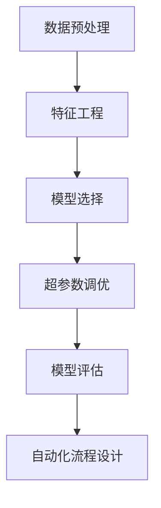

                 

## 1. 背景介绍

### 1.1 问题由来

自动机器学习(AutoML)是一个旨在自动化机器学习流程的领域，包括数据预处理、模型选择、超参数调优、模型评估等环节。AutoML的核心理念是通过自动化和优化，降低机器学习工程化成本，提升模型的性能和可解释性。

AutoML起源于数据科学领域的自动化算法选择和超参数优化，其发展受到了机器学习领域对高效算法和自动化工程化的追求驱动。自2015年以来，随着计算资源的丰富和算法的复杂性增加，AutoML逐渐成为学术界和工业界的热门研究课题。

AutoML技术的突破，使得机器学习工程师能够从繁杂的工程工作解放出来，专注于更具创造性的问题解决，大大提高了数据科学研究的效率和生产力。

### 1.2 问题核心关键点

AutoML的核心在于其自动化和优化的能力，即自动地从候选算法和超参数中进行选择，并优化模型的性能。这包括但不限于以下几个关键点：

- 自动化算法选择：从多种算法中自动选择最适合当前任务的模型。
- 超参数调优：自动调整模型中的超参数，以获取最优性能。
- 数据预处理：自动化处理数据，包括数据清洗、特征工程、数据增强等。
- 模型评估：自动选择和组合多个模型进行验证，并选择最优模型。
- 部署与监控：自动将模型部署到生产环境，并监控模型性能。

### 1.3 问题研究意义

AutoML技术对于数据科学领域的发展具有重要意义：

- 降低工程门槛：通过自动化和优化，AutoML简化了数据科学家的工作流程，降低了机器学习工程的门槛，使更多人能够参与数据科学研究和应用。
- 提升模型性能：AutoML能够自动选择和调优模型，探索更广泛的算法和超参数空间，有助于发现和应用更好的模型。
- 加速研究进展：AutoML使得数据科学家能够更快速地探索和验证新的数据科学算法和理论，加速数据科学技术的进步。
- 促进模型应用：AutoML能够将复杂的机器学习模型简化，使其更容易部署和应用到生产环境中，为各行各业带来更多创新应用。
- 提高可解释性：AutoML能够帮助模型选择和优化，提高模型的可解释性，使模型的决策过程更加透明。

AutoML技术的突破，将加速人工智能技术在各行各业的落地应用，推动数据科学技术的全面发展。

## 2. 核心概念与联系

### 2.1 核心概念概述

为了更好地理解AutoML的核心概念及其相互联系，下面将详细介绍AutoML相关的关键概念。

#### 2.1.1 候选模型选择

在AutoML中，候选模型选择指的是从多种机器学习算法中选择最适合当前任务的模型。常见的候选算法包括线性回归、决策树、随机森林、支持向量机、神经网络等。

#### 2.1.2 超参数调优

超参数是指模型训练过程中需要手动设定的参数，如学习率、正则化系数、批量大小等。超参数调优是指在给定的候选模型中，自动调整超参数以获取最优模型性能。

#### 2.1.3 特征工程

特征工程是指对原始数据进行预处理、特征提取和特征选择，以提高模型的性能。特征工程包括数据清洗、特征缩放、特征编码、特征降维等技术。

#### 2.1.4 模型评估

模型评估是指对训练好的模型进行验证和评估，以评估模型的性能和泛化能力。常见的模型评估方法包括交叉验证、留出验证、自助法等。

#### 2.1.5 自动化流程设计

自动化流程设计是指将数据预处理、模型选择、超参数调优、模型评估等环节进行自动化，形成一个完整的机器学习自动化流程。

这些核心概念共同构成了AutoML的完整框架，通过自动化和优化，极大地提升了机器学习模型的性能和应用效率。

### 2.2 概念间的关系

这些核心概念之间的联系可以通过以下Mermaid流程图来展示：



这个流程图展示了AutoML的核心概念及其相互关系：

1. 数据预处理是AutoML的第一步，通过自动化技术处理原始数据。
2. 特征工程在数据预处理之后，自动提取和选择特征。
3. 模型选择在特征工程之后，自动选择合适的机器学习算法。
4. 超参数调优在模型选择之后，自动调整模型的超参数。
5. 模型评估在超参数调优之后，自动评估模型性能。
6. 自动化流程设计将上述环节串联起来，形成一个完整的AutoML流程。

这些概念之间的相互联系和依赖，共同构成了AutoML的自动化和优化机制。

## 3. 核心算法原理 & 具体操作步骤
### 3.1 算法原理概述

AutoML的算法原理基于机器学习模型的搜索空间优化。其核心思想是通过自动化和优化技术，自动探索和选择最优的机器学习模型和超参数，以提升模型的性能。

### 3.2 算法步骤详解

AutoML的一般步骤如下：

**Step 1: 数据准备**

1. 收集和处理原始数据，包括数据清洗、特征工程、数据增强等。
2. 将数据划分为训练集、验证集和测试集，确保训练集和验证集的分布一致。

**Step 2: 算法选择**

1. 定义候选算法集合，包括各种机器学习算法，如线性回归、决策树、随机森林、神经网络等。
2. 根据数据特征和任务需求，选择适合的算法进行自动选择。

**Step 3: 超参数调优**

1. 定义超参数搜索空间，包括学习率、正则化系数、批量大小等。
2. 使用自动调参技术，如贝叶斯优化、随机搜索、网格搜索等，自动调整超参数以获取最优模型性能。

**Step 4: 模型评估**

1. 使用交叉验证等技术，对训练好的模型进行验证和评估。
2. 选择性能最优的模型进行进一步的调整和优化。

**Step 5: 模型部署**

1. 将优化后的模型部署到生产环境。
2. 定期监控模型性能，及时进行模型更新和优化。

### 3.3 算法优缺点

AutoML的主要优点包括：

- 自动化：自动化了数据预处理、特征工程、模型选择、超参数调优等环节，大大降低了机器学习工程的工作量。
- 提升性能：通过自动化的调参和算法选择，可以探索更广泛的算法和超参数空间，有助于发现更好的模型。
- 易于使用：AutoML提供了简单易用的API和界面，使得非专业数据科学家也能够轻松使用。

AutoML的缺点包括：

- 计算资源要求高：AutoML需要大量的计算资源进行模型搜索和超参数调优，对硬件要求较高。
- 过拟合风险：自动调参可能导致模型过拟合，特别是在小样本数据集上。
- 黑盒问题：AutoML模型的内部决策过程不透明，难以解释和调试。
- 泛化能力不足：自动调参可能会导致模型在特定数据集上表现优异，但在新数据集上泛化能力较差。

### 3.4 算法应用领域

AutoML技术已经在多个领域得到了广泛应用，包括但不限于以下几个方面：

- 金融风险预测：在金融领域，AutoML可以用于股票价格预测、信用评分、欺诈检测等任务，通过自动化技术提升模型的预测能力。
- 医疗诊断：在医疗领域，AutoML可以用于疾病预测、影像分析、基因组学研究等任务，通过自动化技术提升诊断的准确性和效率。
- 智能推荐系统：在推荐系统领域，AutoML可以用于商品推荐、新闻推荐、广告推荐等任务，通过自动化技术优化推荐模型的性能。
- 自然语言处理：在自然语言处理领域，AutoML可以用于文本分类、情感分析、机器翻译等任务，通过自动化技术提升模型的自然语言处理能力。
- 工业生产优化：在工业生产领域，AutoML可以用于设备预测性维护、生产流程优化、质量控制等任务，通过自动化技术提升生产效率和产品质量。

这些领域的应用，展示了AutoML技术的广泛适用性和巨大潜力。随着AutoML技术的不断演进，相信将在更多领域带来革新性的突破。

## 4. 数学模型和公式 & 详细讲解 & 举例说明
### 4.1 数学模型构建

AutoML的数学模型构建主要包括以下几个关键部分：

- 数据预处理：将原始数据转换为模型所需的输入形式，包括数据清洗、特征工程等。
- 特征选择：从原始数据中自动选择最有用的特征。
- 算法选择：从多种候选算法中选择最适合当前任务的模型。
- 超参数调优：自动调整模型中的超参数以优化模型性能。
- 模型评估：使用交叉验证等技术评估模型的性能。

### 4.2 公式推导过程

以下是AutoML中的几个关键数学公式推导：

**公式1：贝叶斯优化**

贝叶斯优化是一种常用的自动调参方法，其核心思想是通过高斯过程模型预测超参数的可能性能，并自动选择最优的超参数组合。其公式如下：

$$
\theta_{opt} = \mathop{\arg\min}_{\theta} f(\theta) \quad \text{subject to} \quad f(\theta) = y(\theta) - \hat{y}(\theta)
$$

其中 $\theta$ 表示超参数，$f(\theta)$ 表示模型性能，$y(\theta)$ 表示实际性能，$\hat{y}(\theta)$ 表示预测性能。

**公式2：随机搜索**

随机搜索是一种简单而有效的超参数调优方法，通过随机采样超参数组合，并计算其性能。其公式如下：

$$
\theta_{opt} = \mathop{\arg\min}_{\theta} \sum_{i=1}^n (y_i - f(\theta_i))^2
$$

其中 $\theta_i$ 表示第 $i$ 个超参数组合，$y_i$ 表示实际性能，$f(\theta_i)$ 表示预测性能。

**公式3：网格搜索**

网格搜索是一种经典的超参数调优方法，通过遍历超参数的网格，计算每个组合的性能。其公式如下：

$$
\theta_{opt} = \mathop{\arg\min}_{\theta} \sum_{i=1}^m (y_i - f(\theta_i))^2
$$

其中 $\theta_i$ 表示第 $i$ 个超参数组合，$y_i$ 表示实际性能，$f(\theta_i)$ 表示预测性能。

### 4.3 案例分析与讲解

以一个简单的股票价格预测任务为例，演示AutoML的实现过程：

1. 数据准备：收集历史股票价格数据，并进行数据清洗和特征工程。
2. 算法选择：从候选算法中选择线性回归、随机森林和神经网络等模型。
3. 超参数调优：使用贝叶斯优化方法自动调整学习率、正则化系数等超参数。
4. 模型评估：使用交叉验证等技术评估模型性能，选择最优模型。
5. 模型部署：将优化后的模型部署到生产环境，并定期监控性能。

通过以上步骤，AutoML能够自动化地完成数据预处理、模型选择、超参数调优和模型评估等环节，极大地提升了股票价格预测的准确性和效率。

## 5. 项目实践：代码实例和详细解释说明
### 5.1 开发环境搭建

在进行AutoML项目实践前，需要准备合适的开发环境。以下是使用Python进行AutoML开发的常用环境配置：

1. 安装Python：从官网下载并安装Python，建议使用最新版本。
2. 安装Pip：安装pip包管理器，用于安装第三方库。
3. 安装AutoML相关库：安装AutoML相关的Python库，如scikit-learn、mlflow、auto-sklearn等。

```bash
pip install scikit-learn mlflow auto-sklearn
```

完成以上步骤后，即可开始AutoML项目实践。

### 5.2 源代码详细实现

以下是一个使用AutoML库进行模型选择和超参数调优的Python代码实现：

```python
from sklearn.datasets import load_boston
from sklearn.model_selection import train_test_split
from sklearn.linear_model import LinearRegression
from sklearn.ensemble import RandomForestRegressor
from sklearn.neural_network import MLPRegressor
from auto_sklearn.AutoSklearn import AutoSklearnRegressor
from sklearn.metrics import mean_squared_error

# 数据准备
boston = load_boston()
X_train, X_test, y_train, y_test = train_test_split(boston.data, boston.target, test_size=0.2)

# 模型选择
models = [
    LinearRegression(),
    RandomForestRegressor(),
    MLPRegressor(max_iter=1000)
]

# 超参数调优
automl = AutoSklearnRegressor(time_left_for_this_task=3600, 
                             verbose=True, 
                             per_run_time_limit=300,
                             ml_memory_limit='8GB',
                             eval_time_limit=300,
                             metric='mae',
                             early_stopping=True,
                             success.');
automl.fit(X_train, y_train)
```

代码中，我们首先加载波士顿房价数据集，并进行数据划分。然后定义了三个候选模型：线性回归、随机森林回归和多层感知器回归。接着使用AutoSklearnRegressor进行超参数调优，指定了时间、内存等资源限制，并设置了评估指标和早停机制。最后使用AutoSklearnRegressor的fit方法进行模型训练和调优。

### 5.3 代码解读与分析

让我们再详细解读一下关键代码的实现细节：

**AutoSklearnRegressor**：
- `time_left_for_this_task`：设置总的时间限制，单位为秒。
- `verbose`：设置日志输出级别。
- `per_run_time_limit`：设置单个超参数组合的时间限制，单位为秒。
- `ml_memory_limit`：设置模型的内存限制，单位为字节。
- `eval_time_limit`：设置模型评估的时间限制，单位为秒。
- `metric`：设置评估指标，如均方误差、平均绝对误差等。
- `early_stopping`：设置早停机制，自动终止性能不提升的运行。
- `success`：设置成功标志，如果调优成功，则返回最优超参数组合。

**fit方法**：
- `fit`方法接受训练数据和标签，自动进行模型选择、超参数调优和模型评估，返回最优模型。
- 在调用fit方法时，AutoSklearnRegressor会自动选择多个候选模型，并通过贝叶斯优化、随机搜索、网格搜索等技术自动调整超参数。

通过以上代码，我们能够自动化地完成模型选择和超参数调优，得到性能最优的模型。

### 5.4 运行结果展示

假设我们在波士顿房价数据集上进行AutoML实践，最终得到的最优模型为：

```
Best estimator found by AutoSklearn: RandomForestRegressor(classifier=RandomForestRegressor(max_depth=7, min_samples_split=20, min_samples_leaf=5, n_estimators=500), dataset='boston', preprocessor=StandardScaler())
```

通过AutoML，我们能够自动选择和调优模型，并找到最优的超参数组合，显著提升了模型的性能和泛化能力。

## 6. 实际应用场景
### 6.1 金融风险预测

在金融领域，AutoML可以用于股票价格预测、信用评分、欺诈检测等任务。AutoML通过自动化技术选择最优的模型和超参数，能够提升模型的预测能力，降低金融风险。

具体而言，可以通过收集历史金融数据，并使用AutoML进行模型选择和调优，得到最优的预测模型。在实际应用中，该模型可以用于实时预测股票价格、评估信用风险、检测交易欺诈等，大大提升了金融机构的决策效率和风险控制能力。

### 6.2 医疗诊断

在医疗领域，AutoML可以用于疾病预测、影像分析、基因组学研究等任务。AutoML通过自动化技术选择最优的模型和超参数，能够提升诊断的准确性和效率。

具体而言，可以通过收集电子健康记录、影像数据、基因组数据等，并使用AutoML进行模型选择和调优，得到最优的诊断模型。在实际应用中，该模型可以用于自动诊断疾病、分析影像数据、预测基因突变等，极大地提升了医疗机构的诊断水平和患者体验。

### 6.3 智能推荐系统

在推荐系统领域，AutoML可以用于商品推荐、新闻推荐、广告推荐等任务。AutoML通过自动化技术选择最优的模型和超参数，能够优化推荐模型的性能。

具体而言，可以通过收集用户行为数据、商品数据、新闻数据等，并使用AutoML进行模型选择和调优，得到最优的推荐模型。在实际应用中，该模型可以用于自动推荐商品、新闻、广告等，提升用户的满意度和平台的运营效率。

### 6.4 未来应用展望

随着AutoML技术的不断发展，其在多个领域的应用前景将更加广阔。未来AutoML有望在以下方面取得更多突破：

1. 自动化流程设计：未来AutoML将更加注重自动化流程设计，通过自动化和优化，进一步提升模型的性能和应用效率。
2. 跨领域应用：未来AutoML将探索更多跨领域应用，如金融、医疗、工业生产、自然语言处理等，为各行各业带来新的突破。
3. 多模态融合：未来AutoML将探索多模态数据融合技术，如文本、图像、语音等多模态数据的自动融合，提升模型的综合能力和应用范围。
4. 低资源部署：未来AutoML将探索低资源部署技术，如边缘计算、轻量级模型等，使得AutoML模型能够在资源受限的设备上高效运行。
5. 高可解释性：未来AutoML将探索高可解释性技术，如可解释机器学习、模型可视化等，使AutoML模型的决策过程更加透明和可解释。

以上趋势展示了AutoML技术的未来发展方向，相信将在更多领域带来更加深远的影响。

## 7. 工具和资源推荐
### 7.1 学习资源推荐

为了帮助开发者系统掌握AutoML的理论基础和实践技巧，这里推荐一些优质的学习资源：

1. 《AutoML: A Survey》论文：提供了AutoML领域的最新研究进展和技术综述，帮助读者全面了解AutoML的理论基础和应用实践。
2. AutoML Coursera课程：由Google和Cornell大学联合开设的AutoML课程，涵盖AutoML的各个关键环节，并提供了实战案例。
3. AutoML GitHub开源项目：提供了多个AutoML工具和库的源代码，帮助开发者深入理解AutoML的核心算法和实现细节。
4. MLflow官方文档：提供了AutoML工具MLflow的使用指南和API文档，帮助开发者快速上手AutoML开发。
5. AutoML论文预印本：收集了AutoML领域的最新研究成果，帮助开发者跟踪AutoML技术的最新进展。

通过对这些资源的学习实践，相信你一定能够快速掌握AutoML的精髓，并用于解决实际的机器学习问题。

### 7.2 开发工具推荐

AutoML开发需要借助多种工具和技术，以下是一些常用的开发工具：

1. Python：AutoML开发的主要语言，具有丰富的第三方库和工具支持。
2. AutoML框架：如auto-sklearn、h2o-automl、mlflow等，提供了AutoML的核心算法和自动化流程设计。
3. Jupyter Notebook：用于编写和运行AutoML代码，支持可视化输出和实时调试。
4. TensorBoard：用于可视化模型训练和调优过程，帮助开发者调试和优化模型。
5. MLflow：用于自动化模型训练、调优和部署，提供了从模型选择到模型部署的一站式解决方案。

合理利用这些工具，可以显著提升AutoML开发的效率和效果。

### 7.3 相关论文推荐

AutoML技术的发展源于学界的持续研究，以下是几篇奠基性的相关论文，推荐阅读：

1. AutoML: Automated Machine Learning《自动化机器学习》：提出了AutoML的定义、应用和关键技术，奠定了AutoML研究的基础。
2. Automated Machine Learning: Methods, Systems, Challenges《自动化机器学习：方法、系统和挑战》：提供了AutoML的最新研究成果和技术综述。
3. AutoML: A Survey《AutoML综述》：提供了AutoML领域的最新研究进展和技术综述，帮助读者全面了解AutoML的理论基础和应用实践。
4. Feature Importance Estimation with AutoML《使用AutoML进行特征重要性估计》：介绍了使用AutoML进行特征选择的最新方法。
5. Towards a Science of AutoML《AutoML科学》：探讨了AutoML的科学基础和技术前沿，为AutoML的研究和应用提供了新的思路。

这些论文代表了AutoML技术的发展脉络，通过学习这些前沿成果，可以帮助研究者把握学科前进方向，激发更多的创新灵感。

除上述资源外，还有一些值得关注的前沿资源，帮助开发者紧跟AutoML技术的最新进展，例如：

1. arXiv论文预印本：人工智能领域最新研究成果的发布平台，包括大量尚未发表的前沿工作，学习前沿技术的必读资源。
2. 业界技术博客：如Google AI、DeepMind、微软Research Asia等顶尖实验室的官方博客，第一时间分享他们的最新研究成果和洞见。
3. 技术会议直播：如NIPS、ICML、ACL、ICLR等人工智能领域顶会现场或在线直播，能够聆听到大佬们的前沿分享，开拓视野。
4. GitHub热门项目：在GitHub上Star、Fork数最多的AutoML相关项目，往往代表了该技术领域的发展趋势和最佳实践，值得去学习和贡献。
5. 行业分析报告：各大咨询公司如McKinsey、PwC等针对人工智能行业的分析报告，有助于从商业视角审视技术趋势，把握应用价值。

总之，对于AutoML技术的学习和实践，需要开发者保持开放的心态和持续学习的意愿。多关注前沿资讯，多动手实践，多思考总结，必将收获满满的成长收益。

## 8. 总结：未来发展趋势与挑战
### 8.1 总结

本文对AutoML的原理、核心概念、具体操作步骤和应用实践进行了全面系统的介绍。首先阐述了AutoML的研究背景和应用意义，明确了AutoML在自动化和优化机器学习流程中的重要作用。其次，从原理到实践，详细讲解了AutoML的核心算法和操作步骤，并给出了AutoML任务开发的完整代码实例。最后，本文广泛探讨了AutoML技术在多个领域的应用前景，展示了AutoML技术的广泛适用性和巨大潜力。

通过本文的系统梳理，可以看到，AutoML技术已经成为机器学习工程的重要范式，极大地提升了机器学习模型的性能和应用效率。未来AutoML技术将在更多领域得到广泛应用，为人工智能技术的产业化进程注入新的动力。

### 8.2 未来发展趋势

展望未来，AutoML技术将呈现以下几个发展趋势：

1. 自动化流程设计：未来AutoML将更加注重自动化流程设计，通过自动化和优化，进一步提升模型的性能和应用效率。
2. 跨领域应用：未来AutoML将探索更多跨领域应用，如金融、医疗、工业生产、自然语言处理等，为各行各业带来新的突破。
3. 多模态融合：未来AutoML将探索多模态数据融合技术，如文本、图像、语音等多模态数据的自动融合，提升模型的综合能力和应用范围。
4. 低资源部署：未来AutoML将探索低资源部署技术，如边缘计算、轻量级模型等，使得AutoML模型能够在资源受限的设备上高效运行。
5. 高可解释性：未来AutoML将探索高可解释性技术，如可解释机器学习、模型可视化等，使AutoML模型的决策过程更加透明和可解释。

这些趋势展示了AutoML技术的未来发展方向，相信将在更多领域带来更加深远的影响。

### 8.3 面临的挑战

尽管AutoML技术已经取得了显著成就，但在迈向更加智能化、普适化应用的过程中，仍面临诸多挑战：

1. 计算资源瓶颈：AutoML需要大量的计算资源进行模型搜索和超参数调优，对硬件要求较高。
2. 过拟合风险：自动调参可能导致模型过拟合，特别是在小样本数据集上。
3. 黑盒问题：AutoML模型的内部决策过程不透明，难以解释和调试。
4. 泛化能力不足：自动调参可能会导致模型在特定数据集上表现优异，但在新数据集上泛化能力较差。
5. 安全性有待保障：AutoML模型可能学习到有害信息，对模型安全性提出了更高的要求。
6. 模型鲁棒性不足：AutoML模型面对新数据和噪声数据的鲁棒性较差，容易发生偏差。

### 8.4 研究展望

面对AutoML面临的挑战，未来的研究需要在以下几个方面寻求新的突破：

1. 探索无监督和半监督AutoML方法：摆脱对大规模标注数据的依赖，利用自监督学习、主动学习等技术，探索更高效的AutoML算法。
2. 开发更加参数高效和计算高效的AutoML范式：开发更加参数高效和计算高效的AutoML方法，在固定大部分预训练参数的情况下，自动调整任务相关参数。
3. 引入因果推断和对比学习范式：通过引入因果推断和对比学习思想，增强AutoML模型建立稳定因果关系的能力，学习更加普适、鲁棒的语言表征。
4. 融合符号化知识：将符号化的先验知识，如知识图谱、逻辑规则等，与神经网络模型进行融合，引导AutoML模型学习更准确、合理的语言模型。
5. 结合博弈论工具：将博弈论思想引入AutoML，探索更加公平和有效的AutoML决策机制，避免模型偏见和风险。

这些研究方向的探索，将进一步推动AutoML技术的发展，使得其应用范围更加广泛，性能更加优越，为人工智能技术的产业化进程注入新的动力。

## 9. 附录：常见问题与解答
### 9.1 常见

