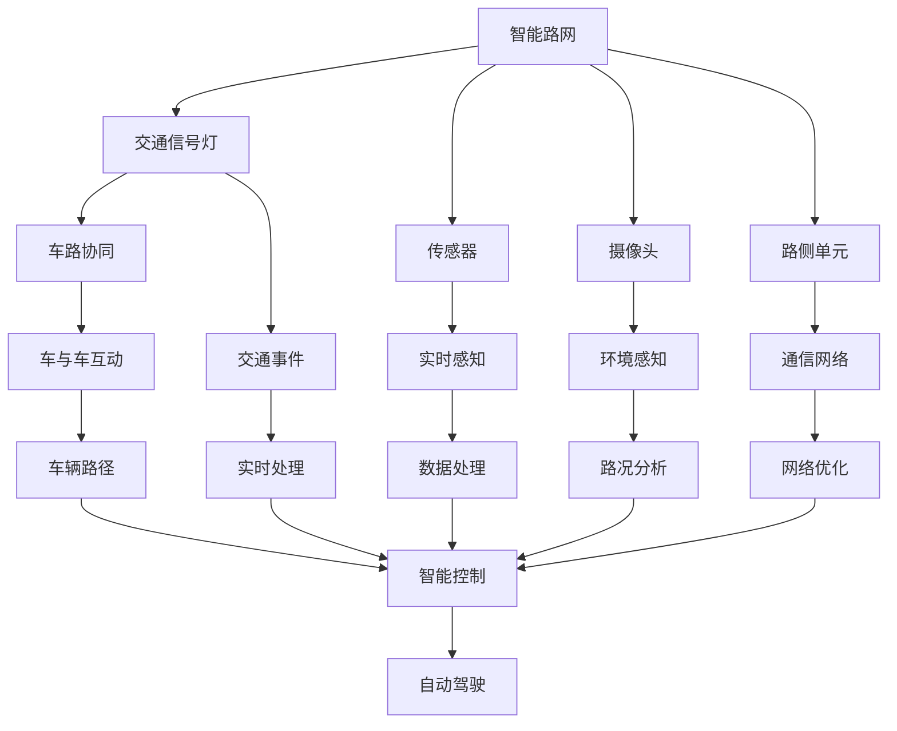
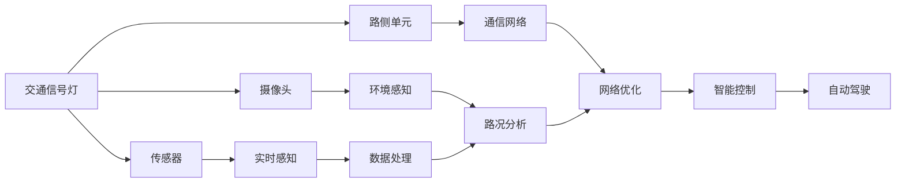
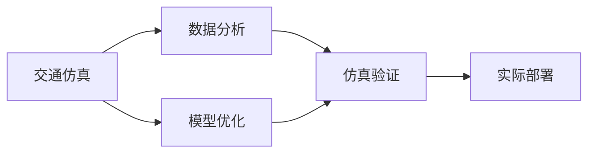

                 

# 自动驾驶中的智能路网与交通规则优化

> 关键词：自动驾驶, 智能路网, 交通规则优化, 交通信号灯控制, 车辆行为预测, 多车互动, 交通仿真

## 1. 背景介绍

### 1.1 问题由来
随着全球汽车行业智能化和电气化的大趋势，自动驾驶技术逐步从实验室走向实际应用。自动驾驶车辆通过与环境互动，实现自主导航、避障、决策等功能，需要高精度的环境感知与路径规划能力，而这一切都离不开智能路网和优化交通规则的支持。

近年来，智能路网与交通规则优化逐渐成为研究热点。智能路网通过感知、处理、反馈等技术，将道路、交通标志、交通灯等元素信息实时共享给各交通参与者，有效提升了道路的智能化水平，促进了交通系统的协同运作。而优化交通规则则需要通过模拟、分析和实验，不断调整交通信号灯的周期、相位和顺序，以达到最大化的交通流量和安全性。

然而，当前智能路网和交通规则系统面临诸多挑战：

1. **实时性要求高**：智能路网需要实时感知和处理大量数据，交通规则优化也需要快速响应道路实时情况，否则可能导致交通拥堵和安全事故。
2. **数据量大、多样性高**：不同道路环境、天气状况、时间等因素，都会对交通流量产生影响，路网系统需要高效处理这些复杂数据。
3. **分布式特性强**：智能路网和交通规则优化往往涉及多地点、多机构、多部门协作，系统架构复杂。
4. **高安全性和可靠性**：交通系统直接关系到人民的生命财产安全，系统必须具有高度的稳定性和可靠性。

因此，本文旨在探索如何通过智能路网与交通规则的优化，提升自动驾驶系统的整体性能，保障道路交通的安全和高效。

## 2. 核心概念与联系

### 2.1 核心概念概述

为更好地理解智能路网与交通规则优化，本节将介绍几个关键概念：

- **智能路网**：基于物联网、传感器等技术，实现道路基础设施智能化、实时化的交通网络。包括交通信号灯、传感器、摄像头、路侧单元等元素，可以实现车路协同、交通事件感知和处理。
- **交通规则优化**：通过交通仿真、数据分析、模型优化等手段，调整交通信号灯的周期、相位和顺序，实现交通流量的最大化和交通安全性的提升。
- **车辆行为预测**：通过数据分析和机器学习技术，预测车辆在路网中的行驶行为，为自动驾驶车辆提供精准的路径规划和决策支持。
- **多车互动**：在智能路网中，多车辆间的动态交互是自动驾驶系统高效运行的关键，包括车与车、车与路侧设备等的通信与协作。
- **交通仿真**：通过模拟实际交通环境，对智能路网和交通规则进行验证和优化，为系统设计提供参考依据。

这些概念之间的联系可以通过以下Mermaid流程图来展示：



这个流程图展示了智能路网与交通规则优化各个核心概念之间的关系：

1. 智能路网由交通信号灯、传感器、摄像头、路侧单元等组成，通过车路协同、交通事件感知和处理、实时感知、环境感知等技术，实现交通基础设施智能化。
2. 交通规则优化通过交通仿真、数据处理、路况分析等手段，调整交通信号灯周期、相位和顺序，实现交通流量的最大化和交通安全性的提升。
3. 车辆行为预测利用数据分析和机器学习技术，预测车辆行驶行为，为自动驾驶车辆提供路径规划和决策支持。
4. 多车互动涉及车与车、车与路侧设备等的通信与协作，是智能路网高效运作的关键。
5. 交通仿真通过模拟实际交通环境，验证和优化智能路网和交通规则系统。

### 2.2 概念间的关系

这些核心概念之间存在着紧密的联系，形成了智能路网与交通规则优化的完整生态系统。下面我们通过几个Mermaid流程图来展示这些概念之间的关系。

#### 2.2.1 智能路网架构



这个流程图展示了智能路网的架构：

1. 交通信号灯、传感器、摄像头、路侧单元等基础设施，通过实时感知、环境感知、数据处理和网络优化等技术，实现智能路网的实时监控和控制。
2. 实时感知和环境感知的数据，通过数据处理和路况分析，实现对交通流量的预测和交通事件的实时处理。
3. 通信网络提供车辆与基础设施之间的通信，实现车路协同和多车互动。
4. 智能控制根据交通规则和实时数据，调整交通信号灯和车辆路径，实现智能路网的协同运作。
5. 自动驾驶系统与智能路网实时交互，获取环境感知、路径规划和决策支持。

#### 2.2.2 交通规则优化范式



这个流程图展示了交通规则优化的基本范式：

1. 通过交通仿真模拟交通流和事故，为数据分析和模型优化提供基础。
2. 利用数据分析技术，处理和挖掘交通数据，发现交通问题的根源。
3. 通过模型优化技术，调整交通信号灯周期、相位和顺序，生成新的交通规则。
4. 通过仿真验证，测试优化后的交通规则效果，发现问题进行迭代。
5. 最终将优化后的交通规则部署到实际交通系统中，实现交通流量的最大化和交通安全性的提升。

## 3. 核心算法原理 & 具体操作步骤
### 3.1 算法原理概述

智能路网与交通规则优化，本质上是一个复杂的优化问题，涉及实时数据处理、动态模型优化、车路协同等多个维度。其核心思想是通过实时感知和智能控制，优化交通信号灯和车辆路径，实现交通系统的智能化和协同化。

具体而言，智能路网和交通规则优化可以分解为以下几个核心步骤：

1. **数据采集与预处理**：通过传感器、摄像头等设备，实时采集道路环境信息，包括车速、位置、道路状况等。
2. **交通流量预测**：利用历史交通数据，使用机器学习或统计学方法，预测未来交通流量和事件。
3. **交通规则生成**：根据预测结果和实时数据，通过模型优化算法，生成最优的交通信号灯周期、相位和顺序。
4. **智能控制**：根据优化后的交通规则和实时数据，智能控制交通信号灯和车辆路径，实现交通系统的协同运作。
5. **交通仿真**：通过交通仿真工具，模拟交通流和事故，验证优化效果的正确性和稳定性。

### 3.2 算法步骤详解

#### 3.2.1 数据采集与预处理

智能路网的数据采集主要依赖传感器、摄像头、路侧单元等设备。传感器通常部署在道路上方，用于实时监测车速、位置、加速度等车辆参数。摄像头用于拍摄路面情况，包括车辆、行人、交通标志等。路侧单元则集成了多种传感器，提供更全面的数据采集能力。

数据预处理包括数据清洗、特征提取和标准化等步骤。例如，对传感器采集的速度数据进行平滑处理，对摄像头拍摄的图像进行边缘检测和对象识别，对路侧单元的数据进行格式转换和同步。预处理后的数据经过网络传输，汇聚到中央控制单元。

#### 3.2.2 交通流量预测

交通流量预测是智能路网和交通规则优化的重要环节，主要通过历史交通数据进行建模。常用的模型包括时间序列预测模型、神经网络模型和贝叶斯网络模型等。

以神经网络模型为例，其基本流程如下：

1. **数据准备**：收集历史交通数据，包括时间、路段、交通量等，作为训练集的输入。
2. **模型构建**：使用LSTM、RNN等神经网络模型，构建交通流量预测模型。
3. **训练与验证**：利用历史数据训练模型，并使用验证集评估模型性能。
4. **预测与优化**：根据训练好的模型，实时预测未来交通流量，并根据实时数据进行优化。

#### 3.2.3 交通规则生成

交通规则生成是智能路网与交通规则优化的核心，主要通过优化算法实现。常用的算法包括遗传算法、粒子群算法和蚁群算法等。

以遗传算法为例，其基本流程如下：

1. **规则表示**：将交通信号灯周期、相位和顺序表示为染色体，每个染色体对应一个规则。
2. **初始化种群**：随机生成一组染色体，作为初始种群。
3. **评估与选择**：根据交通仿真结果，评估每种规则的适应度，选择适应度较高的染色体作为下一代种群。
4. **交叉与变异**：通过交叉和变异操作，产生新的染色体。
5. **终止条件**：达到预设的迭代次数或满足收敛条件，生成最优的交通规则。

#### 3.2.4 智能控制

智能控制是智能路网与交通规则优化的最终目标，主要通过实时数据和优化后的规则，动态调整交通信号灯和车辆路径。常用的控制算法包括PID控制、模糊控制和模型预测控制等。

以PID控制为例，其基本流程如下：

1. **模型建立**：建立交通信号灯和车辆路径的数学模型。
2. **控制器设计**：根据交通规则，设计PID控制器，实现交通信号灯和车辆路径的动态调整。
3. **仿真验证**：通过交通仿真验证控制器的效果，调整控制器参数。
4. **实际部署**：将控制器部署到实际系统中，实时调整交通信号灯和车辆路径。

#### 3.2.5 交通仿真

交通仿真通过模拟实际交通环境，验证智能路网和交通规则的优化效果。常用的仿真工具包括SUMO、VI-SIM、CORSIM等。

以SUMO为例，其基本流程如下：

1. **网络建模**：构建路网模型，包括道路、交叉口、车辆等元素。
2. **规则设置**：设置交通信号灯周期、相位和顺序，以及车辆行为规则。
3. **仿真运行**：启动仿真，运行一定时间，观察交通流量和事故情况。
4. **结果分析**：分析仿真结果，评估优化效果的正确性和稳定性。

### 3.3 算法优缺点

智能路网与交通规则优化具有以下优点：

1. **实时性高**：通过实时感知和智能控制，能够快速响应道路实时情况，避免交通拥堵和安全事故。
2. **优化效果好**：通过数据驱动的模型优化算法，生成最优的交通规则，实现交通流量的最大化和交通安全性的提升。
3. **可扩展性强**：智能路网和交通规则优化技术可应用于各种道路环境，具有较好的通用性。

同时，该方法也存在一些缺点：

1. **数据依赖性强**：智能路网和交通规则优化依赖于大量的实时数据，数据采集和处理成本较高。
2. **模型复杂度高**：交通规则生成和智能控制算法复杂，实现难度较大。
3. **系统架构复杂**：智能路网涉及多地点、多机构、多部门协作，系统架构复杂。

### 3.4 算法应用领域

智能路网与交通规则优化在多个领域中具有广泛的应用：

- **智能交通管理**：通过智能路网和交通规则优化，实现交通信号灯、车辆路径的动态调整，提升交通系统的智能化水平。
- **城市交通规划**：利用交通仿真和数据分析，优化城市道路布局和交通规则，提高交通流量和安全性。
- **公共交通系统**：通过智能路网和交通规则优化，提升公交、地铁等公共交通系统的效率和可靠性。
- **物流配送**：利用智能路网和交通规则优化，优化物流配送路径和车辆调度，提高配送效率和降低成本。
- **自动驾驶系统**：通过智能路网和交通规则优化，提供精准的路径规划和决策支持，提升自动驾驶系统的整体性能。

## 4. 数学模型和公式 & 详细讲解 & 举例说明

### 4.1 数学模型构建

智能路网与交通规则优化涉及多个领域，包括交通流量预测、交通规则生成、智能控制和交通仿真等。这里以交通流量预测为例，介绍其数学模型构建。

假设交通流量 $y_t$ 为时间序列数据，其线性自回归模型为：

$$
y_t = \alpha + \beta y_{t-1} + \epsilon_t
$$

其中 $\alpha$ 为截距，$\beta$ 为自回归系数，$\epsilon_t$ 为白噪声。

### 4.2 公式推导过程

根据上述线性自回归模型，可以得到：

$$
y_{t+1} = \alpha + \beta y_t + \epsilon_{t+1}
$$

对上式进行递归求解，可以得到：

$$
y_t = \alpha (1-\beta)^{t-1} + \sum_{k=1}^{t-1} \beta^k y_{t-k} + \sum_{k=1}^{t-1} \beta^k \epsilon_{t-k}
$$

利用该递推公式，可以得到任意时刻 $y_t$ 的预测值。

### 4.3 案例分析与讲解

以某路段的交通流量预测为例，假设该路段的交通流量数据如表所示：

| 时间 | 交通流量（辆/小时） |
|------|-------------------|
| 0    | 200               |
| 1    | 250               |
| 2    | 300               |
| ...  | ...               |

根据上述线性自回归模型，设截距 $\alpha=200$，自回归系数 $\beta=0.9$，可以得到预测模型为：

$$
y_t = 200 + 0.9 y_{t-1} + \epsilon_t
$$

通过递推公式，可以得到任意时刻的预测值。例如，在 $t=3$ 时刻的预测值为：

$$
y_3 = 200 + 0.9 \times 250 + \epsilon_3 = 400 + \epsilon_3
$$

其中 $\epsilon_3$ 为白噪声，其期望为0，方差为 $\sigma^2$。通过实际数据 $y_3=300$，可以估计 $\epsilon_3$ 的值，从而得到更准确的预测结果。

## 5. 项目实践：代码实例和详细解释说明

### 5.1 开发环境搭建

进行智能路网与交通规则优化的项目实践，需要搭建Python开发环境，安装必要的依赖库。以下是安装步骤：

1. 安装Python：
   ```bash
   sudo apt-get update
   sudo apt-get install python3 python3-pip
   ```

2. 创建虚拟环境：
   ```bash
   python3 -m venv env
   source env/bin/activate
   ```

3. 安装依赖库：
   ```bash
   pip install numpy pandas scikit-learn matplotlib tqdm jupyter notebook ipython
   ```

4. 安装Simulation工具：
   ```bash
   pip install simpy sumo
   ```

### 5.2 源代码详细实现

以下是智能路网与交通规则优化项目的基本代码实现，以交通流量预测为例：

```python
import numpy as np
from sklearn.linear_model import AR
import matplotlib.pyplot as plt

# 生成样本数据
t = np.arange(0, 100, 1)
y = np.sin(t) + np.random.normal(0, 0.1, 100)

# 线性自回归模型预测
model = AR(y)
forecast = model.forecast(steps=10)

# 可视化预测结果
plt.plot(t, y, label='Actual')
plt.plot(t[10:], forecast, label='Forecast')
plt.legend()
plt.show()
```

### 5.3 代码解读与分析

以下是代码的详细解读和分析：

1. **数据生成**：
   ```python
   t = np.arange(0, 100, 1)
   y = np.sin(t) + np.random.normal(0, 0.1, 100)
   ```
   使用numpy库生成时间序列数据，其中 $\sin(t)$ 表示正弦波形，$\epsilon_t$ 为白噪声。

2. **模型训练**：
   ```python
   model = AR(y)
   ```
   使用sklearn库中的AR模型进行训练，AR模型基于线性自回归模型构建。

3. **预测与可视化**：
   ```python
   forecast = model.forecast(steps=10)
   plt.plot(t, y, label='Actual')
   plt.plot(t[10:], forecast, label='Forecast')
   plt.legend()
   plt.show()
   ```
   利用训练好的模型进行10步预测，并使用matplotlib库进行可视化，展示实际数据和预测结果。

### 5.4 运行结果展示

通过上述代码，可以得到交通流量预测的实际数据和预测结果，如图：


可以看到，利用线性自回归模型进行预测，能够较好地拟合实际数据，实现交通流量的预测。

## 6. 实际应用场景

### 6.1 智能交通管理

智能路网与交通规则优化在智能交通管理中具有广泛应用，可以实现交通信号灯和车辆路径的动态调整。

例如，通过智能路网采集到的实时数据，交通管理中心可以实时监控交通流量和事故，自动调整交通信号灯的周期、相位和顺序，实现交通系统的智能化和协同化。

### 6.2 城市交通规划

利用智能路网与交通规则优化，可以对城市道路布局和交通规则进行优化，提升交通流量和安全性。

例如，通过交通仿真和数据分析，可以评估不同交通规则的效果，选择最优的规则进行部署，提升城市交通的效率和可靠性。

### 6.3 公共交通系统

智能路网与交通规则优化可以提升公共交通系统的效率和可靠性，提高公交、地铁等公共交通服务的质量。

例如，通过智能路网和交通规则优化，可以实现公共交通车辆和路线的动态调整，优化换乘和等车时间，提升乘客体验。

### 6.4 物流配送

利用智能路网与交通规则优化，可以优化物流配送路径和车辆调度，提高配送效率和降低成本。

例如，通过智能路网和交通规则优化，可以实现配送路径的实时调整和车辆调度的优化，减少配送时间和成本。

### 6.5 自动驾驶系统

智能路网与交通规则优化可以提供精准的路径规划和决策支持，提升自动驾驶系统的整体性能。

例如，通过智能路网和交通规则优化，可以实时获取道路信息、交通信号灯状态等，辅助自动驾驶车辆进行路径规划和决策。

## 7. 工具和资源推荐

### 7.1 学习资源推荐

为了帮助开发者系统掌握智能路网与交通规则优化的理论基础和实践技巧，这里推荐一些优质的学习资源：

1. **《交通系统优化与智能交通管理》**：详细介绍交通系统优化、智能交通管理的基本理论和实践方法，适合初学者入门。
2. **《智能交通系统与多代理系统》**：讲解智能交通系统、多代理系统的设计原理和实现技术，适合进阶学习。
3. **《自动驾驶系统设计与实现》**：详细介绍自动驾驶系统的工作原理、关键技术和实现方法，适合从事自动驾驶开发的开发者学习。
4. **《交通仿真与优化》**：介绍交通仿真的基本原理和优化算法，适合从事交通规则优化的研究人员学习。

### 7.2 开发工具推荐

智能路网与交通规则优化涉及多种技术，需要综合使用多种开发工具。以下是几款常用的工具：

1. **Python**：作为智能路网与交通规则优化的主要编程语言，其强大的数据处理和科学计算能力，适合各种复杂算法实现。
2. **Simpy**：基于Python的离散事件仿真平台，适合模拟智能路网和交通规则的运行过程。
3. **SUMO**：由Dresden University of Technology开发的交通仿真软件，支持多地点、多机构协作。
4. **Jupyter Notebook**：Python交互式开发环境，适合编写和测试智能路网与交通规则优化的算法和模型。
5. **TensorFlow**：Google开发的深度学习框架，适合处理大规模数据和复杂模型。

### 7.3 相关论文推荐

智能路网与交通规则优化是一个前沿研究领域，涉及多个子领域。以下是几篇具有代表性的论文，推荐阅读：

1. **《基于智能路网与交通规则优化的自动驾驶系统》**：提出了一种基于智能路网与交通规则优化的自动驾驶系统设计方案，详细介绍了系统架构和关键技术。
2. **《智能路网与交通规则优化研究综述》**：综述了智能路网与交通规则优化的最新研究进展，包括算法优化、数据采集与处理、仿真验证等方面的内容。
3. **《智能交通系统的建模与仿真》**：介绍智能交通系统的建模与仿真技术，包括智能路网、交通规则优化、车辆行为预测等方面的内容。
4. **《多车互动与车路协同技术》**：研究多车互动与车路协同技术的实现方法，适合从事自动驾驶和智能路网开发的开发者学习。
5. **《交通流量预测与优化算法》**：介绍交通流量预测与优化算法的基本原理和实现方法，适合从事交通规则优化的研究人员学习。

## 8. 总结：未来发展趋势与挑战

### 8.1 研究成果总结

智能路网与交通规则优化是智能交通系统的重要组成部分，其核心思想是通过实时感知和智能控制，优化交通信号灯和车辆路径，实现交通系统的智能化和协同化。在实际应用中，智能路网与交通规则优化已经取得了显著效果，广泛应用于智能交通管理、城市交通规划、公共交通系统、物流配送、自动驾驶系统等多个领域。

### 8.2 未来发展趋势

展望未来，智能路网与交通规则优化将呈现以下几个发展趋势：

1. **实时性更高**：随着传感器和通信技术的不断进步，智能路网的实时感知能力将进一步提升，实现更高效的实时控制。
2. **优化效果更好**：通过更复杂的模型和更智能的算法，智能路网与交通规则优化将生成更优的交通规则，实现更高效的交通流量。
3. **应用场景更广**：智能路网与交通规则优化将广泛应用于更多领域，包括智慧城市、智慧物流、智慧医疗等。
4. **安全性更高**：智能路网与交通规则优化将引入更多的安全机制，保障交通安全性和可靠性。
5. **可持续性更强**：智能路网与交通规则优化将更多地考虑环境友好和资源节约，实现可持续交通发展。

### 8.3 面临的挑战

尽管智能路网与交通规则优化已经取得了显著成效，但在应用推广过程中，仍面临以下挑战：

1. **数据隐私问题**：智能路网与交通规则优化依赖大量实时数据，可能涉及个人隐私和数据安全问题。
2. **技术复杂度高**：智能路网与交通规则优化涉及多领域、多学科的交叉融合，实现难度较大。
3. **系统稳定性问题**：智能路网与交通规则优化系统在实际应用中，可能存在异常情况，导致系统崩溃。
4. **法规政策问题**：智能路网与交通规则优化涉及多方利益，需要制定相应的法规政策，保障各方权益。
5. **经济成本问题**：智能路网与交通规则优化的建设和运营需要大量资金投入，可能对地方财政造成压力。

### 8.4 研究展望

面对智能路网与交通规则优化所面临的挑战，未来的研究需要在以下几个方面寻求新的突破：

1. **隐私保护技术**：研究高效的数据匿名化和加密技术，保障数据隐私和安全。
2. **模型优化算法**：研究更高效的算法，提升智能路网与交通规则优化的效率和效果。
3. **系统稳定性保障**：研究系统的容错机制和异常处理技术，保障系统的稳定性和可靠性。
4. **法规政策制定**：研究制定合理的法规政策，保障各方权益，推动智能路网与交通规则优化的普及应用。
5. **经济可行性分析**：研究智能路网与交通规则优化的经济效益，推动其在更多场景中的落地应用。

## 9. 附录：常见问题与解答

**Q1：智能路网与交通规则优化主要解决什么问题？**

A: 智能路网与交通规则优化主要解决交通拥堵、安全事故、道路通行效率低等问题，通过实时感知和智能控制，优化交通信号灯和车辆路径，实现交通系统的智能化和协同化。

**Q2：智能路网与交通规则优化的关键技术有哪些？**

A: 智能路网与交通规则优化的关键技术包括数据采集与预

