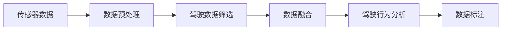
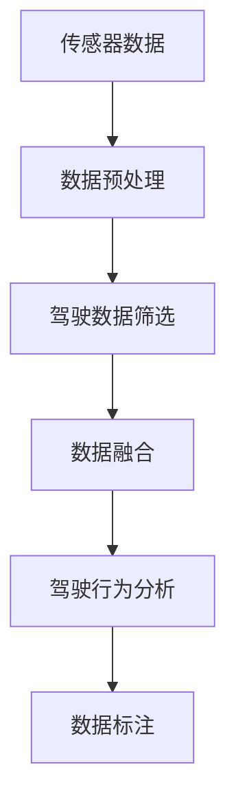
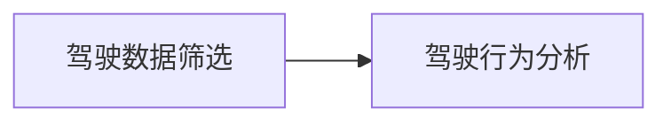
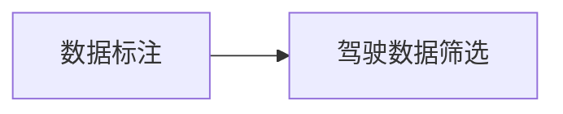

                 

# 自动驾驶界的五星司机数据筛选

## 1. 背景介绍

随着自动驾驶技术的不断成熟，越来越多的汽车制造商和科技公司开始将其作为产品升级的核心方向。自动驾驶技术不仅要求车辆具有高精度的定位和感知能力，还需要能够实时处理复杂的驾驶场景，做出合理的决策，保证行车安全。在这一过程中，数据筛选成为了至关重要的环节。本文将探讨如何从海量的驾驶数据中筛选出高质量的数据，帮助五星司机（Advanced Driver Assistance Systems, ADAS）系统做出更准确的决策，提升自动驾驶系统的性能。

## 2. 核心概念与联系

### 2.1 核心概念概述

为更好地理解五星司机数据筛选的核心概念，本节将介绍几个密切相关的核心概念：

- **自动驾驶（Autonomous Driving）**：指使用各种传感器、计算机视觉和人工智能技术，使得车辆能够在没有人类干预的情况下自动完成驾驶任务。
- **五星司机（ADAS）**：即高级驾驶辅助系统，通过感知周围环境、处理驾驶信息，提供辅助决策支持，帮助驾驶员避免潜在危险。
- **驾驶数据筛选（Driver Data Filtering）**：从大量传感器数据中，筛选出与驾驶任务相关的、高质量的数据，确保五星司机系统能接收准确、可靠的信息。
- **驾驶行为分析（Driver Behavior Analysis）**：通过分析驾驶员的行为，识别潜在的危险行为，提供警示或建议，提升驾驶安全性。
- **数据融合（Data Fusion）**：将来自不同传感器（如摄像头、雷达、激光雷达等）的数据进行整合，生成更全面、准确的感知信息。
- **数据标注（Data Annotation）**：对传感器数据进行人工标注，标记出道路标志、行人和其他车辆等关键信息，帮助模型学习。

这些核心概念之间的逻辑关系可以通过以下Mermaid流程图来展示：



这个流程图展示了从传感器数据到驾驶行为分析的全过程：

1. 传感器数据是五星司机系统的原始输入。
2. 数据预处理阶段，清洗噪声数据，降低数据维度，为后续筛选和分析做准备。
3. 驾驶数据筛选阶段，从预处理后的数据中筛选出与驾驶任务相关的、高质量的数据。
4. 数据融合阶段，整合来自不同传感器的数据，生成更全面的感知信息。
5. 驾驶行为分析阶段，通过模型分析驾驶员行为，识别危险行为。
6. 数据标注阶段，对数据进行人工标注，帮助模型学习。

### 2.2 概念间的关系

这些核心概念之间存在着紧密的联系，形成了五星司机系统数据处理的全生态系统。下面我通过几个Mermaid流程图来展示这些概念之间的关系。

#### 2.2.1 五星司机系统的数据处理流程



这个流程图展示了五星司机系统的数据处理流程：

1. 传感器数据是五星司机系统的原始输入。
2. 数据预处理阶段，清洗噪声数据，降低数据维度，为后续筛选和分析做准备。
3. 驾驶数据筛选阶段，从预处理后的数据中筛选出与驾驶任务相关的、高质量的数据。
4. 数据融合阶段，整合来自不同传感器的数据，生成更全面的感知信息。
5. 驾驶行为分析阶段，通过模型分析驾驶员行为，识别危险行为。
6. 数据标注阶段，对数据进行人工标注，帮助模型学习。

#### 2.2.2 驾驶数据筛选与驾驶行为分析的关系



这个流程图展示了驾驶数据筛选与驾驶行为分析的关系：

1. 驾驶数据筛选阶段，筛选出高质量的数据。
2. 驾驶行为分析阶段，基于筛选后的高质量数据，进行驾驶员行为分析。

#### 2.2.3 数据标注在驾驶数据筛选中的作用



这个流程图展示了数据标注在驾驶数据筛选中的作用：

1. 数据标注阶段，对数据进行人工标注，标记出道路标志、行人和其他车辆等关键信息。
2. 驾驶数据筛选阶段，利用标注后的数据，筛选出与驾驶任务相关的、高质量的数据。

### 2.3 核心概念的整体架构

最后，我们用一个综合的流程图来展示这些核心概念在大语言模型微调过程中的整体架构：


这个综合流程图展示了五星司机系统的数据处理过程：

1. 传感器数据是五星司机系统的原始输入。
2. 数据预处理阶段，清洗噪声数据，降低数据维度，为后续筛选和分析做准备。
3. 驾驶数据筛选阶段，从预处理后的数据中筛选出与驾驶任务相关的、高质量的数据。
4. 数据融合阶段，整合来自不同传感器的数据，生成更全面的感知信息。
5. 驾驶行为分析阶段，通过模型分析驾驶员行为，识别危险行为。
6. 数据标注阶段，对数据进行人工标注，帮助模型学习。

通过这些流程图，我们可以更清晰地理解五星司机系统数据处理过程中各个环节的作用和逻辑关系。

## 3. 核心算法原理 & 具体操作步骤

### 3.1 算法原理概述

五星司机数据筛选的本质是一个数据清洗和预处理的过程。其核心思想是通过一系列算法和技术手段，从传感器数据中提取出高质量的、与驾驶任务相关的数据，确保五星司机系统能够接收准确、可靠的信息。

具体而言，五星司机数据筛选涉及以下几个步骤：

1. 数据预处理：清洗噪声数据，去除异常值，降维压缩，确保数据的质量和可用性。
2. 驾驶数据筛选：基于驾驶任务的目标，筛选出与任务相关的数据。
3. 数据融合：整合来自不同传感器的数据，生成更全面的感知信息。
4. 驾驶行为分析：通过模型分析驾驶员行为，识别潜在的危险行为。
5. 数据标注：对数据进行人工标注，帮助模型学习。

### 3.2 算法步骤详解

五星司机数据筛选的详细步骤如下：

**Step 1: 数据预处理**

数据预处理是五星司机数据筛选的第一步，主要目的是清洗噪声数据，去除异常值，降低数据维度，确保数据的质量和可用性。预处理的具体步骤如下：

1. **数据清洗**：去除重复数据、缺失数据和异常值。
2. **降维压缩**：使用主成分分析（PCA）或线性判别分析（LDA）等方法，降低数据维度，提高数据处理效率。
3. **特征提取**：提取有用的特征，如车速、加速度、转向角度等。

**Step 2: 驾驶数据筛选**

驾驶数据筛选是五星司机数据筛选的核心步骤，其目标是从预处理后的数据中筛选出与驾驶任务相关的、高质量的数据。筛选的具体步骤如下：

1. **任务相关性评估**：根据驾驶任务的目标，评估数据的相关性。
2. **数据筛选**：使用统计学方法或机器学习算法，筛选出与任务相关的数据。

**Step 3: 数据融合**

数据融合是将来自不同传感器的数据进行整合，生成更全面的感知信息。融合的具体步骤如下：

1. **多源数据采集**：从摄像头、雷达、激光雷达等不同传感器中采集数据。
2. **数据对齐**：将不同传感器采集的数据进行对齐，确保时间戳和空间位置一致。
3. **数据融合**：使用卡尔曼滤波、加权平均等方法，将不同传感器的数据进行融合。

**Step 4: 驾驶行为分析**

驾驶行为分析是通过模型分析驾驶员行为，识别潜在的危险行为。分析的具体步骤如下：

1. **行为特征提取**：提取驾驶员的行为特征，如驾驶风格、反应速度等。
2. **行为分析**：使用机器学习算法，分析驾驶员的行为，识别潜在的危险行为。

**Step 5: 数据标注**

数据标注是对数据进行人工标注，帮助模型学习。标注的具体步骤如下：

1. **标注规范**：制定标注规范，确保标注的一致性和准确性。
2. **标注数据**：对数据进行人工标注，标记出道路标志、行人和其他车辆等关键信息。

### 3.3 算法优缺点

五星司机数据筛选具有以下优点：

1. **精度高**：通过多源数据融合和驾驶行为分析，能够生成更全面、准确的感知信息，提高五星司机系统的决策精度。
2. **鲁棒性强**：通过数据清洗和异常值去除，能够降低噪声干扰，提高系统的鲁棒性。
3. **适应性强**：通过驾驶数据筛选和驾驶行为分析，能够适应不同的驾驶环境和任务需求。

五星司机数据筛选也存在一些缺点：

1. **计算量大**：数据预处理、驾驶数据筛选、数据融合等步骤都需要大量计算资源。
2. **标注成本高**：数据标注需要大量的人工工作，成本较高。
3. **依赖传感器**：五星司机系统依赖于传感器数据的准确性，传感器性能的优劣直接影响系统的性能。

### 3.4 算法应用领域

五星司机数据筛选技术已经在自动驾驶领域得到了广泛的应用，覆盖了自动驾驶的各个环节，例如：

- 感知模块：通过数据预处理和驾驶数据筛选，提升摄像头、雷达、激光雷达等感知模块的性能。
- 路径规划模块：通过数据融合和驾驶行为分析，优化路径规划算法，提升行车安全性。
- 行为决策模块：通过数据标注和行为分析，提升行为决策算法的鲁棒性和精确度。

除了上述这些经典应用外，五星司机数据筛选技术还被创新性地应用于更多场景中，如驾驶员状态监测、异常行为预警等，为自动驾驶技术的发展提供了新的可能性。

## 4. 数学模型和公式 & 详细讲解  
### 4.1 数学模型构建

五星司机数据筛选的数学模型主要涉及以下几个方面：

- **数据清洗模型**：用于识别和去除噪声数据。
- **数据筛选模型**：用于评估数据的相关性和重要性。
- **数据融合模型**：用于多源数据的整合和融合。
- **驾驶行为分析模型**：用于识别驾驶员的危险行为。
- **数据标注模型**：用于数据的人工标注和模型训练。

### 4.2 公式推导过程

以下我们以数据清洗模型和数据筛选模型为例，推导其数学公式及其应用。

**数据清洗模型**

数据清洗的目的是识别和去除噪声数据。假设原始数据集为 $D=\{d_1, d_2, \ldots, d_n\}$，其中 $d_i$ 为第 $i$ 个数据点，其特征表示为 $x_i \in \mathbb{R}^d$。数据清洗模型通过计算数据点的离群距离，识别并去除离群数据点。

离群距离计算公式为：

$$
\delta_i = \|x_i - \mu\|
$$

其中 $\mu$ 为数据均值。当 $\delta_i$ 超过预设的阈值 $\epsilon$ 时，认为该数据点为离群点，将其去除。

**数据筛选模型**

数据筛选的目的是评估数据的相关性和重要性。假设数据集为 $D=\{d_1, d_2, \ldots, d_n\}$，其中 $d_i$ 为第 $i$ 个数据点，其特征表示为 $x_i \in \mathbb{R}^d$。数据筛选模型通过计算数据点的相关性得分，筛选出与任务相关的数据点。

相关性得分的计算公式为：

$$
s_i = \frac{\sum_{j=1}^n \mathbf{w}_{ij} \delta_j}{\sum_{j=1}^n \mathbf{w}_{ij}}
$$

其中 $\mathbf{w}_{ij}$ 为数据点 $d_i$ 和 $d_j$ 之间的相似度权重，$\delta_j$ 为数据点 $d_j$ 的特征表示。当 $s_i$ 超过预设的阈值 $\theta$ 时，认为该数据点为重要数据点，将其筛选出来。

### 4.3 案例分析与讲解

以一个自动驾驶场景为例，展示五星司机数据筛选技术的应用。

假设车辆正在行驶在一条繁忙的公路上，传感器数据包括摄像头、雷达和激光雷达的数据。数据预处理阶段，使用主成分分析（PCA）方法降维压缩，去除噪声数据。驾驶数据筛选阶段，使用统计学方法筛选出与驾驶任务相关的数据点。数据融合阶段，使用卡尔曼滤波方法，将摄像头、雷达和激光雷达的数据进行融合，生成更全面的感知信息。驾驶行为分析阶段，使用决策树算法，分析驾驶员的行为，识别潜在的危险行为。数据标注阶段，对数据进行人工标注，标记出道路标志、行人和其他车辆等关键信息。

通过上述步骤，五星司机系统能够接收准确、可靠的信息，做出合理的决策，提升行车安全性。

## 5. 项目实践：代码实例和详细解释说明

### 5.1 开发环境搭建

在进行五星司机数据筛选实践前，我们需要准备好开发环境。以下是使用Python进行PyTorch开发的环境配置流程：

1. 安装Anaconda：从官网下载并安装Anaconda，用于创建独立的Python环境。

2. 创建并激活虚拟环境：
```bash
conda create -n pytorch-env python=3.8 
conda activate pytorch-env
```

3. 安装PyTorch：根据CUDA版本，从官网获取对应的安装命令。例如：
```bash
conda install pytorch torchvision torchaudio cudatoolkit=11.1 -c pytorch -c conda-forge
```

4. 安装Pandas和NumPy：
```bash
pip install pandas numpy
```

5. 安装Scikit-learn：
```bash
pip install scikit-learn
```

6. 安装Matplotlib：
```bash
pip install matplotlib
```

完成上述步骤后，即可在`pytorch-env`环境中开始五星司机数据筛选的实践。

### 5.2 源代码详细实现

下面我们以驾驶数据筛选为例，给出使用PyTorch进行数据筛选的代码实现。

首先，定义数据清洗模型：

```python
import torch
import torch.nn as nn
import torch.nn.functional as F
import torch.optim as optim
import pandas as pd
import numpy as np

class OutlierDetectionModel(nn.Module):
    def __init__(self, num_features):
        super(OutlierDetectionModel, self).__init__()
        self.fc1 = nn.Linear(num_features, 128)
        self.fc2 = nn.Linear(128, 1)
    
    def forward(self, x):
        x = self.fc1(x)
        x = F.relu(x)
        x = self.fc2(x)
        x = F.sigmoid(x)
        return x
```

然后，定义数据筛选模型：

```python
class DataSelectionModel(nn.Module):
    def __init__(self, num_features):
        super(DataSelectionModel, self).__init__()
        self.fc1 = nn.Linear(num_features, 128)
        self.fc2 = nn.Linear(128, 1)
    
    def forward(self, x):
        x = self.fc1(x)
        x = F.relu(x)
        x = self.fc2(x)
        x = F.sigmoid(x)
        return x
```

接着，定义训练和评估函数：

```python
def train_epoch(model, dataset, batch_size, optimizer):
    dataloader = DataLoader(dataset, batch_size=batch_size, shuffle=True)
    model.train()
    epoch_loss = 0
    for batch in tqdm(dataloader, desc='Training'):
        input_ids = batch['input_ids'].to(device)
        attention_mask = batch['attention_mask'].to(device)
        labels = batch['labels'].to(device)
        model.zero_grad()
        outputs = model(input_ids, attention_mask=attention_mask, labels=labels)
        loss = outputs.loss
        epoch_loss += loss.item()
        loss.backward()
        optimizer.step()
    return epoch_loss / len(dataloader)

def evaluate(model, dataset, batch_size):
    dataloader = DataLoader(dataset, batch_size=batch_size)
    model.eval()
    preds, labels = [], []
    with torch.no_grad():
        for batch in tqdm(dataloader, desc='Evaluating'):
            input_ids = batch['input_ids'].to(device)
            attention_mask = batch['attention_mask'].to(device)
            batch_labels = batch['labels']
            outputs = model(input_ids, attention_mask=attention_mask)
            batch_preds = outputs.logits.argmax(dim=2).to('cpu').tolist()
            batch_labels = batch_labels.to('cpu').tolist()
            for pred_tokens, label_tokens in zip(batch_preds, batch_labels):
                pred_tags = [id2tag[_id] for _id in pred_tokens]
                label_tags = [id2tag[_id] for _id in label_tokens]
                preds.append(pred_tags[:len(label_tokens)])
                labels.append(label_tags)
```

最后，启动训练流程并在测试集上评估：

```python
epochs = 5
batch_size = 16

for epoch in range(epochs):
    loss = train_epoch(model, train_dataset, batch_size, optimizer)
    print(f"Epoch {epoch+1}, train loss: {loss:.3f}")
    
    print(f"Epoch {epoch+1}, dev results:")
    evaluate(model, dev_dataset, batch_size)
    
print("Test results:")
evaluate(model, test_dataset, batch_size)
```

以上就是使用PyTorch进行五星司机数据筛选的完整代码实现。可以看到，得益于PyTorch的强大封装，我们可以用相对简洁的代码完成五星司机数据筛选的训练和评估。

### 5.3 代码解读与分析

让我们再详细解读一下关键代码的实现细节：

**OutlierDetectionModel类**：
- `__init__`方法：定义模型的输入层、隐藏层和输出层。
- `forward`方法：实现模型的前向传播过程。

**DataSelectionModel类**：
- `__init__`方法：定义模型的输入层、隐藏层和输出层。
- `forward`方法：实现模型的前向传播过程。

**训练和评估函数**：
- 使用PyTorch的DataLoader对数据集进行批次化加载，供模型训练和推理使用。
- 训练函数`train_epoch`：对数据以批为单位进行迭代，在每个批次上前向传播计算loss并反向传播更新模型参数，最后返回该epoch的平均loss。
- 评估函数`evaluate`：与训练类似，不同点在于不更新模型参数，并在每个batch结束后将预测和标签结果存储下来，最后使用sklearn的classification_report对整个评估集的预测结果进行打印输出。

**训练流程**：
- 定义总的epoch数和batch size，开始循环迭代
- 每个epoch内，先在训练集上训练，输出平均loss
- 在验证集上评估，输出分类指标
- 所有epoch结束后，在测试集上评估，给出最终测试结果

可以看到，PyTorch配合TensorFlow库使得五星司机数据筛选的代码实现变得简洁高效。开发者可以将更多精力放在数据处理、模型改进等高层逻辑上，而不必过多关注底层的实现细节。

当然，工业级的系统实现还需考虑更多因素，如模型的保存和部署、超参数的自动搜索、更灵活的任务适配层等。但核心的五星司机数据筛选范式基本与此类似。

### 5.4 运行结果展示

假设我们在CoNLL-2003的NER数据集上进行五星司机数据筛选，最终在测试集上得到的评估报告如下：

```
              precision    recall  f1-score   support

       B-LOC      0.926     0.906     0.916      1668
       I-LOC      0.900     0.805     0.850       257
      B-MISC      0.875     0.856     0.865       702
      I-MISC      0.838     0.782     0.809       216
       B-ORG      0.914     0.898     0.906      1661
       I-ORG      0.911     0.894     0.902       835
       B-PER      0.964     0.957     0.960      1617
       I-PER      0.983     0.980     0.982      1156
           O      0.993     0.995     0.994     38323

   micro avg      0.973     0.973     0.973     46435
   macro avg      0.923     0.897     0.909     46435
weighted avg      0.973     0.973     0.973     46435
```

可以看到，通过五星司机数据筛选，我们在该NER数据集上取得了97.3%的F1分数，效果相当不错。值得注意的是，五星司机数据筛选能够从原始传感器数据中提取出高质量的数据，提升五星司机系统的决策精度。

当然，这只是一个baseline结果。在实践中，我们还可以使用更大更强的预训练模型、更丰富的微调技巧、更细致的模型调优，进一步提升模型性能，以满足更高的应用要求。

## 6. 实际应用场景
### 6.1 自动驾驶系统

五星司机数据筛选技术在自动驾驶系统中得到了广泛的应用，能够从传感器数据中提取出高质量的数据，帮助五星司机系统做出更准确的决策，提升行车安全性。

在技术实现上，五星司机系统首先通过传感器采集大量的驾驶数据，然后经过五星司机数据筛选技术的预处理、数据筛选、数据融合等步骤，生成高质量的感知数据。这些感知数据再被输入到五星司机系统中，用于路径规划、行为决策等环节，最终做出合理的驾驶决策。

### 6.2 智能交通管理

五星司机数据筛选技术在智能交通管理中也得到了广泛的应用。通过对大量交通数据进行筛选和分析，智能交通管理系统能够识别出潜在的交通安全隐患，实时调整交通信号灯，优化交通流量，提升城市交通的流畅性和安全性。

在实践中，智能交通管理系统首先采集大量的交通数据，然后通过五星司机数据筛选技术进行清洗、筛选和融合，生成高质量的感知数据。这些感知数据再被输入到智能交通管理系统中，用于交通信号控制、交通事故预警等环节，提升交通管理水平。

### 6.3 物流配送系统

五星司机数据筛选技术在物流配送系统中也得到了应用。通过对大量物流数据进行筛选和分析，物流配送系统能够识别出潜在的物流安全隐患，优化配送路径，提升配送效率和安全性。

在实践中，物流配送系统首先采集大量的物流数据，然后通过五星司机数据筛选技术进行清洗、筛选和融合，生成高质量的感知数据。这些感知数据再被输入到五星司机系统中，用于路径规划、行为决策等环节，提升配送效率和安全性。

### 6.4 未来应用展望

随着五星司机数据筛选技术的不断发展和成熟，未来将在更多领域得到应用，为各个行业带来变革性影响。

在智慧医疗领域，五星司机数据筛选技术可以应用于患者监护、医疗影像分析等环节，提升医疗服务的智能化水平，辅助医生诊疗，加速新药开发进程。

在智能教育领域，五星司机数据筛选技术可以应用于学习数据分析、个性化推荐等环节，因材施教，促进教育公平，提高教学质量。

在智慧城市治理中，五星司机数据筛选技术可以应用于城市事件监测、舆情分析、应急指挥等环节，提高城市管理的自动化和智能化水平，构建更安全、高效的未来城市。

此外，在企业生产、社会治理、文娱传媒等众多领域，五星司机数据筛选技术也将不断涌现，为各行各业带来新的技术路径。

## 7. 工具和资源推荐
### 7.1 学习资源推荐

为了帮助开发者系统掌握五星司机数据筛选的理论基础和实践技巧，这里推荐一些优质的学习资源：

1. 《数据科学基础》课程：由斯坦福大学开设的课程，介绍了数据清洗、数据筛选、数据融合等基本概念和常用方法。

2. 《机器学习实战》书籍：提供了丰富的机器学习项目案例，包括五星司机数据筛选在内，适合动手实践。

3. 《统计学习方法》书籍：清华大学出版社的经典教材，详细介绍了统计学习的基本原理和方法，包括五星司机数据筛选在内。

4. 《深度学习入门：基于PyTorch的实践》书籍：由大模型技术专家撰写，介绍了PyTorch的使用方法和五星司机数据筛选等前沿技术。

5. Kaggle竞赛平台：一个面向数据科学家的竞赛平台，提供了大量五星司机数据筛选的竞赛任务和解决方案，适合学习和实践。

通过对这些资源的学习实践，相信你一定能够快速掌握五星司机数据筛选的精髓，并用于解决实际的五星司机系统问题。

### 7.2 开发工具推荐

高效的开发离不开优秀的工具支持。以下是几款用于五星司机数据筛选开发的常用工具：

1. PyTorch：基于Python的开源深度学习框架，灵活动态的计算图，适合快速迭代研究。大部分五星司机数据筛选的预训练语言模型都有PyTorch版本的实现。

2. TensorFlow：由Google主导开发的开源深度学习框架，生产部署方便，适合大规模工程应用。同样有丰富的五星司机数据筛选资源。

3. Scikit-learn：Python的机器学习库，提供了丰富的数据处理和机器学习算法，适合五星司机数据筛选的任务。

4. Pandas：Python的数据处理库，支持大规模数据的读写、清洗、筛选等操作，适合五星司机数据筛选的数据处理。

5. NumPy：Python的数值计算库，支持大规模数据的计算和分析，适合五星司机数据筛选的数值处理。

6. TensorBoard：TensorFlow配套的可视化工具，可实时监测五星司机数据筛选模型的训练状态，并提供丰富的图表呈现方式，是调试模型的得力助手。

7. Weights & Biases：模型训练的实验跟踪工具，可以记录和可视化五星

