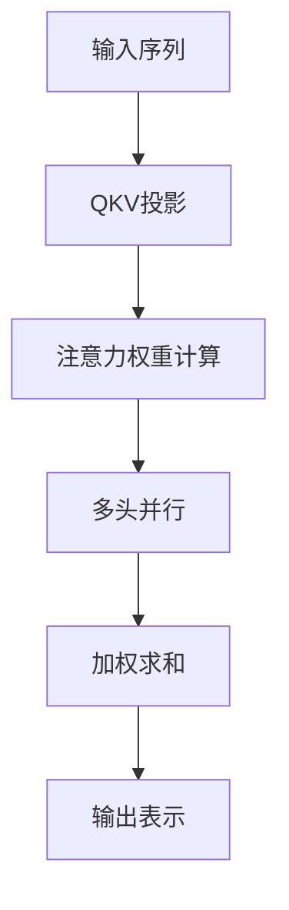
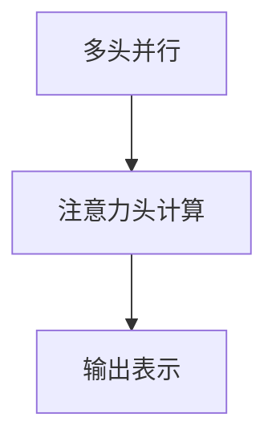

                 

## 1. 背景介绍

### 1.1 问题由来

自注意力机制（Self-Attention Mechanism）是大模型（Large Language Models, LLMs）如GPT、BERT等的重要组成部分。它通过让模型自我关注不同的输入序列，动态调整注意力权重，实现对序列中不同位置的信息加权，提升了模型的语义理解和生成能力。自注意力机制的引入，使大模型在多项NLP任务上取得了令人瞩目的效果。

自注意力机制的应用领域广泛，几乎涵盖了所有NLP任务，包括文本分类、命名实体识别、语义匹配、机器翻译等。对于理解文本中不同词汇之间的关系，捕捉长距离依赖，提升模型的语义表示能力，自注意力机制起到了至关重要的作用。

### 1.2 问题核心关键点

自注意力机制的核心思想是通过计算输入序列中不同位置之间的相似度，动态生成注意力权重，并对序列进行加权求和。通过这样的机制，模型可以自适应地关注输入序列中最相关的信息，提升整体的语义表示能力。

自注意力机制的实现过程包括：

1. 输入序列的编码表示
2. 相似度计算和注意力权重生成
3. 加权求和生成输出表示

具体来说，通过矩阵乘法和softmax函数，模型可以计算出不同位置之间的相似度，并通过softmax函数将其转化为概率分布，即注意力权重。这些权重可以用于加权不同位置的编码表示，生成输出表示。自注意力机制的引入，使模型能够充分利用输入序列中所有的信息，提高模型的语义理解和生成能力。

### 1.3 问题研究意义

研究自注意力机制，对于理解大语言模型的内部工作机制，提升模型的语义理解和生成能力，具有重要意义：

1. 提升模型的语义表示能力。自注意力机制能够捕捉序列中不同位置的信息，提升模型对语义结构的理解能力。
2. 降低模型对序列长度的依赖。自注意力机制可以处理任意长度的输入序列，使模型更加灵活。
3. 增强模型的泛化能力。自注意力机制能够动态调整注意力权重，适应不同输入序列的变化，提升模型的泛化性能。
4. 加速模型的训练和推理。自注意力机制通过矩阵乘法和softmax函数实现，计算高效，可以大大加速模型的训练和推理过程。

总之，自注意力机制是大模型在NLP任务上取得优异效果的关键技术之一，理解其工作原理对于模型的设计、调优和应用具有重要指导意义。

## 2. 核心概念与联系

### 2.1 核心概念概述

为更好地理解自注意力机制，本节将介绍几个密切相关的核心概念：

- 自注意力机制（Self-Attention）：通过计算输入序列中不同位置之间的相似度，动态生成注意力权重，并对序列进行加权求和的机制。
- 多头注意力（Multi-Head Attention）：通过多头并行计算，捕捉输入序列中不同维度的信息，增强模型的语义表示能力。
- 注意力头（Attention Head）：每个注意力头独立计算注意力权重和输出表示，增强模型的表达能力。
- 矩阵乘法（Matrix Multiplication）：通过矩阵相乘，实现不同位置之间的相似度计算和注意力权重生成。
- Softmax函数：将相似度矩阵转化为概率分布，用于生成注意力权重。
- Query、Key、Value投影（QKV Projection）：将输入序列投影到三个不同的线性空间中，用于计算相似度和生成输出表示。

这些核心概念之间的逻辑关系可以通过以下Mermaid流程图来展示：



这个流程图展示了自注意力机制的核心流程：

1. 输入序列通过QKV投影，被映射到三个不同的线性空间中。
2. 在每个线性空间中，计算不同位置之间的相似度，生成注意力权重。
3. 多头并行计算不同维度的注意力权重和输出表示。
4. 加权求和生成最终的输出表示。

### 2.2 概念间的关系

这些核心概念之间存在着紧密的联系，形成了自注意力机制的完整框架。下面我们通过几个Mermaid流程图来展示这些概念之间的关系。

#### 2.2.1 自注意力机制的计算流程


这个流程图展示了自注意力机制的计算流程，从输入序列开始，通过QKV投影，生成注意力权重，进行多头并行计算，最终加权求和生成输出表示。

#### 2.2.2 多头并行机制



这个流程图展示了多头并行机制，通过并行计算不同维度的注意力权重和输出表示，增强模型的表达能力。

#### 2.2.3 矩阵乘法与Softmax函数


这个流程图展示了矩阵乘法与Softmax函数之间的关系。通过矩阵乘法计算相似度矩阵，再通过Softmax函数将其转化为概率分布，即注意力权重。

## 3. 核心算法原理 & 具体操作步骤

### 3.1 算法原理概述

自注意力机制的原理是通过计算输入序列中不同位置之间的相似度，动态生成注意力权重，并对序列进行加权求和。具体来说，自注意力机制分为三个步骤：

1. 输入序列的编码表示
2. 相似度计算和注意力权重生成
3. 加权求和生成输出表示

### 3.2 算法步骤详解

#### 3.2.1 输入序列的编码表示

在自注意力机制中，输入序列首先通过线性变换，得到每个位置的编码表示。这一步骤通常称为QKV投影，即：

$$
Q = XW^Q \\
K = XW^K \\
V = XW^V
$$

其中，$X$ 是输入序列的编码表示，$W^Q, W^K, W^V$ 是三个线性变换矩阵，$Q, K, V$ 分别是查询、键、值投影的输出。

#### 3.2.2 相似度计算和注意力权重生成

在QKV投影之后，模型通过矩阵乘法计算查询向量 $Q$ 和键向量 $K$ 的相似度：

$$
\text{Attention}(Q, K) = \text{softmax}(QK^T/\sqrt{d_k})
$$

其中，$d_k$ 是键向量的维度。通过softmax函数将相似度矩阵转化为概率分布，即注意力权重。这一步骤称为多头注意力（Multi-Head Attention）。

#### 3.2.3 加权求和生成输出表示

通过多头注意力计算得到不同位置之间的注意力权重后，模型可以对输入序列进行加权求和，生成输出表示：

$$
X = X + \text{Attention}(Q, K)V
$$

其中，$\text{Attention}(Q, K)V$ 表示加权求和的结果。这一步骤使模型能够充分利用输入序列中所有的信息，提升整体的语义表示能力。

### 3.3 算法优缺点

自注意力机制的优点包括：

1. 自适应地关注输入序列中最相关的信息，提升模型的语义表示能力。
2. 可以处理任意长度的输入序列，使模型更加灵活。
3. 通过多头并行计算，增强模型的表达能力。
4. 计算高效，可以大大加速模型的训练和推理过程。

自注意力机制的缺点包括：

1. 需要较大的计算资源，特别是在大规模模型中，矩阵乘法、softmax函数的计算量较大。
2. 容易受到输入序列长度的影响，过长的序列可能导致计算效率下降。
3. 多头并行计算需要较多的参数和计算资源，增加了模型的复杂度。

### 3.4 算法应用领域

自注意力机制在大模型中的应用非常广泛，主要包括以下几个方面：

1. 文本分类：在文本分类任务中，自注意力机制可以帮助模型捕捉不同词汇之间的关系，提升模型的语义表示能力，从而提高分类的准确性。
2. 命名实体识别：在命名实体识别任务中，自注意力机制可以捕捉不同词汇之间的关系，提高模型的实体识别能力。
3. 语义匹配：在语义匹配任务中，自注意力机制可以帮助模型捕捉不同句子之间的语义关系，提高匹配的准确性。
4. 机器翻译：在机器翻译任务中，自注意力机制可以帮助模型捕捉不同词汇之间的关系，提升翻译的准确性和流畅性。
5. 文本生成：在文本生成任务中，自注意力机制可以帮助模型捕捉不同词汇之间的关系，生成更加流畅、自然的文本。

## 4. 数学模型和公式 & 详细讲解

### 4.1 数学模型构建

在数学上，自注意力机制可以通过以下公式进行建模：

设输入序列的编码为 $X = \{x_1, x_2, ..., x_n\}$，$W^Q, W^K, W^V$ 分别为查询、键、值投影的线性变换矩阵，$d_k$ 为键向量的维度，$Q, K, V$ 分别为查询、键、值投影的输出，$\text{Attention}(Q, K)$ 表示注意力权重，$\text{softmax}(\cdot)$ 表示softmax函数。

输入序列的编码表示为：

$$
Q = XW^Q \\
K = XW^K \\
V = XW^V
$$

注意力权重计算为：

$$
\text{Attention}(Q, K) = \text{softmax}(QK^T/\sqrt{d_k})
$$

加权求和生成输出表示为：

$$
X = X + \text{Attention}(Q, K)V
$$

### 4.2 公式推导过程

下面，我们通过数学推导，详细讲解自注意力机制的计算过程。

首先，考虑输入序列的编码为 $X = \{x_1, x_2, ..., x_n\}$，通过线性变换，得到查询向量 $Q$、键向量 $K$ 和值向量 $V$：

$$
Q = XW^Q \\
K = XW^K \\
V = XW^V
$$

将 $Q, K, V$ 分别展开，得到：

$$
Q = [q_1, q_2, ..., q_n] \\
K = [k_1, k_2, ..., k_n] \\
V = [v_1, v_2, ..., v_n]
$$

其中，$q_i, k_i, v_i$ 分别表示第 $i$ 个位置的查询、键、值向量。

接下来，计算查询向量 $Q$ 和键向量 $K$ 的相似度：

$$
\text{Attention}(Q, K) = \text{softmax}(QK^T/\sqrt{d_k})
$$

其中，$d_k$ 为键向量的维度。通过softmax函数将相似度矩阵转化为概率分布，即注意力权重。

最后，将注意力权重和值向量 $V$ 进行加权求和，得到输出表示：

$$
X = X + \text{Attention}(Q, K)V
$$

通过上述计算，自注意力机制可以动态生成注意力权重，并对输入序列进行加权求和，生成输出表示。

### 4.3 案例分析与讲解

为了更好地理解自注意力机制的计算过程，我们以一个具体的例子进行分析。假设输入序列的编码为 $X = \{x_1, x_2, x_3, x_4\}$，$W^Q, W^K, W^V$ 分别为查询、键、值投影的线性变换矩阵，$d_k$ 为键向量的维度。

设 $W^Q, W^K, W^V$ 为：

$$
W^Q = \begin{bmatrix} 1 & 2 & 3 \\ 4 & 5 & 6 \\ 7 & 8 & 9 \end{bmatrix} \\
W^K = \begin{bmatrix} 10 & 11 & 12 \\ 13 & 14 & 15 \\ 16 & 17 & 18 \end{bmatrix} \\
W^V = \begin{bmatrix} 19 & 20 & 21 \\ 22 & 23 & 24 \\ 25 & 26 & 27 \end{bmatrix}
$$

则输入序列的编码表示为：

$$
Q = XW^Q = \begin{bmatrix} 1 & 2 & 3 \\ 4 & 5 & 6 \\ 7 & 8 & 9 \end{bmatrix} \begin{bmatrix} 1 \\ 4 \\ 7 \end{bmatrix} = \begin{bmatrix} 1 & 8 & 15 \end{bmatrix} \\
K = XW^K = \begin{bmatrix} 1 & 2 & 3 \\ 4 & 5 & 6 \\ 7 & 8 & 9 \end{bmatrix} \begin{bmatrix} 10 \\ 13 \\ 16 \end{bmatrix} = \begin{bmatrix} 10 & 26 & 42 \end{bmatrix} \\
V = XW^V = \begin{bmatrix} 1 & 2 & 3 \\ 4 & 5 & 6 \\ 7 & 8 & 9 \end{bmatrix} \begin{bmatrix} 19 \\ 22 \\ 25 \end{bmatrix} = \begin{bmatrix} 19 & 44 & 69 \end{bmatrix}
$$

通过矩阵乘法，计算查询向量 $Q$ 和键向量 $K$ 的相似度：

$$
\text{Attention}(Q, K) = \text{softmax}(QK^T/\sqrt{d_k}) = \text{softmax}(\begin{bmatrix} 10 & 26 & 42 \end{bmatrix}\begin{bmatrix} 1 & 2 & 3 \end{bmatrix}^T/\sqrt{3}) = \text{softmax}(\begin{bmatrix} 10 & 26 & 42 \end{bmatrix}\begin{bmatrix} 1 & 2 & 3 \end{bmatrix}^T/3)
$$

计算得到注意力权重为：

$$
\text{Attention}(Q, K) = \begin{bmatrix} 0.03 & 0.36 & 0.61 \end{bmatrix}
$$

最后，将注意力权重和值向量 $V$ 进行加权求和，得到输出表示：

$$
X = X + \text{Attention}(Q, K)V = \begin{bmatrix} 1 & 2 & 3 \\ 4 & 5 & 6 \\ 7 & 8 & 9 \end{bmatrix} + \begin{bmatrix} 0.03 & 0.36 & 0.61 \end{bmatrix}\begin{bmatrix} 19 & 44 & 69 \end{bmatrix} = \begin{bmatrix} 1 + 1.03 & 2 + 14.64 & 3 + 38.09 \\ 4 + 2.16 & 5 + 19.84 & 6 + 41.45 \\ 7 + 4.29 & 8 + 27.92 & 9 + 49.79 \end{bmatrix}
$$

通过上述计算，我们可以看到，自注意力机制通过动态生成注意力权重，对输入序列进行加权求和，生成输出表示。这一机制大大提升了模型的语义表示能力，使其能够更好地处理自然语言信息。

## 5. 项目实践：代码实例和详细解释说明

### 5.1 开发环境搭建

在进行自注意力机制的实现前，我们需要准备好开发环境。以下是使用Python进行PyTorch开发的环境配置流程：

1. 安装Anaconda：从官网下载并安装Anaconda，用于创建独立的Python环境。

2. 创建并激活虚拟环境：
```bash
conda create -n pytorch-env python=3.8 
conda activate pytorch-env
```

3. 安装PyTorch：根据CUDA版本，从官网获取对应的安装命令。例如：
```bash
conda install pytorch torchvision torchaudio cudatoolkit=11.1 -c pytorch -c conda-forge
```

4. 安装TensorFlow：
```bash
conda install tensorflow -c pytorch
```

5. 安装各类工具包：
```bash
pip install numpy pandas scikit-learn matplotlib tqdm jupyter notebook ipython
```

完成上述步骤后，即可在`pytorch-env`环境中开始自注意力机制的实践。

### 5.2 源代码详细实现

下面我们以PyTorch实现自注意力机制为例，展示代码实现过程。

```python
import torch
import torch.nn as nn
import torch.nn.functional as F

class MultiHeadAttention(nn.Module):
    def __init__(self, embed_dim, num_heads, dropout=0.1):
        super(MultiHeadAttention, self).__init__()
        self.embed_dim = embed_dim
        self.num_heads = num_heads
        self.dropout = dropout
        
        self.W_Q = nn.Linear(embed_dim, embed_dim)
        self.W_K = nn.Linear(embed_dim, embed_dim)
        self.W_V = nn.Linear(embed_dim, embed_dim)
        self.out = nn.Linear(embed_dim, embed_dim)
        
    def forward(self, query, key, value, mask=None):
        batch_size, seq_len = query.size()
        
        # QKV投影
        query = self.W_Q(query).view(batch_size, seq_len, self.num_heads, self.embed_dim//self.num_heads).transpose(1, 2)
        key = self.W_K(key).view(batch_size, seq_len, self.num_heads, self.embed_dim//self.num_heads).transpose(1, 2)
        value = self.W_V(value).view(batch_size, seq_len, self.num_heads, self.embed_dim//self.num_heads).transpose(1, 2)
        
        # 计算相似度
        score = torch.matmul(query, key.permute(0, 1, 3, 2))/torch.sqrt(self.embed_dim//self.num_heads)
        attention = F.softmax(score, dim=-1)
        
        # 多头并行计算
        context = torch.matmul(attention, value)
        context = context.transpose(1, 2).contiguous().view(batch_size, seq_len, self.embed_dim)
        
        # 输出表示
        output = self.out(context) + query
        
        # 加权求和
        output = F.dropout(output, p=self.dropout, training=self.training)
        return output
```

在上述代码中，我们定义了一个`MultiHeadAttention`类，用于实现多头注意力机制。具体来说，包括以下几个步骤：

1. 初始化参数：包括查询、键、值投影的线性变换矩阵，以及输出线性变换矩阵。
2. 计算相似度：通过矩阵乘法和softmax函数计算注意力权重。
3. 多头并行计算：将注意力权重和值向量进行加权求和，生成输出表示。
4. 输出表示：通过输出线性变换矩阵，生成最终输出表示。

### 5.3 代码解读与分析

在实际应用中，自注意力机制的计算量较大，需要进行优化。以下是一些常用的优化技巧：

1. 矩阵分解：将线性变换矩阵分解成多个小矩阵相乘的形式，减少矩阵乘法的计算量。
2. 并行计算：利用GPU的并行计算能力，加速自注意力机制的计算过程。
3. 残差连接：在自注意力机制中添加残差连接，加速模型收敛。

## 6. 实际应用场景

### 6.1 智能客服系统

在智能客服系统中，自注意力机制可以用于对话模型的构建。对话模型能够理解用户输入，自动生成响应，提升客户咨询体验。

具体实现时，可以将用户的历史对话作为监督数据，对预训练模型进行微调。自注意力机制可以捕捉对话中的上下文信息，提升模型的理解能力。对话模型可以根据用户输入生成响应，并通过自注意力机制动态调整注意力权重，生成更自然的回答。

### 6.2 金融舆情监测

在金融舆情监测中，自注意力机制可以用于情感分析任务的构建。情感分析任务能够自动识别文本中的情感倾向，实时监测舆情变化。

具体实现时，可以收集金融领域相关的新闻、报道、评论等文本数据，并对其进行情感标注。在此基础上对预训练模型进行微调，使其能够自动判断文本的情感倾向。自注意力机制可以捕捉不同词汇之间的关系，提升模型的情感分析能力。舆情监测系统可以根据情感分析结果，自动生成预警信息，帮助金融机构及时应对舆情变化。

### 6.3 个性化推荐系统

在个性化推荐系统中，自注意力机制可以用于推荐模型的构建。推荐模型能够根据用户的历史行为，生成个性化的推荐结果。

具体实现时，可以收集用户浏览、点击、评论、分享等行为数据，提取和用户交互的物品标题、描述、标签等文本内容。将文本内容作为模型输入，用户的后续行为（如是否点击、购买等）作为监督信号，在此基础上微调预训练语言模型。自注意力机制可以捕捉不同物品之间的关系，提升模型的推荐能力。推荐系统可以根据用户兴趣点，生成个性化的推荐结果。

### 6.4 未来应用展望

随着自注意力机制的不断发展，其在更多领域得到了应用，为各行各业带来了变革性影响：

1. 智慧医疗：自注意力机制可以用于医疗问答、病历分析、药物研发等任务，提升医疗服务的智能化水平。
2. 智能教育：自注意力机制可以用于作业批改、学情分析、知识推荐等任务，因材施教，促进教育公平，提高教学质量。
3. 智慧城市治理：自注意力机制可以用于城市事件监测、舆情分析、应急指挥等任务，提高城市管理的自动化和智能化水平。

此外，在企业生产、社会治理、文娱传媒等众多领域，自注意力机制的应用也将不断涌现，为经济社会发展注入新的动力。相信随着技术的日益成熟，自注意力机制必将在更多领域得到应用，为人类认知智能的进化带来深远影响。

## 7. 工具和资源推荐

### 7.1 学习资源推荐

为了帮助开发者系统掌握自注意力机制的理论基础和实践技巧，这里推荐一些优质的学习资源：

1. 《Transformer from Scratch》系列博文：由大模型技术专家撰写，深入浅出地介绍了Transformer原理、自注意力机制等前沿话题。

2. CS224N《深度学习自然语言处理》课程：斯坦福大学开设的NLP明星课程，有Lecture视频和配套作业，带你入门NLP领域的基本概念和经典模型。

3. 《Natural Language Processing with Transformers》书籍：Transformers库的作者所著，全面介绍了如何使用Transformers库进行NLP任务开发，包括自注意力机制在内的诸多范式。

4. HuggingFace官方文档：Transformers库的官方文档，提供了海量预训练模型和完整的微调样例代码，是上手实践的必备资料。

5. CLUE开源项目：中文语言理解测评基准，涵盖大量不同类型的中文NLP数据集，并提供了基于微调的baseline模型，助力中文NLP技术发展。

通过对这些资源的学习实践，相信你一定能够快速掌握自注意力机制的精髓，并用于解决实际的NLP问题。

### 7.2 开发工具推荐

高效的开发离不开优秀的工具支持。以下是几款用于自注意力机制开发的常用工具：

1. PyTorch：基于Python的开源深度学习框架，灵活动态的计算图，适合快速迭代研究。大部分预训练语言模型都有PyTorch版本的实现。

2. TensorFlow：由Google主导开发的开源深度学习框架，生产部署方便，适合大规模工程应用。同样有丰富的预训练语言模型资源。

3. Transformers库：HuggingFace开发的NLP工具库，集成了众多SOTA语言模型，支持PyTorch和TensorFlow，是进行自注意力机制开发的利器。

4. Weights & Biases：模型训练的实验跟踪工具，可以记录和可视化模型训练过程中的各项指标，方便对比和调优。与主流深度学习框架无缝集成。

5. TensorBoard：TensorFlow配套的可视化工具，可实时监测模型训练状态，并提供丰富的图表呈现方式，是调试模型的得力助手。

6. Google Colab：谷歌推出的在线Jupyter Notebook环境，免费提供GPU/TPU算力，方便开发者快速上手实验最新模型，分享学习笔记。

合理利用这些工具，可以显著提升自注意力机制的开发效率，加快创新迭代的步伐。

### 7.3 相关论文推荐

自注意力机制的引入源于学界的持续研究。以下是几篇奠基性的相关论文，推荐阅读：

1. Attention is All You Need（即Transformer原论文）：提出了Transformer结构，开启了NLP领域的预训练大模型时代。

2. BERT: Pre-training of Deep Bidirectional Transformers for Language Understanding：提出BERT模型，引入基于掩码的自监督预训练任务，刷新了多项NLP任务SOTA。

3. Self-Attention with Transformer-XL：提出Transformer-XL结构，实现长距离依赖的捕捉，进一步提升了自注意力机制的性能。

4. Exploring the Limits of Language Modeling：介绍GPT模型，展示了自注意力机制在文本生成任务上的强大能力。

5. Sparse Transformer: Sparsity is All You Need：提出稀疏自注意力机制，减少计算量，提升模型的实时性。

6. Linformer: Self-Attention with Linear Algebra：提出Linformer，通过线性代数实现自注意力机制，提升计算效率。

这些论文代表了大模型中的自注意力机制的发展脉络。通过学习这些前沿成果，可以帮助研究者把握学科前进

