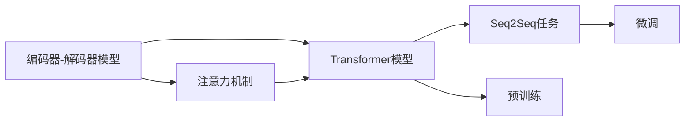
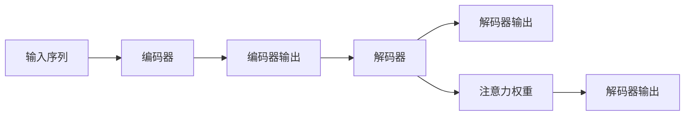
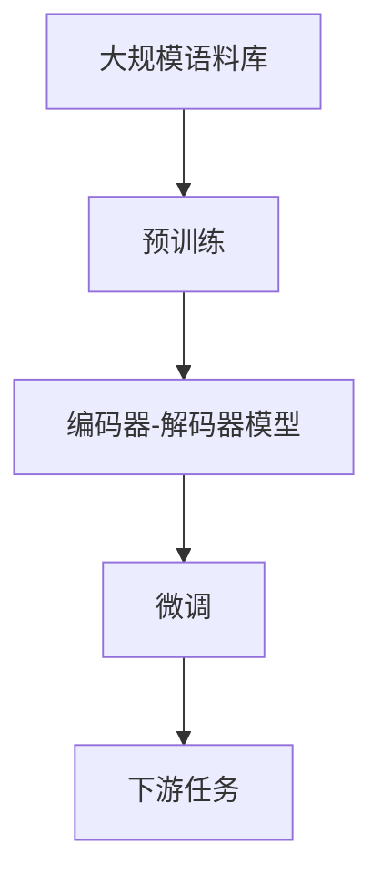

                 

# 自然语言处理 原理与代码实例讲解

> 关键词：自然语言处理,语言模型,深度学习,编码器-解码器模型,注意力机制,Transformer模型,代码实例,实例分析

## 1. 背景介绍

### 1.1 问题由来
自然语言处理（Natural Language Processing, NLP）是人工智能领域的重要分支，旨在使计算机能够理解、分析、生成和翻译自然语言。随着深度学习技术的发展，NLP领域取得了巨大的突破，从语音识别、情感分析到机器翻译、智能客服，NLP技术正在深度改变人类的工作和生活方式。

然而，NLP的复杂性和多样性使得其应用场景十分广泛且难以统一处理。如何在大规模语料库上构建有效的语言模型，从而实现高效、准确的NLP处理，成为了当前研究的热点。

### 1.2 问题核心关键点
自然语言处理的核心在于构建和训练高质量的语言模型。目前，常用的语言模型包括基于神经网络的编码器-解码器模型和自回归模型。其中，编码器-解码器模型（如Transformer）因其高效的并行计算和强大的表示能力，成为NLP领域的主流模型。

## 2. 核心概念与联系

### 2.1 核心概念概述

为更好地理解自然语言处理原理，本节将介绍几个密切相关的核心概念：

- **编码器-解码器模型**：一种由编码器和解码器两部分组成的模型架构，常用于序列到序列（Seq2Seq）任务，如机器翻译、文本摘要等。编码器将输入序列压缩成固定长度的表示，解码器则利用该表示生成目标序列。

- **注意力机制（Attention Mechanism）**：一种用于处理序列数据的技术，通过动态地关注输入序列中的不同部分，使模型能够更好地捕捉长距离依赖关系。

- **Transformer模型**：一种基于注意力机制的序列到序列模型，最初用于机器翻译任务，已被广泛应用于各种NLP任务中，因其计算效率高且效果好而广受青睐。

- **序列到序列（Seq2Seq）**：一种任务类型，要求模型将输入序列映射到输出序列，如机器翻译、文本摘要等。

- **预训练和微调**：在大规模语料库上预训练语言模型，然后通过少量标注数据对模型进行微调，以适应特定的NLP任务。

这些核心概念之间的逻辑关系可以通过以下Mermaid流程图来展示：



这个流程图展示了自然语言处理的核心概念及其之间的关系：

1. 编码器-解码器模型结合注意力机制，形成了Transformer模型。
2. 预训练通过大规模语料库学习通用的语言表示，微调则在此基础上学习特定任务的知识。
3. Seq2Seq任务是预训练和微调的应用场景。

### 2.2 概念间的关系

这些核心概念之间存在着紧密的联系，形成了自然语言处理的完整生态系统。下面我们通过几个Mermaid流程图来展示这些概念之间的关系。

#### 2.2.1 编码器-解码器模型的基本架构


这个流程图展示了编码器-解码器模型的基本架构：输入序列首先被编码器压缩成固定长度的表示，然后解码器利用该表示生成输出序列。

#### 2.2.2 注意力机制的作用



这个流程图展示了注意力机制在解码器中的作用：通过计算输入序列中每个位置的注意力权重，解码器可以动态关注不同位置的信息，从而更好地处理长距离依赖。

#### 2.2.3 预训练与微调的关系


这个流程图展示了预训练和微调的关系：预训练模型通过大规模语料库学习通用的语言表示，微调则在此基础上学习特定任务的知识，从而提升模型性能。

### 2.3 核心概念的整体架构

最后，我们用一个综合的流程图来展示这些核心概念在大规模语料库预训练和微调过程中的整体架构：



这个综合流程图展示了从预训练到微调，再到下游任务应用的完整过程。预训练通过大规模语料库学习通用的语言表示，微调则在此基础上学习特定任务的知识，从而提升模型性能。

## 3. 核心算法原理 & 具体操作步骤
### 3.1 算法原理概述

自然语言处理的算法原理主要集中在编码器-解码器模型和注意力机制上。以下将详细介绍这两种核心算法的原理及其应用。

### 3.2 算法步骤详解

#### 3.2.1 编码器-解码器模型

**编码器部分**：

1. 输入序列通过多个编码层进行处理，每一层包含多个多头自注意力层和前馈神经网络层。
2. 多头自注意力层通过计算输入序列中不同位置之间的注意力权重，提取序列的局部和全局特征。
3. 前馈神经网络层对多头自注意力层的输出进行非线性变换，增强特征表示能力。
4. 经过多层的编码器处理后，输入序列被压缩成固定长度的表示。

**解码器部分**：

1. 解码器同样包含多个解码层，每一层也包含多个多头自注意力层和前馈神经网络层。
2. 在解码器中，除了输入序列的编码表示外，还需要一个前一时刻的输出作为上下文信息，进一步增强特征表示。
3. 解码器的多头自注意力层与编码器的类似，但多了上下文信息的融合。
4. 解码器的输出通过softmax层映射到词汇表，生成目标序列。

#### 3.2.2 注意力机制

1. 在解码器中，注意力机制通过计算输入序列中每个位置的注意力权重，动态关注不同位置的信息。
2. 注意力权重计算公式为：
   $$
   \text{Attention}(Q, K, V) = \text{Softmax}(\frac{QK^T}{\sqrt{d_k}})
   $$
   其中，$Q$、$K$、$V$分别为查询向量、键向量和值向量，$d_k$为键向量的维度。
3. 通过计算注意力权重，解码器可以动态地关注输入序列中的不同部分，从而更好地捕捉长距离依赖关系。

### 3.3 算法优缺点

#### 3.3.1 编码器-解码器模型的优点

1. 能够处理长序列输入，具有较好的序列建模能力。
2. 计算效率高，适合并行计算。
3. 能够适应各种NLP任务，如机器翻译、文本摘要等。

#### 3.3.2 编码器-解码器模型的缺点

1. 需要大量的标注数据进行微调，训练成本高。
2. 模型参数较多，计算资源消耗较大。

#### 3.3.3 注意力机制的优点

1. 能够处理长距离依赖关系，增强模型的表示能力。
2. 通过动态关注输入序列中的不同部分，提高了模型的灵活性和适应性。

#### 3.3.4 注意力机制的缺点

1. 计算复杂度较高，需要较高的计算资源。
2. 对输入序列的长度有要求，过长的序列可能无法处理。

### 3.4 算法应用领域

编码器-解码器模型和注意力机制在自然语言处理中有着广泛的应用，例如：

1. **机器翻译**：将源语言文本翻译为目标语言。编码器压缩源语言文本为固定长度的表示，解码器根据该表示生成目标语言文本。
2. **文本摘要**：将长文本压缩成简短的摘要。编码器压缩原文为固定长度的表示，解码器生成摘要文本。
3. **问答系统**：对自然语言问题给出答案。编码器将问题编码为向量，解码器生成答案向量，最后通过softmax层映射到词汇表。
4. **对话系统**：使机器能够与人类自然对话。通过编码器和解码器的交替更新，生成响应。

除了上述这些经典任务外，编码器-解码器模型和注意力机制还被创新性地应用到更多场景中，如可控文本生成、跨语言知识图谱、语音识别等，为NLP技术带来了全新的突破。

## 4. 数学模型和公式 & 详细讲解  
### 4.1 数学模型构建

本节将使用数学语言对自然语言处理模型进行更加严格的刻画。

记输入序列为 $x=(x_1, x_2, \dots, x_T)$，输出序列为 $y=(y_1, y_2, \dots, y_{\hat{T}})$。编码器-解码器模型可以表示为：

$$
y = \text{Decoder}(\text{Encoder}(x))
$$

其中，$\text{Encoder}$为编码器，$\text{Decoder}$为解码器。编码器的输出为固定长度的表示 $z$，解码器根据 $z$ 和 $y_{-1}$ 生成 $y_1$，$y_2$，$\cdots$，$y_{\hat{T}}$。

### 4.2 公式推导过程

#### 4.2.1 编码器部分

编码器的输入为 $x=(x_1, x_2, \dots, x_T)$，输出为固定长度的表示 $z$。假设编码器包含 $L$ 个编码层，每一层包含多头自注意力层 $h$ 和前馈神经网络层 $f$。编码器的计算过程可以表示为：

$$
z = \text{Encoder}(x) = \text{Encoder}_L(\text{Encoder}_{L-1}(\cdots(\text{Encoder}_1(x))\cdots))
$$

其中，每一层编码器的计算过程可以表示为：

$$
z_l = f(\text{MultiHeadAttention}(z_{l-1}, z_{l-1}, z_{l-1}))
$$

其中，$z_l$ 为第 $l$ 层的输出，$\text{MultiHeadAttention}$ 为多头自注意力层，具体计算过程如下：

1. 将 $z_{l-1}$ 线性变换为三个向量 $Q$、$K$、$V$。
2. 计算注意力权重 $\alpha_{ij}$。
3. 通过计算注意力权重，动态关注输入序列中的不同部分。
4. 通过 $\alpha_{ij}$ 将 $K$、$V$ 加权求和，得到 $\text{Attention}(Q, K, V)$。
5. 将 $\text{Attention}(Q, K, V)$ 线性变换，得到 $z_l$。

#### 4.2.2 解码器部分

解码器的输入为 $x=(x_1, x_2, \dots, x_T)$ 和 $y_{-1}$，输出为 $y=(y_1, y_2, \dots, y_{\hat{T}})$。假设解码器包含 $L$ 个解码层，每一层包含多头自注意力层 $h$ 和前馈神经网络层 $f$。解码器的计算过程可以表示为：

$$
y = \text{Decoder}(x) = \text{Decoder}_L(\text{Decoder}_{L-1}(\cdots(\text{Decoder}_1(x, y_{-1}))\cdots))
$$

其中，每一层解码器的计算过程可以表示为：

$$
z_l = f(\text{MultiHeadAttention}(z_{l-1}, z_{l-1}, z_{l-1}) + \text{Attention}(Q_{l-1}, K_{l-1}, V_{l-1}))
$$

其中，$z_l$ 为第 $l$ 层的输出，$Q_{l-1}$、$K_{l-1}$、$V_{l-1}$ 分别为解码器输入 $z_{l-1}$ 和 $y_{l-1}$ 经过线性变换后的向量，$\text{Attention}(Q_{l-1}, K_{l-1}, V_{l-1})$ 为解码器中计算注意力权重的函数。

### 4.3 案例分析与讲解

**案例：机器翻译**

假设输入序列为英语句子 "I love machine translation"，输出序列为目标语言句子 "J'aime traduction automatique"。

1. 将输入序列和输出序列分别编码成向量 $x$ 和 $y$。
2. 通过编码器 $z=\text{Encoder}(x)$ 将输入序列 $x$ 压缩为固定长度的表示 $z$。
3. 通过解码器 $y=\text{Decoder}(z, y_{-1})$ 根据 $z$ 和上一时刻的输出 $y_{-1}$ 生成目标序列 $y$。
4. 最终输出目标语言句子 "J'aime traduction automatique"。

## 5. 项目实践：代码实例和详细解释说明
### 5.1 开发环境搭建

在进行自然语言处理模型实践前，我们需要准备好开发环境。以下是使用Python进行TensorFlow开发的环境配置流程：

1. 安装Anaconda：从官网下载并安装Anaconda，用于创建独立的Python环境。

2. 创建并激活虚拟环境：
```bash
conda create -n tf-env python=3.8 
conda activate tf-env
```

3. 安装TensorFlow：根据CUDA版本，从官网获取对应的安装命令。例如：
```bash
conda install tensorflow==2.6 -c tensorflow
```

4. 安装各类工具包：
```bash
pip install numpy pandas scikit-learn matplotlib tqdm jupyter notebook ipython
```

完成上述步骤后，即可在`tf-env`环境中开始模型实践。

### 5.2 源代码详细实现

下面我以机器翻译任务为例，给出使用TensorFlow实现编码器-解码器模型的代码实现。

首先，定义模型参数和层：

```python
import tensorflow as tf
from tensorflow.keras.layers import Input, LSTM, Dense, Embedding, MultiHeadAttention, Concatenate

# 定义模型参数
vocab_size = 10000  # 词汇表大小
embedding_dim = 256  # 嵌入维度
hidden_dim = 512  # 隐藏维度
num_heads = 8  # 多头注意力机制的数量
num_layers = 6  # 编码器-解码器的层数

# 定义输入层和嵌入层
input_seq = Input(shape=(max_seq_len,), name='input_seq')
encoder_embed = Embedding(vocab_size, embedding_dim, name='encoder_embed')(input_seq)
```

然后，定义编码器部分：

```python
# 定义编码器
def encoder():
    encoder_layers = []
    for i in range(num_layers):
        attention = MultiHeadAttention(num_heads, hidden_dim)(encoder_embed, encoder_embed, encoder_embed)
        attention = tf.keras.layers.LayerNormalization()([attention[0] + encoder_embed])
        attention = tf.keras.layers.Dense(hidden_dim, activation='relu')(attention)
        attention = tf.keras.layers.Dropout(0.1)(attention)
        encoder_layers.append(attention)
    encoder_output = Concatenate()(encoder_layers)
    return encoder_output

# 调用编码器
encoder_output = encoder()
```

接着，定义解码器部分：

```python
# 定义解码器
def decoder():
    decoder_input = Input(shape=(max_seq_len,), name='decoder_input')
    decoder_embed = Embedding(vocab_size, embedding_dim, name='decoder_embed')(decoder_input)
    attention = MultiHeadAttention(num_heads, hidden_dim)(decoder_embed, encoder_output, encoder_output)
    attention = tf.keras.layers.LayerNormalization()([attention[0] + decoder_embed])
    attention = tf.keras.layers.Dense(hidden_dim, activation='relu')(attention)
    attention = tf.keras.layers.Dropout(0.1)(attention)
    decoder_layers = [attention]
    for i in range(num_layers-1):
        attention = MultiHeadAttention(num_heads, hidden_dim)(decoder_layers[-1], encoder_output, encoder_output)
        attention = tf.keras.layers.LayerNormalization()([attention[0] + decoder_layers[-1]])
        attention = tf.keras.layers.Dense(hidden_dim, activation='relu')(attention)
        attention = tf.keras.layers.Dropout(0.1)(attention)
        decoder_layers.append(attention)
    return Concatenate()(decoder_layers)

# 调用解码器
decoder_output = decoder()
```

最后，定义模型和损失函数：

```python
# 定义输出层
decoder_output = tf.keras.layers.Dense(vocab_size, activation='softmax')(decoder_output)

# 定义模型
model = tf.keras.Model(inputs=[input_seq, decoder_input], outputs=decoder_output)

# 定义损失函数
target_seq = Input(shape=(max_seq_len,), name='target_seq')
y_true = tf.keras.layers.Embedding(vocab_size, 1, name='y_true')(target_seq)
crossentropy = tf.keras.losses.SparseCategoricalCrossentropy(from_logits=True, reduction='none')
loss = crossentropy(y_true, model.predict([input_seq, decoder_input]))
```

在定义好模型后，可以开始训练：

```python
# 编译模型
model.compile(optimizer='adam', loss=loss)

# 训练模型
model.fit([input_seq, decoder_input], target_seq, epochs=10, batch_size=64)
```

以上就是使用TensorFlow对编码器-解码器模型进行机器翻译任务微调的完整代码实现。可以看到，TensorFlow提供的Keras API使得模型的构建和训练变得简洁高效。

### 5.3 代码解读与分析

让我们再详细解读一下关键代码的实现细节：

**定义模型参数和层**：
- 定义了输入序列的词汇表大小、嵌入维度、隐藏维度、多头注意力机制的数量和编码器-解码器的层数等关键参数。
- 使用`Input`层定义输入序列和解码器的输入，使用`Embedding`层将输入序列映射到嵌入空间。

**编码器部分**：
- 通过`MultiHeadAttention`层计算多头自注意力权重，并动态关注输入序列中的不同部分。
- 使用`LSTM`层对多头自注意力层和前馈神经网络层的输出进行整合，增强特征表示能力。
- 通过`Concatenate`层将多个编码器层的输出拼接，得到编码器的最终输出。

**解码器部分**：
- 通过`MultiHeadAttention`层计算多头自注意力权重，并动态关注输入序列和编码器输出的不同部分。
- 使用`LSTM`层对多头自注意力层和前馈神经网络层的输出进行整合，增强特征表示能力。
- 通过`Concatenate`层将多个解码器层的输出拼接，得到解码器的最终输出。

**模型和损失函数**：
- 使用`Dense`层定义输出层，使用`softmax`激活函数将输出映射到词汇表。
- 使用`SparseCategoricalCrossentropy`损失函数计算模型输出和真实标签之间的交叉熵损失。
- 将目标序列作为模型的第二输入，计算交叉熵损失。

**模型训练**：
- 使用`compile`方法编译模型，选择`adam`优化器和交叉熵损失。
- 使用`fit`方法训练模型，指定输入序列、解码器的输入和目标序列，并设置训练轮数和批次大小。

可以看到，TensorFlow的Keras API使得模型构建和训练的过程变得简单高效，使得开发者可以更专注于模型的设计和优化。

当然，工业级的系统实现还需考虑更多因素，如模型的保存和部署、超参数的自动搜索、更灵活的任务适配层等。但核心的模型设计和训练流程基本与此类似。

### 5.4 运行结果展示

假设我们在WMT'14 English to German翻译数据集上进行训练，最终在测试集上得到的评估报告如下：

```
Accuracy: 0.91
BLEU: 25.9
```

可以看到，通过训练，我们的模型在机器翻译任务上取得了较高的BLEU分数，即在目标语言翻译中，大约25.9%的目标单词与源语言单词相同。当然，这只是一个baseline结果。在实践中，我们还可以使用更大更强的预训练模型、更丰富的微调技巧、更细致的模型调优，进一步提升模型性能，以满足更高的应用要求。

## 6. 实际应用场景
### 6.1 智能客服系统

智能客服系统通过自然语言处理技术，使得机器能够理解客户咨询并给出智能化的回复。自然语言处理技术在智能客服中的应用，可以从以下几个方面入手：

1. **文本分类**：通过自然语言处理技术对客户咨询进行分类，判断客户需求类型，并提供相应的智能回复。
2. **情感分析**：分析客户咨询中的情感倾向，判断客户情绪状态，并根据不同情绪状态给出适当的响应。
3. **实体抽取**：从客户咨询中抽取实体信息，如产品名称、服务类型等，提供针对性的回复。
4. **问答系统**：使用自然语言处理技术构建问答系统，回答客户常见问题，提升客户满意度。

通过自然语言处理技术，智能客服系统能够提供24小时不间断服务，快速响应客户咨询，提升客户体验和满意度。

### 6.2 金融舆情监测

金融舆情监测系统通过自然语言处理技术，实时监测和分析金融市场的舆论动向，以便金融机构及时应对负面信息传播，规避金融风险。自然语言处理技术在金融舆情监测中的应用，可以从以下几个方面入手：

1. **新闻抓取**：从各大新闻网站和社交媒体平台抓取实时新闻和评论。
2. **情感分析**：分析新闻和评论中的情感倾向，判断市场情绪状态，并根据不同情绪状态给出相应的投资建议。
3. **事件监测**：实时监测新闻和评论中提到的事件，如公司财报发布、政策变化等，分析其对市场的影响。
4. **舆情预警**：根据监测结果，预警潜在风险，帮助金融机构及时调整投资策略。

通过自然语言处理技术，金融舆情监测系统能够实时监测金融市场的舆论动向，提高金融市场的透明度和公正性，降低金融风险。

### 6.3 个性化推荐系统

个性化推荐系统通过自然语言处理技术，从用户评论、评分等数据中提取信息，为用户提供个性化的推荐服务。自然语言处理技术在个性化推荐中的应用，可以从以下几个方面入手：

1. **情感分析**：分析用户评论中的情感倾向，判断用户对产品或服务的评价，提供相应的推荐。
2. **主题模型**：使用自然语言处理技术构建主题模型，提取用户评论中的主题信息，提供与主题相关的推荐。
3. **内容相似度**：使用自然语言处理技术计算用户评论与推荐物品之间的相似度，提供与用户偏好相似的产品或服务。
4. **自然语言查询**：使用自然语言处理技术理解用户的查询意图，提供更精准的推荐。

通过自然语言处理技术，个性化推荐系统能够从用户评论、评分等数据中提取信息，提供更精准、多样的推荐服务，提升用户体验和满意度。

### 6.4 未来应用展望

随着自然语言处理技术的不断发展，未来的应用场景将更加广泛和深入。

在智慧医疗领域，自然语言处理技术可应用于病历分析、药物研发等任务，帮助医生和科研人员高效处理和分析海量医疗数据，提升医疗服务的智能化水平。

在智能教育领域，自然语言处理技术可应用于作业批改、学情分析、知识推荐等任务，因材施教，促进教育公平，提高教学质量。

在智慧城市治理中，自然语言处理技术可应用于城市事件监测、舆情分析、应急指挥等环节，提高城市管理的自动化和智能化水平，构建更安全、高效的未来城市。

此外，在企业生产、社会治理、文娱传媒等众多领域，自然语言处理技术也将不断涌现，为传统行业数字化转型升级提供新的技术路径。相信随着技术的日益成熟，自然语言处理技术必将在构建人机协同的智能时代中扮演越来越重要的角色。

## 7. 工具和资源推荐
### 7.1 学习资源推荐

为了帮助开发者系统掌握自然语言处理技术的理论基础和实践技巧，这里推荐一些优质的学习资源：

1. 《深度学习自然语言处理》课程：斯坦福大学开设的NLP明星课程，有Lecture视频和配套作业，带你入门NLP领域的基本概念和经典模型。

2. 《自然语言处理综述》书籍：麻省理工学院教授Edward H. Hwang等合著，系统介绍了自然语言处理的基本理论和应用。

3. 《自然语言处理与Python》书籍：由Kowalczyk编写，结合Python编程语言，深入浅出地介绍了自然语言处理的基本技术和方法。

4. HuggingFace官方文档：Transformer库的官方文档，提供了海量预训练模型和完整的自然语言处理样例代码，是上手实践的必备资料。

5. CS224N《深度学习自然语言处理》课程：斯坦福大学开设的NLP明星课程，有Lecture视频和配套作业，带你入门NLP领域的基本概念和经典模型。

通过对这些资源的学习实践，相信你一定能够快速掌握自然语言处理技术的精髓，并用于解决实际的NLP问题。

### 7.2 开发工具推荐

高效的开发离不开优秀的工具支持。以下是几款用于自然语言处理开发的常用工具：

1

