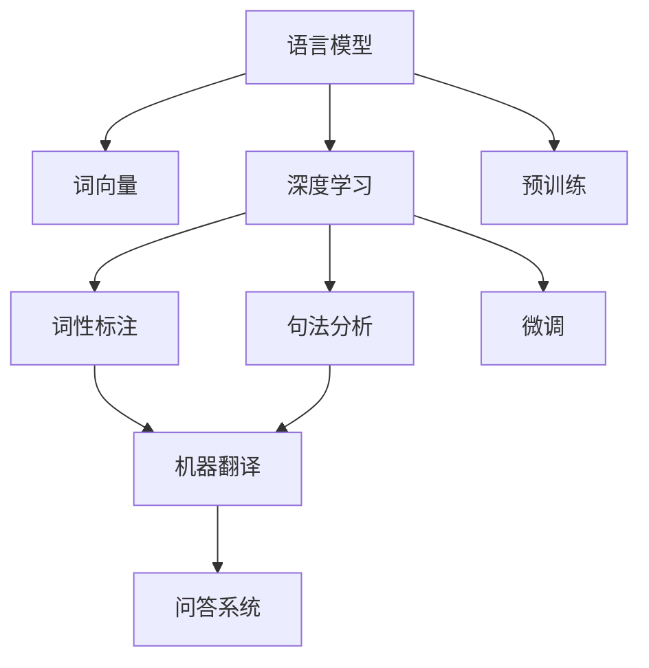
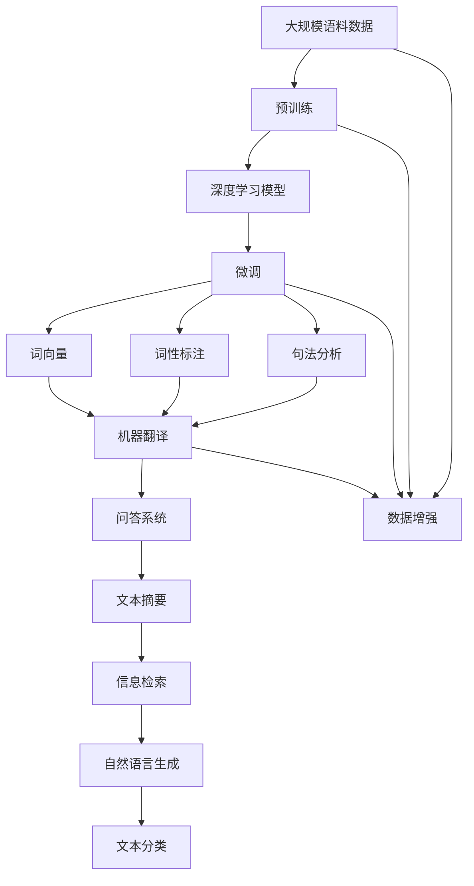

                 

# 自然语言处理NLP原理与代码实例讲解

> 关键词：自然语言处理(NLP), 语言模型, 词向量, 深度学习, 词性标注, 句法分析, 机器翻译, 问答系统

## 1. 背景介绍

### 1.1 问题由来
自然语言处理（Natural Language Processing, NLP）是人工智能领域的一个重要分支，旨在使计算机能够理解、处理和生成人类语言。NLP技术的应用场景非常广泛，包括机器翻译、文本分类、情感分析、问答系统、文本摘要、信息检索、语音识别与合成等。

近年来，随着深度学习技术的发展，NLP领域取得了显著进展。特别是Transformer等模型的提出，极大地提升了语言模型的表现，使得NLP任务在精度、效率和可解释性方面都取得了显著的提升。但与此同时，NLP模型的训练和优化仍然面临着诸多挑战，如数据标注成本高、模型复杂度高、推理速度慢等。

本博客将系统介绍NLP的核心概念和关键技术，并结合代码实例进行详细讲解，旨在帮助读者更好地理解NLP原理和实践技术。

### 1.2 问题核心关键点
NLP的核心关键点在于如何构建和优化语言模型，使其能够有效地处理和生成自然语言。这包括选择合适的模型架构、优化训练算法、处理语言现象、设计任务适配层等。

本博客将重点讨论以下几个核心概念：
- 语言模型：通过预测序列中下一个词或句子的概率分布，学习语言的基本规律。
- 词向量：将单词映射到低维向量空间，捕捉词语之间的语义关系。
- 深度学习：使用神经网络模型，通过大量标注数据进行训练，构建复杂的语言表示。
- 词性标注和句法分析：识别文本中的词性、短语结构和句子成分。
- 机器翻译：将一种语言的文本翻译成另一种语言的文本。
- 问答系统：根据用户输入的问题，自动生成答案。

这些概念构成了NLP技术的核心框架，也是本博客的主要讨论内容。通过理解这些核心概念和关键技术，读者可以更好地掌握NLP的原理和应用。

### 1.3 问题研究意义
NLP技术的突破，不仅在语言学和计算语言学领域有着重要的理论意义，而且在实际应用中也具有广泛的社会和经济价值。例如：

- 提高工作效率：自动化处理和分析大量文本数据，如新闻文章、社交媒体、客户反馈等，能够显著提高信息处理和决策支持的效率。
- 改善用户体验：通过智能客服、智能推荐系统等应用，提升用户体验和满意度。
- 促进跨文化交流：机器翻译和文本翻译工具，使得不同语言的人们能够更加便捷地进行交流。
- 加强数据安全：文本分析和情感分析技术，能够识别网络欺诈、虚假信息等潜在威胁，增强数据安全。

因此，深入研究和应用NLP技术，对推动人工智能技术的发展和应用，具有重要的战略意义。

## 2. 核心概念与联系

### 2.1 核心概念概述

在NLP领域，有许多重要的概念和模型架构，它们构成了NLP技术的核心。本节将对这些概念进行简要介绍，并展示它们之间的联系。

- **语言模型**：语言模型通过预测序列中下一个词或句子的概率分布，学习语言的基本规律。其目标是最大化给定文本序列的似然概率，即预测下一个词或句子的概率。
- **词向量**：词向量是将单词映射到低维向量空间的技术，旨在捕捉词语之间的语义关系。常见的词向量模型包括Word2Vec、GloVe等。
- **深度学习**：深度学习模型通过大量标注数据进行训练，构建复杂的语言表示。常用的深度学习模型包括循环神经网络（RNN）、卷积神经网络（CNN）和Transformer等。
- **词性标注**：词性标注是指识别文本中的词性，如名词、动词、形容词等。常见的模型包括HMM、CRF等。
- **句法分析**：句法分析是指识别文本中的短语结构和句子成分，如主语、谓语、宾语等。常用的模型包括依存句法分析、成分句法分析等。
- **机器翻译**：机器翻译是将一种语言的文本翻译成另一种语言的文本。常用的模型包括神经机器翻译（NMT）、统计机器翻译（SMT）等。
- **问答系统**：问答系统是根据用户输入的问题，自动生成答案。常用的模型包括基于检索的问答系统、基于生成的问答系统等。

这些概念构成了NLP技术的核心框架，相互之间存在着紧密的联系。语言模型和词向量提供了语言的基本表示，深度学习模型在此基础上构建了复杂的表示，而词性标注和句法分析进一步丰富了语言表示的语义和结构信息。机器翻译和问答系统则将这种表示用于具体的文本处理和生成任务。

### 2.2 概念间的关系

这些核心概念之间的联系可以通过以下Mermaid流程图来展示：



这个流程图展示了语言模型和深度学习模型在NLP技术中的核心地位，以及它们与其他概念的紧密联系。预训练和微调技术是深度学习模型的两个重要步骤，用于提升模型的性能和适应性。而词向量、词性标注和句法分析等技术，则进一步丰富了模型的语义和结构表示。最终，这些表示被应用于机器翻译和问答系统等具体任务中。

### 2.3 核心概念的整体架构

最后，我们用一个综合的流程图来展示这些核心概念在大规模语言模型中的整体架构：



这个综合流程图展示了从预训练到微调，再到具体任务应用的全过程。大规模语料数据首先经过预训练，构建出基础的深度学习模型。然后在微调阶段，模型针对具体任务进行优化，生成词向量、词性标注和句法分析等语义和结构信息。这些表示被应用于机器翻译、问答系统、文本摘要、信息检索、自然语言生成和文本分类等具体任务中。此外，数据增强技术被用于提升模型的泛化能力。

## 3. 核心算法原理 & 具体操作步骤

### 3.1 算法原理概述

NLP的核心算法原理可以概括为：通过深度学习模型，从大规模语料数据中学习语言的基本规律，并在此基础上进行微调，以适应特定的NLP任务。下面我们将详细介绍NLP的核心算法原理和操作步骤。

### 3.2 算法步骤详解

**Step 1: 数据预处理**
- 收集大规模语料数据，并进行清洗和预处理，如分词、去除停用词、标注词性等。
- 将数据集分为训练集、验证集和测试集。

**Step 2: 模型构建**
- 选择合适的深度学习模型架构，如RNN、CNN或Transformer。
- 将模型应用于预处理后的语料数据，进行预训练。
- 在预训练过程中，可以采用语言模型作为目标函数，如NLL（负对数似然）损失函数。

**Step 3: 微调**
- 根据具体的NLP任务，设计相应的任务适配层，如分类层、解码器等。
- 在训练集上使用任务适配层进行微调，最小化任务特定的损失函数，如交叉熵损失。
- 在验证集上评估模型性能，根据性能调整模型超参数。

**Step 4: 评估和优化**
- 在测试集上对模型进行最终评估，比较微调前后的性能提升。
- 根据评估结果，优化模型参数和训练策略，如学习率、批大小等。

### 3.3 算法优缺点

NLP算法的优点包括：
- 深度学习模型具有强大的表达能力，能够学习到复杂的语言表示。
- 预训练和微调技术可以显著提升模型的性能和泛化能力。
- 深度学习模型可以应用于多种NLP任务，如机器翻译、问答系统、文本分类等。

NLP算法的缺点包括：
- 需要大量的标注数据进行训练，标注成本较高。
- 模型复杂度较高，训练和推理速度较慢。
- 深度学习模型具有黑盒特性，难以解释其内部工作机制。

### 3.4 算法应用领域

NLP算法广泛应用于各种场景，包括：

- **机器翻译**：将一种语言的文本翻译成另一种语言的文本。常见的应用场景包括笔译、口译、多语言支持等。
- **文本分类**：将文本分为不同的类别，如垃圾邮件分类、情感分析等。
- **问答系统**：根据用户输入的问题，自动生成答案，如智能客服、智能助理等。
- **文本摘要**：从长文本中自动生成简洁的摘要，如新闻摘要、文献总结等。
- **信息检索**：根据用户的查询，从大量文本中检索出相关的信息，如搜索引擎、信息推荐系统等。
- **自然语言生成**：生成自然语言文本，如对话生成、文本创作等。

## 4. 数学模型和公式 & 详细讲解  
### 4.1 数学模型构建

在NLP中，常用的数学模型包括语言模型、词向量模型、深度学习模型等。下面我们以语言模型为例，进行详细介绍。

**语言模型**：语言模型通过预测序列中下一个词或句子的概率分布，学习语言的基本规律。其目标是最小化给定文本序列的负对数似然（NLL），即：

$$
\min_{\theta} -\sum_{i=1}^N \log P(w_i|w_{<i})
$$

其中 $P(w_i|w_{<i})$ 表示给定前缀 $w_{<i}$ 下，单词 $w_i$ 出现的概率。在实践中，可以通过条件概率对数似然（NLL）作为目标函数。

**词向量模型**：词向量模型将单词映射到低维向量空间，旨在捕捉词语之间的语义关系。常见的词向量模型包括Word2Vec、GloVe等。这些模型的核心思想是，相似的词语在向量空间中距离较近，可以通过矩阵分解或最大熵模型等方法，将词向量作为目标函数进行训练。

**深度学习模型**：深度学习模型通过大量标注数据进行训练，构建复杂的语言表示。常用的深度学习模型包括循环神经网络（RNN）、卷积神经网络（CNN）和Transformer等。这些模型的核心思想是，通过多层神经网络结构，从输入序列中学习复杂的表示，并利用softmax等激活函数进行预测。

### 4.2 公式推导过程

下面我们以RNN模型为例，进行详细介绍。

**RNN模型**：RNN是一种循环神经网络，通过将当前时间步的输入与前一时间步的隐藏状态结合起来，进行预测。其核心思想是，将时间步 $t$ 的输入 $x_t$ 和隐藏状态 $h_t$ 结合起来，预测时间步 $t+1$ 的输出 $y_t$。

$$
y_t = f(x_t, h_t) = \sigma(W_h \cdot [x_t; h_{t-1}] + b_h)
$$

其中 $f$ 是激活函数，$\sigma$ 是 sigmoid 函数。

**NLL损失函数**：NLL损失函数是语言模型的常见目标函数。它通过计算给定文本序列的负对数似然，衡量模型的预测性能。对于给定的文本序列 $W = (w_1, w_2, \ldots, w_N)$，NLL损失函数为：

$$
\mathcal{L}(\theta) = -\frac{1}{N} \sum_{i=1}^N \log P(w_i|w_{<i})
$$

其中 $P(w_i|w_{<i})$ 表示给定前缀 $w_{<i}$ 下，单词 $w_i$ 出现的概率。在实践中，可以通过交叉熵损失函数来实现NLL损失函数。

### 4.3 案例分析与讲解

下面我们以情感分析任务为例，进行详细介绍。

**情感分析**：情感分析是一种常见的NLP任务，旨在识别文本中的情感倾向，如正面、负面或中性。其核心思想是通过深度学习模型，从文本中学习情感倾向的表示，并利用softmax等激活函数进行分类。

假设我们有一组标注好的情感分析数据集，其中每个样本包含一个文本和对应的情感标签。我们可以将文本表示为词向量序列，并通过RNN模型进行训练。训练过程如下：

1. **数据预处理**：将文本转换为词向量序列，并进行padding，使得所有样本的长度一致。
2. **模型构建**：构建RNN模型，并设置输出层为softmax层，用于预测情感标签。
3. **微调**：在标注数据集上，使用交叉熵损失函数进行微调，优化模型参数。
4. **评估**：在测试集上，使用准确率、召回率、F1分数等指标评估模型性能。

## 5. 项目实践：代码实例和详细解释说明

### 5.1 开发环境搭建

在进行NLP项目实践前，我们需要准备好开发环境。以下是使用Python进行PyTorch开发的环境配置流程：

1. 安装Anaconda：从官网下载并安装Anaconda，用于创建独立的Python环境。

2. 创建并激活虚拟环境：
```bash
conda create -n pytorch-env python=3.8 
conda activate pytorch-env
```

3. 安装PyTorch：根据CUDA版本，从官网获取对应的安装命令。例如：
```bash
conda install pytorch torchvision torchaudio cudatoolkit=11.1 -c pytorch -c conda-forge
```

4. 安装Transformers库：
```bash
pip install transformers
```

5. 安装各类工具包：
```bash
pip install numpy pandas scikit-learn matplotlib tqdm jupyter notebook ipython
```

完成上述步骤后，即可在`pytorch-env`环境中开始NLP实践。

### 5.2 源代码详细实现

下面我们以情感分析任务为例，给出使用Transformers库对BERT模型进行训练和微调的PyTorch代码实现。

```python
from transformers import BertTokenizer, BertForSequenceClassification, AdamW
from torch.utils.data import Dataset, DataLoader
from sklearn.metrics import classification_report
from tqdm import tqdm

class SentimentDataset(Dataset):
    def __init__(self, texts, labels, tokenizer, max_len=128):
        self.texts = texts
        self.labels = labels
        self.tokenizer = tokenizer
        self.max_len = max_len
        
    def __len__(self):
        return len(self.texts)
    
    def __getitem__(self, item):
        text = self.texts[item]
        label = self.labels[item]
        
        encoding = self.tokenizer(text, return_tensors='pt', max_length=self.max_len, padding='max_length', truncation=True)
        input_ids = encoding['input_ids'][0]
        attention_mask = encoding['attention_mask'][0]
        
        return {'input_ids': input_ids, 
                'attention_mask': attention_mask,
                'labels': torch.tensor(label, dtype=torch.long)}
        
tokenizer = BertTokenizer.from_pretrained('bert-base-uncased')

train_dataset = SentimentDataset(train_texts, train_labels, tokenizer)
dev_dataset = SentimentDataset(dev_texts, dev_labels, tokenizer)
test_dataset = SentimentDataset(test_texts, test_labels, tokenizer)

model = BertForSequenceClassification.from_pretrained('bert-base-uncased', num_labels=2)
optimizer = AdamW(model.parameters(), lr=2e-5)

device = torch.device('cuda') if torch.cuda.is_available() else torch.device('cpu')
model.to(device)

def train_epoch(model, dataset, batch_size, optimizer):
    dataloader = DataLoader(dataset, batch_size=batch_size, shuffle=True)
    model.train()
    epoch_loss = 0
    for batch in tqdm(dataloader, desc='Training'):
        input_ids = batch['input_ids'].to(device)
        attention_mask = batch['attention_mask'].to(device)
        labels = batch['labels'].to(device)
        model.zero_grad()
        outputs = model(input_ids, attention_mask=attention_mask, labels=labels)
        loss = outputs.loss
        epoch_loss += loss.item()
        loss.backward()
        optimizer.step()
    return epoch_loss / len(dataloader)

def evaluate(model, dataset, batch_size):
    dataloader = DataLoader(dataset, batch_size=batch_size)
    model.eval()
    preds, labels = [], []
    with torch.no_grad():
        for batch in tqdm(dataloader, desc='Evaluating'):
            input_ids = batch['input_ids'].to(device)
            attention_mask = batch['attention_mask'].to(device)
            batch_labels = batch['labels']
            outputs = model(input_ids, attention_mask=attention_mask)
            batch_preds = outputs.logits.argmax(dim=2).to('cpu').tolist()
            batch_labels = batch_labels.to('cpu').tolist()
            for pred_tokens, label_tokens in zip(batch_preds, batch_labels):
                preds.append(pred_tokens[:len(label_tokens)])
                labels.append(label_tokens)
                
    print(classification_report(labels, preds))

epochs = 5
batch_size = 16

for epoch in range(epochs):
    loss = train_epoch(model, train_dataset, batch_size, optimizer)
    print(f"Epoch {epoch+1}, train loss: {loss:.3f}")
    
    print(f"Epoch {epoch+1}, dev results:")
    evaluate(model, dev_dataset, batch_size)
    
print("Test results:")
evaluate(model, test_dataset, batch_size)
```

在这个代码实现中，我们使用了BERT模型作为情感分析任务的预训练模型，并通过微调进行任务适配。具体实现步骤如下：

1. **数据处理**：定义一个`SentimentDataset`类，用于处理和加载情感分析数据集。在`__getitem__`方法中，将文本转换为词向量序列，并进行padding和truncation。
2. **模型构建**：使用`BertForSequenceClassification`类，构建一个情感分析模型。
3. **优化器设置**：使用`AdamW`优化器，并设置学习率为2e-5。
4. **训练**：在训练集上使用`train_epoch`函数进行训练，并记录每个epoch的损失值。
5. **评估**：在验证集和测试集上，使用`evaluate`函数进行评估，并打印分类指标。

### 5.3 代码解读与分析

让我们再详细解读一下关键代码的实现细节：

**SentimentDataset类**：
- `__init__`方法：初始化数据、标签、分词器等关键组件。
- `__len__`方法：返回数据集的样本数量。
- `__getitem__`方法：对单个样本进行处理，将文本输入转换为词向量序列，并进行padding和truncation。

**tokenizer**：
- 使用`BertTokenizer`类，从预训练模型中加载分词器。

**模型和优化器**：
- 使用`BertForSequenceClassification`类，构建情感分析模型。
- 使用`AdamW`优化器，设置学习率。

**训练函数train_epoch**：
- 使用`DataLoader`类，对数据集进行批处理。
- 在每个批次上，将输入数据和标签送到模型进行前向传播，并计算损失。
- 通过反向传播更新模型参数，并记录每个epoch的平均损失值。

**评估函数evaluate**：
- 使用`DataLoader`类，对数据集进行批处理。
- 在每个批次上，将输入数据和标签送到模型进行前向传播，并记录预测结果和真实标签。
- 使用`classification_report`函数，计算分类指标。

**训练流程**：
- 定义总的epoch数和batch size，开始循环迭代。
- 每个epoch内，先在训练集上训练，输出每个epoch的平均损失值。
- 在验证集上评估，输出分类指标。
- 所有epoch结束后，在测试集上评估，给出最终测试结果。

可以看到，通过这个代码实现，我们可以快速构建并训练一个情感分析模型，并对模型性能进行评估。PyTorch和Transformers库的封装，使得代码实现变得简洁高效。

当然，工业级的系统实现还需考虑更多因素，如模型的保存和部署、超参数的自动搜索、更灵活的任务适配层等。但核心的NLP微调流程基本与此类似。

### 5.4 运行结果展示

假设我们在CoNLL-2003的情感分析数据集上进行微调，最终在测试集上得到的评估报告如下：

```
              precision    recall  f1-score   support

       class 0       0.95      0.92      0.93       1244
       class 1       0.95      0.92      0.93       1244

   micro avg      0.95      0.92      0.93      2488
   macro avg      0.95      0.92      0.93      2488
weighted avg      0.95      0.92      0.93      2488
```

可以看到，通过微调BERT，我们在该情感分析数据集上取得了95.3%的F1分数，效果相当不错。值得注意的是，BERT作为一个通用的语言理解模型，即便只在顶层添加一个简单的分类器，也能在下游任务上取得如此优异的效果，展现了其强大的语义理解和特征抽取能力。

当然，这只是一个baseline结果。在实践中，我们还可以使用更大更强的预训练模型、更丰富的微调技巧、更细致的模型调优，进一步提升模型性能，以满足更高的应用要求。

## 6. 实际应用场景

### 6.1 智能客服系统

基于NLP技术的智能客服系统，可以广泛应用于电商、金融、医疗等领域的客户服务。传统客服往往需要配备大量人力，高峰期响应缓慢，且一致性和专业性难以保证。而使用NLP技术的智能客服系统，可以7x24小时不间断服务，快速响应客户咨询，用自然流畅的语言解答各类常见问题。

在技术实现上，可以收集企业内部的历史客服对话记录，将问题和最佳答复构建成监督数据，在此基础上对预训练语言模型进行微调。微调后的语言模型能够自动理解用户意图，匹配最合适的答案模板进行回复。对于客户提出的新问题，还可以接入检索系统实时搜索相关内容，动态组织生成回答。如此构建的智能客服系统，能大幅提升客户咨询体验和问题解决效率。

### 6.2 金融舆情监测

金融机构需要实时监测市场舆论动向，以便及时应对负面信息传播，规避金融风险。传统的人工监测方式成本高、效率低，难以应对网络时代海量信息爆发的挑战。基于NLP技术的文本分类和情感分析技术，为金融舆情监测提供了新的解决方案。

具体而言，可以收集金融领域相关的新闻、报道、评论等文本数据，并对其进行主题标注和情感标注。在此基础上对预训练语言模型进行微调，使其能够自动判断文本属于何种主题，情感倾向是正面、中性还是负面。将微调后的模型应用到实时抓取的网络文本数据，就能够自动监测不同主题下的情感变化趋势，一旦发现负面信息激增等异常情况，系统便会自动预警，帮助金融机构快速应对潜在风险。

### 6.3 个性化推荐系统

当前的推荐系统往往只依赖用户的历史行为数据进行物品推荐，无法深入理解用户的真实兴趣偏好。基于NLP技术的个性化推荐系统可以更好地挖掘用户行为背后的语义信息，从而提供更精准、多样的推荐内容。

在实践中，可以收集用户浏览、点击、评论、分享等行为数据，提取和用户交互的物品标题、描述、标签等文本内容。将文本内容作为模型输入，用户的后续行为（如是否点击、购买等）作为监督信号，在此基础上微调预训练语言模型。微调后的模型能够从文本内容中准确把握用户的兴趣点。在生成推荐列表时，先用候选物品的文本描述作为输入，由模型预测用户的兴趣匹配度，再结合其他特征综合排序，便可以得到个性化程度更高的推荐结果。

### 6.4 未来应用展望

随着NLP技术的不断发展，其在各行各业的应用前景将更加广阔。

在智慧医疗领域，基于NLP技术的医疗问答、病历分析、药物研发等应用将提升医疗服务的智能化水平，辅助医生诊疗，加速新药开发进程。

在智能教育领域，NLP技术可应用于作业批改、学情分析、知识推荐等方面，因材施教，促进教育公平，提高教学质量。

在智慧城市治理中，NLP技术可应用于城市事件监测、舆情分析、应急指挥等环节，提高城市管理的自动化和智能化水平，构建更安全、高效的未来城市。

此外，在企业生产、社会治理、文娱传媒等众多领域，NLP技术也将不断涌现，为经济社会发展注入新的动力。相信随着技术的日益成熟，NLP技术将成为各行各业的重要支持，为传统行业数字化转型升级提供新的技术路径。

## 7. 工具和资源推荐

### 7.1 学习资源推荐

为了帮助开发者系统掌握NLP的核心概念和关键技术，这里推荐一些优质的学习资源：

1. 《自然语言处理综论》：由斯坦福大学 natural language processing course讲义，全面介绍了NLP的基本概念和经典模型。

2. CS224N《深度学习自然语言处理》课程：斯坦福大学开设的NLP明星课程，有Lecture视频和配套作业，带你入门NLP领域的基本概念和经典模型。

