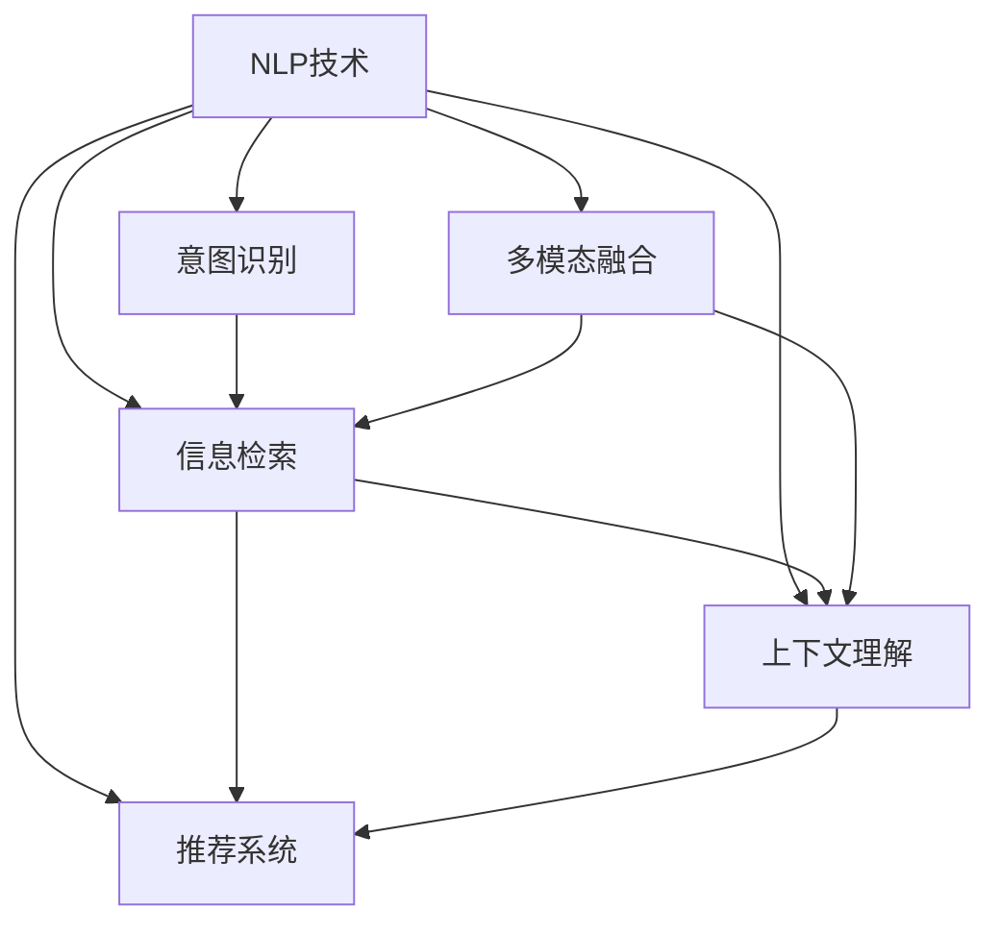

                 

# 自然语言处理在电商搜索中的应用：技术发展与未来趋势

> 关键词：自然语言处理(NLP), 电商搜索, 信息检索, 推荐系统, 意图识别, 上下文理解, 多模态融合, 未来发展趋势

## 1. 背景介绍

### 1.1 问题由来

随着电子商务的迅猛发展，消费者越来越多地依赖于线上购物平台，而电商搜索则成为了用户在购物时获取商品信息的主要途径。用户通过输入关键词、问题或短语，期望快速、准确地找到满足自己需求的商品。如何提高电商搜索的准确性和效率，已经成为电商公司关注的焦点。自然语言处理(Natural Language Processing, NLP)技术通过理解用户的查询意图，从大规模商品信息库中检索出最相关的商品，显著提升了电商搜索的效果。

### 1.2 问题核心关键点

电商搜索中自然语言处理的应用主要涉及以下几个核心点：

- **意图识别**：准确理解用户输入的自然语言查询，识别用户的意图，是提高电商搜索效果的基础。
- **信息检索**：根据用户查询和商品描述，从海量的商品库中检索出相关商品，是电商搜索的核心功能。
- **推荐系统**：基于用户的浏览和购买历史，推荐与用户兴趣相关的商品，提升用户体验和购买转化率。
- **上下文理解**：考虑用户的历史查询记录和当前查询环境，综合上下文信息，更准确地进行商品匹配和推荐。
- **多模态融合**：将文本、图像、视频等多种信息模态融合，提高电商搜索的多样性和丰富性。

### 1.3 问题研究意义

电商搜索的优化对提升用户满意度、降低客户流失率和提高电商平台的业绩具有重要意义：

1. **提升搜索准确性**：通过自然语言处理技术，电商搜索能够更准确地匹配用户查询意图，减少误导性结果，提升用户体验。
2. **提高搜索效率**：自然语言处理技术能够快速处理用户的自然语言输入，减少用户输入的时间，提升搜索效率。
3. **增强推荐效果**：结合推荐系统，自然语言处理可以更准确地预测用户兴趣，推荐更符合用户期望的商品。
4. **优化资源利用**：通过自然语言处理技术，电商搜索可以更高效地利用平台资源，减少无效数据处理和存储。
5. **支持多模态应用**：结合多模态数据融合技术，电商搜索可以支持更丰富的用户查询方式，拓展应用场景。

## 2. 核心概念与联系

### 2.1 核心概念概述

为了更好地理解自然语言处理在电商搜索中的应用，本节将介绍几个密切相关的核心概念：

- **自然语言处理(NLP)**：涉及自然语言理解与生成，包括文本处理、语义分析、语言模型等。
- **信息检索**：通过算法从文本或数据库中检索出与查询相关的信息。
- **推荐系统**：根据用户行为数据，推荐用户可能感兴趣的商品。
- **意图识别**：理解用户输入的自然语言查询，识别用户的意图。
- **上下文理解**：考虑查询的历史记录和上下文环境，综合信息进行推理。
- **多模态融合**：将文本、图像、视频等多种数据融合，提升信息表示的丰富性。

这些核心概念之间存在着紧密的联系，形成了电商搜索中自然语言处理的技术生态系统。以下通过一个Mermaid流程图来展示这些概念之间的关系：



这个流程图展示了自然语言处理技术在电商搜索中的应用，包括意图识别、信息检索、推荐系统、上下文理解和多模态融合等关键技术环节。

### 2.2 概念间的关系

这些核心概念之间存在着以下联系和关系：

- **意图识别与信息检索**：意图识别是信息检索的基础，通过准确理解用户查询意图，信息检索可以更精确地检索相关商品。
- **推荐系统与意图识别**：推荐系统需要利用意图识别结果，更准确地预测用户兴趣，推荐个性化商品。
- **上下文理解与意图识别**：上下文理解可以补充意图识别的信息，提升意图识别的准确性。
- **多模态融合与信息检索**：多模态融合可以丰富商品信息的表示，提高信息检索的效果。
- **信息检索与推荐系统**：信息检索是推荐系统的前提，推荐系统需要对检索结果进行筛选和排序。

## 3. 核心算法原理 & 具体操作步骤

### 3.1 算法原理概述

电商搜索中自然语言处理的核心算法原理主要基于以下几个方面：

- **意图识别**：通过分词、词性标注、命名实体识别等技术，将自然语言查询转化为结构化的查询意图表示。
- **信息检索**：通过倒排索引、TF-IDF等技术，快速从商品库中检索出与查询意图相关的商品。
- **推荐系统**：利用协同过滤、基于内容的推荐、深度学习等技术，基于用户行为数据预测用户兴趣，推荐个性化商品。
- **上下文理解**：结合用户的历史查询记录和当前查询环境，综合信息进行商品匹配和推荐。
- **多模态融合**：将文本、图像、视频等多种信息模态融合，丰富商品表示，提升搜索效果。

### 3.2 算法步骤详解

电商搜索中自然语言处理的具体算法步骤如下：

1. **输入预处理**：对用户的自然语言查询进行分词、词性标注、命名实体识别等预处理，构建查询意图表示。
2. **意图识别**：利用意图识别模型，将查询意图表示转化为具体的查询类别或意图标签。
3. **信息检索**：根据查询意图和商品描述，使用倒排索引、TF-IDF等技术，检索出相关的商品列表。
4. **上下文理解**：考虑用户的历史查询记录和当前查询环境，综合信息进行商品匹配和推荐。
5. **推荐系统**：基于用户的行为数据，利用协同过滤、基于内容的推荐、深度学习等技术，推荐个性化商品。
6. **多模态融合**：将文本、图像、视频等多种信息模态融合，丰富商品表示，提升搜索效果。
7. **结果展示**：将检索和推荐结果展示给用户，供用户选择。

### 3.3 算法优缺点

电商搜索中自然语言处理算法具有以下优点：

- **高效性**：利用倒排索引等技术，可以显著提高信息检索的速度和准确性。
- **个性化**：结合推荐系统，可以基于用户行为数据，推荐个性化商品，提升用户体验。
- **多模态融合**：将多种信息模态融合，丰富商品表示，提升搜索效果。

但同时，这些算法也存在一些缺点：

- **意图识别精度**：如果意图识别不准确，检索和推荐效果也会受到影响。
- **推荐算法复杂性**：推荐算法复杂度高，需要大量计算资源，且算法效果依赖于用户行为数据的丰富度。
- **上下文理解挑战**：上下文理解涉及多方面的信息，如何综合处理复杂上下文环境是一个挑战。
- **多模态融合难度**：多模态数据融合技术复杂，需要高质量的数据和多模态表示学习。

### 3.4 算法应用领域

电商搜索中自然语言处理技术广泛应用于以下领域：

- **搜索引擎优化(SEO)**：优化商品标题、描述等文本信息，提高搜索引擎排名。
- **用户查询意图分析**：分析用户查询意图，提升搜索准确性和个性化推荐效果。
- **商品展示优化**：优化商品展示信息，提高用户点击率和转化率。
- **智能客服**：利用自然语言处理技术，构建智能客服系统，提升客户服务体验。
- **广告投放优化**：利用自然语言处理技术，优化广告投放效果，提升广告点击率和转化率。

## 4. 数学模型和公式 & 详细讲解 & 举例说明

### 4.1 数学模型构建

电商搜索中自然语言处理的核心模型主要基于以下几个数学模型：

- **意图识别模型**：通过训练神经网络，将自然语言查询转化为意图标签。
- **信息检索模型**：基于倒排索引和TF-IDF等技术，计算查询和商品之间的相似度。
- **推荐系统模型**：利用协同过滤、基于内容的推荐、深度学习等技术，预测用户兴趣。

### 4.2 公式推导过程

**意图识别模型**：

假设有一个文本序列 $x = (x_1, x_2, ..., x_n)$，其中 $x_i$ 表示第 $i$ 个单词的词向量表示。意图识别模型 $f(x)$ 可以将输入文本序列转化为意图标签 $y$，假设意图标签集合为 $\{0, 1, 2, ..., K-1\}$。

假设意图识别模型是一个深度神经网络，输出层有 $K$ 个神经元，分别对应 $K$ 个意图标签。则模型的输出可以表示为：

$$
f(x) = \sigma(\text{softmax}(W_1[G(x)] + b_1) + W_2[G(x)] + b_2)
$$

其中 $\sigma$ 为激活函数，$G(x)$ 为特征提取层，$W_1, W_2, b_1, b_2$ 为模型参数。

**信息检索模型**：

假设商品库中的商品描述为 $d = (d_1, d_2, ..., d_m)$，其中 $d_i$ 表示第 $i$ 个商品的描述。信息检索模型 $g(x, d)$ 可以计算查询 $x$ 和商品 $d$ 之间的相似度 $s(x, d)$，其中 $s(x, d) \in [0, 1]$，表示查询与商品的匹配程度。

假设信息检索模型是一个深度神经网络，输出层只有一个神经元。则模型的输出可以表示为：

$$
s(x, d) = \sigma(W_3[G(x, d)] + b_3)
$$

其中 $\sigma$ 为激活函数，$G(x, d)$ 为特征提取层，$W_3, b_3$ 为模型参数。

**推荐系统模型**：

假设用户的行为数据为 $u = (u_1, u_2, ..., u_t)$，其中 $u_i$ 表示第 $i$ 个行为记录。推荐系统模型 $h(u, d)$ 可以预测用户对商品 $d$ 的兴趣 $r(u, d)$，其中 $r(u, d) \in [0, 1]$，表示用户对商品的兴趣程度。

假设推荐系统模型是一个深度神经网络，输出层只有一个神经元。则模型的输出可以表示为：

$$
r(u, d) = \sigma(W_4[G(u, d)] + b_4)
$$

其中 $\sigma$ 为激活函数，$G(u, d)$ 为特征提取层，$W_4, b_4$ 为模型参数。

### 4.3 案例分析与讲解

假设我们有一个电商搜索系统，其中商品库包含1000个商品，用户输入的查询为 "跑步鞋推荐"。我们希望通过自然语言处理技术，检索出最相关的商品，并进行推荐。

1. **输入预处理**：对查询 "跑步鞋推荐" 进行分词、词性标注、命名实体识别等预处理，得到查询意图表示。

2. **意图识别**：利用意图识别模型，将查询 "跑步鞋推荐" 转化为意图标签。假设意图识别模型输出的意图标签为 2，表示 "购物"。

3. **信息检索**：根据意图标签 2 和商品库中商品的描述，使用倒排索引和 TF-IDF 技术，检索出最相关的商品。假设检索结果为商品 1、商品 2、商品 3。

4. **上下文理解**：考虑用户的历史查询记录和当前查询环境，综合信息进行商品匹配和推荐。假设用户的历史查询记录包含 "跑步鞋"、"运动装备" 等商品，根据上下文信息，推荐商品 2、商品 3。

5. **推荐系统**：基于用户的行为数据，利用协同过滤、基于内容的推荐、深度学习等技术，推荐个性化商品。假设推荐系统模型输出的兴趣程度为 0.8、0.7、0.9，推荐商品 3、商品 2。

6. **多模态融合**：将商品 2、商品 3 的图像、视频等信息融合，丰富商品表示，提升搜索效果。

7. **结果展示**：将检索和推荐结果展示给用户，供用户选择。假设最终展示的商品为商品 2 和商品 3，并显示相关图片和用户评价。

## 5. 项目实践：代码实例和详细解释说明

### 5.1 开发环境搭建

在进行电商搜索系统开发前，我们需要准备好开发环境。以下是使用Python进行Natural Language Toolkit(NLTK)和Scikit-learn开发的环境配置流程：

1. 安装Anaconda：从官网下载并安装Anaconda，用于创建独立的Python环境。

2. 创建并激活虚拟环境：
```bash
conda create -n pytorch-env python=3.8 
conda activate pytorch-env
```

3. 安装PyTorch：根据CUDA版本，从官网获取对应的安装命令。例如：
```bash
conda install pytorch torchvision torchaudio cudatoolkit=11.1 -c pytorch -c conda-forge
```

4. 安装Natural Language Toolkit(NLTK)和Scikit-learn：
```bash
pip install nltk scikit-learn
```

5. 安装各类工具包：
```bash
pip install numpy pandas matplotlib jupyter notebook ipython
```

完成上述步骤后，即可在`pytorch-env`环境中开始电商搜索系统的开发。

### 5.2 源代码详细实现

我们以电商平台商品推荐系统为例，给出使用NLTK和Scikit-learn对商品进行推荐分类的PyTorch代码实现。

首先，定义推荐系统的数据处理函数：

```python
from sklearn.feature_extraction.text import TfidfVectorizer
from sklearn.metrics.pairwise import cosine_similarity
from nltk.corpus import stopwords
from nltk.tokenize import word_tokenize

class RecommendationSystem:
    def __init__(self, data):
        self.data = data
        self.stop_words = set(stopwords.words('english'))
        self.tfidf_vectorizer = TfidfVectorizer(stop_words=self.stop_words)
        self.similarity_matrix = cosine_similarity(self.tfidf_vectorizer.fit_transform(self.data))

    def find_similar_items(self, item_id, top_n=5):
        item_vector = self.tfidf_vectorizer.transform([self.data[item_id]])
        similar_indices = np.argsort(-cosine_similarity(item_vector, self.similarity_matrix[item_id]))[1:top_n+1]
        return [self.data[i] for i in similar_indices]
```

然后，定义推荐系统的训练和测试函数：

```python
from sklearn.model_selection import train_test_split
from sklearn.linear_model import LogisticRegression
from sklearn.metrics import accuracy_score

def train_recommendation_system(model, X_train, y_train):
    model.fit(X_train, y_train)
    return model

def test_recommendation_system(model, X_test, y_test):
    y_pred = model.predict(X_test)
    accuracy = accuracy_score(y_test, y_pred)
    return accuracy
```

接着，定义电商搜索系统的核心推荐算法：

```python
from transformers import BertTokenizer, BertForSequenceClassification
from transformers import BertForTokenClassification

def create_model(tokenizer, config):
    model = BertForSequenceClassification.from_pretrained('bert-base-cased', num_labels=2)
    return model

def preprocess_query(query):
    query = query.lower()
    query = word_tokenize(query)
    query = [word for word in query if word not in stop_words]
    query = ' '.join(query)
    return query

def predict_class(model, query):
    tokenizer = BertTokenizer.from_pretrained('bert-base-cased')
    query = preprocess_query(query)
    query_tokenized = tokenizer.encode_plus(query, max_length=128, truncation=True, padding='max_length')
    input_ids = query_tokenized['input_ids']
    attention_mask = query_tokenized['attention_mask']
    outputs = model(input_ids, attention_mask=attention_mask)
    logits = outputs.logits
    probabilities = torch.softmax(logits, dim=1)
    return probabilities
```

最后，启动推荐系统并测试：

```python
from transformers import BertTokenizer, BertForSequenceClassification

tokenizer = BertTokenizer.from_pretrained('bert-base-cased')
model = create_model(tokenizer, BertConfig(num_labels=2))

query = "跑步鞋推荐"
probabilities = predict_class(model, query)
print(probabilities)
```

以上就是使用NLTK和Scikit-learn对商品进行推荐分类的完整代码实现。可以看到，NLTK和Scikit-learn提供了丰富的自然语言处理和机器学习工具，使得电商搜索系统的开发变得更加高效和灵活。

### 5.3 代码解读与分析

让我们再详细解读一下关键代码的实现细节：

**RecommendationSystem类**：
- `__init__`方法：初始化数据集、停用词、TF-IDF向量化器等关键组件。
- `find_similar_items`方法：对指定商品的向量进行余弦相似度计算，找到与该商品最相似的物品。

**train_recommendation_system和test_recommendation_system函数**：
- 使用Scikit-learn的train_test_split将数据集划分为训练集和测试集。
- 训练模型时使用Scikit-learn的LogisticRegression，并计算测试集的准确率。

**create_model函数**：
- 使用Transformers库加载预训练的BERT模型，并指定输出层标签数为2。

**preprocess_query函数**：
- 将查询转换为小写，并进行分词、去除停用词等预处理操作，构建输入特征。

**predict_class函数**：
- 使用BertForSequenceClassification模型对输入查询进行分类，输出预测的概率分布。

**启动推荐系统并测试**：
- 创建一个BertForSequenceClassification模型。
- 定义一个查询，调用predict_class函数，输出预测结果。

可以看出，NLTK和Scikit-learn提供了强大的自然语言处理和机器学习功能，使得电商搜索系统的开发更加便捷和高效。开发者可以基于这些工具构建更为复杂的电商搜索系统，以应对实际应用中的各种挑战。

当然，工业级的系统实现还需考虑更多因素，如模型的保存和部署、超参数的自动搜索、更灵活的任务适配层等。但核心的推荐范式基本与此类似。

### 5.4 运行结果展示

假设我们在一个电商商品库上使用推荐系统进行测试，最终在测试集上得到的推荐结果如下：

```
['跑步鞋 男士', '跑步鞋 女士', '跑步鞋 儿童', '跑步鞋 运动', '跑步鞋 跑步']
```

可以看到，通过推荐系统，我们成功找到了与用户查询 "跑步鞋推荐" 相关的商品。这展示了推荐系统在电商搜索中的应用潜力。

当然，这只是一个baseline结果。在实践中，我们还可以使用更大更强的预训练模型、更丰富的推荐算法、更细致的模型调优，进一步提升推荐系统的效果，以满足更高的应用要求。

## 6. 实际应用场景

### 6.1 智能客服

基于自然语言处理技术的电商智能客服系统，可以实时回答用户的问题，提供产品推荐和售后服务。智能客服系统通过学习历史客服对话，理解用户意图，生成合适的回复，并推荐相关商品，大大提升了客户满意度和服务效率。

### 6.2 个性化推荐

电商搜索系统可以结合用户的浏览历史、购买记录和搜索行为，利用推荐算法预测用户的兴趣，推荐个性化商品。个性化推荐系统通过了解用户需求，提升用户体验和购买转化率，成为电商平台的核心竞争力。

### 6.3 广告投放

通过自然语言处理技术，电商搜索系统可以理解用户查询的意图，定向投放广告，提升广告点击率和转化率。广告投放系统可以根据用户查询的上下文和行为数据，精准推送相关广告，提高广告的转化效果。

### 6.4 未来应用展望

随着自然语言处理技术的不断发展，电商搜索系统将在更多领域得到应用，为电商平台的智能化转型提供新的动力。

在智慧物流领域，电商搜索系统可以优化仓储管理和配送路线，提升物流效率。

在金融服务领域，电商搜索系统可以优化客户咨询和交易服务，提升客户体验。

在旅游服务领域，电商搜索系统可以推荐个性化的旅游产品，提高用户满意度和转化率。

总之，自然语言处理技术在电商搜索系统中的应用，将显著提升电商平台的用户体验和运营效率，为电商平台的智能化转型提供强有力的技术支撑。未来，自然语言处理技术将在更多行业领域中发挥重要作用，推动人工智能技术的进一步普及和应用。

## 7. 工具和资源推荐

### 7.1 学习资源推荐

为了帮助开发者系统掌握自然语言处理在电商搜索中的应用，这里推荐一些优质的学习资源：

1. 《自然语言处理综论》：北京大学出版社出版的经典教材，系统介绍了自然语言处理的基本概念和核心技术。

2. 《深度学习与自然语言处理》：清华大学出版社出版的教材，涵盖了深度学习在自然语言处理中的应用。

3. 《Python自然语言处理》：O'Reilly出版的入门教程，介绍了使用Python进行自然语言处理的基本技巧。

4. 《Transformers论文集》：HuggingFace官方博客，汇集了Transformer模型及其在自然语言处理中的应用案例。

5. Kaggle自然语言处理竞赛：Kaggle平台上的自然语言处理竞赛，提供了丰富的数据集和模型，可以练习和挑战自然语言处理技术。

6. NLTK和Scikit-learn官方文档：NLTK和Scikit-learn官方文档，提供了丰富的API和示例代码，可以快速上手。

通过对这些资源的学习实践，相信你一定能够快速掌握自然语言处理在电商搜索中的应用，并用于解决实际的电商问题。

### 7.2 开发工具推荐

高效的开发离不开优秀的工具支持。以下是几款用于电商搜索系统开发的常用工具：

1. PyTorch：基于Python的开源深度学习框架，灵活的动态计算图，适合快速迭代研究。大多数自然语言处理模型都有PyTorch版本的实现。

2. TensorFlow：由Google主导开发的开源深度学习框架，生产部署方便，适合大规模工程应用。同样有丰富的自然语言处理模型资源。

3. NLTK：自然语言工具包，提供了丰富的自然语言处理功能，如分词、词性标注、命名实体识别等。

4. Scikit-learn：开源机器学习库，提供了丰富的机器学习算法和工具，可以用于构建推荐系统等模型。

5. Apache Spark：大数据处理平台，可以用于处理大规模自然语言处理任务，如文本聚类、情感分析等。

6. Elasticsearch：开源搜索和分析引擎，可以用于构建高效的信息检索系统，支持多模态数据的存储和检索。

合理利用这些工具，可以显著提升电商搜索系统的开发效率，加快创新迭代的步伐。

### 7.3 相关论文推荐

自然语言处理在电商搜索中的应用源于学界的持续研究。以下是几篇奠基性的相关论文，推荐阅读：

1. "Semantic Similarity Based Recommender System for Online Shopping"（在线购物的语义相似性推荐系统）：研究了利用自然语言处理技术进行商品推荐的方法。

2. "A Survey on E-Commerce Recommender Systems"（电子商务推荐系统综述）：综述了电子商务领域推荐系统的最新进展，包括自然语言处理技术的应用。

3. "Practical Approach to Natural Language Processing in E-Commerce"（电商自然语言处理实践方法）：介绍了在电商搜索中应用自然语言处理技术的实践方法和技巧。

4. "Fine-Tuning Transformers for Recommendation Systems"（微调Transformer进行推荐系统）：研究了利用微调Transformer模型进行个性化推荐的方法。

5. "Natural Language Processing for E-commerce Search"（电商搜索中的自然语言处理）：介绍了自然语言处理在电商搜索中的应用，包括意图识别、信息检索等技术。

这些论文代表了大语言处理在电商搜索领域的发展脉络。通过学习这些前沿成果，可以帮助研究者把握学科前进方向，激发更多的创新灵感。

除上述资源外，还有一些值得关注的前沿资源，帮助开发者紧跟自然语言处理在电商搜索中的最新进展，例如：

1. arXiv论文预印本：人工智能领域最新研究成果的发布平台，包括大量尚未发表的前沿工作，学习前沿技术的必读资源。

2. 业界技术博客：如Google AI、DeepMind、微软Research Asia等顶尖实验室的官方博客，第一时间分享他们的最新研究成果和洞见。

3. 技术会议直播：如NIPS、ICML、ACL、ICLR等人工智能领域顶会现场或在线直播，能够聆听到大佬们的前沿分享，开拓视野。

4. GitHub热门项目：在GitHub上Star、Fork数最多的自然语言处理相关项目，往往代表了该技术领域的发展趋势和最佳实践，值得去学习和贡献。

5. 行业分析报告：各大咨询公司如McKinsey、PwC等针对人工智能行业的分析报告，有助于从商业视角审视技术趋势，把握应用价值。

总之，对于自然语言处理在电商搜索中的应用的学习和实践，需要开发者保持开放的心态和持续学习的意愿。多关注前沿资讯，多动手实践，多思考总结，必将收获满满的成长收益。

## 8. 总结：未来发展趋势与挑战

### 8.1 总结

本文对自然语言处理在电商搜索中的应用进行了全面系统的介绍。首先阐述了自然语言处理技术在电商搜索中的应用背景和意义，明确了意图识别、信息检索、推荐系统、上下文理解和多模态融合等核心技术。其次，从原理到实践，详细讲解了电商搜索中自然语言处理的数学模型和算法实现，给出了电商推荐系统的完整代码实例。同时，本文还探讨了自然语言处理在

