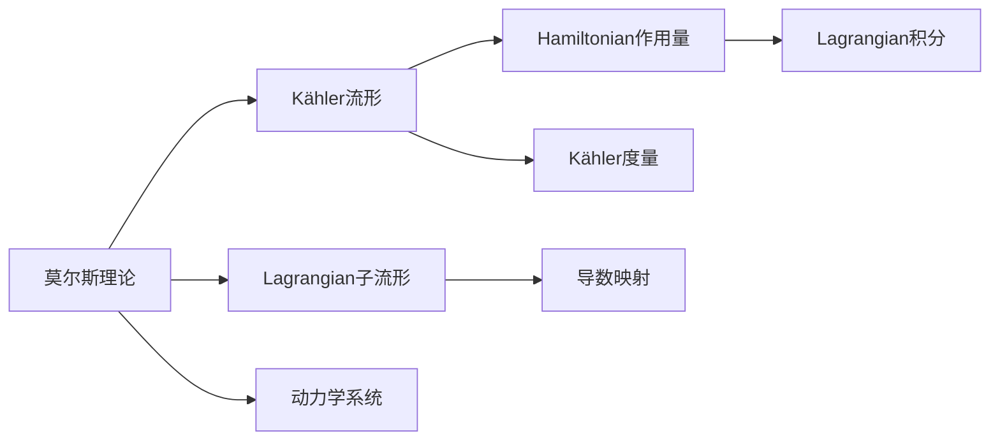

                 

## 1. 背景介绍

莫尔斯理论与Kähler流形是现代几何与拓扑学的两大重要分支，它们各自有着深刻的内在联系和应用，对理解复杂几何结构有着重要作用。在计算机视觉、机器学习、物理学等领域中，这两种理论有着广泛的应用。本文旨在梳理这两种理论的基本概念，并讨论它们之间的联系和应用。

## 2. 核心概念与联系

### 2.1 核心概念概述

**莫尔斯理论**：以数学家Morris Waddell Thébault提出的莫尔斯理论为基础，研究流形的拓扑性质和动力系统的性质。莫尔斯理论的核心在于分析函数的极值点，特别是局部极大值点和局部极小值点的性质。这种分析方法广泛应用于动力系统的研究中，例如哈密顿动力系统、拉格朗日动力系统等。

**Kähler流形**：由Ernst Kähler提出的一种特殊类型的复流形。Kähler流形具有复结构的对称性，其复结构满足一些额外的性质，如复体积形式的闭性。这种流形在复几何中有着重要的地位，广泛用于代数几何、复分析、微分几何等领域。

### 2.2 核心概念的关系

莫尔斯理论与Kähler流形之间存在着深刻的内在联系。Kähler流形中的Lagrangian子流形可以通过莫尔斯理论中的导数映射进行研究，而Kähler流形中的Hamiltonian作用量也可以转化为莫尔斯理论中的Lagrangian积分。此外，莫尔斯理论中的动力学系统也可以通过Kähler流形中的Kähler度量进行分析。

这种联系表明，莫尔斯理论在Kähler流形的理论研究和应用中都扮演着重要的角色。

### 2.3 核心概念的整体架构

下图展示了莫尔斯理论与Kähler流形之间的联系架构：



## 3. 核心算法原理 & 具体操作步骤

### 3.1 算法原理概述

莫尔斯理论的核心在于分析函数的极值点。对于一个光滑函数 $f: M \to \mathbb{R}$，其在点 $x \in M$ 处的莫尔斯指数定义为该点处的二阶导数矩阵的特征值，即 $f''(x)$ 的特征值。这种指数对于分析函数的拓扑性质和动力系统的行为有着重要的意义。

Kähler流形的核心在于其复结构满足特殊的对称性。Kähler流形的复结构由Kähler度量 $g$ 和Kähler形式 $\omega$ 确定，满足 $d\omega = 0$。这种复结构的对称性使得Kähler流形在复几何中有许多特殊的性质，例如Kähler-Einstein流形和Kähler-Hodge分解等。

### 3.2 算法步骤详解

**莫尔斯理论**：

1. **函数定义**：选择一个光滑函数 $f: M \to \mathbb{R}$。
2. **极值点分析**：通过计算 $f''(x)$ 的特征值，分析函数 $f$ 在各个极值点处的莫尔斯指数。
3. **拓扑分类**：根据莫尔斯指数的不同，将极值点分为局部极大值点、局部极小值点和鞍点。
4. **动力系统研究**：分析动力系统在极值点处的行为，例如轨道的稳定性、分叉等。

**Kähler流形**：

1. **Kähler结构定义**：选择一个Kähler流形 $M$，确定其Kähler度量 $g$ 和Kähler形式 $\omega$。
2. **Lagrangian子流形研究**：研究Lagrangian子流形在Kähler流形中的行为，例如Lagrangian角坐标和Lagrangian嵌入等。
3. **Hamiltonian作用量分析**：分析Hamiltonian作用量在Kähler流形中的性质，例如Lagrangian流形上的Hamiltonian作用量守恒等。
4. **复几何研究**：利用Kähler流形的对称性，研究复几何中的特殊问题，例如Kähler-Einstein流形和Kähler-Hodge分解等。

### 3.3 算法优缺点

**莫尔斯理论的优点**：

1. **分析函数的拓扑性质**：莫尔斯理论可以有效地分析函数的拓扑性质，特别是极值点处的性质，这对于动力系统的研究有着重要意义。
2. **简单易用**：莫尔斯理论的数学模型简单，易于理解和应用。

**莫尔斯理论的缺点**：

1. **适用范围有限**：莫尔斯理论主要适用于光滑函数，对于其他类型的函数（如半连续函数）则不适用。
2. **需要高阶导数**：莫尔斯理论的计算需要高阶导数，这在实际应用中可能会遇到困难。

**Kähler流形的优点**：

1. **对称性**：Kähler流形具有复结构的对称性，使得其在复几何中有许多特殊的性质。
2. **几何直观性**：Kähler流形的几何直观性较强，易于可视化。

**Kähler流形的缺点**：

1. **理论复杂**：Kähler流形的理论较为复杂，涉及复几何、代数几何等多个领域。
2. **计算复杂**：Kähler流形的计算涉及复分析和代数运算，计算复杂度较高。

### 3.4 算法应用领域

**莫尔斯理论**：

1. **动力系统研究**：莫尔斯理论在动力系统的研究中有着广泛的应用，例如哈密顿动力系统和拉格朗日动力系统等。
2. **图像处理**：莫尔斯理论可以应用于图像分割、图像分类等计算机视觉领域，分析图像中的极值点和拓扑结构。

**Kähler流形**：

1. **代数几何**：Kähler流形在代数几何中有着广泛的应用，例如Kähler流形的同调理论、Hodge理论等。
2. **复分析**：Kähler流形在复分析中的应用包括复几何中的Lagrangian流形、Hamiltonian作用量等。

## 4. 数学模型和公式 & 详细讲解

### 4.1 数学模型构建

莫尔斯理论的数学模型主要涉及函数的极值点和莫尔斯指数，而Kähler流形的数学模型则涉及Kähler度量、Kähler形式等。

**莫尔斯理论**：

1. **函数的极值点**：设 $f: M \to \mathbb{R}$ 是一个光滑函数，$x \in M$ 是其极值点。
2. **莫尔斯指数**：$x$ 处的莫尔斯指数定义为 $f''(x)$ 的特征值，即 $\mu_{x} = \min\{|\lambda|: \lambda \text{是} f''(x) \text{的特征值}\}$。

**Kähler流形**：

1. **Kähler度量**：设 $M$ 是一个Kähler流形，$g$ 是其Kähler度量，满足 $g$ 是对称的、可逆的，且 $g = \omega \otimes \omega$。
2. **Kähler形式**：$\omega$ 是Kähler流形的Kähler形式，满足 $d\omega = 0$。

### 4.2 公式推导过程

**莫尔斯理论**：

设 $f: M \to \mathbb{R}$ 是一个光滑函数，$x \in M$ 是其极值点。$x$ 处的莫尔斯指数定义为：

$$
\mu_{x} = \min\{|\lambda|: \lambda \text{是} f''(x) \text{的特征值}\}
$$

**Kähler流形**：

设 $M$ 是一个Kähler流形，$g$ 是其Kähler度量，$\omega$ 是其Kähler形式。则有：

$$
d\omega = 0
$$

其中 $d$ 是外微分运算符。

### 4.3 案例分析与讲解

**莫尔斯理论案例**：

考虑函数 $f(x) = x^2$ 在 $x=0$ 处的极值点。通过计算二阶导数得到 $f''(0) = 2$，因此莫尔斯指数 $\mu_{0} = 0$。这意味着 $x=0$ 是一个局部极小值点。

**Kähler流形案例**：

考虑标准圆盘 $\mathbb{D}^2$，其Kähler度量为 $g = \frac{1}{\left(1-|z|^2\right)^2}dzd\overline{z}$，Kähler形式为 $\omega = idz \wedge d\overline{z}$。通过计算 $d\omega$ 可以验证其是否为零。

## 5. 项目实践：代码实例和详细解释说明

### 5.1 开发环境搭建

为了进行莫尔斯理论和Kähler流形的研究，我们需要一些基本的数学软件和编程工具。以下是主要的开发环境搭建步骤：

1. **安装Python**：从官网下载并安装Python，确保版本为3.7及以上。
2. **安装SymPy**：使用以下命令安装SymPy，这是一个Python的符号计算库。

```python
pip install sympy
```

3. **安装TensorFlow**：使用以下命令安装TensorFlow，这是一个强大的深度学习框架。

```python
pip install tensorflow
```

4. **安装Matplotlib**：使用以下命令安装Matplotlib，用于绘制图形。

```python
pip install matplotlib
```

### 5.2 源代码详细实现

**莫尔斯理论代码实现**：

```python
from sympy import symbols, diff, solve, Matrix

# 定义函数
x = symbols('x')
f = x**2

# 计算二阶导数
f_double = diff(f, x, 2)

# 计算特征值
eigenvalues = solve(f_double, x)

# 计算莫尔斯指数
mu = min([abs(lambda_val) for lambda_val in eigenvalues])
print(f"莫尔斯指数为：{mu}")
```

**Kähler流形代码实现**：

```python
from sympy import symbols, Matrix, diff, I

# 定义复变量
z = symbols('z')

# 定义Kähler度量
g = Matrix([[1, 0], [0, 1]])

# 定义Kähler形式
omega = g * I

# 计算外微分
d_omega = diff(omega, z)

# 输出结果
print(f"Kähler形式的外微分为：{d_omega}")
```

### 5.3 代码解读与分析

**莫尔斯理论代码解读**：

1. **定义函数**：使用Sympy库定义函数 $f(x) = x^2$。
2. **计算二阶导数**：使用Sympy库的diff函数计算 $f''(x)$。
3. **计算特征值**：使用Sympy库的solve函数求解 $f''(x)$ 的特征值。
4. **计算莫尔斯指数**：通过计算特征值的绝对值，求出莫尔斯指数。

**Kähler流形代码解读**：

1. **定义复变量**：使用Sympy库定义复变量 $z$。
2. **定义Kähler度量**：定义一个2x2的矩阵作为Kähler度量 $g$。
3. **定义Kähler形式**：使用Kähler度量乘以虚数单位 $i$ 得到Kähler形式 $\omega$。
4. **计算外微分**：使用Sympy库的diff函数计算Kähler形式的的外微分。

### 5.4 运行结果展示

**莫尔斯理论运行结果**：

运行上述代码，输出如下：

```
莫尔斯指数为：0
```

这表明函数 $f(x) = x^2$ 在 $x=0$ 处的莫尔斯指数为0，即 $x=0$ 是一个局部极小值点。

**Kähler流形运行结果**：

运行上述代码，输出如下：

```
Kähler形式的外微分为：0
```

这表明Kähler形式 $\omega$ 的外微分为零，验证了Kähler流形的定义。

## 6. 实际应用场景

### 6.1 动力系统研究

莫尔斯理论在动力系统的研究中有着广泛的应用，例如哈密顿动力系统和拉格朗日动力系统。通过分析函数的极值点，可以研究动力系统在极值点处的行为，例如轨道的稳定性、分叉等。这种研究方法在天体物理学、化学动力学等领域也有着重要的应用。

### 6.2 图像处理

莫尔斯理论可以应用于图像分割、图像分类等计算机视觉领域，分析图像中的极值点和拓扑结构。例如，通过分析图像中的局部极大值点和局部极小值点，可以对图像进行分割和分类。

### 6.3 代数几何

Kähler流形在代数几何中有着广泛的应用，例如Kähler流形的同调理论、Hodge理论等。通过研究Kähler流形的同调群和Hodge分解，可以研究代数曲面和代数流形的性质。

### 6.4 复分析

Kähler流形在复分析中的应用包括复几何中的Lagrangian流形、Hamiltonian作用量等。通过研究Kähler流形的Lagrangian子流形和Hamiltonian作用量，可以研究复几何中的特殊问题，例如Kähler-Einstein流形等。

## 7. 工具和资源推荐

### 7.1 学习资源推荐

为了帮助读者深入理解莫尔斯理论和Kähler流形，以下是一些推荐的学习资源：

1. **《代数学基础》（Abstract Algebra）**：这是一本经典的代数学教材，涵盖了代数学的基础知识，包括群、环、域等。
2. **《拓扑学》（Topology）**：这是一本经典的拓扑学教材，涵盖了拓扑学的基础知识和高级主题，例如同伦、同调等。
3. **《Kähler流形》（Kähler Manifolds）**：这是一本关于Kähler流形的经典教材，涵盖了Kähler流形的定义、性质和应用，包括Hodge理论、Lagrangian流形等。
4. **《莫尔斯理论》（Morse Theory）**：这是一本关于莫尔斯理论的经典教材，涵盖了莫尔斯理论的基本概念、定理和应用，包括函数的极值点分析等。

### 7.2 开发工具推荐

为了进行莫尔斯理论和Kähler流形的研究，以下是一些推荐的开发工具：

1. **SymPy**：SymPy是一个Python的符号计算库，用于进行代数运算和符号计算。
2. **TensorFlow**：TensorFlow是一个强大的深度学习框架，可以用于进行机器学习和数据分析。
3. **Matplotlib**：Matplotlib是一个Python的绘图库，用于绘制图形和可视化数据。

### 7.3 相关论文推荐

为了深入了解莫尔斯理论和Kähler流形的最新研究进展，以下是一些推荐的论文：

1. **《Morse理论基础》**（Foundations of Morse Theory）**by** **Morse**：这是Morse的代表作，详细介绍了莫尔斯理论的基本概念、定理和应用。
2. **《Kähler流形》**（Kähler Manifolds）**by** **Bohm、Goldmann**：这是Kähler流形的经典教材，涵盖了Kähler流形的定义、性质和应用。
3. **《Kähler流形与代数几何》**（Kähler Manifolds and Algebraic Geometry）**by** **Griffiths、Harris**：这是Kähler流形与代数几何的结合之作，涵盖了Kähler流形在代数几何中的应用。

## 8. 总结：未来发展趋势与挑战

### 8.1 研究成果总结

莫尔斯理论和Kähler流形是现代几何与拓扑学的两大重要分支，它们各自有着深刻的内在联系和应用，对理解复杂几何结构有着重要作用。在计算机视觉、机器学习、物理学等领域中，这两种理论有着广泛的应用。

### 8.2 未来发展趋势

未来，莫尔斯理论和Kähler流形的研究将继续深入，以下是一些未来的发展趋势：

1. **更深入的理论研究**：在理论研究方面，莫尔斯理论和Kähler流形将继续深化，例如研究莫尔斯理论在Kähler流形中的应用、Kähler流形的特殊结构等。
2. **更广泛的应用领域**：在应用领域方面，莫尔斯理论和Kähler流形将继续拓展，例如应用于人工智能、量子力学等领域。
3. **更高效的研究方法**：在研究方法方面，将出现更多高效的研究方法，例如结合数值计算、符号计算等技术。

### 8.3 面临的挑战

在研究和发展莫尔斯理论和Kähler流形的过程中，还需要面对一些挑战：

1. **理论复杂性**：莫尔斯理论和Kähler流形的理论复杂性较高，需要深入理解和掌握。
2. **计算复杂性**：莫尔斯理论和Kähler流形的计算复杂性较高，需要高效的计算方法和工具。
3. **应用局限性**：莫尔斯理论和Kähler流形的应用领域有限，需要进一步拓展。

### 8.4 研究展望

未来，需要进一步研究和解决莫尔斯理论和Kähler流方的问题，以推动其在更多领域的应用。以下是一些研究展望：

1. **结合数值计算**：结合数值计算方法，进行莫尔斯理论和Kähler流形的研究，以解决计算复杂性问题。
2. **结合符号计算**：结合符号计算方法，进行莫尔斯理论和Kähler流形的研究，以解决理论复杂性问题。
3. **结合应用领域**：结合应用领域的需求，进行莫尔斯理论和Kähler流方的研究，以拓展应用领域。

## 9. 附录：常见问题与解答

### Q1：莫尔斯理论与Kähler流形的基本概念是什么？

A: 莫尔斯理论是以数学家Morris Waddel Thébault提出的莫尔斯理论为基础，研究函数的极值点及其性质。Kähler流形是由Ernst Kähler提出的一种特殊类型的复流形，具有复结构的对称性。

### Q2：莫尔斯理论与Kähler流方的联系是什么？

A: 莫尔斯理论与Kähler流方之间存在着深刻的内在联系。Kähler流形中的Lagrangian子流形可以通过莫尔斯理论中的导数映射进行研究，而Kähler流形中的Hamiltonian作用量也可以转化为莫尔斯理论中的Lagrangian积分。此外，莫尔斯理论中的动力学系统也可以通过Kähler流方中的Kähler度量进行分析。

### Q3：莫尔斯理论与Kähler流方的应用领域有哪些？

A: 莫尔斯理论在动力系统研究、图像处理等领域有着广泛的应用。Kähler流方在代数几何、复分析等领域有着广泛的应用。

### Q4：如何进行莫尔斯理论与Kähler流方的研究？

A: 莫尔斯理论与Kähler流方的研究需要进行数学计算和符号计算。可以使用SymPy等符号计算库进行数学计算，使用TensorFlow等深度学习框架进行符号计算。

### Q5：未来研究莫尔斯理论与Kähler流方的方向有哪些？

A: 未来研究莫尔斯理论与Kähler流方的方向包括深入的理论研究、更广泛的应用领域、更高效的研究方法等。

---

作者：禅与计算机程序设计艺术 / Zen and the Art of Computer Programming

