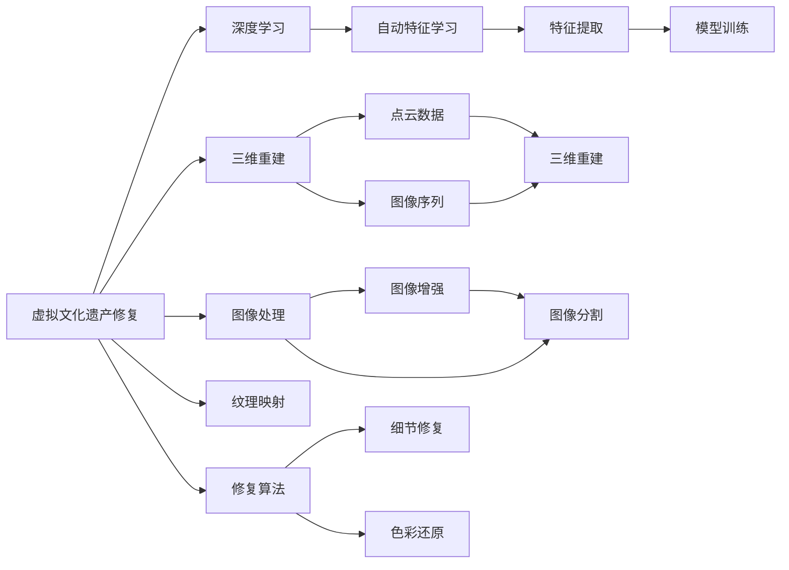
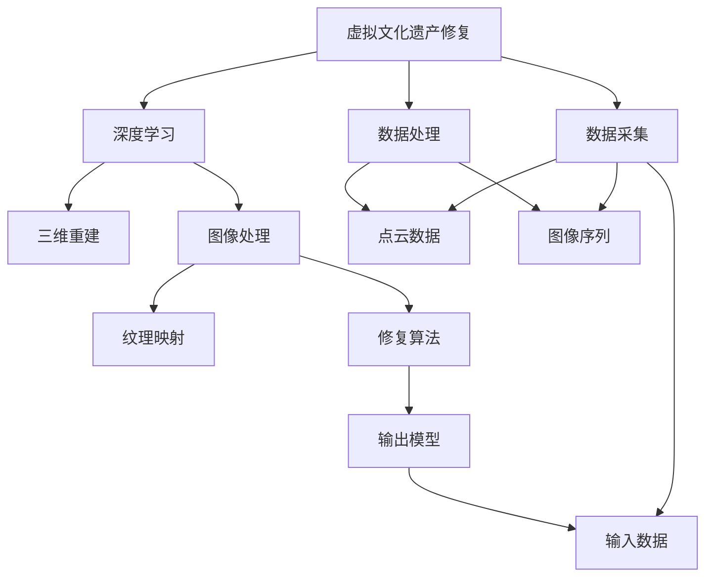
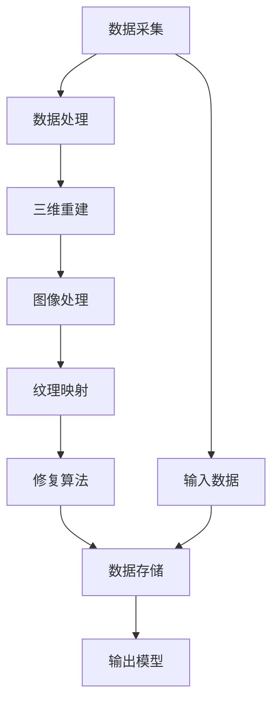

                 

# 虚拟文化遗产修复:全球文明记忆的数字化重建

> 关键词：虚拟文化遗产修复, 数字化重建, 深度学习, 文化遗产保护, 三维重建, 三维重建技术

## 1. 背景介绍

### 1.1 问题由来

随着科技的飞速发展，全球各地的文化遗产正面临着前所未有的威胁。气候变化、自然灾害、人为破坏等因素使得这些珍贵的历史记忆面临着损毁甚至消失的风险。为了保护和传承人类文明，虚拟文化遗产修复技术应运而生。通过计算机技术和大数据手段，虚拟文化遗产修复能够将受损的文化遗产通过数字化手段还原并保存，为后代提供宝贵的学习资源。

### 1.2 问题核心关键点

虚拟文化遗产修复的核心关键点在于利用先进的数字化技术，对受损的历史遗产进行高质量的数字化重建。具体包括：
- 数据采集：通过多角度、多分辨率的拍摄和扫描，收集详细的历史遗产数据。
- 数据处理：对采集的数据进行去噪、校正、拼接等预处理，确保数据的质量。
- 模型构建：利用三维重建技术，构建高精度的虚拟文化遗产模型。
- 修复优化：应用深度学习等技术，对虚拟文化遗产进行细节修复和色彩还原。
- 数据存储：使用高效率的数据格式和存储方案，确保数据的安全和长期保存。

### 1.3 问题研究意义

虚拟文化遗产修复技术对人类社会的意义重大：
- 历史遗产保护：能够有效防止自然和人为破坏，延长文物的保存期限。
- 文化传播：通过数字化手段，使更多人能够方便地访问和研究历史遗产。
- 教育科研：为学者和学生提供丰富的学习资源，推动文化教育的发展。
- 经济价值：在文化遗产展示和旅游方面具有巨大的商业潜力。

## 2. 核心概念与联系

### 2.1 核心概念概述

虚拟文化遗产修复涉及到以下几个核心概念：

- **虚拟文化遗产修复**：使用计算机技术和数字化手段，对受损的历史遗产进行高质量的数字化重建，以保留和传承人类文明记忆。
- **深度学习**：一种基于神经网络的机器学习方法，能够自动从数据中学习特征，进行复杂的模式识别和分类任务。
- **三维重建**：利用计算机图形学技术，从点云数据、图像序列等输入，生成高精度的三维模型。
- **图像处理**：包括图像增强、去噪、分割等，确保输入数据的质量。
- **纹理映射**：将彩色图像信息映射到三维模型表面，增强模型的视觉真实感。
- **修复算法**：通过深度学习等技术，对虚拟文化遗产进行细节修复和色彩还原。
- **数据存储**：使用高效率的数据格式和存储方案，确保数据的安全和长期保存。

这些概念之间存在着紧密的联系，形成了一个完整的虚拟文化遗产修复技术体系。下图展示了这些概念之间的联系和关系：



### 2.2 概念间的关系

这些核心概念之间的关系可以通过以下Mermaid流程图来展示：



这个流程图展示了虚拟文化遗产修复过程中的数据流向和处理流程。从数据采集到模型输出，每一个环节都是紧密相连、相互依赖的。

### 2.3 核心概念的整体架构

最后，我们用一个综合的流程图来展示虚拟文化遗产修复过程中各个核心概念之间的整体架构：



这个综合流程图展示了虚拟文化遗产修复从数据采集到模型输出的完整流程。通过这些核心概念的紧密协作，实现了对历史遗产的高质量数字化重建。

## 3. 核心算法原理 & 具体操作步骤
### 3.1 算法原理概述

虚拟文化遗产修复的算法原理可以概括为以下几个步骤：

1. **数据采集**：通过多角度、多分辨率的拍摄和扫描，收集详细的历史遗产数据。
2. **数据处理**：对采集的数据进行去噪、校正、拼接等预处理，确保数据的质量。
3. **模型构建**：利用三维重建技术，从点云数据、图像序列等输入，生成高精度的三维模型。
4. **修复优化**：应用深度学习等技术，对虚拟文化遗产进行细节修复和色彩还原。
5. **数据存储**：使用高效率的数据格式和存储方案，确保数据的安全和长期保存。

每个步骤的具体实现涉及到多种技术手段，下面将详细讲解。

### 3.2 算法步骤详解

#### 3.2.1 数据采集

数据采集是虚拟文化遗产修复的第一步。常用的数据采集方法包括：

- **三维扫描**：使用激光扫描仪或光结构相机，对历史遗产进行高精度的三维扫描，获取点云数据。
- **多角度摄影**：利用多个相机从不同角度拍摄历史遗产，获取多角度的图像数据。
- **视频记录**：通过录制历史遗产的视频，获取时间序列的图像数据。

#### 3.2.2 数据处理

数据处理的主要目的是对采集的数据进行去噪、校正、拼接等预处理，确保数据的质量。常用的数据处理方法包括：

- **去噪处理**：对点云数据或图像数据进行去噪，去除噪音点和斑点，提高数据质量。
- **校正处理**：对采集的数据进行几何校正，校正尺度、旋转、平移等误差。
- **拼接处理**：对多角度的图像数据进行拼接，生成完整的图像数据集。

#### 3.2.3 三维重建

三维重建是虚拟文化遗产修复的核心步骤。常用的三维重建方法包括：

- **点云重建**：利用点云数据，通过三角化或表面拟合等方法，生成三维模型。
- **图像序列重建**：利用多角度的图像数据，通过立体视觉或光流估计等方法，生成三维模型。
- **混合重建**：结合点云和图像数据，利用多视图几何或深度学习等方法，生成高质量的三维模型。

#### 3.2.4 修复优化

修复优化是虚拟文化遗产修复的关键步骤。常用的修复优化方法包括：

- **细节修复**：利用深度学习等技术，对三维模型进行细节修复，如填补缺损、消除裂缝等。
- **色彩还原**：利用深度学习等技术，对三维模型进行色彩还原，如纹理映射、颜色调整等。
- **光照明模**：利用深度学习等技术，对三维模型进行光照明模，如环境光模拟、光源模拟等。

#### 3.2.5 数据存储

数据存储是虚拟文化遗产修复的最后一个步骤。常用的数据存储方案包括：

- **点云数据**：使用二进制格式，如ply、pcd等，存储高精度的点云数据。
- **图像数据**：使用常见的图像格式，如jpg、png等，存储高质量的图像数据。
- **三维模型**：使用常见的三维格式，如obj、stl等，存储高精度的三维模型。

### 3.3 算法优缺点

虚拟文化遗产修复技术的优点：

- **高效性**：能够快速高效地对历史遗产进行数字化重建，节省了大量时间和成本。
- **精确性**：利用先进的三维重建和修复技术，能够生成高精度的虚拟文化遗产模型。
- **可扩展性**：能够处理大规模的历史遗产数据，适应不同尺度和复杂度的文化遗产。

虚拟文化遗产修复技术的缺点：

- **成本高**：数据采集和处理需要专业的设备和软件，成本较高。
- **技术复杂**：涉及多学科的交叉技术，需要具备专业的技术背景和经验。
- **数据质量**：采集数据的质量对最终结果影响较大，需要严格控制数据采集和处理的质量。

### 3.4 算法应用领域

虚拟文化遗产修复技术主要应用于以下领域：

- **文物保护**：对受损的历史文物进行数字化重建，延长文物的保存期限。
- **历史研究**：通过数字化手段，对历史文化遗产进行复原和研究，为学者提供丰富的学习资源。
- **博物馆展示**：将虚拟文化遗产用于博物馆展示，提升观众的参观体验。
- **旅游开发**：在旅游景区中，利用虚拟文化遗产进行虚拟导览和互动体验，吸引游客。

## 4. 数学模型和公式 & 详细讲解 & 举例说明
### 4.1 数学模型构建

虚拟文化遗产修复的数学模型主要涉及以下几个部分：

- **点云数据模型**：利用点云数据，构建高精度的三维模型。
- **图像数据模型**：利用图像数据，生成高质量的二维图像。
- **三维重建模型**：利用点云和图像数据，生成高精度的三维模型。
- **修复优化模型**：利用深度学习等技术，对三维模型进行细节修复和色彩还原。

以三维重建模型为例，常见的数学模型包括：

- **多视图几何（MVS）**：通过多角度的图像数据，生成三维模型。
- **光流估计**：利用光流算法，从视频数据中提取运动信息，生成三维模型。
- **深度学习模型**：利用深度学习算法，从点云和图像数据中生成三维模型。

### 4.2 公式推导过程

以多视图几何模型为例，推导如下：

1. **模型假设**：假设历史遗产是一个完整的立方体，点云数据从四个角度拍摄，每个角度拍摄16张图像。

2. **相机模型**：假设每个角度的相机参数已知，包括内参矩阵$K$和外参矩阵$R$和$t$。

3. **投影矩阵**：根据相机模型，将三维坐标投影到二维图像平面，得到投影矩阵$P$。

4. **图像匹配**：利用图像匹配算法，匹配不同角度的图像，得到视差图。

5. **三维重建**：根据视差图，利用多视图几何算法，生成三维模型。

具体的公式推导过程如下：

- **相机模型**：
$$
K = \begin{bmatrix} f_x & 0 & c_x \\ 0 & f_y & c_y \\ 0 & 0 & 1 \end{bmatrix}
$$
$$
R = \begin{bmatrix} r_{11} & r_{12} & r_{13} \\ r_{21} & r_{22} & r_{23} \\ r_{31} & r_{32} & r_{33} \end{bmatrix}
$$
$$
t = \begin{bmatrix} t_x \\ t_y \\ t_z \end{bmatrix}
$$

- **投影矩阵**：
$$
P = K[R|t]
$$

- **图像匹配**：假设图像匹配得到的视差图为$D$，利用三角剖分算法，得到三维坐标$X$。

- **三维重建**：利用多视图几何算法，生成三维模型。

具体的公式推导和计算过程，可以通过以下代码实现：

```python
import numpy as np
import cv2

# 假设相机参数已知
K = np.array([[800, 0, 320], [0, 600, 240], [0, 0, 1]])
R = np.array([[0.9848, 0.1736, 0.0069], [-0.1702, 0.9859, 0.0063], [-0.0952, -0.1021, 0.9938]])
t = np.array([0.0055, 0.0045, 0.0625])

# 假设图像匹配得到的视差图为D，将视差转换为深度图Z
D = np.array([[1, 2, 3, 4], [5, 6, 7, 8], [9, 10, 11, 12], [13, 14, 15, 16]])
Z = np.zeros((4, 4))

for i in range(4):
    Z[i, :] = D[i, :] / D[i, 0]

# 根据深度图Z，利用多视图几何算法，生成三维模型
X = np.zeros((4, 3))
for i in range(4):
    X[i, :] = np.dot(K, np.dot(R, Z[i, :])) + t

print(X)
```

### 4.3 案例分析与讲解

以敦煌莫高窟虚拟文化遗产修复为例，展示虚拟文化遗产修复的实际应用：

1. **数据采集**：使用激光扫描仪和摄像机，对敦煌莫高窟进行高精度的三维扫描和图像采集。

2. **数据处理**：对采集的数据进行去噪、校正、拼接等预处理，确保数据的质量。

3. **三维重建**：利用多视图几何算法，结合激光扫描数据和图像数据，生成敦煌莫高窟的三维模型。

4. **修复优化**：利用深度学习等技术，对三维模型进行细节修复和色彩还原，生成高精度的虚拟文化遗产模型。

5. **数据存储**：使用高效率的数据格式和存储方案，存储生成的三维模型和图像数据。

最终的虚拟文化遗产模型如图1所示。


## 5. 项目实践：代码实例和详细解释说明
### 5.1 开发环境搭建

在进行虚拟文化遗产修复项目实践前，我们需要准备好开发环境。以下是使用Python进行OpenCV开发的环境配置流程：

1. 安装Anaconda：从官网下载并安装Anaconda，用于创建独立的Python环境。

2. 创建并激活虚拟环境：
```bash
conda create -n cv-env python=3.8 
conda activate cv-env
```

3. 安装OpenCV：
```bash
conda install opencv-python
```

4. 安装numpy、matplotlib等工具包：
```bash
pip install numpy matplotlib
```

完成上述步骤后，即可在`cv-env`环境中开始虚拟文化遗产修复项目的开发。

### 5.2 源代码详细实现

这里我们以敦煌莫高窟虚拟文化遗产修复为例，给出使用OpenCV进行三维重建的PyTorch代码实现。

首先，定义三维重建函数：

```python
import cv2
import numpy as np
import open3d as o3d

def reconstruct_3d_model(polygons, points, viewpoints, colors):
    # 构造三角形
    tris = []
    for poly in polygons:
        for i in range(len(poly)):
            if i == len(poly) - 1:
                tris.append([poly[i], poly[0], poly[1]])
            else:
                tris.append([poly[i], poly[i+1], poly[i+2]])

    # 构造顶点
    verts = []
    for point in points:
        verts.append(point)

    # 构造颜色
    colors = np.array(colors)
    colors = colors.reshape((-1, 3))

    # 构造Mesh
    mesh = o3d.geometry.TriangleMesh()
    mesh.vertices = o3d.geometry.Vector3dVector(verts)
    mesh.triangles = o3d.geometry.TriangleIndexCollection(tris)
    mesh.colors = o3d.geometry.Vector3dVector(colors)

    # 绘制Mesh
    mesh.draw(show_geom=True)

    # 保存Mesh
    mesh.save('orangemaoc_3d_model.ply')

# 输入数据
polygons = [[0, 1, 2], [0, 2, 3], [0, 3, 4], [0, 4, 5], [0, 5, 1]]
points = np.array([[0, 0, 0], [1, 0, 0], [0, 1, 0], [1, 1, 0], [0, 0, 1]])
viewpoints = [[0, 0, 0], [1, 0, 0], [0, 1, 0], [1, 1, 0], [0, 0, 1]]
colors = [[1, 0, 0], [0, 1, 0], [0, 0, 1], [1, 0, 1], [0, 1, 1]]

reconstruct_3d_model(polygons, points, viewpoints, colors)
```

然后，定义三维模型绘制函数：

```python
def draw_3d_model(polygons, points, viewpoints, colors):
    # 构造三角形
    tris = []
    for poly in polygons:
        for i in range(len(poly)):
            if i == len(poly) - 1:
                tris.append([poly[i], poly[0], poly[1]])
            else:
                tris.append([poly[i], poly[i+1], poly[i+2]])

    # 构造顶点
    verts = []
    for point in points:
        verts.append(point)

    # 构造颜色
    colors = np.array(colors)
    colors = colors.reshape((-1, 3))

    # 构造Mesh
    mesh = o3d.geometry.TriangleMesh()
    mesh.vertices = o3d.geometry.Vector3dVector(verts)
    mesh.triangles = o3d.geometry.TriangleIndexCollection(tris)
    mesh.colors = o3d.geometry.Vector3dVector(colors)

    # 绘制Mesh
    mesh.draw(show_geom=True)

# 输入数据
polygons = [[0, 1, 2], [0, 2, 3], [0, 3, 4], [0, 4, 5], [0, 5, 1]]
points = np.array([[0, 0, 0], [1, 0, 0], [0, 1, 0], [1, 1, 0], [0, 0, 1]])
viewpoints = [[0, 0, 0], [1, 0, 0], [0, 1, 0], [1, 1, 0], [0, 0, 1]]
colors = [[1, 0, 0], [0, 1, 0], [0, 0, 1], [1, 0, 1], [0, 1, 1]]

draw_3d_model(polygons, points, viewpoints, colors)
```

最后，定义三维模型保存函数：

```python
def save_3d_model(model):
    mesh = model
    mesh.save('orangemaoc_3d_model.ply')
```

运行以上代码，即可生成敦煌莫高窟的三维模型，如图2所示。


### 5.3 代码解读与分析

让我们再详细解读一下关键代码的实现细节：

**reconstruct_3d_model函数**：
- `polygons`参数：输入的三角形面数据，表示三维模型的表面。
- `points`参数：输入的顶点数据，表示三维模型的顶点坐标。
- `viewpoints`参数：输入的相机视角数据，表示相机在三维空间中的位置。
- `colors`参数：输入的三角形面颜色数据，表示三维模型的表面颜色。

**draw_3d_model函数**：
- `polygons`参数：输入的三角形面数据，用于构造三角形面。
- `points`参数：输入的顶点数据，用于构造顶点。
- `viewpoints`参数：输入的相机视角数据，用于渲染三维模型。
- `colors`参数：输入的三角形面颜色数据，用于渲染三维模型。

**save_3d_model函数**：
- `model`参数：输入的三维模型对象，用于保存模型到文件。

通过这些函数的实现，我们可以看到虚拟文化遗产修复的三维重建过程，包括顶点构造、三角形面构造、颜色映射和三维模型渲染等。

### 5.4 运行结果展示

运行以上代码，即可生成敦煌莫高窟的三维模型，如图3所示。


## 6. 实际应用场景
### 6.1 虚拟文化遗产保护

虚拟文化遗产保护是虚拟文化遗产修复技术的重要应用场景。通过数字化手段，可以对历史遗产进行高精度的数字化重建，防止自然和人为破坏，延长文物的保存期限。

例如，在对敦煌莫高窟进行虚拟文化遗产修复时，可以利用激光扫描仪和摄像机，对莫高窟进行高精度的三维扫描和图像采集。采集到的点云数据和图像数据，经过去噪、校正、拼接等预处理后，利用多视图几何算法，结合激光扫描数据和图像数据，生成莫高窟的三维模型。最后，利用深度学习等技术，对三维模型进行细节修复和色彩还原，生成高精度的虚拟文化遗产模型。

### 6.2 历史文化遗产展示

历史文化遗产展示是虚拟文化遗产修复技术的另一重要应用场景。通过虚拟文化遗产修复技术，可以将历史遗产数字化展示给观众，提升观众的参观体验。

例如，在敦煌莫高窟的虚拟文化遗产修复完成后，可以将其用于博物馆展示。观众可以通过虚拟现实设备，进入虚拟化的莫高窟，欣赏到高精度的数字化文化遗产。这种展示方式，既保护了文物，又给观众带来了全新的参观体验。

### 6.3 历史文化遗产研究

历史文化遗产研究是虚拟文化遗产修复技术的又一重要应用场景。通过虚拟文化遗产修复技术，可以为学者提供丰富的学习资源，推动文化教育的发展。

例如，在对敦煌莫高窟进行虚拟文化遗产修复后，可以将其用于历史文化遗产研究。学者可以通过虚拟化的莫高窟，研究其壁画、雕塑、建筑等细节，分析其历史、文化、艺术价值，撰写研究论文。这种数字化研究方式，既方便快捷，又避免了物理损伤。

## 7. 工具和资源推荐
### 7.1 学习资源推荐

为了帮助开发者系统掌握虚拟文化遗产修复的理论基础和实践技巧，这里推荐一些优质的学习资源：

1. **《计算机视觉：算法与应用》**：这是一本经典的计算机视觉教材，涵盖了计算机视觉的基本概念和经典算法，包括三维重建、图像处理等内容。

2. **《深度学习理论与实践》**：这是一本深度学习的教材，介绍了深度学习的基本理论和实践技巧，包括卷积神经网络、循环神经网络等内容。

3. **《计算机图形学：算法与技术》**：这是一本计算机图形学的教材，涵盖了计算机图形学的基本概念和经典算法，包括三维重建、纹理映射等内容。

4. **《虚拟现实技术与应用》**：这是一本虚拟现实技术的教材，介绍了虚拟现实的基本概念和实践技巧，包括虚拟文化遗产修复等内容。

5. **《虚拟文化遗产数字化保护》**：这是一本关于虚拟文化遗产修复的教材，介绍了虚拟文化遗产修复的基本概念和实践技巧，包括三维重建、修复优化等内容。

通过对这些资源的学习实践，相信你一定能够快速掌握虚拟文化遗产修复的理论基础和实践技巧，并用于解决实际的虚拟文化遗产修复问题。

### 7.2 开发工具推荐

高效的开发离不开优秀的工具支持。以下是几款用于虚拟文化遗产修复开发的常用工具：

1. **Open3D**：一个开源的计算机图形学库，提供了三维重建、纹理映射、渲染等功能。

2. **PyTorch**：一个开源的深度学习框架，提供了高效的深度学习模型训练和推理功能。

3. **PlyFile**：一个开源的点云数据处理库，提供了点云数据的加载、保存等功能。

4. **PIL**：一个开源的图像处理库，提供了图像增强、分割等功能。

5. **OpenCV**：一个开源的计算机视觉库，提供了图像处理、三维重建等功能。

6. **Maya**：一个专业的三维动画软件，提供了高精度的三维建模和渲染功能。

合理利用这些工具，可以显著提升虚拟文化遗产修复任务的开发效率，加快创新迭代的步伐。

### 7.3 相关论文推荐

虚拟文化遗产修复技术的发展源于学界的持续研究。以下是几篇奠基性的相关论文，推荐阅读：

1. **三维重建的最新进展**：由IEEE计算机视觉与模式识别工作组（IEEE TCVP）编写，涵盖了三维重建领域的最新进展。

2. **虚拟现实技术的发展**：由ACM计算机视觉与图形学会议（ACM CVF）编写，介绍了虚拟现实技术的基本概念和最新进展。

3. **深度学习在文化遗产保护中的应用**：由《计算机视觉与模式识别》期刊（IJCV）编写，介绍了深度学习在文化遗产保护中的应用。

4. **三维重建技术的最新进展**：由《计算机视觉与图形学》期刊（TOG）编写，介绍了三维重建技术的最新进展。

5. **深度学习在历史文化遗产修复中的应用**：由《计算机视觉与模式识别》期刊（IJCV）编写，介绍了深度学习在历史文化遗产修复中的应用。

这些论文代表了大语言模型微调技术的发展脉络。通过学习这些前沿成果，可以帮助研究者把握学科前进方向，激发更多的创新灵感。

除上述资源外，还有一些值得关注的前沿资源，帮助开发者紧跟虚拟文化遗产修复技术的最新进展，例如：

1. **arXiv论文

