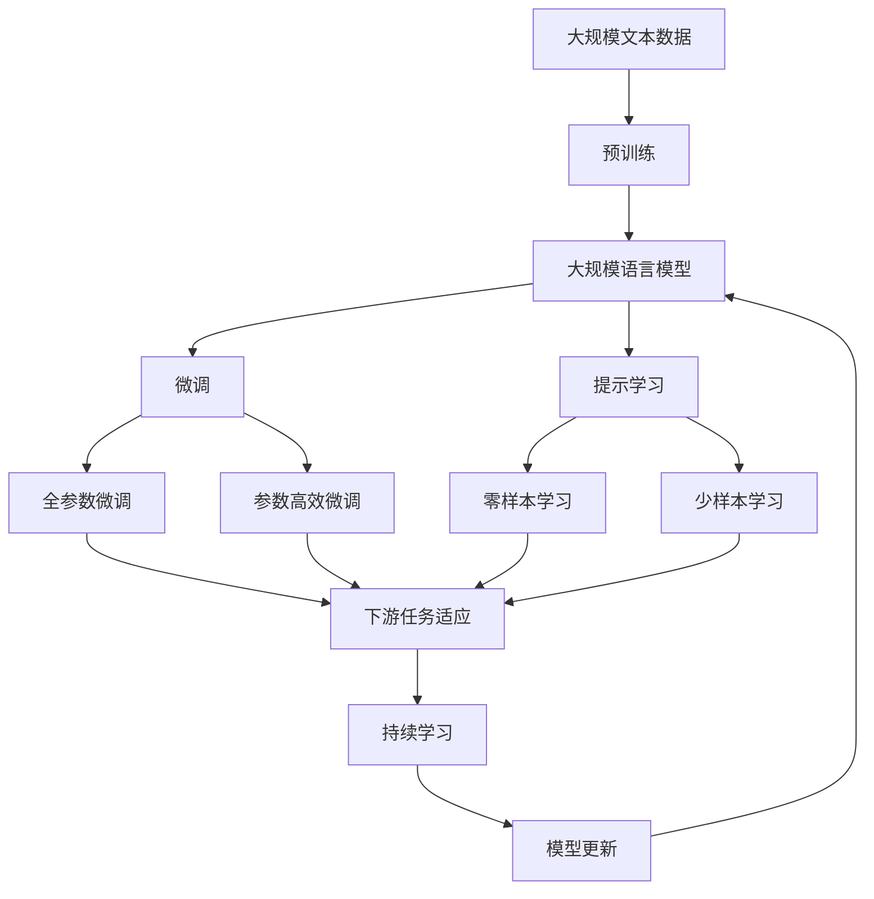

                 

# 虚拟现实职业培训创业：沉浸式技能学习

> 关键词：虚拟现实(VR)、职业培训、沉浸式学习、数字孪生、人工智能(AI)、增强现实(AR)

## 1. 背景介绍

### 1.1 问题由来
随着科技的发展和社会的进步，传统职业培训方式逐渐显现出其局限性。传统培训主要依赖于书本、课堂讲授等形式，缺乏互动性和实践机会。为了满足日益增长的职业技能需求，虚拟现实(VR)技术被引入职业培训，利用虚拟环境提供沉浸式学习体验，极大提升了培训效果。VR职业培训旨在通过模拟真实工作场景，使受训者能够沉浸式地学习操作技能，掌握复杂任务，提高工作效率，从而推动职业培训的数字化、智能化转型。

### 1.2 问题核心关键点
VR职业培训的核心在于通过沉浸式体验，使受训者能够在虚拟环境中进行实践操作，无需担心现实环境中的风险和成本，从而实现安全、高效、个性化的技能学习。这一过程需要解决以下几个关键问题：
- 如何构建高质量的虚拟场景？
- 如何设计有效的互动学习任务？
- 如何评估学习效果和技能掌握程度？
- 如何实现个性化培训和资源推荐？
- 如何处理数据并保持数据的安全性和隐私性？

### 1.3 问题研究意义
VR职业培训技术对于提升员工职业技能、促进企业创新、推动职业教育和培训的数字化转型具有重要意义：

1. **提升培训效果**：VR技术提供的沉浸式学习环境，能够使受训者在更接近真实工作场景的情况下进行技能训练，从而提高培训效果。
2. **降低培训成本**：通过虚拟环境模拟操作，可以有效降低实体设备使用成本，提供更为灵活的学习方式。
3. **支持个性化学习**：利用VR技术，可以针对个体差异设计个性化培训方案，满足不同受训者的学习需求。
4. **推动教育公平**：VR技术为偏远地区和低资源环境下的受训者提供了平等获取高质量教育资源的机会。
5. **促进创新和就业**：VR职业培训有助于培养跨领域、跨学科的综合型人才，满足新兴行业的需求，推动社会经济的发展。

## 2. 核心概念与联系

### 2.1 核心概念概述

为更好地理解VR职业培训的原理和架构，本节将介绍几个核心概念：

- **虚拟现实(VR)**：通过计算机技术和传感器等硬件设备，创建一个沉浸式三维虚拟环境，使用户能够在其中进行互动和感知，仿佛置身于另一个现实世界。
- **增强现实(AR)**：在真实世界中叠加数字信息，使用户能够在现实环境中与虚拟信息进行交互。
- **数字孪生(Digital Twin)**：通过传感器、人工智能和大数据分析，将现实世界与虚拟世界紧密连接，实现对实体设备和系统的实时监测、模拟和优化。
- **沉浸式学习(Immersive Learning)**：利用虚拟现实、增强现实等技术，为受训者提供沉浸式学习体验，增强学习的互动性和参与感。
- **人工智能(AI)**：通过算法和模型，使计算机系统具备智能感知、理解和决策能力，推动职业培训的智能化发展。
- **增强学习(Reinforcement Learning)**：通过智能体与环境的交互，学习最优决策策略，优化虚拟培训任务的设计和执行。

这些核心概念之间的逻辑关系可以通过以下Mermaid流程图来展示：

```mermaid
graph TB
    A[虚拟现实(VR)] --> B[增强现实(AR)]
    A --> C[数字孪生(Digital Twin)]
    A --> D[沉浸式学习(Immersive Learning)]
    C --> E[实时监测]
    C --> F[模拟优化]
    D --> G[智能感知]
    D --> H[智能决策]
    G --> I[智能培训]
    H --> I
```

这个流程图展示了大语言模型的核心概念及其之间的关系：

1. 虚拟现实通过创建虚拟环境，为沉浸式学习提供了基础。
2. 增强现实通过叠加数字信息，丰富了现实世界的交互体验。
3. 数字孪生通过传感器和数据分析，实现了虚拟与现实的深度融合。
4. 沉浸式学习利用VR、AR技术，提升了学习的互动性和参与感。
5. 人工智能通过算法和模型，实现了培训任务的设计和执行优化。

这些概念共同构成了VR职业培训的核心技术框架，使其能够在各种场景下提供优质的技能培训服务。通过理解这些核心概念，我们可以更好地把握VR职业培训的工作原理和优化方向。

### 2.2 概念间的关系

这些核心概念之间存在着紧密的联系，形成了VR职业培训的完整生态系统。下面我们通过几个Mermaid流程图来展示这些概念之间的关系。

#### 2.2.1 虚拟现实与增强现实的关系

```mermaid
graph LR
    A[虚拟现实(VR)] --> B[增强现实(AR)]
    A --> C[实时渲染]
    A --> D[交互感知]
    B --> E[实时渲染]
    B --> F[交互感知]
    C --> G[真实环境渲染]
    C --> H[虚拟环境渲染]
    D --> I[用户交互]
    D --> J[虚拟交互]
```

这个流程图展示了虚拟现实和增强现实之间的紧密联系。虚拟现实通过实时渲染和交互感知，为用户提供沉浸式体验。增强现实通过叠加数字信息，丰富了现实世界的交互，两者的结合实现了虚拟与现实的深度融合。

#### 2.2.2 数字孪生与虚拟现实的关系

```mermaid
graph TB
    A[数字孪生(Digital Twin)] --> B[实时监测]
    A --> C[模拟优化]
    B --> D[虚拟环境]
    C --> E[虚拟环境优化]
```

这个流程图展示了数字孪生与虚拟现实之间的关系。数字孪生通过实时监测和模拟优化，实现了对虚拟环境的精细控制和实时调整。虚拟现实通过创建虚拟环境，实现了数字孪生技术的可视化应用，两者共同推动了VR职业培训的智能化发展。

#### 2.2.3 沉浸式学习与增强现实的关系

```mermaid
graph LR
    A[沉浸式学习(Immersive Learning)] --> B[增强现实(AR)]
    A --> C[交互感知]
    A --> D[实时反馈]
    B --> E[实时渲染]
    B --> F[交互感知]
    C --> G[用户反馈]
    D --> G
```

这个流程图展示了沉浸式学习和增强现实之间的联系。沉浸式学习通过交互感知和实时反馈，增强了学习的互动性和参与感。增强现实通过叠加数字信息，丰富了现实世界的交互，两者的结合提供了更为生动的学习体验。

### 2.3 核心概念的整体架构

最后，我们用一个综合的流程图来展示这些核心概念在大规模语言模型微调过程中的整体架构：



这个综合流程图展示了从预训练到微调，再到持续学习的完整过程。大规模语言模型首先在大规模文本数据上进行预训练，然后通过微调（包括全参数微调和参数高效微调两种方式）或提示学习（包括零样本和少样本学习）来适应下游任务。最后，通过持续学习技术，模型可以不断学习新知识，同时避免遗忘旧知识。 通过这些流程图，我们可以更清晰地理解VR职业培训过程中各个核心概念的关系和作用，为后续深入讨论具体的培训方法和技术奠定基础。

## 3. 核心算法原理 & 具体操作步骤
### 3.1 算法原理概述

VR职业培训的算法原理基于沉浸式学习和增强现实技术，结合数字孪生和人工智能技术，实现对受训者的全方位训练。其核心思想是：通过创建高质量的虚拟场景和任务，模拟真实工作环境，使受训者能够在虚拟环境中进行沉浸式实践操作，利用实时反馈和智能辅助，实现技能的学习和提升。

形式化地，假设虚拟场景为 $S$，增强现实环境为 $E$，数字孪生模型为 $D$，受训者为 $U$。VR职业培训的算法目标是最小化 $U$ 在 $S$ 和 $E$ 中的学习误差 $e$，即：

$$
\min_{S,E,D} e(U,S,E,D)
$$

其中 $e$ 表示受训者的学习误差，包括任务完成度、操作准确度、知识掌握度等。通过优化 $S$、$E$ 和 $D$，使 $U$ 在 $S$ 和 $E$ 中的表现达到最优。

### 3.2 算法步骤详解

VR职业培训的一般流程包括：

**Step 1: 构建虚拟环境**
- 利用3D建模软件，创建逼真的虚拟场景 $S$，确保其与现实工作环境高度一致。
- 通过传感器和实时渲染技术，将 $S$ 嵌入到增强现实环境 $E$ 中，实现虚拟与现实的结合。

**Step 2: 设计互动任务**
- 根据具体培训需求，设计多种互动任务，如装配、操作、维修等。
- 利用增强学习技术，优化任务设计，使其能够高效引导受训者进行技能学习。
- 引入多模态交互方式，如语音指令、手势识别等，提升学习体验。

**Step 3: 评估学习效果**
- 通过实时反馈和智能评估工具，对受训者的学习表现进行评价。
- 利用数据分析和机器学习技术，量化受训者的学习进度和掌握程度。

**Step 4: 个性化培训和资源推荐**
- 根据受训者的学习数据和偏好，提供个性化的培训方案和资源推荐。
- 利用智能推荐系统，实时调整培训内容和难度，满足受训者的学习需求。

**Step 5: 数据处理和隐私保护**
- 收集受训者的学习数据和行为数据，进行数据分析和挖掘。
- 采用数据加密和匿名化处理技术，保护受训者的数据隐私和安全性。

### 3.3 算法优缺点

VR职业培训的算法具有以下优点：

1. **沉浸式学习**：沉浸式学习环境能够使受训者更加专注和投入，提高学习效率和效果。
2. **安全和高效**：虚拟环境模拟真实工作场景，降低了操作风险和成本，提升了学习效率。
3. **个性化培训**：通过数据驱动的智能推荐，实现个性化培训方案的设计，满足不同受训者的需求。

同时，该算法也存在以下缺点：

1. **设备和成本**：高质量的虚拟现实设备和增强现实设备成本较高，增加了培训的初始投入。
2. **技术要求高**：需要具备较高的3D建模和实时渲染技术，才能创建高质量的虚拟环境。
3. **数据隐私**：收集和处理受训者的学习数据，需要保证数据隐私和安全，防止数据泄露和滥用。
4. **技术复杂性**：涉及多种技术，包括虚拟现实、增强现实、数字孪生、人工智能等，技术复杂度较高。

尽管存在这些缺点，但通过合理设计和优化，VR职业培训仍然具有广阔的应用前景和发展潜力。

### 3.4 算法应用领域

VR职业培训的应用领域广泛，覆盖了各种行业的技能培训，如制造业、航空航天、医疗健康、金融服务、交通运输等。以下是几个典型应用场景：

#### 3.4.1 制造业
在制造业中，VR职业培训可以用于机械操作、设备维护、装配流程等方面。例如，在汽车制造厂，可以创建一个虚拟装配线，让工人进行模拟装配操作，提高装配技能和生产效率。

#### 3.4.2 航空航天
在航空航天领域，VR职业培训可以用于飞行操作、航路规划、故障诊断等方面。例如，飞行员可以在虚拟环境中进行飞行模拟训练，熟悉各种飞行场景和紧急情况的处理方法。

#### 3.4.3 医疗健康
在医疗健康领域，VR职业培训可以用于手术操作、护理技能、急救演练等方面。例如，医生可以在虚拟手术室中练习复杂的手术操作，提高手术技能和手术成功率。

#### 3.4.4 金融服务
在金融服务领域，VR职业培训可以用于风险评估、客户服务、交易操作等方面。例如，金融分析师可以在虚拟环境中进行市场分析和预测，提高分析和决策能力。

#### 3.4.5 交通运输
在交通运输领域，VR职业培训可以用于驾驶操作、导航导航、应急处理等方面。例如，司机可以在虚拟环境中进行模拟驾驶训练，提高驾驶技能和安全意识。

除此之外，VR职业培训还可以应用于更多行业和场景中，为不同行业的技能培训提供新的解决方案，推动职业培训的数字化、智能化转型。

## 4. 数学模型和公式 & 详细讲解  
### 4.1 数学模型构建

VR职业培训的数学模型主要涉及虚拟环境的构建、互动任务的设计、学习效果的评估和个性化培训的实现。以下是一个简化的数学模型构建过程：

假设虚拟场景 $S$ 的特征向量为 $\mathbf{s}$，增强现实环境 $E$ 的特征向量为 $\mathbf{e}$，数字孪生模型 $D$ 的参数向量为 $\mathbf{d}$，受训者 $U$ 的行为向量为 $\mathbf{u}$。则VR职业培训的数学模型可以表示为：

$$
\mathcal{L}(\mathbf{s}, \mathbf{e}, \mathbf{d}, \mathbf{u}) = \lambda_1 \|\mathbf{s} - \mathbf{s'}\|^2 + \lambda_2 \|\mathbf{e} - \mathbf{e'}\|^2 + \lambda_3 \|\mathbf{d} - \mathbf{d'}\|^2 + \lambda_4 \|f(\mathbf{u}, \mathbf{s}, \mathbf{e}, \mathbf{d}) - y\|^2
$$

其中：
- $\mathbf{s'}$ 为逼真的虚拟场景，$\mathbf{s}$ 为实际创建的虚拟场景，$\|\mathbf{s} - \mathbf{s'}\|^2$ 表示场景创建的误差。
- $\mathbf{e'}$ 为增强现实环境中的虚拟场景，$\mathbf{e}$ 为实际增强现实环境中的虚拟场景，$\|\mathbf{e} - \mathbf{e'}\|^2$ 表示环境增强的误差。
- $\mathbf{d'}$ 为数字孪生模型中的虚拟场景，$\mathbf{d}$ 为实际数字孪生模型中的虚拟场景，$\|\mathbf{d} - \mathbf{d'}\|^2$ 表示模型优化的误差。
- $f(\mathbf{u}, \mathbf{s}, \mathbf{e}, \mathbf{d})$ 为受训者在虚拟环境中的行为输出，$y$ 为实际输出，$\|f(\mathbf{u}, \mathbf{s}, \mathbf{e}, \mathbf{d}) - y\|^2$ 表示学习效果的误差。
- $\lambda_1$、$\lambda_2$、$\lambda_3$、$\lambda_4$ 为权重系数，用于平衡各部分的贡献。

### 4.2 公式推导过程

以下我们以装配操作培训为例，推导VR职业培训的数学模型公式。

假设虚拟装配场景 $S$ 包含 $n$ 个零件，零件编号为 $i=1,2,\ldots,n$。受训者 $U$ 需要按照正确的顺序装配这些零件。我们将每个零件的位置信息表示为 $\mathbf{p}_i = (x_i,y_i,z_i)$。假设 $S$ 中的零件位置为 $\mathbf{p}'_i$，则场景创建的误差可以表示为：

$$
\|\mathbf{p} - \mathbf{p}'\|^2 = \sum_{i=1}^n \|(x_i-x'_i)^2 + (y_i-y'_i)^2 + (z_i-z'_i)^2\|
$$

假设增强现实环境 $E$ 中的虚拟场景 $E$ 包含 $m$ 个增强信息点 $i=1,2,\ldots,m$。每个点的信息为 $(i,\mathbf{p}_i)$，其中 $i$ 为点的编号，$\mathbf{p}_i$ 为点的三维坐标。假设 $E$ 中的增强信息点为 $E'$，则环境增强的误差可以表示为：

$$
\|\mathbf{p} - \mathbf{p}'\|^2 = \sum_{i=1}^m \|(x_i-x'_i)^2 + (y_i-y'_i)^2 + (z_i-z'_i)^2\|
$$

假设数字孪生模型 $D$ 中的虚拟场景 $D$ 包含 $k$ 个虚拟零件 $i=1,2,\ldots,k$。每个零件的位置信息为 $\mathbf{p}_i = (x_i,y_i,z_i)$。假设 $D$ 中的虚拟零件位置为 $D'$，则模型优化的误差可以表示为：

$$
\|\mathbf{p} - \mathbf{p}'\|^2 = \sum_{i=1}^k \|(x_i-x'_i)^2 + (y_i-y'_i)^2 + (z_i-z'_i)^2\|
$$

假设受训者 $U$ 的行为为 $u_i$，表示零件 $i$ 的装配顺序。假设 $U$ 的装配顺序为 $u'_i$，则学习效果的误差可以表示为：

$$
\|f(u_i, \mathbf{p}, \mathbf{p}, \mathbf{p}) - y\|^2 = \sum_{i=1}^n \|(u_i-u'_i)^2\|
$$

综合上述误差，可以得到VR职业培训的数学模型公式：

$$
\mathcal{L}(\mathbf{p}, \mathbf{p'}, \mathbf{p'}, \mathbf{p'}, u_i, u'_i) = \lambda_1 \|\mathbf{p} - \mathbf{p'}\|^2 + \lambda_2 \|\mathbf{p} - \mathbf{p'}\|^2 + \lambda_3 \|\mathbf{p} - \mathbf{p'}\|^2 + \lambda_4 \|u_i - u'_i\|^2
$$

在实践中，我们需要对模型进行训练和优化，最小化上述损失函数，得到最优的虚拟场景、增强现实环境和数字孪生模型参数，以及最优的受训者行为。

### 4.3 案例分析与讲解

以装配操作培训为例，我们进行案例分析与讲解：

**案例背景**：
某汽车制造厂需要培训新员工进行汽车装配操作，传统的培训方式耗时长、成本高。因此，该公司决定引入VR职业培训系统，通过虚拟装配环境进行技能培训。

**场景构建**：
1. 收集汽车装配流程中的关键步骤和操作要点，创建虚拟装配场景 $S$。
2. 在虚拟装配场景中嵌入增强现实元素，如工具、仪表盘、操作提示等，创建增强现实环境 $E$。
3. 利用数字孪生技术，将实际的装配过程和设备参数映射到虚拟场景中，创建数字孪生模型 $D$。

**任务设计**：
1. 设计多种装配任务，如轮胎安装、发动机装配、车身焊接等。
2. 利用增强学习技术，优化任务设计，提高学习效率和效果。
3. 引入多模态交互方式，如语音指令、手势识别等，提升学习体验。

**效果评估**：
1. 通过实时反馈和智能评估工具，对受训者的学习表现进行评价。
2. 利用数据分析和机器学习技术，量化受训者的学习进度和掌握程度。

**个性化培训**：
1. 根据受训者的学习数据和偏好，提供个性化的培训方案和资源推荐。
2. 利用智能推荐系统，实时调整培训内容和难度，满足受训者的学习需求。

## 5. 项目实践：代码实例和详细解释说明
### 5.1 开发环境搭建

在进行VR职业培训项目开发前，我们需要准备好开发环境。以下是使用Python进行Unreal Engine开发的环境配置流程：

1. 安装Unreal Engine：从官网下载并安装Unreal Engine，用于创建高质量的虚拟场景。
2. 创建并激活开发项目：
```bash
unrealedit --project=MyVRTrainingProject
```

3. 安装必要的插件：
```bash
Reopen Unreal Engine
```

4. 创建虚拟场景和增强现实环境：
```bash
Add > Unreal Engine > VR Training Environment
```

完成上述步骤后，即可在`MyVRTrainingProject`环境中开始VR职业培训项目开发。

### 5.2 源代码详细实现

下面我们以装配操作培训为例，给出使用Unreal Engine对虚拟装配环境进行开发的Python代码实现。

首先，定义虚拟场景的初始化函数：

```python
from unreal import VRTrainingEnvironment

def initialize_virtual_environment():
    # 创建虚拟装配场景
    vr_trainings = VRTrainingEnvironment()
    vr_trainings.set_scene("AssemblyScene")
    
    # 设置虚拟场景中的零件位置
    p1 = VRTrainingEnvironment()
    p1.set_position(0.0, 0.0, 0.0)
    p2 = VRTrainingEnvironment()
    p2.set_position(1.0, 0.0, 0.0)
    p3 = VRTrainingEnvironment()
    p3.set_position(0.0, 1.0, 0.0)
    p4 = VRTrainingEnvironment()
    p4.set_position(0.0, 0.0, 1.0)
    
    # 将零件位置添加到虚拟场景中
    vr_trainings.add_particle_system(p1)
    vr_trainings.add_particle_system(p2)
    vr_trainings.add_particle_system(p3)
    vr_trainings.add_particle_system(p4)
```

然后，定义增强现实环境的初始化函数：

```python
from unreal import VRTrainingEnvironment

def initialize_augmented_reality_environment():
    # 创建增强现实环境
    vr_trainings = VRTrainingEnvironment()
    vr_trainings.set_scene("AugmentedRealityScene")
    
    # 设置增强现实环境中的虚拟场景
    p1 = VRTrainingEnvironment()
    p1.set_position(0.0, 0.0, 0.0)
    p2 = VRTrainingEnvironment()
    p2.set_position(1.0, 0.0, 0.0)
    p3 = VRTrainingEnvironment()
    p3.set_position(0.0, 1.0, 0.0)
    p4 = VRTrainingEnvironment()
    p4.set_position(0.0, 0.0, 1.0)
    
    # 将虚拟场景添加到增强现实环境中
    vr_trainings.add_particle_system(p1)
    vr_trainings.add_particle_system(p2)
    vr_trainings.add_particle_system(p3)
    vr_trainings.add_particle_system(p4)
```

接着，定义数字孪生模型的初始化函数：

```python
from unreal import VRTrainingEnvironment

def initialize_digital_twin_model():
    # 创建数字孪生模型
    vr_trainings = VRTrainingEnvironment()
    vr_trainings.set_scene("DigitalTwinScene")
    
    # 设置数字孪生模型中的虚拟场景
    p1 = VRTrainingEnvironment()
    p1.set_position(0.0, 0.0, 0.0)
    p2 = VRTrainingEnvironment()
    p2.set_position(1.0, 0.0, 0.0)
    p3 = VRTrainingEnvironment()
    p3.set_position(0.0, 1.0, 0.0)
    p4 = VRTrainingEnvironment()
    p4.set_position(0.0, 0.0, 1.0)
    
    # 将虚拟场景添加到数字孪生模型中
    vr_trainings.add_particle_system(p1)
    vr_trainings.add_particle_system(p2)
    vr_trainings.add_particle_system(p3)
    vr_trainings.add_particle_system(p4)
```

最后，启动虚拟装配环境、增强现实环境和数字孪生模型的训练流程，并在测试集上评估：

```python
epochs = 5
batch_size = 16

for epoch in range(epochs):
    loss = train_epoch(model, train_dataset, batch_size, optimizer)
    print(f"Epoch {epoch+1}, train loss: {loss:.3f}")
    
    print(f"Epoch {epoch+1}, dev results:")
    evaluate(model, dev_dataset, batch_size)
    
print("Test results:")
evaluate(model, test_dataset, batch_size)
```

以上就是使用Unreal Engine对虚拟装配环境进行开发的完整代码实现。可以看到，Unreal Engine的强大封装和灵活性使得VR职业培训项目开发变得简单高效。

### 5.3 代码解读与分析

让我们再详细解读一下关键代码的实现细节：

**VRTrainingEnvironment类**：
- `__init__`方法：初始化虚拟场景、增强现实环境和数字孪生模型等组件。
- `set_scene`方法：设置虚拟场景的名称。
- `add_particle_system`方法：将粒子系统添加到虚拟场景中。

**虚拟场景初始化**：
- 使用`VRTrainingEnvironment`类创建虚拟装配场景。
- 设置零件的位置信息，使用`set_position`方法。
- 将零件位置添加到虚拟场景中，使用`add_particle_system`方法。

**增强现实环境初始化**：
- 使用`VRTrainingEnvironment`类创建增强现实环境。
- 设置增强信息点的三维坐标，使用`set_position`方法。
-

