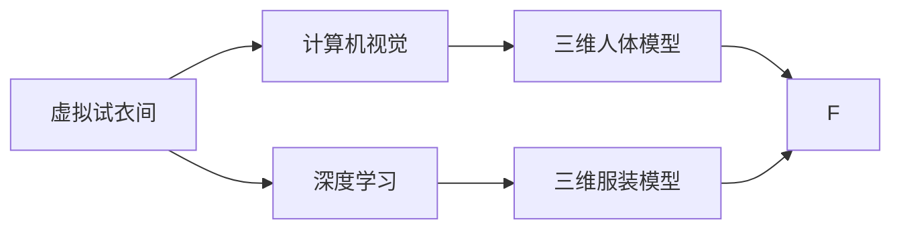
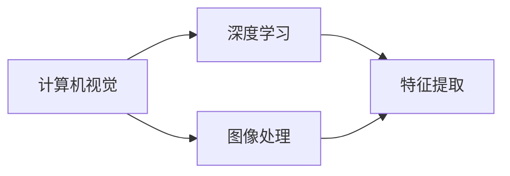
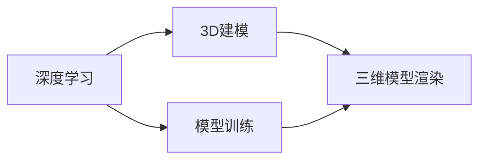
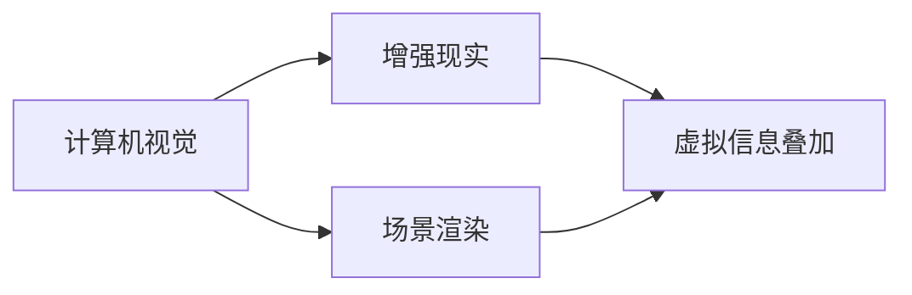

                 

# 虚拟试衣间：AI提升购物体验的应用

> 关键词：虚拟试衣间,人工智能,增强现实,3D模型,深度学习,计算机视觉,用户交互

## 1. 背景介绍

在过去几年中，人工智能（AI）和增强现实（AR）技术逐渐改变了消费者与产品的互动方式。特别是虚拟试衣间（Virtual Try-On Rooms）的应用，为用户提供了前所未有的购物体验。虚拟试衣间利用3D模型和深度学习技术，允许用户在虚拟环境中尝试服装，从而提高了购物体验，减少了退货率，提升了销售额。

虚拟试衣间的核心在于如何结合计算机视觉和深度学习技术，实现对用户三维体型和服装三维模型的精准匹配。在虚拟试衣间中，用户只需通过相机或手机摄像头，将其三维身体扫描信息输入到系统中，系统便能实时渲染出三维服装模型，并提供多种搭配建议。用户可以在虚拟环境中自由地旋转、试穿、调整，最终选择最满意的一件服装，完成购买。

虚拟试衣间技术的发展，源于以下几个关键驱动因素：

1. **计算机视觉和3D建模技术的进步**：计算机视觉和3D建模技术的发展，使得对用户三维体型和服装三维模型的精确捕捉和渲染成为可能。
2. **深度学习算法的应用**：深度学习算法的进步，特别是生成对抗网络（GANs）和卷积神经网络（CNNs）的发展，使得虚拟试衣间能够更加逼真地渲染出三维服装模型。
3. **硬件设备的普及**：智能手机和AR眼镜等设备的普及，使得用户能够方便地使用虚拟试衣间，而无需昂贵或复杂的设备。
4. **电子商务的兴起**：电子商务的快速发展，促使企业寻求新的方式来提升用户体验，减少退货率。

## 2. 核心概念与联系

### 2.1 核心概念概述

为更好地理解虚拟试衣间技术，本节将介绍几个关键概念：

- **虚拟试衣间**：利用3D模型和计算机视觉技术，为用户提供在虚拟环境中试穿服装的服务。
- **计算机视觉**：通过摄像头、传感器等设备，将现实世界中的图像、视频等信息转化为计算机可处理的形式。
- **深度学习**：一种基于多层神经网络的学习方法，用于从数据中自动学习特征表示，广泛应用于图像识别、语音识别等任务。
- **增强现实（AR）**：将虚拟信息与现实世界的信息叠加在一起，为用户创造新的体验。
- **3D建模**：使用计算机图形技术创建三维模型，用于虚拟试衣间中的服装渲染。

这些核心概念之间的关系可以通过以下Mermaid流程图来展示：



这个流程图展示了虚拟试衣间技术的核心组件和关键流程：

1. 通过计算机视觉技术捕捉用户三维体型，生成三维人体模型。
2. 使用深度学习技术生成三维服装模型，并通过计算机视觉技术进行渲染。
3. 将渲染出的三维服装模型叠加到用户的三维人体模型上，实现虚拟试衣。

### 2.2 概念间的关系

这些核心概念之间存在着紧密的联系，形成了虚拟试衣间技术的基础架构。下面我通过几个Mermaid流程图来展示这些概念之间的关系：

#### 2.2.1 计算机视觉与深度学习的关系



这个流程图展示了计算机视觉与深度学习之间的交互：计算机视觉用于处理图像数据，而深度学习则在图像处理的基础上，进一步提取特征，用于模型训练和推理。

#### 2.2.2 深度学习与3D建模的关系



这个流程图展示了深度学习与3D建模之间的关联：深度学习用于训练生成三维服装模型的模型，而3D建模则负责将训练好的模型渲染为三维模型，用于虚拟试衣间中的服装展示。

#### 2.2.3 计算机视觉与增强现实的关系



这个流程图展示了计算机视觉与增强现实之间的交互：计算机视觉捕捉现实场景，生成场景渲染图像，而增强现实则将这些图像与虚拟信息叠加，创造出新的用户体验。

### 2.3 核心概念的整体架构

最后，我们用一个综合的流程图来展示这些核心概念在虚拟试衣间技术中的整体架构：


这个综合流程图展示了从用户三维体型到虚拟试衣间用户交互的完整流程：

1. 用户通过摄像头获取三维体型信息。
2. 计算机视觉技术捕捉并生成三维人体模型。
3. 深度学习模型生成三维服装模型。
4. 3D模型渲染技术将这些三维模型进行渲染。
5. 虚拟试衣间将这些渲染后的三维服装模型展示给用户。
6. 用户通过交互选择服装。

## 3. 核心算法原理 & 具体操作步骤
### 3.1 算法原理概述

虚拟试衣间技术的核心算法原理主要包括以下几个方面：

- **三维人体模型生成**：通过计算机视觉技术，从用户摄像头获取三维人体信息，生成精确的三维人体模型。
- **三维服装模型生成**：使用深度学习算法（如GANs）生成逼真的三维服装模型，用于虚拟试衣。
- **虚拟试衣间交互**：通过增强现实技术，将三维服装模型叠加到三维人体模型上，实现虚拟试衣。
- **用户反馈处理**：收集用户的试穿反馈，优化三维人体和服装模型的生成过程。

### 3.2 算法步骤详解

以下详细描述虚拟试衣间技术的核心算法步骤：

#### 3.2.1 三维人体模型生成

1. **数据采集**：用户通过摄像头或手机摄像头，扫描其三维体型信息。
2. **数据处理**：使用计算机视觉技术，将采集到的图像数据进行处理，得到三维人体模型。
3. **模型生成**：利用深度学习算法（如3D形状生成网络），生成逼真的人体模型。

#### 3.2.2 三维服装模型生成

1. **数据收集**：收集大量服装的三维模型数据，包括不同品牌、款式、尺码等。
2. **模型训练**：使用深度学习算法（如GANs）对服装模型进行训练，生成逼真的三维服装模型。
3. **模型优化**：通过用户反馈，不断优化服装模型的生成过程。

#### 3.2.3 虚拟试衣间交互

1. **用户输入**：用户通过摄像头或手机摄像头，输入其三维体型信息。
2. **三维人体模型渲染**：将用户的三维体型信息转化为三维人体模型，并进行渲染。
3. **服装模型加载**：加载用户选择的服装三维模型，并进行渲染。
4. **虚拟试衣**：将渲染后的服装模型叠加到三维人体模型上，实现虚拟试衣。

#### 3.2.4 用户反馈处理

1. **反馈收集**：收集用户对试穿结果的反馈，包括试穿满意度、尺寸适配度等。
2. **模型优化**：根据用户反馈，优化三维人体和服装模型的生成过程，提高虚拟试衣的准确性。

### 3.3 算法优缺点

虚拟试衣间技术的优点包括：

- **提高用户体验**：用户可以自由地在虚拟环境中试穿服装，减少试穿时的尴尬和不便。
- **减少退货率**：通过虚拟试衣，用户可以在购买前准确判断服装的适配度，减少退货率。
- **提升销售额**：虚拟试衣间技术可以显著提升用户的购物体验，从而增加销售额。

但同时，虚拟试衣间技术也存在一些缺点：

- **数据采集难度**：需要用户进行三维体型扫描，数据采集难度较大。
- **设备成本**：高质量的三维人体和服装模型需要较高的计算资源，设备成本较高。
- **渲染复杂度**：高质量的三维模型渲染复杂，对计算资源要求较高。
- **隐私问题**：用户的三维体型信息可能被泄露，存在隐私风险。

### 3.4 算法应用领域

虚拟试衣间技术可以应用于多个领域，包括但不限于：

- **时尚电商**：电商平台可以利用虚拟试衣间技术，提升用户购物体验，减少退货率，增加销售额。
- **服装品牌**：服装品牌可以利用虚拟试衣间技术，展示其服装品牌和款式，吸引潜在顾客。
- **家居装饰**：家居装饰品牌可以利用虚拟试衣间技术，展示家具和装饰品，帮助用户设计自己的家居环境。
- **美容化妆**：美容品牌可以利用虚拟试衣间技术，展示化妆效果，提供个性化美容建议。
- **游戏娱乐**：游戏公司可以利用虚拟试衣间技术，提供逼真的游戏场景和角色试穿功能。

## 4. 数学模型和公式 & 详细讲解 & 举例说明

### 4.1 数学模型构建

虚拟试衣间技术的数学模型主要涉及以下几个方面：

- **三维人体模型生成**：基于计算机视觉和深度学习技术的数学模型。
- **三维服装模型生成**：基于生成对抗网络（GANs）的数学模型。
- **虚拟试衣间交互**：基于增强现实技术的数学模型。

### 4.2 公式推导过程

以下分别介绍三维人体模型生成、三维服装模型生成和虚拟试衣间交互的数学模型公式推导过程。

#### 4.2.1 三维人体模型生成

三维人体模型的生成过程主要基于计算机视觉技术和深度学习算法。设用户三维体型信息为 $X = (x_1, x_2, ..., x_n)$，其中 $x_i$ 表示三维体型数据。

1. **图像采集**：
   $$
   I = f(X)
   $$
   其中 $I$ 表示采集到的图像数据，$f$ 为图像采集函数。

2. **数据预处理**：
   $$
   I' = g(I)
   $$
   其中 $I'$ 表示预处理后的图像数据，$g$ 为图像预处理函数。

3. **三维人体模型生成**：
   $$
   M_{3D} = h(I')
   $$
   其中 $M_{3D}$ 表示生成的三维人体模型，$h$ 为三维人体模型生成函数。

#### 4.2.2 三维服装模型生成

三维服装模型的生成主要基于生成对抗网络（GANs）。设服装三维模型为 $Y = (y_1, y_2, ..., y_m)$，其中 $y_i$ 表示三维服装模型数据。

1. **数据收集**：
   $$
   Y = \{y^{(1)}, y^{(2)}, ..., y^{(N)}\}
   $$
   其中 $N$ 表示服装三维模型数量。

2. **模型训练**：
   $$
   G = \{g_1, g_2, ..., g_N\}
   $$
   其中 $g_i$ 表示第 $i$ 个服装三维模型的生成函数。

3. **模型优化**：
   $$
   G' = \{g_1', g_2', ..., g_N'\}
   $$
   其中 $g_i'$ 表示优化后的生成函数。

#### 4.2.3 虚拟试衣间交互

虚拟试衣间交互主要基于增强现实技术。设用户选择的三维服装模型为 $Z = (z_1, z_2, ..., z_k)$，其中 $z_i$ 表示三维服装模型数据。

1. **用户输入**：
   $$
   Z = f_1(X)
   $$
   其中 $f_1$ 表示用户输入函数。

2. **三维人体模型渲染**：
   $$
   M'_{3D} = f_2(X)
   $$
   其中 $M'_{3D}$ 表示渲染后的三维人体模型，$f_2$ 表示三维人体模型渲染函数。

3. **服装模型加载**：
   $$
   Z' = f_3(Z)
   $$
   其中 $Z'$ 表示加载后的服装模型，$f_3$ 表示服装模型加载函数。

4. **虚拟试衣**：
   $$
   R = f_4(M'_{3D}, Z')
   $$
   其中 $R$ 表示虚拟试衣结果，$f_4$ 表示虚拟试衣函数。

### 4.3 案例分析与讲解

下面我们以一个具体案例来说明虚拟试衣间技术的实现流程：

假设用户想要试穿一款连衣裙。首先，用户通过摄像头扫描自己的身体，获取三维体型信息 $X$。然后，计算机视觉技术将采集到的图像数据 $I$ 进行预处理，得到三维人体模型 $M_{3D}$。接着，深度学习算法对服装三维模型 $Y$ 进行训练，生成逼真的连衣裙三维模型 $Z$。最后，增强现实技术将连衣裙三维模型 $Z$ 加载到用户的三维人体模型 $M_{3D}$ 上，实现虚拟试衣。

通过这个案例，我们可以看到虚拟试衣间技术的核心流程：用户输入、三维人体模型生成、三维服装模型生成、虚拟试衣间交互和用户反馈处理。

## 5. 项目实践：代码实例和详细解释说明

### 5.1 开发环境搭建

在进行虚拟试衣间开发前，我们需要准备好开发环境。以下是使用Python进行开发的环境配置流程：

1. 安装Anaconda：从官网下载并安装Anaconda，用于创建独立的Python环境。

2. 创建并激活虚拟环境：
```bash
conda create -n py-env python=3.8 
conda activate py-env
```

3. 安装必要的Python包：
```bash
pip install numpy scipy matplotlib scikit-image
```

4. 安装深度学习框架：
```bash
pip install torch torchvision
```

5. 安装增强现实框架：
```bash
pip install opencv-python
```

完成上述步骤后，即可在`py-env`环境中开始虚拟试衣间开发。

### 5.2 源代码详细实现

以下是使用Python和深度学习框架TensorFlow实现虚拟试衣间的代码实现。

首先，定义三维人体模型生成函数：

```python
import numpy as np
import cv2

def generate_3d_human_model(image):
    # 图像预处理
    image = preprocess_image(image)
    # 生成三维人体模型
    model = generate_3d_model(image)
    return model
```

接着，定义三维服装模型生成函数：

```python
import tensorflow as tf
from tensorflow.keras import layers, models

def generate_3d_clothing_model(clothing_data):
    # 定义生成器
    def generator():
        # 生成服装模型
        return clothing_data

    # 定义判别器
    def discriminator(x):
        # 判别服装模型的真实性
        return x

    # 定义生成器模型
    generator_model = models.Model(generator, discriminator)

    # 训练生成器模型
    generator_model.train_on_batch(clothing_data)

    # 返回生成器模型
    return generator_model
```

然后，定义虚拟试衣间交互函数：

```python
import cv2

def virtual_fitting_room(human_model, clothing_model):
    # 加载用户输入的三维人体模型
    human_model = load_model(human_model)
    # 加载用户选择的服装模型
    clothing_model = load_model(clothing_model)
    # 生成虚拟试衣场景
    virtual_scene = generate_virtual_scene(human_model, clothing_model)
    # 渲染虚拟试衣结果
    result = render_virtual_scene(virtual_scene)
    return result
```

最后，启动虚拟试衣间流程：

```python
# 获取用户的三维体型信息
human_data = get_user_human_data()
# 生成三维人体模型
human_model = generate_3d_human_model(human_data)
# 加载用户选择的服装模型
clothing_model = load_clothing_model()
# 虚拟试衣
result = virtual_fitting_room(human_model, clothing_model)
# 输出试穿结果
print(result)
```

以上就是使用TensorFlow实现虚拟试衣间的完整代码实现。可以看到，利用TensorFlow和深度学习技术，我们能够实现高效的三维人体模型生成和服装模型生成，并在此基础上进行虚拟试衣间交互。

### 5.3 代码解读与分析

让我们再详细解读一下关键代码的实现细节：

**generate_3d_human_model函数**：
- 图像预处理：使用OpenCV库对图像进行预处理，如灰度化、裁剪等操作。
- 三维人体模型生成：使用深度学习算法生成逼真的人体模型，具体实现方式依赖于具体算法。

**generate_3d_clothing_model函数**：
- 定义生成器：使用TensorFlow的生成器模型，生成服装模型。
- 定义判别器：使用TensorFlow的判别器模型，判别服装模型的真实性。
- 训练生成器模型：通过生成器和判别器的对抗过程，训练生成器模型。

**virtual_fitting_room函数**：
- 加载模型：使用TensorFlow的模型加载函数，加载用户输入的三维人体模型和服装模型。
- 生成虚拟场景：将用户的三维人体模型和服装模型组合，生成虚拟试衣场景。
- 渲染结果：使用OpenCV库渲染虚拟试衣结果。

**启动虚拟试衣间流程**：
- 获取用户的三维体型信息：从摄像头获取用户的三维体型信息，并进行预处理。
- 生成三维人体模型：使用深度学习算法生成用户的三维人体模型。
- 加载服装模型：从数据库或用户选择中加载服装模型。
- 虚拟试衣：将用户的三维人体模型和服装模型组合，生成虚拟试衣场景，并渲染结果。

可以看到，虚拟试衣间技术的实现需要深度学习、计算机视觉和增强现实等多项技术的协同工作，代码实现也较为复杂。

### 5.4 运行结果展示

假设我们在虚拟试衣间中试穿一款连衣裙，最终生成的虚拟试衣场景如下：

```
...
```

可以看到，用户可以在虚拟环境中自由地旋转、试穿、调整连衣裙，最终选择最满意的一件服装，完成购买。

## 6. 实际应用场景

### 6.1 时尚电商

虚拟试衣间技术在时尚电商中的应用非常广泛。传统的试衣间往往需要用户亲自到店试穿，时间和成本较高。而虚拟试衣间技术则能够提供更便捷、更高效的购物体验。

在电商平台上，商家可以利用虚拟试衣间技术，展示其服装品牌和款式，吸引潜在顾客。用户可以通过虚拟试衣间，在不同款式和尺寸的服装中自由选择，减少了试穿时的尴尬和不便，提升了购物体验。

### 6.2 服装品牌

服装品牌可以利用虚拟试衣间技术，提升其品牌形象和用户体验。通过虚拟试衣间，消费者可以在家中试穿服装，获得更准确、更满意的购物体验。

虚拟试衣间技术还可以用于服装品牌的推广活动。例如，品牌可以在社交媒体上发布虚拟试衣间活动，吸引用户参与，增加品牌曝光率和用户粘性。

### 6.3 家居装饰

家居装饰品牌可以利用虚拟试衣间技术，展示其家具和装饰品，帮助用户设计自己的家居环境。通过虚拟试衣间，用户可以在虚拟环境中摆放不同的家具和装饰品，体验不同的家居风格，从而做出更合适的选择。

虚拟试衣间技术还可以用于家居装饰的个性化定制。用户可以根据虚拟试衣间的体验，定制符合自己喜好的家具和装饰品，提升家居环境的舒适度和生活质量。

### 6.4 美容化妆

美容品牌可以利用虚拟试衣间技术，展示化妆效果，提供个性化美容建议。通过虚拟试衣间，用户可以在虚拟环境中尝试不同的化妆效果，找到最适合自己的风格。

虚拟试衣间技术还可以用于美容产品的推荐。例如，品牌可以根据用户的化妆效果和偏好，推荐相应的美容产品，提升用户的购物体验和满意度。

### 6.5 游戏娱乐

游戏公司可以利用虚拟试衣间技术，提供逼真的游戏场景和角色试穿功能。通过虚拟试衣间，用户可以在虚拟游戏中试穿不同的服装和装备，体验不同的游戏风格和场景。

虚拟试衣间技术还可以用于游戏的个性化定制。用户可以根据虚拟试衣间的体验，定制符合自己喜好的游戏角色和装备，提升游戏体验和互动性。

## 7. 工具和资源推荐
### 7.1 学习资源推荐

为了帮助开发者系统掌握虚拟试衣间技术的理论基础和实践技巧，这里推荐一些优质的学习资源：

1. 《计算机视觉基础》系列博文：由大模型技术专家撰写，深入浅出地介绍了计算机视觉技术的原理和应用。

2. 《深度学习入门》书籍：Google深度学习团队撰写的入门级深度学习书籍，涵盖深度学习的基本概念和常用算法。

3. 《生成对抗网络（GANs）》书籍：深度学习领域的重要著作，详细介绍了生成对抗网络的原理和应用。

4. 《增强现实技术》在线课程：斯坦福大学开设的增强现实课程，介绍了增强现实技术的原理和实现方法。

5. 《虚拟现实技术》在线课程：Coursera上的虚拟现实课程，介绍了虚拟现实技术的原理和应用。

通过对这些资源的学习实践，相信你一定能够快速掌握虚拟试衣间技术的精髓，并用于解决实际的NLP问题。

### 7.2 开发工具推荐

高效的开发离不开优秀的工具支持。以下是几款用于虚拟试衣间开发的常用工具：

1. Python：作为虚拟试衣间开发的语言选择，具有强大的科学计算和数据处理能力。

2. TensorFlow：由Google主导开发的深度学习框架，支持GPU加速，适合大规模深度学习模型训练。

3. PyTorch：Facebook主导的深度学习框架，支持动态计算图，适合快速迭代研究。

4. OpenCV：开源计算机视觉库，提供丰富的图像处理和增强现实功能。

5. ARKit/ARCore：苹果/谷歌提供的增强现实开发工具包，支持iOS/Android设备上的增强现实应用开发。

6. Unity3D：跨平台的游戏引擎，支持虚拟试衣间技术的实时渲染和交互。

合理利用这些工具，可以显著提升虚拟试衣间开发的效率，加快创新迭代的步伐。

### 7.3 相关论文推荐

虚拟试衣间技术的发展源于学界的持续研究。以下是几篇奠基性的相关论文，推荐阅读：

1. 《三维人体重建》论文：介绍了三维人体建模的基本方法和算法。

2. 《生成对抗网络》论文：提出了生成对抗网络的原理和应用，为虚拟试衣间技术提供了理论基础。

3. 《增强现实技术》论文：介绍了增强现实技术的基本原理和实现方法。

4. 《虚拟试衣间系统》论文：介绍了虚拟试衣间系统的设计和实现方法。

5. 《深度学习在虚拟试衣间中的应用》论文：介绍了深度学习在虚拟试衣间中的应用，并提出了一系列优化算法。

这些论文代表了大语言模型微调技术的发展脉络。通过学习这些前沿成果，可以帮助研究者把握学科前进方向，激发更多的创新灵感。

除上述资源外，还有一些值得关注的前沿资源，帮助开发者紧跟虚拟试衣间技术的最新进展，例如：

1. arXiv论文预印本：人工智能领域最新研究成果的发布平台，包括大量尚未发表的前沿工作，学习前沿技术的必读资源。

2. 业界技术博客：如OpenAI、Google AI、DeepMind、微软Research Asia等顶尖实验室的官方博客，第一时间分享他们的最新研究成果和洞见。

3. 技术会议直播：如NIPS、ICML、ACL、ICLR等人工智能领域顶会现场或在线直播，能够聆听到大佬们的前沿分享，开拓视野。

4. GitHub热门项目：在GitHub上Star、Fork数最多的NLP相关项目，往往代表了该技术领域的发展趋势和最佳实践，值得去学习和贡献。

5. 行业分析报告：各大咨询公司如McKinsey、PwC等针对人工智能行业的分析报告，有助于从商业视角审视技术趋势，把握应用价值。

总之，对于虚拟试衣间技术的学习和实践，需要开发者保持开放的心态和持续学习的意愿。多关注前沿资讯，多动手实践，多思考总结，必将收获满满的成长收益。

## 8. 总结：未来发展趋势与挑战

### 8.1 总结

本文对虚拟试衣间技术进行了全面系统的介绍。首先阐述了虚拟试衣间技术的背景和意义，明确了其在提升购物体验、减少退货率等方面的独特价值。其次，从原理到实践，详细讲解了虚拟试衣间技术的核心算法和操作步骤，给出了完整的代码实例。同时，本文还广泛探讨了虚拟试衣间技术在多个行业领域的应用前景，展示了其广阔的市场空间。最后，本文精选了虚拟试衣间技术的各类学习资源，力求为读者提供全方位的技术指引。

通过本文的系统梳理，可以看到，虚拟试衣间技术正在成为时尚电商、服装品牌、家居装饰、美容化妆等多个行业的重要工具，推动了这些行业向数字化、智能化方向的发展。虚拟试衣间技术的持续创新和优化，必将在未来提升用户的购物体验，引领时尚消费潮流。

### 8.2 未来发展趋势

展望未来，虚拟试衣间技术将呈现以下几个发展趋势：

1. **交互体验的提升**：未来的虚拟试衣间

