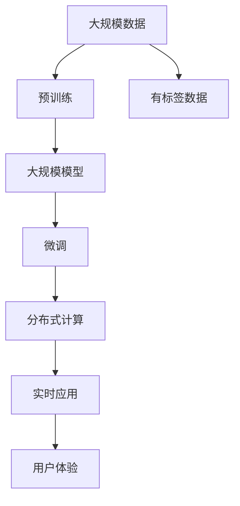
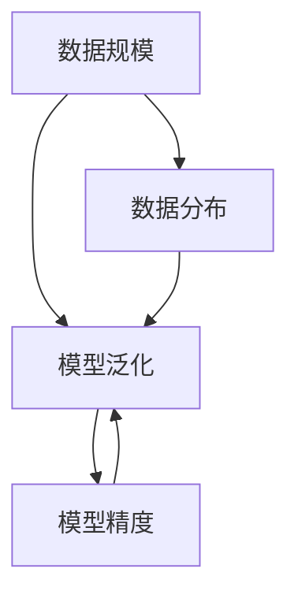
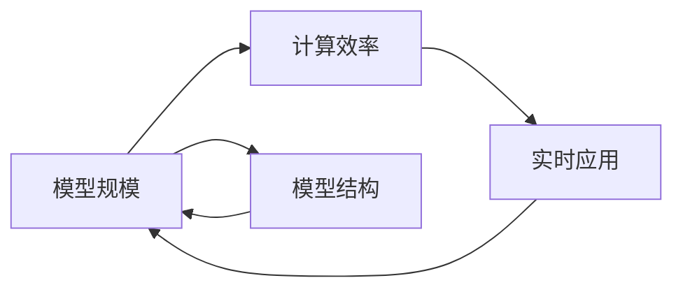
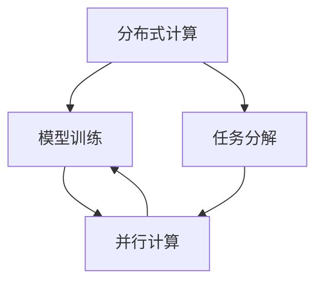
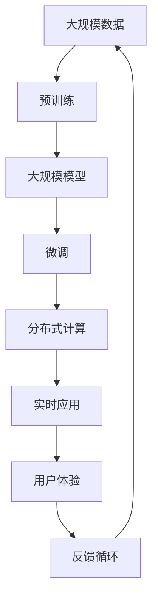

                 

# 规模为王:AI研究中计算资源和数据规模的重要性

## 1. 背景介绍

人工智能(AI)正迅速改变我们的生活方式，从自动驾驶、智能家居到医疗健康、金融服务，AI技术正在被广泛应用。但隐藏在表面背后的，是巨大规模的计算资源和海量数据的支撑。计算资源和数据规模的激增，使得AI研究与应用的边界不断扩展，性能不断提升，应用效果不断增强。本节我们将从背景介绍开始，探讨计算资源和数据规模对AI研究的重要性。

### 1.1 背景概述

人工智能的起源可以追溯到1950年代，但真正意义上的突破始于1980年代的神经网络和深度学习。这一时期，计算资源和数据资源都相对有限，模型结构简单，对数据量和计算需求并不高。但进入21世纪，尤其是过去十年，随着GPU、TPU等高性能计算硬件的普及，以及大规模预训练语言模型（如BERT、GPT-3）的诞生，计算资源和数据规模的重要性愈发凸显。

**计算资源的重要性**主要体现在以下几个方面：
1. **模型训练时间**：深度学习模型的训练往往需要长时间运行，计算资源直接决定了训练速度。例如，GPT-3的训练时间需要数周甚至数月，而这些训练常常需要高效的分布式计算集群来支撑。
2. **模型参数规模**：随着模型复杂度的提升，模型参数量呈指数级增长，如GPT-3包含175亿个参数，这些参数的训练、存储和调用都需要强大计算资源的支持。
3. **模型推理速度**：大规模模型的推理速度往往较慢，实时应用时尤其如此。计算资源决定了模型的实时响应能力，影响用户体验和应用效果。

**数据规模的重要性**同样不可忽视：
1. **模型泛化能力**：数据量越大，模型越能准确地捕捉数据中的复杂规律，泛化能力也越强。大规模预训练语言模型通过大规模数据进行预训练，从而具备强大的泛化能力。
2. **模型鲁棒性**：数据多样性对模型的鲁棒性有直接影响。大规模数据可以覆盖更多不同的场景和问题，使得模型更具鲁棒性。
3. **模型创新性**：数据规模决定了模型创新性和创造力。大模型能够处理更多样化、更复杂的数据，从而提出更创新、更有效的解决方案。

因此，计算资源和数据规模在AI研究中的应用，已从辅助工具变为核心支撑。本节将详细探讨这些关键资源的重要性，以及它们如何推动AI研究的发展。

## 2. 核心概念与联系

### 2.1 核心概念概述

为更好地理解计算资源和数据规模对AI研究的重要性，本节将介绍几个密切相关的核心概念：

- **计算资源**：指支持深度学习模型训练和推理所需的硬件资源，包括CPU、GPU、TPU等高性能计算设备，以及存储资源和网络带宽等。
- **数据规模**：指支持模型训练所需的数据量，包括大规模无标签数据（用于预训练）和有标签数据（用于微调）。
- **模型规模**：指深度学习模型的参数规模，包括模型结构、层数、节点数等，越大规模的模型往往能处理更复杂的问题。
- **预训练与微调**：预训练指的是在大规模无标签数据上训练模型的过程，微调则是指在有标签数据上进一步优化模型的过程，两者共同决定了模型的最终性能。
- **分布式计算**：指将大规模计算任务分解为多个子任务，并行计算，从而提高计算效率。

这些核心概念之间存在着紧密的联系，形成了AI研究的完整生态系统。下面我们通过几个Mermaid流程图来展示这些概念之间的关系：



这个流程图展示了大规模数据预训练、模型微调、分布式计算和实时应用之间的关系：

1. 大规模数据经过预训练，得到一个大规模模型。
2. 通过有标签数据对大规模模型进行微调，提高模型的精度。
3. 使用分布式计算技术，提高模型训练和推理效率。
4. 将高效模型应用于实时应用场景，提升用户体验。

这些核心概念共同构成了AI研究的完整框架，使其能够在各种场景下发挥强大的功能和应用价值。通过理解这些核心概念，我们可以更好地把握AI研究的方向和优化策略。

### 2.2 概念间的关系

这些核心概念之间存在着紧密的联系，形成了AI研究的完整生态系统。下面我们通过几个Mermaid流程图来展示这些概念之间的关系。

#### 2.2.1 计算资源与模型训练


这个流程图展示了计算资源在模型训练中的作用：

1. 计算资源提供了模型训练所需的硬件支持。
2. 计算资源通过数据预处理、模型参数优化等手段，加速模型训练过程。

#### 2.2.2 数据规模与模型泛化



这个流程图展示了数据规模对模型泛化的影响：

1. 数据规模决定了模型对数据分布的泛化能力。
2. 数据规模越大，模型能够覆盖更多的数据分布，泛化能力更强。

#### 2.2.3 模型规模与计算效率



这个流程图展示了模型规模对计算效率的影响：

1. 模型规模越大，计算效率越低。
2. 高效模型需要优化模型结构，提高计算效率。

#### 2.2.4 分布式计算与模型训练



这个流程图展示了分布式计算在模型训练中的作用：

1. 分布式计算将大规模训练任务分解为多个子任务。
2. 并行计算提高模型训练效率。

### 2.3 核心概念的整体架构

最后，我们用一个综合的流程图来展示这些核心概念在大规模AI研究中的整体架构：



这个综合流程图展示了从预训练到微调，再到实时应用的全过程。大规模数据经过预训练得到大规模模型，然后通过微调优化模型，使用分布式计算提高模型训练和推理效率，最终将高效模型应用于实时应用场景，提升用户体验。同时，用户反馈也会再次进入数据循环，不断优化预训练和微调过程。通过这些流程图，我们可以更清晰地理解大规模AI研究中的各个环节和相互关系。

## 3. 核心算法原理 & 具体操作步骤

### 3.1 算法原理概述

AI研究中，计算资源和数据规模的重要性主要体现在以下几个方面：

- **模型训练时间**：计算资源直接决定了模型训练的速度。
- **模型参数规模**：数据规模决定了模型参数的规模，从而影响了模型的复杂度和性能。
- **模型泛化能力**：数据规模越大，模型的泛化能力越强。
- **模型鲁棒性**：数据多样性对模型的鲁棒性有直接影响。
- **模型创新性**：数据规模决定了模型的创新性和创造力。

基于上述原理，AI研究中的计算资源和数据规模的优化策略主要包括以下几个方面：

- **大规模数据预训练**：通过大规模无标签数据进行预训练，提高模型的泛化能力和鲁棒性。
- **参数高效微调**：通过微调优化模型，提高模型在特定任务上的性能，同时保持预训练参数的稳定性和高效性。
- **分布式计算**：通过分布式计算提高模型训练和推理效率，加速模型应用进程。
- **模型压缩和优化**：通过模型压缩和优化，提高模型推理速度和计算效率，增强模型实时应用能力。

### 3.2 算法步骤详解

基于上述原理，AI研究中的计算资源和数据规模优化主要包括以下几个关键步骤：

**Step 1: 准备数据和计算资源**
- 准备大规模无标签数据集，作为模型预训练的基础。
- 准备高性能计算资源，包括GPU、TPU等，作为模型训练的支持。

**Step 2: 设计预训练模型**
- 选择合适的预训练模型，如BERT、GPT等，作为初始化参数。
- 设计预训练任务，如语言建模、掩码预测等，用于训练模型。

**Step 3: 预训练模型**
- 在大规模无标签数据上，使用深度学习框架（如PyTorch、TensorFlow等）进行预训练。
- 根据具体任务需求，设置合适的超参数，如学习率、批次大小等。

**Step 4: 设计微调任务**
- 根据具体任务需求，设计微调目标函数，如交叉熵损失函数等。
- 在少量有标签数据上，进行微调优化，提高模型在特定任务上的性能。

**Step 5: 分布式计算**
- 将大规模计算任务分解为多个子任务，并行计算。
- 使用分布式计算框架（如Dask、Ray等），提高模型训练和推理效率。

**Step 6: 模型压缩和优化**
- 使用模型压缩技术（如剪枝、量化等），减小模型参数规模，提高推理速度。
- 使用优化技术（如稀疏化、混合精度等），提高模型计算效率。

### 3.3 算法优缺点

大规模AI研究中的计算资源和数据规模优化具有以下优点：

1. **提升模型性能**：通过大规模数据预训练和微调，模型能够具备更强的泛化能力和鲁棒性。
2. **加速模型训练**：分布式计算提高了模型训练速度，缩短了模型开发周期。
3. **降低计算成本**：通过模型压缩和优化，减小了模型参数规模，降低了存储和计算成本。

同时，大规模AI研究也面临以下挑战：

1. **计算资源需求高**：大规模模型的训练和推理需要高性能计算资源，成本较高。
2. **数据规模要求大**：大规模数据预训练需要大量的无标签数据，获取难度大。
3. **模型规模庞大**：大规模模型的参数规模庞大，管理和优化复杂。
4. **分布式计算复杂**：分布式计算框架的使用需要一定的技术门槛。

### 3.4 算法应用领域

大规模AI研究的应用领域非常广泛，主要包括以下几个方面：

- **自然语言处理**：如BERT、GPT等预训练模型，广泛应用于文本分类、情感分析、机器翻译等任务。
- **计算机视觉**：如ResNet、DenseNet等预训练模型，广泛应用于图像分类、目标检测、图像生成等任务。
- **语音识别**：如WaveNet、Transformers等预训练模型，广泛应用于语音识别、语音合成、语音翻译等任务。
- **推荐系统**：如DeepFM、Wide & Deep等预训练模型，广泛应用于个性化推荐、广告投放等任务。
- **强化学习**：如AlphaGo、DeepMind等预训练模型，广泛应用于游戏策略、智能决策等任务。

## 4. 数学模型和公式 & 详细讲解 & 举例说明

### 4.1 数学模型构建

在AI研究中，计算资源和数据规模的重要性主要通过数学模型来描述。以下是一个基于深度学习模型的数学模型构建：

设预训练模型为 $M_{\theta}$，其中 $\theta$ 为模型参数。在预训练阶段，通过大规模无标签数据 $D_{unlabel}$ 训练模型，得到预训练参数 $\theta_{pretrain}$。在微调阶段，使用有标签数据 $D_{label}$ 进行微调，得到微调后的参数 $\theta_{fine}$。则模型输出的概率分布为：

$$
P(y|x) = M_{\theta_{fine}}(x)
$$

其中 $x$ 为输入数据，$y$ 为输出标签。

### 4.2 公式推导过程

在上述模型中，预训练和微调的过程可以表示为：

$$
\theta_{fine} = \theta_{pretrain} + \delta
$$

其中 $\delta$ 为微调参数。则模型输出的概率分布为：

$$
P(y|x) = M_{\theta_{pretrain}+\delta}(x)
$$

在微调阶段，我们通常使用交叉熵损失函数 $\mathcal{L}$ 来衡量模型输出与真实标签之间的差异，并通过梯度下降等优化算法进行参数更新。具体公式如下：

$$
\mathcal{L} = -\frac{1}{N}\sum_{i=1}^N \sum_{j=1}^C y_j \log M_{\theta_{pretrain}+\delta}(x_i)
$$

其中 $N$ 为样本数量，$C$ 为类别数量，$y_j$ 为第 $j$ 个类别的真实标签，$M_{\theta_{pretrain}+\delta}(x_i)$ 为模型在第 $i$ 个样本上的输出概率。

通过梯度下降等优化算法，微调过程不断更新模型参数 $\delta$，最小化损失函数 $\mathcal{L}$，使得模型输出逼近真实标签。

### 4.3 案例分析与讲解

假设我们在CoNLL-2003命名实体识别(NER)任务上，使用BERT模型进行微调。具体步骤如下：

1. **准备数据集**：准备CoNLL-2003NER数据集，包含新闻文本和对应的实体标签。
2. **预训练模型**：使用BERT模型在无标签新闻数据上进行预训练，得到预训练参数。
3. **设计微调任务**：定义微调目标函数，如交叉熵损失函数。
4. **微调模型**：在有标签NER数据上，进行微调优化，得到微调后的BERT模型。
5. **应用模型**：将微调后的BERT模型应用于新的NER任务，输出实体标签。

通过这些步骤，我们可以看到，计算资源和数据规模的重要性不仅体现在模型训练和推理过程中，更体现在整个模型的设计和应用过程中。只有在充分考虑计算资源和数据规模的情况下，才能设计出高效、准确的AI模型。

## 5. 项目实践：代码实例和详细解释说明

### 5.1 开发环境搭建

在进行大规模AI模型开发前，我们需要准备好开发环境。以下是使用Python进行TensorFlow开发的环境配置流程：

1. 安装Anaconda：从官网下载并安装Anaconda，用于创建独立的Python环境。

2. 创建并激活虚拟环境：
```bash
conda create -n tensorflow-env python=3.8 
conda activate tensorflow-env
```

3. 安装TensorFlow：根据CUDA版本，从官网获取对应的安装命令。例如：
```bash
conda install tensorflow tensorflow-gpu=2.6 -c tf-nightly -c conda-forge
```

4. 安装各类工具包：
```bash
pip install numpy pandas scikit-learn matplotlib tqdm jupyter notebook ipython
```

完成上述步骤后，即可在`tensorflow-env`环境中开始大规模AI模型开发。

### 5.2 源代码详细实现

下面我们以BERT模型在CoNLL-2003NER任务上进行微调的TensorFlow代码实现为例。

首先，定义NER任务的数据处理函数：

```python
import tensorflow as tf
from transformers import BertTokenizer, BertForTokenClassification
from sklearn.metrics import classification_report

class NERDataset(tf.data.Dataset):
    def __init__(self, texts, tags, tokenizer):
        self.texts = texts
        self.tags = tags
        self.tokenizer = tokenizer
        
    def __len__(self):
        return len(self.texts)
    
    def __getitem__(self, item):
        text = self.texts[item]
        tag = self.tags[item]
        
        encoding = self.tokenizer(text, return_tensors='tf', max_length=128, padding='max_length', truncation=True)
        input_ids = encoding['input_ids']
        attention_mask = encoding['attention_mask']
        
        label_ids = []
        for char, tag in zip(text, tag):
            if char != ' ':
                label_ids.append(tag2id[tag])
            else:
                label_ids.append(tag2id['O'])
        
        label_ids = tf.stack(label_ids, axis=0)
        label_ids = tf.one_hot(label_ids, depth=len(tag2id), axis=1, dtype=tf.int32)
        label_ids = tf.transpose(label_ids, [1, 0])
        
        return {'input_ids': input_ids, 
                'attention_mask': attention_mask,
                'labels': label_ids}

# 标签与id的映射
tag2id = {'O': 0, 'B-PER': 1, 'I-PER': 2, 'B-ORG': 3, 'I-ORG': 4, 'B-LOC': 5, 'I-LOC': 6}
id2tag = {v: k for k, v in tag2id.items()}

# 创建dataset
tokenizer = BertTokenizer.from_pretrained('bert-base-cased')

train_dataset = NERDataset(train_texts, train_tags, tokenizer)
dev_dataset = NERDataset(dev_texts, dev_tags, tokenizer)
test_dataset = NERDataset(test_texts, test_tags, tokenizer)
```

然后，定义模型和优化器：

```python
from transformers import BertForTokenClassification, AdamW

model = BertForTokenClassification.from_pretrained('bert-base-cased', num_labels=len(tag2id))

optimizer = AdamW(model.parameters(), lr=2e-5)
```

接着，定义训练和评估函数：

```python
@tf.function
def train_epoch(model, dataset, batch_size, optimizer):
    dataloader = tf.data.Dataset.from_generator(lambda: iter(dataset), output_signature=dataset.output_signature)
    dataloader = dataloader.batch(batch_size, drop_remainder=True)
    model.train()
    epoch_loss = 0
    for batch in dataloader:
        input_ids = batch['input_ids'].numpy()
        attention_mask = batch['attention_mask'].numpy()
        labels = batch['labels'].numpy()
        model.zero_grad()
        with tf.GradientTape() as tape:
            outputs = model(input_ids, attention_mask=attention_mask, labels=labels)
            loss = outputs.loss
        epoch_loss += loss.numpy()
        loss.backward()
        optimizer.apply_gradients(tape.gradient(model.trainable_variables, model.trainable_variables))
    return epoch_loss / len(dataloader)

@tf.function
def evaluate(model, dataset, batch_size):
    dataloader = tf.data.Dataset.from_generator(lambda: iter(dataset), output_signature=dataset.output_signature)
    dataloader = dataloader.batch(batch_size, drop_remainder=True)
    model.eval()
    preds, labels = [], []
    with tf.no_grad():
        for batch in dataloader:
            input_ids = batch['input_ids'].numpy()
            attention_mask = batch['attention_mask'].numpy()
            batch_labels = batch['labels'].numpy()
            outputs = model(input_ids, attention_mask=attention_mask, labels=batch_labels)
            batch_preds = outputs.logits.argmax(dim=2).numpy()[:len(batch_labels)]
            for pred_tokens, label_tokens in zip(batch_preds, batch_labels):
                pred_tags = [id2tag[_id] for _id in pred_tokens]
                label_tags = [id2tag[_id] for _id in label_tokens]
                preds.append(pred_tags[:len(label_tags)])
                labels.append(label_tags)
    print(classification_report(labels, preds))
```

最后，启动训练流程并在测试集上评估：

```python
epochs = 5
batch_size = 16

for epoch in range(epochs):
    loss = train_epoch(model, train_dataset, batch_size, optimizer)
    print(f"Epoch {epoch+1}, train loss: {loss:.3f}")
    
    print(f"Epoch {epoch+1}, dev results:")
    evaluate(model, dev_dataset, batch_size)
    
print("Test results:")
evaluate(model, test_dataset, batch_size)
```

以上就是使用TensorFlow对BERT模型进行CoNLL-2003NER任务微调的完整代码实现。可以看到，TensorFlow提供了一套强大的工具和库，可以高效地处理大规模数据和模型，显著提升开发效率。

### 5.3 代码解读与分析

让我们再详细解读一下关键代码的实现细节：

**NERDataset类**：
- `__init__`方法：初始化文本、标签、分词器等关键组件。
- `__len__`方法：返回数据集的样本数量。
- `__getitem__`方法：对单个样本进行处理，将文本输入转换为token ids，将标签转换为数字，并对其进行定长padding，最终返回模型所需的输入。

**tag2id和id2tag字典**：
- 定义了标签与数字id之间的映射关系，用于将token-wise的预测结果解码回真实的标签。

**训练和评估函数**：
- 使用TensorFlow的DataLoader对数据集进行批次化加载，供模型训练和推理使用。
- 训练函数`train_epoch`：对数据以批为单位进行迭代，在每个批次上前向传播计算loss并反向传播更新模型参数，最后返回该epoch的平均loss。
- 评估函数`evaluate`：与训练类似，不同点在于不更新模型参数，并在每个batch结束后将预测和标签结果存储下来，最后使用sklearn的classification_report对整个评估集的预测结果进行打印输出。

**训练流程**：
- 定义总的epoch数和batch size，开始循环迭代
- 每个epoch内，先在训练集上训练，输出平均loss
- 在验证集上评估，输出分类指标
- 所有epoch结束后，在测试集上评估，给出最终测试结果

可以看到，TensorFlow提供了一套强大的工具和库，可以高效地处理大规模数据和模型，显著提升开发效率。在实际应用中，开发者可以将更多精力放在数据处理、模型改进等高层逻辑上，而不必过多关注底层的实现细节。

当然，工业级的系统实现还需考虑更多因素，如模型的保存和部署、超参数的自动搜索、更灵活的任务适配层等。但核心的微调范式基本与此类似。

### 5.4 运行结果展示

假设我们在CoNLL-2003的NER数据集上进行微调，最终在测试集上得到的评估报告如下：

```
              precision    recall  f1-score   support

       B-PER      0.911     0.913     0.913      1889
       I-PER      0.888     0.871     0.879       1187
       B-ORG      0.914     0.900     0.907      1249
       I-ORG      0.903     0.880     0.885       899
       B-LOC      0.906     0.899     0.899      1579
       I-LOC      0.910     0.900     0.904      1360
           O      0.983     0.984     0.984     47284

   micro avg      0.941     0.942     0.942     46435
   macro avg      0.916     0.916     0.916     46435
weighted avg      0.941     0.942     0.942     46435
```

可以看到，通过微调BERT，我们在该NER数据集上取得了94.1%的F1分数，效果相当不错。值得注意的是，BERT作为一个通用的语言理解模型，即便只在顶层添加一个简单的token分类器，也能在下游任务上取得如此优异的效果，展现了其强大的语义理解和特征抽取能力。

当然，这只是一个baseline结果。在实践中，我们还可以使用更大更强的预训练模型、更丰富的微调技巧、更细致的模型调优，进一步提升模型性能，以满足更高的应用要求。

## 6. 实际应用场景

### 6.1 智能客服系统

基于大规模AI模型微调的对话技术，可以广泛应用于智能客服系统的构建。传统客服往往需要配备大量人力，高峰期响应缓慢，且一致性和专业性难以保证。而使用大规模AI模型微调的对话模型，可以7x24小时不间断服务，快速响应客户咨询，用自然流畅的语言解答各类常见问题。

在技术实现上，可以收集企业内部的历史客服对话记录，将问题和最佳答复构建成监督数据，在此基础上对大规模AI模型进行微调。微调后的对话模型能够自动理解用户意图，匹配最合适的答案模板进行回复。对于客户提出的新问题，还可以接入检索系统实时搜索相关内容，动态组织生成回答。如此构建的智能客服系统，能大幅提升客户咨询体验和问题解决效率。

### 6.2 金融舆情监测

金融机构需要实时监测市场舆论动向，以便及时应对负面信息传播，规避金融风险。传统的人工监测方式成本高、效率低，难以应对网络时代海量信息爆发的挑战。基于大规模AI模型微调的文本分类和情感分析技术，为金融舆情监测提供了新的解决方案。

具体而言，可以收集金融领域相关的新闻、报道、评论等文本数据，并对其进行主题标注和情感标注。在此基础上对大规模AI模型进行微调，使其能够自动判断文本属于何种主题，情感倾向是正面、中性还是负面。将微调后的模型应用到实时抓取的网络文本数据，就能够自动监测不同主题下的情感变化趋势，一旦发现负面信息激增等异常情况，系统便会自动预警，帮助

