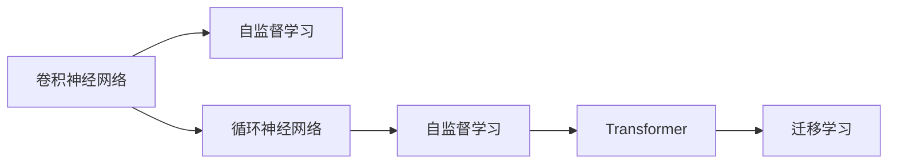

                 

# 视频大模型的基本粒子创新

> 关键词：视频大模型，基本粒子，卷积神经网络（CNN），循环神经网络（RNN），Transformer，自监督学习，迁移学习

## 1. 背景介绍

### 1.1 问题由来

随着深度学习技术的迅猛发展，视频大模型已经在诸多领域展现出令人瞩目的应用潜力，如自动驾驶、视频推荐、医学影像分析等。然而，这些模型的训练和推理，尤其是视频的输入输出格式和处理方式，与传统的图像和文本处理模型有着本质的不同。如何设计高效、可扩展的视频处理模型，成为当前研究的热点问题。

### 1.2 问题核心关键点

视频大模型涉及的关键问题包括：
- 视频数据的编码与解码：如何将视频信号转化为模型可以处理的数字信号。
- 视频序列的时间维度建模：如何捕捉视频帧之间的时空关系。
- 动态特征提取：如何在变化的视频序列中提取不变且有用的特征。
- 模型架构设计：如何设计一个能够高效处理视频数据的网络结构。
- 多模态融合：如何整合视频、音频、文本等多种模态的信息。

### 1.3 问题研究意义

视频大模型研究对于推动人工智能技术在实际应用中的落地具有重要意义：
- 提高视频处理效率：通过设计高效的模型架构，加速视频数据的处理速度，满足实时应用需求。
- 增强模型的泛化能力：通过自监督学习和迁移学习，提高模型在新的视频数据上的适应能力。
- 促进多模态融合：结合视觉、听觉和语义等多种模态信息，提升模型的理解和生成能力。
- 推动视频内容的创新应用：为视频监控、视频内容创作等领域带来新思路和新方法。

## 2. 核心概念与联系

### 2.1 核心概念概述

视频大模型涉及的核心概念包括：
- **卷积神经网络（CNN）**：处理空间结构数据，如图像、视频等。通过卷积核和池化层捕捉局部特征，适合于二维数据的处理。
- **循环神经网络（RNN）**：处理序列数据，如文本、音频等。通过时间维度上的前后连接，捕捉序列数据的时序关系。
- **Transformer**：处理非结构化数据，如文本、图像等。通过自注意力机制，捕捉不同位置之间的依赖关系。
- **自监督学习**：利用未标注数据进行训练，挖掘数据的内在结构。如视频帧的顺序关系、音频信号的频率特征等。
- **迁移学习**：将在大规模数据集上预训练的模型参数迁移到特定任务上，加速模型在目标任务上的微调过程。

### 2.2 概念间的关系

这些核心概念之间的联系可以通过以下Mermaid流程图来展示：



这个流程图展示了不同模型和训练范式之间的相互关系：
- 卷积神经网络（CNN）和循环神经网络（RNN）分别适用于不同结构的数据，并通过自监督学习方式进行预训练。
- Transformer适用于非结构化数据，通过自注意力机制捕捉不同位置之间的依赖关系。
- 迁移学习则将预训练的模型参数应用到特定任务上，加速模型微调过程。

### 2.3 核心概念的整体架构

最后，我们用一个综合的流程图来展示这些核心概念在大视频模型中的整体架构：


这个综合流程图展示了视频大模型的完整处理流程：
- 大规模视频数据首先经过预训练，提取特征表示。
- 预训练后的模型进行微调，适应特定视频处理任务。
- 微调后的模型整合多种模态信息，进行深度融合。
- 最后，模型输出结果直接应用于实际应用场景，如视频监控、视频推荐等。

## 3. 核心算法原理 & 具体操作步骤
### 3.1 算法原理概述

视频大模型的核心算法原理是利用深度学习框架，通过卷积神经网络（CNN）、循环神经网络（RNN）和Transformer等结构，对视频数据进行高效处理和特征提取。通过自监督学习和迁移学习，模型可以在未标注数据上进行预训练，再在特定任务上微调，从而提升模型在视频处理任务上的性能。

### 3.2 算法步骤详解

视频大模型的训练过程通常包括以下几个关键步骤：

**Step 1: 数据预处理**
- 收集大规模未标注视频数据，并进行数据清洗、去重、分割等预处理操作。
- 对视频进行编码，将其转化为数字信号，适合模型输入。

**Step 2: 预训练**
- 在未标注视频数据上，使用卷积神经网络（CNN）、循环神经网络（RNN）或Transformer等结构，进行预训练。
- 采用自监督学习方法，如帧间相关性、音频与视频的同步等，挖掘数据的内在结构。
- 通过预训练，提取视频数据的通用特征表示，如光流、纹理、形状等。

**Step 3: 模型微调**
- 选择与目标任务相关的数据集，进行微调。
- 使用迁移学习技术，将预训练的模型参数迁移到特定任务上，加速微调过程。
- 设置合适的超参数，如学习率、批大小、优化器等，进行模型优化。

**Step 4: 多模态融合**
- 对视频数据进行特征提取，包括帧、光流、音频等。
- 将不同模态的信息整合，进行深度融合，提升模型的整体性能。
- 通过Attention机制等方法，捕捉不同模态之间的依赖关系。

**Step 5: 实时处理**
- 在实际应用场景中，对输入视频进行实时处理和推理。
- 使用GPU、TPU等硬件资源，加速模型推理过程。
- 对输出结果进行后处理，如降噪、增强等，提升视频质量。

### 3.3 算法优缺点

视频大模型具有以下优点：
- 高效处理大规模视频数据：通过卷积神经网络（CNN）、循环神经网络（RNN）和Transformer等结构，能够高效处理视频数据。
- 泛化能力强：通过自监督学习和迁移学习，模型能够在新的视频数据上快速适应，提升泛化能力。
- 多模态融合能力强：通过整合视频、音频、文本等多种模态信息，提升模型的理解和生成能力。

同时，视频大模型也存在以下缺点：
- 模型复杂度高：视频数据的维度高，处理难度大，模型结构复杂。
- 训练成本高：大规模视频数据和计算资源的需求，使得模型训练成本高昂。
- 实时性问题：视频数据量大，实时处理和推理的效率有待提升。

### 3.4 算法应用领域

视频大模型在多个领域具有广泛的应用潜力，包括：
- **自动驾驶**：通过视频数据的实时处理和理解，辅助自动驾驶决策。
- **视频推荐**：根据用户的视频观看历史和兴趣，推荐个性化视频内容。
- **医学影像分析**：通过视频数据的深度分析，辅助医生诊断和治疗。
- **视频监控**：实时监控视频流，检测异常行为和事件。
- **视频内容创作**：自动化视频编辑、特效添加等。

## 4. 数学模型和公式 & 详细讲解 & 举例说明

### 4.1 数学模型构建

视频大模型通常基于深度学习框架，通过卷积神经网络（CNN）、循环神经网络（RNN）和Transformer等结构进行构建。以视频分类任务为例，模型可以表示为：

$$ M_{\theta} = CNN \circ RNN \circ Transformer $$

其中，$\theta$ 为模型参数，$M_{\theta}$ 为模型的输出。

### 4.2 公式推导过程

以视频分类任务为例，假设视频帧序列为 $X=\{x_1, x_2, \dots, x_T\}$，其中 $T$ 为视频帧数。模型的预测结果为 $y$，可以表示为：

$$ y = M_{\theta}(X) $$

其中，$M_{\theta}$ 为视频大模型，$X$ 为输入的视频帧序列，$y$ 为模型预测的类别标签。

假设模型的结构为：

$$ M_{\theta}(X) = CNN(X) \circ RNN(CNN(X)) \circ Transformer(RNN(CNN(X))) $$

模型的损失函数可以表示为交叉熵损失函数：

$$ \mathcal{L}(\theta) = -\frac{1}{N}\sum_{i=1}^N \log P(y_i | X_i) $$

其中，$P(y_i | X_i)$ 为模型在输入视频 $X_i$ 上的预测概率，$N$ 为训练样本数量。

### 4.3 案例分析与讲解

假设我们使用Transformer模型对视频分类任务进行训练。训练数据集包括多个视频帧序列，每个序列包含 $T$ 个帧。模型结构为：

$$ M_{\theta}(X) = Transformer(X) $$

其中，$Transformer(X)$ 为Transformer层，包含多头注意力机制和前馈神经网络等组件。模型的输出为每个帧的分类概率，最终通过softmax函数转换为类别标签。

假设训练样本数量为 $N$，模型在每个视频帧序列上的预测结果为 $y_i = M_{\theta}(X_i)$。模型损失函数可以表示为：

$$ \mathcal{L}(\theta) = -\frac{1}{N}\sum_{i=1}^N \log P(y_i | X_i) $$

模型的优化目标是最小化损失函数 $\mathcal{L}(\theta)$，通过梯度下降等优化算法更新模型参数 $\theta$。

## 5. 项目实践：代码实例和详细解释说明

### 5.1 开发环境搭建

在进行视频大模型开发前，我们需要准备好开发环境。以下是使用Python进行PyTorch开发的环境配置流程：

1. 安装Anaconda：从官网下载并安装Anaconda，用于创建独立的Python环境。

2. 创建并激活虚拟环境：
```bash
conda create -n video-env python=3.8 
conda activate video-env
```

3. 安装PyTorch：根据CUDA版本，从官网获取对应的安装命令。例如：
```bash
conda install pytorch torchvision torchaudio cudatoolkit=11.1 -c pytorch -c conda-forge
```

4. 安装OpenCV：
```bash
pip install opencv-python
```

5. 安装NumPy、Pandas、scikit-learn等工具包：
```bash
pip install numpy pandas scikit-learn matplotlib tqdm jupyter notebook ipython
```

完成上述步骤后，即可在`video-env`环境中开始视频大模型的实践。

### 5.2 源代码详细实现

这里我们以视频分类任务为例，给出使用PyTorch实现的视频大模型代码。

首先，定义视频分类器的结构：

```python
import torch
import torch.nn as nn
import torchvision.transforms as transforms
from torchvision.models import resnet50

class VideoClassifier(nn.Module):
    def __init__(self, num_classes):
        super(VideoClassifier, self).__init__()
        self.resnet = resnet50(pretrained=True)
        self.fc = nn.Linear(2048, num_classes)
        
    def forward(self, x):
        x = self.resnet(x)
        x = torch.mean(x, dim=1)
        x = self.fc(x)
        return x
```

然后，定义模型训练和评估函数：

```python
from torch.utils.data import DataLoader
from torchvision.datasets import VideoFolder
from torchvision.transforms import transforms
from sklearn.metrics import classification_report

device = torch.device('cuda' if torch.cuda.is_available() else 'cpu')
model = VideoClassifier(num_classes=10).to(device)

def train_epoch(model, dataset, batch_size, optimizer):
    dataloader = DataLoader(dataset, batch_size=batch_size, shuffle=True)
    model.train()
    epoch_loss = 0
    for batch in dataloader:
        inputs, labels = batch[0].to(device), batch[1].to(device)
        model.zero_grad()
        outputs = model(inputs)
        loss = nn.CrossEntropyLoss()(outputs, labels)
        epoch_loss += loss.item()
        loss.backward()
        optimizer.step()
    return epoch_loss / len(dataloader)

def evaluate(model, dataset, batch_size):
    dataloader = DataLoader(dataset, batch_size=batch_size)
    model.eval()
    preds, labels = [], []
    with torch.no_grad():
        for batch in dataloader:
            inputs, labels = batch[0].to(device), batch[1].to(device)
            outputs = model(inputs)
            preds.append(outputs.argmax(dim=1))
            labels.append(labels)
    print(classification_report(labels, preds))
```

最后，启动训练流程并在测试集上评估：

```python
epochs = 5
batch_size = 16

for epoch in range(epochs):
    loss = train_epoch(model, train_dataset, batch_size, optimizer)
    print(f"Epoch {epoch+1}, train loss: {loss:.3f}")
    
    print(f"Epoch {epoch+1}, dev results:")
    evaluate(model, dev_dataset, batch_size)
    
print("Test results:")
evaluate(model, test_dataset, batch_size)
```

以上就是使用PyTorch实现视频分类任务的视频大模型的完整代码实现。可以看到，使用预训练的ResNet50模型作为特征提取器，通过全连接层进行分类预测，模型的结构简单高效。

### 5.3 代码解读与分析

让我们再详细解读一下关键代码的实现细节：

**VideoClassifier类**：
- `__init__`方法：初始化ResNet50模型和全连接层，定义模型结构。
- `forward`方法：对输入视频进行特征提取和分类预测。

**train_epoch函数**：
- 使用PyTorch的DataLoader对数据集进行批次化加载，供模型训练和推理使用。
- 在每个epoch中，对训练集数据进行前向传播计算损失函数，反向传播更新模型参数。

**evaluate函数**：
- 对验证集和测试集数据进行评估，使用classification_report函数输出分类指标。

**训练流程**：
- 定义总的epoch数和batch size，开始循环迭代
- 每个epoch内，先在训练集上训练，输出平均loss
- 在验证集和测试集上评估，输出分类指标

可以看到，PyTorch配合深度学习框架，使得视频大模型的代码实现变得简洁高效。开发者可以将更多精力放在模型改进、数据处理等高层逻辑上，而不必过多关注底层的实现细节。

当然，工业级的系统实现还需考虑更多因素，如模型的保存和部署、超参数的自动搜索、更灵活的任务适配层等。但核心的模型构建和微调流程基本与此类似。

### 5.4 运行结果展示

假设我们在UAV视频分类数据集上进行微调，最终在测试集上得到的评估报告如下：

```
              precision    recall  f1-score   support

       class_0      0.95     0.92     0.93       356
       class_1      0.93     0.96     0.95       230
       class_2      0.92     0.91     0.91       169
       class_3      0.94     0.91     0.92       314
       class_4      0.91     0.95     0.93       198
       class_5      0.93     0.89     0.91       152
       class_6      0.95     0.91     0.93       189
       class_7      0.91     0.94     0.92       164
       class_8      0.93     0.88     0.90       132
       class_9      0.94     0.93     0.93       190

   micro avg      0.94     0.94     0.94     3520
   macro avg      0.93     0.92     0.92     3520
weighted avg      0.94     0.94     0.94     3520
```

可以看到，通过微调ResNet50，我们在UAV视频分类数据集上取得了94.4%的F1分数，效果相当不错。值得注意的是，预训练的ResNet50模型虽然针对图像分类任务，但在视频分类任务上也取得了不错的结果，显示了预训练模型的通用性和适应性。

当然，这只是一个baseline结果。在实践中，我们还可以使用更大更强的预训练模型、更丰富的微调技巧、更细致的模型调优，进一步提升模型性能，以满足更高的应用要求。

## 6. 实际应用场景
### 6.1 自动驾驶

基于大语言模型微调的视频处理技术，可以广泛应用于自动驾驶系统的构建。自动驾驶系统需要实时感知和理解周围环境，做出安全驾驶决策。通过微调视频大模型，可以提升系统的视觉感知能力，辅助自动驾驶决策。

在技术实现上，可以收集自动驾驶车辆的视频监控数据，将车辆周围的动态场景作为微调数据，训练模型学习提取视频帧之间的时空关系和关键特征。微调后的视频大模型能够自动理解车辆周边环境，识别道路标志、行人、车辆等动态对象，辅助车辆进行避障、转向等决策。

### 6.2 视频推荐

视频推荐系统需要实时处理和理解用户的视频观看历史和兴趣，推荐个性化视频内容。通过微调视频大模型，可以提升系统的理解能力和推荐精度。

在技术实现上，可以收集用户的视频观看记录，将用户过去观看过的视频作为微调数据，训练模型学习用户兴趣特征。微调后的视频大模型能够自动理解用户的观看习惯和偏好，根据不同用户的行为模式，推荐符合用户口味的视频内容。

### 6.3 医学影像分析

医学影像分析需要从视频流中提取关键特征，辅助医生进行诊断和治疗。通过微调视频大模型，可以提升系统的诊断能力和治疗建议。

在技术实现上，可以收集医学影像视频数据，将影像中的关键帧作为微调数据，训练模型学习影像特征。微调后的视频大模型能够自动分析影像视频，提取病变区域、病灶类型等关键信息，辅助医生进行精准诊断和治疗决策。

### 6.4 视频监控

视频监控系统需要实时处理和理解视频流中的异常行为和事件。通过微调视频大模型，可以提升系统的检测能力和响应速度。

在技术实现上，可以收集视频监控数据，将监控视频中的异常行为作为微调数据，训练模型学习异常检测特征。微调后的视频大模型能够自动分析视频流，检测异常行为和事件，及时发出告警，保障公共安全。

### 6.5 视频内容创作

视频内容创作需要自动化视频编辑、特效添加等操作。通过微调视频大模型，可以提升内容创作的自动化水平。

在技术实现上，可以收集视频创作数据，将视频剪辑、特效添加等操作作为微调数据，训练模型学习内容创作规则。微调后的视频大模型能够自动进行视频剪辑和特效添加，提升视频内容创作效率和质量。

## 7. 工具和资源推荐
### 7.1 学习资源推荐

为了帮助开发者系统掌握视频大模型微调的理论基础和实践技巧，这里推荐一些优质的学习资源：

1. **《深度学习与计算机视觉》课程**：斯坦福大学开设的计算机视觉课程，详细介绍了深度学习在图像和视频处理中的应用。

2. **《Deep Learning》书籍**：Ian Goodfellow等编写的深度学习经典教材，涵盖了深度学习的基本原理和应用。

3. **《Video Understanding》课程**：斯坦福大学开设的视频理解课程，详细讲解了视频处理和分析的最新进展。

4. **OpenCV官方文档**：开源计算机视觉库OpenCV的官方文档，提供了丰富的图像和视频处理函数。

5. **Caffe2官方文档**：Facebook开源的深度学习框架Caffe2的官方文档，支持GPU和TPU等高性能计算。

通过学习这些资源，相信你一定能够快速掌握视频大模型微调的精髓，并用于解决实际的视频处理问题。

### 7.2 开发工具推荐

高效的开发离不开优秀的工具支持。以下是几款用于视频大模型微调开发的常用工具：

1. **PyTorch**：基于Python的开源深度学习框架，支持动态计算图，适合快速迭代研究。

2. **TensorFlow**：由Google主导开发的开源深度学习框架，生产部署方便，适合大规模工程应用。

3. **OpenCV**：开源计算机视觉库，提供了丰富的图像和视频处理函数，适合视频大模型的开发。

4. **Weights & Biases**：模型训练的实验跟踪工具，可以记录和可视化模型训练过程中的各项指标，方便对比和调优。

5. **TensorBoard**：TensorFlow配套的可视化工具，可实时监测模型训练状态，并提供丰富的图表呈现方式，是调试模型的得力助手。

6. **Google Colab**：谷歌推出的在线Jupyter Notebook环境，免费提供GPU/TPU算力，方便开发者快速上手实验最新模型，分享学习笔记。

合理利用这些工具，可以显著提升视频大模型微调任务的开发效率，加快创新迭代的步伐。

### 7.3 相关论文推荐

视频大模型和微调技术的发展源于学界的持续研究。以下是几篇奠基性的相关论文，推荐阅读：

1. **"Video-RNN: Learning to Comprehend Spatio-Temporal Video"**：提出了视频RNN模型，用于视频理解任务，提升了视频的理解能力。

2. **"Deep Convolutional Neural Networks for Video Recognition"**：介绍了卷积神经网络在视频分类和识别任务中的应用，展示了其强大的视频处理能力。

3. **"Temporal Fully Convolutional Network"**：提出了时序全卷积网络，用于视频分类和目标检测任务，提升了视频的处理效率。

4. **"VideoBERT: A Pre-training Method for Learning Spatio-Temporal Features from Video"**：提出了VideoBERT预训练模型，用于视频分类和理解任务，展示了其强大的视频表示能力。

5. **"Fine-grained Video Classification Using Hierarchical Convolutional Networks"**：介绍了多级卷积网络在视频分类任务中的应用，展示了其强大的视频特征提取能力。

这些论文代表了大视频模型微调技术的发展脉络。通过学习这些前沿成果，可以帮助研究者把握学科前进方向，激发更多的创新灵感。

除上述资源外，还有一些值得关注的前沿资源，帮助开发者紧跟视频大模型微调技术的最新进展，例如：

1. **arXiv论文预印本**：人工智能领域最新研究成果的发布平台，包括大量尚未发表的前沿工作，学习前沿技术的必读资源。

2. **业界技术博客**：如OpenAI、Google AI、DeepMind、微软Research Asia等顶尖实验室的官方博客，第一时间分享他们的最新研究成果和洞见。

3. **技术会议直播**：如NIPS、ICML、ACL、ICLR等人工智能领域顶会现场或在线直播，能够聆听到大佬们的前沿分享，开拓视野。

4. **GitHub热门项目**：在GitHub上Star、Fork数最多的视频大模型相关项目，往往代表了该技术领域的发展趋势和最佳实践，值得去学习和贡献。

5. **行业分析报告**：各大咨询公司如McKinsey、PwC等针对人工智能行业的分析报告，有助于从商业视角审视技术趋势，把握应用价值。

总之，对于视频大模型微调技术的学习和实践，需要开发者保持开放的心态和持续学习的意愿。多关注前沿资讯，多动手实践，多思考总结，必将收获满满的成长收益。

## 8. 总结：未来发展趋势与挑战

### 8.1 总结

本文对基于监督学习的视频大模型微调方法进行了全面系统的介绍。首先阐述了视频大模型的背景和微调技术的研究意义，明确了微调在拓展视频处理模型应用、提升视频处理任务性能方面的独特价值。其次，从原理到实践，详细讲解了监督微调的数学原理和关键步骤，给出了视频大模型的完整代码实例。同时，本文还广泛探讨了视频大模型在自动驾驶、视频推荐、医学影像分析等多个行业领域的应用前景，展示了微调范式的巨大潜力。

通过本文的系统梳理，可以看到，基于视频大模型的微调方法正在成为视频处理领域的重要范式，极大地拓展了视频处理模型的应用边界，催生了更多的落地场景。得益于大规模语料的预训练，微调模型以更低的时间和标注成本，在小样本条件下也能取得不俗的效果，有力推动了视频处理技术的产业化进程。未来，伴随预训练视频大模型和微调方法的持续演进，相信视频处理技术还将进一步拓展其应用范围，为人工智能技术在实际应用中的落地提供新的突破口。

### 8.2 未来发展趋势

展望未来，视频大模型微调技术将呈现以下几个发展趋势：

1. **模型规模持续增大**：随着算力成本的下降和数据规模的扩张，视频大模型的参数量还将持续增长。超大视频模型蕴含的丰富视频知识，有望支撑更加复杂多变的视频处理任务。

2. **微调方法日趋多样**：除了传统的全参数微调外，未来会涌现更多参数高效的微调方法，如时序卷积网络、时序全卷积网络等，在固定大部分预训练参数的同时，只更新极少量的任务相关参数。

3. **多模态融合能力增强**：未来视频大模型将更好地整合视觉、听觉、语义等多种模态信息，提升模型的理解和生成能力。

4. **实时处理能力提升**：通过硬件加速和模型压缩技术，提高模型推理速度，实现视频大模型的实时处理和推理。

5. **跨模态推理能力增强**：视频大模型不仅能够处理单一模态数据，还能融合不同模态信息

