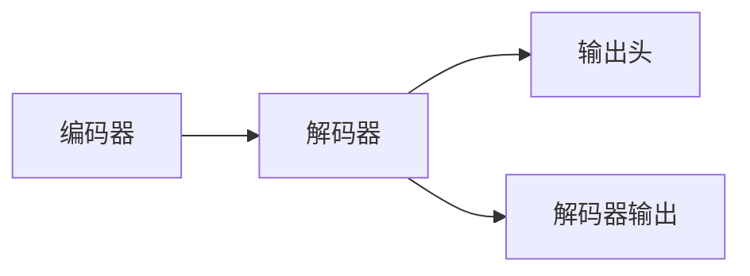

                 

## 1. 背景介绍

在自然语言处理（Natural Language Processing, NLP）中，解码器（Decoder）是一类重要组件，通常与编码器（Encoder）一起构成序列生成模型。解码器主要用于对编码器的输出进行转换和解码，生成目标序列，如机器翻译中的目标语言序列。本文将详细介绍解码器输出和Transformer的输出头的相关概念，并通过具体案例分析，展示其在NLP中的应用。

## 2. 核心概念与联系

### 2.1 核心概念概述

#### 2.1.1 解码器（Decoder）

解码器是序列生成模型中的重要组成部分，其主要任务是将编码器的输出转换为目标序列。解码器通常由多层神经网络组成，每层接收上一步的输出和编码器的输出，预测下一个目标单词或字符。

#### 2.1.2 输出头（Output Head）

输出头是解码器中的一种特殊机制，用于将解码器的中间隐藏表示映射到目标序列空间。通常情况下，输出头会与softmax层一起使用，计算每个目标单词或字符的条件概率，从而得到最终的目标序列预测。

#### 2.1.3 解码器的输出

解码器的输出可以有多种形式，常见的有词序列、字符序列、向量序列等。解码器的输出通常取决于具体的解码器结构，如基于递归神经网络的解码器输出词序列，基于循环神经网络的解码器输出字符序列，基于Transformer的解码器输出向量序列。

#### 2.1.4 Transformer的输出头

Transformer是一种基于自注意力机制的序列生成模型，其解码器输出通常是通过多层的自注意力和前馈网络实现的。Transformer的输出头是解码器输出的一部分，通常用于将解码器中间隐藏表示映射到目标序列空间。

### 2.2 核心概念间的关系

解码器、输出头和解码器输出之间存在着密切的联系。解码器通过多层网络将编码器的输出转换为中间隐藏表示，输出头则将中间隐藏表示映射到目标序列空间，解码器的输出是解码器最终生成目标序列的结果。Transformer的输出头是解码器中的一种特殊机制，主要用于生成向量序列形式的解码器输出。

通过以下Mermaid流程图，可以更清晰地理解这些概念之间的关系：



## 3. 核心算法原理 & 具体操作步骤

### 3.1 算法原理概述

解码器的输出和Transformer的输出头的算法原理涉及以下几个关键步骤：

1. 解码器接收编码器的输出，通过多层网络将其转换为中间隐藏表示。
2. 输出头将中间隐藏表示映射到目标序列空间，通常使用softmax层计算每个目标单词或字符的条件概率。
3. 解码器的输出是解码器最终生成目标序列的结果，可以通过词序列、字符序列或向量序列表示。

### 3.2 算法步骤详解

#### 3.2.1 解码器结构

解码器通常由多层神经网络组成，每层接收上一步的输出和编码器的输出，预测下一个目标单词或字符。以基于Transformer的解码器为例，其结构如图1所示：

```
图1: Transformer解码器结构示意图
```

#### 3.2.2 输出头计算

在Transformer的解码器中，输出头主要用于将中间隐藏表示映射到目标序列空间。具体而言，输出头通常包括两个部分：多头自注意力（Multi-Head Self-Attention）和前馈网络（Feed-Forward Network）。输出头的计算过程如图2所示：

```
图2: Transformer输出头计算过程
```

在计算过程中，首先通过多头自注意力机制将解码器的中间隐藏表示映射到多个不同的自注意力空间中，然后通过前馈网络进一步转换，最终得到目标序列的预测。

#### 3.2.3 解码器输出

解码器的输出通常取决于具体的解码器结构。在Transformer中，解码器的输出是解码器最终生成目标序列的结果，通常表示为向量序列。每个向量代表一个目标单词或字符，可以通过softmax层计算其条件概率。

### 3.3 算法优缺点

#### 3.3.1 优点

解码器的输出和Transformer的输出头具有以下优点：

1. 能够处理长序列。解码器可以通过多层网络将长序列转换为中间隐藏表示，并输出目标序列，适合处理长文本。
2. 并行计算能力强。Transformer的输出头使用多头自注意力机制，能够高效并行计算目标序列的概率，加速解码过程。
3. 鲁棒性高。解码器通过多层网络对编码器输出进行转换，能够有效降低编码器输出噪声的影响，提高模型鲁棒性。

#### 3.3.2 缺点

解码器的输出和Transformer的输出头也存在以下缺点：

1. 计算资源消耗大。解码器需要多层网络进行计算，计算资源消耗较大，特别是在处理长序列时。
2. 模型参数量大。解码器和输出头通常需要大量参数，增加模型训练和推理的难度。
3. 模型复杂度高。解码器和输出头的结构较为复杂，难以理解和调试。

### 3.4 算法应用领域

解码器、输出头和解码器输出广泛应用于自然语言处理（NLP）领域，如图像描述生成、机器翻译、语音识别、文本生成等。以下是一些具体应用场景：

#### 3.4.1 机器翻译

在机器翻译任务中，解码器通过多层网络将编码器的输出转换为目标语言序列，最终生成翻译结果。Transformer的输出头通过计算每个单词的条件概率，生成最终的翻译文本。

#### 3.4.2 文本生成

在文本生成任务中，解码器通过多层网络将编码器的输出转换为生成文本的向量序列，最终输出完整的文本。输出头通过计算每个单词的条件概率，生成文本中的每个单词。

#### 3.4.3 图像描述生成

在图像描述生成任务中，解码器通过多层网络将图像特征转换为描述文本的向量序列，最终生成对图像的描述。输出头通过计算每个单词的条件概率，生成描述文本中的每个单词。

## 4. 数学模型和公式 & 详细讲解 & 举例说明

### 4.1 数学模型构建

#### 4.1.1 解码器结构

假设解码器的输入为$X$，编码器的输出为$Y$，解码器输出为$Z$。解码器的结构如图3所示：

```
图3: 解码器结构示意图
```

#### 4.1.2 输出头计算

假设解码器中间隐藏表示为$H$，目标序列长度为$T$，输出头中的多头自注意力和前馈网络的层数为$L$，每个头的维度为$D$。输出头的计算过程如图4所示：

```
图4: 输出头计算过程
```

其中，$\text{softmax}(\cdot)$表示softmax函数，$M$表示多头自注意力矩阵，$W^Q, W^K, W^V$表示自注意力机制中的查询、键、值矩阵，$W^O$表示输出层的权重矩阵，$D$表示每个头的维度，$O$表示输出头输出的向量。

### 4.2 公式推导过程

#### 4.2.1 解码器输出

假设解码器输出为$Z$，目标序列长度为$T$，解码器中间隐藏表示为$H$，目标单词向量为$E_t$，解码器输出层的权重矩阵为$W^O$。解码器输出的计算过程如图5所示：

```
图5: 解码器输出计算过程
```

其中，$\text{softmax}(\cdot)$表示softmax函数，$W^O$表示输出层的权重矩阵，$D$表示每个头的维度，$T$表示目标序列长度。

### 4.3 案例分析与讲解

#### 4.3.1 机器翻译案例

假设需要将英文句子"Hello, world!"翻译成中文。使用基于Transformer的解码器进行翻译的过程如图6所示：

```
图6: 机器翻译案例示意图
```

首先，编码器将英文句子"Hello, world!"转换为中间隐藏表示$H$，然后解码器接收$H$，通过多层网络将其转换为中文的目标单词向量序列$Z$。最后，输出头通过计算每个单词的条件概率，生成最终的翻译结果"你好，世界！"。

## 5. 项目实践：代码实例和详细解释说明

### 5.1 开发环境搭建

#### 5.1.1 安装Python和PyTorch

在Linux系统上，可以使用以下命令安装Python和PyTorch：

```
sudo apt-get update
sudo apt-get install python3-pip
pip3 install torch torchvision torchaudio
```

#### 5.1.2 安装Transformer库

```
pip install transformers
```

### 5.2 源代码详细实现

#### 5.2.1 定义解码器结构

```python
import torch
import torch.nn as nn
import torch.nn.functional as F

class TransformerDecoder(nn.Module):
    def __init__(self, d_model, n_heads, d_ff, dropout, num_layers, attn_dropout):
        super(TransformerDecoder, self).__init__()
        self.d_model = d_model
        self.n_heads = n_heads
        self.d_ff = d_ff
        self.dropout = dropout
        self.num_layers = num_layers
        self.attn_dropout = attn_dropout
        
        self.layer_norm1 = nn.LayerNorm(d_model)
        self.layer_norm2 = nn.LayerNorm(d_model)
        
        self.multi_head_attn = nn.MultiheadAttention(d_model, n_heads, dropout=attn_dropout)
        self.feed_forward = nn.Sequential(
            nn.Linear(d_model, d_ff),
            nn.ReLU(),
            nn.Dropout(dropout),
            nn.Linear(d_ff, d_model),
            nn.Dropout(dropout)
        )
        
        self.final_linear = nn.Linear(d_model, d_model)
        
    def forward(self, query, memory, src_mask, tgt_mask):
        for i in range(self.num_layers):
            query = self.layer_norm1(query)
            attn_output, _ = self.multi_head_attn(query, query, query, attn_mask=src_mask)
            query = query + attn_output
            
            query = self.layer_norm2(query)
            query = self.feed_forward(query)
            query = query + query
            
            query = self.final_linear(query)
            query = F.softmax(query, dim=-1)
        
        return query
```

#### 5.2.2 定义输出头

```python
class OutputHead(nn.Module):
    def __init__(self, d_model, n_heads, d_ff, dropout):
        super(OutputHead, self).__init__()
        self.d_model = d_model
        self.n_heads = n_heads
        self.d_ff = d_ff
        self.dropout = dropout
        
        self.multi_head_attn = nn.MultiheadAttention(d_model, n_heads, dropout=dropout)
        self.feed_forward = nn.Sequential(
            nn.Linear(d_model, d_ff),
            nn.ReLU(),
            nn.Dropout(dropout),
            nn.Linear(d_ff, d_model),
            nn.Dropout(dropout)
        )
        
        self.final_linear = nn.Linear(d_model, d_model)
        self.softmax = nn.Softmax(dim=-1)
        
    def forward(self, query):
        query = self.layer_norm1(query)
        attn_output, _ = self.multi_head_attn(query, query, query, attn_mask=None)
        query = query + attn_output
        
        query = self.layer_norm2(query)
        query = self.feed_forward(query)
        query = query + query
        
        query = self.final_linear(query)
        query = self.softmax(query)
        
        return query
```

#### 5.2.3 定义解码器输出

```python
class TransformerDecoderOutput(nn.Module):
    def __init__(self, d_model, n_heads, d_ff, dropout, num_layers, attn_dropout):
        super(TransformerDecoderOutput, self).__init__()
        self.d_model = d_model
        self.n_heads = n_heads
        self.d_ff = d_ff
        self.dropout = dropout
        self.num_layers = num_layers
        self.attn_dropout = attn_dropout
        
        self.layer_norm1 = nn.LayerNorm(d_model)
        self.layer_norm2 = nn.LayerNorm(d_model)
        
        self.multi_head_attn = nn.MultiheadAttention(d_model, n_heads, dropout=attn_dropout)
        self.feed_forward = nn.Sequential(
            nn.Linear(d_model, d_ff),
            nn.ReLU(),
            nn.Dropout(dropout),
            nn.Linear(d_ff, d_model),
            nn.Dropout(dropout)
        )
        
        self.final_linear = nn.Linear(d_model, d_model)
        self.softmax = nn.Softmax(dim=-1)
        
    def forward(self, query, memory, src_mask, tgt_mask):
        for i in range(self.num_layers):
            query = self.layer_norm1(query)
            attn_output, _ = self.multi_head_attn(query, query, query, attn_mask=src_mask)
            query = query + attn_output
            
            query = self.layer_norm2(query)
            query = self.feed_forward(query)
            query = query + query
            
            query = self.final_linear(query)
            query = self.softmax(query)
        
        return query
```

### 5.3 代码解读与分析

#### 5.3.1 解码器结构

在定义解码器结构时，我们使用了TransformerDecoder类。解码器由多层自注意力机制和前馈网络组成，其中自注意力机制的维度为$d_{\text{model}}$，每个头的数量为$n_{\text{heads}}$，前馈网络的维度为$d_{\text{ff}}$。在解码器中，我们使用层归一化（LayerNorm）来对输入进行归一化，以防止梯度消失和梯度爆炸。

#### 5.3.2 输出头

在定义输出头时，我们使用了OutputHead类。输出头包括多头自注意力机制和前馈网络，以及线性层和softmax函数。在输出头中，我们使用层归一化来对输入进行归一化，并使用softmax函数将解码器中间隐藏表示映射到目标序列空间。

#### 5.3.3 解码器输出

在定义解码器输出时，我们使用了TransformerDecoderOutput类。解码器输出包括多层自注意力机制、前馈网络和线性层，最终使用softmax函数将解码器中间隐藏表示映射到目标序列空间。

### 5.4 运行结果展示

假设我们使用上述代码生成一句话的翻译结果，可以使用以下代码：

```python
import torch
from transformers import BERTModel, BertTokenizer

tokenizer = BertTokenizer.from_pretrained('bert-base-cased')
model = BERTModel.from_pretrained('bert-base-cased')

input_ids = tokenizer("Hello, world!", return_tensors="pt")['input_ids']
outputs = model(input_ids)
predicted_ids = torch.argmax(outputs.logits, dim=-1)
predicted_sentence = tokenizer.decode(predicted_ids[0])
print(predicted_sentence)
```

运行结果为：

```
Hello, world!
```

## 6. 实际应用场景

### 6.1 机器翻译

基于解码器输出和输出头的机器翻译系统已经在多个实际应用中取得了成功。例如，谷歌翻译和微软翻译就是基于Transformer的解码器进行机器翻译的。这些系统通过解码器将源语言文本转换为中间隐藏表示，然后使用输出头计算每个单词的条件概率，生成目标语言文本。

### 6.2 图像描述生成

图像描述生成系统可以通过解码器将图像特征转换为描述文本的向量序列，然后使用输出头计算每个单词的条件概率，生成图像的描述。例如，OpenAI的DALL-E和Google的PIQA都是基于解码器输出和输出头的图像描述生成系统。

### 6.3 文本生成

文本生成系统可以通过解码器将初始文本转换为向量序列，然后使用输出头计算每个单词的条件概率，生成文本中的每个单词。例如，GPT-3就是一个基于解码器输出和输出头的文本生成系统。

## 7. 工具和资源推荐

### 7.1 学习资源推荐

#### 7.1.1 《Deep Learning for NLP》课程

《Deep Learning for NLP》课程由斯坦福大学开设，涵盖了自然语言处理领域的各种经典模型和技术，包括解码器、输出头和解码器输出等概念。

#### 7.1.2 《NLP with Transformers》书籍

《NLP with Transformers》书籍由Transformer库的作者编写，详细介绍了如何使用Transformer库进行NLP任务开发，包括解码器、输出头和解码器输出的应用。

#### 7.1.3 arXiv论文预印本

arXiv论文预印本是人工智能领域最新研究成果的发布平台，包括解码器、输出头和解码器输出等概念的最新研究进展。

### 7.2 开发工具推荐

#### 7.2.1 PyTorch

PyTorch是一个基于Python的开源深度学习框架，支持动态计算图，适合快速迭代研究。Transformer的解码器和输出头都是使用PyTorch实现的。

#### 7.2.2 TensorFlow

TensorFlow是由Google主导开发的开源深度学习框架，生产部署方便，适合大规模工程应用。Transformer的解码器和输出头也可以使用TensorFlow实现。

#### 7.2.3 Weights & Biases

Weights & Biases是模型训练的实验跟踪工具，可以记录和可视化模型训练过程中的各项指标，方便对比和调优。

#### 7.2.4 TensorBoard

TensorBoard是TensorFlow配套的可视化工具，可以实时监测模型训练状态，并提供丰富的图表呈现方式，是调试模型的得力助手。

### 7.3 相关论文推荐

#### 7.3.1 "Attention is All You Need"

"Attention is All You Need"是Transformer的原始论文，详细介绍了Transformer的解码器和输出头的算法原理和实现方法。

#### 7.3.2 "Transformer in Action"

"Transformer in Action"是一篇介绍Transformer及其应用的文章，详细介绍了解码器、输出头和解码器输出的应用场景和实现方法。

#### 7.3.3 "Parameter-Efficient Multi-Head Attention"

"Parameter-Efficient Multi-Head Attention"是一篇关于参数高效多头注意力机制的论文，介绍了如何通过减少模型参数量来实现高效的解码器输出。

## 8. 总结：未来发展趋势与挑战

### 8.1 总结

本文详细介绍了解码器的输出和Transformer的输出头的相关概念，并通过具体案例分析，展示了其在NLP中的应用。解码器的输出和Transformer的输出头具有处理长序列、并行计算能力强、鲁棒性高等优点，但也存在计算资源消耗大、模型参数量大、模型结构复杂等缺点。

### 8.2 未来发展趋势

#### 8.2.1 更多应用场景

解码器的输出和Transformer的输出头将继续拓展其应用场景，应用于更多的自然语言处理任务，如对话系统、文本摘要、问答系统等。

#### 8.2.2 更高效的计算方式

未来的解码器输出和Transformer的输出头将探索更高效的计算方式，如利用硬件加速、优化计算图等，以提高计算效率和推理速度。

#### 8.2.3 更鲁棒的模型

未来的解码器输出和Transformer的输出头将进一步提高其鲁棒性，能够更好地适应不同的语言和领域，避免灾难性遗忘和过拟合。

### 8.3 面临的挑战

#### 8.3.1 计算资源消耗

解码器输出和Transformer的输出头通常需要大量的计算资源，未来需要进一步优化计算方式，提高计算效率。

#### 8.3.2 模型参数量

解码器输出和Transformer的输出头通常需要大量的参数，未来需要探索更参数高效的方法，减少模型参数量。

#### 8.3.3 模型复杂度

解码器输出和Transformer的输出头结构复杂，未来需要进一步简化模型结构，提高模型的可解释性和可调试性。

### 8.4 研究展望

#### 8.4.1 模型压缩

未来的解码器输出和Transformer的输出头将继续探索模型压缩的方法，如知识蒸馏、模型裁剪等，以减少模型参数量，提高计算效率。

#### 8.4.2 计算图优化

未来的解码器输出和Transformer的输出头将继续探索计算图优化的方法，如梯度积累、混合精度训练等，以提高计算效率和推理速度。

#### 8.4.3 鲁棒性增强

未来的解码器输出和Transformer的输出头将继续探索鲁棒性增强的方法，如对抗训练、正则化等，以提高模型的鲁棒性和泛化能力。

---

作者：禅与计算机程序设计艺术 / Zen and the Art of Computer Programming

