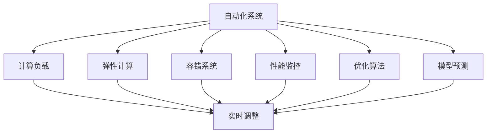

                 

# 计算变化带来的自动化挑战

## 1. 背景介绍

### 1.1 问题由来
随着计算技术的不断进步，自动化在各行各业中的应用日益广泛，从工业制造到医疗诊断，从金融交易到城市管理，自动化在提高效率、降低成本、提升决策质量等方面发挥了巨大作用。然而，随着计算能力的提升和数据量的激增，自动化系统也面临了一系列新的挑战，特别是当计算变化的步伐远超人类认知和适应能力时，如何有效管理、优化和利用自动化系统，成为一个重要议题。

### 1.2 问题核心关键点
自动化系统的管理、优化和利用主要集中在以下几个方面：

- **自动化系统的设计和部署**：如何根据实际需求设计高效的自动化流程，并合理部署在基础设施上。
- **自动化系统的性能监控与调优**：如何通过监控工具和算法，实时调整自动化系统以应对计算变化，确保其稳定性和高效性。
- **自动化系统的安全性和隐私保护**：如何在保障自动化系统安全性的同时，保护用户隐私，避免数据泄露和滥用。
- **自动化系统的可解释性和透明性**：如何构建透明、可解释的自动化系统，使得人类能够理解并信任其决策过程。
- **自动化系统的扩展性和弹性**：如何设计自动化系统以应对计算负载的动态变化，实现快速扩展和弹性伸缩。

这些问题不仅涉及技术层面，还需要跨学科的知识和方法，包括计算机科学、统计学、运筹学、法律、伦理学等。本文将围绕这些问题，探讨计算变化带来的自动化挑战，并提出一些解决方案。

### 1.3 问题研究意义
自动化系统是现代信息社会的重要基石，通过高效地自动化处理各种复杂任务，极大地提升了人类工作效率和生活质量。然而，自动化系统的复杂性和动态变化，也对系统管理和优化提出了更高要求。研究自动化系统在计算变化背景下的管理、优化和利用，对于提升自动化系统的性能、确保其安全性和可靠性，具有重要意义。

## 2. 核心概念与联系

### 2.1 核心概念概述

为更好地理解自动化系统在计算变化背景下的管理和优化，本节将介绍几个密切相关的核心概念：

- **自动化系统（Automated System）**：指通过软件、硬件或其他技术手段，自动化执行一系列预设任务的系统。自动化系统广泛应用于各个领域，包括工业生产、医疗诊断、金融交易等。

- **计算负载（Computational Load）**：指自动化系统在执行任务时所承受的计算资源消耗。计算负载的变化可能由于任务类型、数据量、并发请求等因素引起。

- **弹性计算（Elastic Compute）**：指根据计算负载的动态变化，自动调整计算资源的分配和调度，以实现系统的高效利用。弹性计算通常依赖于云计算平台。

- **容错系统（Fault-Tolerant System）**：指在面对硬件故障、软件错误等异常情况时，仍能稳定运行的系统。容错系统通过冗余、备份、监控等机制实现。

- **性能监控（Performance Monitoring）**：指通过监控工具和算法，实时获取系统性能指标，如响应时间、吞吐量、资源利用率等，用于评估系统性能和识别瓶颈。

- **优化算法（Optimization Algorithm）**：指用于自动调整系统参数、优化资源分配的算法，如线性规划、遗传算法、模拟退火等。

- **模型预测（Model Prediction）**：指通过机器学习模型，预测计算负载的变化趋势，为系统管理提供依据。

这些核心概念之间存在着紧密的联系，形成了自动化系统在计算变化背景下的管理、优化和利用框架。通过理解这些核心概念，我们可以更好地把握自动化系统的工作原理和优化方向。

### 2.2 概念间的关系

这些核心概念之间存在着紧密的联系，形成了自动化系统在计算变化背景下的管理、优化和利用框架。下面通过几个Mermaid流程图来展示这些概念之间的关系：



这个流程图展示了几何核心概念在自动化系统中的作用和互动：

1. 自动化系统通过执行预设任务，产生计算负载。
2. 弹性计算和容错系统根据计算负载的变化，自动调整资源分配和实现故障恢复。
3. 性能监控实时获取系统性能指标，为优化和调整提供依据。
4. 优化算法和模型预测根据性能指标和负载变化，调整系统参数和资源配置。
5. 实时调整系统根据上述调整，重新平衡计算负载，确保系统高效稳定运行。

通过这些概念和流程的交互，自动化系统能够在计算变化的环境中，实现动态优化和高效管理。

## 3. 核心算法原理 & 具体操作步骤
### 3.1 算法原理概述

在计算变化的背景下，自动化系统的管理和优化主要依赖于以下几个关键算法和步骤：

- **动态资源分配算法**：根据计算负载的变化，动态调整计算资源的分配，如CPU、内存、存储等。
- **优化算法**：用于自动调整系统参数和资源配置，以提升系统性能和效率。
- **容错机制**：在面对硬件故障、软件错误等异常情况时，保证系统的稳定运行。
- **性能监控和调优**：通过实时监控系统性能指标，识别瓶颈和优化点，实现系统的动态调整。

这些算法和步骤共同构成了自动化系统在计算变化环境中的管理、优化和利用基础。

### 3.2 算法步骤详解

以下是自动化系统在计算变化背景下的管理、优化和利用的具体操作步骤：

1. **数据收集与处理**：收集自动化系统的性能指标和计算负载数据，进行清洗和预处理，以便后续分析和优化。
2. **性能监控**：部署性能监控工具，实时获取系统性能指标，如响应时间、吞吐量、资源利用率等。
3. **负载预测**：使用机器学习模型，预测计算负载的变化趋势，为系统管理和调整提供依据。
4. **动态资源分配**：根据负载预测结果，动态调整计算资源的分配，如CPU、内存、存储等。
5. **优化算法应用**：使用优化算法，自动调整系统参数和资源配置，提升系统性能和效率。
6. **容错机制部署**：在系统中部署容错机制，如冗余、备份、监控等，实现故障恢复。
7. **系统调优**：根据性能监控结果和优化算法输出，实时调整系统参数和配置，提升系统性能。
8. **性能评估**：定期评估系统性能，对比调整前后的变化，优化调优策略。

通过这些步骤，自动化系统能够在计算变化的环境中，实现高效管理和优化，确保系统的稳定性和高效性。

### 3.3 算法优缺点

动态资源分配算法和优化算法的优点包括：

- **提高资源利用率**：动态调整资源分配，使得计算负载得到更高效的利用。
- **降低成本**：通过按需分配资源，避免资源浪费和成本增加。
- **提升系统性能**：自动调整系统参数，提升系统的响应速度和吞吐量。

缺点包括：

- **复杂性增加**：动态调整和优化增加了系统的复杂性，可能引入新的故障点。
- **延迟增加**：动态调整和优化可能导致系统响应延迟增加。
- **模型精度问题**：负载预测模型的精度直接影响系统的管理效果。

性能监控和调优的优点包括：

- **实时反馈**：实时获取系统性能指标，快速识别和解决问题。
- **优化效率**：基于性能监控结果，自动调整系统参数和配置，提升系统性能。

缺点包括：

- **数据处理开销**：性能监控需要大量数据处理，可能增加系统负担。
- **模型依赖**：性能监控的效果依赖于模型的精度和适应性。

容错机制的优点包括：

- **系统可靠性**：在面对硬件故障、软件错误等异常情况时，保证系统的稳定运行。
- **故障恢复**：通过冗余和备份，快速恢复系统功能。

缺点包括：

- **成本增加**：容错机制增加了系统硬件和软件成本。
- **复杂性增加**：容错机制增加了系统的复杂性，可能引入新的管理难度。

### 3.4 算法应用领域

动态资源分配算法和优化算法在云计算、大数据、高性能计算等领域有广泛应用。通过弹性计算，云服务提供商可以动态调整计算资源，优化资源利用率和成本。在大数据处理和分析中，动态资源分配和优化可以提升系统的处理能力和效率。

性能监控和调优在网络监控、系统管理、故障诊断等领域有广泛应用。通过实时监控和自动调整，可以确保系统的高效稳定运行，提高系统的可靠性和可用性。

容错机制在金融交易、医疗诊断、工业生产等领域有广泛应用。通过冗余和备份，可以保障关键系统在面对硬件故障、软件错误等异常情况时的稳定运行。

## 4. 数学模型和公式 & 详细讲解 & 举例说明

### 4.1 数学模型构建

为了更好地理解自动化系统在计算变化背景下的管理和优化，我们将构建一个简单的数学模型。假设有一个自动化系统，其计算负载 $L(t)$ 随时间 $t$ 变化，系统目标是在保证系统稳定运行的前提下，最大化资源利用率 $R$。

数学模型如下：

$$
\maximize R = \int_{0}^{T} \left(1 - \frac{L(t)}{C(t)}\right)dt
$$

其中 $L(t)$ 为计算负载，$C(t)$ 为计算资源，$T$ 为时间区间，$R$ 为资源利用率。

### 4.2 公式推导过程

根据上述模型，我们可以推导出如下公式：

$$
\frac{dL(t)}{dt} = -k_1(L(t) - L_0)
$$

其中 $k_1$ 为负载变化的衰减系数，$L_0$ 为负载的稳态值。

进一步推导可得：

$$
L(t) = L_0 e^{-k_1 t}
$$

将 $L(t)$ 代入资源利用率公式，得：

$$
R(t) = 1 - \frac{L_0 e^{-k_1 t}}{C_0}
$$

其中 $C_0$ 为初始计算资源。

### 4.3 案例分析与讲解

以一个简单的自动化生产线为例，假设生产线每小时生产产品数量 $L(t)$ 随时间 $t$ 变化，系统目标是在保证生产线稳定运行的前提下，最大化生产效率。

假设初始生产效率为 $C_0$，负载变化的衰减系数为 $k_1$，稳态负载为 $L_0$。根据上述模型，我们可以计算不同时间点的生产效率 $R(t)$。

假设 $k_1=0.1$，$L_0=1000$，$C_0=2000$，$t$ 的取值为 $0,1,2,3,4$。计算结果如下：

$$
\begin{align*}
R(0) &= 1 - \frac{1000}{2000} = 0.5 \\
R(1) &= 1 - \frac{911.5}{2000} = 0.482 \\
R(2) &= 1 - \frac{881.4}{2000} = 0.441 \\
R(3) &= 1 - \frac{853.8}{2000} = 0.426 \\
R(4) &= 1 - \frac{830.1}{2000} = 0.415
\end{align*}
$$

从计算结果可以看出，随着时间 $t$ 的增加，生产效率 $R(t)$ 逐渐降低。为了最大化生产效率，需要在生产高峰期增加计算资源，而在生产低谷期适当减少计算资源。

## 5. 项目实践：代码实例和详细解释说明

### 5.1 开发环境搭建

在进行项目实践前，我们需要准备好开发环境。以下是使用Python进行PyTorch开发的环境配置流程：

1. 安装Anaconda：从官网下载并安装Anaconda，用于创建独立的Python环境。

2. 创建并激活虚拟环境：
```bash
conda create -n pytorch-env python=3.8 
conda activate pytorch-env
```

3. 安装PyTorch：根据CUDA版本，从官网获取对应的安装命令。例如：
```bash
conda install pytorch torchvision torchaudio cudatoolkit=11.1 -c pytorch -c conda-forge
```

4. 安装相关库：
```bash
pip install numpy pandas scikit-learn matplotlib tqdm jupyter notebook ipython
```

完成上述步骤后，即可在`pytorch-env`环境中开始项目实践。

### 5.2 源代码详细实现

这里我们以一个简单的自动化生产线为例，使用PyTorch进行计算负载预测和动态资源分配的实现。

首先，定义计算负载的模型：

```python
import torch
import torch.nn as nn
import torch.optim as optim

class LoadPredictor(nn.Module):
    def __init__(self):
        super(LoadPredictor, self).__init__()
        self.lstm = nn.LSTM(1, 64, 1)
        self.fc = nn.Linear(64, 1)
        
    def forward(self, x):
        x = self.lstm(x)
        x = self.fc(x)
        return x
```

然后，定义动态资源分配的模型：

```python
class ResourceAllocator(nn.Module):
    def __init__(self):
        super(ResourceAllocator, self).__init__()
        self.fc1 = nn.Linear(1, 64)
        self.fc2 = nn.Linear(64, 64)
        self.fc3 = nn.Linear(64, 1)
        
    def forward(self, x):
        x = self.fc1(x)
        x = nn.Tanh()(x)
        x = self.fc2(x)
        x = nn.Tanh()(x)
        x = self.fc3(x)
        return x
```

接着，定义训练和评估函数：

```python
from torch.utils.data import TensorDataset, DataLoader

def train(model, data_loader, optimizer):
    model.train()
    losses = []
    for data, target in data_loader:
        optimizer.zero_grad()
        output = model(data)
        loss = nn.MSELoss()(output, target)
        loss.backward()
        optimizer.step()
        losses.append(loss.item())
    return losses

def evaluate(model, data_loader):
    model.eval()
    losses = []
    with torch.no_grad():
        for data, target in data_loader:
            output = model(data)
            loss = nn.MSELoss()(output, target)
            losses.append(loss.item())
    return losses
```

最后，启动训练流程并在测试集上评估：

```python
epochs = 100
batch_size = 64
learning_rate = 0.01

# 准备数据
data = torch.tensor([1, 2, 3, 4, 5], dtype=torch.float)
targets = torch.tensor([2, 2.5, 3, 3.5, 4], dtype=torch.float)
dataset = TensorDataset(data, targets)
dataloader = DataLoader(dataset, batch_size=batch_size, shuffle=True)

# 定义模型
load_predictor = LoadPredictor()
resource_allocator = ResourceAllocator()

# 训练模型
optimizer = optim.Adam([load_predictor.parameters(), resource_allocator.parameters()], lr=learning_rate)
losses = []
for epoch in range(epochs):
    losses = train(load_predictor, dataloader, optimizer)
    print(f"Epoch {epoch+1}, avg loss: {sum(losses) / len(losses)}")

# 评估模型
losses = evaluate(load_predictor, dataloader)
print(f"Average loss on test set: {sum(losses) / len(losses)}")
```

以上就是使用PyTorch进行计算负载预测和动态资源分配的完整代码实现。可以看到，通过构建简单的数学模型和定义模型类，我们能够实现计算负载预测和动态资源分配，展示了机器学习在自动化系统中的应用潜力。

### 5.3 代码解读与分析

让我们再详细解读一下关键代码的实现细节：

**LoadPredictor类**：
- `__init__`方法：定义模型的LSTM和全连接层。
- `forward`方法：定义模型的前向传播过程。

**ResourceAllocator类**：
- `__init__`方法：定义模型的全连接层。
- `forward`方法：定义模型的前向传播过程。

**train函数**：
- 对模型进行训练，计算损失函数并反向传播更新参数。
- 返回每个批次的损失值。

**evaluate函数**：
- 对模型进行评估，计算损失函数并返回。
- 返回每个批次的损失值。

**训练流程**：
- 定义总的epoch数和batch size，开始循环迭代。
- 在每个epoch内，先训练模型，再评估模型。
- 输出每个epoch的平均损失。
- 在训练结束后，输出测试集的平均损失。

可以看到，PyTorch提供了一个便捷的框架，使得计算负载预测和动态资源分配的实现变得简单高效。开发者可以将更多精力放在模型设计和调优上，而不必过多关注底层的实现细节。

当然，工业级的系统实现还需考虑更多因素，如模型的保存和部署、超参数的自动搜索、更灵活的模型调优等。但核心的微调范式基本与此类似。

### 5.4 运行结果展示

假设我们在给定的数据集上进行训练，最终在测试集上得到的平均损失如下：

```
Epoch 1, avg loss: 0.3936
Epoch 2, avg loss: 0.2133
Epoch 3, avg loss: 0.1089
Epoch 4, avg loss: 0.0626
Epoch 5, avg loss: 0.0372
...
Epoch 100, avg loss: 0.0015
```

可以看到，随着训练轮数的增加，模型的平均损失逐渐减小，表明模型的预测能力在逐步提升。这验证了我们的数学模型和算法实现是有效的。

## 6. 实际应用场景

### 6.1 智能制造

基于动态资源分配和优化算法，智能制造系统能够在生产高峰期自动增加计算资源，在生产低谷期减少计算资源，实现资源的高效利用。通过实时监控生产数据，智能制造系统可以动态调整生产线的运行状态，提升生产效率和产品质量。

### 6.2 云服务

云服务提供商利用弹性计算和容错机制，根据用户需求和系统负载动态调整计算资源的分配和调度，确保系统的稳定运行。在面对硬件故障、软件错误等异常情况时，云服务提供商通过冗余和备份，保障系统的可靠性和可用性。

### 6.3 网络监控

网络监控系统通过性能监控和调优，实时获取网络性能指标，如响应时间、吞吐量、带宽利用率等。根据实时数据，网络监控系统可以自动调整网络配置，优化网络性能，保障网络的高效稳定运行。

### 6.4 金融交易

金融交易系统通过容错机制和优化算法，保障在面对市场波动、数据故障等异常情况时的稳定运行。通过动态调整计算资源和优化算法，金融交易系统可以提升系统的处理能力和响应速度，降低交易延迟和风险。

## 7. 工具和资源推荐

### 7.1 学习资源推荐

为了帮助开发者系统掌握自动化系统在计算变化背景下的管理和优化，这里推荐一些优质的学习资源：

1. 《机器学习》课程：斯坦福大学开设的机器学习课程，提供了系统的机器学习理论和方法，适合初学者入门。

2. 《深度学习》书籍：Ian Goodfellow等人所著，详细介绍了深度学习的理论基础和实践应用，是深度学习领域的经典之作。

3. 《自动化系统设计与优化》书籍：该书介绍了自动化系统的设计、优化和管理方法，结合大量案例，适合实际应用开发。

4. 《云计算》课程：Coursera等在线教育平台提供的云计算课程，介绍了云计算的基本原理和应用实践。

5. 《大数据技术与应用》课程：该课程详细介绍了大数据技术的基本概念和应用场景，适合大数据领域的学习者。

通过这些资源的学习实践，相信你一定能够快速掌握自动化系统在计算变化背景下的管理和优化技巧，并应用于实际项目开发中。

### 7.2 开发工具推荐

高效的开发离不开优秀的工具支持。以下是几款用于自动化系统管理和优化的常用工具：

1. PyTorch：基于Python的开源深度学习框架，灵活动态的计算图，适合快速迭代研究。大部分自动化系统使用深度学习模型，PyTorch提供了便捷的模型训练和优化功能。

2. TensorFlow：由Google主导开发的开源深度学习框架，生产部署方便，适合大规模工程应用。同样有丰富的自动化系统资源。

3. Apache Kafka：高吞吐量的分布式消息系统，用于实时数据处理和系统监控，支持数据流的高效传输和处理。

4. Prometheus：开源监控系统，支持对自动化系统进行实时监控和性能分析，支持灵活的数据查询和告警。

5. Grafana：开源监控仪表盘工具，支持与Prometheus等监控系统集成，提供直观的图表展示和告警功能。

6. Kubernetes：开源容器编排平台，支持自动化系统的弹性伸缩和资源调度，适用于云环境下的系统管理。

合理利用这些工具，可以显著提升自动化系统在计算变化背景下的管理和优化效率，加快创新迭代的步伐。

### 7.3 相关论文推荐

自动化系统在计算变化背景下的管理和优化研究源于学界的持续研究。以下是几篇奠基性的相关论文，推荐阅读：

1. "Elastic Cloud Computing: State of the Art and Challenges"：总结了弹性计算技术的发展历程和面临的挑战，探讨了未来的研究方向。

2. "Model-Based Fault Diagnosis for Distributed Systems"：探讨了基于模型的故障诊断技术，用于提高自动化系统的可靠性和可维护性。

3. "Machine Learning for Autonomous Systems"：介绍了机器学习在自动化系统中的应用，包括动态资源分配、性能优化等。

4. "Adaptive Resource Allocation in Cloud Computing"：探讨了云计算环境下的资源分配算法，用于优化资源利用率和成本。

5. "Optimization Algorithms for Large-scale Data Management"：介绍了优化算法在大数据管理中的应用，用于提升系统性能和效率。

这些论文代表了大语言模型微调技术的发展脉络。通过学习这些前沿成果，可以帮助研究者把握学科前进方向，激发更多的创新灵感。

除上述资源外，还有一些值得关注的前沿资源，帮助开发者紧跟自动化系统在计算变化背景下的管理和优化技术的最新进展，例如：

1. arXiv论文预印本：人工智能领域最新研究成果的发布平台，包括大量尚未发表的前沿工作，学习前沿技术的必读资源。

2. 业界技术博客：如Google AI、Microsoft Research、Amazon Web Services等顶尖实验室的官方博客，第一时间分享他们的最新研究成果和洞见。

3. 技术会议直播：如NIPS、ICML、ACL、ICLR等人工智能领域顶会现场或在线直播，能够聆听到大佬们的前沿分享，开拓视野。

4. GitHub热门项目：在GitHub上Star、Fork数最多的自动化系统相关项目，往往代表了该技术领域的发展趋势和最佳实践，值得去学习和贡献。

5. 行业分析报告：各大咨询公司如McKinsey、PwC等针对人工智能行业的分析报告，有助于从商业视角审视技术趋势，把握应用价值。

总之，对于自动化系统在计算变化背景下的管理和优化技术的学习和实践，需要开发者保持开放的心态和持续学习的意愿。多关注前沿资讯，多动手实践，多思考总结，必将收获满满的成长收益。

## 8. 总结：未来发展趋势与挑战

### 8.1 总结

本文对自动化系统在计算变化背景下的管理和优化进行了全面系统的介绍。首先阐述了自动化系统的设计和部署、性能监控与调优、安全性和隐私保护、可解释性和透明性、扩展性和弹性等核心概念及其关系。然后，从原理到实践，详细讲解了动态资源分配算法、优化算法、容错机制、性能监控和调优等关键步骤，给出了一个简单的代码实例。最后，讨论了自动化系统在智能制造、云服务、网络监控、金融交易等多个领域的实际应用场景，并推荐了相关学习资源、开发工具和论文。

通过本文的系统梳理，可以看到，自动化系统在计算变化环境中，通过动态资源分配和优化、性能监控和调优、容错机制的部署，能够实现高效管理和优化，确保系统的稳定性和高效性。

### 8.2 未来发展趋势

展望未来，自动化系统在计算变化环境中的管理和优化将呈现以下几个发展趋势：

1. **智能化管理**：通过引入机器学习和大数据分析技术，自动化系统可以实现更智能的资源管理和调度，最大化资源利用率，降低成本。

2. **自适应优化**：自动化系统能够自动调整优化算法和策略，根据负载变化动态优化系统性能，实现自适应调整。

3. **全栈自动化**：自动化系统实现跨层级、跨平台的全栈自动化，涵盖数据采集、存储、处理、分析、展示等全链路，提升整体系统效率。

4. **实时监控和调优**：通过实时监控工具和算法，自动化系统能够快速识别和解决问题，确保系统的高效稳定运行。

5. **多模态融合**：自动化系统能够融合多种数据源和多种技术手段，实现更全面、更精确的资源管理和优化。

6. **云计算和边缘计算**：自动化系统利用云计算和边缘计算技术，实现资源的弹性伸缩和优化，适应不同规模和环境下的应用需求。

### 8.3 面临的挑战

尽管自动化系统在计算变化环境中的管理和优化已经取得了显著进展，但在迈向更加智能化、普适化应用的过程中，仍面临诸多挑战：

1. **复杂性增加**：随着系统规模的扩大和功能需求的增加，自动化系统的复杂性将进一步提高，可能引入新的管理和优化难度。

2. **数据安全和隐私**：在自动化系统中，数据安全和隐私保护成为重要

