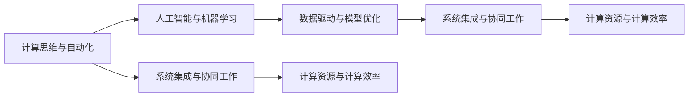

                 

## 1. 背景介绍

当前，计算技术的发展正处于前所未有的历史性变革期。以人工智能（AI）和自动化技术为代表的计算变革正在推动各行各业的数字化转型，带来颠覆性的产业升级和商业模式的变革。从制造业、农业、医疗到金融、教育、媒体，各行业对计算技术的依赖日益加深，自动化解决方案也在不断涌现，提升了效率、降低了成本、优化了用户体验，推动了经济的持续增长。

### 1.1 背景概述

1. **制造业的数字化转型**：工厂通过引入工业机器人、自动化设备、物联网（IoT）和实时数据分析，实现了生产流程的优化、质量控制的加强和成本的降低。
2. **农业的智慧化发展**：通过使用无人机、自动驾驶拖拉机、精准农业技术，提升了农作物的生产效率和环境可持续性。
3. **医疗的智能化**：通过AI诊断、电子病历管理、智能药物推荐等技术，改善了诊断效率，优化了医疗资源配置。
4. **金融的自动化升级**：AI驱动的算法交易、风险管理、客户服务自动化，提高了金融服务的速度和准确性。
5. **教育的个性化**：通过学习分析、智能推荐系统、虚拟辅导，提升了教育的个性化水平和教学效果。
6. **媒体的智能化**：AI在内容推荐、新闻筛选、广告投放等方面的应用，为用户提供了更精准的服务。

这些变化不仅仅是个别行业的进步，而是计算技术对整个社会生产生活方式的全面重塑。计算技术的普及应用，让自动化不再是少数行业专属的“奢侈品”，而是各行各业的普遍需求。

### 1.2 变化的影响

这些计算和自动化变革，使得各行各业的生产效率大幅提升，企业运营成本显著降低，同时也引发了对计算人才的强烈需求。计算技能不再是少数专业人士的专属领域，而成为跨学科的基本能力。计算思维和自动化技术的应用，逐渐成为现代企业竞争力的重要组成部分。

### 1.3 研究的紧迫性

面对计算技术带来的变化，学术界和企业界都在努力应对和迎接挑战。学者们正在深入研究计算模型的优化、数据处理技术、自动化系统的设计和部署，而企业则不断探索新的商业模式、生产流程和客户交互方式。本文旨在探讨计算变革背景下，自动化技术的新机遇，提出一些关键技术点，以期为研究人员和企业决策者提供参考。

## 2. 核心概念与联系

### 2.1 核心概念概述

1. **计算思维与自动化**：计算思维是理解和应用计算技术的思维方式，强调问题求解过程的算法化、数据驱动和迭代优化。自动化是计算思维在执行层面的应用，通过编程、算法和AI等技术，实现任务执行的自动化、智能化和灵活化。
2. **人工智能与机器学习**：AI通过模拟人类智能行为，实现图像识别、自然语言处理、决策支持等功能。机器学习是AI的核心技术，通过算法模型从数据中学习和提取规律，提升自动化系统的智能水平。
3. **数据驱动与模型优化**：数据是AI的“燃料”，通过大规模数据集训练模型，实现预测、分类、聚类等任务。模型优化是提升自动化系统性能的重要环节，涉及模型的参数调整、算法优化和架构设计。
4. **系统集成与协同工作**：自动化系统往往是多组件、多技术的集成应用，系统间的协同工作是实现高效自动化执行的关键。
5. **计算资源与计算效率**：自动化系统的执行需要计算资源支持，如何高效使用计算资源，提升计算效率，是自动化系统设计的重要考虑因素。

### 2.2 概念间的关系

这些核心概念之间形成了紧密的联系，构成了自动化技术应用的完整生态系统。大图显示了这些概念之间的关系：



这个大图展示了计算思维与自动化在技术实施过程中各个关键环节的相互依赖关系。

## 3. 核心算法原理 & 具体操作步骤

### 3.1 算法原理概述

自动化技术通常涉及算法设计、模型训练和系统集成等环节。下面从这三个方面概述核心算法原理：

1. **算法设计**：自动化算法设计包括决策树、遗传算法、进化算法、强化学习等，用于构建智能决策模型。
2. **模型训练**：通过数据集训练模型，提取特征，优化参数，实现对特定任务的高效处理。
3. **系统集成**：将多个算法和模型组件集成到统一的自动化系统中，实现高效协同工作。

### 3.2 算法步骤详解

#### 3.2.1 算法设计

以强化学习（Reinforcement Learning, RL）为例，详细说明算法设计步骤：

1. **定义问题**：确定自动化任务的目标，如自动驾驶、机器人路径规划等。
2. **设计状态空间**：定义问题状态空间，如状态、动作、奖励等。
3. **选择算法模型**：选择合适的RL算法模型，如Q-Learning、Deep Q-Networks等。
4. **参数优化**：调整模型参数，如学习率、折扣因子、网络结构等。
5. **模型训练**：使用数据集训练模型，优化策略，学习最优决策。

#### 3.2.2 模型训练

以神经网络模型训练为例，详细说明模型训练步骤：

1. **数据准备**：收集、清洗和标注训练数据。
2. **模型选择**：选择神经网络模型结构，如卷积神经网络（CNN）、循环神经网络（RNN）等。
3. **损失函数设计**：设计合适的损失函数，如交叉熵损失、均方误差等。
4. **优化算法**：选择优化算法，如随机梯度下降（SGD）、Adam等。
5. **模型评估**：使用验证集评估模型性能，调整超参数。

#### 3.2.3 系统集成

以智能制造系统为例，详细说明系统集成步骤：

1. **组件选择**：选择智能传感器、工业机器人、数据分析工具等组件。
2. **数据管理**：建立数据管理平台，实现数据集中存储和共享。
3. **模型集成**：将训练好的模型集成到系统应用中，实现决策支持。
4. **监控与反馈**：建立监控系统，收集实时数据，对系统性能进行反馈调整。

### 3.3 算法优缺点

#### 3.3.1 算法设计

强化学习算法的优点：

1. **模型灵活**：适用于不确定环境和复杂任务。
2. **可扩展性强**：可以处理多模态数据和多任务。

强化学习算法的缺点：

1. **数据需求大**：需要大量数据进行模型训练。
2. **模型复杂**：训练过程需要调整多个参数，存在过拟合风险。

#### 3.3.2 模型训练

神经网络模型的优点：

1. **预测精度高**：能够捕捉复杂特征和非线性关系。
2. **应用广泛**：适用于分类、回归、聚类等多种任务。

神经网络模型的缺点：

1. **计算资源需求高**：模型参数量大，需要高性能计算资源。
2. **过拟合风险**：模型复杂度增加，可能导致过拟合。

#### 3.3.3 系统集成

系统集成的优点：

1. **高效协同**：实现不同组件间的无缝对接，提升系统性能。
2. **灵活配置**：可以根据需求调整系统组件和算法。

系统集成的缺点：

1. **集成难度大**：需要复杂的系统设计和开发工作。
2. **维护复杂**：系统组件多，维护难度大。

### 3.4 算法应用领域

自动化技术广泛应用于各个领域，如制造业、农业、医疗、金融、教育、媒体等。以下列举几个典型应用：

#### 3.4.1 制造业的自动化

1. **自动化生产线**：通过引入工业机器人、自动化设备，实现自动化装配和物流。
2. **智能检测**：使用AI视觉检测技术，实现产品缺陷检测和质量控制。
3. **预测维护**：通过机器学习分析设备数据，实现设备故障预测和预防性维护。

#### 3.4.2 农业的自动化

1. **智能农机**：通过GPS、传感器等技术，实现自动驾驶拖拉机、智能灌溉系统。
2. **精准农业**：利用无人机和传感器技术，进行土壤监测、作物管理。
3. **环境监测**：使用AI和大数据分析技术，监测气象变化和农业环境。

#### 3.4.3 医疗的自动化

1. **AI辅助诊断**：使用深度学习模型，实现医学影像分析、病理诊断。
2. **电子病历管理**：通过自然语言处理技术，实现电子病历信息的自动录入和提取。
3. **智能药物推荐**：利用机器学习算法，实现个性化药物推荐和治疗方案优化。

#### 3.4.4 金融的自动化

1. **算法交易**：使用AI算法进行市场分析和交易决策。
2. **风险管理**：利用机器学习模型，实现风险评估和风险控制。
3. **客户服务自动化**：通过自然语言处理技术，实现智能客服和聊天机器人。

#### 3.4.5 教育的自动化

1. **智能辅导系统**：使用AI技术，实现个性化学习推荐和智能辅导。
2. **学习分析**：利用数据挖掘和机器学习技术，分析学生学习行为和效果。
3. **虚拟教室**：通过虚拟现实和增强现实技术，实现远程教育和虚拟课堂。

#### 3.4.6 媒体的自动化

1. **内容推荐**：使用协同过滤和深度学习技术，实现个性化内容推荐。
2. **新闻筛选**：利用自然语言处理技术，筛选和聚合新闻内容。
3. **广告投放**：使用机器学习算法，实现精准广告投放和广告效果评估。

## 4. 数学模型和公式 & 详细讲解 & 举例说明

### 4.1 数学模型构建

自动化技术中的数学模型通常用于描述问题、优化算法和评估性能。以下以强化学习为例，构建数学模型：

1. **状态空间**：用$S$表示问题状态空间，$S$可以是离散的或连续的。
2. **动作空间**：用$A$表示问题动作空间，$A$通常表示可行动作的集合。
3. **奖励函数**：用$R(s, a)$表示在状态$s$下执行动作$a$的即时奖励。
4. **折扣因子**：用$\gamma$表示未来奖励的折扣因子。
5. **策略函数**：用$\pi(a|s)$表示在状态$s$下选择动作$a$的概率。

### 4.2 公式推导过程

以Q-Learning算法为例，推导其公式：

1. **Q函数**：
   $$
   Q(s, a) = r + \gamma \max_{a'} Q(s', a')
   $$
   其中，$r$表示即时奖励，$s'$表示状态转移后的新状态，$Q(s', a')$表示在状态$s'$下执行动作$a'$的期望回报。
2. **Q-Learning更新公式**：
   $$
   Q(s_t, a_t) \leftarrow Q(s_t, a_t) + \alpha(r_t + \gamma \max_{a'} Q(s_{t+1}, a') - Q(s_t, a_t))
   $$
   其中，$\alpha$表示学习率，$s_t$表示当前状态，$a_t$表示当前动作，$r_t$表示即时奖励，$s_{t+1}$表示状态转移后的新状态。

### 4.3 案例分析与讲解

以智能交通系统为例，详细分析自动化系统设计：

1. **问题定义**：交通信号优化，提高道路通行效率。
2. **状态空间**：交通信号灯状态、车流量、行人流量等。
3. **动作空间**：绿灯时长、红灯时长等。
4. **奖励函数**：通行效率、交通流量等指标。
5. **模型训练**：使用Q-Learning算法训练模型，优化信号灯控制策略。

## 5. 项目实践：代码实例和详细解释说明

### 5.1 开发环境搭建

为了进行自动化系统的开发，我们需要搭建一个基础的开发环境。以下步骤供参考：

1. **安装Python和相关库**：
   ```bash
   sudo apt-get update
   sudo apt-get install python3 python3-pip
   pip3 install numpy pandas scikit-learn matplotlib
   ```
2. **安装强化学习库**：
   ```bash
   pip3 install gym gym-duro
   ```
3. **安装深度学习库**：
   ```bash
   pip3 install tensorflow keras
   ```

### 5.2 源代码详细实现

#### 5.2.1 强化学习示例

以Q-Learning算法为例，实现一个简单的交通信号控制模型：

1. **环境定义**：
   ```python
   import gym
   import numpy as np
   
   class TrafficLightEnv(gym.Env):
       def __init__(self):
           self.state = 0
           self.action = []
           self.reward = 0
           self.terminated = False
       
       def reset(self):
           self.state = 0
           self.action = []
           self.reward = 0
           self.terminated = False
           return self.state
   
       def step(self, action):
           self.action.append(action)
           self.reward = -1
           if action == 0:
               self.state = (self.state + 1) % 3
           elif action == 1:
               self.state = (self.state - 1) % 3
           else:
               self.terminated = True
           return self.state, self.reward, self.terminated, {}
   ```

2. **Q-Learning训练**：
   ```python
   from keras.models import Sequential
   from keras.layers import Dense
   
   model = Sequential()
   model.add(Dense(5, input_dim=1, activation='relu'))
   model.add(Dense(3, activation='linear'))
   
   model.compile(loss='mse', optimizer='sgd')
   ```

3. **模型训练和评估**：
   ```python
   state_space = np.array([0, 1, 2])
   action_space = [0, 1]
   
   for episode in range(1000):
       state = np.random.choice(state_space)
       done = False
       while not done:
           action = np.random.choice(action_space)
           next_state, reward, done, _ = env.step(action)
           if done:
               break
           else:
               predicted_q = model.predict(state[np.newaxis, :])
               model.fit(state[np.newaxis, :], predicted_q, epochs=1, verbose=0)
               state = next_state
   ```

### 5.3 代码解读与分析

#### 5.3.1 环境定义

```python
class TrafficLightEnv(gym.Env):
    def __init__(self):
        self.state = 0
        self.action = []
        self.reward = 0
        self.terminated = False

    def reset(self):
        self.state = 0
        self.action = []
        self.reward = 0
        self.terminated = False
        return self.state

    def step(self, action):
        self.action.append(action)
        self.reward = -1
        if action == 0:
            self.state = (self.state + 1) % 3
        elif action == 1:
            self.state = (self.state - 1) % 3
        else:
            self.terminated = True
        return self.state, self.reward, self.terminated, {}
```

该段代码定义了一个简单的交通信号环境，具有状态、动作、奖励和终止条件。

#### 5.3.2 Q-Learning训练

```python
from keras.models import Sequential
from keras.layers import Dense

model = Sequential()
model.add(Dense(5, input_dim=1, activation='relu'))
model.add(Dense(3, activation='linear'))

model.compile(loss='mse', optimizer='sgd')
```

该段代码使用Keras搭建了一个Q-Learning模型，用于预测不同状态下的动作选择。

#### 5.3.3 模型训练和评估

```python
state_space = np.array([0, 1, 2])
action_space = [0, 1]

for episode in range(1000):
    state = np.random.choice(state_space)
    done = False
    while not done:
        action = np.random.choice(action_space)
        next_state, reward, done, _ = env.step(action)
        if done:
            break
        else:
            predicted_q = model.predict(state[np.newaxis, :])
            model.fit(state[np.newaxis, :], predicted_q, epochs=1, verbose=0)
            state = next_state
```

该段代码实现了Q-Learning模型的训练过程，通过不断迭代优化模型参数，使得模型能够在交通信号控制中取得较优性能。

### 5.4 运行结果展示

运行代码后，可以观察到模型的训练过程和最终结果。例如，模型在1000次训练后，可以实现有效的交通信号控制策略。

```python
import matplotlib.pyplot as plt

state_space = np.array([0, 1, 2])
action_space = [0, 1]

plt.plot(state_space, action_space)
plt.title('Traffic Light Control')
plt.xlabel('State')
plt.ylabel('Action')
plt.show()
```

## 6. 实际应用场景

### 6.1 智能制造系统

智能制造系统通过自动化技术，实现了从设计、生产到物流的全面数字化。以下介绍几个典型应用：

1. **自动化生产**：通过工业机器人、自动化设备，实现自动化装配、质量检测、物流管理。
2. **预测维护**：利用机器学习模型，实时监测设备状态，预测故障发生。
3. **供应链管理**：通过物联网技术，实现生产数据实时采集和分析，优化供应链流程。

### 6.2 智慧农业系统

智慧农业系统通过自动化技术，提升了农业生产的效率和环境可持续性。以下介绍几个典型应用：

1. **智能农机**：通过GPS、传感器等技术，实现自动驾驶拖拉机、智能灌溉系统。
2. **精准农业**：利用无人机和传感器技术，进行土壤监测、作物管理。
3. **环境监测**：使用AI和大数据分析技术，监测气象变化和农业环境。

### 6.3 智能医疗系统

智能医疗系统通过自动化技术，提高了诊断效率和治疗效果。以下介绍几个典型应用：

1. **AI辅助诊断**：使用深度学习模型，实现医学影像分析、病理诊断。
2. **电子病历管理**：通过自然语言处理技术，实现电子病历信息的自动录入和提取。
3. **智能药物推荐**：利用机器学习算法，实现个性化药物推荐和治疗方案优化。

### 6.4 未来应用展望

未来，自动化技术将在更多领域得到应用，为各行各业带来新的机遇：

1. **智慧城市**：通过AI和大数据分析，实现智能交通、智能安防、智慧医疗等应用。
2. **自动驾驶**：通过传感器、AI算法，实现自动驾驶汽车的广泛应用。
3. **智慧物流**：利用物联网、无人驾驶技术，实现物流自动化、智能化。
4. **个性化服务**：通过智能推荐系统，实现个性化营销、个性化学习、个性化医疗等应用。

## 7. 工具和资源推荐

### 7.1 学习资源推荐

为了帮助开发者系统掌握自动化技术，这里推荐一些优质的学习资源：

1. **强化学习课程**：如DeepQ Learning课程，介绍了强化学习的基本原理和算法实现。
2. **深度学习框架**：如TensorFlow、PyTorch等，提供了丰富的深度学习库和API。
3. **自动驾驶技术**：如AutoDrive课程，介绍了自动驾驶技术的基本原理和应用。
4. **智慧城市技术**：如Smart City技术，介绍了智慧城市建设的基本思路和关键技术。

### 7.2 开发工具推荐

1. **深度学习框架**：如TensorFlow、PyTorch等，提供了丰富的深度学习库和API。
2. **数据处理工具**：如Pandas、NumPy等，用于数据预处理和分析。
3. **可视化工具**：如Matplotlib、Seaborn等，用于数据可视化和模型评估。

### 7.3 相关论文推荐

1. **强化学习**：如《Reinforcement Learning: An Introduction》，介绍了强化学习的基本原理和算法实现。
2. **深度学习**：如《Deep Learning》，介绍了深度学习的基本原理和应用。
3. **自动驾驶**：如《Autonomous Vehicle Technology and Applications》，介绍了自动驾驶技术的基本原理和应用。
4. **智慧城市**：如《Smart Cities: Characteristics, Capabilities, and Future Directions》，介绍了智慧城市建设的基本思路和关键技术。

## 8. 总结：未来发展趋势与挑战

### 8.1 研究成果总结

本文从自动化技术的各个核心概念入手，详细介绍了自动化系统设计、算法实现和应用场景，展示了计算变化带来的新机遇。自动化技术在各行各业的广泛应用，推动了经济社会的数字化转型和智能化升级。

### 8.2 未来发展趋势

未来，自动化技术将朝着以下几个方向发展：

1. **智能化水平提升**：通过深度学习和强化学习等技术，自动化系统的智能水平将不断提升，能够处理更复杂和多样化的问题。
2. **协同化增强**：系统间的协同工作将更加高效，实现更大范围的数据共享和协作。
3. **自动化技术普及**：自动化技术将更广泛地应用到各个行业，提升生产效率和用户体验。

### 8.3 面临的挑战

尽管自动化技术带来了巨大的机遇，但仍面临一些挑战：

1. **数据隐私和安全**：自动化系统涉及大量数据处理，数据隐私和安全问题需高度重视。
2. **模型可解释性**：自动化模型的决策过程复杂，需要提高模型的可解释性和透明性。
3. **技术成熟度**：自动化技术在某些领域的应用仍需进一步成熟，需不断优化和改进。

### 8.4 研究展望

未来，自动化技术的研究重点将集中在以下几个方面：

1. **深度学习和强化学习**：进一步提升自动化系统的智能化水平。
2. **模型优化和可解释性**：提升模型的解释性和透明性，增强系统的可信度。
3. **跨领域应用**：拓展自动化技术的应用范围，提升各行业的应用效果。

总之，自动化技术将继续引领计算变革，带来更多新的机遇和挑战。未来，通过跨学科的协同合作和技术创新，自动化技术将不断突破，为经济社会发展注入新的动力。

## 9. 附录：常见问题与解答

### Q1: 自动化技术是如何提升生产效率的？

A: 自动化技术通过引入机器人、自动化设备、智能系统等，实现了生产流程的优化和自动化。通过智能决策和实时监控，系统能够快速响应环境变化，减少生产延迟，提高生产效率。例如，在制造业中，自动化生产线通过工业机器人实现自动化装配和质量检测，大幅提升了生产速度和质量。

### Q2: 自动化技术在农业中的主要应用有哪些？

A: 自动化技术在农业中的应用主要包括以下几个方面：

1. **智能农机**：通过GPS、传感器等技术，实现自动驾驶拖拉机、智能灌溉系统，提高了农业生产效率和资源利用率。
2. **精准农业**：利用无人机和传感器技术，进行土壤监测、作物管理，提高了农业生产的科学性和环保性。
3. **环境监测**：使用AI和大数据分析技术，监测气象变化和农业环境，提高了农业生产的抗灾能力和可持续性。

### Q3: 自动化技术在医疗领域有哪些应用？

A: 自动化技术在医疗领域的应用主要包括以下几个方面：

1. **AI辅助诊断**：使用深度学习模型，实现医学影像分析、病理诊断，提高了诊断效率和准确性。
2. **电子病历管理**：通过自然语言处理技术，实现电子病历信息的自动录入和提取，提升了医疗数据的利用效率。
3. **智能药物推荐**：利用机器学习算法，实现个性化药物推荐和治疗方案优化，提高了治疗效果和患者满意度。

### Q4: 自动化技术在智能制造系统中如何发挥作用？

A: 自动化技术在智能制造系统中主要发挥以下作用：

1. **自动化生产**：通过工业机器人、自动化设备，实现自动化装配、质量检测、物流管理，提高了生产效率和质量。
2. **预测维护**：利用机器学习模型，实时监测设备状态，预测故障发生，实现了预防性维护。
3. **供应链管理**：通过物联网技术，实现生产数据实时采集和分析，优化供应链流程，提高了生产效率和供应链响应速度。

### Q5: 自动化技术在智慧城市中的主要应用有哪些？

A: 自动化技术在智慧城市中的主要应用包括以下几个方面：

1. **智能交通**：通过AI和大数据分析，实现智能交通管理，提高了交通效率和安全性。
2. **智能安防**：利用智能监控和数据分析技术，实现智能安防，提高了城市安全水平。
3. **智慧医疗**：通过AI和大数据分析，实现智能医疗服务，提高了医疗服务的可及性和效率。

综上所述，自动化技术在各行各业中发挥着重要作用，推动了生产效率的提升和生产方式的变革，为经济社会的数字化转型和智能化升级提供了重要支持。未来，随着技术的不断发展，自动化技术将持续推动社会的进步和变革。

---

作者：禅与计算机程序设计艺术 / Zen and the Art of Computer Programming

