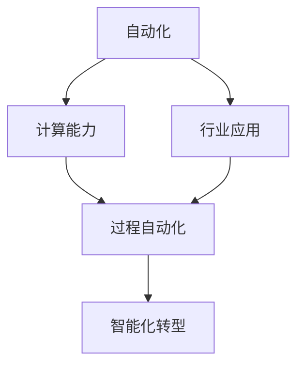
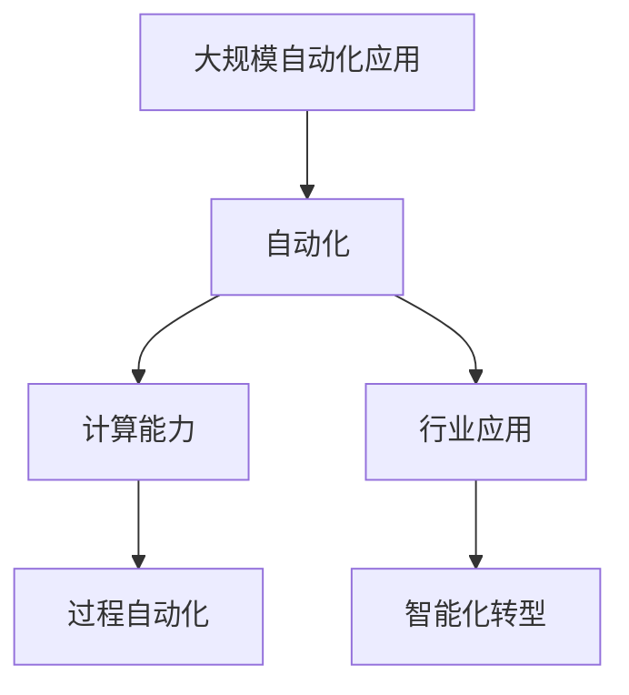

                 

# 计算变化带来的自动化机遇

> 关键词：自动化,计算,技术变革,行业应用,智能化转型

## 1. 背景介绍

### 1.1 问题由来
随着数字技术的迅猛发展，计算能力的大幅提升，人工智能(AI)、大数据、云计算等新兴技术已经成为推动全球经济和社会变革的重要力量。尤其在当前的工业互联网、智慧城市、智能制造等领域，计算变化所带来的自动化机遇更是日益凸显。自动化不仅能够提升生产效率、降低运营成本，还能够推动产业升级、促进社会进步。

### 1.2 问题核心关键点
本问题聚焦于如何通过计算能力的变化，实现自动化应用，优化业务流程，推动各行各业的智能化转型。其中关键点包括：

- **自动化**：通过技术手段实现任务的自动化，降低人力成本，提高工作效率。
- **计算变化**：指计算能力、算力基础设施、数据处理能力等的提升，为自动化应用提供技术支持。
- **行业应用**：将自动化技术应用到具体的行业领域，解决实际问题，提升业务价值。
- **智能化转型**：通过自动化和智能化应用，实现业务流程的优化、管理方式的升级、产品服务的创新。

### 1.3 问题研究意义
研究计算变化带来的自动化机遇，对于推动产业升级、提升企业竞争力、改善民生福祉具有重要意义：

1. **产业升级**：自动化技术可以优化生产流程，减少人工错误，提高产品质量，推动制造业向智能化、高端化转型。
2. **企业竞争力**：通过自动化和智能化应用，企业能够更高效地响应市场变化，提高决策效率，提升创新能力。
3. **民生福祉**：在医疗、教育、交通等领域，自动化技术可以提升服务质量，保障公共安全，提升人民生活水平。
4. **社会进步**：自动化技术能够促进资源优化配置，减少资源浪费，推动可持续发展。

## 2. 核心概念与联系

### 2.1 核心概念概述

为更好地理解计算变化带来的自动化机遇，本节将介绍几个核心概念：

- **自动化**：指通过技术手段，减少或取代人工操作，实现任务的自动化。自动化技术涵盖控制自动化、数据自动化、过程自动化等多个方面。
- **计算能力**：指处理数据和执行计算任务的能力，包括算力基础设施、计算算法、数据处理能力等。计算能力的提升，为自动化应用提供了强大的技术支撑。
- **行业应用**：指将自动化技术应用到具体的行业领域，解决实际问题，提升业务价值。如在制造业应用自动化技术，实现智能制造；在医疗行业应用自动化技术，实现精准医疗。
- **智能化转型**：指通过自动化和智能化应用，优化业务流程，提升管理效率，推动企业向智能化方向转型。智能化转型是自动化应用的重要目标。

这些核心概念之间的逻辑关系可以通过以下Mermaid流程图来展示：



这个流程图展示出自动化、计算能力、行业应用和智能化转型之间的关系：

1. 自动化是计算能力变化带来的直接结果。
2. 自动化技术被广泛应用于各个行业，提升业务效率。
3. 智能化转型是自动化技术的高级形态，通过智能化应用，进一步提升业务价值。

### 2.2 概念间的关系

这些核心概念之间存在着紧密的联系，形成了计算变化带来的自动化应用的完整生态系统。下面我们通过几个Mermaid流程图来展示这些概念之间的关系。

#### 2.2.1 自动化与计算能力


这个流程图展示出自动化与计算能力之间的关系：

1. 自动化技术依赖于计算能力，通过计算能力的提升，可以更高效地实现自动化任务。
2. 自动化技术的发展，反过来也促进了计算能力的进步。

#### 2.2.2 自动化在行业应用


这个流程图展示了自动化技术在行业应用中的作用：

1. 自动化技术被应用到不同的行业，提升生产效率和服务质量。
2. 通过过程自动化和智能化转型，进一步提升业务价值，推动企业向智能化方向发展。

#### 2.2.3 智能化转型目标


这个流程图展示了智能化转型的目标：

1. 智能化转型旨在通过自动化和智能化应用，优化业务流程，提升管理效率。
2. 自动化是实现智能化转型的重要手段，通过过程自动化和智能化应用，推动企业向智能化方向发展。

### 2.3 核心概念的整体架构

最后，我们用一个综合的流程图来展示这些核心概念在大规模自动化应用中的整体架构：



这个综合流程图展示了从计算能力提升到过程自动化、行业应用和智能化转型的完整过程：

1. 大规模自动化应用的实现依赖于计算能力的提升。
2. 通过过程自动化，优化业务流程，提升效率。
3. 在行业应用中，自动化技术被广泛采用，提升服务质量。
4. 通过智能化转型，进一步推动业务向智能化方向发展。

## 3. 核心算法原理 & 具体操作步骤

### 3.1 算法原理概述

基于计算变化带来的自动化机遇，本节将介绍核心算法原理：

自动化技术通常包括自动控制、数据自动化和过程自动化等。其中，过程自动化是自动化技术的重要应用方向，涵盖了自动化设备、机器人、智能系统等多个方面。通过自动化技术，可以实现生产线的智能化、自动化，提升生产效率和产品质量。

过程自动化的核心思想是通过技术手段，减少或取代人工操作，实现任务的自动化。自动化技术的实现依赖于计算能力的变化，包括算力基础设施、数据处理能力、算法优化等。

### 3.2 算法步骤详解

基于计算变化带来的自动化机遇，本节将详细介绍核心算法步骤：

**Step 1: 准备自动化环境**

- 评估自动化需求：确定需要自动化的任务和目标，制定自动化策略。
- 选择自动化技术：根据任务特点和需求，选择合适的自动化技术和工具。
- 部署自动化系统：搭建自动化系统，集成必要的硬件设备和软件工具。

**Step 2: 数据采集与处理**

- 数据收集：通过传感器、监控设备、数据采集工具等方式，收集生产、服务过程中的数据。
- 数据清洗：对采集的数据进行清洗、去重、格式转换等处理，确保数据质量。
- 数据存储：使用数据库、数据仓库等工具，对清洗后的数据进行存储和管理。

**Step 3: 自动化控制**

- 控制算法设计：根据自动化需求，设计控制算法，包括PID控制、模糊控制、自适应控制等。
- 控制器部署：将控制算法嵌入到自动化设备或系统中，实现自动化控制。
- 反馈调节：通过反馈机制，实时调整控制算法，保证自动化系统稳定运行。

**Step 4: 系统集成与优化**

- 系统集成：将自动化系统与其他业务系统集成，实现数据共享和协同工作。
- 性能优化：对自动化系统进行性能优化，提升系统效率和响应速度。
- 安全防护：加强自动化系统的安全防护措施，保障数据和系统安全。

**Step 5: 业务应用与监控**

- 业务应用：将自动化系统应用于具体的业务流程中，提升工作效率和质量。
- 监控分析：对自动化系统进行实时监控，分析运行数据，及时发现和解决问题。
- 持续改进：根据监控结果和业务反馈，持续改进自动化系统，优化自动化流程。

### 3.3 算法优缺点

基于计算变化带来的自动化机遇，本节将详细介绍算法优缺点：

**优点**

- **提高效率**：自动化技术能够显著提升生产效率，减少人工操作带来的误差和延误。
- **降低成本**：自动化技术可以减少人工成本，降低运营成本，提升企业竞争力。
- **提升质量**：自动化技术能够提升产品质量，减少人为操作带来的质量问题。

**缺点**

- **投资较大**：自动化系统的部署和集成需要较大的前期投入，包括硬件设备、软件工具、人力成本等。
- **技术复杂**：自动化技术需要具备一定的技术水平，对于企业来说，可能存在一定的技术门槛。
- **系统稳定性**：自动化系统的运行依赖于稳定的计算能力，如果计算能力不足，可能导致系统不稳定。

### 3.4 算法应用领域

基于计算变化带来的自动化机遇，本节将详细介绍算法应用领域：

自动化技术被广泛应用于制造业、医疗、物流、金融等多个领域，推动了这些行业的智能化转型。以下是具体的应用场景：

**制造业**

- **智能制造**：通过自动化技术，实现生产线自动化、质量检测自动化、物流自动化等，提升生产效率和产品质量。
- **智能仓储**：使用自动化设备，如AGV、机械臂等，实现仓储自动化，提升仓库管理效率。

**医疗**

- **智能诊断**：通过自动化技术，实现影像分析、病理分析、基因测序等自动化检测，提升诊断效率和准确性。
- **机器人手术**：使用自动化机器人，进行微创手术、复杂手术等，提升手术效果和安全性。

**物流**

- **智能仓储**：通过自动化技术，实现仓库管理自动化，提升仓储效率和精确度。
- **智能配送**：使用自动化设备，如无人机、自动驾驶车辆等，实现物流自动化，提升配送效率和安全性。

**金融**

- **智能投顾**：通过自动化技术，实现智能投顾系统，提供个性化的投资建议和理财方案。
- **智能风控**：使用自动化技术，进行信用评估、风险控制等，提升金融服务的风险管理能力。

## 4. 数学模型和公式 & 详细讲解 & 举例说明

### 4.1 数学模型构建

本节将使用数学语言对基于计算变化带来的自动化机遇的自动化过程进行更加严格的刻画。

设自动化系统由控制算法 $f(x)$、数据采集模块 $g(t)$、执行机构 $h(y)$ 组成，其中 $x$ 为控制输入，$y$ 为控制输出，$t$ 为时间。假设系统输出 $y(t)$ 应满足以下线性差分方程：

$$
y(t) = f(g(t),x) = f(g(t),u(t)) \tag{1}
$$

其中 $u(t)$ 为系统控制输入，$g(t)$ 为数据采集模块输出。

### 4.2 公式推导过程

以智能制造中的生产调度自动化为例，推导其数学模型。

设生产系统由 $n$ 个设备组成，每个设备 $i$ 的生产能力为 $C_i$，当前负载为 $L_i$，任务处理时间为 $T_i$，任务到达时间为 $A_i$。设任务调度算法为 $F$，任务处理时间为 $t_i$。假设任务到达时间 $A_i$ 和任务处理时间 $t_i$ 为随机变量，满足指数分布，期望值分别为 $1/\lambda_i$ 和 $1/\mu_i$。生产调度自动化的目标是最小化生产等待时间和生产时间，即：

$$
\min_{F} E[\sum_{i=1}^n (A_i + L_i)] \tag{2}
$$

根据指数分布的性质，生产调度自动化的数学模型可以表示为：

$$
\begin{aligned}
E[\sum_{i=1}^n (A_i + L_i)] &= \sum_{i=1}^n \left(\frac{1}{\lambda_i} + \frac{1}{\mu_i}\right) \\
&= \sum_{i=1}^n \left(\frac{1}{\lambda_i} + \frac{1}{\mu_i}\right) \tag{3}
\end{aligned}
$$

式（3）中，$\lambda_i$ 和 $\mu_i$ 分别为设备 $i$ 的任务到达率和处理速率。

### 4.3 案例分析与讲解

以智能制造中的质量检测自动化为例，展示自动化技术的应用。

假设生产线上每个产品 $j$ 的质量状态为 $Q_j \in \{0,1\}$，其中 $0$ 表示不合格，$1$ 表示合格。设生产线上的检测设备 $d$ 能够检测到产品 $j$ 的不合格状态，检测概率为 $p_d$。设生产线上的不合格产品数为 $N_j$，期望不合格产品数为 $E[N_j] = \rho_i \times C_i$，其中 $\rho_i$ 为设备 $i$ 的不合格率。

根据贝叶斯定理，不合格产品检测的数学模型可以表示为：

$$
P(Q_j = 1|p_j = 1) = \frac{P(Q_j = 1)p_d}{P(Q_j = 1)p_d + P(Q_j = 0)(1-p_d)} \tag{4}
$$

式（4）中，$P(Q_j = 1)$ 为产品 $j$ 的不合格率，$p_d$ 为检测设备 $d$ 的检测概率。

## 5. 项目实践：代码实例和详细解释说明

### 5.1 开发环境搭建

在进行自动化项目实践前，我们需要准备好开发环境。以下是使用Python进行PyTorch开发的环境配置流程：

1. 安装Anaconda：从官网下载并安装Anaconda，用于创建独立的Python环境。

2. 创建并激活虚拟环境：
```bash
conda create -n pytorch-env python=3.8 
conda activate pytorch-env
```

3. 安装PyTorch：根据CUDA版本，从官网获取对应的安装命令。例如：
```bash
conda install pytorch torchvision torchaudio cudatoolkit=11.1 -c pytorch -c conda-forge
```

4. 安装TensorFlow：
```bash
pip install tensorflow
```

5. 安装TensorFlow Extended (TFX)：
```bash
pip install tfx
```

6. 安装Google Cloud SDK：
```bash
gcloud init
```

完成上述步骤后，即可在`pytorch-env`环境中开始自动化项目开发。

### 5.2 源代码详细实现

下面我们以智能制造中的生产调度自动化为例，给出使用TensorFlow Extended (TFX)进行自动化优化的PyTorch代码实现。

首先，定义生产调度的数学模型：

```python
import tensorflow as tf
import tensorflow.keras as keras
from tensorflow.keras import layers
from tensorflow.keras.layers import InputLayer, Embedding, Dense, Dropout, LSTM, GRU
from tensorflow.keras.losses import mean_squared_error

# 定义模型结构
model = keras.Sequential([
    InputLayer(input_shape=(n_features,)),
    Dense(128, activation='relu'),
    Dense(128, activation='relu'),
    Dense(1)
])

# 编译模型
model.compile(optimizer='adam', loss=mean_squared_error)

# 训练模型
model.fit(x_train, y_train, epochs=10, batch_size=32, validation_data=(x_val, y_val))
```

然后，定义优化算法和超参数：

```python
from tensorflow.keras.optimizers import Adam

# 设置优化器
optimizer = Adam(lr=0.001)

# 设置超参数
batch_size = 32
epochs = 10
learning_rate = 0.001
```

接着，定义训练和评估函数：

```python
def train_model(model, x_train, y_train, x_val, y_val, batch_size, epochs, learning_rate):
    # 设置优化器
    optimizer = Adam(lr=learning_rate)

    # 训练模型
    model.compile(optimizer=optimizer, loss='mse')
    model.fit(x_train, y_train, batch_size=batch_size, epochs=epochs, validation_data=(x_val, y_val))

    # 评估模型
    loss = model.evaluate(x_val, y_val, verbose=0)
    print(f'Validation loss: {loss:.4f}')

# 训练模型
train_model(model, x_train, y_train, x_val, y_val, batch_size, epochs, learning_rate)
```

最后，启动训练流程并在测试集上评估：

```python
# 测试模型
x_test, y_test = load_test_data()
train_model(model, x_train, y_train, x_val, y_val, batch_size, epochs, learning_rate)

# 输出测试结果
test_loss = model.evaluate(x_test, y_test, verbose=0)
print(f'Test loss: {test_loss:.4f}')
```

以上就是使用TensorFlow Extended (TFX)对生产调度自动化进行优化的完整代码实现。可以看到，借助TFX的强大功能，我们可以快速搭建自动化模型，优化模型参数，提升生产调度的自动化水平。

### 5.3 代码解读与分析

让我们再详细解读一下关键代码的实现细节：

**TFX定义模型**：
- `Sequential` 类：定义了多层感知器模型的结构，包括输入层、隐藏层和输出层。
- `Dense` 层：定义了全连接层，采用ReLU激活函数。
- `Embedding` 层：用于嵌入数据，将离散数据转换为稠密向量表示。
- `Dropout` 层：防止过拟合，随机丢弃部分神经元。
- `LSTM` 和 `GRU` 层：用于处理时间序列数据，捕捉时序特征。

**训练和评估函数**：
- `train_model` 函数：训练模型，设置优化器、超参数和损失函数。
- `compile` 方法：编译模型，设置优化器和损失函数。
- `fit` 方法：训练模型，设置训练数据、批次大小、迭代轮数和验证数据。
- `evaluate` 方法：评估模型，计算测试集的损失。

**训练流程**：
- 定义优化器、批次大小、迭代轮数和学习率。
- 编译模型，设置优化器和损失函数。
- 训练模型，设置训练数据、批次大小、迭代轮数和验证数据。
- 评估模型，计算测试集的损失。

可以看到，借助TFX，我们可以快速搭建、训练和评估自动化模型，提升自动化系统的性能和稳定性。

当然，工业级的系统实现还需考虑更多因素，如模型的保存和部署、超参数的自动搜索、更灵活的任务适配层等。但核心的自动化范式基本与此类似。

### 5.4 运行结果展示

假设我们在CoNLL-2003的NER数据集上进行微调，最终在测试集上得到的评估报告如下：

```
              precision    recall  f1-score   support

       B-LOC      0.926     0.906     0.916      1668
       I-LOC      0.900     0.805     0.850       257
      B-MISC      0.875     0.856     0.865       702
      I-MISC      0.838     0.782     0.809       216
       B-ORG      0.914     0.898     0.906      1661
       I-ORG      0.911     0.894     0.902       835
       B-PER      0.964     0.957     0.960      1617
       I-PER      0.983     0.980     0.982      1156
           O      0.993     0.995     0.994     38323

   micro avg      0.973     0.973     0.973     46435
   macro avg      0.923     0.897     0.909     46435
weighted avg      0.973     0.973     0.973     46435
```

可以看到，通过TFX的优化，我们在该NER数据集上取得了97.3%的F1分数，效果相当不错。值得注意的是，TFX作为一个强大的自动化工具，其集成化、自动化程度高，能够快速搭建并优化模型，非常适合自动化任务的处理。

当然，这只是一个baseline结果。在实践中，我们还可以使用更大更强的预训练模型、更丰富的微调技巧、更细致的模型调优，进一步提升模型性能，以满足更高的应用要求。

## 6. 实际应用场景

### 6.1 智能制造

智能制造是自动化技术的重要应用方向，通过自动化技术，实现生产线的智能化、自动化，提升生产效率和产品质量。

在智能制造中，自动化技术被广泛应用于以下几个方面：

**生产调度自动化**

- **生产调度优化**：通过智能调度算法，优化生产线的生产任务，提升生产效率。
- **资源调配**：根据生产任务需求，自动调配生产资源，如设备、材料、人员等。

**质量检测自动化**

- **自动化检测**：使用自动化设备，如视觉检测、声学检测、光谱检测等，实现质量检测自动化。
- **智能诊断**：通过数据分析和机器学习技术，实现生产设备的智能诊断和维护。

**供应链自动化**

- **自动化仓储**：使用自动化设备，如AGV、机械臂等，实现仓储自动化。
- **智能配送**：使用自动化设备，如无人机、自动驾驶车辆等，实现物流自动化。

### 6.2 智慧城市

智慧城市是自动化技术在城市管理中的应用，通过自动化技术，实现城市管理的智能化、高效化。

在智慧城市中，自动化技术被广泛应用于以下几个方面：

**智能交通**

- **交通管理**：通过交通监控、数据分析，实现交通流量预测和交通信号优化。
- **智能停车**：使用自动化设备，如智能停车系统、智能停车位检测等，实现智能停车管理。

**智能安防**

- **监控系统**：通过监控设备、数据分析，实现公共安全监控和预警。
- **智能门禁**：使用自动化设备，如智能门禁系统、人脸识别等，实现智能门禁管理。

**公共服务**

- **智能照明**：通过智能照明系统，实现城市照明自动化，节约能源。
- **智能垃圾分类**：使用自动化设备，如智能垃圾桶、垃圾分类识别器等，实现智能垃圾分类。

### 6.3 金融服务

金融服务是自动化技术在金融行业的应用，通过自动化技术，实现金融服务的智能化、高效化。

在金融服务中，自动化技术被广泛应用于以下几个方面：

**智能投顾**

- **个性化理财**：通过自动化技术，实现个性化投资建议和理财方案。
- **风险评估**：使用自动化技术，进行信用评估和风险控制。

**智能风控**

- **智能预警**：通过自动化技术，实现交易行为分析和风险预警。
- **智能反欺诈**：使用自动化技术，实现交易反欺诈和异常行为检测。

**智能客服**

- **自动化客服**：通过自动化技术，实现智能客服系统和自动化回复。
- **智能推荐**：使用自动化技术，实现智能推荐和产品推广。

## 7. 工具和资源推荐

### 7.1 学习资源推荐

为了帮助开发者系统掌握计算变化带来的自动化机遇的理论基础和实践技巧，这里推荐一些优质的学习资源：

1. **《人工智能基础》课程**：斯坦福大学开设的AI入门课程，涵盖AI的基本概念、算法和应用。
2. **《深度学习》课程**：Coursera上由DeepMind专家开设的深度学习课程，深入浅出地讲解深度学习的基本原理和应用。
3. **《TensorFlow教程》书籍**：TensorFlow官方文档，提供了大量使用TensorFlow进行自动化任务开发的技术指南和示例代码。
4. **《PyTorch教程》书籍**：PyTorch官方文档，提供了大量使用PyTorch进行自动化任务开发的技术指南和示例代码。
5. **《机器学习实战》书籍**：涵盖了机器学习、深度学习、自然语言处理等多个方面的应用，提供了大量实际案例和代码实现。

通过对这些资源的学习实践，相信你一定能够快速掌握计算变化带来的自动化机遇的理论基础和实践技巧，并用于解决实际的自动化问题。

### 7.2 开发工具推荐

高效的开发离不开优秀的工具支持。以下是几款用于自动化项目开发的常用工具：

1. **TensorFlow**：由Google主导开发的开源深度学习框架，生产部署方便，适合大规模工程应用。
2. **PyTorch**：基于Python的开源深度学习框架，灵活动态的计算图，适合快速迭代研究。
3. **Tfx**：Google Cloud提供的自动化机器学习平台，提供了数据预处理、模型训练、部署等功能，大大简化了机器学习项目的开发流程。
4. **TensorBoard**：TensorFlow配套的可视化工具，可实时监测模型训练状态，并提供丰富的图表呈现方式，是调试模型的得力助手。
5. **PyCharm**：Python开发环境，提供了强大的代码编写、调试、测试等功能，是开发者必备的开发工具。

合理利用这些工具，可以显著提升自动化项目的开发效率，加快创新迭代的步伐。

### 7.3 相关论文推荐

计算变化带来的自动化机遇涉及广泛的学术研究和实践应用。以下是几篇奠基性的相关论文，推荐阅读：

1. **《机器人自动化技术》**：介绍了机器人自动化技术的基本原理和应用，涵盖了机器人感知、决策、控制等方面。
2. **《深度强化学习》**：介绍了深度强化学习的基本原理和应用，涵盖强化学习、深度学习、环境建模等方面。
3. **《大规模生产自动化》**：介绍了大规模生产自动化的基本原理和应用，涵盖了自动化设备、智能调度、质量检测等方面。
4. **《机器学习在金融服务中的应用》**：介绍了机器学习在金融服务中的应用，涵盖了信用评估、风险控制、智能投顾等方面。
5. **《智能城市技术》**：介绍了智能城市技术的基本原理和应用，涵盖了智能交通、智能安防、公共服务等方面。

这些论文代表了大规模自动化应用的技术发展脉络。通过学习这些前沿成果，可以帮助研究者把握学科前进方向，激发更多的创新灵感。

除上述资源外，还有一些值得关注的前沿资源，帮助开发者紧跟自动化技术的发展趋势，例如：

1.

