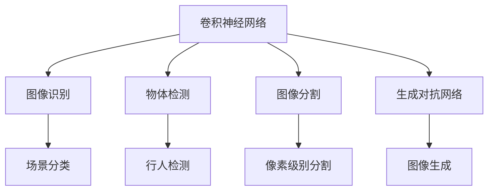
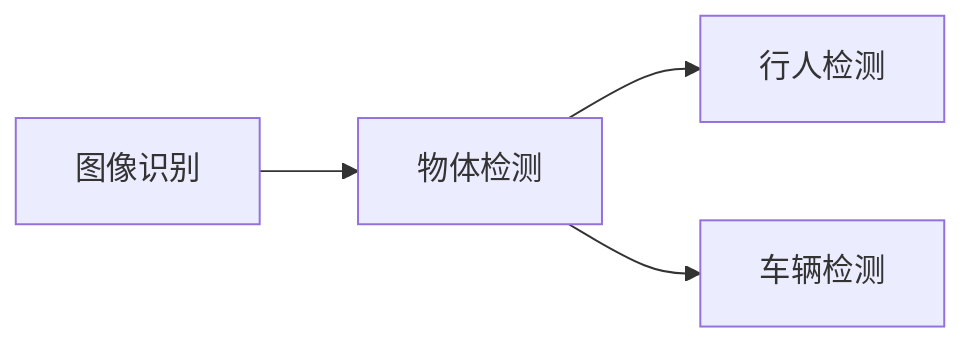
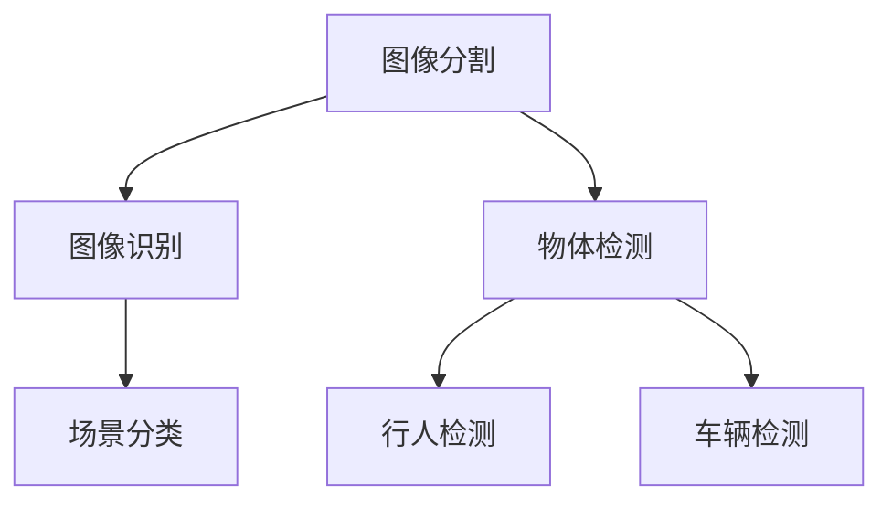
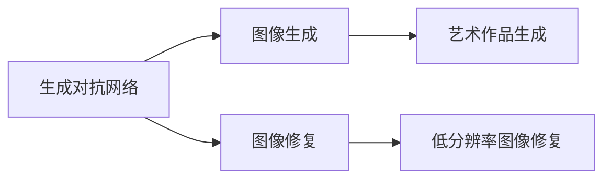
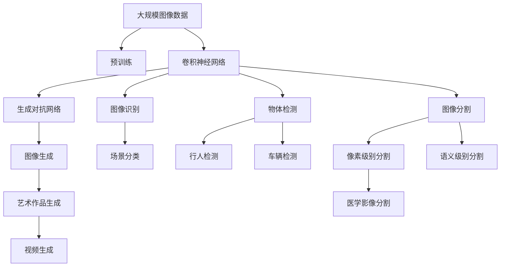

                 

# 计算机视觉(Computer Vision) - 原理与代码实例讲解

> 关键词：计算机视觉,深度学习,卷积神经网络,图像识别,物体检测,图像分割,生成对抗网络

## 1. 背景介绍

### 1.1 问题由来
计算机视觉（Computer Vision, CV）是人工智能领域中一个重要的分支，其目标是通过计算机理解和解释图像、视频等视觉数据，从而实现自动化图像处理、物体识别、场景理解等任务。计算机视觉技术在医疗影像分析、自动驾驶、安防监控、智能零售、智慧城市等多个领域得到了广泛应用。

近年来，随着深度学习技术的发展，计算机视觉领域迎来了迅猛的进步。其中，基于卷积神经网络（Convolutional Neural Network, CNN）的图像识别、物体检测、图像分割等技术，已经在学术界和工业界取得了巨大的突破。然而，这些技术的实现细节和技术细节仍然比较复杂，对开发者来说具有一定的门槛。为了帮助读者更好地理解计算机视觉的原理与实践，本文将详细讲解计算机视觉的核心概念、算法原理和代码实例，并通过具体案例展示其应用效果。

### 1.2 问题核心关键点
计算机视觉技术的核心在于通过深度学习模型对视觉数据进行特征提取和模式识别，从而实现自动化的图像处理和理解。具体来说，计算机视觉主要包括图像识别、物体检测、图像分割等任务，这些任务都需要深度学习模型的强大特征提取能力和模式识别能力。

计算机视觉技术的实现流程包括数据准备、模型构建、模型训练、模型评估和模型部署等步骤。其中，数据准备阶段需要收集、标注和处理训练数据；模型构建阶段需要选择合适的深度学习框架和模型结构；模型训练阶段需要使用训练数据进行模型参数优化；模型评估阶段需要通过验证集和测试集评估模型性能；模型部署阶段需要将训练好的模型集成到实际应用系统中。

计算机视觉技术的研究和应用已经成为人工智能技术的一个重要方向，对推动人工智能技术在各个领域的应用具有重要意义。

## 2. 核心概念与联系

### 2.1 核心概念概述

为更好地理解计算机视觉的原理与实践，本节将介绍几个密切相关的核心概念：

- **卷积神经网络（Convolutional Neural Network, CNN）**：CNN是一种特殊的神经网络结构，主要应用于图像和视频数据的特征提取和模式识别。其核心在于卷积层和池化层的组合，能够自动从图像数据中学习出多层次的特征表示，从而实现图像识别、物体检测等任务。

- **图像识别（Image Recognition）**：图像识别是指计算机通过深度学习模型对图像进行分类，识别出图像中的物体、场景等。常见的图像识别任务包括物体识别、场景分类等。

- **物体检测（Object Detection）**：物体检测是指计算机通过深度学习模型在图像中定位出物体的位置，并识别出物体的类别。常见的物体检测任务包括行人检测、车辆检测等。

- **图像分割（Image Segmentation）**：图像分割是指计算机通过深度学习模型将图像分割成不同的区域，每个区域对应图像中的一个物体或场景。常见的图像分割任务包括像素级别的分割、语义级别的分割等。

- **生成对抗网络（Generative Adversarial Network, GAN）**：GAN是一种能够生成高质量图像和视频的生成模型，通过两个神经网络（生成器和判别器）进行对抗训练，从而生成逼真的图像和视频。GAN技术在图像生成、图像修复等方面具有广泛应用。

这些核心概念之间的逻辑关系可以通过以下Mermaid流程图来展示：



这个流程图展示了卷积神经网络与其他核心概念之间的联系：

1. 卷积神经网络能够自动从图像数据中学习出多层次的特征表示，用于图像识别、物体检测、图像分割等任务。
2. 图像识别是指计算机通过CNN对图像进行分类，识别出图像中的物体、场景等。
3. 物体检测是指计算机通过CNN在图像中定位出物体的位置，并识别出物体的类别。
4. 图像分割是指计算机通过CNN将图像分割成不同的区域，每个区域对应图像中的一个物体或场景。
5. 生成对抗网络是一种能够生成高质量图像和视频的生成模型，可以用于图像生成、图像修复等任务。

### 2.2 概念间的关系

这些核心概念之间存在着紧密的联系，形成了计算机视觉技术的完整生态系统。下面我通过几个Mermaid流程图来展示这些概念之间的关系：

#### 2.2.1 图像识别与物体检测的关系



这个流程图展示了图像识别和物体检测之间的关系。图像识别是指计算机通过CNN对图像进行分类，识别出图像中的物体、场景等。而物体检测则是在图像识别基础上，进一步定位出物体的位置，并识别出物体的类别。

#### 2.2.2 图像分割与图像识别、物体检测的关系



这个流程图展示了图像分割与图像识别、物体检测之间的关系。图像分割是指计算机通过CNN将图像分割成不同的区域，每个区域对应图像中的一个物体或场景。而图像识别和物体检测则是在图像分割基础上，进一步对每个区域进行分类或定位，从而识别出图像中的物体、场景等。

#### 2.2.3 生成对抗网络与其他概念的关系



这个流程图展示了生成对抗网络与其他概念之间的关系。生成对抗网络是一种能够生成高质量图像和视频的生成模型，可以用于图像生成、图像修复等任务。通过生成对抗网络，可以生成逼真的艺术作品、修复低分辨率图像等，从而提升图像处理的精度和效果。

### 2.3 核心概念的整体架构

最后，我们用一个综合的流程图来展示这些核心概念在大模型微调过程中的整体架构：



这个综合流程图展示了从预训练到模型微调，再到图像生成的完整过程。卷积神经网络通过大规模图像数据进行预训练，学习出多层次的特征表示，用于图像识别、物体检测、图像分割等任务。通过微调，卷积神经网络可以在特定任务上进一步优化，提升模型性能。生成对抗网络则通过对抗训练生成高质量的图像和视频，进一步拓展图像处理的应用场景。通过这些核心概念，计算机视觉技术得以在图像处理、物体识别、图像修复等领域大放异彩。

## 3. 核心算法原理 & 具体操作步骤
### 3.1 算法原理概述

计算机视觉技术的核心算法是卷积神经网络（CNN）。CNN通过卷积层和池化层的组合，自动从图像数据中学习出多层次的特征表示，用于图像识别、物体检测、图像分割等任务。CNN的卷积层通过卷积核对输入图像进行卷积操作，提取局部特征，从而实现图像特征的提取。池化层则通过池化操作对卷积层的输出进行降维，减少模型参数，提高模型计算效率。

CNN模型的训练过程通常包括以下几个步骤：

1. **数据准备**：收集、标注和处理训练数据，生成训练集、验证集和测试集。
2. **模型构建**：选择合适的深度学习框架和模型结构，定义CNN模型的层结构。
3. **模型训练**：使用训练集进行模型参数优化，最小化损失函数。
4. **模型评估**：在验证集和测试集上评估模型性能，选择最优模型。
5. **模型部署**：将训练好的模型集成到实际应用系统中，实现图像识别、物体检测、图像分割等任务。

### 3.2 算法步骤详解

以下是使用PyTorch框架构建并训练一个简单的CNN模型进行图像分类的详细步骤：

1. **导入库和数据集**

```python
import torch
import torch.nn as nn
import torch.optim as optim
from torch.utils.data import DataLoader
from torchvision import datasets, transforms

# 定义数据预处理
transform = transforms.Compose([
    transforms.ToTensor(),
    transforms.Normalize((0.5,), (0.5,))
])

# 加载CIFAR-10数据集
train_set = datasets.CIFAR10(root='./data', train=True, download=True, transform=transform)
test_set = datasets.CIFAR10(root='./data', train=False, download=True, transform=transform)

# 分割数据集
train_loader = DataLoader(train_set, batch_size=32, shuffle=True, num_workers=2)
test_loader = DataLoader(test_set, batch_size=32, shuffle=False, num_workers=2)
```

2. **定义CNN模型**

```python
class Net(nn.Module):
    def __init__(self):
        super(Net, self).__init__()
        self.conv1 = nn.Conv2d(3, 6, 5)
        self.pool = nn.MaxPool2d(2, 2)
        self.conv2 = nn.Conv2d(6, 16, 5)
        self.fc1 = nn.Linear(16 * 5 * 5, 120)
        self.fc2 = nn.Linear(120, 84)
        self.fc3 = nn.Linear(84, 10)

    def forward(self, x):
        x = self.pool(F.relu(self.conv1(x)))
        x = self.pool(F.relu(self.conv2(x)))
        x = x.view(-1, 16 * 5 * 5)
        x = F.relu(self.fc1(x))
        x = F.relu(self.fc2(x))
        x = self.fc3(x)
        return x

# 创建模型实例
net = Net()
```

3. **定义损失函数和优化器**

```python
# 定义交叉熵损失函数
criterion = nn.CrossEntropyLoss()

# 定义随机梯度下降优化器
optimizer = optim.SGD(net.parameters(), lr=0.001, momentum=0.9)
```

4. **模型训练**

```python
# 设置迭代轮数
epochs = 2

# 训练模型
for epoch in range(epochs):
    running_loss = 0.0
    for i, data in enumerate(train_loader, 0):
        # 获取输入和标签
        inputs, labels = data

        # 零梯度清零
        optimizer.zero_grad()

        # 前向传播，计算损失函数
        outputs = net(inputs)
        loss = criterion(outputs, labels)
        loss.backward()
        optimizer.step()

        # 统计训练损失
        running_loss += loss.item()
        if i % 2000 == 1999:  # 每2000个小批量数据，打印一次训练损失
            print('[%d, %5d] loss: %.3f' % (epoch + 1, i + 1, running_loss / 2000))
            running_loss = 0.0
```

5. **模型评估**

```python
# 设置测试集迭代轮数
test_epochs = 1

# 评估模型
correct = 0
total = 0
with torch.no_grad():
    for data in test_loader:
        # 获取输入和标签
        images, labels = data

        # 前向传播，得到输出
        outputs = net(images)

        # 计算预测结果
        _, predicted = torch.max(outputs.data, 1)
        total += labels.size(0)
        correct += (predicted == labels).sum().item()

print('Accuracy of the network on the test images: %d %%' % (100 * correct / total))
```

### 3.3 算法优缺点

卷积神经网络（CNN）作为一种经典的计算机视觉算法，具有以下优点：

1. **参数共享**：CNN的卷积层可以通过共享参数减少模型参数数量，降低模型过拟合的风险。
2. **局部连接**：CNN的卷积层通过局部连接的方式提取图像的局部特征，可以自动学习出多层次的特征表示。
3. **平移不变性**：CNN的卷积层具有平移不变性，能够对图像进行平移、旋转等操作，保持模型性能的稳定性。

然而，卷积神经网络也存在一些缺点：

1. **模型复杂**：CNN的卷积层和池化层较多，模型结构复杂，需要较长的训练时间和较大的计算资源。
2. **参数较多**：CNN的模型参数较多，容易发生过拟合的风险。
3. **数据依赖**：CNN的性能很大程度上依赖于训练数据的数量和质量，需要大量的标注数据进行训练。

尽管存在这些缺点，卷积神经网络仍然是计算机视觉领域中最常用的算法之一，具有广泛的应用前景。

### 3.4 算法应用领域

卷积神经网络（CNN）在计算机视觉领域有着广泛的应用，具体包括以下几个方面：

1. **图像分类**：CNN可以自动从图像数据中学习出多层次的特征表示，用于图像分类任务，识别出图像中的物体、场景等。
2. **物体检测**：CNN可以定位出图像中物体的位置，并识别出物体的类别，用于行人检测、车辆检测等任务。
3. **图像分割**：CNN可以将图像分割成不同的区域，每个区域对应图像中的一个物体或场景，用于像素级别分割、语义级别分割等任务。
4. **图像生成**：CNN可以生成高质量的图像和视频，用于图像修复、艺术作品生成等任务。
5. **目标跟踪**：CNN可以自动从视频序列中学习出物体的运动轨迹，用于目标跟踪任务。

除了上述这些经典应用外，卷积神经网络还可以应用于视频分析、三维重建、医学影像分析等领域，为计算机视觉技术的发展提供了广阔的应用场景。

## 4. 数学模型和公式 & 详细讲解  
### 4.1 数学模型构建

本节将使用数学语言对卷积神经网络（CNN）的原理进行更加严格的刻画。

记输入图像为 $\mathbf{x} \in \mathbb{R}^{C \times H \times W}$，其中 $C$ 为通道数，$H$ 和 $W$ 分别为图像的高度和宽度。记卷积核为 $\mathbf{k} \in \mathbb{R}^{K \times K \times C \times O}$，其中 $K$ 为卷积核大小，$O$ 为输出通道数。

卷积神经网络通过卷积操作从输入图像中提取局部特征，定义卷积操作为：

$$
\mathbf{y} = \mathbf{X} * \mathbf{K}
$$

其中 $\mathbf{X} \in \mathbb{R}^{C \times H \times W}$ 为输入图像，$\mathbf{K} \in \mathbb{R}^{C \times K \times K}$ 为卷积核，$\mathbf{y} \in \mathbb{R}^{O \times (H-K+1) \times (W-K+1)}$ 为输出特征图。

卷积操作的具体实现可以通过卷积核在输入图像上滑动计算得到。对于每个位置 $(i,j)$，卷积操作的计算公式为：

$$
y_{i,j} = \sum_{c=0}^{C-1} \sum_{m=0}^{K-1} \sum_{n=0}^{K-1} x_{i+m,j+n,c} \cdot k_{m,n,c,o}
$$

其中 $x_{i+m,j+n,c}$ 表示输入图像在位置 $(i+m,j+n)$ 的通道 $c$ 的像素值，$k_{m,n,c,o}$ 表示卷积核在通道 $c$ 的 $m$ 行、$n$ 列的像素值，$o$ 表示输出通道的索引。

### 4.2 公式推导过程

以下我们以一个简单的卷积神经网络为例，推导其前向传播过程的计算公式。

记卷积神经网络的第一层卷积层和池化层的输出特征图分别为 $\mathbf{X}_1$ 和 $\mathbf{Y}_1$，第一层卷积层的输入为 $\mathbf{X}$，第一层卷积层的卷积核为 $\mathbf{K}$，池化核为 $\mathbf{P}$，池化步长为 $s$，池化大小为 $k$，激活函数为 $\sigma$。则第一层卷积层的前向传播计算公式为：

$$
\mathbf{X}_1 = \sigma(\mathbf{X} * \mathbf{K})
$$

第一层池化层的前向传播计算公式为：

$$
\mathbf{Y}_1 = \text{MaxPooling}_\sigma(\mathbf{X}_1, \mathbf{P}, s, k)
$$

其中，$\text{MaxPooling}_\sigma(\cdot)$ 表示对输入特征图 $\mathbf{X}_1$ 进行池化操作，具体实现方式为对特征图 $\mathbf{X}_1$ 的每个位置 $(i,j)$，计算其最大值 $y_{i,j} = \max\{x_{i,j,m}\}_{m=0}^{k-1}$。

假设第二层卷积层和池化层的输出特征图分别为 $\mathbf{X}_2$ 和 $\mathbf{Y}_2$，第二层卷积层的输入为 $\mathbf{X}_1$，第二层卷积层的卷积核为 $\mathbf{K}_2$，池化核为 $\mathbf{P}_2$，池化步长为 $s_2$，池化大小为 $k_2$。则第二层卷积层的前向传播计算公式为：

$$
\mathbf{X}_2 = \sigma(\mathbf{X}_1 * \mathbf{K}_2)
$$

第二层池化层的前向传播计算公式为：

$$
\mathbf{Y}_2 = \text{MaxPooling}_\sigma(\mathbf{X}_2, \mathbf{P}_2, s_2, k_2)
$$

通过多层的卷积和池化操作，卷积神经网络可以自动从输入图像中学习出多层次的特征表示，从而实现图像识别、物体检测、图像分割等任务。

### 4.3 案例分析与讲解

这里以一个简单的图像分类任务为例，展示CNN模型的具体应用。

假设我们使用CIFAR-10数据集进行图像分类，定义CNN模型的层结构如下：

```python
class Net(nn.Module):
    def __init__(self):
        super(Net, self).__init__()
        self.conv1 = nn.Conv2d(3, 6, 5)
        self.pool = nn.MaxPool2d(2, 2)
        self.conv2 = nn.Conv2d(6, 16, 5)
        self.fc1 = nn.Linear(16 * 5 * 5, 120)
        self.fc2 = nn.Linear(120, 84)
        self.fc3 = nn.Linear(84, 10)

    def forward(self, x):
        x = self.pool(F.relu(self.conv1(x)))
        x = self.pool(F.relu(self.conv2(x)))
        x = x.view(-1, 16 * 5 * 5)
        x = F.relu(self.fc1(x))
        x = F.relu(self.fc2(x))
        x = self.fc3(x)
        return x
```

在训练过程中，我们可以使用交叉熵损失函数进行模型优化：

```python
criterion = nn.CrossEntropyLoss()

optimizer = optim.SGD(net.parameters(), lr=0.001, momentum=0.9)
```

通过多轮迭代训练，我们可以得到训练好的CNN模型，并使用测试集对其性能进行评估：

```python
correct = 0
total = 0
with torch.no_grad():
    for data in test_loader:
        # 获取输入和标签
        images, labels = data

        # 前向传播，得到输出
        outputs = net(images)

        # 计算预测结果
        _, predicted = torch.max(outputs.data, 1)
        total += labels.size(0)
        correct += (predicted == labels).sum().item()

print('Accuracy of the network on the test images: %d %%' % (100 * correct / total))
```

通过训练好的CNN模型，我们可以对新的图像进行分类预测：

```python
# 测试模型
class TestNet(nn.Module):
    def __init__(self):
        super(TestNet, self).__init__()
        self.conv1 = nn.Conv2d(3, 6, 5)
        self.pool = nn.MaxPool2d(2, 2)
        self.conv2 = nn.Conv2d(6, 16, 5)
        self.fc1 = nn.Linear(16 * 5 * 5, 120)
        self.fc2 = nn.Linear(120, 84)
        self.fc3 = nn.Linear(84, 10)

    def forward(self, x):
        x = self.pool(F.relu(self.conv1(x)))
        x = self.pool(F.relu(self.conv2(x)))
        x = x.view(-1, 16 * 5 * 5)
        x = F.relu(self.fc1(x))
        x = F.relu(self.fc2(x))
        x = self.fc3(x)
        return x

test_net = TestNet()
test_net.load_state_dict(net.state_dict())

# 对新的图像进行分类预测
test_image = Image.open('test_image.jpg')
transform = transforms.Compose([
    transforms.ToTensor(),
    transforms.Normalize((0.5,), (0.5,))
])
test_image = transform(test_image).unsqueeze(0)

with torch.no_grad():
    outputs = test_net(test_image)
    _, predicted = torch.max(outputs.data, 1)
    print('Predicted class: %d' % predicted.item())
```

通过以上案例，我们可以看到，卷积神经网络可以自动从图像数据中学习出多层次的特征表示，从而实现图像分类、物体检测、图像分割等任务。

## 5. 项目实践：代码实例和详细解释说明
### 5.1 开发环境搭建

在进行CNN模型开发前，我们需要准备好开发环境。以下是使用Python进行PyTorch开发的环境配置流程：

1. 安装Anaconda：从官网下载并安装Anaconda，用于创建独立的Python环境。

2. 创建并激活虚拟环境：
```bash
conda create -n pytorch-env python=3.8 
conda activate pytorch-env
```

3. 安装PyTorch：根据CUDA版本，从官网获取对应的安装命令。例如：
```bash
conda install pytorch torchvision torchaudio cudatoolkit=11.1 -c pytorch -c conda-forge
```

4. 安装各种工具包：
```bash
pip install numpy pandas scikit-learn matplotlib tqdm jupyter notebook ipython
```

完成上述步骤后，即可在`pytorch-env`环境中开始CNN模型的开发。

### 5.2 源代码详细实现

这里以CIFAR-10图像分类任务为例，给出使用PyTorch框架构建并训练一个简单的CNN模型的具体代码实现。

首先，定义CNN模型的层结构：

```python
class Net(nn.Module):
    def __init__(self):
        super(Net, self).__init__()
        self.conv1 = nn.Conv2d(3, 6, 5)
        self.pool = nn.MaxPool2d(2, 2)
        self.conv2 = nn.Conv2d(6, 16, 5)
        self.fc1 = nn.Linear(16 * 5 * 5, 120)
        self.fc2 = nn.Linear(120, 84)
        self.fc3 = nn.Linear(84, 10)

    def forward(self, x):
        x = self.pool(F.relu(self.conv1(x)))
        x = self.pool(F.relu(self.conv2(x)))
        x = x.view(-1, 16 * 5 * 5)
        x = F.relu(self.fc1(x))
        x = F.relu(self.fc2(x))
        x = self.fc3(x)
        return x
```

然后，定义损失函数和优化器：

```python
# 定义交叉熵损失函数
criterion = nn.CrossEntropyLoss()

# 定义随机梯度下降优化器
optimizer = optim.SGD(net.parameters(), lr=0.001, momentum=0.9)
```

接着，定义训练和评估函数：

```python
def train_epoch(net, loader, criterion, optimizer):
    net.train()
    running_loss = 0.0
    for i, data in enumerate(loader, 0):
        # 获取输入和标签
        inputs, labels = data

        # 前向传播，计算损失函数
        outputs = net(inputs)
        loss = criterion(outputs, labels)

        # 反向传播，更新模型参数
        optimizer.zero_grad()
        loss.backward()
        optimizer.step()

        # 统计训练损失
        running_loss += loss.item()
        if i % 2000 == 1999:
            print('[%d, %5d] loss: %.3f' % (epoch

