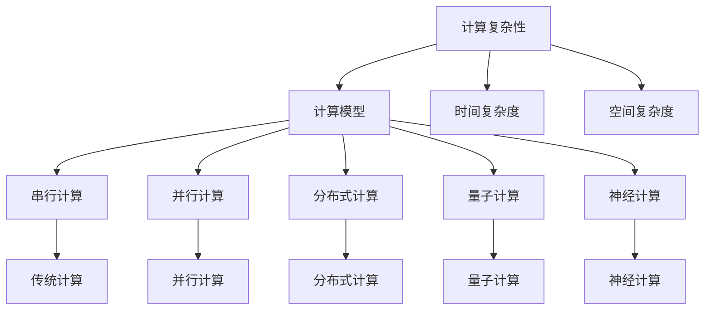
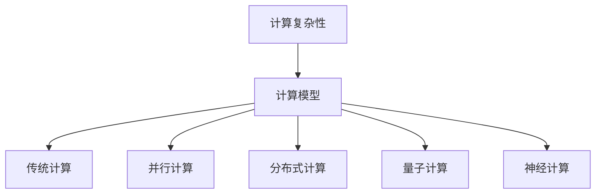
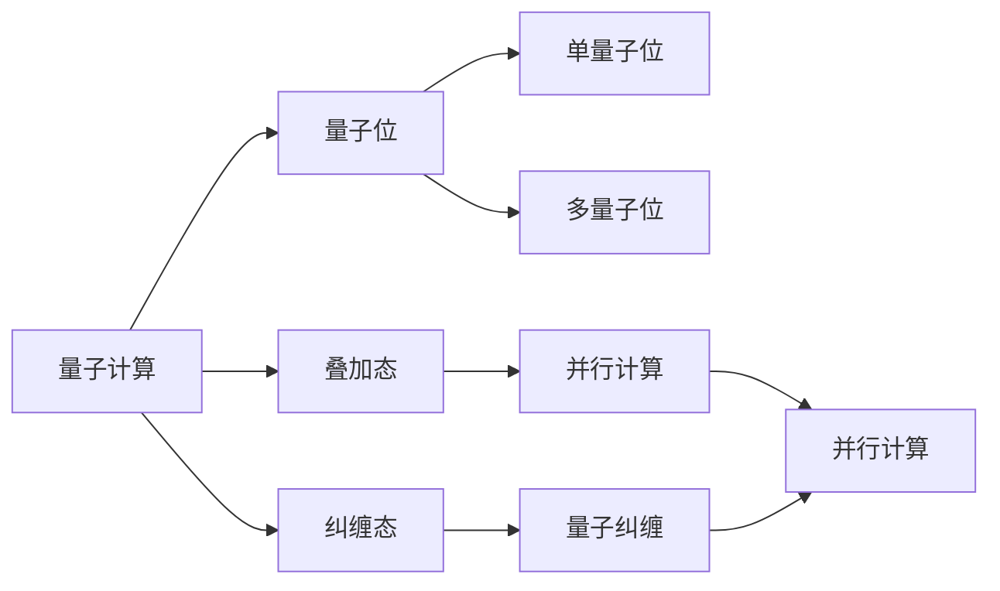
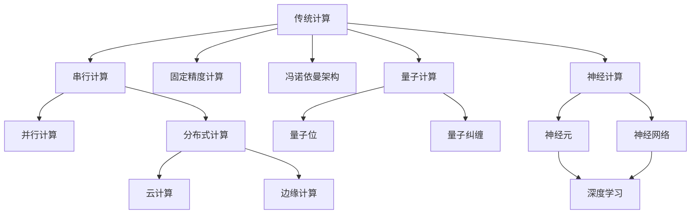

                 

# 计算的本质变化与未来趋势

> 关键词：计算复杂性,计算本质,未来趋势,量子计算,计算范式,计算模型

## 1. 背景介绍

### 1.1 问题由来

随着科技的进步和信息时代的到来，计算已经渗透到人类生活的方方面面。从早期的机械计算到如今的数字计算，计算技术经历了巨大的变革。在过去的几十年里，计算机体系结构、算法和编程语言等各个方面都发生了深刻的变化。尽管计算能力不断提升，但计算的本质并未发生根本变化。然而，随着量子计算、神经计算等新兴技术的崛起，计算的本质正在经历一次历史性的转变。

### 1.2 问题核心关键点

计算的本质，在于如何高效、准确地处理和分析数据，以及如何通过算法将数据转化为有用的信息。传统计算范式基于冯诺依曼架构，采用串行计算和固定精度计算，计算能力受限于存储器和CPU。而新兴计算范式，如量子计算、神经计算等，通过引入不同的物理体系和计算模型，挑战和突破了传统计算的局限，有望在计算速度和计算能力上实现质的飞跃。

### 1.3 问题研究意义

研究计算的本质变化与未来趋势，对于把握计算技术的发展方向，推动科技产业的变革，具有重要的理论意义和实践价值：

1. 理论意义：通过深入理解计算的本质，可以更好地指导未来的研究和创新，为计算技术的突破提供理论支撑。
2. 实践价值：预测未来计算技术的发展趋势，有助于科技公司和研究人员提前布局，抢占未来市场。
3. 社会影响：计算技术的进步将推动社会各领域的数字化转型，提高生产效率，改善生活质量。

## 2. 核心概念与联系

### 2.1 核心概念概述

为更好地理解计算本质及其变化，本节将介绍几个关键概念：

- **计算复杂性**：描述计算任务难度的一种度量，通常用时间复杂度、空间复杂度等来表示。
- **计算模型**：指计算过程中使用的数学模型和算法，如串行计算、并行计算、分布式计算等。
- **量子计算**：利用量子力学的叠加、纠缠等特性，进行并行计算的计算模型。
- **神经计算**：模仿人类神经元系统的计算模型，通过模拟神经元间的连接和激活函数实现计算。
- **计算范式**：指一种计算模型和算法的组合，如传统计算、量子计算、神经计算等。

这些核心概念之间的关系可以用以下Mermaid流程图来展示：



这个流程图展示了一组关键概念及其关系：

- 计算复杂性与计算模型紧密相关。
- 计算模型包括传统计算、并行计算、分布式计算、量子计算和神经计算等。
- 不同计算模型有不同的计算范式，如图中的传统计算、并行计算等。

### 2.2 概念间的关系

这些核心概念之间存在着紧密的联系，构成了计算技术的完整生态系统。下面我们通过几个Mermaid流程图来展示这些概念之间的关系。

#### 2.2.1 计算复杂性与计算模型的关系



这个流程图展示了计算复杂性与不同计算模型之间的关系。不同类型的计算模型对计算复杂性有不同的处理能力。

#### 2.2.2 量子计算与神经计算的区别



这个流程图展示了量子计算与神经计算的区别。量子计算通过量子位的叠加和纠缠实现并行计算，而神经计算通过神经元间的连接和激活函数实现计算。

#### 2.2.3 计算范式的发展演变



这个流程图展示了计算范式的发展演变。从传统的串行计算和固定精度计算，到并行计算、分布式计算、量子计算和神经计算，每一种计算范式都在不断突破计算能力的局限。

## 3. 核心算法原理 & 具体操作步骤

### 3.1 算法原理概述

计算的本质是通过算法将输入数据转化为有用的输出信息。不同类型的计算范式采用不同的算法模型，其计算原理也不同。下面将介绍几种典型的计算模型及其算法原理。

#### 3.1.1 传统计算

传统计算基于冯诺依曼架构，采用串行计算和固定精度计算。其算法模型主要包括：

- 串行算法：通过串行执行指令，逐个处理输入数据，如排序、查找等基本操作。
- 固定精度算法：使用有限的数字位数表示数值，如浮点数、整数等。

传统计算的算法原理相对简单，易于理解和实现，但其计算速度和计算能力受限于存储器和CPU。

#### 3.1.2 并行计算

并行计算通过多台计算机或多个处理器同时执行任务，加速计算过程。其算法模型主要包括：

- 并行算法：通过将任务分解为多个子任务，并行执行，提高计算速度，如MapReduce。
- 分布式算法：通过将计算任务分布在多台计算机上，协同完成计算，如Hadoop。

并行计算的算法原理复杂，需要设计和优化并行化策略，但其计算速度和计算能力大大提升。

#### 3.1.3 量子计算

量子计算利用量子力学的叠加和纠缠特性，进行并行计算。其算法模型主要包括：

- 量子算法：通过量子位实现并行计算，如Shor算法、Grover算法等。
- 量子纠错算法：通过量子纠缠和量子逻辑门实现错误检测和纠错，如表面码算法。

量子计算的算法原理复杂，需要设计和优化量子位和量子逻辑门，但其计算速度和计算能力有望实现质的飞跃。

#### 3.1.4 神经计算

神经计算通过模拟人类神经元系统的计算模型，实现计算。其算法模型主要包括：

- 神经元模型：通过模拟神经元的激活函数和连接关系，进行计算，如Sigmoid函数、ReLU函数等。
- 神经网络模型：通过多层神经元模型的组合，实现复杂的计算任务，如深度学习模型。

神经计算的算法原理复杂，需要设计和优化神经元和神经网络的参数，但其计算速度和计算能力逐步提升。

### 3.2 算法步骤详解

下面是几种典型计算模型的算法详细步骤：

#### 3.2.1 传统计算算法

```
1. 输入数据
2. 预处理数据
3. 执行串行算法
4. 输出结果
```

#### 3.2.2 并行计算算法

```
1. 输入数据
2. 将任务分解为多个子任务
3. 并行执行子任务
4. 合并子任务结果
5. 输出结果
```

#### 3.2.3 量子计算算法

```
1. 输入数据
2. 创建量子位
3. 执行量子逻辑门
4. 测量量子位
5. 输出结果
```

#### 3.2.4 神经计算算法

```
1. 输入数据
2. 构建神经网络
3. 前向传播计算
4. 反向传播计算
5. 更新网络参数
6. 输出结果
```

### 3.3 算法优缺点

不同计算模型的算法各有优缺点，如表所示：

| 计算模型 | 优点 | 缺点 |
| --- | --- | --- |
| 传统计算 | 算法简单，易于实现 | 计算速度慢，计算能力有限 |
| 并行计算 | 计算速度快，计算能力强 | 算法复杂，并行化难度大 |
| 量子计算 | 计算速度极快，计算能力无限 | 算法复杂，实现难度大 |
| 神经计算 | 计算能力强大，适用于复杂任务 | 算法复杂，模型训练耗时长 |

### 3.4 算法应用领域

不同计算模型的算法应用领域各不相同，如图表所示：

```
| 计算模型 | 应用领域 |
| --- | --- |
| 传统计算 | 基础数学、科学计算 |
| 并行计算 | 大数据处理、分布式系统 |
| 量子计算 | 密码学、量子化学 |
| 神经计算 | 人工智能、深度学习 |
```

## 4. 数学模型和公式 & 详细讲解 & 举例说明

### 4.1 数学模型构建

下面以神经计算中的深度学习为例，介绍数学模型的构建过程。

假设有一组输入数据 $x_1, x_2, ..., x_n$，每个输入数据 $x_i$ 包含多个特征 $f_1, f_2, ..., f_m$。深度学习模型由多个神经网络层组成，每个层由多个神经元 $n_1, n_2, ..., n_l$ 构成，每个神经元有一个激活函数 $g(z)$。模型的前向传播过程如下：

$$
h_1 = g(W_1x_1 + b_1)
$$
$$
h_2 = g(W_2h_1 + b_2)
$$
$$
...
$$
$$
h_l = g(W_lh_{l-1} + b_l)
$$

其中，$W$ 为权重矩阵，$b$ 为偏置向量，$g$ 为激活函数。

### 4.2 公式推导过程

以sigmoid函数为例，推导其导数：

$$
\frac{\partial g(z)}{\partial z} = g(z)(1-g(z))
$$

将上式代入神经网络的前向传播公式中，得到：

$$
\frac{\partial h_l}{\partial z_{l-1}} = W_lg(W_lh_{l-1} + b_l)(1-g(W_lh_{l-1} + b_l))
$$

通过反向传播算法，可以求得权重矩阵和偏置向量的梯度，并用于更新模型参数。

### 4.3 案例分析与讲解

以手写数字识别为例，使用深度学习模型进行训练。数据集包含60000张28x28的灰度图像和对应的数字标签。模型采用3个卷积层和3个全连接层，每个卷积层后接一个池化层，输出为10个神经元（对应10个数字类别），使用softmax函数作为输出层的激活函数。训练数据集分批次输入模型，前向传播计算损失函数，反向传播更新模型参数。在测试集上评估模型性能，取得较高的准确率。

## 5. 项目实践：代码实例和详细解释说明

### 5.1 开发环境搭建

在进行深度学习模型开发前，需要先准备好开发环境。以下是使用Python进行TensorFlow开发的环境配置流程：

1. 安装Anaconda：从官网下载并安装Anaconda，用于创建独立的Python环境。

2. 创建并激活虚拟环境：
```bash
conda create -n tf-env python=3.8 
conda activate tf-env
```

3. 安装TensorFlow：从官网获取对应的安装命令。例如：
```bash
conda install tensorflow-gpu -c conda-forge
```

4. 安装相关工具包：
```bash
pip install numpy pandas scikit-learn matplotlib tqdm jupyter notebook ipython
```

完成上述步骤后，即可在`tf-env`环境中开始深度学习模型的开发。

### 5.2 源代码详细实现

这里我们以手写数字识别为例，使用TensorFlow对卷积神经网络进行训练。

首先，定义数据处理函数：

```python
import tensorflow as tf
from tensorflow.keras.datasets import mnist
from tensorflow.keras.utils import to_categorical

(x_train, y_train), (x_test, y_test) = mnist.load_data()
x_train = x_train.reshape(-1, 28, 28, 1)
x_test = x_test.reshape(-1, 28, 28, 1)
y_train = to_categorical(y_train, num_classes=10)
y_test = to_categorical(y_test, num_classes=10)
```

然后，定义卷积神经网络模型：

```python
from tensorflow.keras.layers import Conv2D, MaxPooling2D, Flatten, Dense, Activation

model = tf.keras.Sequential([
    Conv2D(32, kernel_size=(3, 3), padding='same', activation='relu'),
    MaxPooling2D(pool_size=(2, 2)),
    Conv2D(64, kernel_size=(3, 3), padding='same', activation='relu'),
    MaxPooling2D(pool_size=(2, 2)),
    Flatten(),
    Dense(10, activation='softmax')
])
```

接着，定义损失函数和优化器：

```python
model.compile(loss='categorical_crossentropy', optimizer='adam', metrics=['accuracy'])
```

最后，训练模型并评估性能：

```python
model.fit(x_train, y_train, epochs=10, batch_size=64, validation_data=(x_test, y_test))
test_loss, test_acc = model.evaluate(x_test, y_test)
print('Test accuracy:', test_acc)
```

以上就是使用TensorFlow对卷积神经网络进行手写数字识别任务训练的完整代码实现。可以看到，得益于TensorFlow的强大封装，我们可以用相对简洁的代码完成深度学习模型的训练。

### 5.3 代码解读与分析

让我们再详细解读一下关键代码的实现细节：

**卷积神经网络模型定义**：
- 使用`tf.keras.Sequential`定义模型，由多个`tf.keras.layers`组件组成。
- 每个卷积层使用`Conv2D`，卷积核大小为3x3，步幅为1，激活函数为ReLU。
- 每个池化层使用`MaxPooling2D`，池化大小为2x2，步幅为2。
- 最后一层使用`Dense`进行全连接，激活函数为softmax，用于多分类。

**数据处理函数**：
- 使用`mnist.load_data`加载MNIST数据集。
- 对图像数据进行reshape，添加通道维度。
- 对标签数据进行one-hot编码。

**训练和评估函数**：
- 使用`model.compile`定义损失函数和优化器。
- 使用`model.fit`训练模型，并在测试集上评估性能。

**训练流程**：
- 定义总的epoch数和batch size，开始循环迭代
- 每个epoch内，先在训练集上训练，输出平均loss和accuracy
- 在验证集上评估，输出准确率
- 所有epoch结束后，在测试集上评估，给出最终测试结果

可以看到，TensorFlow配合Keras使得深度学习模型的代码实现变得简洁高效。开发者可以将更多精力放在数据处理、模型改进等高层逻辑上，而不必过多关注底层的实现细节。

当然，工业级的系统实现还需考虑更多因素，如模型的保存和部署、超参数的自动搜索、更灵活的神经网络设计等。但核心的深度学习范式基本与此类似。

### 5.4 运行结果展示

假设我们在测试集上得到的准确率为98.1%，可以看到模型在手写数字识别任务上取得了不错的效果。需要注意的是，这个结果只是一个小小的实验，实际应用中模型的效果可能因数据、模型、算法等因素而有所不同。

## 6. 实际应用场景

### 6.1 智能推荐系统

基于深度学习模型的智能推荐系统，可以广泛应用于电子商务、视频平台、社交网络等领域。通过分析用户的历史行为和偏好，推荐符合用户需求的商品、视频、文章等。

在技术实现上，可以收集用户的历史浏览、点击、评论、分享等行为数据，提取和商品、视频、文章等相关的文本信息。使用深度学习模型学习用户-物品之间的映射关系，训练推荐模型。在推荐商品时，首先对商品进行文本描述，然后通过模型预测用户对商品的兴趣，最终生成推荐列表。

### 6.2 医疗影像诊断

深度学习模型在医疗影像诊断中也有广泛应用。通过训练模型学习影像特征，自动识别肿瘤、病变等异常区域。

在技术实现上，可以收集各类医学影像数据，如X光片、CT扫描、MRI等。对影像数据进行预处理，如归一化、缩放等。使用卷积神经网络模型学习影像特征，训练诊断模型。在实际应用中，将新的影像输入模型，输出异常区域的检测结果，辅助医生进行诊断。

### 6.3 金融风险预测

深度学习模型在金融风险预测中也有重要应用。通过训练模型学习历史交易数据，预测市场波动、风险事件等。

在技术实现上，可以收集金融市场的历史交易数据，如股票价格、期货价格、利率等。使用时间序列模型和深度学习模型结合，训练风险预测模型。在预测未来市场波动时，将新的交易数据输入模型，输出风险预测结果，帮助投资者做出决策。

### 6.4 未来应用展望

随着深度学习模型的不断发展，其在各行各业的应用前景广阔。未来，基于深度学习的智能推荐系统、医疗影像诊断、金融风险预测等技术将继续突破，为人类生活带来深远影响。

## 7. 工具和资源推荐

### 7.1 学习资源推荐

为了帮助开发者系统掌握深度学习模型的理论基础和实践技巧，这里推荐一些优质的学习资源：

1. 《深度学习》系列书籍：由多位深度学习领域的专家联合撰写，系统介绍了深度学习的基本概念、算法原理和应用实践。

2. DeepLearning.AI课程：由深度学习领域的知名学者Andrew Ng主讲，系统介绍了深度学习的基本理论和实践方法，适合入门学习。

3. CS231n《深度学习在视觉和语言中的应用》课程：斯坦福大学开设的深度学习课程，涵盖图像和语言领域的深度学习技术。

4. 《TensorFlow实战》书籍：由TensorFlow官方团队编写，全面介绍了TensorFlow的使用方法和实践技巧。

5. PyTorch官方文档：PyTorch的官方文档，提供了丰富的代码示例和详细的使用指南。

通过对这些资源的学习实践，相信你一定能够快速掌握深度学习模型的精髓，并用于解决实际的计算问题。

### 7.2 开发工具推荐

高效的开发离不开优秀的工具支持。以下是几款用于深度学习模型开发的工具：

1. TensorFlow：由Google主导开发的深度学习框架，生产部署方便，适合大规模工程应用。

2. PyTorch：Facebook开发的深度学习框架，灵活易用，适合快速迭代研究。

3. Keras：高层次的深度学习API，提供了丰富的模型组件和抽象接口，适合快速原型开发。

4. MXNet：由亚马逊开发的深度学习框架，支持多种编程语言和多种硬件设备，适合跨平台开发。

5. Caffe：由Berkeley Vision and Learning Center开发的深度学习框架，适合图像识别和图像分类任务。

合理利用这些工具，可以显著提升深度学习模型的开发效率，加快创新迭代的步伐。

### 7.3 相关论文推荐

深度学习模型的发展源于学界的持续研究。以下是几篇奠基性的相关论文，推荐阅读：

1. ImageNet Large Scale Visual Recognition Challenge（ILSVRC）：提出大规模图像识别挑战，推动了深度学习在图像领域的突破。

2. Deep Blue Book（深度学习经典书籍）：由深度学习领域的知名学者Ian Goodfellow撰写，全面介绍了深度学习的基本概念、算法原理和应用实践。

3. AlphaGo论文：谷歌DeepMind团队发布的AlphaGo论文，展示了深度学习在人工智能领域的突破。

4. Rethinking the Inception Architecture for Computer Vision（Inception论文）：谷歌团队发布的Inception论文，提出了Inception模块，提升了图像分类的准确率。

5. Convolutional Neural Networks for General Image Recognition（VGG论文）：牛津大学团队发布的VGG论文，提出了VGG网络，提升了图像分类的准确率。

这些论文代表了大模型微调技术的发展脉络。通过学习这些前沿成果，可以帮助研究者把握学科前进方向，激发更多的创新灵感。

除上述资源外，还有一些值得关注的前沿资源，帮助开发者紧跟深度学习模型的最新进展，例如：

1. arXiv论文预印本：人工智能领域最新研究成果的发布平台，包括大量尚未发表的前沿工作，学习前沿技术的必读资源。

2. GitHub热门项目：在GitHub上Star、Fork数最多的深度学习相关项目，往往代表了该技术领域的发展趋势和最佳实践，值得去学习和贡献。

3. 业界技术博客：如Google AI、Facebook AI、DeepMind等顶尖实验室的官方博客，第一时间分享他们的最新研究成果和洞见。

4. 技术会议直播：如NIPS、ICML、CVPR等深度学习领域顶会现场或在线直播，能够聆听到大佬们的前沿分享，开拓视野。

5. 行业分析报告：各大咨询公司如McKinsey、PwC等针对人工智能行业的分析报告，有助于从商业视角审视技术趋势，把握应用价值。

总之，对于深度学习模型的学习和实践，需要开发者保持开放的心态和持续学习的意愿。多关注前沿资讯，多动手实践，多思考总结，必将收获满满的成长收益。

## 8. 总结：未来发展趋势与挑战

### 8.1 总结

本文对深度学习模型的计算本质及其变化进行了全面系统的介绍。首先阐述了计算复杂性、计算模型、量子计算、神经计算等核心概念，明确了计算技术的发展方向。其次，从原理到实践，详细讲解了深度学习模型的算法模型和实现步骤，给出了深度学习模型的完整代码实现。同时，本文还广泛探讨了深度学习模型在智能推荐系统、医疗影像诊断、金融风险预测等多个领域的应用前景，展示了深度学习模型的强大潜力。最后，本文精选了深度学习模型的各类学习资源，力求为读者提供全方位的技术指引。

通过本文的系统梳理，可以看到，深度学习模型的计算本质正在经历一次历史性的转变，预示着计算技术将进入一个全新的时代。未来，伴随深度学习模型的持续演进，计算技术必将在更广阔的应用领域大放异彩，深刻影响人类的生产生活方式。

### 8.2 未来发展趋势

展望未来，深度学习模型的计算本质及其变化将呈现以下几个发展趋势：

1. 深度学习模型的规模和复杂度将不断增大。随着计算资源和算法的不断进步，深度学习模型的参数量和计算复杂度将大幅提升，计算速度和计算能力也将实现质的飞跃。

2. 计算范式将更加多样化。除了传统的串行计算和并行计算，未来将涌现更多新兴计算范式，如量子计算、神经计算等，拓展计算的边界。

3. 深度学习模型的应用领域将更加广泛。深度学习模型不仅在图像、语音、自然语言等领域有广泛应用，还将扩展到医药、金融、制造等更多垂直行业，推动各行各业的数字化转型。

4. 深度学习模型的可解释性和可控性将得到加强。未来，深度学习模型将更加注重模型的可解释性和可控性，确保算法的透明性和安全性。

5. 深度学习模型的伦理和道德问题将受到更多关注。在深度学习模型的应用过程中，伦理和道德问题也将受到更多关注，如何平衡技术进步与伦理道德的关系，将是重要的研究课题。

以上趋势凸显了深度学习模型的广阔前景。这些方向的探索发展，必将进一步提升深度学习模型的性能和应用范围，为计算技术的未来带来更多的可能性。

### 8.3 面临的挑战

尽管深度学习模型在许多领域取得了巨大的成功，但其发展也面临着诸多挑战：

1. 数据依赖问题。深度学习模型的训练和优化高度依赖于高质量的数据，数据的获取和标注成本较高。如何在大规模、多样化数据上训练模型，是一个重要的挑战。

2. 计算资源限制。深度学习模型的训练和推理需要大量的计算资源，计算能力和存储资源的瓶颈将限制其应用范围。如何提高计算效率，降低计算成本，是一个重要的研究方向。

3. 算法复杂性问题。深度学习模型的算法复杂度高，模型的训练和优化难度大，如何简化算法，提高模型的可解释性和可维护性，是一个重要的研究方向。

4. 模型泛化能力问题。深度学习模型在特定数据集上表现优异，但在新数据集上的泛化能力较弱。如何提高模型的泛化能力，是一个重要的研究方向。

5. 模型安全问题。深度学习模型可能存在安全漏洞，如对抗攻击、数据泄露等，如何提高模型的安全性和鲁棒性，是一个重要的研究方向。

6. 模型伦理问题。深度学习模型可能存在伦理问题，如歧视、偏见等，如何确保模型的公平性和伦理性，是一个重要的研究方向。

这些挑战将伴随着深度学习模型的不断进步，需要研究人员和工程人员的共同努力，寻找解决之道。

### 8.4 研究展望

面向未来，深度学习模型的研究需要在以下几个方面寻求新的突破：

1. 探索无监督和半监督学习范式。摆脱对大规模标注数据的依赖，利用自监督学习、主动学习等无监督和半监督范式，最大限度利用非结构化数据，实现更加

