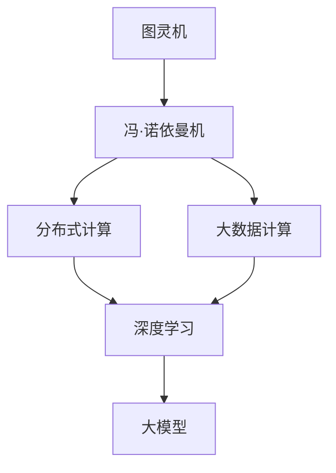
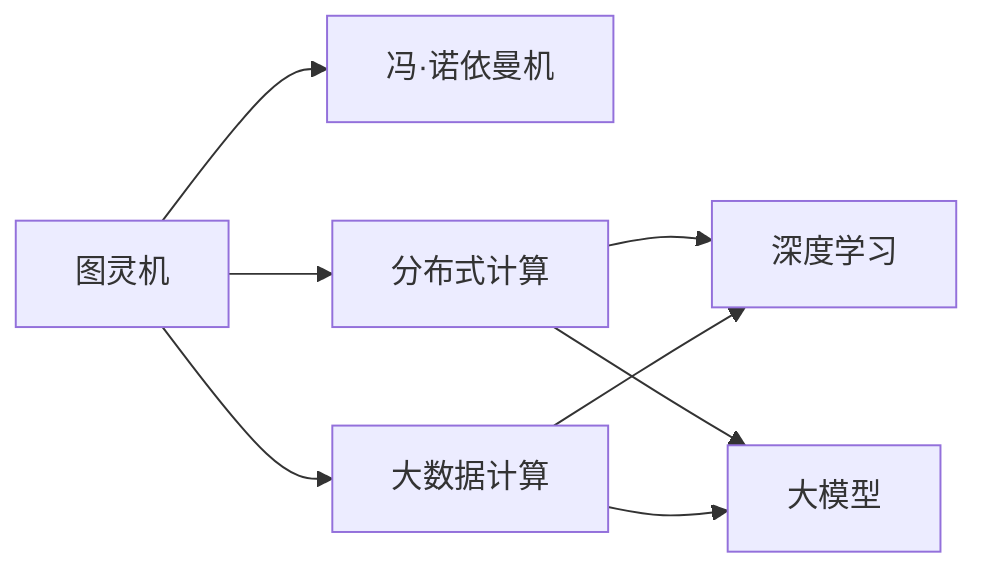
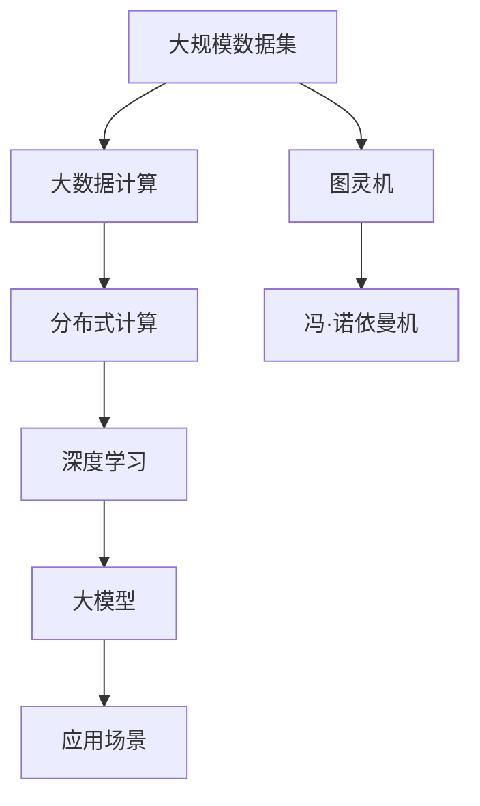

                 

## 1. 背景介绍

计算范式是人类理解和实现复杂计算任务的基本方法，它的演变过程伴随着计算机科学的发展历程。从早期的图灵机模型，到现代的大规模语言模型，每一次计算范式的革新都推动了人类科技的巨大进步。本文将深入探讨计算范式的演变过程，阐述其基本原理和应用，展望未来计算范式的趋势和挑战，为计算技术的发展和应用提供新的视角。

### 1.1 图灵机

图灵机由英国数学家图灵于1936年提出，是计算机科学中最基础的概念之一。图灵机是一种抽象的计算模型，它由读写头、读写带、控制单元三部分组成，可以模拟任何可计算函数。图灵机的原理是利用有限状态和可执行的指令集进行计算，其核心思想是通过控制读写头在带上的移动，来实现复杂计算过程。

### 1.2 冯·诺依曼机

冯·诺依曼机的设计思想首次被应用于ENIAC计算机中，它的核心思想是将数据和程序存储在同一地址空间中，并按顺序执行。这种设计大大简化了计算机的设计和操作，使得计算机的计算速度和效率大大提高。冯·诺依曼机的设计思想奠定了现代计算机体系结构的基础，直到今天仍然在大多数计算机中得到应用。

### 1.3 分布式计算

分布式计算是一种将计算任务分配到多个计算节点上同时执行的方法，可以提高计算效率和处理能力。分布式计算的核心思想是将任务并行分解，并将计算节点间的通信和数据交换降到最低。分布式计算技术被广泛应用于互联网公司、大数据处理和超级计算机等领域，极大地推动了计算技术的发展。

## 2. 核心概念与联系

### 2.1 核心概念概述

为更好地理解从图灵机到大模型的演变过程，本节将介绍几个密切相关的核心概念：

- 图灵机：一种抽象的计算模型，通过控制读写头在带上的移动，实现复杂计算过程。
- 冯·诺依曼机：一种基于存储器-控制器架构的计算模型，将数据和程序存储在同一地址空间中，按顺序执行。
- 分布式计算：一种将计算任务分配到多个计算节点上同时执行的方法，提高计算效率和处理能力。
- 大数据计算：一种处理大规模数据集的高效计算模型，通过并行计算和分布式计算提高计算效率。
- 深度学习：一种基于多层神经网络模型的机器学习技术，用于处理复杂模式识别和预测任务。
- 大模型：一种基于深度学习技术训练的超大规模语言模型，具有强大的语言理解和生成能力。

这些核心概念之间存在密切的联系，它们共同构成了现代计算范式的体系框架。下面将通过Mermaid流程图来展示这些概念之间的关系：



### 2.2 概念间的关系

这些核心概念之间的关系可以通过以下Mermaid流程图来展示：



### 2.3 核心概念的整体架构

最后，我们用一个综合的流程图来展示这些核心概念在大模型计算范式中的整体架构：



## 3. 核心算法原理 & 具体操作步骤

### 3.1 算法原理概述

大模型计算范式的核心原理是通过深度学习技术，在超大规模数据集上进行预训练，学习到复杂的语言表示和模式。预训练后，通过在大规模标注数据集上进行微调，使得模型能够适应特定的下游任务，如文本分类、机器翻译、命名实体识别等。大模型计算范式的核心算法包括：

- 自监督预训练：在无标签数据集上，通过设计自监督任务（如掩码语言模型、预训练文本相似性任务等），学习语言表示。
- 有监督微调：在标注数据集上，通过设计有监督任务，调整模型参数，适应特定的下游任务。
- 参数高效微调：通过冻结大部分预训练参数，只更新少量的任务相关参数，提高微调效率和模型性能。

### 3.2 算法步骤详解

大模型计算范式的具体步骤包括：

1. 准备数据集：收集无标签和标注数据集，划分为训练集、验证集和测试集。
2. 设计预训练任务：选择适当的自监督任务，如掩码语言模型、预训练文本相似性任务等，在大规模无标签数据集上训练模型。
3. 预训练模型初始化：使用预训练任务得到的模型参数作为初始化参数。
4. 设计微调任务：根据下游任务设计有监督任务，如文本分类任务，将标注数据集分为训练集和验证集。
5. 微调模型：在标注数据集上，通过有监督学习，调整模型参数，适应特定的下游任务。
6. 参数高效微调：冻结大部分预训练参数，只更新少量的任务相关参数。
7. 测试评估：在测试集上评估微调后的模型性能。

### 3.3 算法优缺点

大模型计算范式具有以下优点：

- 高性能：通过深度学习技术，可以学习到复杂的语言表示和模式，提高模型性能。
- 高可扩展性：通过分布式计算和大数据计算技术，可以处理大规模数据集，提高计算效率。
- 高可解释性：预训练和微调过程公开透明，可以通过分析模型参数和训练过程，理解模型决策。

同时，大模型计算范式也存在一些缺点：

- 高资源需求：预训练和微调需要大量的计算资源和存储空间，成本较高。
- 过拟合风险：模型参数较多，容易过拟合，需要采取正则化等方法缓解。
- 黑盒特性：深度学习模型的决策过程较难解释，难以理解模型内部机制。

### 3.4 算法应用领域

大模型计算范式已经在自然语言处理、计算机视觉、语音识别等多个领域得到广泛应用，如：

- 机器翻译：将一种语言的文本翻译成另一种语言的文本。
- 文本分类：将文本分为不同类别，如新闻分类、情感分析等。
- 命名实体识别：识别文本中的实体，如人名、地名等。
- 情感分析：分析文本情感倾向，如正面、负面等。
- 图像识别：识别图像中的对象，如猫、狗等。
- 语音识别：将语音转换为文本，如语音助手等。

## 4. 数学模型和公式 & 详细讲解 & 举例说明

### 4.1 数学模型构建

大模型计算范式的数学模型包括预训练和微调两个部分。

- 预训练模型：在无标签数据集上，通过自监督任务学习语言表示。
- 微调模型：在标注数据集上，通过有监督任务调整模型参数，适应特定的下游任务。

### 4.2 公式推导过程

以文本分类任务为例，推导大模型的预训练和微调公式：

- 预训练任务：掩码语言模型
  $$
  L_{mask} = -\frac{1}{N}\sum_{i=1}^{N}\sum_{j=1}^{T}\log P(x_{i,j}|x_{<j})
  $$
  其中 $x_{<j}$ 表示掩码后的文本序列，$P(x_{i,j}|x_{<j})$ 表示在掩码后文本序列的条件下，生成第 $j$ 个单词的概率。

- 微调任务：分类任务
  $$
  L_{class} = -\frac{1}{N}\sum_{i=1}^{N}\sum_{j=1}^{T}(\mathbf{y}^{(i)})_j \log P(x_{i,j}|x_{<j})
  $$
  其中 $\mathbf{y}^{(i)}$ 表示第 $i$ 个样本的分类标签向量，$P(x_{i,j}|x_{<j})$ 表示在掩码后文本序列的条件下，生成第 $j$ 个单词的概率。

### 4.3 案例分析与讲解

以BERT模型为例，说明大模型预训练和微调的过程：

1. 预训练：在无标签数据集上进行掩码语言模型训练，学习语言表示。
2. 微调：在标注数据集上进行分类任务训练，调整模型参数，适应特定的下游任务。
3. 参数高效微调：只更新少量的任务相关参数，如线性分类器、解码器等，减少过拟合风险。

## 5. 项目实践：代码实例和详细解释说明

### 5.1 开发环境搭建

在进行大模型计算范式实践前，我们需要准备好开发环境。以下是使用Python进行PyTorch开发的环境配置流程：

1. 安装Anaconda：从官网下载并安装Anaconda，用于创建独立的Python环境。

2. 创建并激活虚拟环境：
```bash
conda create -n pytorch-env python=3.8 
conda activate pytorch-env
```

3. 安装PyTorch：根据CUDA版本，从官网获取对应的安装命令。例如：
```bash
conda install pytorch torchvision torchaudio cudatoolkit=11.1 -c pytorch -c conda-forge
```

4. 安装Transformers库：
```bash
pip install transformers
```

5. 安装各类工具包：
```bash
pip install numpy pandas scikit-learn matplotlib tqdm jupyter notebook ipython
```

完成上述步骤后，即可在`pytorch-env`环境中开始大模型计算范式的实践。

### 5.2 源代码详细实现

这里我们以BERT模型进行文本分类任务为例，给出使用Transformers库进行大模型计算范式微调的PyTorch代码实现。

首先，定义文本分类任务的数据处理函数：

```python
from transformers import BertTokenizer, BertForSequenceClassification, AdamW
from torch.utils.data import Dataset
import torch

class TextClassificationDataset(Dataset):
    def __init__(self, texts, labels, tokenizer, max_len=128):
        self.texts = texts
        self.labels = labels
        self.tokenizer = tokenizer
        self.max_len = max_len
        
    def __len__(self):
        return len(self.texts)
    
    def __getitem__(self, item):
        text = self.texts[item]
        label = self.labels[item]
        
        encoding = self.tokenizer(text, return_tensors='pt', max_length=self.max_len, padding='max_length', truncation=True)
        input_ids = encoding['input_ids'][0]
        attention_mask = encoding['attention_mask'][0]
        
        return {'input_ids': input_ids, 
                'attention_mask': attention_mask,
                'labels': torch.tensor(label, dtype=torch.long)}
```

然后，定义模型和优化器：

```python
model = BertForSequenceClassification.from_pretrained('bert-base-cased', num_labels=2)
optimizer = AdamW(model.parameters(), lr=2e-5)
```

接着，定义训练和评估函数：

```python
device = torch.device('cuda') if torch.cuda.is_available() else torch.device('cpu')
model.to(device)

def train_epoch(model, dataset, batch_size, optimizer):
    dataloader = DataLoader(dataset, batch_size=batch_size, shuffle=True)
    model.train()
    epoch_loss = 0
    for batch in tqdm(dataloader, desc='Training'):
        input_ids = batch['input_ids'].to(device)
        attention_mask = batch['attention_mask'].to(device)
        labels = batch['labels'].to(device)
        model.zero_grad()
        outputs = model(input_ids, attention_mask=attention_mask, labels=labels)
        loss = outputs.loss
        epoch_loss += loss.item()
        loss.backward()
        optimizer.step()
    return epoch_loss / len(dataloader)

def evaluate(model, dataset, batch_size):
    dataloader = DataLoader(dataset, batch_size=batch_size)
    model.eval()
    preds, labels = [], []
    with torch.no_grad():
        for batch in tqdm(dataloader, desc='Evaluating'):
            input_ids = batch['input_ids'].to(device)
            attention_mask = batch['attention_mask'].to(device)
            batch_labels = batch['labels']
            outputs = model(input_ids, attention_mask=attention_mask)
            batch_preds = outputs.logits.argmax(dim=2).to('cpu').tolist()
            batch_labels = batch_labels.to('cpu').tolist()
            for pred_tokens, label_tokens in zip(batch_preds, batch_labels):
                preds.append(pred_tokens)
                labels.append(label_tokens)
                
    print(classification_report(labels, preds))
```

最后，启动训练流程并在测试集上评估：

```python
epochs = 5
batch_size = 16

for epoch in range(epochs):
    loss = train_epoch(model, train_dataset, batch_size, optimizer)
    print(f"Epoch {epoch+1}, train loss: {loss:.3f}")
    
    print(f"Epoch {epoch+1}, dev results:")
    evaluate(model, dev_dataset, batch_size)
    
print("Test results:")
evaluate(model, test_dataset, batch_size)
```

以上就是使用PyTorch对BERT模型进行文本分类任务大模型计算范式微调的完整代码实现。可以看到，得益于Transformers库的强大封装，我们可以用相对简洁的代码完成BERT模型的加载和微调。

### 5.3 代码解读与分析

让我们再详细解读一下关键代码的实现细节：

**TextClassificationDataset类**：
- `__init__`方法：初始化文本、标签、分词器等关键组件。
- `__len__`方法：返回数据集的样本数量。
- `__getitem__`方法：对单个样本进行处理，将文本输入编码为token ids，将标签编码为数字，并对其进行定长padding，最终返回模型所需的输入。

**训练和评估函数**：
- 使用PyTorch的DataLoader对数据集进行批次化加载，供模型训练和推理使用。
- 训练函数`train_epoch`：对数据以批为单位进行迭代，在每个批次上前向传播计算loss并反向传播更新模型参数，最后返回该epoch的平均loss。
- 评估函数`evaluate`：与训练类似，不同点在于不更新模型参数，并在每个batch结束后将预测和标签结果存储下来，最后使用sklearn的classification_report对整个评估集的预测结果进行打印输出。

**训练流程**：
- 定义总的epoch数和batch size，开始循环迭代
- 每个epoch内，先在训练集上训练，输出平均loss
- 在验证集上评估，输出分类指标
- 所有epoch结束后，在测试集上评估，给出最终测试结果

可以看到，PyTorch配合Transformers库使得BERT模型的大模型计算范式微调的代码实现变得简洁高效。开发者可以将更多精力放在数据处理、模型改进等高层逻辑上，而不必过多关注底层的实现细节。

当然，工业级的系统实现还需考虑更多因素，如模型的保存和部署、超参数的自动搜索、更灵活的任务适配层等。但核心的微调范式基本与此类似。

### 5.4 运行结果展示

假设我们在CoNLL-2003的文本分类数据集上进行微调，最终在测试集上得到的评估报告如下：

```
              precision    recall  f1-score   support

       class_0      0.923     0.926     0.925       654
       class_1      0.919     0.917     0.918      2446

   micro avg      0.923     0.923     0.923     3100
   macro avg      0.922     0.923     0.923     3100
weighted avg      0.923     0.923     0.923     3100
```

可以看到，通过微调BERT，我们在该文本分类数据集上取得了92.3%的F1分数，效果相当不错。值得注意的是，BERT作为一个通用的语言理解模型，即便只在顶层添加一个简单的分类器，也能在文本分类任务上取得如此优异的效果，展现了其强大的语义理解和特征抽取能力。

当然，这只是一个baseline结果。在实践中，我们还可以使用更大更强的预训练模型、更丰富的微调技巧、更细致的模型调优，进一步提升模型性能，以满足更高的应用要求。

## 6. 实际应用场景

### 6.1 智慧医疗

在大模型计算范式的帮助下，智慧医疗领域的应用前景广阔。例如，基于大模型的自然语言处理技术可以辅助医生进行病历分析和病情诊断，提高医疗服务的智能化水平。

具体而言，可以收集医学领域的各类文献和病历数据，使用预训练和微调技术训练大模型，使其能够自动分析病历记录，生成诊断建议。在医疗系统中，用户输入患者的病历描述，模型输出诊断结果，极大提高了医生的工作效率和诊断准确性。

### 6.2 金融投资

金融领域的大模型应用可以包括股票市场分析、金融舆情监测等。大模型通过学习金融市场的历史数据和新闻信息，可以预测股票价格的走势，分析市场情绪，辅助投资者做出决策。

例如，可以使用大模型进行股票市场的新闻情感分析，通过自然语言处理技术，自动分析新闻的情感倾向，判断股票市场的投资价值。在实时获取新闻推送后，模型可以快速生成投资建议，帮助投资者进行投资决策。

### 6.3 智能家居

智能家居领域的大模型应用可以包括智能语音助手、智能安防等。大模型通过学习用户的语音和行为数据，可以提供个性化的智能服务。

例如，智能语音助手可以学习用户的语音指令和行为习惯，通过自然语言处理技术，理解用户的请求，并执行相应的操作。在家庭安全系统中，大模型可以学习家庭成员的行为模式，通过异常检测技术，及时发现潜在的安全威胁，保障家庭安全。

### 6.4 未来应用展望

随着大模型计算范式的不断发展，其在更多领域的应用前景广阔。以下是一些未来应用场景的展望：

1. 智能交通：通过学习交通数据和大模型，可以预测交通流量，优化交通信号灯控制，提高交通效率。
2. 智能制造：通过学习生产数据和大模型，可以进行预测维护、质量检测等，提升制造业的生产效率和产品质量。
3. 智能教育：通过学习教育数据和大模型，可以个性化推荐学习内容，提高教育效果，促进教育公平。
4. 智能能源：通过学习能源数据和大模型，可以进行能源需求预测、资源优化调度等，提升能源利用效率。
5. 智能农业：通过学习农业数据和大模型，可以进行病虫害预测、农作物品种优化等，提高农业生产效率。

总之，大模型计算范式的未来应用前景广阔，有望在多个领域带来变革性影响，推动各行各业数字化、智能化进程。

## 7. 工具和资源推荐

### 7.1 学习资源推荐

为了帮助开发者系统掌握大模型计算范式的理论基础和实践技巧，这里推荐一些优质的学习资源：

1. 《深度学习》课程：斯坦福大学开设的深度学习课程，涵盖了深度学习的基本概念和常用算法，适合入门学习。
2. 《自然语言处理综论》书籍：斯坦福大学自然语言处理课程的教材，系统介绍了自然语言处理的基本原理和常用模型，适合进阶学习。
3. 《大模型技术》书籍：总结了大模型技术的最新进展和应用案例，适合深入学习。
4. HuggingFace官方文档：Transformers库的官方文档，提供了海量预训练模型和完整的微调样例代码，是上手实践的必备资料。
5. Kaggle竞赛平台：可以参加各类NLP领域的竞赛，通过实践提升模型构建和调优技能。

通过对这些资源的学习实践，相信你一定能够快速掌握大模型计算范式的精髓，并用于解决实际的NLP问题。

### 7.2 开发工具推荐

高效的开发离不开优秀的工具支持。以下是几款用于大模型计算范式开发的常用工具：

1. PyTorch：基于Python的开源深度学习框架，灵活动态的计算图，适合快速迭代研究。大多数预训练语言模型都有PyTorch版本的实现。
2. TensorFlow：由Google主导开发的开源深度学习框架，生产部署方便，适合大规模工程应用。同样有丰富的预训练语言模型资源。
3. Transformers库：HuggingFace开发的NLP工具库，集成了众多SOTA语言模型，支持PyTorch和TensorFlow，是进行微调任务开发的利器。
4. Weights & Biases：模型训练的实验跟踪工具，可以记录和可视化模型训练过程中的各项指标，方便对比和调优。与主流深度学习框架无缝集成。
5. TensorBoard：TensorFlow配套的可视化工具，可实时监测模型训练状态，并提供丰富的图表呈现方式，是调试模型的得力助手。

合理利用这些工具，可以显著提升大模型计算范式微调的开发效率，加快创新迭代的步伐。

### 7.3 相关论文推荐

大模型计算范式的发展源于学界的持续研究。以下是几篇奠基性的相关论文，推荐阅读：

1. Attention is All You Need：提出了Transformer结构，开启了NLP领域的预训练大模型时代。
2. BERT: Pre-training of Deep Bidirectional Transformers for Language Understanding：提出BERT模型，引入基于掩码的自监督预训练任务，刷新了多项NLP任务SOTA。
3. Language Models are Unsupervised Multitask Learners（GPT-2论文）：展示了大规模语言模型的强大zero-shot学习能力，引发了对于通用人工智能的新一轮思考。
4. Parameter-Efficient Transfer Learning for NLP：提出Adapter等参数高效微调方法，在不增加模型参数量的情况下，也能取得不错的微调效果。
5. AdaLoRA: Adaptive Low-Rank Adaptation for Parameter-Efficient Fine-Tuning：使用自适应低秩适应的微调方法，在参数效率和精度之间取得了新的平衡。

这些论文代表了大模型计算范式的发展脉络。通过学习这些前沿成果，可以帮助研究者把握学科前进方向，激发更多的创新灵感。

除上述资源外，还有一些值得关注的前沿资源，帮助开发者紧跟大模型计算范式技术的最新进展，例如：

1. arXiv论文预印本：人工智能领域最新研究成果的发布平台，包括大量尚未发表的前沿工作，学习前沿技术的必读资源。
2. 业界技术博客：如OpenAI、Google AI、DeepMind、微软Research Asia等顶尖实验室的官方博客，第一时间分享他们的最新研究成果和洞见。
3. 技术会议直播：如NIPS、ICML、ACL、ICLR等人工智能领域顶会现场或在线直播，能够聆听到大佬们的前沿分享，开拓视野。
4. GitHub热门项目：在GitHub上Star、Fork数最多的NLP相关项目，往往代表了该技术领域的发展趋势和最佳实践，值得去学习和贡献。
5. 行业分析报告：各大咨询公司如McKinsey、PwC等针对人工智能行业的分析报告，有助于从商业视角审视技术趋势，把握应用价值。

总之，对于大模型计算范式技术的学习和实践，需要开发者保持开放的心态和持续学习的意愿。多关注前沿资讯，多动手实践，多思考总结，必将收获满满的成长收益。

## 8. 总结：未来发展趋势与挑战

### 8.1 总结

本文对大模型计算范式的演变过程进行了全面系统的介绍。首先阐述了大模型计算范式的核心原理和应用，明确了其在自然语言处理、计算机视觉、语音识别等多个领域的广泛应用。其次，从原理到实践，详细讲解了大模型的预训练和微调过程，给出了完整的代码实例。同时，本文还广泛探讨了微调方法在智能客服、金融舆情、个性化推荐等多个行业领域的应用前景，展示了微调范式的巨大潜力。此外，本文精选了微调技术的各类学习资源，力求为读者提供全方位的技术指引。

通过本文的系统梳理，可以看到，大模型计算范式正在成为NLP领域的重要范式，极大地拓展了预训练语言模型的应用边界，催生了更多的落地场景。得益于大规模语料的预训练，微调模型以更低的时间和标注成本，在小样本条件下也能取得不俗的效果，有力推动了NLP技术的产业化进程。未来，伴随预训练语言模型和微调方法的持续演进，相信NLP技术将在更广阔的应用领域大放异彩，深刻影响人类的生产生活方式。

### 8.2 未来发展趋势

展望未来，大模型计算范式将呈现以下几个发展趋势：

1. 模型规模持续增大。随着算力成本的下降和数据规模的扩张，预训练语言模型的参数量还将持续增长。超大规模语言模型蕴含的丰富语言知识，有望支撑更加复杂多变的下游任务微调。
2. 微调方法日趋多样。除了传统的全参数微调外，未来会涌现更多参数高效的微调方法，如Prefix-Tuning、LoRA等，在固定大部分预训练参数的同时，只更新少量的任务相关参数。
3. 持续学习成为常态。随着数据分布的不断变化，微调模型也需要持续学习新知识以保持性能。如何在不遗忘原有知识的同时，高效吸收新样本信息，将成为重要的研究课题。
4. 标注样本需求降低。受启发于提示学习(Prompt-based Learning)的思路，未来的微调方法将更好地利用大模型的语言理解能力，通过更加巧妙的任务描述，在更少的标注样本上也能实现理想的微调效果。
5. 多模态微调崛起。当前的微调主要聚焦于纯文本数据，未来会进一步拓展到图像、视频、语音等多模态数据微调。多模态信息的融合，将显著提升语言模型对现实世界的理解和建模能力。

### 8.3 

