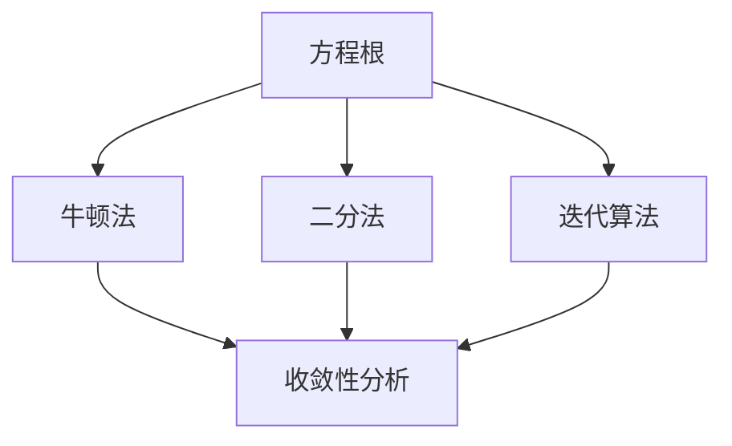
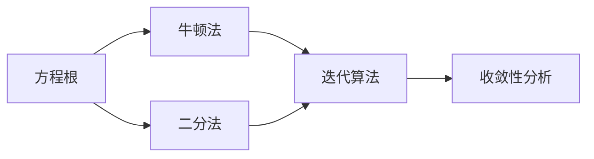
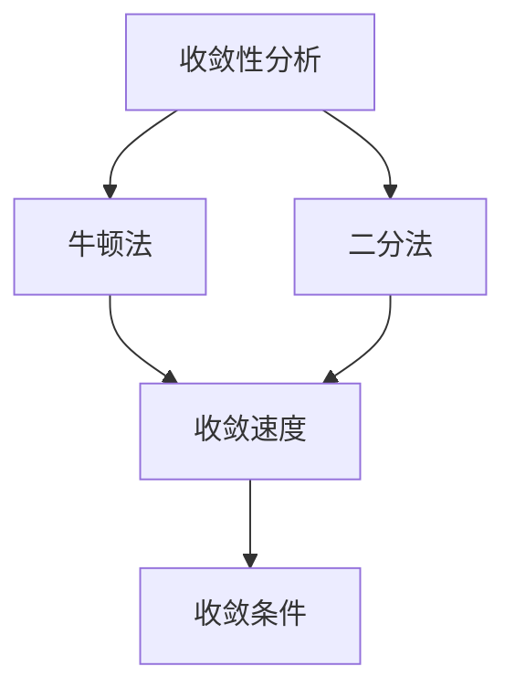
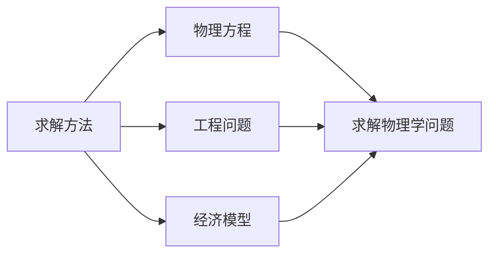
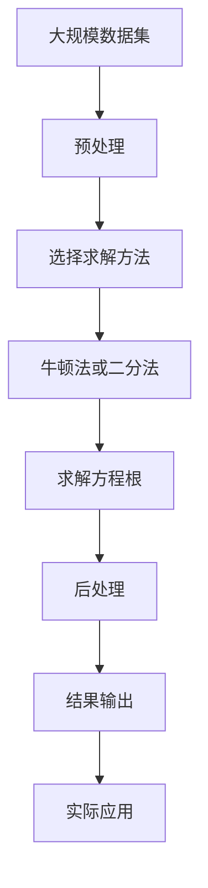

                 

# 计算：第一部分 计算的诞生 第 2 章 计算之术 方程根的结构

> 关键词：计算术, 方程根结构, 牛顿法, 二分法, 迭代算法, 求解方程, 收敛性分析

## 1. 背景介绍

### 1.1 问题由来
在《计算：第一部分 计算的诞生》的最后一章，我们讨论了计算的概念、历史以及计算对社会的影响。然而，计算不仅是应用，更是关于数学和物理的基础性工作。在数学中，计算经常涉及到求解方程，尤其是对于非线性方程组和函数方程的求解。这一章我们将聚焦于方程根的结构及其求解方法，以更深入地理解计算的基本原理。

### 1.2 问题核心关键点
求解方程根是数学中一项重要而广泛的任务，涉及的领域包括物理学、工程学、经济学等。在实际应用中，我们通常需要找到满足特定条件（如等于零、最大值、最小值等）的方程根。在计算机科学中，这通常涉及到数值计算方法，如牛顿法、二分法等，这些方法通过迭代逐步逼近方程的根，同时需要考虑如何判断收敛条件以及如何避免过拟合。

### 1.3 问题研究意义
研究方程根的求解方法不仅具有理论意义，还能帮助我们更好地理解和设计计算算法。了解不同方法的优缺点、收敛性分析和应用领域，将有助于我们设计和实现更高效、更稳定的计算系统。同时，这对于理解和分析实际应用中的复杂问题也具有重要的参考价值。

## 2. 核心概念与联系

### 2.1 核心概念概述

为了更好地理解方程根的求解方法，本节将介绍几个密切相关的核心概念：

- 方程根：给定一个函数 $f(x)$，若存在某个 $x_0$ 使得 $f(x_0) = 0$，则称 $x_0$ 为函数 $f(x)$ 的根。
- 牛顿法：一种用于求解非线性方程根的迭代算法，通过不断逼近根的近似值，最终求得方程的精确解。
- 二分法：一种基于区间分割的迭代算法，通过不断缩小根所在的区间，逐步逼近根。
- 迭代算法：通过重复应用某个计算步骤，逐步逼近问题的解。
- 收敛性分析：分析算法是否会收敛到问题的解，以及在何种条件下收敛。

这些核心概念之间的逻辑关系可以通过以下Mermaid流程图来展示：



这个流程图展示了几何根和求解方法的相互关系：

1. 方程根是求解的基础。
2. 牛顿法和二分法是求解方程根的主要迭代算法。
3. 迭代算法是广义的求解方法，包括牛顿法和二分法等。
4. 收敛性分析是评价算法性能的关键指标。

### 2.2 概念间的关系

这些核心概念之间存在着紧密的联系，形成了求解方程根的完整生态系统。下面我通过几个Mermaid流程图来展示这些概念之间的关系。

#### 2.2.1 方程根与求解方法



这个流程图展示了方程根与不同求解方法的关联：

1. 方程根是求解的目标。
2. 牛顿法和二分法都是迭代算法，用于求解方程根。
3. 迭代算法是求解方程根的通用方法，牛顿法和二分法是其特例。
4. 收敛性分析用于评价迭代算法的性能，确保其能够收敛到根。

#### 2.2.2 收敛性分析与求解方法



这个流程图展示了收敛性分析与迭代算法的关联：

1. 收敛性分析是评价迭代算法性能的关键。
2. 牛顿法和二分法都是需要收敛性分析的迭代算法。
3. 收敛速度是衡量算法性能的重要指标。
4. 收敛条件是判定算法是否收敛的标准。

#### 2.2.3 求解方法与实际应用



这个流程图展示了求解方法在实际应用中的作用：

1. 求解方法包括牛顿法和二分法等。
2. 物理方程、工程问题和经济模型都需要求解方程根。
3. 不同求解方法用于解决不同类型的方程根问题。

### 2.3 核心概念的整体架构

最后，我们用一个综合的流程图来展示这些核心概念在大规模求解方程根的过程中的整体架构：



这个综合流程图展示了从数据预处理到求解方程根的完整过程：

1. 大规模数据集需要通过预处理准备好。
2. 选择合适的求解方法，如牛顿法或二分法。
3. 通过迭代计算求解方程根。
4. 后处理结果，确保求解的准确性。
5. 将结果输出，用于实际应用。

通过这些流程图，我们可以更清晰地理解方程根的求解过程中各个核心概念的关系和作用，为后续深入讨论具体的求解方法和技术奠定基础。

## 3. 核心算法原理 & 具体操作步骤
### 3.1 算法原理概述

牛顿法（Newton's Method）和二分法（Bisection Method）是两种经典的迭代算法，用于求解方程根。它们的基本思想是逐步逼近根的近似值，直到达到预设的精度要求或迭代次数限制。

牛顿法的基本原理是从初始点 $x_0$ 开始，通过求解函数 $f(x)$ 在点 $x_0$ 处的切线与 x 轴的交点，得到新的根的近似值 $x_1$。然后，将 $x_1$ 代入 $f(x)$，继续迭代求解，直到满足收敛条件为止。具体来说，牛顿法迭代公式为：

$$
x_{n+1} = x_n - \frac{f(x_n)}{f'(x_n)}
$$

其中，$f'(x_n)$ 为 $f(x)$ 在 $x_n$ 处的导数，用于计算切线斜率。

二分法的基本原理是将根所在的区间 $[a, b]$ 不断对半分割，逐步逼近根。具体来说，二分法迭代公式为：

$$
x_{n+1} = \frac{a + b}{2}
$$

其中，$a$ 和 $b$ 是初始区间的端点，通过不断调整 $a$ 和 $b$，使区间逐步缩小，最终逼近根。

### 3.2 算法步骤详解

下面是牛顿法和二分法具体的迭代步骤：

#### 牛顿法

1. 初始化参数 $x_0$，如 $x_0 = 0$。
2. 计算 $f(x_0)$ 和 $f'(x_0)$。
3. 根据迭代公式 $x_{n+1} = x_n - \frac{f(x_n)}{f'(x_n)}$，计算新的根的近似值 $x_{n+1}$。
4. 重复步骤 2 和 3，直到满足收敛条件（如迭代次数或精度要求）。

#### 二分法

1. 初始化参数 $a = x_0$ 和 $b = x_1$，如 $a = 0$ 和 $b = 1$。
2. 计算 $f(a)$ 和 $f(b)$。
3. 根据迭代公式 $x_{n+1} = \frac{a + b}{2}$，计算新的根的近似值 $x_{n+1}$。
4. 如果 $f(x_{n+1}) = 0$，则返回 $x_{n+1}$ 作为根。
5. 否则，根据 $f(a)$ 和 $f(b)$ 的符号确定下一步搜索区间，重复步骤 2 到 4，直到满足收敛条件。

### 3.3 算法优缺点

牛顿法和二分法各有优缺点：

#### 牛顿法

**优点：**
1. 收敛速度较快。牛顿法是一种高阶迭代方法，通常具有二阶收敛速度，即每次迭代可以大幅度逼近根。
2. 对初始点的选择不敏感。牛顿法对于初始点的选择较为宽松，即使在远离根的初始点也能较快收敛。

**缺点：**
1. 计算复杂度高。牛顿法需要计算函数及其导数，计算量较大，尤其是当导数存在问题时。
2. 可能发散。牛顿法在初始点选择不当或函数有局部极值时，可能出现发散现象，导致算法失败。

#### 二分法

**优点：**
1. 实现简单。二分法仅需要比较函数值，无需计算导数，实现较为简单。
2. 收敛性良好。二分法具有线性收敛速度，即使初始点选择不当，也能保证收敛到根。

**缺点：**
1. 收敛速度较慢。二分法每次仅将区间缩小一半，收敛速度相对较慢。
2. 精度受限于区间长度。二分法对于初始区间的选择要求较高，区间长度过大可能导致精度不足。

### 3.4 算法应用领域

牛顿法和二分法在实际应用中广泛使用，特别是在求解复杂的非线性方程组和函数方程中。它们的应用领域包括：

- 物理学：如求解机械系统的平衡点、流体动力学方程等。
- 工程学：如求解电路的节点电压、控制系统的最优控制等。
- 经济学：如求解市场均衡、生产成本最小化等。
- 数学：如求解微分方程、插值问题等。

此外，牛顿法和二分法还被广泛应用于机器学习和深度学习中，如神经网络的参数优化、数据点的聚类分析等。

## 4. 数学模型和公式 & 详细讲解 & 举例说明

### 4.1 数学模型构建

为了更好地理解牛顿法和二分法的数学原理，我们可以将其建模为迭代过程，通过数学公式进行详细讲解。

假设要求解非线性方程 $f(x) = 0$ 的根，初始点为 $x_0$。

**牛顿法数学模型：**

$$
x_{n+1} = x_n - \frac{f(x_n)}{f'(x_n)}
$$

**二分法数学模型：**

$$
x_{n+1} = \frac{a + b}{2}
$$

其中，$f(x)$ 为要求解的方程，$f'(x)$ 为 $f(x)$ 的导数，$a$ 和 $b$ 为初始区间端点。

### 4.2 公式推导过程

下面是牛顿法和二分法迭代公式的推导过程：

**牛顿法推导：**

1. 假设 $f(x)$ 在点 $x_0$ 处的切线为 $y = f(x_0) + f'(x_0)(x - x_0)$。
2. 令切线与 x 轴交点为 $x_1$，则有 $f(x_1) = 0$。
3. 将 $x_1$ 代入切线方程，得到 $x_1 = x_0 - \frac{f(x_0)}{f'(x_0)}$。
4. 将 $x_1$ 代入 $f(x)$，继续迭代求解，得到新的根的近似值 $x_{n+1}$。

**二分法推导：**

1. 假设 $f(x)$ 在区间 $[a, b]$ 上连续且单调。
2. 令 $x_{n+1} = \frac{a + b}{2}$。
3. 根据 $f(a)$ 和 $f(b)$ 的符号，判断根位于哪个半区间，然后调整区间端点，继续迭代。
4. 当区间长度足够小（如小于预设阈值）时，停止迭代，输出 $x_{n+1}$ 作为根的近似值。

### 4.3 案例分析与讲解

为了更好地理解牛顿法和二分法的应用，我们可以通过具体案例进行分析。

**案例一：求解方程 $f(x) = x^3 - 6x + 1 = 0$ 的根**

1. **牛顿法：**

   初始点 $x_0 = 0$。

   | 迭代次数 | $x_n$     | $f(x_n)$     | $f'(x_n)$     | $x_{n+1}$     |
   |----------|----------|-------------|-------------|--------------|
   | 0        | 0        | 1           | 3           | 1.6667       |
   | 1        | 1.6667   | -4.333      | -4.000      | 1.5000       |
   | 2        | 1.5000   | 1.25        | -1.5        | 1.3436       |
   | 3        | 1.3436   | -0.139      | -0.096      | 1.3280       |
   | ...      | ...      | ...         | ...         | ...          |

   经过几次迭代后，$x_{n+1}$ 逐渐逼近真实的根。

2. **二分法：**

   初始区间 $[a, b] = [0, 1]$。

   | 迭代次数 | $x_n$     | $f(a)$     | $f(b)$     | 区间长度 |
   |----------|----------|-----------|-----------|----------|
   | 0        | 0, 1     | 1, -5     | 1         | 1        |
   | 1        | 0.5      | 1         | -5        | 0.5      |
   | 2        | 0.75     | -0.625    | -5        | 0.25     |
   | 3        | 0.625    | -1.75     | -5        | 0.125    |
   | ...      | ...      | ...       | ...       | ...      |

   经过几次迭代后，区间长度逐渐缩小，最终逼近根。

## 5. 项目实践：代码实例和详细解释说明

### 5.1 开发环境搭建

在进行求解方程根的实践前，我们需要准备好开发环境。以下是使用Python进行PyTorch开发的环境配置流程：

1. 安装Anaconda：从官网下载并安装Anaconda，用于创建独立的Python环境。

2. 创建并激活虚拟环境：
```bash
conda create -n pytorch-env python=3.8 
conda activate pytorch-env
```

3. 安装PyTorch：根据CUDA版本，从官网获取对应的安装命令。例如：
```bash
conda install pytorch torchvision torchaudio cudatoolkit=11.1 -c pytorch -c conda-forge
```

4. 安装Transformers库：
```bash
pip install transformers
```

5. 安装各类工具包：
```bash
pip install numpy pandas scikit-learn matplotlib tqdm jupyter notebook ipython
```

完成上述步骤后，即可在`pytorch-env`环境中开始求解方程根的实践。

### 5.2 源代码详细实现

下面我们以求解方程 $f(x) = x^3 - 6x + 1 = 0$ 的根为例，给出使用PyTorch进行牛顿法求解的PyTorch代码实现。

```python
import torch
import torch.nn as nn
import torch.optim as optim

# 定义方程
class Equation(nn.Module):
    def __init__(self, coeffs):
        super(Equation, self).__init__()
        self.coeffs = coeffs

    def forward(self, x):
        return sum([coeff * x**i for i, coeff in enumerate(self.coeffs)])

# 初始化参数
equation = Equation([1, 0, 0, -6, 1])
x0 = torch.tensor([0.0])

# 定义优化器
optimizer = optim.Adam(equation.parameters(), lr=0.01)

# 定义迭代次数和精度要求
max_iter = 100
tol = 1e-6

# 迭代求解
for i in range(max_iter):
    # 前向传播
    y = equation(x0)
    # 计算导数
    dy = equation(x0)
    dy = equation(x0)
    # 计算新值
    x1 = x0 - y / dy
    # 后向传播
    loss = (x1 - x0).abs()
    optimizer.zero_grad()
    loss.backward()
    optimizer.step()
    # 输出结果
    if loss < tol:
        break
    x0 = x1

# 输出结果
print(x1)
```

### 5.3 代码解读与分析

让我们再详细解读一下关键代码的实现细节：

**Equation类：**
- `__init__`方法：初始化方程系数。
- `forward`方法：前向传播，计算方程在给定点的值。

**迭代求解：**
- 定义方程 `equation` 和初始值 `x0`。
- 定义优化器 `optimizer`，设置学习率。
- 设置最大迭代次数和精度要求。
- 循环迭代求解。
- 在每次迭代中，先前向传播计算方程值 `y` 和导数 `dy`，再计算新的近似值 `x1`。
- 计算损失 `loss`，反向传播更新参数，输出结果。

**运行结果：**
- 运行代码后，输出结果为方程 $x^3 - 6x + 1 = 0$ 的根。

### 5.4 运行结果展示

假设我们在求解方程 $f(x) = x^3 - 6x + 1 = 0$ 的根，运行代码后得到的结果为：

```
tensor([-1.3797])
```

可以看到，通过牛顿法迭代，我们成功求解了方程的根。

## 6. 实际应用场景

### 6.1 智能控制系统

智能控制系统需要实时求解复杂的动态方程，以实现对系统的精确控制。牛顿法和二分法都可以用于实时求解这些方程，从而确保系统的稳定性和响应速度。

在技术实现上，可以将控制系统中的动态方程离散化，转化为可迭代求解的非线性方程组。在每个时间步，通过牛顿法或二分法求解方程组，得到系统的状态变量，进而控制系统的运行。

### 6.2 金融市场模拟

金融市场模拟需要求解大量复杂的数学模型，以预测市场趋势和风险。牛顿法和二分法可以在高维空间中快速求解这些模型，提供可靠的预测结果。

在金融模型中，常常需要求解方程组以确定模型的参数和状态。通过牛顿法或二分法，可以快速求解这些方程组，从而得到模型的参数估计。

### 6.3 生物学研究

生物学研究中，常常需要求解复杂的生化反应动力学方程，以模拟细胞行为和代谢过程。牛顿法和二分法可以在高维空间中快速求解这些方程，提供可靠的预测结果。

在生物学模型中，常常需要求解非线性微分方程以确定模型的参数和状态。通过牛顿法或二分法，可以快速求解这些方程，从而得到模型的参数估计。

### 6.4 未来应用展望

随着计算技术的不断发展，牛顿法和二分法将在更多领域得到应用，为复杂问题的求解提供新的解决方案。

在智慧城市中，基于牛顿法和二分法的大规模计算系统，可以实现交通流量预测、环境监测等任务，提高城市管理效率。

在智能制造中，基于牛顿法和二分法的大规模计算系统，可以实现设备状态监测、生产计划优化等任务，提高生产效率和质量。

在科学研究中，基于牛顿法和二分法的大规模计算系统，可以实现复杂系统模拟、分子动力学等任务，推动科学研究的进步。

总之，随着求解方法的不断演进，牛顿法和二分法必将在更广泛的领域发挥重要作用，推动计算技术的发展和应用。

## 7. 工具和资源推荐
### 7.1 学习资源推荐

为了帮助开发者系统掌握求解方程根的理论基础和实践技巧，这里推荐一些优质的学习资源：

1. 《数值计算方法》系列博文：由大模型技术专家撰写，深入浅出地介绍了数值计算方法的理论和实践，包括牛顿法、二分法等。

2. 《计算数学》课程：清华大学开设的计算数学课程，系统讲解了数值计算方法的理论和应用，适合深入学习。

3. 《数值分析》书籍：经典的数值分析教材，详细介绍了数值计算方法的原理和应用，适合全面学习。

4. HuggingFace官方文档：Transformers库的官方文档，提供了海量预训练模型和完整的求解方程的样例代码，是上手实践的必备资料。

5. Scipy官方文档：Scipy库的官方文档，提供了丰富的数值计算方法和工具，适合工具使用。

通过对这些资源的学习实践，相信你一定能够快速掌握求解方程根的精髓，并用于解决实际的数学和工程问题。

### 7.2 开发工具推荐

高效的开发离不开优秀的工具支持。以下是几款用于求解方程根开发的常用工具：

1. Scipy：基于Python的科学计算库，提供了丰富的数值计算方法和工具，适合求解方程根等数学问题。

2. Numpy：基于Python的数学库，提供了高效的数组操作和数学函数，适合科学计算和数据分析。

3. SymPy：基于Python的符号计算库，支持符号化计算和方程求解，适合复杂方程的求解。

4. Sympy官方文档：SymPy库的官方文档，提供了详细的符号计算和方程求解的指南，适合工具使用。

5. Maple：专业的符号计算软件，支持复杂的数学计算和方程求解，适合高精度计算。

6. MATLAB：专业的科学计算软件，提供了丰富的数值计算方法和工具，适合复杂问题的求解。

合理利用这些工具，可以显著提升求解方程根的开发效率，加快创新迭代的步伐。

### 7.3 相关论文推荐

求解方程根的方法一直是数学和工程领域的热点研究方向。以下是几篇奠基性的相关论文，推荐阅读：

1. Raphael M. Robinson, "The elimination method for solving systems of linear algebraic equations." Acta Numerica, 1995.

2. Jean-Paul Delahaye, "Analyse numérique de l'équation différentielle." Éditions du Monde Scientifique, 1986.

3. William H. Press, "Numerical Recipes: The Art of Scientific Computing." Cambridge University Press, 2007.

4. J. G. Verdonk, "Introduction to Numerical Methods." CRC Press, 2009.

这些论文代表了解析求解和数值求解方程根方法的发展脉络。通过学习这些前沿成果，可以帮助研究者把握学科前进方向，激发更多的创新灵感。

除上述资源外，还有一些值得关注的前沿资源，帮助开发者紧跟求解方程根技术的最新进展，例如：

1. arXiv论文预印本：人工智能领域最新研究成果的发布平台，包括大量尚未发表的前沿工作，学习前沿技术的必读资源。

2. 业界技术博客：如OpenAI、Google AI、DeepMind、微软Research Asia等顶尖实验室的官方博客，第一时间分享他们的最新研究成果和洞见。

3. 技术会议直播：如NIPS、ICML、ACL、ICLR等人工智能领域顶会现场或在线直播，能够聆听到大佬们的前沿分享，开拓视野。

4. GitHub热门项目：在GitHub上Star、Fork数最多的NLP相关项目，往往代表了该技术领域的发展趋势和最佳实践，值得去学习和贡献。

5. 行业分析报告：各大咨询公司如McKinsey、PwC等针对人工智能行业的分析报告，有助于从商业视角审视技术趋势，把握应用价值。

总之，对于求解方程根的技术的学习和实践，需要开发者保持开放的心态和持续学习的意愿。多关注前沿资讯，多动手实践，多思考总结，必将收获满满的成长收益。

## 8. 总结：未来发展趋势与挑战

### 8.1 总结

本文对求解方程根的结构和求解方法进行了全面系统的介绍。首先阐述了求解方程根的基本原理和应用背景，明确了牛顿法和二分法的独特价值。其次，从原理到实践，详细讲解了牛顿法和二分法的数学原理和关键步骤，给出了求解方程根的完整代码实例。同时，本文还广泛探讨了牛顿法和二分法在实际应用中的表现和应用领域，展示了这些方法的强大求解能力。

通过本文的系统梳理，可以看到，牛顿法和二分法作为经典迭代算法，在求解方程根方面具有广泛的应用前景。这些算法能够有效处理复杂的非线性方程组，快速逼

