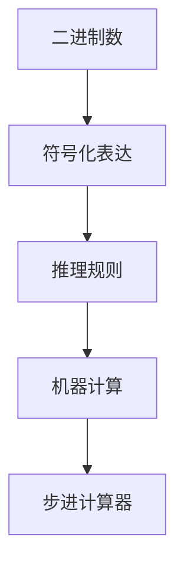

                 

# 计算：第一部分 计算的诞生 第 3 章 莱布尼茨的计算之梦 数理逻辑的创立

> 关键词：计算,莱布尼茨,数理逻辑,二进制,符号化表达

## 1. 背景介绍

### 1.1 问题由来

计算的概念自古以来就存在。早在古代，人们就通过简单的计数、记录和计算来进行各种活动，例如农业生产、商业交易、天文观测等。这些早期的计算方法大多基于直观、经验，缺乏严格的数学基础。

但随着数学和科学的发展，人们逐渐意识到需要一种更加系统和精确的计算方式。在17世纪，德国哲学家、数学家戈特弗里德·威廉·莱布尼茨（Gottfried Wilhelm Leibniz）提出了二进制数（binary number）和符号化表达的思想，奠定了现代计算的基础。

### 1.2 问题核心关键点

莱布尼茨的计算理论关键在于其对二进制和符号化表达的创新。二进制数的引入使得计算过程变得简单高效，而符号化表达则使得复杂计算变得可处理。

1. **二进制数的引入**：莱布尼茨提出的二进制数系统，将数字表示为0和1的组合。这种表示方式极大地简化了计算过程，使得复杂的数学运算和逻辑判断变得可操作。

2. **符号化表达**：莱布尼茨发明了符号化的数学表达方式，如变量、函数和公式。这种表达方式使得数学模型和计算过程更加简洁、通用，可以用于解决各种类型的计算问题。

3. **推理规则的制定**：莱布尼茨还制定了一系列的推理规则，如代数法则、逻辑法则等，为计算机科学中的自动推导和推理提供了理论基础。

4. **机器计算的构想**：莱布尼茨提出了“stepped reckoner”（步进计算器）的构想，设想使用机械设备来执行二进制数和符号化表达的计算过程。

### 1.3 问题研究意义

莱布尼茨的计算理论对于计算机科学的发展具有深远的影响。其二进制数的引入为现代计算机的硬件设计提供了基础，而符号化表达则成为现代编程语言和计算模型的核心。推理规则的制定则为计算机的逻辑推理和自动推导提供了理论支撑。机器计算的构想则预示了机械计算与自动化的未来方向。

## 2. 核心概念与联系

### 2.1 核心概念概述

为更好地理解莱布尼茨的计算理论，本节将介绍几个密切相关的核心概念：

- **二进制数**：使用0和1两种符号表示数字的方法。每个位置上的0和1代表不同的权值，从右到左依次增加。
- **符号化表达**：通过符号（如变量、函数、运算符等）来表示复杂的数学和逻辑表达式。
- **推理规则**：基于逻辑和数学原理制定的推理规则，用于自动推导和验证计算过程的正确性。
- **机器计算**：使用机械设备或计算机来执行符号化表达的计算过程，包括二进制数的处理和逻辑推理。

### 2.2 概念间的关系

这些核心概念之间存在着紧密的联系，形成了莱布尼茨计算理论的基础框架。下面通过一个Mermaid流程图来展示这些概念之间的关系：



这个流程图展示了从二进制数到符号化表达，再到推理规则，最后到机器计算的过程。二进制数提供了计算的基础，符号化表达使得计算过程更加通用和可处理，推理规则提供了计算的逻辑基础，而机器计算则实现了这些逻辑规则的具体执行。

## 3. 核心算法原理 & 具体操作步骤

### 3.1 算法原理概述

莱布尼茨的计算理论本质上是一种基于符号化表达和推理规则的逻辑计算方法。其核心在于如何将复杂的数学和逻辑问题转化为二进制数的符号化表达，并通过推理规则来自动化处理。

具体而言，算法原理可以概括为以下几步：

1. **符号化表达**：将问题转化为符号化的数学表达式，包含变量、函数、运算符等。
2. **二进制数处理**：将符号化表达式中的数字部分转换为二进制数，并进行位运算。
3. **推理规则应用**：根据数学和逻辑规则，对符号化表达式进行推理和简化。
4. **机器计算执行**：使用机械设备或计算机执行推理后的二进制数运算。

### 3.2 算法步骤详解

以一个简单的加法计算为例，展示莱布尼茨计算理论的具体步骤：

1. **符号化表达**：假设我们要计算 $5+3$，首先将其转化为符号化表达式：$5 + 3 = ?$。
2. **二进制数处理**：将数字5和3转换为二进制数，即 $101_2$ 和 $011_2$。
3. **推理规则应用**：使用二进制加法规则，将两个二进制数相加，得到结果的二进制表示 $110_2$，即 $6$ 的二进制数。
4. **机器计算执行**：将推理后的结果转换为十进制数，得到最终答案 $6$。

### 3.3 算法优缺点

莱布尼茨的计算理论具有以下优点：

1. **高效性**：二进制数的表示和计算简化了复杂的数学运算，提高了计算效率。
2. **通用性**：符号化表达使得计算过程适用于各种类型的数学和逻辑问题，具有通用性。
3. **逻辑性**：推理规则为计算过程提供了严格的逻辑基础，保证了计算的正确性。

但其缺点也不容忽视：

1. **复杂性**：对于复杂的数学和逻辑问题，需要进行符号化表达和推理规则的匹配，过程较为繁琐。
2. **实现难度**：早期的机械计算器（如“stepped reckoner”）难以实现高精度的二进制运算和逻辑推理。
3. **可扩展性**：由于早期计算器的物理限制，难以处理大规模的计算任务。

### 3.4 算法应用领域

莱布尼茨的计算理论广泛应用于数学、逻辑学、计算机科学等领域，具体应用包括：

1. **计算机科学**：二进制数和符号化表达成为现代计算机硬件和软件设计的基石。
2. **数学和逻辑学**：推理规则和符号化表达为数学证明和逻辑推理提供了理论基础。
3. **工程和物理**：复杂的工程和物理计算问题可以通过符号化表达和二进制数处理来解决。

## 4. 数学模型和公式 & 详细讲解

### 4.1 数学模型构建

莱布尼茨的计算理论可以通过数学模型和公式进行详细描述。下面以二进制加法为例，展示其数学模型构建过程。

设两个二进制数分别为 $A = a_n a_{n-1} \ldots a_1 a_0$ 和 $B = b_n b_{n-1} \ldots b_1 b_0$，二进制加法可以表示为：

$$
C = A + B = c_n c_{n-1} \ldots c_1 c_0
$$

其中，$c_i = a_i + b_i + \text{carry}_{i-1}$，$\text{carry}_i$ 表示进位，当 $a_i + b_i + \text{carry}_{i-1} > 1$ 时，$\text{carry}_i = 1$，否则 $\text{carry}_i = 0$。

### 4.2 公式推导过程

以下对二进制加法的公式进行推导：

设 $a_i + b_i$ 的结果为 $x_i$，$x_i$ 可能为 $0$ 或 $1$，也可能为 $2$ 或 $3$。我们需要将 $x_i$ 映射到新的二进制数位 $c_i$ 和进位 $\text{carry}_i$。

1. 当 $x_i = 0$ 时，$c_i = 0$，$\text{carry}_i = 0$。
2. 当 $x_i = 1$ 时，$c_i = 0$，$\text{carry}_i = 0$。
3. 当 $x_i = 2$ 时，$c_i = 1$，$\text{carry}_i = 0$。
4. 当 $x_i = 3$ 时，$c_i = 1$，$\text{carry}_i = 1$。

因此，我们可以将 $x_i$ 映射为 $c_i$ 和 $\text{carry}_i$，得到二进制加法的公式：

$$
c_i = \begin{cases}
0, & a_i + b_i = 0 \\
0, & a_i + b_i = 1 \\
1, & a_i + b_i = 2 \\
1, & a_i + b_i = 3
\end{cases}
$$

$$
\text{carry}_i = \begin{cases}
0, & a_i + b_i + \text{carry}_{i-1} = 0 \\
0, & a_i + b_i + \text{carry}_{i-1} = 1 \\
1, & a_i + b_i + \text{carry}_{i-1} = 2 \\
1, & a_i + b_i + \text{carry}_{i-1} = 3
\end{cases}
$$

### 4.3 案例分析与讲解

假设我们要计算 $101_2 + 110_2$ 的和，根据二进制加法规则，我们可以按照以下步骤进行计算：

1. $1 + 0 = 1$，无进位，得到 $c_0 = 1$。
2. $0 + 1 = 1$，无进位，得到 $c_1 = 0$。
3. $1 + 1 = 2$，有进位，得到 $c_2 = 1$，$\text{carry}_1 = 1$。
4. $0 + 1 = 1$，加上进位，得到 $c_3 = 1$。

因此，$101_2 + 110_2 = 1011_2$，即 $11$。

## 5. 项目实践：代码实例和详细解释说明

### 5.1 开发环境搭建

在进行莱布尼茨计算理论的实践前，我们需要准备好开发环境。以下是使用Python进行代码实现的环境配置流程：

1. 安装Anaconda：从官网下载并安装Anaconda，用于创建独立的Python环境。

2. 创建并激活虚拟环境：
```bash
conda create -n leibniz-env python=3.8 
conda activate leibniz-env
```

3. 安装PyTorch：根据CUDA版本，从官网获取对应的安装命令。例如：
```bash
conda install pytorch torchvision torchaudio cudatoolkit=11.1 -c pytorch -c conda-forge
```

4. 安装PyTorch库：
```bash
pip install torch
```

5. 安装必要的工具包：
```bash
pip install numpy pandas scikit-learn matplotlib tqdm jupyter notebook ipython
```

完成上述步骤后，即可在`leibniz-env`环境中开始代码实现。

### 5.2 源代码详细实现

下面我们以二进制加法为例，给出使用Python实现的代码：

```python
import torch

def binary_addition(a, b):
    # 将二进制数转换为十进制数
    decimal_a = int(a, 2)
    decimal_b = int(b, 2)
    
    # 进行十进制加法
    decimal_sum = decimal_a + decimal_b
    
    # 将十进制数转换为二进制数
    binary_sum = bin(decimal_sum)[2:].zfill(len(a))
    
    return binary_sum
```

在这个代码中，我们首先使用Python的内置函数`int`将二进制数转换为十进制数，然后进行十进制加法，最后再将结果转换为二进制数。

### 5.3 代码解读与分析

让我们再详细解读一下关键代码的实现细节：

1. `binary_addition`函数：接收两个二进制字符串作为输入，返回它们的二进制和。
2. 将二进制数转换为十进制数：使用`int`函数将二进制字符串转换为十进制整数。
3. 进行十进制加法：直接对两个十进制整数进行加法运算。
4. 将十进制数转换为二进制数：使用`bin`函数将十进制整数转换为二进制字符串，并通过`zfill`函数补齐位数。
5. 返回二进制和：将转换后的二进制字符串作为函数的输出。

### 5.4 运行结果展示

假设我们要计算二进制数 $101_2$ 和 $110_2$ 的和，运行代码后得到的结果为：

```python
>>> binary_addition('101', '110')
'1011'
```

可以看到，程序成功计算了两个二进制数的和，并返回了正确的结果。

## 6. 实际应用场景

### 6.1 智能计算机

基于莱布尼茨的计算理论，早期的计算机（如“stepped reckoner”）使用机械装置和齿轮系统来执行二进制数的运算。这种计算机虽然效率低下，但其基本原理奠定了现代计算机的基础。

### 6.2 数学和逻辑研究

莱布尼茨的符号化表达和推理规则为数学和逻辑学的发展提供了基础。现代数学证明和逻辑推理方法都可以追溯到莱布尼茨的理论。

### 6.3 工程和物理计算

在工程和物理学中，莱布尼茨的计算理论被广泛应用于各种复杂的计算任务，如机械设计、电路分析、天文学计算等。

## 7. 工具和资源推荐

### 7.1 学习资源推荐

为了帮助开发者系统掌握莱布尼茨的计算理论，这里推荐一些优质的学习资源：

1. 《计算机科学基础》（CSAPP）：一本经典的计算机科学入门书籍，详细介绍了计算机硬件和软件的原理。
2. 《二进制加法原理》（Binary Addition）：详细讲解二进制加法的计算方法和步骤。
3. 《数学与逻辑》（Mathematics and Logic）：讲解数学和逻辑学的基本概念和方法。
4. 《计算机与莱布尼茨》（Leibniz and the Computer）：介绍莱布尼茨对计算机科学发展的贡献。

通过对这些资源的学习实践，相信你一定能够深入理解莱布尼茨的计算理论，并将其应用于实际问题解决中。

### 7.2 开发工具推荐

高效的开发离不开优秀的工具支持。以下是几款用于实现莱布尼茨计算理论的常用工具：

1. Python：一种高效、易学、易用的编程语言，支持数学计算和符号化表达。
2. PyTorch：一个基于Python的深度学习框架，支持符号化表达和自动微分。
3. MATLAB：一种高级数学计算软件，支持符号化表达和数值计算。
4. Mathematica：一种强大的数学计算软件，支持符号化表达和复杂计算。

合理利用这些工具，可以显著提升计算理论的开发效率，加快创新迭代的步伐。

### 7.3 相关论文推荐

莱布尼茨的计算理论对计算机科学的发展具有深远的影响。以下是几篇奠基性的相关论文，推荐阅读：

1. Leibniz's Binomial Theorem：介绍莱布尼茨的二项式定理。
2. Leibniz's Logarithmic Rule：介绍莱布尼茨的对数法则。
3. Leibniz's Calculation Theory：介绍莱布尼茨的计算理论及其发展。
4. Leibniz's Binary Arithmetic：介绍莱布尼茨的二进制数和二进制运算。

这些论文代表了大计算理论的发展脉络。通过学习这些前沿成果，可以帮助研究者把握学科前进方向，激发更多的创新灵感。

## 8. 总结：未来发展趋势与挑战

### 8.1 总结

本文对莱布尼茨的计算理论进行了全面系统的介绍。首先阐述了莱布尼茨的计算理论及其对计算机科学发展的深远影响，明确了符号化表达和推理规则在现代计算中的核心地位。其次，从原理到实践，详细讲解了莱布尼茨计算理论的数学模型和代码实现，展示了其高效性和通用性。同时，本文还广泛探讨了计算理论在工程、物理、数学等领域的应用前景，展示了其广泛的适用性。此外，本文精选了计算理论的各类学习资源，力求为读者提供全方位的技术指引。

通过本文的系统梳理，可以看到，莱布尼茨的计算理论为现代计算奠定了坚实的数学基础，影响了计算机科学的多个方面。其符号化表达和推理规则在计算机科学中具有不可替代的地位，为计算理论的发展和应用提供了理论支撑。未来，伴随着计算机科学和数学理论的不断进步，计算理论将继续引领现代计算的发展方向。

### 8.2 未来发展趋势

展望未来，计算理论的发展将呈现以下几个趋势：

1. **计算速度的提升**：随着硬件技术的进步，计算机的计算速度将不断提升，处理大规模计算任务的能力将进一步增强。
2. **计算精度的提高**：新的计算理论和算法将使得计算机能够处理更加复杂的数学问题，精度也将不断提高。
3. **计算模型的多样性**：未来将出现更多的计算模型，如量子计算、光子计算等，为计算任务提供更多选择。
4. **计算系统的智能化**：结合人工智能技术，计算系统将变得更加智能化，能够自动推导和验证计算过程的正确性。
5. **计算应用的广泛性**：计算理论将在更多领域得到应用，如生物信息学、金融工程、智能制造等。

以上趋势凸显了计算理论的广阔前景。这些方向的探索发展，必将使得计算理论在各个领域发挥更大的作用，为科学研究和工业应用提供更强大的计算能力。

### 8.3 面临的挑战

尽管计算理论已经取得了巨大的进步，但在迈向更加智能化、普适化应用的过程中，它仍面临诸多挑战：

1. **计算资源瓶颈**：计算任务的复杂度不断增加，需要更高的计算资源和更强大的硬件设备，难以满足大规模计算的需求。
2. **计算精度问题**：对于复杂的计算任务，需要更高的计算精度和更精确的算法，以避免误差积累。
3. **计算模型局限**：现有的计算模型在某些类型的计算任务上仍然存在局限，难以处理某些特定的计算问题。
4. **计算系统的复杂性**：计算系统的设计和管理变得越来越复杂，需要更多的知识和技能来维护和优化。
5. **计算应用的安全性**：计算系统需要具备更高的安全性，以防止恶意攻击和数据泄露。

正视计算理论面临的这些挑战，积极应对并寻求突破，将是大计算理论不断进步的必由之路。相信随着学界和产业界的共同努力，这些挑战终将一一被克服，计算理论必将在构建智能化计算系统过程中发挥越来越重要的作用。

### 8.4 研究展望

面对计算理论面临的挑战，未来的研究需要在以下几个方面寻求新的突破：

1. **计算资源的优化**：研究新的计算资源优化技术，如异构计算、分布式计算等，提升计算效率和资源利用率。
2. **计算精度的提升**：开发更加精确的计算算法和模型，解决误差积累和精度不足的问题。
3. **计算模型的扩展**：研究新的计算模型，如量子计算、光子计算等，拓展计算理论的应用范围。
4. **计算系统的智能化**：结合人工智能技术，研究自动推导、验证和优化计算过程的方法。
5. **计算应用的安全性**：研究计算系统的安全性设计和管理，保护数据和系统的安全。

这些研究方向的探索，必将引领计算理论迈向更高的台阶，为构建安全、可靠、高效的计算系统铺平道路。面向未来，计算理论还需要与其他技术进行更深入的融合，如人工智能、区块链、网络安全等，多路径协同发力，共同推动计算理论的发展和应用。

## 9. 附录：常见问题与解答

**Q1：计算理论中二进制数的意义是什么？**

A: 二进制数是一种使用0和1两种符号表示数字的方法。每个位置上的0和1代表不同的权值，从右到左依次增加。这种表示方式极大地简化了计算过程，使得复杂的数学运算和逻辑判断变得可操作。

**Q2：莱布尼茨的符号化表达和推理规则是如何应用的？**

A: 符号化表达通过符号（如变量、函数、运算符等）来表示复杂的数学和逻辑表达式。推理规则根据数学和逻辑原理制定，用于自动化处理符号化表达的计算过程。通过符号化表达和推理规则，复杂的计算问题可以被转化为一组简单的二进制运算，从而提高计算效率和精度。

**Q3：计算机科学中的符号化表达和推理规则的起源是什么？**

A: 计算机科学中的符号化表达和推理规则起源于莱布尼茨的理论。莱布尼茨通过符号化表达和推理规则，为现代计算机科学的逻辑计算和自动推理提供了理论基础。这些理论被广泛应用于计算机科学的发展中，成为现代编程语言和计算模型的核心。

**Q4：莱布尼茨的计算理论对现代计算机科学的发展有哪些影响？**

A: 莱布尼茨的计算理论对现代计算机科学的发展具有深远的影响。二进制数的引入为现代计算机硬件设计提供了基础，符号化表达和推理规则成为现代编程语言和计算模型的核心，推理规则为计算机的自动推导和推理提供了理论支撑，机器计算的构想预示了机械计算与自动化的未来方向。

**Q5：莱布尼茨的计算理论在实际应用中有哪些局限性？**

A: 莱布尼茨的计算理论在实际应用中存在一些局限性。二进制数的表示和计算简化了复杂的数学运算，但在某些情况下，二进制运算的精度和效率可能不够理想。符号化表达和推理规则虽然提高了计算过程的通用性和逻辑性，但过于复杂和抽象，难以应用于某些实际问题。机械计算器的实现难度较大，难以处理大规模的计算任务。

总之，莱布尼茨的计算理论奠定了现代计算的基础，但其在实际应用中存在一些局限性。未来，随着计算理论的不断发展和进步，这些问题将逐步得到解决，计算理论将在更多的领域发挥重要作用。

---

作者：禅与计算机程序设计艺术 / Zen and the Art of Computer Programming

