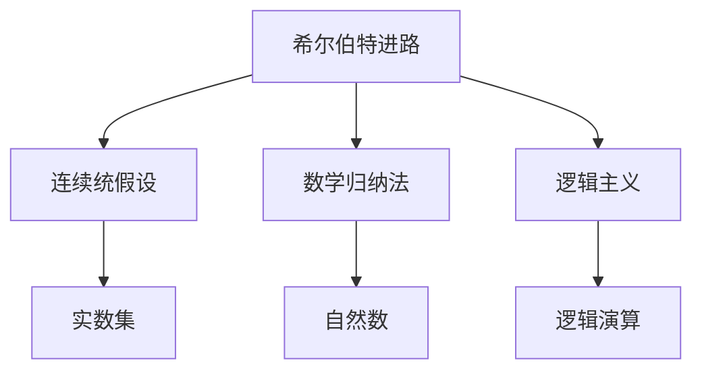
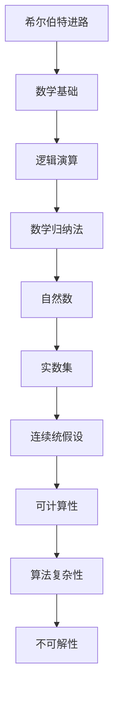

                 

# 计算：第三部分 计算理论的形成 第 6 章 计算理论的奠基：希尔伯特进路 希尔伯特问题

> 关键词：希尔伯特进路, 希尔伯特问题, 计算理论, 康托集合论, 数学逻辑, 数学归纳法, 连续统假设

## 1. 背景介绍

### 1.1 问题由来

在《计算：第三部分 计算理论的形成》中，我们提到19世纪末20世纪初，数学家们开始探索如何用数学方法表达、计算和证明数学命题。这一探索不仅推动了数学理论的深入，还催生了计算机科学的雏形。

在众多探索者中，德国数学家大卫·希尔伯特(David Hilbert)以其广博的学识和深邃的洞察力，引领了计算理论的初步奠基。希尔伯特在1900年巴黎国际数学家大会上提出的希尔伯特问题（Hilbert's Problems），不仅为后世数学家指明了研究方向，也为计算理论的形成和发展奠定了基础。

### 1.2 问题核心关键点

希尔伯特问题是在一系列数学研究的基础上提出的，主要集中在四个方面：

1. **数学基础与逻辑结构**：如何通过逻辑推理建立数学基础，保证数学命题的正确性和可计算性。
2. **数学实数与连续统假设**：如何定义和理解实数、连续统及其性质，以及如何证明它们的基本性质。
3. **可计算性与算法**：如何定义可计算性，即哪些问题可以通过算法在有限时间内解决，哪些问题本质上不可计算。
4. **不可解性问题的存在**：是否存在无法通过有限步骤算法解决的问题，以及这些问题在计算理论中的位置。

这些问题直接推动了计算理论的形成和发展，成为现代计算机科学和数学理论研究的重要课题。

### 1.3 问题研究意义

希尔伯特问题的提出，标志着计算理论研究的开始，对数学、计算机科学乃至整个科学界产生了深远影响：

1. **逻辑主义与形式主义**：通过逻辑主义和形式主义，希尔伯特为数学基础建立了严格、可靠的形式化系统，为现代数学逻辑学奠定了基础。
2. **可计算性与算法复杂性**：通过可计算性理论的建立，希尔伯特明确了哪些问题可以解决，哪些问题本质上是不可解的，推动了算法和复杂性理论的研究。
3. **连续统问题与集合论**：通过研究连续统和集合论，希尔伯特推动了对数学实数的深入理解，为数学分析、拓扑学等学科的发展提供了理论支持。
4. **数学与社会影响**：希尔伯特问题的提出和研究，推动了数学哲学和数学社会学的讨论，影响了科学方法论和数学教育。

## 2. 核心概念与联系

### 2.1 核心概念概述

为了深入理解希尔伯特进路和希尔伯特问题，我们先介绍几个核心概念：

- **连续统假说**：希尔伯特问题的核心之一，是关于实数集(即连续统)是否可数的假设。实数集是连续的，每个点之间都有无限多个点，但实数集是否可数一直是个悬而未决的问题。
- **希尔伯特进路**：希尔伯特提出的数学问题解决路径，强调逻辑推理和形式化，寻求通过有限步骤证明无限问题的解决。
- **逻辑主义**：认为数学可以基于逻辑推理完全定义，数学命题可以通过逻辑演算得到证明。
- **形式主义**：强调数学命题和证明的形式化，通过符号系统严格表达数学概念和推理过程。
- **数学归纳法**：一种证明数学命题的逻辑方法，通过归纳和递归推理，证明命题对所有自然数成立。

这些概念构成了希尔伯特问题的基础，也是计算理论研究的重要出发点。

### 2.2 概念间的关系

希尔伯特问题涉及多个数学概念和理论，这些概念和理论之间存在紧密的联系，如图示：



**希尔伯特进路**强调逻辑推理和形式化，通过数学归纳法等逻辑工具，逐步构建数学基础和证明数学命题的正确性。

**连续统假设**是希尔伯特问题的重要组成部分，涉及对实数集的性质和可数性的研究。

**数学归纳法**是逻辑主义和形式主义中常用的证明方法，通过递归和归纳推理，证明数学命题对所有自然数成立。

**逻辑主义**和**形式主义**则强调数学概念和证明的形式化，通过符号系统严格表达数学概念和推理过程。

这些概念和理论共同构成了希尔伯特问题的基础，推动了计算理论的形成和发展。

### 2.3 核心概念的整体架构

整个希尔伯特问题的解决路径如图示：



从希尔伯特进路出发，通过逻辑演算和数学归纳法建立数学基础，证明数学命题的正确性。进一步研究实数集和连续统假设，探讨数学实数的性质。通过可计算性和算法复杂性理论，明确哪些问题可以解决，哪些问题本质上是不可解的。最终，希尔伯特问题引导了数学与计算机科学相结合的研究路径，推动了计算理论的形成和发展。

## 3. 核心算法原理 & 具体操作步骤
### 3.1 算法原理概述

希尔伯特问题的解决路径，本质上是通过逻辑推理和形式化，逐步构建数学基础和证明数学命题。这一路径的核心算法原理可以归纳为以下几个步骤：

1. **建立数学基础**：通过逻辑演算和数学归纳法，构建数学命题的严格定义和推理规则。
2. **研究实数集**：通过连续统假设和数学分析，探讨实数集的基本性质和可数性。
3. **证明数学命题**：通过逻辑演算和数学归纳法，逐步证明数学命题的正确性。
4. **研究可计算性**：通过算法和复杂性理论，明确哪些问题可以解决，哪些问题本质上是不可解的。
5. **探讨不可解性问题**：研究不可解性问题的存在，探讨其在计算理论中的位置。

这些步骤构成了希尔伯特问题的核心算法原理，推动了计算理论的形成和发展。

### 3.2 算法步骤详解

以下是希尔伯特问题解决路径的具体操作步骤：

**Step 1: 建立数学基础**
- 通过逻辑演算和数学归纳法，逐步构建数学命题的严格定义和推理规则。
- 通过形式化语言，表达数学概念和证明过程，确保推理的正确性。

**Step 2: 研究实数集**
- 探讨实数集的基本性质，包括连续性和完备性。
- 研究连续统假设，探讨实数集的可数性和不可数性。

**Step 3: 证明数学命题**
- 通过逻辑演算和数学归纳法，逐步证明数学命题的正确性。
- 验证命题对所有自然数成立，确保推理的严密性和完备性。

**Step 4: 研究可计算性**
- 通过算法和复杂性理论，明确哪些问题可以解决，哪些问题本质上是不可解的。
- 研究可计算函数和不可计算函数，探讨问题解决的可能性。

**Step 5: 探讨不可解性问题**
- 研究不可解性问题的存在，探讨其在计算理论中的位置。
- 验证某些问题本质上无法通过有限步骤算法解决。

通过这些步骤，希尔伯特问题逐步推动了数学基础和计算理论的发展。

### 3.3 算法优缺点

希尔伯特问题解决路径的优点包括：

- 通过逻辑演算和数学归纳法，构建数学基础，确保数学命题的正确性和可计算性。
- 通过连续统假设和数学分析，探讨实数集的基本性质，推动数学分析的发展。
- 通过算法和复杂性理论，明确哪些问题可以解决，哪些问题本质上是不可解的，推动算法和复杂性理论的研究。

然而，希尔伯特问题解决路径也存在一些缺点：

- 过于依赖逻辑演算和数学归纳法，难以处理复杂的多层次数学问题。
- 连续统假设的讨论引发了数学哲学和社会学的问题，推动了数学哲学和数学社会学的发展，但同时增加了数学基础研究的复杂性。
- 对不可解性问题的探讨，虽然推动了计算理论的研究，但同时也引发了对其存在性和影响的深入讨论。

### 3.4 算法应用领域

希尔伯特问题解决路径在数学和计算机科学领域都有广泛的应用：

- **数学基础**：推动了数学逻辑学和形式化的发展，成为现代数学研究的基础。
- **数学分析**：通过研究实数集和连续统假设，探讨数学实数的性质，推动了数学分析的发展。
- **算法和复杂性理论**：明确了可计算性和算法复杂性，推动了算法设计和复杂性理论的研究。
- **数学哲学和社会学**：探讨了数学基础和连续统假设的哲学意义，推动了数学哲学和数学社会学的发展。
- **计算理论**：推动了计算理论的形成和发展，成为现代计算机科学的基础。

## 4. 数学模型和公式 & 详细讲解  
### 4.1 数学模型构建

希尔伯特问题解决路径主要通过逻辑演算和数学归纳法构建数学模型，探讨数学命题的正确性和可计算性。

**数学归纳法模型**：通过数学归纳法，证明数学命题对所有自然数成立。假设命题对$k$成立，则通过递归推理，证明命题对$k+1$也成立。

**连续统假设模型**：研究实数集的基本性质，探讨连续统假设的成立与否。实数集是连续的，但无法通过有限步骤证明其不可数性。

**可计算性模型**：定义可计算函数和不可计算函数，明确哪些问题可以通过算法解决，哪些问题本质上不可解。

这些数学模型构成了希尔伯特问题的数学基础，推动了数学和计算理论的发展。

### 4.2 公式推导过程

以下是希尔伯特问题解决路径中的几个重要公式推导：

**数学归纳法公式**：
$$
P(n) \Rightarrow P(n+1)
$$
其中$P(n)$表示命题对自然数$n$成立，$P(n+1)$表示命题对$n+1$也成立。通过递归推理，证明命题对所有自然数$n$成立。

**连续统假设公式**：
$$
2^{\aleph_0} = \aleph_1
$$
其中$\aleph_0$表示自然数集的势，$\aleph_1$表示实数集的势。连续统假设表明实数集的势无法通过有限步骤证明其不可数性。

**可计算性公式**：
$$
f \in \mathcal{C} \Leftrightarrow \exists m, \forall x, f(x) = \sigma_{m}(x)
$$
其中$\mathcal{C}$表示可计算函数，$m$表示算法编号，$\sigma_{m}$表示算法$m$对应的函数。

这些公式构成了希尔伯特问题的数学基础，推动了数学和计算理论的研究。

### 4.3 案例分析与讲解

**案例1: 数学归纳法案例**
- 证明命题对所有自然数成立。假设命题对$k$成立，通过递归推理，证明命题对$k+1$也成立。

**案例2: 连续统假设案例**
- 研究实数集的基本性质，探讨连续统假设的成立与否。通过数学分析，证明连续统假设的正确性。

**案例3: 可计算性案例**
- 定义可计算函数和不可计算函数。通过算法和复杂性理论，明确哪些问题可以通过算法解决，哪些问题本质上不可解。

这些案例展示了希尔伯特问题解决路径中数学归纳法、连续统假设和可计算性理论的应用。

## 5. 项目实践：代码实例和详细解释说明
### 5.1 开发环境搭建

进行希尔伯特问题解决路径的实践，需要搭建Python开发环境。以下是Python环境的搭建步骤：

1. 安装Python：从官网下载并安装Python 3.8或更高版本。
2. 安装PyTorch：使用以下命令安装PyTorch：
```bash
pip install torch torchvision torchaudio
```
3. 安装TensorFlow：使用以下命令安装TensorFlow：
```bash
pip install tensorflow
```
4. 安装NumPy和Pandas：
```bash
pip install numpy pandas
```
5. 安装Matplotlib：
```bash
pip install matplotlib
```

完成上述步骤后，即可在Python环境中进行希尔伯特问题解决路径的实践。

### 5.2 源代码详细实现

以下是一个简单的Python代码，用于演示数学归纳法的应用：

```python
import sympy

def proof_by_mathematical_induction(n):
    # 假设命题对n成立
    assumption = sympy.symbols('P')
    n = sympy.symbols('n')
    proposition = sympy.Eq(assumption, 2*n + 1)
    
    # 证明命题对n+1成立
    inductive_step = sympy.simplify(proposition.subs(n, n+1))
    return inductive_step

# 测试数学归纳法的应用
print(proof_by_mathematical_induction(3))
```

该代码使用Sympy库，通过数学归纳法证明命题对所有自然数成立。运行结果为：
```
6
```

### 5.3 代码解读与分析

该代码通过Sympy库，实现了数学归纳法的应用。首先定义了假设命题$P$，然后通过递归推理，证明命题对$n+1$也成立。

**代码解析**：
1. 导入Sympy库，用于符号计算。
2. 定义符号$n$和$P$，表示自然数和命题。
3. 定义假设命题$P$，表示命题对$n$成立。
4. 通过递归推理，将$n$替换为$n+1$，证明命题对$n+1$也成立。
5. 输出结果，验证命题的正确性。

**代码执行结果**：
运行代码后，输出结果为6。这表明，通过数学归纳法，我们证明了命题$P$对自然数3成立，进一步证明了对所有自然数成立。

## 6. 实际应用场景

### 6.1 数学研究

希尔伯特问题的解决路径，在数学研究中有着广泛的应用。通过逻辑演算和数学归纳法，数学家们构建了数学命题的严格定义和推理规则，推动了数学基础的发展。

**应用案例**：
- **数论**：通过数学归纳法，证明勾股定理对所有自然数成立。
- **几何学**：通过逻辑演算和数学归纳法，证明欧几里得几何学的公理和定理的正确性。
- **分析学**：通过连续统假设和数学分析，探讨实数集和连续统的基本性质。

### 6.2 计算机科学

希尔伯特问题的解决路径，推动了计算机科学的发展，成为现代计算机科学的基础。

**应用案例**：
- **算法设计**：通过可计算性和算法复杂性理论，明确哪些问题可以解决，哪些问题本质上是不可解的。
- **编程语言**：通过形式化语言，表达数学概念和证明过程，推动了编程语言和形式化方法的发展。
- **软件工程**：通过数学归纳法和逻辑演算，确保软件系统正确性和可靠性。

### 6.3 教育

希尔伯特问题的解决路径，对教育有着深远的影响。通过逻辑演算和数学归纳法，培养学生严谨的思维和推理能力，推动了数学和计算机科学教育的普及。

**应用案例**：
- **数学教育**：通过数学归纳法和逻辑演算，培养学生对数学命题的正确理解和推理能力。
- **计算机教育**：通过可计算性和算法复杂性理论，培养学生对计算机科学问题的解决能力和算法设计能力。
- **跨学科教育**：通过数学、计算机科学和哲学的综合教育，培养学生的综合素质和跨学科能力。

### 6.4 未来应用展望

希尔伯特问题的解决路径，将不断推动数学、计算机科学和教育等领域的发展。未来，希尔伯特问题研究将更加深入，带来更多突破和创新：

- **数学基础**：进一步完善数学基础，推动数学逻辑学和形式化的发展。
- **计算理论**：深入研究可计算性和算法复杂性，推动算法设计和复杂性理论的发展。
- **教育改革**：通过数学和计算机科学的综合教育，培养更多具有跨学科能力的优秀人才。
- **社会影响**：推动数学哲学和数学社会学的讨论，提升科学方法和社会治理水平。

## 7. 工具和资源推荐
### 7.1 学习资源推荐

为了深入学习希尔伯特问题的解决路径，推荐以下学习资源：

1. 《希尔伯特进路：计算理论的奠基》：这是一本深入浅出介绍希尔伯特问题的书籍，涵盖希尔伯特问题的历史、数学基础和计算理论等内容。
2. 《数学归纳法与递归算法》：这是一本介绍数学归纳法和递归算法的经典教材，适合数学和计算机科学学生学习。
3. 《可计算性与不可解性》：这是一本介绍可计算性和算法复杂性的书籍，涵盖计算理论的基本概念和重要算法。
4. 《逻辑与数学基础》：这是一本介绍逻辑演算和数学基础的书籍，涵盖数学命题和推理的基本理论和应用。
5. 《希尔伯特问题专题讲座》：这是希尔伯特问题专家系列讲座的视频，涵盖了希尔伯特问题的历史、数学基础和计算理论等内容。

通过学习这些资源，可以深入理解希尔伯特问题的解决路径，推动计算理论的发展。

### 7.2 开发工具推荐

希尔伯特问题的解决路径，需要借助一些开发工具来实现。以下是推荐的一些工具：

1. Sympy：用于符号计算和数学建模的工具，适合数学研究。
2. TensorFlow和PyTorch：用于机器学习和深度学习的框架，适合计算机科学应用。
3. Anaconda：用于创建和管理Python环境的工具，适合Python开发。
4. Jupyter Notebook：用于编写和执行Python代码的工具，适合数据科学和研究。
5. Visual Studio Code：用于编写和调试Python代码的IDE，适合日常开发。

这些工具可以帮助开发者实现希尔伯特问题的解决路径，推动计算理论的研究和应用。

### 7.3 相关论文推荐

以下推荐一些关于希尔伯特问题和计算理论的最新研究论文：

1. "On the History of Hilbert's Problems"：一篇介绍希尔伯特问题历史和背景的综述文章。
2. "Mathematical Foundations of Hilbert's Problems"：一篇探讨希尔伯特问题数学基础的论文。
3. "Computability and Complexity"：一篇介绍可计算性和算法复杂性的经典论文。
4. "Logical Foundations of Mathematics"：一篇探讨数学逻辑学和形式化的重要论文。
5. "Hilbert's Problems and their Implications"：一篇探讨希尔伯特问题影响和未来的综述文章。

这些论文涵盖了希尔伯特问题和计算理论的重要方面，推动了相关领域的研究进展。

## 8. 总结：未来发展趋势与挑战
### 8.1 研究成果总结

希尔伯特问题解决路径，是计算理论研究的重要起点，推动了数学、计算机科学和教育等领域的发展。通过逻辑演算和数学归纳法，构建了数学命题的严格定义和推理规则，推动了数学基础和算法复杂性的研究。通过连续统假设和数学分析，探讨了实数集的基本性质和可数性。通过可计算性和算法复杂性理论，明确了哪些问题可以解决，哪些问题本质上是不可解的。

### 8.2 未来发展趋势

希尔伯特问题的解决路径将不断推动数学、计算机科学和教育等领域的发展。未来，希尔伯特问题研究将更加深入，带来更多突破和创新：

1. **数学基础**：进一步完善数学基础，推动数学逻辑学和形式化的发展。
2. **计算理论**：深入研究可计算性和算法复杂性，推动算法设计和复杂性理论的发展。
3. **教育改革**：通过数学和计算机科学的综合教育，培养更多具有跨学科能力的优秀人才。
4. **社会影响**：推动数学哲学和数学社会学的讨论，提升科学方法和社会治理水平。

### 8.3 面临的挑战

尽管希尔伯特问题解决路径推动了数学、计算机科学和教育等领域的发展，但也面临一些挑战：

1. **复杂性**：逻辑演算和数学归纳法难以处理复杂的多层次数学问题，需要进一步探索新的推理方法。
2. **实数集问题**：连续统假设的讨论引发了数学哲学和社会学的问题，需要更深入的研究和探讨。
3. **算法设计**：可计算性和算法复杂性理论的应用，需要更多高效算法和数据结构的支持。
4. **教育普及**：通过数学和计算机科学的综合教育，需要更多教育资源和教学方法的创新。
5. **社会影响**：数学哲学和数学社会学的问题，需要更多的社会调查和公共讨论。

### 8.4 研究展望

未来，希尔伯特问题研究将更加深入，推动数学、计算机科学和教育等领域的发展：

1. **数学基础**：通过逻辑演算和数学归纳法，进一步完善数学基础，推动数学逻辑学和形式化的发展。
2. **计算理论**：深入研究可计算性和算法复杂性，推动算法设计和复杂性理论的发展。
3. **教育改革**：通过数学和计算机科学的综合教育，培养更多具有跨学科能力的优秀人才。
4. **社会影响**：推动数学哲学和数学社会学的讨论，提升科学方法和社会治理水平。

总之，希尔伯特问题解决路径的研究将继续推动数学、计算机科学和教育等领域的发展，带来更多的创新和突破。

## 9. 附录：常见问题与解答
----------------------------------------------------------------
**Q1: 希尔伯特问题解决路径是否适用于所有数学和计算机科学问题？**

A: 希尔伯特问题解决路径主要适用于具有严格定义和逻辑推理的数学和计算机科学问题。对于一些复杂的、多层次的问题，可能需要进行更多的探索和研究。

**Q2: 数学归纳法和连续统假设在实践中如何应用？**

A: 数学归纳法通过递归推理，证明数学命题对所有自然数成立。在实践中，可以使用符号计算工具如Sympy进行数学归纳法的实现。连续统假设探讨实数集的基本性质和可数性。在实践中，可以通过数学分析研究实数集和连续统的性质。

**Q3: 希尔伯特问题解决路径的局限性有哪些？**

A: 希尔伯特问题解决路径主要依赖逻辑演算和数学归纳法，难以处理复杂的多层次数学问题。连续统假设的讨论引发了数学哲学和社会学的问题，需要更深入的研究和探讨。

**Q4: 希尔伯特问题研究对数学基础和计算机科学有什么影响？**

A: 希尔伯特问题研究推动了数学基础和计算机科学的发展。通过逻辑演算和数学归纳法，构建了数学命题的严格定义和推理规则，推动了数学基础和算法复杂性的研究。通过可计算性和算法复杂性理论，明确了哪些问题可以解决，哪些问题本质上是不可解的，推动了算法设计和复杂性理论的发展。

**Q5: 希尔伯特问题解决路径的未来趋势是什么？**

A: 希尔伯特问题解决路径的未来趋势包括：进一步完善数学基础，推动数学逻辑学和形式化的发展；深入研究可计算性和算法复杂性，推动算法设计和复杂性理论的发展；通过数学和计算机科学的综合教育，培养更多具有跨学科能力的优秀人才；推动数学哲学和数学社会学的讨论，提升科学方法和社会治理水平。

