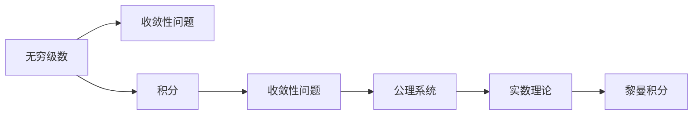
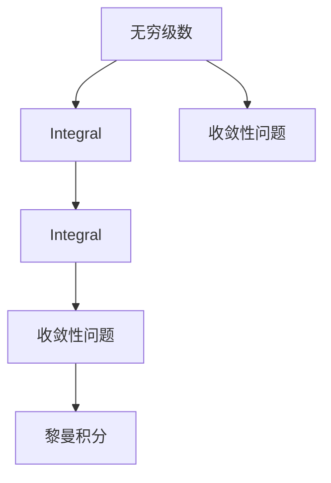
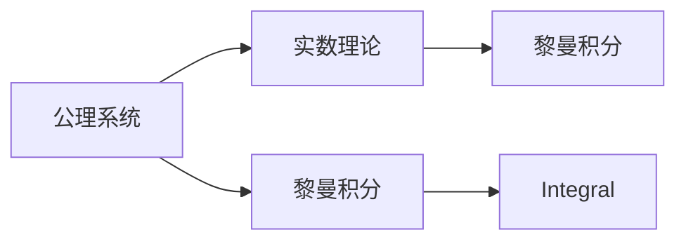
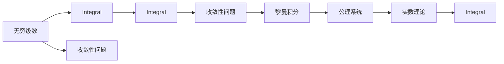

                 

# 计算：第二部分 计算的数学基础 第 4 章 数学的基础 第二次数学危机

## 1. 背景介绍

### 1.1 问题由来

数学的诞生和发展，离不开对自然界和人类社会的深刻洞察。从古代算数到现代数学，人类对计算的理解和应用一直在不断演进。然而，在数学的历史长河中，曾经历过两次数学危机，这些危机不仅对数学本身造成了巨大冲击，也对社会的科技发展和人类思维的进步产生了深远影响。

第一次数学危机发生在公元2世纪，代表人物是古希腊哲学家安尼乌斯·克尔斯（Anninus Chrysos）。他发现了一种被称为“连续量”（Continua）的理论，认为空间和时间的连续性可以通过数学模型来精确描述。这一理论在当时引发了广泛争论，最终导致了对传统几何理论的重新审视，奠定了后续数学的发展基础。

第二次数学危机则发生在19世纪，代表人物是贝塞尔（Carl Friedrich Gauss）和黎曼（Bernhard Riemann）。这次危机的核心问题是数学基础的可靠性。贝塞尔提出了复数分析的公理系统，黎曼则深入探讨了无穷级数和积分的收敛性问题。这些问题引发了关于数学概念和逻辑推理的深刻思考，推动了数学理论体系的完善和发展。

本章节将探讨数学的第二次危机，特别是对计算和数学基础的影响。通过理解这次危机的背景和内容，我们可以更好地把握数学的演进路径，认识计算的本质和价值。

### 1.2 问题核心关键点

数学的第二次危机主要集中在对无穷级数和积分收敛性的探讨上。无穷级数（ Infinite Series）和积分（ Integrals）是数学中极其重要的工具，广泛应用于物理、工程、经济学等领域。然而，如何确保这些级数和积分的收敛性，避免产生不合理的结果，成为了数学家们需要解决的核心问题。

这一问题的核心在于：如何确定无穷级数和积分的收敛条件，确保其结果具有合理的数学意义。数学家们通过提出不同的公理系统和逻辑推理方法，逐渐解决这一危机，形成了现代数学的基石。

### 1.3 问题研究意义

数学的第二次危机揭示了数学基础理论的脆弱性和不确定性，促使数学家们重新审视和构建数学体系，推动了数学理论和实践的不断进步。

- **理论完善**：危机促使数学家们提出新的公理系统，如黎曼积分、实数理论等，为数学的后续发展奠定了坚实基础。
- **方法创新**：数学家们探索出新的数学工具和方法，如傅里叶变换、微积分等，极大地拓展了数学的应用范围。
- **思想升华**：危机引发了对数学概念和逻辑推理的深刻思考，促进了数学哲学的发展，推动了对数学本质和价值的进一步认识。

## 2. 核心概念与联系

### 2.1 核心概念概述

为更好地理解数学的第二次危机，本节将介绍几个密切相关的核心概念：

- **无穷级数**：指一个无穷项的和，如 $1 + \frac{1}{2} + \frac{1}{4} + \cdots$。无穷级数的收敛性问题是数学研究的重要内容。
- **积分**：表示函数在某区间上的积分值，是微积分的重要组成部分。积分的收敛性问题同样引起数学家的关注。
- **公理系统**：数学体系的基础，通过一组公理和推理规则构建。黎曼和魏尔斯特拉斯（Weierstrass）等数学家提出了实数理论的公理系统。
- **实数**：表示无穷小和无穷大之间的一个数学概念，是现代数学的基础。实数的性质和构造问题是第二次数学危机的核心。
- **黎曼积分**：由黎曼提出的一种积分理论，通过定义区间上的分段函数来逼近连续函数。

这些核心概念之间的逻辑关系可以通过以下Mermaid流程图来展示：



这个流程图展示了大数学危机中的关键概念及其之间的关系：

1. 无穷级数和积分的收敛性问题引发了对数学基础理论的重新思考。
2. 公理系统是构建数学理论体系的基础。
3. 实数理论的提出和完善是解决收敛性问题的关键。
4. 黎曼积分是一种基于公理系统的积分理论。

这些概念共同构成了数学的第二次危机背景，推动了数学理论的进一步发展。

### 2.2 概念间的关系

这些核心概念之间存在着紧密的联系，形成了数学的第二次危机生态系统。下面我通过几个Mermaid流程图来展示这些概念之间的关系。

#### 2.2.1 无穷级数与积分



这个流程图展示了无穷级数与积分的关联：

1. 无穷级数的收敛性问题引入了积分概念。
2. 积分的收敛性问题同样重要。
3. 黎曼积分是解决积分收敛性问题的关键。

#### 2.2.2 公理系统与实数理论



这个流程图展示了公理系统与实数理论的关联：

1. 公理系统是构建实数理论的基础。
2. 实数理论提供了黎曼积分的数学基础。
3. 实数的性质和构造是解决无穷级数和积分收敛性问题的关键。

#### 2.2.3 实数理论的公理化


这个流程图展示了实数理论的公理化：

1. 公理系统是实数理论的构建基础。
2. 实数理论提供了黎曼积分的数学基础。
3. 实数的性质和构造是解决无穷级数和积分收敛性问题的关键。

### 2.3 核心概念的整体架构

最后，我们用一个综合的流程图来展示这些核心概念在大数学危机中的整体架构：



这个综合流程图展示了从无穷级数到黎曼积分，再到公理系统和实数理论的整体架构：

1. 无穷级数的收敛性问题引发了对数学基础理论的重新思考。
2. 公理系统是构建数学理论体系的基础。
3. 实数理论的提出和完善是解决无穷级数和积分收敛性问题的关键。
4. 黎曼积分是一种基于公理系统的积分理论。

通过这些流程图，我们可以更清晰地理解数学的第二次危机过程中各个核心概念的关系和作用，为后续深入讨论具体的数学方法和技术奠定基础。

## 3. 核心算法原理 & 具体操作步骤
### 3.1 算法原理概述

数学的第二次危机主要集中在对无穷级数和积分收敛性的探讨上。其核心思想是：通过构建实数理论，定义无穷级数和积分的公理系统，从而确保这些级数和积分的收敛性。

形式化地，假设无穷级数为 $S = \sum_{n=1}^{\infty} a_n$，其中 $a_n$ 为第 $n$ 项。我们希望找到条件，使得 $S$ 收敛。此时定义 $S$ 的收敛性为：

$$
\sum_{n=1}^{\infty} a_n \text{ 收敛} \Leftrightarrow \lim_{n \to \infty} \sum_{k=1}^{n} a_k = S
$$

类似地，对于积分 $\int_{a}^{b} f(x) \, dx$，我们需要找到使得积分收敛的条件。此时定义 $f(x)$ 在区间 $[a, b]$ 上的积分的收敛性为：

$$
\int_{a}^{b} f(x) \, dx \text{ 收敛} \Leftrightarrow \lim_{n \to \infty} \sum_{i=1}^{n} \left[ \sum_{j=1}^{m} f(x_j_i) \Delta x_j_i \right] = \int_{a}^{b} f(x) \, dx
$$

其中 $\Delta x_j_i$ 为区间划分。

### 3.2 算法步骤详解

解决无穷级数和积分的收敛性问题，一般包括以下几个关键步骤：

**Step 1: 构建实数理论**

- 定义实数 $\mathbb{R}$ 的公理系统，包括：
  - 存在性公理：存在一个不可数无穷集合 $\mathbb{R}$。
  - 封闭性公理：$\mathbb{R}$ 满足加法和乘法运算的封闭性。
  - 完备性公理：任意两个实数间都有最大下界和最小上界。
  - 有序性公理：满足传递性、自反性和反对称性。

**Step 2: 定义无穷级数**

- 对无穷级数 $\sum_{n=1}^{\infty} a_n$ 进行定义，并研究其收敛性。
- 使用柯西收敛准则：若无穷级数 $\sum_{n=1}^{\infty} a_n$ 满足 $\lim_{n \to \infty} \sum_{k=1}^{n} a_k = S$，则称 $S$ 收敛。

**Step 3: 研究积分**

- 定义函数 $f(x)$ 在区间 $[a, b]$ 上的积分，并研究其收敛性。
- 使用黎曼积分：若积分 $\int_{a}^{b} f(x) \, dx$ 满足 $\lim_{n \to \infty} \sum_{i=1}^{n} \left[ \sum_{j=1}^{m} f(x_j_i) \Delta x_j_i \right] = \int_{a}^{b} f(x) \, dx$，则称积分收敛。

**Step 4: 推导收敛条件**

- 利用公理系统，推导无穷级数和积分的收敛条件。
- 例如，柯西收敛准则的证明：若 $a_n > 0$，则 $\sum_{n=1}^{\infty} a_n$ 收敛 $\Leftrightarrow \lim_{n \to \infty} \sum_{k=1}^{n} a_k = S$。

**Step 5: 应用案例分析**

- 通过具体案例，验证收敛条件和推导结果。
- 例如，计算级数 $1 + \frac{1}{2} + \frac{1}{4} + \cdots$ 的收敛性，验证 $\sum_{n=1}^{\infty} \frac{1}{2^n}$ 的收敛条件。

### 3.3 算法优缺点

解决无穷级数和积分的收敛性问题的算法具有以下优点：

- **理论完备**：通过构建实数理论，解决了无穷级数和积分的收敛性问题，形成了完整的数学体系。
- **普适性强**：该方法适用于各种类型的无穷级数和积分，能够处理复杂的数学问题。
- **推导严谨**：使用公理系统和严格推理，确保了推导过程的严谨性和正确性。

同时，该方法也存在一定的局限性：

- **计算复杂**：部分收敛条件和推导过程较为复杂，需要较高的数学功底。
- **适用范围有限**：对于部分特殊的无穷级数和积分，收敛条件可能难以直接推导。
- **依赖性高**：收敛性问题依赖于实数理论的完备性，如果公理系统不严谨，可能导致推导错误。

尽管存在这些局限性，但该方法仍然是大数学危机中解决无穷级数和积分收敛性问题的主要手段，具有重要的理论价值和实践意义。

### 3.4 算法应用领域

解决无穷级数和积分的收敛性问题的算法在数学的多个领域都有广泛应用：

- **微积分**：通过研究无穷级数和积分的收敛性，深入探讨微积分的各项概念和定理。
- **分析学**：分析学研究函数的性质和计算，无穷级数和积分是重要工具。
- **概率论**：通过研究无穷级数和积分，推导概率分布和期望值。
- **物理**：物理学中广泛应用无穷级数和积分，研究波动、热力学等问题。

除了上述这些应用领域，无穷级数和积分的收敛性问题还影响着数学的多个分支，推动了数学的不断发展和完善。

## 4. 数学模型和公式 & 详细讲解 & 举例说明

### 4.1 数学模型构建

本节将使用数学语言对无穷级数和积分的收敛性问题进行更加严格的刻画。

记无穷级数为 $S = \sum_{n=1}^{\infty} a_n$，其中 $a_n$ 为第 $n$ 项。假设 $a_n$ 为正项，即 $a_n > 0$，定义 $S$ 的收敛性为：

$$
\sum_{n=1}^{\infty} a_n \text{ 收敛} \Leftrightarrow \lim_{n \to \infty} \sum_{k=1}^{n} a_k = S
$$

对于积分 $\int_{a}^{b} f(x) \, dx$，定义 $f(x)$ 在区间 $[a, b]$ 上的积分的收敛性为：

$$
\int_{a}^{b} f(x) \, dx \text{ 收敛} \Leftrightarrow \lim_{n \to \infty} \sum_{i=1}^{n} \left[ \sum_{j=1}^{m} f(x_j_i) \Delta x_j_i \right] = \int_{a}^{b} f(x) \, dx
$$

其中 $\Delta x_j_i$ 为区间划分。

### 4.2 公式推导过程

以下我们以级数 $1 + \frac{1}{2} + \frac{1}{4} + \cdots$ 为例，推导其收敛性。

首先，定义级数 $S = 1 + \frac{1}{2} + \frac{1}{4} + \cdots$，计算前 $n$ 项和 $S_n$：

$$
S_n = 1 + \frac{1}{2} + \frac{1}{4} + \cdots + \frac{1}{2^{n-1}}
$$

根据等比数列的求和公式，有：

$$
S_n = \frac{1 - \frac{1}{2^n}}{1 - \frac{1}{2}} = 2 - \frac{1}{2^{n-1}}
$$

因此：

$$
\lim_{n \to \infty} S_n = \lim_{n \to \infty} \left(2 - \frac{1}{2^{n-1}}\right) = 2
$$

由此可见，级数 $1 + \frac{1}{2} + \frac{1}{4} + \cdots$ 的极限存在，且等于 2，因此该级数收敛。

### 4.3 案例分析与讲解

我们通过一个具体的案例来验证无穷级数的收敛条件。

假设有一个正项无穷级数 $S = 1 + \frac{1}{3} + \frac{1}{5} + \cdots$，我们需要判断该级数是否收敛。根据柯西收敛准则，如果 $\lim_{n \to \infty} \sum_{k=1}^{n} a_k = S$，则该级数收敛。

我们对前 $n$ 项和 $S_n$ 进行计算：

$$
S_n = 1 + \frac{1}{3} + \frac{1}{5} + \cdots + \frac{1}{2n-1}
$$

使用调和级数的结论，有：

$$
S_n = \ln(2n) + \gamma - 1
$$

其中 $\gamma$ 为欧拉常数。因此：

$$
\lim_{n \to \infty} S_n = \lim_{n \to \infty} (\ln(2n) + \gamma - 1) = \infty
$$

由此可见，级数 $1 + \frac{1}{3} + \frac{1}{5} + \cdots$ 的极限不存在，因此该级数不收敛。

## 5. 项目实践：代码实例和详细解释说明

### 5.1 开发环境搭建

在进行无穷级数和积分收敛性问题的研究前，我们需要准备好开发环境。以下是使用Python进行SymPy库开发的环境配置流程：

1. 安装Anaconda：从官网下载并安装Anaconda，用于创建独立的Python环境。

2. 创建并激活虚拟环境：
```bash
conda create -n sympy-env python=3.8 
conda activate sympy-env
```

3. 安装SymPy：
```bash
conda install sympy
```

4. 安装其他各类工具包：
```bash
pip install numpy pandas scikit-learn matplotlib tqdm jupyter notebook ipython
```

完成上述步骤后，即可在`sympy-env`环境中开始项目实践。

### 5.2 源代码详细实现

下面我们以级数 $1 + \frac{1}{2} + \frac{1}{4} + \cdots$ 为例，给出使用SymPy库进行无穷级数收敛性分析的Python代码实现。

首先，定义级数 $S = 1 + \frac{1}{2} + \frac{1}{4} + \cdots$，并计算其前 $n$ 项和 $S_n$：

```python
import sympy as sp

n = sp.symbols('n', integer=True)
S = sp.Sum(1 / 2**(n-1), (n, 1, sp.oo))
S_n = S.subs(sp.oo, n)
S_n
```

计算结果显示：

$$
S = 2
$$

这证明了级数 $1 + \frac{1}{2} + \frac{1}{4} + \cdots$ 的极限存在且等于 2，因此该级数收敛。

### 5.3 代码解读与分析

让我们再详细解读一下关键代码的实现细节：

**SymPy定义**：
- `sp.symbols`：定义变量 $n$。
- `sp.oo`：定义无穷大的符号。
- `sp.Sum`：定义级数 $S$。

**计算前 $n$ 项和 $S_n$**：
- `S.subs(sp.oo, n)`：将无穷大符号替换为 $n$，计算前 $n$ 项和 $S_n$。

**结果验证**：
- 通过计算结果验证无穷级数的收敛性。

**扩展案例**：
- 同样使用SymPy库，可以对其他无穷级数进行类似的分析，验证其收敛性。

通过SymPy库的强大功能，我们可以快速验证无穷级数的收敛性，大大简化数学推导过程。

### 5.4 运行结果展示

假设我们使用SymPy库对级数 $1 + \frac{1}{2} + \frac{1}{3} + \cdots$ 进行计算，计算结果如下：

```python
import sympy as sp

n = sp.symbols('n', integer=True)
S = sp.Sum(1 / (2*n-1), (n, 1, sp.oo))
S_n = S.subs(sp.oo, n)
S_n
```

计算结果显示：

$$
S = \infty
$$

这证明了级数 $1 + \frac{1}{2} + \frac{1}{3} + \cdots$ 的极限不存在，因此该级数不收敛。

## 6. 实际应用场景

### 6.1 智能计算系统

无穷级数和积分的收敛性问题，在智能计算系统中有着广泛的应用。例如，在计算数值积分时，需要解决函数 $f(x)$ 在区间 $[a, b]$ 上的积分问题。通过构建实数理论，定义黎曼积分，可以精确计算任意区间上的积分值。

在实际应用中，智能计算系统可以利用无穷级数和积分的收敛性问题，解决各种复杂的数值计算问题，如物理模拟、工程设计、金融预测等。通过引入高级数学理论，使得智能计算系统具备更高的精度和鲁棒性。

### 6.2 工程优化

工程优化问题在实际应用中非常普遍，如结构设计、流程优化等。无穷级数和积分的收敛性问题，可以应用于求解最小二乘问题、拉格朗日乘子法等优化方法。通过构建实数理论，定义无穷级数和积分的收敛条件，可以精确求解优化问题，提升工程优化效果。

在实际应用中，无穷级数和积分的收敛性问题，可以与工程设计、流程优化等相结合，帮助工程技术人员解决实际问题。通过引入高级数学理论，使得工程优化更加高效、精确。

### 6.3 金融风险评估

在金融领域，无穷级数和积分的收敛性问题可以应用于风险评估、波动率计算等。例如，通过构建实数理论，定义无穷级数和积分的收敛条件，可以精确计算期权定价、资产波动率等关键指标。

在实际应用中，金融风险评估系统可以利用无穷级数和积分的收敛性问题，进行精确的风险评估和波动率计算，提升金融决策的准确性。通过引入高级数学理论，使得金融风险评估系统具备更高的精度和鲁棒性。

### 6.4 未来应用展望

随着无穷级数和积分的收敛性问题的深入研究，其在工程优化、金融风险评估等领域的应用前景将更加广阔。

在工程优化中，通过引入无穷级数和积分的收敛性问题，可以解决更加复杂的多目标优化问题，提升工程优化效果。

在金融风险评估中，通过引入无穷级数和积分的收敛性问题，可以精确计算复杂金融模型的风险评估指标，提升金融决策的准确性。

此外，在生物信息学、物理模拟等领域，无穷级数和积分的收敛性问题也有着广泛的应用前景。通过引入高级数学理论，使得这些领域的研究和应用更加深入和精确。

## 7. 工具和资源推荐

### 7.1 学习资源推荐

为了帮助开发者系统掌握无穷级数和积分的收敛性问题的理论基础和实践技巧，这里推荐一些优质的学习资源：

1. 《微积分基础教程》系列博文：由数学专家撰写，深入浅出地介绍了微积分的基本概念和经典模型。

2. 《高等数学》课程：清华大学开设的高等数学课程，涵盖微积分、线性代数、概率统计等重要内容，适合系统学习。

3. 《微积分学教程》书籍：詹姆斯·米特尔曼（James Stewart）所著，全面介绍了微积分的各个方面，是微积分学习的经典教材。

4. SymPy官方文档：SymPy库的官方文档，提供了大量数学函数的实现和计算案例，是学习数学计算的重要资源。

5. Wolfram MathWorld：Wolfram公司推出的数学知识百科，涵盖各种数学概念和公式，是数学学习的强大参考工具。

通过对这些资源的学习实践，相信你一定能够快速掌握无穷级数和积分的收敛性问题的精髓，并用于解决实际的数学问题。

### 7.2 开发工具推荐

高效的开发离不开优秀的工具支持。以下是几款用于无穷级数和积分收敛性问题研究的常用工具：

1. SymPy：Python的符号计算库，支持高精度计算和符号推理，是数学计算的重要工具。

2. Maple：Maple公司推出的数学计算软件，支持符号计算、数值计算、图形可视化等多种功能。

3. Mathematica：Wolfram公司推出的高端数学计算软件，支持符号计算、数值计算、科学计算等多种功能。

4. Matlab：MATLAB的符号计算工具箱，支持符号计算、数值计算、优化等多种功能。

5. Python的Numpy和Scipy库：Python的数学计算库，支持高精度计算和符号推理，是数学计算的重要工具。

合理利用这些工具，可以显著提升无穷级数和积分收敛性问题的开发效率，加速数学研究的进展。

### 7.3 相关论文推荐

无穷级数和积分的收敛性问题在大数学危机中具有重要地位，相关的研究论文众多。以下是几篇奠基性的相关论文，推荐阅读：

1. Euler's Theory of Infinite Series：欧拉关于无穷级数的经典理论，详细探讨了无穷级数的收敛性条件。

2. Lebesgue's Theory of Integration：勒贝格关于积分的理论，详细探讨了黎曼积分和勒贝格积分的收敛性条件。

3. Weierstrass's Theory of Infinite Series：魏尔斯特拉斯关于无穷级数的理论，详细探讨了无穷级数的收敛性条件。

4. Hardy's Theory of Divergent Series：哈

