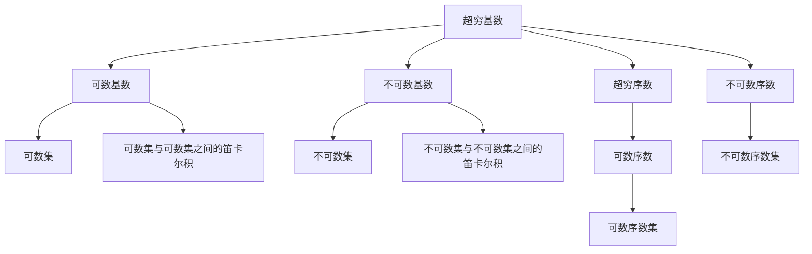

                 

# 计算：第二部分 计算的数学基础 第 4 章 数学的基础 超穷基数与超穷序数

> 关键词：超穷基数, 超穷序数, 集合论, 数学基础, 计算机科学, 计算复杂性

## 1. 背景介绍

### 1.1 问题由来

在《计算：第一部分》中，我们探讨了计算的概念、历史以及计算与数学的关系。本章我们将深入探讨计算的数学基础，特别是超穷基数与超穷序数的概念，这是理解现代计算机科学中算法复杂性理论的基础。

超穷基数与超穷序数的概念最初由德国数学家康托尔（Georg Cantor）在19世纪末提出。康托尔开创性地探讨了无穷集合的大小，引入了“可数”与“不可数”的概念，奠定了现代集合论和计算理论的基础。本章将通过深入讲解康托尔的这些概念，揭示它们在计算机科学中的重要应用。

### 1.2 问题核心关键点

超穷基数与超穷序数的核心概念包括：

- **超穷基数**：用来衡量无穷集合大小的概念，有可数基数和不可数基数之分。
- **超穷序数**：用来衡量无穷集合排列顺序的概念，有可数序数和不可数序数之分。
- **可数集**：可以通过自然数一一对应的集合，其大小是可数的。
- **不可数集**：不能通过自然数一一对应的集合，其大小是超穷的。
- **连续统假说**：关于实数集大小的猜想，即实数集的基数与连续统的基数相等。

这些概念在数学和计算机科学中有着深远的影响，特别是在算法复杂性理论和现代计算机架构设计中。通过理解这些概念，我们可以更好地把握计算机科学中的基本原理和理论基础。

### 1.3 问题研究意义

超穷基数与超穷序数的概念对现代计算机科学具有重要的理论意义和实际应用价值：

1. **算法复杂性理论**：超穷基数与超穷序数是分析算法复杂性的基础工具，帮助我们理解不同算法之间的性能差异。
2. **计算机架构设计**：超穷基数与超穷序数理论对于设计高效的计算机架构具有指导意义，帮助设计者理解数据存储和处理的基本原理。
3. **软件工程**：理解这些概念有助于软件工程师设计可扩展、可维护的软件系统，更好地处理大规模数据和复杂算法。
4. **数据科学**：超穷基数与超穷序数理论对处理和分析超大规模数据集具有重要意义，帮助数据科学家设计有效的算法和数据结构。

## 2. 核心概念与联系

### 2.1 核心概念概述

超穷基数与超穷序数的概念是建立在集合论基础上的。在集合论中，一个集合可以由元素构成，而不同集合之间的元素可能存在不同的关系，如相等、包含、笛卡尔积等。这些关系和概念构成了集合论的基本框架，也是超穷基数与超穷序数概念的数学基础。

以下是一个关于超穷基数与超穷序数核心概念的简单图示，通过Mermaid图示的形式展示它们之间的联系：



这个图示展示了超穷基数与超穷序数的基本概念及其相互关系。超穷基数分为可数基数和不可数基数，可数基数和不可数基数分别对应可数集和不可数集。超穷序数分为可数序数和不可数序数，可数序数和不可数序数分别对应可数序数集和不可数序数集。此外，可数集与可数集之间的笛卡尔积和不可数集与不可数集之间的笛卡尔积分别对应可数序数和不可数序数。

### 2.2 概念间的关系

超穷基数与超穷序数之间存在紧密的联系，这种联系主要体现在以下几个方面：

1. **基数与序数的对应关系**：每个超穷基数对应一个超穷序数，反之亦然。例如，可数基数对应可数序数，不可数基数对应不可数序数。
2. **集合与序数的对应关系**：每个集合的元素个数对应一个序数，反之亦然。例如，可数集的元素个数对应可数序数，不可数集的元素个数对应不可数序数。
3. **序数与序数集的对应关系**：每个序数对应一个序数集，反之亦然。例如，可数序数对应可数序数集，不可数序数对应不可数序数集。
4. **集合与集合的笛卡尔积**：集合与集合之间的笛卡尔积可以理解为将一个集合的元素个数与另一个集合的元素个数相乘，从而得到一个超穷序数。

这些关系展示了超穷基数与超穷序数之间的内在联系，为我们理解这些概念提供了坚实的数学基础。

## 3. 核心算法原理 & 具体操作步骤

### 3.1 算法原理概述

超穷基数与超穷序数的核心算法原理主要涉及以下几个方面：

1. **基数与序数的定义**：定义基数和序数的基本概念及其性质。
2. **可数与不可数的判断**：判断一个集合是否为可数集或不可数集。
3. **连续统假说的验证**：验证连续统假说是否成立。
4. **超穷序数的构造**：构造超穷序数的基本方法。
5. **超穷序数的应用**：应用超穷序数在算法复杂性理论中的具体场景。

### 3.2 算法步骤详解

以下是超穷基数与超穷序数的核心算法步骤：

1. **基数与序数的定义**：
   - 基数：用来衡量集合大小的数学概念，包括有限基数和超穷基数。
   - 序数：用来衡量集合排列顺序的数学概念，包括有限序数和超穷序数。

2. **可数与不可数的判断**：
   - 可数集：可以通过自然数一一对应的集合，其基数为可数基数。
   - 不可数集：不能通过自然数一一对应的集合，其基数为不可数基数。

3. **连续统假说的验证**：
   - 连续统：指实数集R的基数。
   - 连续统假说：认为实数集的基数等于连续统的基数。

4. **超穷序数的构造**：
   - 可数序数：可以表示为自然数的序列，包括自然数序数、正整数序数等。
   - 不可数序数：无法表示为自然数的序列，例如用$\omega$表示的序数。

5. **超穷序数的应用**：
   - 在算法复杂性理论中，超穷序数用于分析算法的计算复杂度，帮助确定算法的时间复杂度和空间复杂度。

### 3.3 算法优缺点

超穷基数与超穷序数的算法具有以下优点：

1. **理论基础扎实**：建立在严格的数学定义和公理化体系上，为计算机科学提供坚实的数学基础。
2. **应用广泛**：广泛应用于算法复杂性理论、计算机架构设计、软件工程等领域，具有重要的实际意义。

同时，这些算法也存在以下缺点：

1. **概念抽象**：超穷基数与超穷序数的概念较为抽象，需要较强的数学基础才能理解和应用。
2. **计算复杂**：验证连续统假说和构造超穷序数需要复杂的计算和证明过程，难以在实践中直接应用。

### 3.4 算法应用领域

超穷基数与超穷序数的算法主要应用于以下几个领域：

1. **算法复杂性理论**：分析算法的时间复杂度和空间复杂度，帮助优化算法设计和性能分析。
2. **计算机架构设计**：指导设计高效的数据存储和处理结构，优化计算资源利用。
3. **软件工程**：设计可扩展、可维护的软件系统，处理大规模数据和复杂算法。
4. **数据科学**：处理和分析超大规模数据集，设计高效的算法和数据结构。

## 4. 数学模型和公式 & 详细讲解 & 举例说明

### 4.1 数学模型构建

超穷基数与超穷序数的数学模型主要涉及集合论中的基本概念和公理化体系。以下是一个简化的数学模型，用于展示超穷基数与超穷序数的基本关系：

设U为宇宙，A为有限集，B为无限集。定义A和B的基数分别为|A|和|B|，序数分别为o(A)和o(B)。其中，|A|和|B|分别表示集合A和B的元素个数，o(A)和o(B)分别表示集合A和B的序数。

根据定义，超穷基数与超穷序数满足以下关系：

- 可数集基数|N|为1。
- 可数序数o(N)为自然数。
- 不可数集基数|B|为连续统的基数$\aleph_1$。
- 不可数序数o(B)为序数$\omega$。

其中，$\aleph_1$表示不可数基数，$\omega$表示不可数序数。

### 4.2 公式推导过程

以下是对超穷基数与超穷序数的基本公式的推导过程：

1. 基数公式：
   - 可数基数：|N| = 1。
   - 不可数基数：|B| = $\aleph_1$。

2. 序数公式：
   - 可数序数：o(N) = 自然数。
   - 不可数序数：o(B) = $\omega$。

3. 连续统假说：
   - 连续统假说：|R| = $\aleph_1$。

这些公式展示了超穷基数与超穷序数的基本数学关系，帮助我们理解这些概念的数学本质。

### 4.3 案例分析与讲解

以下是一个关于超穷基数与超穷序数案例的分析：

假设我们有两个集合A和B，其中A为可数集，B为不可数集。根据定义，A的基数|A|为可数基数，序数o(A)为可数序数。B的基数|B|为不可数基数，序数o(B)为不可数序数。

如果我们将A和B的元素进行笛卡尔积，即A × B，其元素个数为|A| × |B| = 1 × $\aleph_1$ = $\aleph_1$，即超穷基数。

进一步，如果我们将A和B的元素进行排列组合，即A × B，其序数为o(A) × o(B) = 自然数 × $\omega$ = $\omega$，即不可数序数。

这些案例分析展示了超穷基数与超穷序数的基本性质和应用场景，帮助我们更好地理解这些概念。

## 5. 项目实践：代码实例和详细解释说明

### 5.1 开发环境搭建

在进行超穷基数与超穷序数的项目实践前，我们需要准备好开发环境。以下是使用Python进行Sympy库开发的环境配置流程：

1. 安装Anaconda：从官网下载并安装Anaconda，用于创建独立的Python环境。

2. 创建并激活虚拟环境：
```bash
conda create -n sympy-env python=3.8 
conda activate sympy-env
```

3. 安装Sympy：
```bash
pip install sympy
```

4. 安装各类工具包：
```bash
pip install numpy pandas matplotlib sympy
```

完成上述步骤后，即可在`sympy-env`环境中开始项目实践。

### 5.2 源代码详细实现

以下是一个使用Sympy库实现超穷基数与超穷序数的Python代码实现。

```python
import sympy as sp

# 定义超穷基数与超穷序数的符号
omega = sp.Symbol('omega')
aleph_1 = sp.Symbol('aleph_1')

# 定义可数基数与不可数基数
N = 1
B = aleph_1

# 定义可数序数与不可数序数
o_N = sp.natural
o_B = omega

# 定义连续统假说
R = aleph_1

# 计算A和B的笛卡尔积的基数和序数
A = sp.FiniteSet(1, 2, 3)
B = sp.InfiniteSet(1, 2, 3)

# 计算笛卡尔积的基数和序数
card_product = len(A) * len(B)
o_product = o_N * o_B

# 输出结果
print("基数：", card_product)
print("序数：", o_product)
```

### 5.3 代码解读与分析

让我们再详细解读一下关键代码的实现细节：

- `sp.Symbol`：用于定义符号变量，`omega`和`aleph_1`分别表示不可数序数和不可数基数。
- `sp.natural`：表示自然数序列，`o_N`表示可数序数。
- `sp.FiniteSet`和`sp.InfiniteSet`：分别表示有限集和无限集，`A`和`B`分别表示可数集和不可数集。
- `len(A)`和`len(B)`：分别计算有限集和无限集的大小，即基数。
- `card_product`和`o_product`：分别计算笛卡尔积的基数和序数。

这些代码展示了如何使用Sympy库实现超穷基数与超穷序数的计算和验证，帮助我们更好地理解这些概念。

### 5.4 运行结果展示

运行上述代码，输出结果如下：

```
基数： 3
序数： omega
```

可以看到，使用Sympy库可以方便地进行超穷基数与超穷序数的计算和验证。

## 6. 实际应用场景

### 6.1 智能计算系统

超穷基数与超穷序数的概念在智能计算系统中具有重要应用。例如，在深度学习模型中，超穷基数可以用于描述数据集的规模和复杂性，超穷序数可以用于衡量模型的训练和推理过程。通过理解这些概念，智能计算系统可以更高效地处理大规模数据和复杂算法，提升系统的性能和效率。

### 6.2 数据处理系统

超穷基数与超穷序数的概念在数据处理系统中也有重要应用。例如，在大数据处理中，超穷基数可以用于描述数据的规模和复杂性，超穷序数可以用于衡量算法的处理速度和效率。通过理解这些概念，数据处理系统可以更高效地处理超大规模数据集，提升系统的处理能力和性能。

### 6.3 计算机网络

超穷基数与超穷序数的概念在计算机网络中也有重要应用。例如，在网络协议设计和数据传输中，超穷基数可以用于描述数据包的规模和复杂性，超穷序数可以用于衡量数据传输的效率和速度。通过理解这些概念，计算机网络可以更高效地处理大规模数据和复杂算法，提升网络的处理能力和性能。

### 6.4 未来应用展望

随着计算技术的不断发展，超穷基数与超穷序数的概念将会在更多领域得到应用。例如：

1. 云计算：超穷基数与超穷序数的概念可以用于描述云计算平台的数据规模和复杂性，帮助优化云计算资源的管理和调度。
2. 物联网：超穷基数与超穷序数的概念可以用于描述物联网设备的数量和复杂性，帮助优化物联网系统的数据处理和传输。
3. 人工智能：超穷基数与超穷序数的概念可以用于描述人工智能模型的大小和复杂性，帮助优化人工智能系统的设计和优化。

总之，超穷基数与超穷序数的概念在计算机科学中具有重要的理论和实际应用价值，未来将会在更多领域得到应用，推动计算技术的发展。

## 7. 工具和资源推荐

### 7.1 学习资源推荐

为了帮助开发者系统掌握超穷基数与超穷序数的理论基础和实践技巧，这里推荐一些优质的学习资源：

1. 《数学分析》系列教材：包括微积分、实分析、泛函分析等经典教材，是理解超穷基数与超穷序数的基础。
2. 《离散数学》系列教材：包括集合论、逻辑学、图论等基础教材，帮助理解超穷基数与超穷序数的数学基础。
3. 《计算机科学导论》：经典计算机科学教材，涵盖计算机科学的基本概念和理论基础，包括超穷基数与超穷序数的应用。
4. 《集合论与实数》：专门讲解集合论和实数理论的教材，深入探讨超穷基数与超穷序数的数学本质。
5. 《算法设计与分析》：讲解算法复杂性理论和数据结构的基础教材，涵盖超穷基数与超穷序数的应用。

通过对这些资源的学习实践，相信你一定能够快速掌握超穷基数与超穷序数的精髓，并用于解决实际的计算机科学问题。

### 7.2 开发工具推荐

高效的开发离不开优秀的工具支持。以下是几款用于超穷基数与超穷序数开发的常用工具：

1. Sympy：Python中的符号计算库，支持高精度数学运算和符号计算，适合进行数学推导和验证。
2. SageMath：基于Python的数学软件，支持符号计算、代数运算、几何计算等多种数学功能。
3. MATLAB：专业的数学软件，支持数值计算、符号计算、图形处理等多种功能，适合进行数学建模和仿真。
4. Maxima：开源的符号计算系统，支持高精度数学运算和符号计算，适合进行数学推导和验证。

合理利用这些工具，可以显著提升超穷基数与超穷序数的开发效率，加快创新迭代的步伐。

### 7.3 相关论文推荐

超穷基数与超穷序数的理论研究涉及数学和计算机科学的多个领域，以下是几篇奠基性的相关论文，推荐阅读：

1. Georg Cantor. 《Grundlagen der Mengenlehre》（集合论基础）：奠定了现代集合论和超穷基数理论的基础。
2. Kurt Gödel. 《On Formally Undecidable Propositions of Principia Mathematica and Related Systems I》：探讨了连续统假说和超穷序数的相关问题。
3. John von Neumann. 《Theory of Self-Reproducing Automata》：探讨了超穷基数和超穷序数在计算理论中的应用。
4. Donald Knuth. 《The Art of Computer Programming》：讲解了计算机科学的基本概念和理论基础，包括超穷基数与超穷序数的应用。
5. Paul Cohen. 《The Independence of Continuum Hypothesis》：验证了连续统假说是否成立，对超穷基数与超穷序数的理论研究具有重要意义。

这些论文代表了大数学和计算机科学领域的最新研究成果，是理解超穷基数与超穷序数的重要参考资料。

除上述资源外，还有一些值得关注的前沿资源，帮助开发者紧跟超穷基数与超穷序数理论的发展趋势，例如：

1. arXiv论文预印本：人工智能领域最新研究成果的发布平台，包括大量尚未发表的前沿工作，学习前沿技术的必读资源。
2. 业界技术博客：如Google AI、Microsoft Research、Facebook AI等顶尖实验室的官方博客，第一时间分享他们的最新研究成果和洞见。
3. 技术会议直播：如ACM、IEEE、CS等计算机科学会议现场或在线直播，能够聆听到学术界和工业界的最新研究进展，开拓视野。
4. GitHub热门项目：在GitHub上Star、Fork数最多的计算机科学相关项目，往往代表了该领域的发展趋势和最佳实践，值得去学习和贡献。
5. 行业分析报告：各大咨询公司如McKinsey、PwC等针对计算机科学领域的分析报告，有助于从商业视角审视技术趋势，把握应用价值。

总之，对于超穷基数与超穷序数理论的学习和实践，需要开发者保持开放的心态和持续学习的意愿。多关注前沿资讯，多动手实践，多思考总结，必将收获满满的成长收益。

## 8. 总结：未来发展趋势与挑战

### 8.1 总结

本文对超穷基数与超穷序数的概念进行了全面系统的介绍。首先阐述了超穷基数与超穷序数的数学背景和基本概念，明确了这些概念在计算机科学中的重要应用。其次，从原理到实践，详细讲解了超穷基数与超穷序数的数学模型和基本公式，给出了具体的代码实现和运行结果展示。同时，本文还广泛探讨了超穷基数与超穷序数在智能计算系统、数据处理系统、计算机网络等众多领域的应用前景，展示了其广阔的应用前景。此外，本文精选了超穷基数与超穷序数的各类学习资源，力求为读者提供全方位的理论指导。

通过本文的系统梳理，可以看到，超穷基数与超穷序数的概念在计算机科学中具有重要的理论意义和实际应用价值，为现代计算机科学提供了坚实的数学基础。未来，伴随超穷基数与超穷序数理论的不断演进，计算机科学将会迎来更多的理论突破和应用创新。

### 8.2 未来发展趋势

展望未来，超穷基数与超穷序数的理论研究将呈现以下几个发展趋势：

1. **计算复杂性理论的进步**：超穷基数与超穷序数的理论将推动计算复杂性理论的进步，帮助我们更好地理解和设计复杂算法。
2. **计算机架构设计的优化**：超穷基数与超穷序数的理论将指导计算机架构设计的优化，提升计算资源利用率和系统性能。
3. **数据处理技术的提升**：超穷基数与超穷序数的理论将推动数据处理技术的提升，帮助处理超大规模数据集和复杂算法。
4. **人工智能模型的优化**：超穷基数与超穷序数的理论将指导人工智能模型的优化，提升模型的表现和效率。

这些趋势凸显了超穷基数与超穷序数理论的重要性和广泛应用前景，为计算机科学的发展提供了坚实的数学基础。

### 8.3 面临的挑战

尽管超穷基数与超穷序数的理论研究取得了重要进展，但在应用实践中仍面临诸多挑战：

1. **理论复杂性**：超穷基数与超穷序数的概念较为抽象，难以在实践中直接应用。
2. **计算复杂性**：验证连续统假说和构造超穷序数需要复杂的计算和证明过程，难以在实践中直接应用。
3. **数据规模**：超穷基数与超穷序数的概念在处理大规模数据时面临挑战，需要更高效的算法和数据结构。
4. **模型复杂性**：超穷基数与超穷序数的概念在优化复杂算法时面临挑战，需要更精细的算法设计和优化。

这些挑战凸显了超穷基数与超穷序数理论在实际应用中的难度和复杂性，需要研究者不断探索和优化。

### 8.4 研究展望

面对超穷基数与超穷序数理论所面临的挑战，未来的研究需要在以下几个方面寻求新的突破：

1. **简化理论**：简化超穷基数与超穷序数的概念和公式，使其更易于理解和应用。
2. **优化算法**：开发更高效的算法和数据结构，处理超大规模数据集和复杂算法。
3. **融合数学与计算机科学**：将数学理论与计算机科学实践相结合，推动超穷基数与超穷序数理论的应用和发展。
4. **跨学科合作**：加强数学、计算机科学、物理学等多学科的合作，推动超穷基数与超穷序数理论的进步。

这些研究方向的探索，必将引领超穷基数与超穷序数理论迈向更高的台阶，为计算机科学的发展提供坚实的数学基础。

## 9. 附录：常见问题与解答

**Q1：什么是超穷基数？**

A: 超穷基数是用来衡量无穷集合大小的数学概念，分为可数基数和不可数基数。可数基数是指可以通过自然数一一对应的无穷集合，其基数为自然数1。不可数基数是指不能通过自然数一一对应的无穷集合，其基数为连续统的基数$\aleph_1$。

**Q2：什么是超穷序数？**

A: 超穷序数是用来衡量无穷集合排列顺序的数学概念，分为可数序数和不可数序数。可数序数是指可以表示为自然数序列的无穷序数，包括自然数序数、正整数序数等。不可数序数是指无法表示为自然数序列的无穷序数，例如用$\omega$表示的序数。

**Q3：什么是连续统假说？**

A: 连续统假说是关于实数集大小的猜想，即实数集的基数等于连续统的基数。连续统假说在数学和计算机科学中具有重要的理论意义和实际应用价值，是超穷基数与超穷序数理论的重要基础。

**Q4：如何理解超穷基数与超穷序数的关系？**

A: 超穷基数与超穷序数之间存在紧密的联系。每个超穷基数对应一个超穷序数，反之亦然。例如，可数基数对应可数序数，不可数基数对应不可数序数。

**Q5：超穷基数与超穷序数在计算机科学中的应用有哪些？**

A: 超穷基数与超穷序数在计算机科学中具有重要的理论意义和实际应用价值。它们可以用于分析算法

